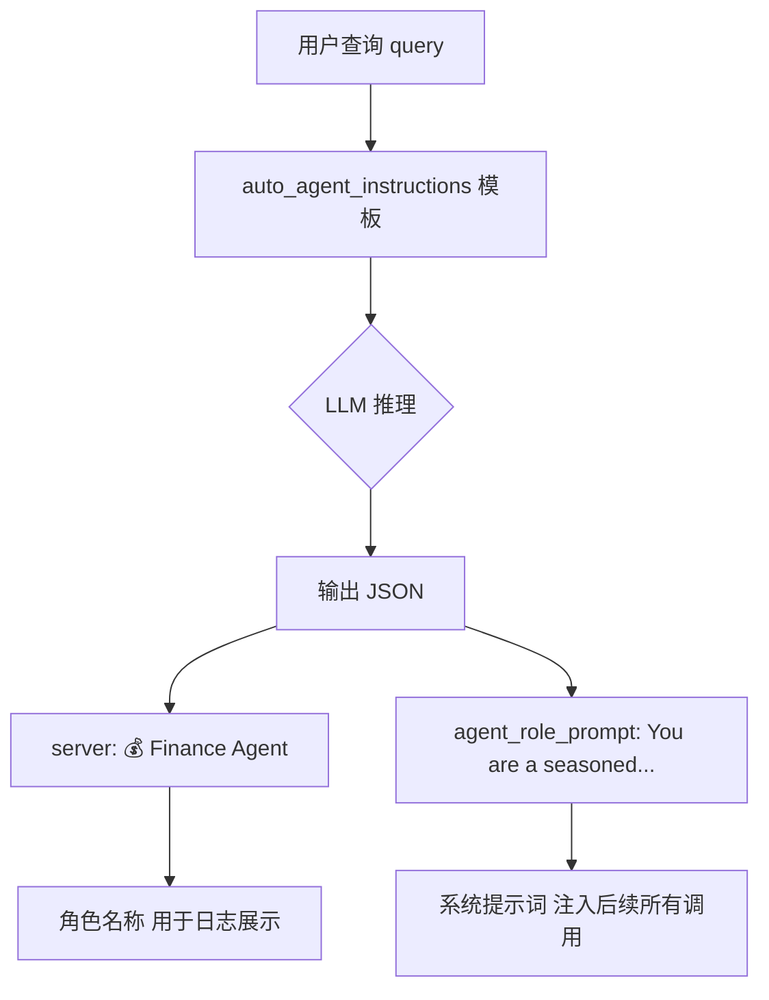
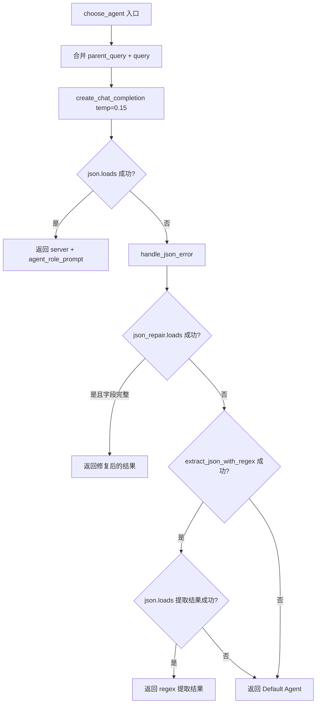

# PD-315.01 GPT-Researcher — LLM 驱动动态 Agent 角色生成与 JSON 容错解析

> 文档编号：PD-315.01
> 来源：GPT-Researcher `gpt_researcher/actions/agent_creator.py`, `gpt_researcher/prompts.py`
> GitHub：https://github.com/assafelovic/gpt-researcher.git
> 问题域：PD-315 动态 Agent 角色生成 Dynamic Agent Role Generation
> 状态：可复用方案

---

## 第 1 章 问题与动机

### 1.1 核心问题

在通用研究型 Agent 系统中，用户查询的领域千差万别——金融、旅游、医学、法律、技术等。如果使用固定的系统提示词（system prompt），Agent 的回答风格和专业深度无法匹配查询领域的需求。核心挑战在于：

1. **领域适配**：不同查询需要不同领域专家的视角和术语体系
2. **角色提示词质量**：手工维护数百个领域角色模板不可扩展
3. **LLM 输出不可靠**：LLM 生成的 JSON 经常格式错误（多余逗号、缺引号、markdown 包裹等）
4. **零停机要求**：角色生成失败不能阻塞整个研究流程

### 1.2 GPT-Researcher 的解法概述

GPT-Researcher 采用"LLM 自选专家"模式，在每次研究任务启动时动态生成匹配的 Agent 角色：

1. **查询驱动的角色生成**：将用户查询发送给 LLM，由 LLM 自主判断最适合的专家角色和对应的系统提示词（`agent_creator.py:18-56`）
2. **Few-shot 示例引导**：通过 `auto_agent_instructions()` 提供 3 个领域示例（金融、商业、旅游），引导 LLM 输出标准 JSON 格式（`prompts.py:486-511`）
3. **三层容错解析**：`json.loads` → `json_repair.loads` → `regex 提取` 三级降级链处理 LLM 输出的格式问题（`agent_creator.py:58-126`）
4. **默认角色兜底**：所有解析都失败时回退到通用"批判性思维研究助手"角色（`agent_creator.py:104-107`）
5. **角色全链路传播**：生成的 `agent_role_prompt` 作为 system message 注入到后续所有 LLM 调用中（搜索规划、报告撰写、结论生成等）

### 1.3 设计思想

| 设计原则 | 具体实现 | 理由 | 替代方案 |
|----------|----------|------|----------|
| 查询驱动而非配置驱动 | LLM 分析查询内容自动选择角色 | 无需维护领域枚举表，天然支持长尾领域 | 关键词匹配 + 角色映射表 |
| Few-shot 而非 Fine-tune | 3 个示例 + JSON 格式约束 | 零训练成本，即时生效，易于扩展示例 | 微调专用分类模型 |
| 防御性解析 | 三层降级：标准 JSON → json_repair → regex | LLM 输出格式不可控，必须多层兜底 | 强制 function calling |
| 优雅降级 | 默认 "Default Agent" 角色 | 角色生成是增强而非必需，失败不应阻塞 | 抛异常中断流程 |
| 低温度生成 | temperature=0.15 | 角色选择需要确定性，不需要创造性 | 高温度 + 多次采样投票 |

---

## 第 2 章 源码实现分析

### 2.1 架构概览

GPT-Researcher 的动态角色生成系统由三个核心组件构成：Prompt 模板（`prompts.py`）、角色创建器（`agent_creator.py`）、以及调用方（`agent.py` + `researcher.py`）。

```
┌─────────────────────────────────────────────────────────────┐
│                    GPTResearcher.conduct_research()          │
│                         agent.py:351-368                     │
├─────────────────────────────────────────────────────────────┤
│  if not (self.agent and self.role):                          │
│      self.agent, self.role = await choose_agent(...)         │
│                                                              │
│  ┌──────────────────────────────────────────────────────┐   │
│  │              choose_agent()                           │   │
│  │          agent_creator.py:18-62                        │   │
│  │                                                        │   │
│  │  1. 构建 prompt: auto_agent_instructions()            │   │
│  │  2. LLM 调用: create_chat_completion(temp=0.15)       │   │
│  │  3. 解析: json.loads(response)                        │   │
│  │     ↓ 失败                                            │   │
│  │  4. handle_json_error(response)                       │   │
│  │     ├─ json_repair.loads()                            │   │
│  │     ├─ extract_json_with_regex()                      │   │
│  │     └─ 默认 "Default Agent"                           │   │
│  └──────────────────────────────────────────────────────┘   │
│                          ↓                                   │
│  self.role → 注入到所有后续 LLM 调用的 system message        │
│  ├─ plan_research_outline()  query_processing.py:115        │
│  ├─ write_report_introduction()  report_generation.py:15    │
│  ├─ write_report()  report_generation.py:66                 │
│  └─ write_report_conclusion()  report_generation.py:212     │
└─────────────────────────────────────────────────────────────┘
```

### 2.2 核心实现

#### 2.2.1 角色生成 Prompt 设计



对应源码 `gpt_researcher/prompts.py:486-511`：

```python
@staticmethod
def auto_agent_instructions():
    return """
This task involves researching a given topic, regardless of its complexity or the availability of a definitive answer. The research is conducted by a specific server, defined by its type and role, with each server requiring distinct instructions.
Agent
The server is determined by the field of the topic and the specific name of the server that could be utilized to research the topic provided. Agents are categorized by their area of expertise, and each server type is associated with a corresponding emoji.

examples:
task: "should I invest in apple stocks?"
response:
{
    "server": "💰 Finance Agent",
    "agent_role_prompt: "You are a seasoned finance analyst AI assistant. Your primary goal is to compose comprehensive, astute, impartial, and methodically arranged financial reports based on provided data and trends."
}
task: "could reselling sneakers become profitable?"
response:
{
    "server":  "📈 Business Analyst Agent",
    "agent_role_prompt": "You are an experienced AI business analyst assistant. Your main objective is to produce comprehensive, insightful, impartial, and systematically structured business reports based on provided business data, market trends, and strategic analysis."
}
task: "what are the most interesting sites in Tel Aviv?"
response:
{
    "server":  "🌍 Travel Agent",
    "agent_role_prompt": "You are a world-travelled AI tour guide assistant. Your main purpose is to draft engaging, insightful, unbiased, and well-structured travel reports on given locations, including history, attractions, and cultural insights."
}
"""
```

关键设计点：
- **Emoji 标识**：每个角色带 emoji 前缀，便于日志和 UI 展示（`prompts.py:491`）
- **JSON 格式示例**：通过 3 个完整的 task→response 示例教会 LLM 输出格式（`prompts.py:494-511`）
- **角色提示词模板**：每个示例的 `agent_role_prompt` 都遵循 "You are a [经验描述] AI [角色] assistant. Your [目标描述]" 的统一句式

#### 2.2.2 角色选择与三层容错



对应源码 `gpt_researcher/actions/agent_creator.py:18-62`：

```python
async def choose_agent(
    query,
    cfg,
    parent_query=None,
    cost_callback: callable = None,
    headers=None,
    prompt_family: type[PromptFamily] | PromptFamily = PromptFamily,
    **kwargs
):
    query = f"{parent_query} - {query}" if parent_query else f"{query}"
    response = None  # Initialize response to ensure it's defined

    try:
        response = await create_chat_completion(
            model=cfg.smart_llm_model,
            messages=[
                {"role": "system", "content": f"{prompt_family.auto_agent_instructions()}"},
                {"role": "user", "content": f"task: {query}"},
            ],
            temperature=0.15,
            llm_provider=cfg.smart_llm_provider,
            llm_kwargs=cfg.llm_kwargs,
            cost_callback=cost_callback,
            **kwargs
        )
        agent_dict = json.loads(response)
        return agent_dict["server"], agent_dict["agent_role_prompt"]
    except Exception as e:
        return await handle_json_error(response)
```

三层容错处理 `agent_creator.py:65-127`：

```python
async def handle_json_error(response: str | None):
    # 第一层：json_repair 库修复常见格式问题
    try:
        agent_dict = json_repair.loads(response)
        if agent_dict.get("server") and agent_dict.get("agent_role_prompt"):
            return agent_dict["server"], agent_dict["agent_role_prompt"]
    except Exception as e:
        error_type = type(e).__name__
        error_msg = str(e)
        logger.warning(
            f"Failed to parse agent JSON with json_repair: {error_type}: {error_msg}",
            exc_info=True
        )
        if response:
            logger.debug(f"LLM response that failed to parse: {response[:500]}...")

    # 第二层：regex 提取第一个 JSON 对象
    json_string = extract_json_with_regex(response)
    if json_string:
        try:
            json_data = json.loads(json_string)
            return json_data["server"], json_data["agent_role_prompt"]
        except json.JSONDecodeError as e:
            logger.warning(
                f"Failed to decode JSON from regex extraction: {str(e)}",
                exc_info=True
            )

    # 第三层：默认角色兜底
    logger.info("No valid JSON found in LLM response. Falling back to default agent.")
    return "Default Agent", (
        "You are an AI critical thinker research assistant. Your sole purpose is to write well written, "
        "critically acclaimed, objective and structured reports on given text."
    )


def extract_json_with_regex(response: str | None) -> str | None:
    if not response:
        return None
    json_match = re.search(r"{.*?}", response, re.DOTALL)
    if json_match:
        return json_match.group(0)
    return None
```

### 2.3 实现细节

#### 角色全链路传播

生成的角色不仅用于日志展示，更作为 system message 贯穿整个研究流程：

1. **研究规划阶段**：`plan_research_outline()` 接收 `agent_role_prompt` 参数（`query_processing.py:115`）
2. **报告撰写阶段**：`ReportGenerator` 初始化时从 `researcher.role` 获取角色（`writer.py:40`），优先使用配置中的 `cfg.agent_role`，回退到动态生成的 `researcher.role`
3. **报告生成调用**：`write_report_introduction()`、`generate_report()` 等函数将 `agent_role_prompt` 作为 system message 注入（`report_generation.py:41`）

```python
# writer.py:38-40 — 角色优先级：配置 > 动态生成
self.research_params = {
    "agent_role_prompt": self.researcher.cfg.agent_role or self.researcher.role,
    ...
}

# report_generation.py:38-41 — 角色注入到 LLM 调用
introduction = await create_chat_completion(
    messages=[
        {"role": "system", "content": f"{agent_role_prompt}"},
        {"role": "user", "content": prompt_family.generate_report_introduction(...)},
    ],
    ...
)
```

#### 条件触发机制

角色生成并非每次都执行。`GPTResearcher` 构造函数接受可选的 `agent` 和 `role` 参数（`agent.py:67-68`），允许调用方预设角色。只有当两者都为空时才触发动态生成（`agent.py:351`）：

```python
# agent.py:351-364
if not (self.agent and self.role):
    self.agent, self.role = await choose_agent(
        query=self.query,
        cfg=self.cfg,
        parent_query=self.parent_query,
        cost_callback=self.add_costs,
        ...
    )
```

这种设计使得子任务（subtopic report）可以复用父任务的角色，避免重复的 LLM 调用。

---

## 第 3 章 迁移指南

### 3.1 迁移清单

#### 阶段一：核心角色生成（1 个文件）

- [ ] 创建 `agent_role_selector.py`，实现 `choose_agent_role(query, llm_client)` 函数
- [ ] 编写 few-shot prompt 模板，包含 3-5 个领域示例
- [ ] 安装 `json-repair` 库（`pip install json-repair`）
- [ ] 实现三层 JSON 解析降级链
- [ ] 定义默认角色常量

#### 阶段二：角色传播集成（修改现有代码）

- [ ] 在 Agent 主类中添加 `role` 属性，支持构造函数预设
- [ ] 在研究/生成流程入口添加条件触发逻辑（`if not self.role`）
- [ ] 将 `role` 作为 system message 注入到所有下游 LLM 调用

#### 阶段三：可观测性（可选）

- [ ] 记录角色选择日志（选了什么角色、是否触发了降级）
- [ ] 追踪角色生成的 token 消耗和延迟

### 3.2 适配代码模板

以下是一个可直接复用的最小实现：

```python
"""Dynamic agent role selector — 从 GPT-Researcher 提炼的可移植模块"""

import json
import re
import logging
from typing import Tuple, Optional

try:
    import json_repair
    HAS_JSON_REPAIR = True
except ImportError:
    HAS_JSON_REPAIR = False

logger = logging.getLogger(__name__)

# ── 默认角色 ──────────────────────────────────────────────
DEFAULT_AGENT_NAME = "Default Agent"
DEFAULT_AGENT_ROLE = (
    "You are an AI critical thinker research assistant. "
    "Your sole purpose is to write well written, critically acclaimed, "
    "objective and structured reports on given text."
)

# ── Few-shot Prompt ───────────────────────────────────────
ROLE_SELECTION_PROMPT = """
You must select the most appropriate expert agent for the given research task.
Each agent has a name (with emoji) and a role prompt describing their expertise.

Examples:
task: "should I invest in apple stocks?"
response:
{
    "agent_name": "💰 Finance Agent",
    "agent_role": "You are a seasoned finance analyst AI assistant. Your primary goal is to compose comprehensive, impartial financial reports based on provided data and trends."
}

task: "what causes migraines?"
response:
{
    "agent_name": "🏥 Medical Research Agent",
    "agent_role": "You are a medical research AI assistant with expertise in clinical literature. Your goal is to provide evidence-based, well-structured medical research summaries."
}

task: "explain quantum computing basics"
response:
{
    "agent_name": "🔬 Science Agent",
    "agent_role": "You are a science educator AI assistant. Your goal is to explain complex scientific concepts in clear, accurate, and well-structured reports."
}

Respond with ONLY a JSON object containing "agent_name" and "agent_role".
"""


async def choose_agent_role(
    query: str,
    llm_call,  # async callable: (messages, temperature) -> str
    parent_query: str = "",
) -> Tuple[str, str]:
    """
    动态选择 Agent 角色。

    Args:
        query: 用户查询
        llm_call: 异步 LLM 调用函数，签名 (messages: list, temperature: float) -> str
        parent_query: 父查询（子任务场景）

    Returns:
        (agent_name, agent_role_prompt) 元组
    """
    full_query = f"{parent_query} - {query}" if parent_query else query
    response = None

    try:
        response = await llm_call(
            messages=[
                {"role": "system", "content": ROLE_SELECTION_PROMPT},
                {"role": "user", "content": f"task: {full_query}"},
            ],
            temperature=0.15,
        )
        agent_dict = json.loads(response)
        return agent_dict["agent_name"], agent_dict["agent_role"]
    except Exception:
        return _handle_json_error(response)


def _handle_json_error(response: Optional[str]) -> Tuple[str, str]:
    """三层降级 JSON 解析"""
    # 第一层：json_repair
    if HAS_JSON_REPAIR and response:
        try:
            agent_dict = json_repair.loads(response)
            name = agent_dict.get("agent_name") or agent_dict.get("server")
            role = agent_dict.get("agent_role") or agent_dict.get("agent_role_prompt")
            if name and role:
                logger.info(f"Recovered agent via json_repair: {name}")
                return name, role
        except Exception:
            pass

    # 第二层：regex 提取
    if response:
        match = re.search(r"\{.*?\}", response, re.DOTALL)
        if match:
            try:
                data = json.loads(match.group(0))
                name = data.get("agent_name") or data.get("server")
                role = data.get("agent_role") or data.get("agent_role_prompt")
                if name and role:
                    logger.info(f"Recovered agent via regex: {name}")
                    return name, role
            except json.JSONDecodeError:
                pass

    # 第三层：默认角色
    logger.info("Falling back to default agent role")
    return DEFAULT_AGENT_NAME, DEFAULT_AGENT_ROLE
```

### 3.3 适用场景

| 场景 | 适用度 | 说明 |
|------|--------|------|
| 通用研究/写作 Agent | ⭐⭐⭐ | 查询领域多变，角色适配价值最高 |
| 多领域客服 Agent | ⭐⭐⭐ | 不同问题路由到不同专家角色 |
| 单领域专用 Agent | ⭐ | 领域固定，直接硬编码角色即可 |
| 高并发低延迟场景 | ⭐⭐ | 额外一次 LLM 调用增加延迟，可缓存热门查询的角色 |
| 多轮对话 Agent | ⭐⭐ | 首轮选角色后复用，避免每轮重选 |

---

## 第 4 章 测试用例

```python
"""Tests for dynamic agent role selection — based on GPT-Researcher's agent_creator.py"""

import json
import pytest
from unittest.mock import AsyncMock


# ── 被测模块（使用 3.2 节的适配代码）──────────────────────
# from your_module.agent_role_selector import choose_agent_role, _handle_json_error


class TestChooseAgentRole:
    """测试动态角色选择主流程"""

    @pytest.mark.asyncio
    async def test_normal_json_response(self):
        """正常 JSON 响应 → 直接解析成功"""
        mock_llm = AsyncMock(return_value=json.dumps({
            "agent_name": "💰 Finance Agent",
            "agent_role": "You are a seasoned finance analyst."
        }))
        name, role = await choose_agent_role("should I invest in AAPL?", mock_llm)
        assert name == "💰 Finance Agent"
        assert "finance" in role.lower()

    @pytest.mark.asyncio
    async def test_parent_query_concatenation(self):
        """子任务场景：parent_query + query 拼接"""
        mock_llm = AsyncMock(return_value=json.dumps({
            "agent_name": "🔬 Science Agent",
            "agent_role": "You are a science educator."
        }))
        await choose_agent_role("quantum basics", mock_llm, parent_query="physics overview")
        call_args = mock_llm.call_args
        user_msg = call_args[1]["messages"][1]["content"] if "messages" in call_args[1] else call_args[0][0][1]["content"]
        assert "physics overview - quantum basics" in user_msg

    @pytest.mark.asyncio
    async def test_malformed_json_recovery(self):
        """LLM 返回格式错误的 JSON → json_repair 修复"""
        # 缺少引号的 JSON
        mock_llm = AsyncMock(return_value='{agent_name: "💰 Finance Agent", agent_role: "You are a finance analyst."}')
        name, role = await choose_agent_role("stock analysis", mock_llm)
        # json_repair 应能修复，或降级到 regex/默认
        assert name is not None
        assert role is not None

    @pytest.mark.asyncio
    async def test_llm_returns_markdown_wrapped_json(self):
        """LLM 返回 markdown 包裹的 JSON → regex 提取"""
        mock_llm = AsyncMock(return_value='```json\n{"agent_name": "🏥 Medical Agent", "agent_role": "You are a medical expert."}\n```')
        name, role = await choose_agent_role("migraine causes", mock_llm)
        assert name is not None

    @pytest.mark.asyncio
    async def test_llm_failure_returns_default(self):
        """LLM 调用异常 → 回退到默认角色"""
        mock_llm = AsyncMock(side_effect=Exception("API timeout"))
        name, role = await choose_agent_role("any query", mock_llm)
        assert name == "Default Agent"
        assert "critical thinker" in role.lower()

    @pytest.mark.asyncio
    async def test_empty_response_returns_default(self):
        """LLM 返回空字符串 → 回退到默认角色"""
        mock_llm = AsyncMock(return_value="")
        name, role = await choose_agent_role("any query", mock_llm)
        assert name == "Default Agent"

    @pytest.mark.asyncio
    async def test_none_response_returns_default(self):
        """LLM 返回 None → 回退到默认角色"""
        mock_llm = AsyncMock(return_value=None)
        name, role = await choose_agent_role("any query", mock_llm)
        assert name == "Default Agent"


class TestHandleJsonError:
    """测试三层 JSON 容错解析"""

    def test_json_repair_fixes_trailing_comma(self):
        """json_repair 修复尾逗号"""
        response = '{"agent_name": "Agent", "agent_role": "Role",}'
        name, role = _handle_json_error(response)
        assert name == "Agent"
        assert role == "Role"

    def test_regex_extracts_embedded_json(self):
        """regex 从混合文本中提取 JSON"""
        response = 'Here is the agent:\n{"agent_name": "🔬 Science", "agent_role": "Expert"}\nDone.'
        name, role = _handle_json_error(response)
        assert name == "🔬 Science"

    def test_completely_invalid_returns_default(self):
        """完全无效内容 → 默认角色"""
        name, role = _handle_json_error("This is not JSON at all")
        assert name == "Default Agent"

    def test_none_input_returns_default(self):
        """None 输入 → 默认角色"""
        name, role = _handle_json_error(None)
        assert name == "Default Agent"
```

---

## 第 5 章 跨域关联

| 关联域 | 关系类型 | 说明 |
|--------|----------|------|
| PD-01 上下文管理 | 协同 | 动态生成的角色提示词占用上下文窗口，需要与上下文压缩策略协调；角色提示词长度应控制在合理范围 |
| PD-03 容错与重试 | 依赖 | 角色生成的三层 JSON 解析降级链本身就是 PD-03 容错模式的典型应用；`json_repair` → `regex` → `default` 是分层降级的教科书实现 |
| PD-04 工具系统 | 协同 | 角色选择可以影响工具权限——不同领域的 Agent 可能需要不同的工具集（如金融 Agent 需要股票 API 工具） |
| PD-10 中间件管道 | 协同 | 角色生成可以作为中间件管道的第一个节点，在请求进入主流程前完成角色注入 |
| PD-11 可观测性 | 协同 | 角色选择事件通过 `_log_event("action", action="choose_agent")` 记录，是可观测性链路的一部分（`agent.py:352`） |
| PD-12 推理增强 | 协同 | 动态角色本质上是一种推理增强——通过领域专家角色提升 LLM 在特定领域的推理质量 |

---

## 第 6 章 来源文件索引

| 文件 | 行范围 | 关键实现 |
|------|--------|----------|
| `gpt_researcher/actions/agent_creator.py` | L1-L127 | 完整的角色选择模块：`choose_agent()`、`handle_json_error()`、`extract_json_with_regex()` |
| `gpt_researcher/prompts.py` | L486-L511 | `auto_agent_instructions()` few-shot prompt 模板，3 个领域示例 |
| `gpt_researcher/agent.py` | L67-L68 | `GPTResearcher.__init__()` 中 `agent` 和 `role` 可选参数定义 |
| `gpt_researcher/agent.py` | L351-L368 | 条件触发角色生成：`if not (self.agent and self.role)` |
| `gpt_researcher/skills/researcher.py` | L119-L127 | `ResearchConductor.conduct_research()` 中的角色生成调用 |
| `gpt_researcher/skills/writer.py` | L38-L40 | `ReportGenerator` 角色优先级：`cfg.agent_role or researcher.role` |
| `gpt_researcher/actions/report_generation.py` | L15-L41 | `write_report_introduction()` 将角色注入 system message |
| `gpt_researcher/actions/report_generation.py` | L66-L92 | `generate_report()` 将角色注入 system message |
| `gpt_researcher/actions/report_generation.py` | L212-L278 | `write_report_conclusion()` 将角色注入 system message |
| `gpt_researcher/actions/query_processing.py` | L112-L129 | `plan_research_outline()` 接收 `agent_role_prompt` 参数 |

---

## 第 7 章 横向对比维度

```json comparison_data
{
  "project": "GPT-Researcher",
  "dimensions": {
    "角色生成方式": "LLM 推理 + few-shot 示例，查询驱动自动选择专家角色",
    "角色粒度": "每次查询生成独立角色，含 emoji 标识 + 完整系统提示词",
    "JSON解析容错": "json.loads → json_repair → regex 三层降级链",
    "默认角色回退": "通用批判性思维研究助手，硬编码兜底",
    "角色传播范围": "全链路注入：搜索规划、报告撰写、结论生成等所有下游 LLM 调用",
    "条件触发": "仅当 agent 和 role 均为空时触发，支持预设角色跳过生成"
  }
}
```

### 域元数据补充

```json domain_metadata
{
  "solution_summary": "GPT-Researcher 通过 choose_agent 函数将查询发送给 LLM，由 few-shot 示例引导生成领域专家角色和系统提示词，三层 JSON 容错解析确保稳定性",
  "description": "LLM 自主推理选择领域专家角色，生成的角色提示词贯穿全链路所有下游调用",
  "sub_problems": [
    "角色全链路传播与优先级覆盖",
    "条件触发避免子任务重复生成角色"
  ],
  "best_practices": [
    "低温度(0.15)生成确保角色选择确定性",
    "构造函数预设角色参数支持子任务复用父角色"
  ]
}
```
