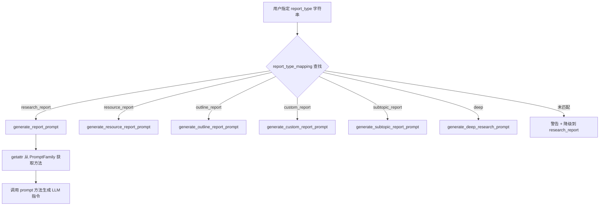
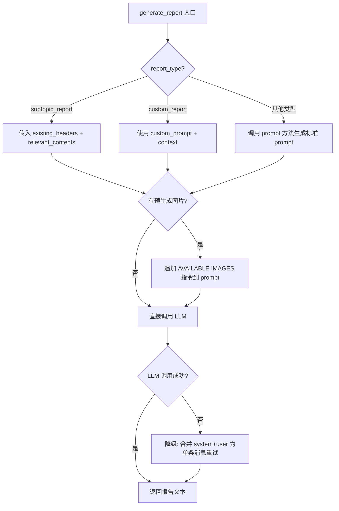
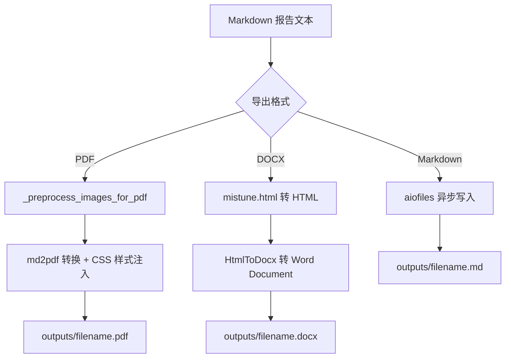

# PD-316.01 GPT-Researcher — 七类报告枚举路由与三格式导出管线

> 文档编号：PD-316.01
> 来源：GPT-Researcher `gpt_researcher/skills/writer.py`, `gpt_researcher/utils/enum.py`, `backend/utils.py`
> GitHub：https://github.com/assafelovic/gpt-researcher.git
> 问题域：PD-316 多格式报告生成 Multi-Format Report Generation
> 状态：可复用方案

---

## 第 1 章 问题与动机

### 1.1 核心问题

Agent 系统完成研究后，如何将非结构化的上下文信息转化为结构化、可消费的报告？这涉及三个层面的挑战：

1. **报告类型多样性** — 不同场景需要不同深度和结构的报告（概要 vs 详细 vs 大纲 vs 自定义），如何用统一架构支撑多种报告类型？
2. **内容组装复杂性** — 一份完整报告包含引言、目录、正文（可能含多个子主题）、结论、引用，各部分由不同 LLM 调用生成，如何编排组装顺序？
3. **多格式导出** — 同一份 Markdown 报告需要导出为 PDF（带样式）、Word（可编辑）、Markdown（原始格式），且需处理图片路径转换、CSS 样式注入等细节。
4. **AI 图片内联** — 报告中需要在合适位置嵌入 AI 生成的插图，涉及 LLM 分析→图片生成→Markdown 嵌入的完整管线。

### 1.2 GPT-Researcher 的解法概述

GPT-Researcher 采用 **枚举驱动的报告类型路由 + 分层内容组装 + 三格式导出管线** 的架构：

1. **ReportType 枚举 + report_type_mapping 字典** — 7 种报告类型通过枚举定义，`get_prompt_by_report_type()` 函数将报告类型映射到对应的 prompt 生成方法，实现类型安全的路由（`gpt_researcher/utils/enum.py:6-27`）
2. **ReportGenerator 技能类** — 封装引言/正文/结论/子主题的独立生成方法，每个方法独立调用 LLM，通过 `research_params` 字典统一传参（`gpt_researcher/skills/writer.py:20-253`）
3. **DetailedReport 编排器** — 对复杂报告实现"初始研究→子主题拆分→逐子主题研究+写作→组装"的多阶段流水线（`backend/report_type/detailed_report/detailed_report.py:10-179`）
4. **三格式导出函数** — `write_md_to_pdf()`（md2pdf + CSS）、`write_md_to_word()`（mistune + htmldocx）、`write_text_to_md()`（aiofiles），统一输出到 `outputs/` 目录（`backend/utils.py:62-130`）
5. **ImageGenerator 图片管线** — LLM 分析报告→识别可视化机会→Gemini/Imagen 并行生成→Markdown 内联嵌入（`gpt_researcher/skills/image_generator.py:20-767`）

### 1.3 设计思想

| 设计原则 | 具体实现 | 理由 | 替代方案 |
|----------|----------|------|----------|
| 枚举驱动路由 | `ReportType` 枚举 + `report_type_mapping` 字典映射到 prompt 方法名 | 类型安全，新增报告类型只需加枚举值+prompt方法 | if-else 链（不可扩展）、策略模式类（过度设计） |
| 内容分段生成 | 引言/正文/结论各自独立 LLM 调用，最后字符串拼接 | 每段可用不同 temperature，失败可独立重试 | 单次 LLM 生成全文（质量不可控） |
| Markdown 作为中间表示 | 所有报告先生成 Markdown，再转换为 PDF/DOCX | Markdown 是最通用的文本格式，转换工具链成熟 | 直接生成 HTML（丢失可编辑性） |
| 图片预生成策略 | 研究阶段预生成图片，写报告时通过 prompt 注入可用图片列表 | 避免报告写完后再插图导致位置不准 | 后处理插图（需要二次解析报告结构） |
| 双路径图片 URL | 每张图片同时保存 `url`（web路径）和 `absolute_url`（文件系统路径） | PDF 生成需要绝对路径，前端需要 web 路径 | 运行时动态转换（易出错） |

---

## 第 2 章 源码实现分析

### 2.1 架构概览

GPT-Researcher 的报告生成系统分为四层：

```
┌─────────────────────────────────────────────────────────────┐
│                    GPTResearcher (agent.py)                  │
│  ┌──────────────┐  ┌──────────────┐  ┌───────────────────┐  │
│  │ ReportGenerator│  │ImageGenerator│  │MarkdownProcessing│  │
│  │  (writer.py)  │  │(image_gen.py)│  │(markdown_proc.py)│  │
│  └──────┬───────┘  └──────┬───────┘  └────────┬──────────┘  │
│         │                 │                    │             │
│  ┌──────▼─────────────────▼────────────────────▼──────────┐  │
│  │              report_generation.py                       │  │
│  │  generate_report() / write_introduction() / write_conclusion()  │
│  └──────────────────────┬─────────────────────────────────┘  │
│                         │                                    │
│  ┌──────────────────────▼─────────────────────────────────┐  │
│  │              prompts.py (PromptFamily)                   │  │
│  │  report_type_mapping → prompt 方法路由                    │  │
│  └─────────────────────────────────────────────────────────┘  │
└─────────────────────────────────────────────────────────────┘
                          │
              ┌───────────▼───────────┐
              │   PublisherAgent      │
              │  (multi_agents/)      │
              │  generate_layout()    │
              │  write_report_by_formats() │
              └───────────┬───────────┘
                          │
          ┌───────────────┼───────────────┐
          ▼               ▼               ▼
    write_md_to_pdf  write_md_to_word  write_text_to_md
    (md2pdf+CSS)     (mistune+htmldocx) (aiofiles)
```

### 2.2 核心实现

#### 2.2.1 报告类型枚举与路由



对应源码 `gpt_researcher/prompts.py:848-872`：

```python
report_type_mapping = {
    ReportType.ResearchReport.value: "generate_report_prompt",
    ReportType.ResourceReport.value: "generate_resource_report_prompt",
    ReportType.OutlineReport.value: "generate_outline_report_prompt",
    ReportType.CustomReport.value: "generate_custom_report_prompt",
    ReportType.SubtopicReport.value: "generate_subtopic_report_prompt",
    ReportType.DeepResearch.value: "generate_deep_research_prompt",
}

def get_prompt_by_report_type(
    report_type: str,
    prompt_family: type[PromptFamily] | PromptFamily,
):
    prompt_by_type = getattr(prompt_family, report_type_mapping.get(report_type, ""), None)
    default_report_type = ReportType.ResearchReport.value
    if not prompt_by_type:
        warnings.warn(
            f"Invalid report type: {report_type}.\n"
            f"Using default report type: {default_report_type} prompt.",
            UserWarning,
        )
        prompt_by_type = getattr(prompt_family, report_type_mapping.get(default_report_type))
    return prompt_by_type
```

关键设计：`report_type_mapping` 将枚举值映射到 `PromptFamily` 的方法名字符串，`getattr` 动态获取方法。这使得新增报告类型只需：(1) 在 `ReportType` 枚举加值，(2) 在 `PromptFamily` 加对应方法，(3) 在 mapping 字典加一行。

#### 2.2.2 报告内容组装流水线



对应源码 `gpt_researcher/actions/report_generation.py:209-309`：

```python
async def generate_report(
    query, context, agent_role_prompt, report_type, tone,
    report_source, websocket, cfg, main_topic="",
    existing_headers=[], relevant_written_contents=[],
    cost_callback=None, custom_prompt="", headers=None,
    prompt_family=PromptFamily, available_images=None, **kwargs
):
    available_images = available_images or []
    generate_prompt = get_prompt_by_report_type(report_type, prompt_family)

    if report_type == "subtopic_report":
        content = f"{generate_prompt(query, existing_headers, ...)}"
    elif custom_prompt:
        content = f"{custom_prompt}\n\nContext: {context}"
    else:
        content = f"{generate_prompt(query, context, report_source, ...)}"

    # 图片注入：将预生成图片的 Markdown 语法直接写入 prompt
    if available_images:
        images_info = "\n".join([
            f"- Image {i+1}:  - {img.get('section_hint', 'General')}"
            for i, img in enumerate(available_images)
        ])
        content += f"\n\nAVAILABLE IMAGES:\n{images_info}\n..."

    try:
        report = await create_chat_completion(model=cfg.smart_llm_model, ...)
    except:
        # 降级：合并为单条消息重试（兼容不支持 system role 的模型）
        report = await create_chat_completion(
            messages=[{"role": "user", "content": f"{agent_role_prompt}\n\n{content}"}], ...
        )
    return report
```

#### 2.2.3 三格式导出管线



对应源码 `backend/utils.py:36-130`：

```python
def _preprocess_images_for_pdf(text: str) -> str:
    """将 /outputs/images/... 的 web URL 转为绝对文件路径，供 weasyprint 解析"""
    base_path = os.path.abspath(".")
    def replace_image_url(match):
        alt_text, url = match.group(1), match.group(2)
        if url.startswith("/outputs/"):
            abs_path = os.path.join(base_path, url.lstrip("/"))
            return f""
        return match.group(0)
    pattern = r'!\[([^\]]*)\]\((/outputs/[^)]+)\)'
    return re.sub(pattern, replace_image_url, text)

async def write_md_to_pdf(text: str, filename: str = "") -> str:
    file_path = f"outputs/{filename[:60]}.pdf"
    current_dir = os.path.dirname(os.path.abspath(__file__))
    css_path = os.path.join(current_dir, "styles", "pdf_styles.css")
    processed_text = _preprocess_images_for_pdf(text)
    base_url = os.path.abspath(".")
    from md2pdf.core import md2pdf
    md2pdf(file_path, md_content=processed_text, css_file_path=css_path, base_url=base_url)
    return urllib.parse.quote(file_path)

async def write_md_to_word(text: str, filename: str = "") -> str:
    file_path = f"outputs/{filename[:60]}.docx"
    from docx import Document
    from htmldocx import HtmlToDocx
    html = mistune.html(text)
    doc = Document()
    HtmlToDocx().add_html_to_document(html, doc)
    doc.save(file_path)
    return urllib.parse.quote(file_path)
```

### 2.3 实现细节

**DetailedReport 多阶段组装**（`backend/report_type/detailed_report/detailed_report.py:78-179`）：

DetailedReport 是最复杂的报告类型，实现了完整的多阶段流水线：

1. `_initial_research()` — 主查询研究，收集全局上下文
2. `_get_all_subtopics()` — LLM 拆分子主题
3. `_generate_subtopic_reports()` — 逐子主题创建独立 GPTResearcher 实例，每个子主题独立研究+写作，同时传入 `existing_headers` 避免内容重复
4. `_construct_detailed_report()` — 拼接：引言 + 目录 + 正文 + 结论 + 引用

```python
async def _construct_detailed_report(self, introduction, report_body):
    toc = self.gpt_researcher.table_of_contents(report_body)
    conclusion = await self.gpt_researcher.write_report_conclusion(report_body)
    conclusion_with_references = self.gpt_researcher.add_references(
        conclusion, self.gpt_researcher.visited_urls)
    report = f"{introduction}\n\n{toc}\n\n{report_body}\n\n{conclusion_with_references}"
    return report
```

**ImageGenerator 双模式图片嵌入**（`gpt_researcher/skills/image_generator.py:73-176, 635-767`）：

图片生成支持两种模式：
- **预生成模式** `plan_and_generate_images()` — 研究阶段分析上下文，LLM 规划 2-3 个可视化概念，`asyncio.gather` 并行生成，写报告时通过 prompt 注入
- **占位符模式** `process_image_placeholders()` — 报告中写 `[IMAGE: description]` 占位符，后处理时正则匹配并替换为实际图片

**PublisherAgent 布局生成**（`multi_agents/agents/publisher.py:22-53`）：

多 Agent 模式下，PublisherAgent 负责将 research_state 字典组装为最终布局：

```python
def generate_layout(self, research_state: dict):
    sections = []
    for subheader in research_state.get("research_data", []):
        if isinstance(subheader, dict):
            for key, value in subheader.items():
                sections.append(f"{value}")
        else:
            sections.append(f"{subheader}")
    sections_text = '\n\n'.join(sections)
    references = '\n'.join(f"{ref}" for ref in research_state.get("sources", []))
    layout = f"""# {headers.get('title')}
#### {headers.get("date")}: {research_state.get('date')}
## {headers.get("introduction")}
{research_state.get('introduction')}
## {headers.get("table_of_contents")}
{research_state.get('table_of_contents')}
{sections_text}
## {headers.get("conclusion")}
{research_state.get('conclusion')}
## {headers.get("references")}
{references}"""
    return layout
```


---

## 第 3 章 迁移指南

### 3.1 迁移清单

**阶段 1：报告类型路由（1 个文件）**

- [ ] 定义 `ReportType` 枚举，每种报告类型对应一个枚举值
- [ ] 创建 `report_type_mapping` 字典，映射枚举值到 prompt 生成函数名
- [ ] 实现 `get_prompt_by_report_type()` 路由函数，含降级到默认类型的逻辑
- [ ] 为每种报告类型编写对应的 prompt 模板方法

**阶段 2：内容组装管线（2-3 个文件）**

- [ ] 实现 `ReportGenerator` 类，封装 `write_introduction()`、`write_report()`、`write_conclusion()` 方法
- [ ] 每个方法独立调用 LLM，通过 `research_params` 字典统一传参
- [ ] 实现 `generate_report()` 核心函数，处理报告类型分支 + 图片注入 + LLM 降级重试
- [ ] 实现 Markdown 处理工具：`extract_headers()`、`table_of_contents()`、`add_references()`

**阶段 3：多格式导出（1 个文件）**

- [ ] 实现 `write_md_to_pdf()` — 依赖 `md2pdf`，需准备 CSS 样式文件
- [ ] 实现 `write_md_to_word()` — 依赖 `mistune` + `python-docx` + `htmldocx`
- [ ] 实现 `write_text_to_md()` — 异步文件写入
- [ ] 实现 `_preprocess_images_for_pdf()` — web URL 转绝对路径

**阶段 4：图片生成（可选，2 个文件）**

- [ ] 实现 `ImageGeneratorProvider` — 封装 Gemini/Imagen API
- [ ] 实现 `ImageGenerator` 技能类 — LLM 分析 + 并行生成 + Markdown 嵌入

### 3.2 适配代码模板

#### 最小可用的报告类型路由系统

```python
from enum import Enum
from typing import Callable, Dict

class ReportType(Enum):
    Research = "research"
    Summary = "summary"
    Outline = "outline"
    Custom = "custom"

# 报告类型 → prompt 生成函数的映射
report_type_mapping: Dict[str, str] = {
    ReportType.Research.value: "generate_research_prompt",
    ReportType.Summary.value: "generate_summary_prompt",
    ReportType.Outline.value: "generate_outline_prompt",
    ReportType.Custom.value: "generate_custom_prompt",
}

class PromptFamily:
    """Prompt 方法集合，每种报告类型对应一个方法"""

    @staticmethod
    def generate_research_prompt(query: str, context: str, **kwargs) -> str:
        return f"""Using the following information: "{context}"
Answer the query: "{query}" in a detailed research report.
The report should be well-structured with markdown headers (## ##)."""

    @staticmethod
    def generate_summary_prompt(query: str, context: str, **kwargs) -> str:
        return f"""Summarize the following information about "{query}":
{context}
Provide a concise summary with key findings."""

    @staticmethod
    def generate_outline_prompt(query: str, context: str, **kwargs) -> str:
        return f"""Create a structured outline for a report about "{query}":
{context}
Use markdown headers and bullet points."""

    @staticmethod
    def generate_custom_prompt(query: str, context: str, **kwargs) -> str:
        return f"{kwargs.get('custom_prompt', query)}\n\nContext: {context}"


def get_prompt_by_report_type(
    report_type: str,
    prompt_family: type = PromptFamily,
) -> Callable:
    """路由：报告类型 → prompt 生成方法，含降级逻辑"""
    method_name = report_type_mapping.get(report_type, "")
    prompt_fn = getattr(prompt_family, method_name, None)
    if not prompt_fn:
        # 降级到默认类型
        default_method = report_type_mapping[ReportType.Research.value]
        prompt_fn = getattr(prompt_family, default_method)
    return prompt_fn
```

#### 最小可用的三格式导出

```python
import os
import urllib.parse
from pathlib import Path

async def export_report(text: str, filename: str, fmt: str) -> str:
    """统一导出入口，支持 md/pdf/docx 三种格式"""
    output_dir = Path("outputs")
    output_dir.mkdir(exist_ok=True)
    safe_name = filename[:60]

    if fmt == "markdown":
        path = output_dir / f"{safe_name}.md"
        path.write_text(text, encoding="utf-8")
    elif fmt == "pdf":
        path = output_dir / f"{safe_name}.pdf"
        # 预处理图片路径：web URL → 绝对路径
        import re
        base = os.path.abspath(".")
        processed = re.sub(
            r'!\[([^\]]*)\]\((/outputs/[^)]+)\)',
            lambda m: f".lstrip('/'))})",
            text,
        )
        from md2pdf.core import md2pdf
        css_path = str(Path(__file__).parent / "styles" / "pdf_styles.css")
        md2pdf(str(path), md_content=processed, css_file_path=css_path, base_url=base)
    elif fmt == "docx":
        path = output_dir / f"{safe_name}.docx"
        import mistune
        from docx import Document
        from htmldocx import HtmlToDocx
        html = mistune.html(text)
        doc = Document()
        HtmlToDocx().add_html_to_document(html, doc)
        doc.save(str(path))
    else:
        raise ValueError(f"Unsupported format: {fmt}")

    return urllib.parse.quote(str(path))
```

### 3.3 适用场景

| 场景 | 适用度 | 说明 |
|------|--------|------|
| 研究型 Agent 输出报告 | ⭐⭐⭐ | 完美匹配：多类型报告 + 引用 + 导出 |
| 内容生成平台 | ⭐⭐⭐ | 枚举路由适合管理多种内容模板 |
| 企业知识库导出 | ⭐⭐ | PDF/Word 导出直接可用，但可能需要自定义模板 |
| 实时聊天 Agent | ⭐ | 报告生成是批处理模式，不适合实时对话 |
| 多语言报告 | ⭐⭐ | prompt 中支持 `language` 参数，但导出格式不含 i18n |

### 3.4 依赖清单

```
# 核心依赖
markdown>=3.4          # extract_headers 解析
mistune>=3.0           # Markdown → HTML（DOCX 导出用）
python-docx>=0.8       # Word 文档生成
htmldocx>=0.0.6        # HTML → DOCX 转换
md2pdf>=1.0            # Markdown → PDF（底层用 weasyprint）
aiofiles>=23.0         # 异步文件写入

# 可选：图片生成
google-genai>=0.5      # Gemini/Imagen 图片生成
Pillow>=10.0           # 图片裁剪（landscape 模式）
```

---

## 第 4 章 测试用例

```python
import pytest
from unittest.mock import AsyncMock, MagicMock, patch
from enum import Enum


# === 测试报告类型路由 ===

class TestReportTypeRouting:
    """测试 report_type_mapping + get_prompt_by_report_type 路由逻辑"""

    def test_valid_report_type_routes_to_correct_prompt(self):
        """正常路径：已知报告类型应路由到对应 prompt 方法"""
        from gpt_researcher.utils.enum import ReportType

        # 验证所有枚举值都在 mapping 中（除 DetailedReport 外，它走独立流程）
        expected_types = {
            "research_report", "resource_report", "outline_report",
            "custom_report", "subtopic_report", "deep",
        }
        actual_types = {rt.value for rt in ReportType}
        # DetailedReport 不在 mapping 中，它有独立的 DetailedReport 类
        assert expected_types.issubset(actual_types)

    def test_invalid_report_type_falls_back_to_default(self):
        """降级路径：未知报告类型应降级到 research_report"""
        from gpt_researcher.prompts import get_prompt_by_report_type, PromptFamily
        from gpt_researcher.config import Config

        config = Config()
        family = PromptFamily(config)
        with pytest.warns(UserWarning, match="Invalid report type"):
            prompt_fn = get_prompt_by_report_type("nonexistent_type", family)
        # 应返回 generate_report_prompt 方法
        assert prompt_fn is not None
        assert callable(prompt_fn)

    def test_report_type_mapping_completeness(self):
        """完整性：mapping 中的每个方法名在 PromptFamily 中都存在"""
        from gpt_researcher.prompts import report_type_mapping, PromptFamily
        from gpt_researcher.config import Config

        config = Config()
        family = PromptFamily(config)
        for report_type, method_name in report_type_mapping.items():
            method = getattr(family, method_name, None)
            assert method is not None, f"Missing method {method_name} for {report_type}"
            assert callable(method)


# === 测试 Markdown 处理 ===

class TestMarkdownProcessing:
    """测试 extract_headers / table_of_contents / add_references"""

    def test_extract_headers_nested(self):
        """正常路径：提取嵌套标题结构"""
        from gpt_researcher.actions.markdown_processing import extract_headers

        md = "## Introduction\n### Background\n## Methods\n### Data\n### Analysis"
        headers = extract_headers(md)
        assert len(headers) == 2  # 两个 h2
        assert headers[0]["text"] == "Introduction"
        assert "children" in headers[0]
        assert headers[0]["children"][0]["text"] == "Background"

    def test_table_of_contents_generation(self):
        """正常路径：生成目录"""
        from gpt_researcher.actions.markdown_processing import table_of_contents

        md = "## Section A\n### Sub A1\n## Section B"
        toc = table_of_contents(md)
        assert "Table of Contents" in toc
        assert "Section A" in toc
        assert "Sub A1" in toc

    def test_add_references_appends_urls(self):
        """正常路径：追加引用 URL 列表"""
        from gpt_researcher.actions.markdown_processing import add_references

        report = "# Report\nSome content."
        urls = {"https://example.com", "https://test.org"}
        result = add_references(report, urls)
        assert "## References" in result
        assert "https://example.com" in result

    def test_add_references_empty_urls(self):
        """边界情况：空 URL 集合"""
        from gpt_researcher.actions.markdown_processing import add_references

        report = "# Report"
        result = add_references(report, set())
        assert "## References" in result


# === 测试导出管线 ===

class TestExportPipeline:
    """测试三格式导出函数"""

    def test_preprocess_images_converts_web_urls(self):
        """正常路径：web URL 转绝对路径"""
        from backend.utils import _preprocess_images_for_pdf

        text = ""
        result = _preprocess_images_for_pdf(text)
        assert "/outputs/" not in result or os.path.isabs(result.split("(")[1].rstrip(")"))

    def test_preprocess_images_preserves_external_urls(self):
        """边界情况：外部 URL 不应被转换"""
        from backend.utils import _preprocess_images_for_pdf

        text = ""
        result = _preprocess_images_for_pdf(text)
        assert "https://example.com/image.png" in result

    @pytest.mark.asyncio
    async def test_write_text_to_md(self, tmp_path, monkeypatch):
        """正常路径：Markdown 文件写入"""
        monkeypatch.chdir(tmp_path)
        (tmp_path / "outputs").mkdir()
        from backend.utils import write_text_to_md

        path = await write_text_to_md("# Test Report\nContent here.", "test_report")
        assert "test_report" in path
        assert path.endswith(".md")
```


---

## 第 5 章 跨域关联

| 关联域 | 关系类型 | 说明 |
|--------|----------|------|
| PD-01 上下文管理 | 依赖 | 报告生成依赖研究阶段收集的 context，context 质量直接决定报告质量。`generate_report()` 的 `context` 参数来自上游的上下文管理 |
| PD-02 多 Agent 编排 | 协同 | DetailedReport 为每个子主题创建独立 GPTResearcher 实例，本质是多 Agent 编排。PublisherAgent 是多 Agent 流水线的最后一环 |
| PD-04 工具系统 | 协同 | ImageGenerator 作为一个 skill 挂载在 GPTResearcher 上，图片生成 provider 通过配置注入，遵循工具系统的注册模式 |
| PD-07 质量检查 | 协同 | 报告生成后可接入质量检查环节（如 Reviewer Agent），当前 GPT-Researcher 的 Tone 枚举和 APA 格式要求是内置的质量约束 |
| PD-11 可观测性 | 依赖 | `cost_callback` 参数贯穿所有 LLM 调用，用于追踪报告生成的 token 消耗和成本 |
| PD-12 推理增强 | 协同 | DeepResearch 报告类型本身就是推理增强的产物，使用更深层的多轮研究策略 |

---

## 第 6 章 来源文件索引

| 文件 | 行范围 | 关键实现 |
|------|--------|----------|
| `gpt_researcher/utils/enum.py` | L6-L27 | ReportType 枚举定义（7 种报告类型） |
| `gpt_researcher/utils/enum.py` | L54-L91 | Tone 枚举定义（17 种写作语气） |
| `gpt_researcher/prompts.py` | L258-L312 | `generate_report_prompt()` — 标准研究报告的 prompt 模板，含 APA 引用格式要求 |
| `gpt_researcher/prompts.py` | L848-L872 | `report_type_mapping` + `get_prompt_by_report_type()` — 报告类型路由核心 |
| `gpt_researcher/actions/report_generation.py` | L12-L60 | `write_report_introduction()` — 引言生成 |
| `gpt_researcher/actions/report_generation.py` | L63-L112 | `write_conclusion()` — 结论生成 |
| `gpt_researcher/actions/report_generation.py` | L209-L309 | `generate_report()` — 报告生成核心函数，含图片注入和 LLM 降级重试 |
| `gpt_researcher/skills/writer.py` | L20-L253 | `ReportGenerator` 类 — 报告写作技能封装 |
| `gpt_researcher/skills/image_generator.py` | L20-L44 | `ImageGenerator.__init__()` — 图片生成器初始化，含 provider 懒加载 |
| `gpt_researcher/skills/image_generator.py` | L73-L176 | `plan_and_generate_images()` — 预生成模式：LLM 规划 + asyncio.gather 并行生成 |
| `gpt_researcher/skills/image_generator.py` | L635-L767 | `process_image_placeholders()` — 占位符模式：正则匹配 `[IMAGE: ...]` 并替换 |
| `gpt_researcher/skills/image_generator.py` | L583-L625 | `_embed_images_in_report()` — 按 section header 匹配插入图片 Markdown |
| `gpt_researcher/llm_provider/image/image_generator.py` | L22-L441 | `ImageGeneratorProvider` — Gemini/Imagen 双模型图片生成 provider |
| `gpt_researcher/llm_provider/image/image_generator.py` | L156-L223 | `_build_enhanced_prompt()` — 暗色/亮色/自动三种风格的 prompt 增强 |
| `gpt_researcher/actions/markdown_processing.py` | L5-L39 | `extract_headers()` — 基于 markdown 库解析嵌套标题结构 |
| `gpt_researcher/actions/markdown_processing.py` | L68-L92 | `table_of_contents()` — 递归生成目录 |
| `gpt_researcher/actions/markdown_processing.py` | L94-L112 | `add_references()` — 追加引用 URL 列表 |
| `backend/utils.py` | L36-L59 | `_preprocess_images_for_pdf()` — web URL 转绝对路径 |
| `backend/utils.py` | L62-L97 | `write_md_to_pdf()` — md2pdf + CSS 样式注入 |
| `backend/utils.py` | L99-L130 | `write_md_to_word()` — mistune + htmldocx 转 DOCX |
| `backend/report_type/detailed_report/detailed_report.py` | L10-L77 | `DetailedReport.__init__()` — 多阶段报告初始化，含 research_id 生成 |
| `backend/report_type/detailed_report/detailed_report.py` | L78-L179 | `DetailedReport.run()` — 完整流水线：研究→子主题→逐子主题写作→组装 |
| `multi_agents/agents/publisher.py` | L9-L71 | `PublisherAgent` — 多 Agent 模式下的报告发布代理 |

---

## 第 7 章 横向对比维度

```json comparison_data
{
  "project": "GPT-Researcher",
  "dimensions": {
    "报告类型体系": "7 种枚举类型 + report_type_mapping 字典路由到 PromptFamily 方法",
    "内容组装模式": "分段 LLM 调用（引言/正文/结论独立生成）+ 字符串拼接组装",
    "导出格式": "Markdown/PDF(md2pdf+CSS)/Word(mistune+htmldocx) 三格式",
    "图片嵌入": "双模式：预生成(asyncio.gather并行) + 占位符后处理([IMAGE:]正则替换)",
    "引用管理": "APA 格式内联引用 + 尾部 References 列表自动追加",
    "语气控制": "17 种 Tone 枚举，通过 prompt 注入控制写作风格",
    "多阶段报告": "DetailedReport 四阶段流水线：初始研究→子主题拆分→逐子主题写作→组装"
  }
}
```

### 域元数据补充

```json domain_metadata
{
  "solution_summary": "GPT-Researcher 用 ReportType 枚举 + report_type_mapping 字典实现 7 种报告类型路由，分段 LLM 调用组装引言/正文/结论，md2pdf/htmldocx 三格式导出，双模式 AI 图片内联嵌入",
  "description": "从研究上下文到可交付报告的完整生成管线，含类型路由、内容组装、格式转换、图片嵌入",
  "sub_problems": [
    "写作语气控制与 Tone 枚举注入",
    "图片路径双轨制（web URL vs 绝对路径）适配不同导出格式",
    "多阶段报告的子主题去重与已有标题传递"
  ],
  "best_practices": [
    "PromptFamily 方法名映射实现报告类型与 prompt 解耦，支持多 prompt 家族（如 Granite）",
    "LLM 调用降级：system+user 双消息失败后合并为单条 user 消息重试",
    "图片预生成策略：研究阶段并行生成图片，写报告时通过 prompt 注入可用图片列表"
  ]
}
```

