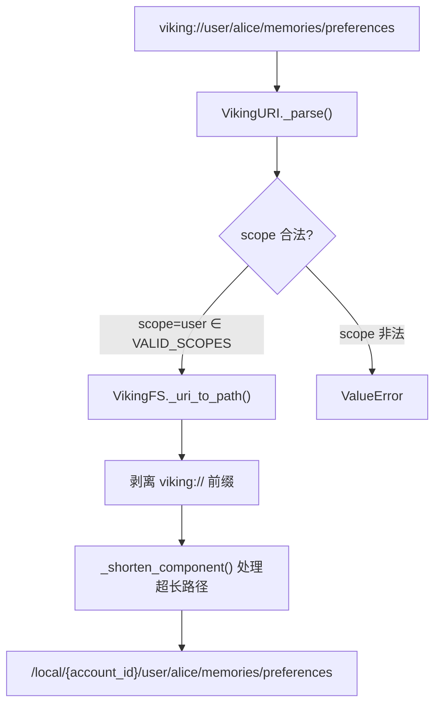
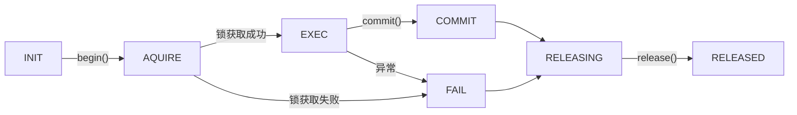
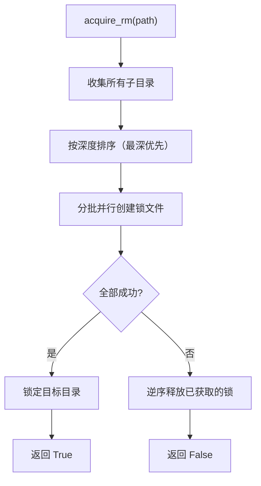

# PD-317.01 OpenViking — viking:// 协议虚拟文件系统与事务路径锁

> 文档编号：PD-317.01
> 来源：OpenViking `openviking/storage/viking_fs.py`, `openviking/storage/transaction/transaction_manager.py`, `openviking/core/directories.py`
> GitHub：https://github.com/volcengine/OpenViking.git
> 问题域：PD-317 虚拟文件系统抽象 Virtual Filesystem Abstraction
> 状态：可复用方案

---

## 第 1 章 问题与动机

### 1.1 核心问题

Agent 系统需要统一管理 memories、resources、skills、session 等多种上下文数据。传统做法是为每种数据类型建独立存储接口，导致：

- **接口碎片化**：每种上下文类型有不同的 CRUD API，Agent 需要知道调用哪个接口
- **命名空间冲突**：多用户、多 Agent 共享存储时，路径隔离靠约定而非机制
- **并发安全缺失**：多个 Agent 同时操作同一目录树时，缺乏锁机制导致数据损坏
- **向量索引不同步**：文件系统操作（rm/mv）后，向量存储中的索引记录成为孤儿数据

### 1.2 OpenViking 的解法概述

OpenViking 构建了一套完整的虚拟文件系统抽象层，核心设计：

1. **viking:// URI 协议**：统一资源寻址，`viking://{scope}/{space}/{path}` 格式覆盖 6 种 scope（`openviking_cli/utils/uri.py:35`）
2. **VikingFS 单例**：封装 AGFS 后端，提供 ls/read/write/rm/mv/grep/glob/tree/find/search 等标准文件操作（`openviking/storage/viking_fs.py:149-160`）
3. **TransactionManager + PathLock**：基于 `.path.ovlock` 锁文件的事务机制，支持 normal/rm/mv 三种锁模式（`openviking/storage/transaction/path_lock.py:24-29`）
4. **向量索引自动同步**：rm/mv 操作自动级联更新向量存储，防止孤儿索引（`openviking/storage/viking_fs.py:256-271`）
5. **预设目录树 + 惰性初始化**：`DirectoryInitializer` 按 scope 递归创建目录结构，同时在 AGFS 和向量存储中注册（`openviking/core/directories.py:140-309`）

### 1.3 设计思想

| 设计原则 | 具体实现 | 理由 | 替代方案 |
|----------|----------|------|----------|
| URI 统一寻址 | `viking://{scope}/{space}/{path}` 6 种 scope | Agent 只需一种寻址方式访问所有上下文 | 每种类型独立 API（碎片化） |
| 文件系统语义 | ls/read/write/rm/mv/grep/glob/tree | 开发者和 Agent 都熟悉文件系统操作 | 自定义 CRUD API（学习成本高） |
| 锁文件协议 | `.path.ovlock` 文件存在即锁定 | 利用文件系统原子性，无需额外锁服务 | Redis 分布式锁（额外依赖） |
| 双写一致性 | rm/mv 同时更新 AGFS + 向量存储 | 防止向量索引孤儿记录 | 异步最终一致（有窗口期） |
| L0/L1/L2 分层 | .abstract.md / .overview.md / content.md | 支持渐进式信息获取，节省 token | 全量读取（浪费 token） |
| 账户级隔离 | URI → `/local/{account_id}/...` 路径映射 | 多租户数据物理隔离 | 逻辑隔离（安全风险） |

---

## 第 2 章 源码实现分析

### 2.1 架构概览

```
┌─────────────────────────────────────────────────────────────┐
│                      Agent / MCP Client                      │
│                  viking://user/memories/...                   │
└──────────────────────────┬──────────────────────────────────┘
                           │ URI
┌──────────────────────────▼──────────────────────────────────┐
│                        VikingFS (Singleton)                  │
│  ┌──────────┐  ┌──────────┐  ┌──────────┐  ┌────────────┐  │
│  │ URI 转换  │  │ 权限检查  │  │ 向量同步  │  │ 关系管理   │  │
│  │ _uri_to_  │  │ _ensure_ │  │ _delete_  │  │ link/      │  │
│  │ path()   │  │ access() │  │ from_     │  │ unlink     │  │
│  │ _path_to_│  │ _is_     │  │ vector_   │  │ .relations │  │
│  │ uri()    │  │ accessible│  │ store()   │  │ .json      │  │
│  └──────────┘  └──────────┘  └──────────┘  └────────────┘  │
│  ┌──────────────────────────────────────────────────────┐   │
│  │ 文件操作: read/write/mkdir/rm/mv/grep/glob/tree/ls  │   │
│  └──────────────────────────────────────────────────────┘   │
└──────────────────────────┬──────────────────────────────────┘
                           │ /local/{account_id}/...
┌──────────────────────────▼──────────────────────────────────┐
│                    AGFS Backend (HTTP/Binding)                │
│              pyagfs.AGFSClient / AGFSBindingClient            │
└──────────────────────────┬──────────────────────────────────┘
                           │
┌──────────────────────────▼──────────────────────────────────┐
│              TransactionManager (Singleton)                   │
│  ┌──────────────┐  ┌──────────────┐  ┌──────────────────┐  │
│  │ 事务生命周期  │  │   PathLock   │  │  超时清理循环     │  │
│  │ create/begin │  │ .path.ovlock │  │ _cleanup_loop()  │  │
│  │ commit/      │  │ acquire_     │  │ 60s 检查一次     │  │
│  │ rollback     │  │ normal/rm/mv │  │                  │  │
│  └──────────────┘  └──────────────┘  └──────────────────┘  │
└─────────────────────────────────────────────────────────────┘
```

### 2.2 核心实现

#### 2.2.1 URI 协议与路径映射



对应源码 `openviking_cli/utils/uri.py:14-36` — VikingURI 类定义：

```python
class VikingURI:
    SCHEME = "viking"
    VALID_SCOPES = {"resources", "user", "agent", "session", "queue", "temp"}

    def _parse(self) -> Dict[str, str]:
        if not self.uri.startswith(f"{self.SCHEME}://"):
            raise ValueError(f"URI must start with '{self.SCHEME}://'")
        path = self.uri[len(f"{self.SCHEME}://"):]
        if not path.strip("/"):
            return {"scheme": self.SCHEME, "scope": "", "full_path": ""}
        scope = path.split("/")[0]
        if scope not in self.VALID_SCOPES:
            raise ValueError(f"Invalid scope '{scope}'. Must be one of {self.VALID_SCOPES}")
        return {"scheme": self.SCHEME, "scope": scope, "full_path": path}
```

路径映射核心 `openviking/storage/viking_fs.py:851-865`：

```python
def _uri_to_path(self, uri: str, ctx: Optional[RequestContext] = None) -> str:
    real_ctx = self._ctx_or_default(ctx)
    account_id = real_ctx.account_id
    remainder = uri[len("viking://"):].strip("/") if uri.startswith("viking://") else uri
    if not remainder:
        return f"/local/{account_id}"
    parts = [p for p in remainder.split("/") if p]
    safe_parts = [self._shorten_component(p, self._MAX_FILENAME_BYTES) for p in parts]
    return f"/local/{account_id}/{'/'.join(safe_parts)}"
```

关键设计：`_shorten_component()` 对超过 255 字节的路径组件做 SHA256 截断（`viking_fs.py:836-846`），防止文件系统限制导致的路径溢出。

#### 2.2.2 事务状态机与路径锁



对应源码 `openviking/storage/transaction/transaction_record.py:16-28` — 6 态状态机：

```python
class TransactionStatus(str, Enum):
    INIT = "INIT"          # 事务初始化，等待锁获取
    AQUIRE = "AQUIRE"      # 正在获取锁资源
    EXEC = "EXEC"          # 事务操作执行中
    COMMIT = "COMMIT"      # 事务成功完成
    FAIL = "FAIL"          # 事务失败
    RELEASING = "RELEASING" # 正在释放锁资源
    RELEASED = "RELEASED"   # 锁资源完全释放，事务结束
```

PathLock 的 normal 模式锁获取流程 `openviking/storage/transaction/path_lock.py:129-194`：

```python
async def acquire_normal(self, path: str, transaction: TransactionRecord) -> bool:
    transaction_id = transaction.id
    lock_path = self._get_lock_path(path)        # path/.path.ovlock
    parent_path = self._get_parent_path(path)
    # Step 1: 检查目标目录存在
    self._agfs.stat(path)
    # Step 2: 检查目标目录未被其他事务锁定
    if await self._is_locked_by_other(lock_path, transaction_id):
        return False
    # Step 3: 检查父目录未被其他事务锁定
    if parent_path:
        parent_lock_path = self._get_lock_path(parent_path)
        if await self._is_locked_by_other(parent_lock_path, transaction_id):
            return False
    # Step 4: 创建锁文件
    await self._create_lock_file(lock_path, transaction_id)
    # Step 5: 二次检查父目录（防止竞态）
    if parent_path:
        if await self._is_locked_by_other(parent_lock_path, transaction_id):
            await self._remove_lock_file(lock_path)
            return False
    # Step 6: 验证锁所有权
    if not await self._verify_lock_ownership(lock_path, transaction_id):
        return False
    # Step 7: 成功
    transaction.add_lock(lock_path)
    return True
```

#### 2.2.3 rm 操作的底部向上并行锁



对应源码 `openviking/storage/transaction/path_lock.py:221-281`：

```python
async def acquire_rm(self, path, transaction, max_parallel=8) -> bool:
    subdirs = await self._collect_subdirectories(path)
    subdirs.sort(key=lambda p: p.count("/"), reverse=True)  # 最深优先
    acquired_locks = []
    try:
        for i in range(0, len(subdirs), max_parallel):
            batch = subdirs[i:i + max_parallel]
            tasks = [self._create_lock_file(self._get_lock_path(s), transaction.id) for s in batch]
            await asyncio.gather(*tasks)  # 批量并行
            acquired_locks.extend([self._get_lock_path(s) for s in batch])
        await self._create_lock_file(lock_path, transaction.id)  # 最后锁根
        for lock in acquired_locks:
            transaction.add_lock(lock)
        return True
    except Exception:
        for lock in reversed(acquired_locks):  # 逆序释放
            await self._remove_lock_file(lock)
        return False
```

### 2.3 实现细节

**预设目录树与惰性初始化**（`openviking/core/directories.py:32-124`）：

OpenViking 定义了 4 个 scope 的预设目录树（session/user/agent/resources），每个目录节点包含 `path`、`abstract`（L0 摘要）、`overview`（L1 描述）。`DirectoryInitializer` 在用户首次访问时惰性创建：

1. 在 AGFS 中创建 `.abstract.md` 和 `.overview.md` 文件
2. 在向量存储中注册目录的 Context 记录（含 embedding）
3. 递归处理子目录（`_initialize_children` 方法，`directories.py:269-295`）

**向量索引同步**（`viking_fs.py:256-271`）：

rm 操作先收集所有子 URI，执行 AGFS 删除后，批量从向量存储中删除对应记录。mv 操作则保留向量数据，只更新 uri 和 parent_uri 字段（`viking_fs.py:1071-1117`），避免重新生成 embedding。

**权限控制**（`viking_fs.py:928-953`）：

基于 URI 的 scope 和 space 段做访问控制。ROOT 角色可访问一切；普通用户只能访问自己的 user/session space 和对应的 agent space；resources/temp/transactions 对所有人可见；`_system` 目录对非 ROOT 不可见。


---

## 第 3 章 迁移指南

### 3.1 迁移清单

**阶段 1：URI 协议层**
- [ ] 定义 URI scheme 和 scope 枚举（参考 `VikingURI.VALID_SCOPES`）
- [ ] 实现 URI 解析器（scheme/scope/path 拆分）
- [ ] 实现 URI → 物理路径映射（含账户隔离前缀）
- [ ] 实现路径组件截断（超长文件名 SHA256 哈希）

**阶段 2：文件系统抽象层**
- [ ] 定义 VFS 接口（read/write/mkdir/rm/mv/ls/stat/grep/glob/tree）
- [ ] 实现后端适配器（本地文件系统 / 对象存储 / AGFS）
- [ ] 实现 L0/L1/L2 分层读取（.abstract.md / .overview.md / content.md）
- [ ] 实现权限检查（基于 URI scope + space 的访问控制）

**阶段 3：事务与锁**
- [ ] 实现锁文件协议（`.path.ovlock` 文件写入 transaction_id）
- [ ] 实现 6 态事务状态机（INIT → AQUIRE → EXEC → COMMIT/FAIL → RELEASING → RELEASED）
- [ ] 实现 normal/rm/mv 三种锁模式
- [ ] 实现超时清理循环（后台 asyncio.Task 定期扫描过期事务）

**阶段 4：向量索引同步**
- [ ] rm 操作后级联删除向量记录
- [ ] mv 操作后更新 uri/parent_uri 字段（不重新 embedding）
- [ ] 预设目录树初始化时同步注册向量记录

### 3.2 适配代码模板

#### 最小可用 VFS 抽象

```python
"""Minimal VFS abstraction inspired by OpenViking's viking:// protocol."""

from abc import ABC, abstractmethod
from dataclasses import dataclass, field
from enum import Enum
from pathlib import PurePath
from typing import Any, Dict, List, Optional, Union
import hashlib
import re


class Scope(str, Enum):
    USER = "user"
    AGENT = "agent"
    SESSION = "session"
    RESOURCES = "resources"
    TEMP = "temp"


@dataclass
class VFSUri:
    """Virtual filesystem URI: vfs://{scope}/{space}/{path}"""
    scheme: str = "vfs"
    scope: str = ""
    space: str = ""
    path: str = ""

    @classmethod
    def parse(cls, uri: str) -> "VFSUri":
        prefix = "vfs://"
        if not uri.startswith(prefix):
            raise ValueError(f"URI must start with '{prefix}'")
        remainder = uri[len(prefix):].strip("/")
        if not remainder:
            return cls()
        parts = remainder.split("/")
        scope = parts[0]
        if scope not in {s.value for s in Scope}:
            raise ValueError(f"Invalid scope: {scope}")
        space = parts[1] if len(parts) > 1 else ""
        path = "/".join(parts[2:]) if len(parts) > 2 else ""
        return cls(scope=scope, space=space, path=path)

    def to_physical(self, account_id: str, max_bytes: int = 255) -> str:
        """Map to account-isolated physical path."""
        parts = [p for p in [self.scope, self.space, self.path] if p]
        safe = [self._shorten(p, max_bytes) for p in "/".join(parts).split("/") if p]
        return f"/data/{account_id}/{'/'.join(safe)}"

    @staticmethod
    def _shorten(component: str, max_bytes: int) -> str:
        if len(component.encode("utf-8")) <= max_bytes:
            return component
        h = hashlib.sha256(component.encode()).hexdigest()[:8]
        prefix = component
        target = max_bytes - len(f"_{h}".encode())
        while len(prefix.encode()) > target:
            prefix = prefix[:-1]
        return f"{prefix}_{h}"


class VFSBackend(ABC):
    """Abstract backend for VFS operations."""

    @abstractmethod
    async def read(self, path: str) -> bytes: ...

    @abstractmethod
    async def write(self, path: str, data: bytes) -> None: ...

    @abstractmethod
    async def rm(self, path: str, recursive: bool = False) -> None: ...

    @abstractmethod
    async def ls(self, path: str) -> List[Dict[str, Any]]: ...

    @abstractmethod
    async def stat(self, path: str) -> Dict[str, Any]: ...

    @abstractmethod
    async def mkdir(self, path: str) -> None: ...


class VirtualFS:
    """VFS facade with URI routing, access control, and vector sync."""

    def __init__(self, backend: VFSBackend, account_id: str):
        self._backend = backend
        self._account_id = account_id

    async def read(self, uri: str) -> bytes:
        parsed = VFSUri.parse(uri)
        self._check_access(parsed)
        path = parsed.to_physical(self._account_id)
        return await self._backend.read(path)

    async def write(self, uri: str, data: Union[str, bytes]) -> None:
        parsed = VFSUri.parse(uri)
        self._check_access(parsed)
        path = parsed.to_physical(self._account_id)
        if isinstance(data, str):
            data = data.encode("utf-8")
        await self._backend.write(path, data)

    async def rm(self, uri: str, recursive: bool = False) -> None:
        parsed = VFSUri.parse(uri)
        self._check_access(parsed)
        path = parsed.to_physical(self._account_id)
        await self._backend.rm(path, recursive)
        # TODO: cascade delete from vector store

    async def abstract(self, uri: str) -> str:
        """Read L0 summary (.abstract.md)."""
        parsed = VFSUri.parse(uri)
        path = parsed.to_physical(self._account_id)
        data = await self._backend.read(f"{path}/.abstract.md")
        return data.decode("utf-8")

    def _check_access(self, parsed: VFSUri) -> None:
        if parsed.scope == "_system":
            raise PermissionError("Access denied")
```

### 3.3 适用场景

| 场景 | 适用度 | 说明 |
|------|--------|------|
| Agent 记忆系统 | ⭐⭐⭐ | memories/skills/resources 三类上下文统一管理 |
| 多租户 Agent 平台 | ⭐⭐⭐ | account_id 级物理隔离 + scope/space 级逻辑隔离 |
| RAG 知识库管理 | ⭐⭐⭐ | L0/L1/L2 分层 + 向量索引自动同步 |
| 单用户 CLI 工具 | ⭐⭐ | 过度设计，直接用文件系统即可 |
| 高并发写入场景 | ⭐⭐ | 锁文件协议在高并发下有竞态窗口，需评估 |
| 分布式多节点部署 | ⭐ | 锁文件依赖共享文件系统，分布式场景需换 Redis 锁 |

---

## 第 4 章 测试用例

```python
"""Tests for VFS abstraction inspired by OpenViking's viking:// protocol."""

import pytest
from unittest.mock import AsyncMock, MagicMock, patch


class TestVikingURI:
    """Test URI parsing and validation."""

    def test_parse_valid_uri(self):
        """Test parsing a valid viking:// URI."""
        from openviking_cli.utils.uri import VikingURI

        uri = VikingURI("viking://user/alice/memories/preferences")
        assert uri.scope == "user"
        assert uri.full_path == "user/alice/memories/preferences"

    def test_parse_root_uri(self):
        uri = VikingURI("viking://")
        assert uri.scope == ""
        assert uri.full_path == ""

    def test_invalid_scope_raises(self):
        with pytest.raises(ValueError, match="Invalid scope"):
            VikingURI("viking://invalid_scope/path")

    def test_parent_navigation(self):
        uri = VikingURI("viking://user/alice/memories")
        parent = uri.parent
        assert str(parent) == "viking://user/alice"

    def test_sanitize_segment_cjk(self):
        result = VikingURI.sanitize_segment("用户偏好设置 (v2)")
        assert "(" not in result
        assert "用户偏好设置" in result

    def test_build_uri(self):
        uri = VikingURI.build("resources", "my_project", "docs")
        assert uri == "viking://resources/my_project/docs"


class TestVikingFSPathMapping:
    """Test URI-to-path and path-to-URI conversion."""

    def test_uri_to_path_basic(self):
        """Verify account-isolated path mapping."""
        # _uri_to_path: viking://user/alice/memories → /local/{account}/user/alice/memories
        from openviking.storage.viking_fs import VikingFS

        fs = VikingFS(agfs=MagicMock())
        ctx = MagicMock()
        ctx.account_id = "acc_123"
        path = fs._uri_to_path("viking://user/alice/memories", ctx=ctx)
        assert path == "/local/acc_123/user/alice/memories"

    def test_shorten_long_component(self):
        """Verify SHA256 truncation for components exceeding 255 bytes."""
        from openviking.storage.viking_fs import VikingFS

        long_name = "a" * 300
        result = VikingFS._shorten_component(long_name, 255)
        assert len(result.encode("utf-8")) <= 255
        assert result.endswith(f"_{__import__('hashlib').sha256(long_name.encode()).hexdigest()[:8]}")


class TestTransactionLifecycle:
    """Test transaction state machine."""

    def test_status_transitions(self):
        from openviking.storage.transaction.transaction_record import (
            TransactionRecord, TransactionStatus,
        )

        tx = TransactionRecord()
        assert tx.status == TransactionStatus.INIT

        tx.update_status(TransactionStatus.AQUIRE)
        assert tx.status == TransactionStatus.AQUIRE

        tx.update_status(TransactionStatus.EXEC)
        assert tx.status == TransactionStatus.EXEC

        tx.update_status(TransactionStatus.COMMIT)
        assert tx.status == TransactionStatus.COMMIT

    def test_lock_management(self):
        from openviking.storage.transaction.transaction_record import TransactionRecord

        tx = TransactionRecord()
        tx.add_lock("/local/acc/user/.path.ovlock")
        assert len(tx.locks) == 1

        # Duplicate add is idempotent
        tx.add_lock("/local/acc/user/.path.ovlock")
        assert len(tx.locks) == 1

        tx.remove_lock("/local/acc/user/.path.ovlock")
        assert len(tx.locks) == 0


class TestPathLock:
    """Test path locking protocol."""

    @pytest.mark.asyncio
    async def test_acquire_normal_success(self):
        from openviking.storage.transaction.path_lock import PathLock
        from openviking.storage.transaction.transaction_record import TransactionRecord

        agfs = MagicMock()
        agfs.stat.return_value = {"isDir": True}
        agfs.cat.side_effect = FileNotFoundError  # No existing lock
        agfs.write.return_value = None
        # After write, cat returns our tx id
        lock = PathLock(agfs)
        tx = TransactionRecord()

        # Mock: after lock creation, verify returns our id
        def cat_side_effect(path):
            if ".ovlock" in path:
                return tx.id.encode()
            raise FileNotFoundError

        agfs.cat.side_effect = cat_side_effect
        result = await lock.acquire_normal("/local/acc/user/memories", tx)
        assert result is True
        assert len(tx.locks) == 1

    @pytest.mark.asyncio
    async def test_acquire_rm_bottom_up(self):
        """Verify rm lock acquires deepest directories first."""
        from openviking.storage.transaction.path_lock import PathLock
        from openviking.storage.transaction.transaction_record import TransactionRecord

        agfs = MagicMock()
        agfs.ls.return_value = []  # No subdirectories
        agfs.write.return_value = None
        lock = PathLock(agfs)
        tx = TransactionRecord()

        result = await lock.acquire_rm("/local/acc/user", tx, max_parallel=4)
        assert result is True


class TestAccessControl:
    """Test URI-based access control."""

    def test_root_can_access_everything(self):
        from openviking.storage.viking_fs import VikingFS
        from openviking.server.identity import RequestContext, Role

        fs = VikingFS(agfs=MagicMock())
        ctx = MagicMock(spec=RequestContext)
        ctx.role = Role.ROOT
        assert fs._is_accessible("viking://user/alice/memories", ctx) is True
        assert fs._is_accessible("viking://_system/config", ctx) is True

    def test_user_cannot_access_system(self):
        from openviking.storage.viking_fs import VikingFS

        fs = VikingFS(agfs=MagicMock())
        ctx = MagicMock()
        ctx.role = "user"
        assert fs._is_accessible("viking://_system/config", ctx) is False
```


---

## 第 5 章 跨域关联

| 关联域 | 关系类型 | 说明 |
|--------|----------|------|
| PD-06 记忆持久化 | 协同 | VikingFS 是记忆持久化的底层存储抽象，memories/skills 通过 viking:// URI 统一管理 |
| PD-01 上下文管理 | 协同 | L0/L1/L2 分层读取支持渐进式上下文注入，abstract → overview → content 逐层展开 |
| PD-08 搜索与检索 | 依赖 | VikingFS.find() 和 search() 依赖向量存储后端，rm/mv 操作自动同步向量索引 |
| PD-05 沙箱隔离 | 协同 | account_id 级路径隔离 + scope/space 权限检查提供多租户数据隔离 |
| PD-02 多 Agent 编排 | 协同 | TransactionManager 的路径锁防止多 Agent 并发操作同一目录树时的数据冲突 |
| PD-03 容错与重试 | 协同 | 事务 rollback 机制 + 超时清理循环保障操作失败后的资源释放 |

---

## 第 6 章 来源文件索引

| 文件 | 行范围 | 关键实现 |
|------|--------|----------|
| `openviking_cli/utils/uri.py` | L14-L293 | VikingURI 类：URI 解析、校验、构建、sanitize |
| `openviking/storage/viking_fs.py` | L149-L175 | VikingFS 主类定义与初始化 |
| `openviking/storage/viking_fs.py` | L203-L347 | AGFS 基础命令：read/write/mkdir/rm/mv/grep/glob |
| `openviking/storage/viking_fs.py` | L506-L755 | VikingFS 特有能力：abstract/overview/find/search |
| `openviking/storage/viking_fs.py` | L759-L828 | 关系管理：link/unlink/.relations.json |
| `openviking/storage/viking_fs.py` | L830-L953 | URI 转换与权限控制 |
| `openviking/storage/viking_fs.py` | L1028-L1117 | 向量索引同步：_collect_uris/_delete_from_vector_store/_update_vector_store_uris |
| `openviking/storage/viking_fs.py` | L1484-L1523 | write_context：L0/L1/L2 三层写入 |
| `openviking/storage/transaction/transaction_manager.py` | L30-L67 | TransactionManager 初始化与配置 |
| `openviking/storage/transaction/transaction_manager.py` | L128-L230 | 事务生命周期：create/begin/commit/rollback |
| `openviking/storage/transaction/transaction_manager.py` | L231-L317 | 三种锁模式：acquire_lock_normal/rm/mv |
| `openviking/storage/transaction/path_lock.py` | L24-L332 | PathLock：锁文件协议、normal/rm/mv 锁获取、LIFO 释放 |
| `openviking/storage/transaction/transaction_record.py` | L16-L28 | TransactionStatus 6 态枚举 |
| `openviking/storage/transaction/transaction_record.py` | L34-L84 | TransactionRecord：锁列表管理、状态转换 |
| `openviking/core/directories.py` | L21-L124 | DirectoryDefinition + PRESET_DIRECTORIES 预设目录树 |
| `openviking/core/directories.py` | L140-L309 | DirectoryInitializer：惰性初始化 + AGFS/向量双写 |
| `openviking/core/context.py` | L50-L214 | Context 统一上下文类：URI 驱动的类型推导 |

---

## 第 7 章 横向对比维度

```json comparison_data
{
  "project": "OpenViking",
  "dimensions": {
    "寻址协议": "viking:// 自定义 URI，6 scope 枚举 + space 段多租户隔离",
    "后端抽象": "AGFS HTTP/Binding 双模式，单例 VikingFS 封装",
    "锁机制": ".path.ovlock 锁文件协议，normal/rm/mv 三种模式，底部向上并行锁",
    "事务模型": "6 态状态机 INIT→AQUIRE→EXEC→COMMIT/FAIL→RELEASING→RELEASED",
    "目录树构建": "PRESET_DIRECTORIES dataclass 预设 + DirectoryInitializer 惰性递归创建",
    "向量同步": "rm/mv 操作自动级联更新向量存储，mv 只更新 URI 不重新 embedding",
    "权限模型": "scope+space 级访问控制，ROOT 全通，_system 对普通用户不可见",
    "分层读取": "L0(.abstract.md) / L1(.overview.md) / L2(content.md) 三层渐进式"
  }
}
```

### 域元数据补充

```json domain_metadata
{
  "solution_summary": "OpenViking 基于 viking:// URI 协议 + AGFS 后端构建虚拟文件系统，PathLock 锁文件协议提供 normal/rm/mv 三种事务锁模式，rm/mv 自动级联同步向量索引",
  "description": "虚拟文件系统需要解决多租户隔离、向量索引一致性和并发锁三重挑战",
  "sub_problems": [
    "向量索引与文件操作的双写一致性",
    "超长路径组件的安全截断",
    "预设目录树的惰性初始化与双存储注册",
    "L0/L1/L2 分层渐进式信息获取"
  ],
  "best_practices": [
    "rm/mv 操作自动级联更新向量存储防止孤儿索引",
    "锁文件写入 transaction_id 后二次验证所有权防竞态",
    "rm 操作采用底部向上并行锁避免死锁",
    "路径组件超 255 字节时 SHA256 截断保证文件系统兼容"
  ]
}
```

