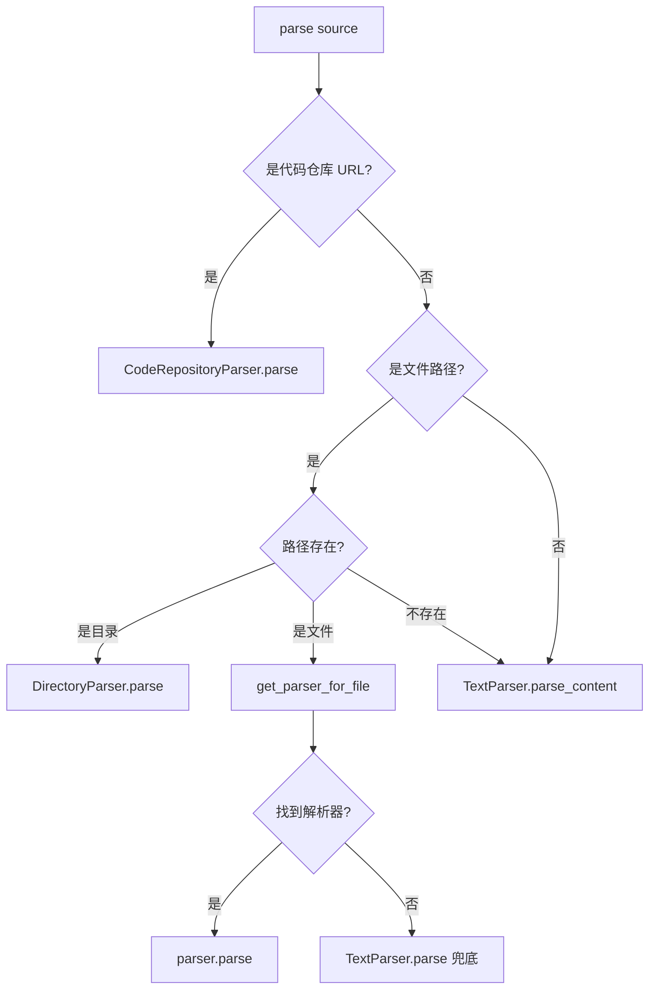
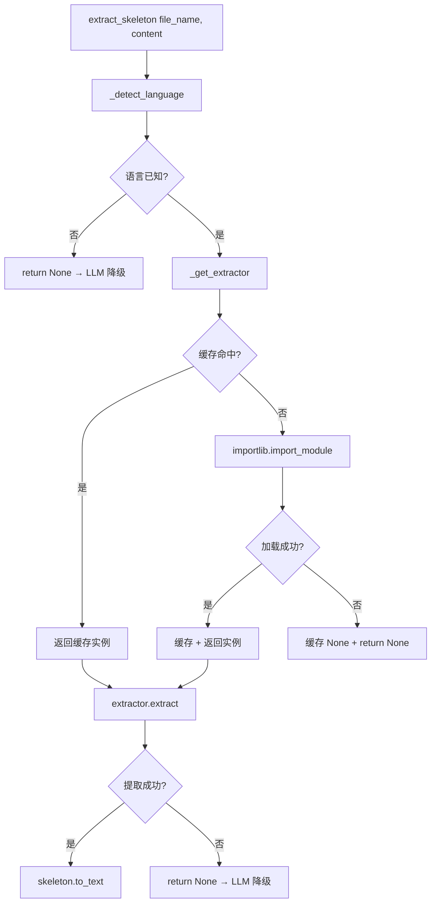

# PD-318.01 OpenViking — ParserRegistry 多格式文档解析与 tree-sitter AST 提取

> 文档编号：PD-318.01
> 来源：OpenViking `openviking/parse/registry.py`, `openviking/parse/parsers/code/ast/extractor.py`
> GitHub：https://github.com/volcengine/OpenViking.git
> 问题域：PD-318 多格式文档解析 Multi-Format Document Parsing
> 状态：可复用方案

---

## 第 1 章 问题与动机

### 1.1 核心问题

Agent 系统需要理解多种格式的文档输入——PDF、Markdown、HTML、Word、PPT、Excel、EPUB、代码仓库、图片、音频、视频、ZIP 压缩包等。每种格式有不同的解析逻辑，但下游消费者（LLM、向量化、检索）期望统一的树形结构输出。

核心挑战：
- **格式爆炸**：15+ 种文件格式，每种需要独立解析器，但对外需要统一接口
- **扩展性**：用户可能有私有格式（如 `.xyz` 内部文档），需要支持自定义解析器注册
- **代码理解**：代码文件不能简单当文本处理，需要 AST 级别的结构提取才能让 LLM 理解代码骨架
- **降级策略**：tree-sitter 不支持的语言、解析失败的文档，都需要优雅降级到 LLM 或纯文本

### 1.2 OpenViking 的解法概述

OpenViking 构建了一个三层解析架构：

1. **ParserRegistry 单例**（`registry.py:38-278`）：全局注册表管理 15 个内置解析器，通过文件扩展名自动路由到对应解析器，支持 `register_custom()` 和 `register_callback()` 两种扩展方式
2. **BaseParser 抽象基类**（`base_parser.py:10-116`）：定义 `parse()` / `parse_content()` / `supported_extensions` 三个核心抽象方法，所有解析器统一实现此接口
3. **ASTExtractor 代码骨架提取**（`extractor.py:44-107`）：基于 tree-sitter 的 7 语言 AST 提取器，通过 `CodeSkeleton` 数据结构输出结构化代码骨架，不支持的语言返回 `None` 触发 LLM 降级
4. **统一输出结构**（`base.py:160-400`）：所有解析器输出 `ParseResult` + `ResourceNode` 树，只有 ROOT 和 SECTION 两种节点类型，内容保持 Markdown 格式
5. **三阶段解析架构**：Phase 1（detail_file UUID.md）→ Phase 2（meta 语义标题/摘要）→ Phase 3（content_path 最终内容文件）

### 1.3 设计思想

| 设计原则 | 具体实现 | 理由 | 替代方案 |
|----------|----------|------|----------|
| 单例注册表 | `get_registry()` 模块级单例 + `_default_registry` | 避免重复初始化 15 个解析器，全局共享 | 依赖注入容器（更重） |
| 扩展名路由 | `_extension_map: Dict[str, str]` 扩展名→解析器名映射 | O(1) 查找，注册时自动构建映射 | MIME type 检测（需要读文件头） |
| 双模式扩展 | Protocol-based (`register_custom`) + Callback-based (`register_callback`) | Protocol 适合复杂解析器，Callback 适合简单场景 | 只提供一种方式（灵活性不足） |
| 懒加载提取器 | `ASTExtractor._cache` + `importlib.import_module` | tree-sitter 各语言绑定按需加载，未使用的语言不占内存 | 启动时全部加载（浪费资源） |
| 简化节点类型 | 只有 ROOT 和 SECTION，内容保持 Markdown | 避免细粒度节点分解的复杂性，下游 LLM 直接消费 Markdown | 细粒度 AST（paragraph/code_block/table 等） |
| 优雅降级 | AST 提取失败返回 None → 调用方降级到 LLM | 部分结果优于完全失败 | 抛异常（中断整个流程） |

---

## 第 2 章 源码实现分析

### 2.1 架构概览

```
┌─────────────────────────────────────────────────────────────────┐
│                     ParserRegistry (单例)                        │
│  ┌──────────┐  ┌──────────┐  ┌──────────┐  ┌──────────────────┐│
│  │ _parsers │  │_ext_map  │  │register()│  │register_custom() ││
│  │Dict[str, │  │Dict[str, │  │          │  │register_callback││
│  │BaseParser│  │str]      │  │          │  │                  ││
│  └────┬─────┘  └────┬─────┘  └──────────┘  └──────────────────┘│
│       │              │                                          │
│  ┌────▼──────────────▼──────────────────────────────────────┐   │
│  │  get_parser_for_file(path) → ext → parser_name → parser  │   │
│  └──────────────────────────────────────────────────────────┘   │
└─────────────────────────────────────────────────────────────────┘
        │
        ▼
┌───────────────────────────────────────────────────────────┐
│                    BaseParser (ABC)                        │
│  parse(source, instruction, **kwargs) → ParseResult       │
│  parse_content(content, source_path, **kwargs) → ParseResult│
│  supported_extensions → List[str]                         │
│  can_parse(path) → bool                                   │
│  _read_file(path) → str  (多编码降级)                      │
│  _create_temp_uri() → str (VikingFS 临时目录)              │
└───────────────────────────────────────────────────────────┘
        │
        ├── TextParser       (.txt, .text, .log)
        ├── MarkdownParser   (.md, .markdown, .mdown, .mkd)
        ├── PDFParser        (.pdf)  ← 双策略: pdfplumber / MinerU
        ├── HTMLParser       (.html, .htm)
        ├── WordParser       (.docx)
        ├── PowerPointParser (.pptx)
        ├── ExcelParser      (.xlsx, .xls)
        ├── EPubParser       (.epub)
        ├── CodeRepositoryParser (.git, .zip) ← 内含 ASTExtractor
        ├── ZipParser        (.zip)
        ├── DirectoryParser  (目录)
        ├── ImageParser      (.png, .jpg, .gif, ...)
        ├── AudioParser      (.mp3, .wav, .flac, ...)
        └── VideoParser      (.mp4, .avi, .mkv, ...)

┌───────────────────────────────────────────────────────────┐
│              ASTExtractor (代码骨架提取)                    │
│  _EXT_MAP: 文件扩展名 → 语言 key                          │
│  _EXTRACTOR_REGISTRY: 语言 key → (module, class, kwargs)  │
│  extract_skeleton(file_name, content, verbose) → str|None │
└───────────────────────────────────────────────────────────┘
        │
        ├── PythonExtractor    (tree-sitter-python)
        ├── JsTsExtractor      (tree-sitter-javascript)
        ├── JavaExtractor      (tree-sitter-java)
        ├── CppExtractor       (tree-sitter-cpp)
        ├── RustExtractor      (tree-sitter-rust)
        └── GoExtractor        (tree-sitter-go)
```

### 2.2 核心实现

#### ParserRegistry 扩展名路由



对应源码 `registry.py:206-258`：
```python
async def parse(self, source: Union[str, Path], **kwargs) -> ParseResult:
    source_str = str(source)

    # 第一优先级：检查是否为代码仓库 URL
    code_parser = self._parsers.get("code")
    if code_parser:
        try:
            if hasattr(code_parser, "is_repository_url") and code_parser.is_repository_url(source_str):
                logger.info(f"Detected code repository URL: {source_str}")
                return await code_parser.parse(source_str, **kwargs)
        except Exception as e:
            logger.warning(f"Error checking if source is repository URL: {e}")

    # 第二优先级：文件路径检测（长度 ≤ 1024 且无换行）
    is_potential_path = len(source_str) <= 1024 and "\n" not in source_str
    if is_potential_path:
        path = Path(source)
        if path.exists():
            if path.is_dir():
                dir_parser = self._parsers.get("directory")
                if dir_parser:
                    return await dir_parser.parse(path, **kwargs)
            parser = self.get_parser_for_file(path)
            if parser:
                return await parser.parse(path, **kwargs)
            else:
                return await self._parsers["text"].parse(path, **kwargs)

    # 兜底：纯文本内容
    return await self._parsers["text"].parse_content(source_str, **kwargs)
```

#### ASTExtractor 懒加载与降级



对应源码 `extractor.py:57-96`：
```python
def _get_extractor(self, lang: Optional[str]) -> Optional[LanguageExtractor]:
    if lang is None or lang not in _EXTRACTOR_REGISTRY:
        return None
    if lang in self._cache:
        return self._cache[lang]

    module_path, class_name, kwargs = _EXTRACTOR_REGISTRY[lang]
    try:
        mod = importlib.import_module(module_path)
        cls = getattr(mod, class_name)
        extractor = cls(**kwargs)
        self._cache[lang] = extractor
        return extractor
    except Exception as e:
        logger.warning("AST extractor unavailable for language '%s', falling back to LLM: %s", lang, e)
        self._cache[lang] = None  # 缓存失败结果，避免重复尝试
        return None

def extract_skeleton(self, file_name: str, content: str, verbose: bool = False) -> Optional[str]:
    lang = self._detect_language(file_name)
    extractor = self._get_extractor(lang)
    if extractor is None:
        return None
    try:
        skeleton: CodeSkeleton = extractor.extract(file_name, content)
        return skeleton.to_text(verbose=verbose)
    except Exception as e:
        logger.warning("AST extraction failed for '%s' (language: %s), falling back to LLM: %s",
                       file_name, lang, e)
        return None
```

### 2.3 实现细节

#### 自定义解析器双模式注册

OpenViking 提供两种扩展方式（`custom.py:20-244`）：

**Protocol 模式** — 适合复杂解析器，实现 `CustomParserProtocol`：
```python
@runtime_checkable
class CustomParserProtocol(Protocol):
    def can_handle(self, source: Union[str, Path]) -> bool: ...
    async def parse(self, source: Union[str, Path], **kwargs) -> ParseResult: ...
    @property
    def supported_extensions(self) -> List[str]: ...
```

**Callback 模式** — 适合简单场景，传入一个 async 函数：
```python
registry.register_callback(".xyz", my_parser_fn)
# 内部包装为 CallbackParserWrapper，自动适配 BaseParser 接口
```

两种方式都通过 Wrapper 适配到 `BaseParser` 接口，对 Registry 透明。

#### CodeSkeleton 双模式输出

`skeleton.py:40-96` 的 `to_text()` 方法支持两种输出模式：
- `verbose=False`（ast 模式）：只保留 docstring 首行，用于向量化/embedding
- `verbose=True`（ast_llm 模式）：保留完整 docstring，用于 LLM 输入

#### 多编码降级读取

`base_parser.py:72-92` 的 `_read_file()` 按 `utf-8 → utf-8-sig → latin-1 → cp1252` 顺序尝试解码，确保各种编码的文件都能读取。

#### 三阶段解析架构

`ResourceNode`（`base.py:160-344`）支持三阶段生命周期：
- **Phase 1**：`detail_file` 存储 UUID.md 文件名（扁平化临时存储）
- **Phase 2**：`meta` 存储语义标题、摘要、概览（LLM 增强）
- **Phase 3**：`content_path` 指向最终内容文件（持久化）


---

## 第 3 章 迁移指南

### 3.1 迁移清单

**阶段 1：核心框架（必须）**
- [ ] 定义 `ParseResult` 和 `ResourceNode` 数据结构（`base.py` 的简化版）
- [ ] 实现 `BaseParser` 抽象基类（3 个抽象方法 + `_read_file` 工具方法）
- [ ] 实现 `ParserRegistry` 单例（`register()` + `get_parser_for_file()` + `parse()`）
- [ ] 注册 3-5 个核心解析器（Text / Markdown / PDF / HTML）

**阶段 2：扩展机制（推荐）**
- [ ] 实现 `CustomParserProtocol` + `CustomParserWrapper`（Protocol 模式扩展）
- [ ] 实现 `CallbackParserWrapper`（Callback 模式扩展）
- [ ] 添加 `unregister()` 方法支持解析器热替换

**阶段 3：代码理解（可选）**
- [ ] 实现 `CodeSkeleton` / `FunctionSig` / `ClassSkeleton` 数据结构
- [ ] 实现 `ASTExtractor` + `LanguageExtractor` 基类
- [ ] 集成 tree-sitter 实现 Python / JS / TS 等语言提取器
- [ ] 实现 `verbose` 双模式输出（embedding vs LLM）

### 3.2 适配代码模板

#### 最小可用 ParserRegistry

```python
from abc import ABC, abstractmethod
from dataclasses import dataclass, field
from pathlib import Path
from typing import Any, Dict, List, Optional, Union


@dataclass
class ParseResult:
    """统一解析结果。"""
    content: str                          # Markdown 格式内容
    source_path: Optional[str] = None
    source_format: Optional[str] = None
    parser_name: Optional[str] = None
    meta: Dict[str, Any] = field(default_factory=dict)
    warnings: List[str] = field(default_factory=list)

    @property
    def success(self) -> bool:
        return len(self.warnings) == 0


class BaseParser(ABC):
    """解析器抽象基类。"""

    @abstractmethod
    async def parse(self, source: Union[str, Path], **kwargs) -> ParseResult:
        pass

    @property
    @abstractmethod
    def supported_extensions(self) -> List[str]:
        pass

    def can_parse(self, path: Union[str, Path]) -> bool:
        return Path(path).suffix.lower() in self.supported_extensions

    def _read_file(self, path: Union[str, Path]) -> str:
        for enc in ["utf-8", "utf-8-sig", "latin-1", "cp1252"]:
            try:
                return Path(path).read_text(encoding=enc)
            except UnicodeDecodeError:
                continue
        raise ValueError(f"Unable to decode: {path}")


class ParserRegistry:
    """解析器注册表（单例）。"""

    def __init__(self):
        self._parsers: Dict[str, BaseParser] = {}
        self._ext_map: Dict[str, str] = {}

    def register(self, name: str, parser: BaseParser) -> None:
        self._parsers[name] = parser
        for ext in parser.supported_extensions:
            self._ext_map[ext.lower()] = name

    def get_parser_for_file(self, path: Union[str, Path]) -> Optional[BaseParser]:
        ext = Path(path).suffix.lower()
        name = self._ext_map.get(ext)
        return self._parsers.get(name) if name else None

    async def parse(self, source: Union[str, Path], **kwargs) -> ParseResult:
        path = Path(source)
        if path.exists():
            parser = self.get_parser_for_file(path)
            if parser:
                return await parser.parse(path, **kwargs)
        # 兜底：纯文本
        return ParseResult(
            content=self._parsers["text"]._read_file(source) if Path(source).exists()
                    else str(source),
            source_format="text",
            parser_name="fallback",
        )


# 单例
_registry: Optional[ParserRegistry] = None

def get_registry() -> ParserRegistry:
    global _registry
    if _registry is None:
        _registry = ParserRegistry()
    return _registry
```

#### 最小可用 ASTExtractor

```python
import importlib
from abc import ABC, abstractmethod
from dataclasses import dataclass, field
from typing import Dict, List, Optional

@dataclass
class FunctionSig:
    name: str
    params: str
    return_type: str
    docstring: str

@dataclass
class ClassSkeleton:
    name: str
    bases: List[str]
    docstring: str
    methods: List[FunctionSig] = field(default_factory=list)

@dataclass
class CodeSkeleton:
    file_name: str
    language: str
    module_doc: str
    imports: List[str]
    classes: List[ClassSkeleton]
    functions: List[FunctionSig]

    def to_text(self, verbose: bool = False) -> str:
        lines = [f"# {self.file_name} [{self.language}]"]
        if self.imports:
            lines.append(f"imports: {', '.join(self.imports)}")
        for cls in self.classes:
            bases = f"({', '.join(cls.bases)})" if cls.bases else ""
            lines.append(f"class {cls.name}{bases}")
            for m in cls.methods:
                ret = f" -> {m.return_type}" if m.return_type else ""
                lines.append(f"  + {m.name}({m.params}){ret}")
        for fn in self.functions:
            ret = f" -> {fn.return_type}" if fn.return_type else ""
            lines.append(f"def {fn.name}({fn.params}){ret}")
        return "\n".join(lines)


class LanguageExtractor(ABC):
    @abstractmethod
    def extract(self, file_name: str, content: str) -> CodeSkeleton: ...


# 语言注册表：语言 key → (模块路径, 类名, 构造参数)
_REGISTRY: Dict[str, tuple] = {
    "python": ("my_extractors.python", "PythonExtractor", {}),
}

_EXT_MAP: Dict[str, str] = {".py": "python", ".js": "javascript", ".ts": "typescript"}


class ASTExtractor:
    def __init__(self):
        self._cache: Dict[str, Optional[LanguageExtractor]] = {}

    def extract_skeleton(self, file_name: str, content: str,
                         verbose: bool = False) -> Optional[str]:
        from pathlib import Path
        lang = _EXT_MAP.get(Path(file_name).suffix.lower())
        if not lang or lang not in _REGISTRY:
            return None  # 降级到 LLM

        if lang not in self._cache:
            mod_path, cls_name, kwargs = _REGISTRY[lang]
            try:
                mod = importlib.import_module(mod_path)
                self._cache[lang] = getattr(mod, cls_name)(**kwargs)
            except Exception:
                self._cache[lang] = None

        extractor = self._cache[lang]
        if extractor is None:
            return None

        try:
            return extractor.extract(file_name, content).to_text(verbose=verbose)
        except Exception:
            return None  # 降级到 LLM
```

### 3.3 适用场景

| 场景 | 适用度 | 说明 |
|------|--------|------|
| RAG 系统文档预处理 | ⭐⭐⭐ | 多格式输入统一为 Markdown 树，直接喂给向量化 |
| 代码仓库理解 | ⭐⭐⭐ | tree-sitter AST 提取代码骨架，比全文更高效 |
| 知识库构建 | ⭐⭐⭐ | 统一的 ParseResult 结构便于索引和检索 |
| 文档格式转换 | ⭐⭐ | 可作为格式转换管线的前端，但不含渲染能力 |
| 实时文档处理 | ⭐⭐ | async 接口支持并发，但 PDF/代码仓库解析较慢 |
| 浏览器内容解析 | ⭐ | 需要额外集成 headless browser，不在核心范围内 |

---

## 第 4 章 测试用例

```python
import pytest
from pathlib import Path
from unittest.mock import AsyncMock, MagicMock, patch
from dataclasses import dataclass, field
from typing import Dict, List, Optional, Union


# ---- 测试 ParserRegistry ----

class TestParserRegistry:
    """测试解析器注册表的核心功能。"""

    def setup_method(self):
        """每个测试前创建新的 Registry 实例。"""
        # 模拟 BaseParser 和 Registry（不依赖真实解析器）
        self.registry = self._create_test_registry()

    def _create_test_registry(self):
        """创建测试用 Registry。"""
        from unittest.mock import MagicMock

        class MockParser:
            def __init__(self, name, extensions):
                self.name = name
                self._extensions = extensions
            @property
            def supported_extensions(self):
                return self._extensions
            def can_parse(self, path):
                return Path(path).suffix.lower() in self._extensions

        class TestRegistry:
            def __init__(self):
                self._parsers = {}
                self._ext_map = {}
            def register(self, name, parser):
                self._parsers[name] = parser
                for ext in parser.supported_extensions:
                    self._ext_map[ext.lower()] = name
            def get_parser_for_file(self, path):
                ext = Path(path).suffix.lower()
                name = self._ext_map.get(ext)
                return self._parsers.get(name) if name else None
            def list_parsers(self):
                return list(self._parsers.keys())

        reg = TestRegistry()
        reg.register("text", MockParser("text", [".txt", ".text", ".log"]))
        reg.register("markdown", MockParser("markdown", [".md", ".markdown"]))
        reg.register("pdf", MockParser("pdf", [".pdf"]))
        return reg

    def test_extension_routing(self):
        """扩展名正确路由到对应解析器。"""
        parser = self.registry.get_parser_for_file("doc.pdf")
        assert parser is not None
        assert parser.name == "pdf"

        parser = self.registry.get_parser_for_file("README.md")
        assert parser is not None
        assert parser.name == "markdown"

    def test_unknown_extension_returns_none(self):
        """未知扩展名返回 None。"""
        parser = self.registry.get_parser_for_file("data.xyz")
        assert parser is None

    def test_case_insensitive_extension(self):
        """扩展名匹配不区分大小写。"""
        parser = self.registry.get_parser_for_file("DOC.PDF")
        assert parser is not None
        assert parser.name == "pdf"

    def test_register_overwrites_extension(self):
        """后注册的解析器覆盖同扩展名的旧解析器。"""
        class MockParser:
            def __init__(self):
                self.name = "custom_md"
            @property
            def supported_extensions(self):
                return [".md"]
        self.registry.register("custom_md", MockParser())
        parser = self.registry.get_parser_for_file("README.md")
        assert parser.name == "custom_md"

    def test_list_parsers(self):
        """列出所有已注册解析器。"""
        names = self.registry.list_parsers()
        assert "text" in names
        assert "markdown" in names
        assert "pdf" in names


# ---- 测试 ASTExtractor ----

class TestASTExtractor:
    """测试代码骨架提取的核心逻辑。"""

    def test_detect_language_python(self):
        """Python 文件正确识别。"""
        from pathlib import Path
        ext_map = {".py": "python", ".js": "javascript", ".ts": "typescript"}
        assert ext_map.get(Path("main.py").suffix.lower()) == "python"

    def test_detect_language_unknown(self):
        """未知扩展名返回 None。"""
        ext_map = {".py": "python", ".js": "javascript"}
        assert ext_map.get(Path("data.csv").suffix.lower()) is None

    def test_skeleton_to_text(self):
        """CodeSkeleton 正确序列化为文本。"""
        skeleton = type('CodeSkeleton', (), {
            'file_name': 'test.py',
            'language': 'Python',
            'module_doc': 'Test module',
            'imports': ['os', 'sys'],
            'classes': [],
            'functions': [],
        })()

        # 模拟 to_text
        lines = [f"# {skeleton.file_name} [{skeleton.language}]"]
        if skeleton.imports:
            lines.append(f"imports: {', '.join(skeleton.imports)}")
        text = "\n".join(lines)

        assert "test.py" in text
        assert "Python" in text
        assert "os, sys" in text

    def test_extractor_cache_failure(self):
        """提取器加载失败时缓存 None，避免重复尝试。"""
        cache = {}
        lang = "nonexistent"

        # 模拟加载失败
        try:
            import importlib
            importlib.import_module("nonexistent.module")
        except (ImportError, ModuleNotFoundError):
            cache[lang] = None

        assert cache[lang] is None
        # 第二次直接从缓存返回
        assert cache.get(lang) is None
```


---

## 第 5 章 跨域关联

| 关联域 | 关系类型 | 说明 |
|--------|----------|------|
| PD-01 上下文管理 | 协同 | CodeSkeleton 的 `verbose=False` 模式压缩代码为骨架文本，显著减少 token 消耗；`verbose=True` 模式为 LLM 提供完整 docstring |
| PD-04 工具系统 | 协同 | ParserRegistry 的 `register_custom()` / `register_callback()` 可作为工具系统的文档预处理插件注册机制 |
| PD-08 搜索与检索 | 依赖 | ParseResult 的 ResourceNode 树结构是 RAG 检索的前置输入，SECTION 节点直接对应检索 chunk |
| PD-03 容错与重试 | 协同 | ASTExtractor 的 `None` 返回值触发 LLM 降级，PDFParser 的 local → MinerU 双策略降级，`_read_file` 的多编码降级 |
| PD-05 沙箱隔离 | 协同 | CodeRepositoryParser 的 `git clone --depth 1` 和 Zip Slip 验证提供了代码仓库解析的安全边界 |
| PD-11 可观测性 | 协同 | ParseResult 记录 `parse_time`、`parser_name`、`parser_version`、`warnings`，为解析链路提供完整追踪数据 |

---

## 第 6 章 来源文件索引

| 文件 | 行范围 | 关键实现 |
|------|--------|----------|
| `openviking/parse/registry.py` | L38-L278 | ParserRegistry 单例、15 解析器注册、扩展名路由、`parse()` 自动分发 |
| `openviking/parse/registry.py` | L92-L172 | `register_custom()` Protocol 模式 + `register_callback()` Callback 模式 |
| `openviking/parse/parsers/base_parser.py` | L10-L116 | BaseParser ABC、`parse()`/`parse_content()`/`supported_extensions` 抽象方法、`_read_file()` 多编码降级 |
| `openviking/parse/base.py` | L141-L157 | NodeType 枚举（ROOT/SECTION 简化设计） |
| `openviking/parse/base.py` | L160-L344 | ResourceNode 三阶段数据结构（detail_file → meta → content_path） |
| `openviking/parse/base.py` | L347-L400 | ParseResult 统一输出结构 |
| `openviking/parse/parsers/code/ast/extractor.py` | L16-L41 | `_EXT_MAP` 扩展名映射 + `_EXTRACTOR_REGISTRY` 语言注册表 |
| `openviking/parse/parsers/code/ast/extractor.py` | L44-L107 | ASTExtractor 懒加载调度器 + `get_extractor()` 单例 |
| `openviking/parse/parsers/code/ast/skeleton.py` | L15-L96 | FunctionSig / ClassSkeleton / CodeSkeleton 数据结构 + `to_text()` 双模式序列化 |
| `openviking/parse/parsers/code/ast/languages/base.py` | L10-L13 | LanguageExtractor ABC |
| `openviking/parse/parsers/code/ast/languages/python.py` | L130-L187 | PythonExtractor tree-sitter 实现 |
| `openviking/parse/parsers/code/ast/languages/python.py` | L33-L54 | `_extract_function()` 函数签名提取 |
| `openviking/parse/parsers/code/ast/languages/python.py` | L57-L85 | `_extract_class()` 类骨架提取 |
| `openviking/parse/custom.py` | L20-L77 | CustomParserProtocol（runtime_checkable） |
| `openviking/parse/custom.py` | L80-L162 | CustomParserWrapper 适配器 |
| `openviking/parse/custom.py` | L165-L244 | CallbackParserWrapper 函数式适配器 |

---

## 第 7 章 横向对比维度

```json comparison_data
{
  "project": "OpenViking",
  "dimensions": {
    "解析器架构": "ParserRegistry 单例 + BaseParser ABC + 扩展名路由，15 内置解析器",
    "扩展机制": "双模式：Protocol-based register_custom + Callback-based register_callback",
    "代码理解": "tree-sitter 7 语言 AST 提取 + CodeSkeleton 双模式输出（embedding/LLM）",
    "降级策略": "三层降级：AST→LLM、local→MinerU、utf-8→latin-1→cp1252",
    "输出结构": "ResourceNode 树（ROOT/SECTION 简化）+ 三阶段生命周期",
    "多媒体支持": "Image/Audio/Video 独立解析器 + content_type 字段 + VikingFS 存储"
  }
}
```

### 域元数据补充

```json domain_metadata
{
  "solution_summary": "OpenViking 通过 ParserRegistry 单例管理 15 种内置解析器，以扩展名 O(1) 路由实现自动分发，Code 解析器集成 tree-sitter 7 语言 AST 提取并输出 CodeSkeleton 双模式骨架文本",
  "description": "统一异步解析接口与三阶段内容生命周期管理",
  "sub_problems": [
    "解析结果的三阶段生命周期管理（临时→语义增强→持久化）",
    "PDF 双策略转换（本地 pdfplumber vs 远程 MinerU API）"
  ],
  "best_practices": [
    "双模式自定义扩展：Protocol 适合复杂解析器，Callback 适合简单函数",
    "AST 提取器懒加载 + 失败缓存 None 避免重复尝试",
    "CodeSkeleton verbose 双模式：embedding 用首行 docstring，LLM 用完整 docstring"
  ]
}
```

