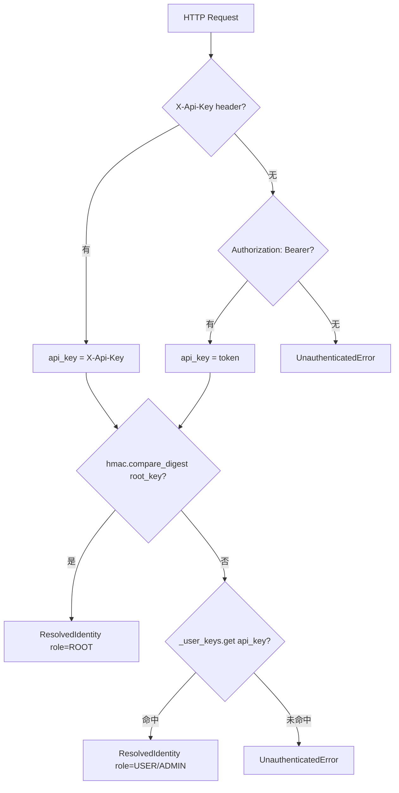
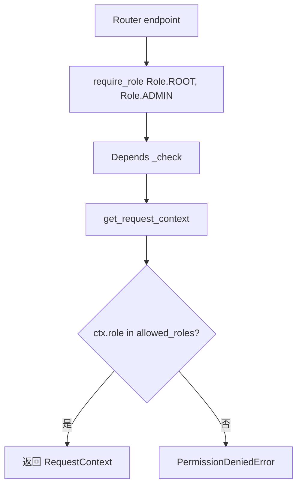

# PD-319.01 OpenViking — 三级角色 RBAC 与 URI 空间租户隔离

> 文档编号：PD-319.01
> 来源：OpenViking `openviking/server/auth.py` `openviking/server/api_keys.py` `openviking/storage/viking_fs.py`
> GitHub：https://github.com/volcengine/OpenViking.git
> 问题域：PD-319 多租户认证授权 Multi-Tenant Auth
> 状态：可复用方案

---

## 第 1 章 问题与动机

### 1.1 核心问题

多租户 Agent 平台需要同时解决三个层面的安全问题：

1. **身份认证**：谁在发请求？API Key 还是 Bearer Token？如何防止时序攻击？
2. **角色授权**：ROOT/ADMIN/USER 三级角色各能做什么？如何在 FastAPI 依赖注入中优雅实现？
3. **数据隔离**：不同 account 的文件系统如何物理隔离？同一 account 内不同 user/agent 的空间如何逻辑隔离？

传统做法是在每个 endpoint 手写 if/else 权限检查，导致授权逻辑散落各处、难以审计。OpenViking 的方案是将认证、授权、隔离分成三个独立层，通过 FastAPI Depends 链串联，实现关注点分离。

### 1.2 OpenViking 的解法概述

1. **APIKeyManager** (`api_keys.py:45`) — 双层 JSON 存储 + 内存索引，O(1) 查找 API Key，`hmac.compare_digest` 防时序攻击
2. **resolve_identity** (`auth.py:14`) — FastAPI 依赖函数，从 Header 提取 API Key 或 Bearer Token，解析为 `ResolvedIdentity`
3. **require_role** (`auth.py:69`) — 依赖工厂，声明式角色校验，用法：`ctx = require_role(Role.ROOT, Role.ADMIN)`
4. **RequestContext** (`identity.py:29`) — 轻量 dataclass，贯穿 Router → Service → VikingFS 全链路
5. **VikingFS._uri_to_path** (`viking_fs.py:851`) — URI 到物理路径的映射自动注入 account_id，实现存储级租户隔离

### 1.3 设计思想

| 设计原则 | 具体实现 | 理由 | 替代方案 |
|----------|----------|------|----------|
| 关注点分离 | 认证(resolve_identity) → 授权(require_role) → 隔离(_uri_to_path) 三层独立 | 每层可独立测试和替换 | 单一中间件处理所有逻辑 |
| 常量时间比较 | `hmac.compare_digest` 比较 root key | 防止时序侧信道攻击 | 直接 `==` 比较 |
| 内存索引 | `_user_keys: Dict[str, UserKeyEntry]` O(1) 查找 | 避免每次请求读磁盘 | 数据库查询 |
| 声明式授权 | `require_role(Role.ROOT)` 作为 Depends 参数 | 权限要求在函数签名中可见 | 装饰器或手动 if 检查 |
| URI 前缀隔离 | `viking://` → `/local/{account_id}/` 自动映射 | 租户无法访问其他租户路径 | 数据库行级过滤 |
| 开发模式降级 | 无 root_api_key 时跳过认证，仅限 localhost | 本地开发零配置 | 始终要求认证 |

---

## 第 2 章 源码实现分析

### 2.1 架构概览

```
┌─────────────────────────────────────────────────────────────────┐
│                        HTTP Request                             │
│  Headers: X-Api-Key / Authorization: Bearer xxx                 │
│           X-OpenViking-Account / X-OpenViking-User              │
└──────────────────────────┬──────────────────────────────────────┘
                           │
                    ┌──────▼──────┐
                    │ resolve_    │  auth.py:14
                    │ identity()  │  提取 Key → APIKeyManager.resolve()
                    └──────┬──────┘
                           │ ResolvedIdentity(role, account_id, user_id)
                    ┌──────▼──────┐
                    │ get_request │  auth.py:55
                    │ _context()  │  → RequestContext(user, role)
                    └──────┬──────┘
                           │
                    ┌──────▼──────┐
                    │ require_    │  auth.py:69
                    │ role()      │  角色校验 → PermissionDeniedError
                    └──────┬──────┘
                           │ RequestContext
          ┌────────────────┼────────────────┐
          │                │                │
   ┌──────▼──────┐ ┌──────▼──────┐ ┌───────▼──────┐
   │   Router    │ │   Service   │ │   VikingFS   │
   │  (admin)    │ │  (core)     │ │ _uri_to_path │
   │  admin.py   │ │ fs_service  │ │ _is_accessible│
   └─────────────┘ └─────────────┘ └──────────────┘
                                     viking://user/...
                                        ↓
                                   /local/{account_id}/user/...
```

### 2.2 核心实现

#### 2.2.1 API Key 解析与身份识别



对应源码 `openviking/server/auth.py:14-52`：

```python
async def resolve_identity(
    request: Request,
    x_api_key: Optional[str] = Header(None),
    authorization: Optional[str] = Header(None),
    x_openviking_account: Optional[str] = Header(None, alias="X-OpenViking-Account"),
    x_openviking_user: Optional[str] = Header(None, alias="X-OpenViking-User"),
    x_openviking_agent: Optional[str] = Header(None, alias="X-OpenViking-Agent"),
) -> ResolvedIdentity:
    api_key_manager = getattr(request.app.state, "api_key_manager", None)
    if api_key_manager is None:
        # Dev mode: no auth required
        return ResolvedIdentity(
            role=Role.ROOT,
            account_id=x_openviking_account or "default",
            user_id=x_openviking_user or "default",
            agent_id=x_openviking_agent or "default",
        )
    api_key = x_api_key
    if not api_key and authorization:
        if authorization.startswith("Bearer "):
            api_key = authorization[7:]
    if not api_key:
        raise UnauthenticatedError("Missing API Key")
    identity = api_key_manager.resolve(api_key)
    identity.agent_id = x_openviking_agent or "default"
    if identity.role == Role.ROOT:
        identity.account_id = x_openviking_account or identity.account_id or "default"
        identity.user_id = x_openviking_user or identity.user_id or "default"
    return identity
```

关键设计点：ROOT 角色可通过 Header 切换 account/user 身份（`auth.py:49-51`），实现管理员代操作。

#### 2.2.2 APIKeyManager 双层存储与内存索引

```mermaid
graph TD
    A[APIKeyManager.load] --> B[读取 /_system/accounts.json]
    B --> C{accounts.json 存在?}
    C -->|否| D[创建 default account]
    C -->|是| E[遍历每个 account]
    E --> F[读取 /{account_id}/_system/users.json]
    F --> G[构建 _user_keys 内存索引]
    G --> H[O1 查找就绪]
    I[resolve api_key] --> J{hmac.compare_digest root_key}
    J -->|是| K[ROOT]
    J -->|否| L[_user_keys.get]
    L -->|命中| M[USER/ADMIN]
    L -->|未命中| N[UnauthenticatedError]
```

对应源码 `openviking/server/api_keys.py:95-111`：

```python
def resolve(self, api_key: str) -> ResolvedIdentity:
    if not api_key:
        raise UnauthenticatedError("Missing API Key")
    # 常量时间比较防时序攻击
    if hmac.compare_digest(api_key, self._root_key):
        return ResolvedIdentity(role=Role.ROOT)
    # O(1) 内存索引查找
    entry = self._user_keys.get(api_key)
    if entry:
        return ResolvedIdentity(
            role=entry.role,
            account_id=entry.account_id,
            user_id=entry.user_id,
        )
    raise UnauthenticatedError("Invalid API Key")
```

存储结构（`api_keys.py:24-25`）：

```
AGFS 文件系统
├── /local/_system/accounts.json          # 全局账户列表
│   {"accounts": {"default": {"created_at": "..."}, "acme": {...}}}
├── /local/default/_system/users.json     # default 账户的用户注册表
│   {"users": {"alice": {"role": "admin", "key": "abc123..."}, ...}}
└── /local/acme/_system/users.json        # acme 账户的用户注册表
```

#### 2.2.3 声明式角色校验工厂



对应源码 `openviking/server/auth.py:69-85`：

```python
def require_role(*allowed_roles: Role):
    async def _check(ctx: RequestContext = Depends(get_request_context)):
        if ctx.role not in allowed_roles:
            raise PermissionDeniedError(
                f"Requires role: {', '.join(r.value for r in allowed_roles)}"
            )
        return ctx
    return Depends(_check)
```

Router 中的使用（`admin.py:53-57`）：

```python
@router.post("/accounts")
async def create_account(
    body: CreateAccountRequest,
    request: Request,
    ctx: RequestContext = require_role(Role.ROOT),  # 声明式：仅 ROOT 可调用
):
```

### 2.3 实现细节

#### URI 到物理路径的租户隔离

VikingFS 的 `_uri_to_path` 方法（`viking_fs.py:851-865`）是数据隔离的核心：

```python
def _uri_to_path(self, uri: str, ctx: Optional[RequestContext] = None) -> str:
    real_ctx = self._ctx_or_default(ctx)
    account_id = real_ctx.account_id
    remainder = uri[len("viking://"):].strip("/") if uri.startswith("viking://") else uri
    if not remainder:
        return f"/local/{account_id}"
    parts = [p for p in remainder.split("/") if p]
    safe_parts = [self._shorten_component(p, self._MAX_FILENAME_BYTES) for p in parts]
    return f"/local/{account_id}/{'/'.join(safe_parts)}"
```

每个 account 的数据自动映射到独立的 `/local/{account_id}/` 前缀下，无需业务代码感知。

#### 空间级访问控制

`_is_accessible` 方法（`viking_fs.py:928-953`）实现 scope 级别的细粒度控制：

- ROOT 角色：全部可访问
- `resources`/`temp` scope：所有角色可访问（共享资源）
- `_system` scope：仅 ROOT 可访问
- `user`/`session` scope：仅匹配 `user_space_name()` 的用户可访问
- `agent` scope：仅匹配 `agent_space_name()` 的用户可访问（MD5 哈希隔离）

#### UserIdentifier 三维空间命名

`UserIdentifier`（`user_id.py:5-85`）通过 `account_id:user_id:agent_id` 三元组生成隔离空间名：

```python
def user_space_name(self) -> str:
    return self._user_id  # user 级空间

def agent_space_name(self) -> str:
    return hashlib.md5((self._user_id + self._agent_id).encode()).hexdigest()[:12]  # agent 级空间
```


---

## 第 3 章 迁移指南

### 3.1 迁移清单

**Phase 1：身份模型（1 个文件）**

- [ ] 定义 `Role` 枚举（ROOT/ADMIN/USER 或自定义层级）
- [ ] 创建 `ResolvedIdentity` dataclass（认证层输出）
- [ ] 创建 `RequestContext` dataclass（业务层传递）

**Phase 2：API Key 管理（1 个文件）**

- [ ] 实现 `APIKeyManager`，支持 `resolve(api_key) -> ResolvedIdentity`
- [ ] 使用 `hmac.compare_digest` 比较 root key
- [ ] 使用 `secrets.token_hex(32)` 生成用户 key
- [ ] 实现内存索引 `Dict[str, UserKeyEntry]` 加速查找
- [ ] 实现 key 轮换（`regenerate_key`）：旧 key 立即失效

**Phase 3：FastAPI 认证中间件（1 个文件）**

- [ ] 实现 `resolve_identity` 依赖函数
- [ ] 实现 `get_request_context` 转换函数
- [ ] 实现 `require_role` 工厂函数
- [ ] 配置开发模式降级（无 key 时跳过认证）

**Phase 4：存储层隔离**

- [ ] 在文件系统/数据库层注入 `account_id` 前缀
- [ ] 实现 `_is_accessible` 空间级访问控制

### 3.2 适配代码模板

以下模板可直接用于 FastAPI 项目：

```python
"""auth.py — 可复用的三级角色认证模板"""
import hmac
import secrets
from dataclasses import dataclass
from enum import Enum
from typing import Dict, Optional

from fastapi import Depends, Header, Request


class Role(str, Enum):
    ROOT = "root"
    ADMIN = "admin"
    USER = "user"


@dataclass
class RequestContext:
    account_id: str
    user_id: str
    role: Role


class APIKeyManager:
    def __init__(self, root_key: str):
        self._root_key = root_key
        self._keys: Dict[str, dict] = {}  # key -> {account_id, user_id, role}

    def resolve(self, api_key: str) -> RequestContext:
        if hmac.compare_digest(api_key, self._root_key):
            return RequestContext(account_id="*", user_id="root", role=Role.ROOT)
        entry = self._keys.get(api_key)
        if entry:
            return RequestContext(**entry)
        raise ValueError("Invalid API Key")

    def create_key(self, account_id: str, user_id: str, role: Role = Role.USER) -> str:
        key = secrets.token_hex(32)
        self._keys[key] = {"account_id": account_id, "user_id": user_id, "role": role}
        return key

    def revoke_key(self, api_key: str) -> None:
        self._keys.pop(api_key, None)


async def get_request_context(
    request: Request,
    x_api_key: Optional[str] = Header(None),
    authorization: Optional[str] = Header(None),
) -> RequestContext:
    manager: Optional[APIKeyManager] = getattr(request.app.state, "api_key_manager", None)
    if manager is None:
        return RequestContext(account_id="default", user_id="default", role=Role.ROOT)
    api_key = x_api_key
    if not api_key and authorization and authorization.startswith("Bearer "):
        api_key = authorization[7:]
    if not api_key:
        raise ValueError("Missing API Key")
    return manager.resolve(api_key)


def require_role(*allowed: Role):
    async def _check(ctx: RequestContext = Depends(get_request_context)):
        if ctx.role not in allowed:
            raise PermissionError(f"Requires: {', '.join(r.value for r in allowed)}")
        return ctx
    return Depends(_check)
```

### 3.3 适用场景

| 场景 | 适用度 | 说明 |
|------|--------|------|
| 多租户 SaaS API | ⭐⭐⭐ | 完美匹配：account 隔离 + 角色分级 |
| Agent 平台（多用户） | ⭐⭐⭐ | RequestContext 贯穿全链路，agent 级空间隔离 |
| 内部工具（单租户） | ⭐⭐ | 可简化为 ROOT + USER 两级 |
| 公开 API（无租户概念） | ⭐ | 过度设计，直接用 API Key 认证即可 |
| 需要 OAuth2/OIDC 的场景 | ⭐ | 本方案是 API Key 体系，不含 OAuth 流程 |

---

## 第 4 章 测试用例

```python
"""test_auth.py — 基于 OpenViking 真实函数签名的测试"""
import hmac
import pytest
from unittest.mock import MagicMock, AsyncMock, patch
from dataclasses import dataclass
from enum import Enum


# ---- 测试 APIKeyManager.resolve ----

class TestAPIKeyManagerResolve:
    """测试 api_keys.py:95-111 的 resolve 方法"""

    def setup_method(self):
        from openviking.server.api_keys import APIKeyManager, UserKeyEntry
        from openviking.server.identity import Role
        self.manager = APIKeyManager.__new__(APIKeyManager)
        self.manager._root_key = "root-secret-key"
        self.manager._user_keys = {
            "user-key-abc": UserKeyEntry(
                account_id="acme", user_id="alice", role=Role.USER
            ),
            "admin-key-xyz": UserKeyEntry(
                account_id="acme", user_id="bob", role=Role.ADMIN
            ),
        }

    def test_root_key_resolves_to_root_role(self):
        identity = self.manager.resolve("root-secret-key")
        assert identity.role.value == "root"

    def test_user_key_resolves_correctly(self):
        identity = self.manager.resolve("user-key-abc")
        assert identity.role.value == "user"
        assert identity.account_id == "acme"
        assert identity.user_id == "alice"

    def test_invalid_key_raises(self):
        from openviking_cli.exceptions import UnauthenticatedError
        with pytest.raises(UnauthenticatedError):
            self.manager.resolve("invalid-key")

    def test_empty_key_raises(self):
        from openviking_cli.exceptions import UnauthenticatedError
        with pytest.raises(UnauthenticatedError):
            self.manager.resolve("")

    def test_timing_safe_comparison(self):
        """验证 root key 使用 hmac.compare_digest 而非 =="""
        # hmac.compare_digest 是常量时间比较，防止时序攻击
        assert hmac.compare_digest("root-secret-key", "root-secret-key") is True
        assert hmac.compare_digest("root-secret-key", "wrong-key") is False


# ---- 测试 require_role ----

class TestRequireRole:
    """测试 auth.py:69-85 的 require_role 工厂"""

    def test_allowed_role_passes(self):
        from openviking.server.identity import RequestContext, Role
        from openviking_cli.session.user_id import UserIdentifier
        ctx = RequestContext(
            user=UserIdentifier("acme", "alice", "default"),
            role=Role.ROOT,
        )
        # ROOT 在 allowed_roles 中，应通过
        assert ctx.role in {Role.ROOT, Role.ADMIN}

    def test_disallowed_role_blocked(self):
        from openviking.server.identity import RequestContext, Role
        from openviking_cli.session.user_id import UserIdentifier
        ctx = RequestContext(
            user=UserIdentifier("acme", "alice", "default"),
            role=Role.USER,
        )
        # USER 不在 {ROOT} 中，应拒绝
        assert ctx.role not in {Role.ROOT}


# ---- 测试 UserIdentifier 空间隔离 ----

class TestUserIdentifierSpaces:
    """测试 user_id.py:48-60 的空间命名"""

    def test_user_space_name(self):
        from openviking_cli.session.user_id import UserIdentifier
        uid = UserIdentifier("acme", "alice", "agent-1")
        assert uid.user_space_name() == "alice"

    def test_agent_space_name_is_hash(self):
        from openviking_cli.session.user_id import UserIdentifier
        uid = UserIdentifier("acme", "alice", "agent-1")
        space = uid.agent_space_name()
        assert len(space) == 12  # MD5 前 12 位
        assert space.isalnum()

    def test_different_agents_different_spaces(self):
        from openviking_cli.session.user_id import UserIdentifier
        uid1 = UserIdentifier("acme", "alice", "agent-1")
        uid2 = UserIdentifier("acme", "alice", "agent-2")
        assert uid1.agent_space_name() != uid2.agent_space_name()

    def test_validation_rejects_special_chars(self):
        from openviking_cli.session.user_id import UserIdentifier
        with pytest.raises(ValueError):
            UserIdentifier("acme", "alice/../bob", "default")
```


---

## 第 5 章 跨域关联

| 关联域 | 关系类型 | 说明 |
|--------|----------|------|
| PD-06 记忆持久化 | 依赖 | APIKeyManager 的 accounts.json / users.json 持久化到 AGFS，依赖文件系统存储层 |
| PD-10 中间件管道 | 协同 | resolve_identity → get_request_context → require_role 构成三级 Depends 管道 |
| PD-11 可观测性 | 协同 | RequestContext 中的 account_id/user_id 可作为日志和指标的维度标签 |
| PD-05 沙箱隔离 | 协同 | VikingFS 的 URI 前缀隔离是存储层沙箱的一种实现，与代码执行沙箱互补 |

---

## 第 6 章 来源文件索引

| 文件 | 行范围 | 关键实现 |
|------|--------|----------|
| `openviking/server/identity.py` | L12-L37 | Role 枚举、ResolvedIdentity、RequestContext 定义 |
| `openviking/server/auth.py` | L14-L52 | resolve_identity 依赖函数（API Key 提取与解析） |
| `openviking/server/auth.py` | L55-L66 | get_request_context 转换函数 |
| `openviking/server/auth.py` | L69-L85 | require_role 声明式角色校验工厂 |
| `openviking/server/api_keys.py` | L45-L111 | APIKeyManager 类定义与 resolve 方法 |
| `openviking/server/api_keys.py` | L113-L206 | 账户/用户 CRUD 与 key 轮换 |
| `openviking/server/app.py` | L66-L83 | APIKeyManager 初始化与开发模式降级 |
| `openviking/server/routers/admin.py` | L44-L47 | _check_account_access ADMIN 越权检查 |
| `openviking/server/routers/admin.py` | L53-L76 | create_account 端点（ROOT only） |
| `openviking/storage/viking_fs.py` | L173-L194 | contextvars 绑定 RequestContext |
| `openviking/storage/viking_fs.py` | L851-L865 | _uri_to_path URI 到物理路径映射（租户隔离核心） |
| `openviking/storage/viking_fs.py` | L928-L953 | _is_accessible 空间级访问控制 |
| `openviking_cli/session/user_id.py` | L5-L54 | UserIdentifier 三维空间命名与验证 |
| `openviking_cli/exceptions.py` | L76-L88 | UnauthenticatedError / PermissionDeniedError |

---

## 第 7 章 横向对比维度

```json comparison_data
{
  "project": "OpenViking",
  "dimensions": {
    "认证方式": "API Key + Bearer Token 双通道，hmac.compare_digest 防时序攻击",
    "角色模型": "ROOT/ADMIN/USER 三级枚举，require_role 声明式 Depends 工厂",
    "租户隔离": "URI 前缀自动注入 account_id，viking:// → /local/{account_id}/ 物理隔离",
    "空间粒度": "三维隔离：account → user_space_name → agent_space_name(MD5 哈希)",
    "Key 管理": "双层 JSON 存储 + 内存 Dict 索引，O(1) 查找，支持即时轮换",
    "开发模式": "无 root_api_key 时自动降级为 ROOT 免认证，仅限 localhost"
  }
}
```

### 域元数据补充

```json domain_metadata
{
  "solution_summary": "OpenViking 用 APIKeyManager 双层 JSON + 内存索引实现 O(1) Key 解析，require_role Depends 工厂声明式授权，VikingFS URI 前缀自动注入 account_id 实现存储级租户隔离",
  "description": "API Key 体系下的声明式 RBAC 与 URI 前缀物理隔离",
  "sub_problems": [
    "开发模式免认证降级与生产模式切换",
    "ADMIN 角色跨账户越权防护",
    "agent 级空间哈希命名与碰撞控制"
  ],
  "best_practices": [
    "require_role 工厂让权限要求在函数签名中可见可审计",
    "contextvars.ContextVar 绑定 RequestContext 兼容遗留调用路径",
    "secrets.token_hex(32) 生成 256-bit 密码学安全 Key"
  ]
}
```

