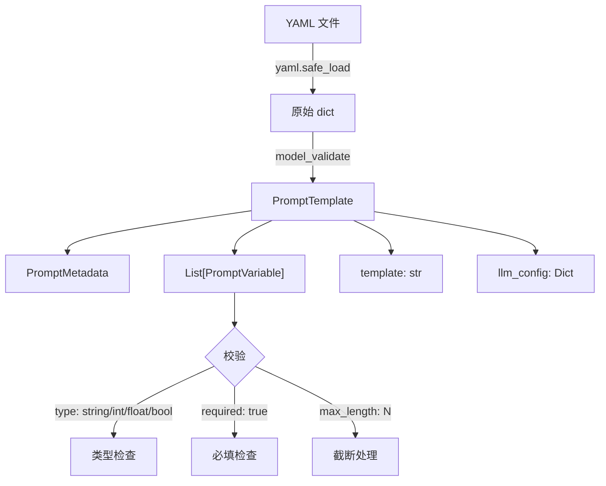
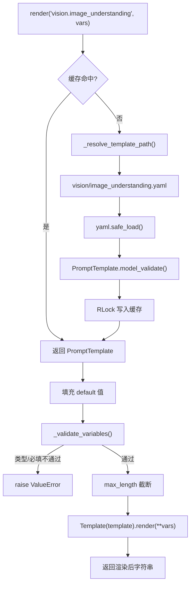

# PD-320.01 OpenViking — YAML 驱动 Prompt 模板与 Jinja2 渲染引擎

> 文档编号：PD-320.01
> 来源：OpenViking `openviking/prompts/manager.py`
> GitHub：https://github.com/volcengine/OpenViking.git
> 问题域：PD-320 Prompt 模板管理 Prompt Template Management
> 状态：可复用方案

---

## 第 1 章 问题与动机

### 1.1 核心问题

LLM 应用中 Prompt 是最核心的"代码"，但大多数项目将 Prompt 硬编码在业务逻辑中，导致：

1. **散落各处难以维护** — Prompt 字符串分散在 10+ 个 Python 文件中，修改一个措辞需要全局搜索
2. **变量注入不安全** — f-string 或 `.format()` 无法校验变量类型、缺失、超长，运行时才暴露错误
3. **LLM 配置与 Prompt 脱节** — temperature、supports_vision 等参数写在调用侧，与 Prompt 意图分离
4. **无法按类别管理** — compression/retrieval/vision/semantic 等不同用途的 Prompt 混在一起
5. **重复加载浪费** — 同一模板被多次读取解析，无缓存机制

### 1.2 OpenViking 的解法概述

OpenViking 构建了一套完整的 YAML 驱动 Prompt 模板系统：

1. **YAML 声明式模板** — 每个 Prompt 是一个 YAML 文件，包含 metadata/variables/template/llm_config 四段结构（`openviking/prompts/templates/` 下 28 个模板文件）
2. **Pydantic 强类型校验** — `PromptVariable` 定义 name/type/required/max_length，渲染前自动校验（`manager.py:170-195`）
3. **Jinja2 渲染引擎** — 支持条件分支 `` 和循环，比 f-string 强大得多（`manager.py:167-168`）
4. **线程安全缓存** — `threading.RLock` 保护的字典缓存，加载一次后续零开销（`manager.py:72-73`）
5. **全局单例 + 便捷函数** — `render_prompt()` 一行调用，业务代码零感知模板系统存在（`manager.py:243-254`）

### 1.3 设计思想

| 设计原则 | 具体实现 | 理由 | 替代方案 |
|----------|----------|------|----------|
| 声明式优于命令式 | YAML 文件定义模板元数据和变量约束 | 非开发者也能修改 Prompt，版本控制友好 | Python 装饰器定义（代码耦合） |
| 关注点分离 | template/variables/llm_config 三段独立 | Prompt 文本、变量约束、LLM 参数各自演进 | 全部写在一个 dict 里 |
| 约定优于配置 | `category.name` → `category/name.yaml` 路径映射 | 零配置的 ID 到文件映射 | 注册表手动映射 |
| 防御式编程 | max_length 自动截断 + 类型校验 | 防止超长变量撑爆 context window | 调用侧自行截断 |
| 全局单例模式 | `_default_manager` + `get_manager()` | 整个进程共享缓存，避免重复加载 | 依赖注入框架 |

---

## 第 2 章 源码实现分析

### 2.1 架构概览

OpenViking 的 Prompt 模板系统由三层组成：

```
┌─────────────────────────────────────────────────────────┐
│                    业务调用层                              │
│  vlm.py / intent_analyzer.py / memory_extractor.py      │
│  → render_prompt("vision.image_understanding", vars)    │
├─────────────────────────────────────────────────────────┤
│                  PromptManager 核心层                     │
│  ┌──────────┐  ┌──────────┐  ┌──────────┐  ┌────────┐  │
│  │ 路径解析  │→│ YAML加载  │→│ 变量校验  │→│ Jinja2  │  │
│  │ resolve  │  │ safe_load │  │ validate │  │ render │  │
│  └──────────┘  └──────────┘  └──────────┘  └────────┘  │
│       ↑              ↑                                   │
│  ┌──────────┐  ┌──────────┐                              │
│  │ ID映射   │  │ RLock    │                              │
│  │ dot→path │  │ 缓存     │                              │
│  └──────────┘  └──────────┘                              │
├─────────────────────────────────────────────────────────┤
│                   YAML 模板层                             │
│  templates/                                              │
│  ├── compression/ (5 files)  ├── retrieval/ (1 file)    │
│  ├── parsing/ (4 files)      ├── semantic/ (5 files)    │
│  ├── processing/ (3 files)   ├── vision/ (7 files)      │
│  ├── indexing/ (1 file)      ├── skill/ (1 file)        │
│  └── test/ (1 file)                                      │
└─────────────────────────────────────────────────────────┘
```

### 2.2 核心实现

#### 2.2.1 Pydantic 数据模型



对应源码 `openviking/prompts/manager.py:14-43`：

```python
class PromptMetadata(BaseModel):
    """Metadata for a prompt template."""
    id: str
    name: str
    description: str
    version: str
    language: str
    category: str

class PromptVariable(BaseModel):
    """Variable definition for a prompt template."""
    name: str
    type: str
    description: str
    default: Any = None
    required: bool = True
    max_length: Optional[int] = None

class PromptTemplate(BaseModel):
    """Complete prompt template definition."""
    metadata: PromptMetadata
    variables: List[PromptVariable] = Field(default_factory=list)
    template: str
    output_schema: Optional[Dict[str, Any]] = None
    llm_config: Optional[Dict[str, Any]] = None
```

三个 Pydantic 模型形成层级结构：`PromptTemplate` 聚合 `PromptMetadata` + `List[PromptVariable]`。`output_schema` 字段预留了输出格式约束能力，`llm_config` 将 LLM 调用参数与模板绑定。

#### 2.2.2 渲染管线：加载 → 校验 → 截断 → Jinja2



对应源码 `openviking/prompts/manager.py:125-168`：

```python
def render(
    self,
    prompt_id: str,
    variables: Optional[Dict[str, Any]] = None,
    validate: bool = True,
) -> str:
    template = self.load_template(prompt_id)
    variables = variables or {}

    # Apply defaults
    for var_def in template.variables:
        if var_def.name not in variables and var_def.default is not None:
            variables[var_def.name] = var_def.default

    # Validate variables
    if validate:
        self._validate_variables(template, variables)

    # Truncate string variables to max_length
    for var_def in template.variables:
        if (
            var_def.max_length
            and var_def.name in variables
            and isinstance(variables[var_def.name], str)
        ):
            variables[var_def.name] = variables[var_def.name][: var_def.max_length]

    # Render template with Jinja2
    jinja_template = Template(template.template)
    return jinja_template.render(**variables)
```

关键设计：default 填充 → 校验 → 截断 → 渲染，顺序不可颠倒。截断在校验之后，确保先验证类型正确再截断长度。

### 2.3 实现细节

#### 路径解析约定

`_resolve_template_path` (`manager.py:112-123`) 将点分 ID 映射为文件路径：

- `"vision.image_understanding"` → `templates/vision/image_understanding.yaml`
- `"compression.dedup_decision"` → `templates/compression/dedup_decision.yaml`

这个约定使得模板的物理组织与逻辑 ID 完全对应，新增模板只需放对目录即可。

#### 模板分类体系

28 个模板按 9 个类别组织，覆盖 OpenViking 的完整 LLM 调用场景：

| 类别 | 数量 | 代表模板 | 用途 |
|------|------|----------|------|
| compression | 5 | dedup_decision, memory_extraction | 记忆压缩与去重 |
| vision | 7 | image_understanding, unified_analysis | VLM 图像/表格理解 |
| semantic | 5 | code_summary, overview_generation | 语义摘要生成 |
| parsing | 4 | chapter_analysis, semantic_grouping | 文档解析 |
| processing | 3 | tool_chain_analysis, strategy_extraction | 交互学习 |
| retrieval | 1 | intent_analysis | 检索意图分析 |
| indexing | 1 | relevance_scoring | 相关性评分 |
| skill | 1 | overview_generation | 技能概览 |
| test | 1 | skill_test_generation | 测试生成 |

#### Jinja2 条件分支实战

`retrieval/intent_analysis.yaml` 展示了 Jinja2 条件渲染的典型用法（`intent_analysis.yaml:51-61`）：

```jinja2

## Search Scope Constraints
**Restricted Context Type**: {{ context_type }}

**Target Directory Abstract**: {{ target_abstract }}

**Important**: You can only generate `{{ context_type }}` type queries.

```

当 `context_type` 为空时整个约束段不渲染，避免向 LLM 发送无意义的空白段落。

#### llm_config 与模板绑定

每个 YAML 模板可携带 `llm_config` 字段（如 `vision/image_understanding.yaml:36-38`）：

```yaml
llm_config:
  temperature: 0.0
  supports_vision: true
```

业务代码通过 `get_llm_config(prompt_id)` 获取配置，实现"Prompt 决定自己需要什么样的 LLM"。

---

## 第 3 章 迁移指南

### 3.1 迁移清单

**阶段 1：基础设施（1 个文件）**
- [ ] 创建 `prompts/manager.py`，包含 PromptMetadata/PromptVariable/PromptTemplate 三个 Pydantic 模型
- [ ] 实现 PromptManager 类：load_template / render / _validate_variables / _resolve_template_path
- [ ] 添加全局单例 `get_manager()` 和便捷函数 `render_prompt()`

**阶段 2：模板迁移（逐个替换）**
- [ ] 创建 `prompts/templates/` 目录，按业务类别建子目录
- [ ] 将现有硬编码 Prompt 逐个提取为 YAML 文件
- [ ] 为每个变量定义 type/required/max_length 约束
- [ ] 添加 llm_config 字段绑定 LLM 参数

**阶段 3：业务代码改造**
- [ ] 将 f-string Prompt 替换为 `render_prompt("category.name", vars)`
- [ ] 将散落的 temperature 等参数改为从 `get_llm_config()` 获取

### 3.2 适配代码模板

以下代码可直接复用，仅需调整 import 路径：

```python
"""Prompt template manager — 可直接复用的最小实现。"""

import threading
from pathlib import Path
from typing import Any, Dict, List, Optional

import yaml
from jinja2 import Template
from pydantic import BaseModel, Field


class PromptVariable(BaseModel):
    name: str
    type: str  # "string" | "int" | "float" | "bool"
    description: str = ""
    default: Any = None
    required: bool = True
    max_length: Optional[int] = None


class PromptTemplate(BaseModel):
    metadata: Dict[str, str]  # id, name, version, category
    variables: List[PromptVariable] = Field(default_factory=list)
    template: str
    llm_config: Optional[Dict[str, Any]] = None


_TYPE_MAP = {
    "string": str,
    "int": int,
    "float": (int, float),
    "bool": bool,
}


class PromptManager:
    def __init__(self, templates_dir: Path, enable_caching: bool = True):
        self.templates_dir = templates_dir
        self._cache: Dict[str, PromptTemplate] = {}
        self._lock = threading.RLock()
        self._caching = enable_caching

    def render(self, prompt_id: str, variables: Optional[Dict[str, Any]] = None) -> str:
        tpl = self._load(prompt_id)
        vs = dict(variables or {})

        # 1. 填充默认值
        for v in tpl.variables:
            if v.name not in vs and v.default is not None:
                vs[v.name] = v.default

        # 2. 校验必填 + 类型
        for v in tpl.variables:
            if v.required and v.name not in vs:
                raise ValueError(f"Missing required variable: {v.name}")
            if v.name in vs:
                expected = _TYPE_MAP.get(v.type)
                if expected and not isinstance(vs[v.name], expected):
                    raise TypeError(f"{v.name}: expected {v.type}, got {type(vs[v.name]).__name__}")

        # 3. 截断
        for v in tpl.variables:
            if v.max_length and v.name in vs and isinstance(vs[v.name], str):
                vs[v.name] = vs[v.name][: v.max_length]

        # 4. Jinja2 渲染
        return Template(tpl.template).render(**vs)

    def _load(self, prompt_id: str) -> PromptTemplate:
        if self._caching and prompt_id in self._cache:
            return self._cache[prompt_id]
        path = self._resolve(prompt_id)
        with open(path, encoding="utf-8") as f:
            data = yaml.safe_load(f)
        tpl = PromptTemplate.model_validate(data)
        if self._caching:
            with self._lock:
                self._cache[prompt_id] = tpl
        return tpl

    def _resolve(self, prompt_id: str) -> Path:
        parts = prompt_id.split(".")
        return self.templates_dir / parts[0] / f"{'_'.join(parts[1:])}.yaml"


# 全局单例
_mgr: Optional[PromptManager] = None

def init_prompts(templates_dir: Path):
    global _mgr
    _mgr = PromptManager(templates_dir)

def render_prompt(prompt_id: str, variables: Optional[Dict[str, Any]] = None) -> str:
    assert _mgr, "Call init_prompts() first"
    return _mgr.render(prompt_id, variables)
```

### 3.3 适用场景

| 场景 | 适用度 | 说明 |
|------|--------|------|
| LLM 应用有 10+ 个不同 Prompt | ⭐⭐⭐ | 模板系统的核心价值场景 |
| 需要非开发者修改 Prompt | ⭐⭐⭐ | YAML 格式对产品/运营友好 |
| 多模态 LLM 调用（vision/text） | ⭐⭐⭐ | llm_config 绑定 supports_vision |
| Prompt 变量来自用户输入 | ⭐⭐⭐ | max_length 截断防止注入/超长 |
| 单个简单 Prompt 的小工具 | ⭐ | 过度工程，直接 f-string 即可 |
| 需要 Prompt A/B 测试 | ⭐⭐ | 可通过 version 字段扩展，但当前无内置支持 |

---

## 第 4 章 测试用例

```python
"""Tests for PromptManager — 基于 OpenViking 真实函数签名。"""

import tempfile
from pathlib import Path

import pytest
import yaml


# ---- 测试用 YAML 模板 ----
SAMPLE_TEMPLATE = {
    "metadata": {
        "id": "test.greeting",
        "name": "Greeting",
        "description": "Test template",
        "version": "1.0.0",
        "language": "en",
        "category": "test",
    },
    "variables": [
        {"name": "user_name", "type": "string", "description": "User name", "required": True},
        {
            "name": "context",
            "type": "string",
            "description": "Context",
            "required": False,
            "default": "general",
            "max_length": 50,
        },
        {"name": "count", "type": "int", "description": "Count", "required": False, "default": 3},
    ],
    "template": "Hello {{ user_name }}! Context: {{ context }}. Count: {{ count }}.",
    "llm_config": {"temperature": 0.0},
}


@pytest.fixture
def templates_dir(tmp_path):
    """Create a temporary templates directory with a sample template."""
    test_dir = tmp_path / "test"
    test_dir.mkdir()
    with open(test_dir / "greeting.yaml", "w") as f:
        yaml.dump(SAMPLE_TEMPLATE, f)
    return tmp_path


class TestPromptManager:
    def test_render_normal(self, templates_dir):
        from openviking.prompts.manager import PromptManager

        mgr = PromptManager(templates_dir=templates_dir)
        result = mgr.render("test.greeting", {"user_name": "Alice"})
        assert "Hello Alice!" in result
        assert "Context: general" in result  # default 填充
        assert "Count: 3" in result  # default 填充

    def test_missing_required_variable(self, templates_dir):
        from openviking.prompts.manager import PromptManager

        mgr = PromptManager(templates_dir=templates_dir)
        with pytest.raises(ValueError, match="Required variable 'user_name'"):
            mgr.render("test.greeting", {})

    def test_type_validation(self, templates_dir):
        from openviking.prompts.manager import PromptManager

        mgr = PromptManager(templates_dir=templates_dir)
        with pytest.raises(ValueError, match="expects type int"):
            mgr.render("test.greeting", {"user_name": "Bob", "count": "not_int"})

    def test_max_length_truncation(self, templates_dir):
        from openviking.prompts.manager import PromptManager

        mgr = PromptManager(templates_dir=templates_dir)
        long_context = "x" * 200
        result = mgr.render("test.greeting", {"user_name": "Bob", "context": long_context})
        # max_length=50, 所以 context 被截断
        assert "x" * 50 in result
        assert "x" * 51 not in result

    def test_cache_hit(self, templates_dir):
        from openviking.prompts.manager import PromptManager

        mgr = PromptManager(templates_dir=templates_dir, enable_caching=True)
        t1 = mgr.load_template("test.greeting")
        t2 = mgr.load_template("test.greeting")
        assert t1 is t2  # 同一对象，缓存命中

    def test_cache_disabled(self, templates_dir):
        from openviking.prompts.manager import PromptManager

        mgr = PromptManager(templates_dir=templates_dir, enable_caching=False)
        t1 = mgr.load_template("test.greeting")
        t2 = mgr.load_template("test.greeting")
        assert t1 is not t2  # 不同对象，每次重新加载

    def test_list_prompts(self, templates_dir):
        from openviking.prompts.manager import PromptManager

        mgr = PromptManager(templates_dir=templates_dir)
        prompts = mgr.list_prompts()
        assert "test.greeting" in prompts

    def test_get_llm_config(self, templates_dir):
        from openviking.prompts.manager import PromptManager

        mgr = PromptManager(templates_dir=templates_dir)
        config = mgr.get_llm_config("test.greeting")
        assert config["temperature"] == 0.0

    def test_file_not_found(self, templates_dir):
        from openviking.prompts.manager import PromptManager

        mgr = PromptManager(templates_dir=templates_dir)
        with pytest.raises(FileNotFoundError):
            mgr.load_template("nonexistent.template")
```

---

## 第 5 章 跨域关联

| 关联域 | 关系类型 | 说明 |
|--------|----------|------|
| PD-01 上下文管理 | 协同 | `max_length` 截断直接服务于 context window 保护，compression 类模板负责会话压缩 |
| PD-06 记忆持久化 | 协同 | `compression.memory_extraction` 和 `compression.dedup_decision` 模板驱动记忆提取与去重决策 |
| PD-08 搜索与检索 | 协同 | `retrieval.intent_analysis` 模板驱动检索意图分析，生成 skill/resource/memory 三类查询计划 |
| PD-04 工具系统 | 依赖 | `processing.tool_chain_analysis` 模板分析工具调用链，提取使用模式 |
| PD-07 质量检查 | 协同 | 模板的 `output_schema` 字段可约束 LLM 输出格式，间接保障输出质量 |
| PD-11 可观测性 | 协同 | `llm_config` 绑定使得每个 Prompt 的 LLM 参数可追踪，便于成本归因 |

---

## 第 6 章 来源文件索引

| 文件 | 行范围 | 关键实现 |
|------|--------|----------|
| `openviking/prompts/manager.py` | L14-43 | Pydantic 数据模型：PromptMetadata, PromptVariable, PromptTemplate |
| `openviking/prompts/manager.py` | L46-110 | PromptManager 类：缓存、加载、路径解析 |
| `openviking/prompts/manager.py` | L125-168 | render() 方法：默认值填充 → 校验 → 截断 → Jinja2 渲染 |
| `openviking/prompts/manager.py` | L170-195 | _validate_variables()：必填检查 + 四类型校验 |
| `openviking/prompts/manager.py` | L230-267 | 全局单例 + 便捷函数 render_prompt / get_llm_config |
| `openviking/prompts/__init__.py` | L1-7 | 公开 API：render_prompt, get_llm_config, get_manager |
| `openviking/prompts/templates/vision/image_understanding.yaml` | 全文 | 典型模板：VLM 图像理解，含 max_length 和 llm_config |
| `openviking/prompts/templates/retrieval/intent_analysis.yaml` | L38-243 | 复杂模板：Jinja2 条件分支 + 248 行 Prompt |
| `openviking/prompts/templates/compression/memory_extraction.yaml` | 全文 | 最复杂模板：294 行，6 类记忆分类 + few-shot 示例 |
| `openviking/prompts/templates/compression/dedup_decision.yaml` | 全文 | 决策模板：skip/create/none 三路判断 |
| `openviking/retrieve/intent_analyzer.py` | L120-129 | 消费者示例：IntentAnalyzer 调用 render_prompt |
| `openviking/parse/vlm.py` | L59-72 | 消费者示例：VLMProcessor 调用 render_prompt |
| `openviking/storage/queuefs/semantic_processor.py` | L345-391 | 消费者示例：按文件类型选择不同 prompt_id |

---

## 第 7 章 横向对比维度

```json comparison_data
{
  "project": "OpenViking",
  "dimensions": {
    "模板格式": "YAML 四段结构（metadata/variables/template/llm_config）",
    "渲染引擎": "Jinja2 Template，支持 if/for 条件分支",
    "变量校验": "Pydantic 模型 + 四类型映射 + max_length 截断",
    "缓存策略": "threading.RLock 保护的进程内字典缓存",
    "模板组织": "9 类别 28 模板，dot 分隔 ID 映射目录路径",
    "LLM配置绑定": "每模板内嵌 llm_config（temperature/supports_vision）"
  }
}
```

### 域元数据补充

```json domain_metadata
{
  "solution_summary": "OpenViking 用 YAML 四段结构 + Pydantic 校验 + Jinja2 渲染构建 28 模板的 Prompt 管理系统，支持 max_length 截断和 llm_config 绑定",
  "description": "Prompt 与 LLM 参数的声明式绑定，实现模板自描述调用需求",
  "sub_problems": [
    "Jinja2 条件分支渲染与空段落消除",
    "Prompt 版本管理与多语言支持"
  ],
  "best_practices": [
    "dot 分隔 ID 到目录路径的零配置映射约定",
    "渲染管线固定顺序：default填充→校验→截断→Jinja2渲染"
  ]
}
```
