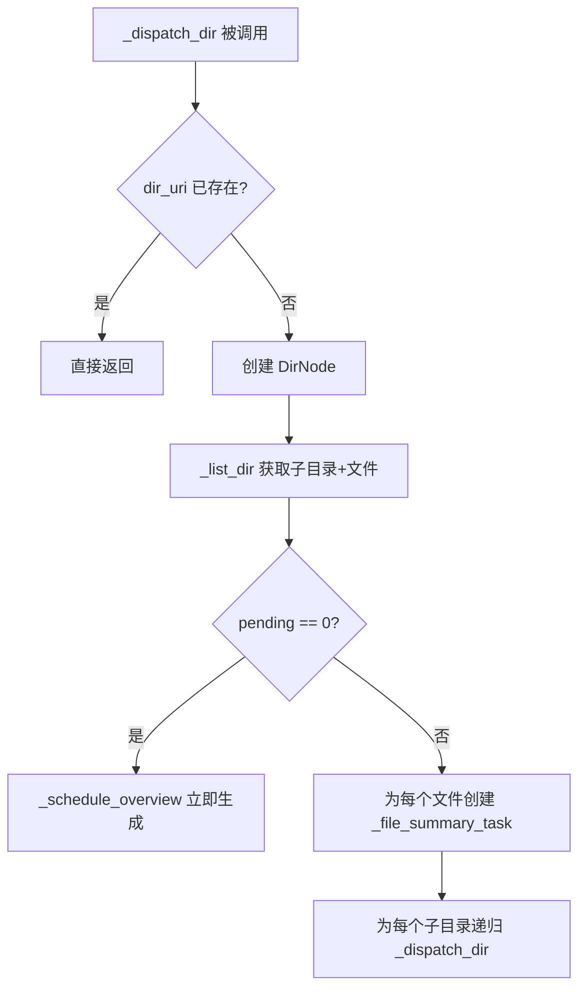
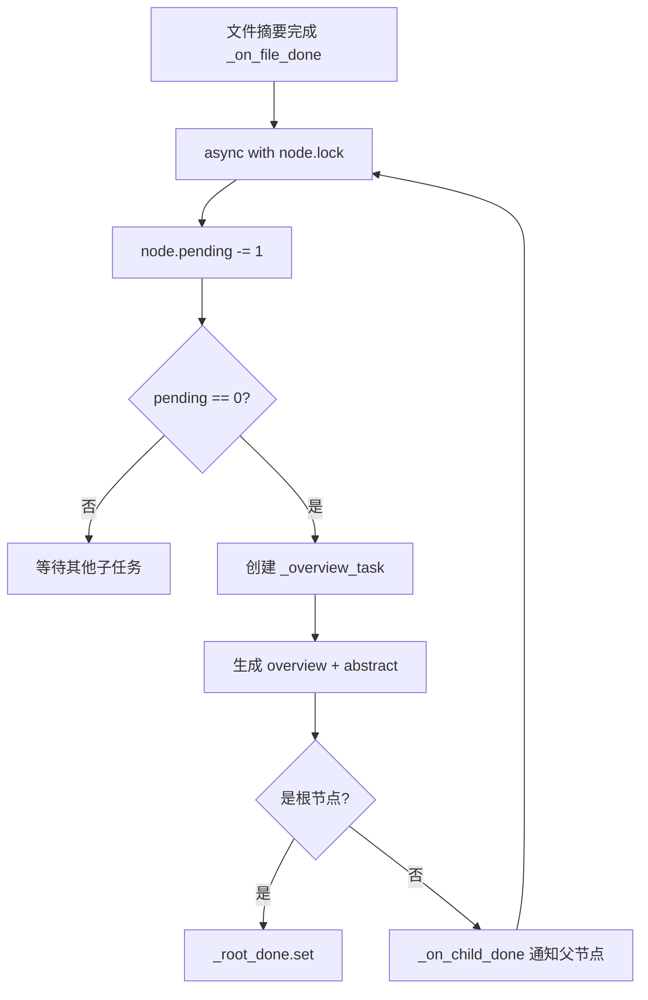

# PD-321.01 OpenViking — 事件驱动惰性调度 DAG 执行器

> 文档编号：PD-321.01
> 来源：OpenViking `openviking/storage/queuefs/semantic_dag.py`
> GitHub：https://github.com/volcengine/OpenViking.git
> 问题域：PD-321 语义 DAG 处理引擎 Semantic DAG Processing Engine
> 状态：可复用方案

---

## 第 1 章 问题与动机

### 1.1 核心问题

当需要对一棵目录树中的所有文件生成语义摘要（summary）并逐层聚合为目录概览（overview/abstract）时，面临三个工程挑战：

1. **依赖拓扑**：父目录的 overview 依赖所有子文件摘要 + 子目录 abstract，形成天然 DAG。
2. **LLM 并发控制**：每个文件摘要和目录 overview 都需要调用 LLM，不加限制会瞬间打满 API 配额。
3. **资源浪费**：传统 BFS/DFS 遍历会一次性展开整棵树，大量节点排队等待，占用内存且无法提前释放。

OpenViking 的 `SemanticDagExecutor` 用事件驱动的惰性调度（lazy dispatch）解决了这三个问题：只有当一个目录的所有子依赖完成时，才触发该目录的 overview 生成任务。

### 1.2 OpenViking 的解法概述

1. **DirNode 状态机**：每个目录节点维护 `pending` 计数器 + `asyncio.Lock`，子任务完成时原子递减，降到 0 时触发 overview（`semantic_dag.py:181-190`）。
2. **asyncio.Semaphore 限流**：全局 `_llm_sem` 信号量控制 LLM 并发上限，默认 100（`semantic_dag.py:56`）。
3. **惰性调度**：`_dispatch_dir` 只在首次访问时创建节点并分发子任务，不预遍历整棵树（`semantic_dag.py:71-118`）。
4. **asyncio.Event 收敛检测**：根节点完成时通过 `_root_done.set()` 通知调用方（`semantic_dag.py:278-279`）。
5. **即时向量化**：文件摘要生成后立即异步提交向量化，不等待 overview 完成（`semantic_dag.py:161-172`）。

### 1.3 设计思想

| 设计原则 | 具体实现 | 理由 | 替代方案 |
|----------|----------|------|----------|
| 惰性调度 | `_dispatch_dir` 按需创建 DirNode，不预遍历 | 避免大目录树一次性展开占满内存 | BFS 预遍历 + 拓扑排序（内存开销大） |
| 事件驱动收敛 | `pending` 计数器 + `asyncio.Lock` 原子递减 | 无需轮询检测子任务完成 | 定时轮询检查所有子任务状态 |
| 信号量限流 | `asyncio.Semaphore(max_concurrent_llm)` | 简单高效，asyncio 原生支持 | 令牌桶 / 滑动窗口限流器 |
| 即时流水线 | 文件摘要完成后立即提交向量化 | 减少端到端延迟，充分利用 IO 等待时间 | 等所有摘要完成后批量向量化 |
| 单 Event 收敛 | `_root_done = asyncio.Event()` | 调用方只需 `await root_done.wait()` | Future/Condition 等更复杂的同步原语 |

---

## 第 2 章 源码实现分析

### 2.1 架构概览

OpenViking 的语义处理系统由四层组成：

```
┌─────────────────────────────────────────────────────────┐
│                    QueueManager (单例)                    │
│  ┌──────────────┐  ┌──────────────────────────────────┐ │
│  │ EmbeddingQueue│  │       SemanticQueue              │ │
│  │  (向量化)     │  │  dequeue_handler=SemanticProcessor│ │
│  └──────┬───────┘  └──────────────┬───────────────────┘ │
│         │                         │                      │
│         │              ┌──────────▼──────────┐           │
│         │              │  SemanticProcessor   │           │
│         │              │  on_dequeue(msg)     │           │
│         │              └──────────┬───────────┘           │
│         │                         │ recursive=True        │
│         │              ┌──────────▼──────────┐           │
│         │              │ SemanticDagExecutor  │           │
│         │              │  run(root_uri)       │           │
│         │              │  ┌────────────────┐  │           │
│         │              │  │ DirNode DAG    │  │           │
│         │              │  │ (惰性构建)      │  │           │
│         │              │  └────────────────┘  │           │
│         │              └──────────┬───────────┘           │
│         │◄────────────────────────┘                       │
│         │  (摘要完成后立即入队向量化)                        │
└─────────┴────────────────────────────────────────────────┘
```

核心数据流：`SemanticMsg` 入队 → `SemanticProcessor.on_dequeue()` → `SemanticDagExecutor.run()` → 自底向上生成摘要/overview → 向量化入队 `EmbeddingQueue`。

### 2.2 核心实现

#### 2.2.1 DirNode 状态机与惰性调度



对应源码 `semantic_dag.py:71-118`：

```python
async def _dispatch_dir(self, dir_uri: str, parent_uri: Optional[str]) -> None:
    """Lazy-dispatch tasks for a directory when it is triggered."""
    if dir_uri in self._nodes:
        return

    self._parent[dir_uri] = parent_uri

    try:
        children_dirs, file_paths = await self._list_dir(dir_uri)
        file_index = {path: idx for idx, path in enumerate(file_paths)}
        child_index = {path: idx for idx, path in enumerate(children_dirs)}
        pending = len(children_dirs) + len(file_paths)

        node = DirNode(
            uri=dir_uri,
            children_dirs=children_dirs,
            file_paths=file_paths,
            file_index=file_index,
            child_index=child_index,
            file_summaries=[None] * len(file_paths),
            children_abstracts=[None] * len(children_dirs),
            pending=pending,
            dispatched=True,
        )
        self._nodes[dir_uri] = node
        # ...
        for file_path in file_paths:
            asyncio.create_task(self._file_summary_task(dir_uri, file_path))
        for child_uri in children_dirs:
            asyncio.create_task(self._dispatch_dir(child_uri, dir_uri))
    except Exception as e:
        logger.error(f"Failed to dispatch directory {dir_uri}: {e}", exc_info=True)
        if parent_uri:
            await self._on_child_done(parent_uri, dir_uri, "")
        elif self._root_done:
            self._root_done.set()
```

关键设计：`if dir_uri in self._nodes: return` 保证每个目录只被调度一次；异常时向上传播空 abstract，避免父节点永远等待。

#### 2.2.2 事件驱动的收敛检测



对应源码 `semantic_dag.py:174-207`：

```python
async def _on_file_done(
    self, parent_uri: str, file_path: str, summary_dict: Dict[str, str]
) -> None:
    node = self._nodes.get(parent_uri)
    if not node:
        return

    async with node.lock:
        idx = node.file_index.get(file_path)
        if idx is not None:
            node.file_summaries[idx] = summary_dict
        node.pending -= 1
        if node.pending == 0 and not node.overview_scheduled:
            node.overview_scheduled = True
            self._stats.pending_nodes = max(0, self._stats.pending_nodes - 1)
            self._stats.in_progress_nodes += 1
            asyncio.create_task(self._overview_task(parent_uri))

async def _on_child_done(self, parent_uri: str, child_uri: str, abstract: str) -> None:
    node = self._nodes.get(parent_uri)
    if not node:
        return

    child_name = child_uri.split("/")[-1]
    async with node.lock:
        idx = node.child_index.get(child_uri)
        if idx is not None:
            node.children_abstracts[idx] = {"name": child_name, "abstract": abstract}
        node.pending -= 1
        if node.pending == 0 and not node.overview_scheduled:
            node.overview_scheduled = True
            asyncio.create_task(self._overview_task(parent_uri))
```

`_on_file_done` 和 `_on_child_done` 共享同一个收敛逻辑：`pending` 降到 0 且 `overview_scheduled` 为 False 时触发 overview 生成。`overview_scheduled` 标志防止重复触发。

### 2.3 实现细节

#### QueueManager 的双模式 Worker

`QueueManager` 为不同队列提供两种 worker 模式（`queue_manager.py:164-246`）：

- **单任务模式**（Semantic 队列）：`max_concurrent=1`，一次只处理一条 `SemanticMsg`，因为每条消息内部由 `SemanticDagExecutor` 自行管理并发。
- **并发模式**（Embedding 队列）：`max_concurrent=10`，用 `asyncio.Semaphore` 限制同时处理的 embedding 任务数。

```
SemanticQueue ──→ Worker(max_concurrent=1) ──→ SemanticProcessor
                                                    │
                                                    ▼
                                            SemanticDagExecutor
                                            (内部 Semaphore=100)
                                                    │
                                                    ▼
EmbeddingQueue ◄── 文件/目录摘要 ──── Worker(max_concurrent=10)
```

#### 多媒体文件类型分发

`SemanticProcessor._generate_single_file_summary`（`semantic_processor.py:393-417`）根据文件扩展名分发到不同的摘要生成器：

- 图片 → `generate_image_summary`（VLM 视觉理解）
- 音频 → `generate_audio_summary`
- 视频 → `generate_video_summary`
- 文本/代码 → `_generate_text_summary`（支持 AST 骨架提取 + LLM 降级）

代码文件还支持三种摘要模式（`semantic_processor.py:346-377`）：
- `ast`：纯 AST 骨架提取，不调用 LLM
- `ast_llm`：AST 骨架 + LLM 精炼
- `llm`：直接 LLM 摘要（默认降级路径）

---

## 第 3 章 迁移指南

### 3.1 迁移清单

**阶段 1：核心 DAG 执行器（必须）**

- [ ] 定义 `DirNode` dataclass：`uri`, `children`, `files`, `pending`, `lock`, `overview_scheduled`
- [ ] 实现 `DagExecutor`：`run()`, `_dispatch_dir()`, `_on_file_done()`, `_on_child_done()`
- [ ] 引入 `asyncio.Semaphore` 控制 LLM 并发
- [ ] 实现 `asyncio.Event` 根节点收敛检测

**阶段 2：队列基础设施（推荐）**

- [ ] 实现 `NamedQueue` 基类：enqueue/dequeue + 状态追踪
- [ ] 实现 `DequeueHandlerBase` 抽象类：`on_dequeue()` + 回调机制
- [ ] 实现 `QueueManager` 单例：worker 线程管理 + 并发模式选择

**阶段 3：摘要生成管线（按需）**

- [ ] 实现文件类型检测与多路分发（代码/文档/媒体）
- [ ] 实现 AST 骨架提取 + LLM 降级路径
- [ ] 实现 overview 生成与 abstract 提取

### 3.2 适配代码模板

以下是可直接复用的最小化 DAG 执行器模板：

```python
import asyncio
from dataclasses import dataclass, field
from typing import Dict, List, Optional, Any


@dataclass
class TreeNode:
    """树节点状态，用于 DAG 执行。"""
    node_id: str
    children_ids: List[str]
    leaf_ids: List[str]
    leaf_results: List[Optional[Any]]
    children_results: List[Optional[Any]]
    pending: int
    aggregated: bool = False
    lock: asyncio.Lock = field(default_factory=asyncio.Lock)


class LazyDagExecutor:
    """事件驱动惰性调度 DAG 执行器。

    用法:
        executor = LazyDagExecutor(
            list_children=my_list_fn,
            process_leaf=my_leaf_fn,
            aggregate=my_agg_fn,
            max_concurrent=50,
        )
        result = await executor.run("root_id")
    """

    def __init__(
        self,
        list_children,   # async (node_id) -> (child_ids, leaf_ids)
        process_leaf,    # async (leaf_id, semaphore) -> result
        aggregate,       # async (node_id, leaf_results, children_results, semaphore) -> result
        max_concurrent: int = 50,
    ):
        self._list_children = list_children
        self._process_leaf = process_leaf
        self._aggregate = aggregate
        self._sem = asyncio.Semaphore(max_concurrent)
        self._nodes: Dict[str, TreeNode] = {}
        self._parent: Dict[str, Optional[str]] = {}
        self._root_done: Optional[asyncio.Event] = None
        self._root_result: Any = None

    async def run(self, root_id: str) -> Any:
        self._root_done = asyncio.Event()
        await self._dispatch(root_id, parent_id=None)
        await self._root_done.wait()
        return self._root_result

    async def _dispatch(self, node_id: str, parent_id: Optional[str]) -> None:
        if node_id in self._nodes:
            return
        self._parent[node_id] = parent_id

        try:
            child_ids, leaf_ids = await self._list_children(node_id)
            pending = len(child_ids) + len(leaf_ids)

            node = TreeNode(
                node_id=node_id,
                children_ids=child_ids,
                leaf_ids=leaf_ids,
                leaf_results=[None] * len(leaf_ids),
                children_results=[None] * len(child_ids),
                pending=pending,
            )
            self._nodes[node_id] = node

            if pending == 0:
                asyncio.create_task(self._aggregate_task(node_id))
                return

            for i, leaf_id in enumerate(leaf_ids):
                asyncio.create_task(self._leaf_task(node_id, leaf_id, i))
            for child_id in child_ids:
                asyncio.create_task(self._dispatch(child_id, node_id))
        except Exception:
            if parent_id:
                await self._on_child_done(parent_id, node_id, None)
            elif self._root_done:
                self._root_done.set()

    async def _leaf_task(self, parent_id: str, leaf_id: str, idx: int) -> None:
        try:
            result = await self._process_leaf(leaf_id, self._sem)
        except Exception:
            result = None
        await self._on_leaf_done(parent_id, idx, result)

    async def _on_leaf_done(self, parent_id: str, idx: int, result: Any) -> None:
        node = self._nodes.get(parent_id)
        if not node:
            return
        async with node.lock:
            node.leaf_results[idx] = result
            node.pending -= 1
            if node.pending == 0 and not node.aggregated:
                node.aggregated = True
                asyncio.create_task(self._aggregate_task(parent_id))

    async def _on_child_done(self, parent_id: str, child_id: str, result: Any) -> None:
        node = self._nodes.get(parent_id)
        if not node:
            return
        async with node.lock:
            idx = node.children_ids.index(child_id)
            node.children_results[idx] = result
            node.pending -= 1
            if node.pending == 0 and not node.aggregated:
                node.aggregated = True
                asyncio.create_task(self._aggregate_task(parent_id))

    async def _aggregate_task(self, node_id: str) -> None:
        node = self._nodes[node_id]
        try:
            result = await self._aggregate(
                node_id, node.leaf_results, node.children_results, self._sem
            )
        except Exception:
            result = None

        parent_id = self._parent.get(node_id)
        if parent_id is None:
            self._root_result = result
            if self._root_done:
                self._root_done.set()
        else:
            await self._on_child_done(parent_id, node_id, result)
```

### 3.3 适用场景

| 场景 | 适用度 | 说明 |
|------|--------|------|
| 目录树语义摘要聚合 | ⭐⭐⭐ | 原始场景，完美匹配 |
| 代码仓库文档自动生成 | ⭐⭐⭐ | 文件→模块→包→项目的层级聚合 |
| 知识图谱自底向上构建 | ⭐⭐⭐ | 实体→关系→子图→全图 |
| 多级报告生成 | ⭐⭐ | 数据→图表→章节→报告 |
| 扁平任务并行（无依赖） | ⭐ | 过度设计，直接用 asyncio.gather 即可 |

---

## 第 4 章 测试用例

```python
import asyncio
import pytest
from unittest.mock import AsyncMock, MagicMock, patch
from dataclasses import dataclass


# ---- 最小化 DirNode / SemanticDagExecutor 测试 ----

class TestSemanticDagExecutor:
    """基于 OpenViking SemanticDagExecutor 真实签名的测试。"""

    @pytest.fixture
    def mock_processor(self):
        proc = MagicMock()
        proc._generate_single_file_summary = AsyncMock(
            return_value={"name": "test.py", "summary": "A test file"}
        )
        proc._generate_overview = AsyncMock(return_value="# Overview\nTest overview")
        proc._extract_abstract_from_overview = MagicMock(return_value="Test overview")
        proc._vectorize_single_file = AsyncMock()
        proc._vectorize_directory_simple = AsyncMock()
        return proc

    @pytest.fixture
    def mock_viking_fs(self):
        fs = AsyncMock()
        fs.write_file = AsyncMock()
        return fs

    @pytest.mark.asyncio
    async def test_empty_directory_triggers_overview(self, mock_processor, mock_viking_fs):
        """空目录应立即触发 overview 生成。"""
        with patch("openviking.storage.queuefs.semantic_dag.get_viking_fs", return_value=mock_viking_fs):
            mock_viking_fs.ls = AsyncMock(return_value=[])
            from openviking.storage.queuefs.semantic_dag import SemanticDagExecutor
            ctx = MagicMock()
            executor = SemanticDagExecutor(mock_processor, "resource", 10, ctx)
            await executor.run("viking://test/empty")
            mock_processor._generate_overview.assert_called_once()

    @pytest.mark.asyncio
    async def test_pending_decrements_on_file_done(self, mock_processor, mock_viking_fs):
        """文件完成后 pending 应递减。"""
        with patch("openviking.storage.queuefs.semantic_dag.get_viking_fs", return_value=mock_viking_fs):
            mock_viking_fs.ls = AsyncMock(return_value=[
                {"name": "a.py", "isDir": False},
                {"name": "b.py", "isDir": False},
            ])
            from openviking.storage.queuefs.semantic_dag import SemanticDagExecutor
            ctx = MagicMock()
            executor = SemanticDagExecutor(mock_processor, "resource", 10, ctx)
            await executor.run("viking://test/two-files")
            stats = executor.get_stats()
            assert stats.done_nodes >= 2  # 至少 2 个文件节点完成

    @pytest.mark.asyncio
    async def test_semaphore_limits_concurrency(self, mock_processor, mock_viking_fs):
        """信号量应限制 LLM 并发数。"""
        max_concurrent = 2
        active = {"count": 0, "peak": 0}

        async def slow_summary(file_path, llm_sem=None, ctx=None):
            async with llm_sem:
                active["count"] += 1
                active["peak"] = max(active["peak"], active["count"])
                await asyncio.sleep(0.01)
                active["count"] -= 1
            return {"name": file_path.split("/")[-1], "summary": "s"}

        mock_processor._generate_single_file_summary = slow_summary

        with patch("openviking.storage.queuefs.semantic_dag.get_viking_fs", return_value=mock_viking_fs):
            mock_viking_fs.ls = AsyncMock(return_value=[
                {"name": f"f{i}.py", "isDir": False} for i in range(10)
            ])
            from openviking.storage.queuefs.semantic_dag import SemanticDagExecutor
            ctx = MagicMock()
            executor = SemanticDagExecutor(mock_processor, "resource", max_concurrent, ctx)
            await executor.run("viking://test/many-files")
            assert active["peak"] <= max_concurrent

    @pytest.mark.asyncio
    async def test_error_propagates_empty_abstract(self, mock_processor, mock_viking_fs):
        """子目录失败时应向父节点传播空 abstract，不阻塞。"""
        call_count = {"dispatch": 0}

        with patch("openviking.storage.queuefs.semantic_dag.get_viking_fs", return_value=mock_viking_fs):
            async def ls_side_effect(uri, ctx=None):
                if "broken" in uri:
                    raise RuntimeError("disk error")
                return [{"name": "broken", "isDir": True}]

            mock_viking_fs.ls = AsyncMock(side_effect=ls_side_effect)
            from openviking.storage.queuefs.semantic_dag import SemanticDagExecutor
            ctx = MagicMock()
            executor = SemanticDagExecutor(mock_processor, "resource", 10, ctx)
            await executor.run("viking://test/parent")
            # 应正常完成，不会永远挂起
            mock_processor._generate_overview.assert_called()
```

---

## 第 5 章 跨域关联

| 关联域 | 关系类型 | 说明 |
|--------|----------|------|
| PD-01 上下文管理 | 协同 | 文件摘要生成时截断内容到 30000 字符（`semantic_processor.py:334-336`），是上下文窗口管理的具体实践 |
| PD-02 多 Agent 编排 | 协同 | `QueueManager` 的双队列 worker 模式（Semantic + Embedding）本质是多 Agent 编排，DAG 执行器是其中的子编排器 |
| PD-03 容错与重试 | 依赖 | `_dispatch_dir` 异常时向父节点传播空 abstract（`semantic_dag.py:113-118`），是容错降级的实现；但缺少重试机制 |
| PD-04 工具系统 | 协同 | `SemanticProcessor` 作为 `DequeueHandlerBase` 注册到队列系统，是工具注册模式的变体 |
| PD-08 搜索与检索 | 下游 | DAG 生成的 abstract/overview 最终通过 `EmbeddingQueue` 向量化，为 RAG 检索提供语义索引 |
| PD-11 可观测性 | 协同 | `DagStats` 提供实时统计（total/pending/in_progress/done），`QueueStatus` 追踪队列处理状态 |

---

## 第 6 章 来源文件索引

| 文件 | 行范围 | 关键实现 |
|------|--------|----------|
| `openviking/storage/queuefs/semantic_dag.py` | L1-295 | `DirNode` 状态机、`SemanticDagExecutor` 惰性调度 DAG 执行器 |
| `openviking/storage/queuefs/semantic_processor.py` | L1-667 | `SemanticProcessor` 摘要生成、overview 聚合、向量化入队 |
| `openviking/storage/queuefs/queue_manager.py` | L1-379 | `QueueManager` 单例、双模式 worker、并发控制 |
| `openviking/storage/queuefs/named_queue.py` | L1-302 | `NamedQueue` 基类、`DequeueHandlerBase` 抽象、`QueueStatus` 状态追踪 |
| `openviking/storage/queuefs/semantic_msg.py` | L1-108 | `SemanticMsg` 消息格式、多租户字段 |
| `openviking/storage/queuefs/semantic_dag.py` | L56 | `asyncio.Semaphore(max_concurrent_llm)` LLM 并发限流 |
| `openviking/storage/queuefs/semantic_dag.py` | L174-207 | `_on_file_done` / `_on_child_done` 事件驱动收敛 |
| `openviking/storage/queuefs/semantic_dag.py` | L240-282 | `_overview_task` 聚合生成 + 根节点收敛信号 |
| `openviking/storage/queuefs/semantic_processor.py` | L346-377 | 代码文件 AST/LLM 双模式摘要 |
| `openviking/storage/queuefs/queue_manager.py` | L198-246 | `_worker_async_concurrent` 信号量并发 worker |

---

## 第 7 章 横向对比维度

```json comparison_data
{
  "project": "OpenViking",
  "dimensions": {
    "调度模式": "事件驱动惰性调度，pending 计数器归零触发聚合",
    "并发模型": "asyncio.Semaphore 全局限流 + asyncio.Lock 节点级互斥",
    "DAG 构建": "运行时惰性构建，_dispatch_dir 按需创建 DirNode",
    "收敛检测": "asyncio.Event 单信号收敛，根节点完成即 set",
    "聚合方向": "自底向上：文件摘要 → 目录 overview → 父目录 abstract",
    "队列架构": "QueueManager 单例 + NamedQueue 双队列（Semantic + Embedding）",
    "多媒体支持": "四路分发：代码(AST/LLM)、文档、图片(VLM)、音视频"
  }
}
```

### 域元数据补充

```json domain_metadata
{
  "solution_summary": "OpenViking 用 SemanticDagExecutor 实现事件驱动惰性调度，DirNode pending 计数器 + asyncio.Lock 原子递减触发自底向上聚合，asyncio.Event 单信号收敛检测",
  "description": "面向目录树的语义聚合调度，核心是依赖拓扑的事件驱动执行",
  "sub_problems": [
    "多媒体文件类型分发与摘要策略选择",
    "双队列协作（语义队列单任务 + 嵌入队列并发）",
    "异常传播与空结果降级避免父节点死锁"
  ],
  "best_practices": [
    "overview_scheduled 标志防止重复触发聚合任务",
    "文件摘要完成后立即异步提交向量化，不等待 overview",
    "异常时向父节点传播空 abstract，保证 DAG 不死锁"
  ]
}
```
