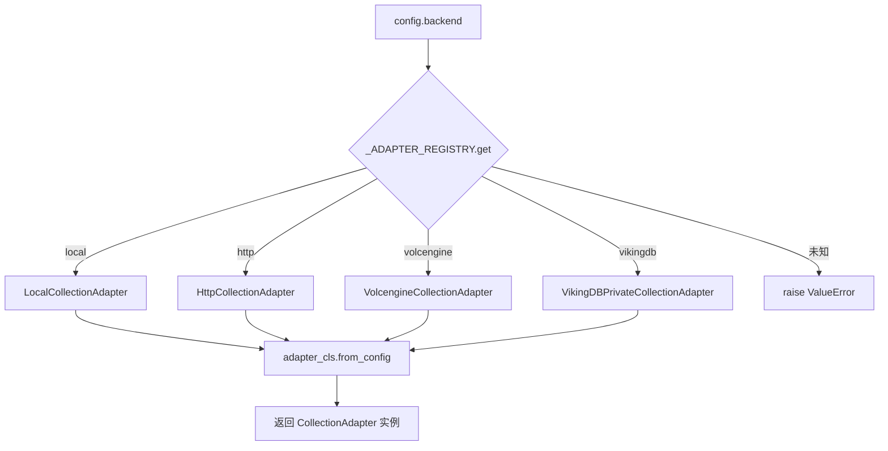
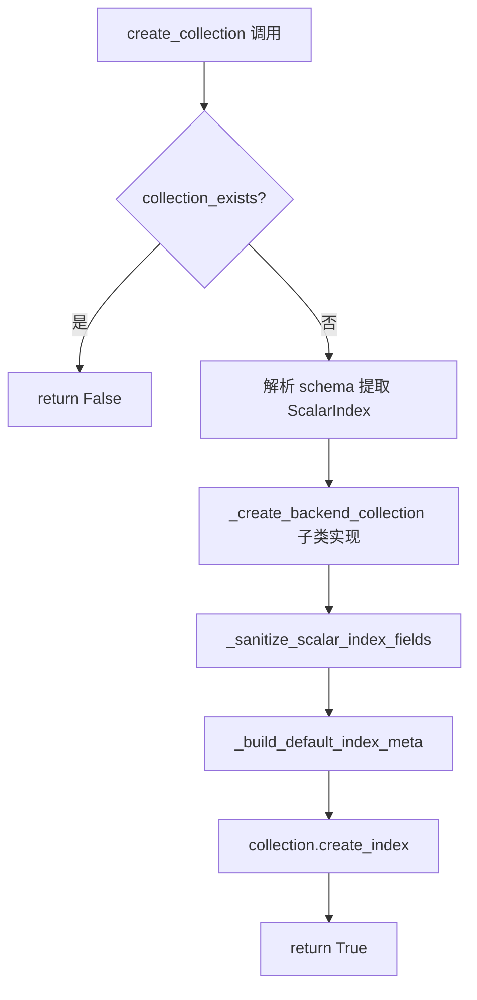
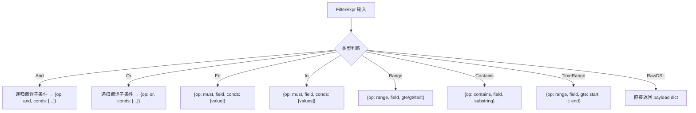

# PD-322.01 OpenViking — CollectionAdapter 四后端向量数据库抽象层

> 文档编号：PD-322.01
> 来源：OpenViking `openviking/storage/vectordb_adapters/`
> GitHub：https://github.com/volcengine/OpenViking.git
> 问题域：PD-322 向量数据库抽象层 Vector Database Abstraction
> 状态：可复用方案

---

## 第 1 章 问题与动机

### 1.1 核心问题

向量数据库是 RAG / Agent 系统的基础设施，但不同部署环境对存储后端的需求差异巨大：

- **本地开发**需要零依赖的嵌入式存储（无需启动外部服务）
- **团队协作**需要 HTTP 远程服务（共享数据）
- **生产环境**需要云托管服务（Volcengine VikingDB）或私有化部署（VikingDB Private）
- 不同后端的索引类型不同（local 用 flat，云端用 HNSW），但上层业务代码不应感知

如果每个后端写一套 CRUD + 搜索逻辑，代码膨胀且难以维护。需要一个统一抽象层，让业务代码面向接口编程，后端切换只改配置。

### 1.2 OpenViking 的解法概述

1. **CollectionAdapter 抽象基类**（`base.py:53`）定义统一的 CRUD + 搜索 + 过滤接口，422 行覆盖全部操作
2. **4 种具体适配器**通过 `_ADAPTER_REGISTRY` 字典注册（`factory.py:13-18`），工厂函数 `create_collection_adapter()` 按 `config.backend` 字符串路由
3. **三层架构分离**：Adapter（业务接口）→ Collection（存储抽象）→ Backend（具体实现），每层只关心自己的职责
4. **FilterExpr AST**（`expr.py:1-62`）用 frozen dataclass 构建类型安全的过滤表达式树，由 `_compile_filter()` 编译为后端 DSL
5. **EmbedderBase 三分支继承体系**（`embedder/base.py:58-257`）统一 dense/sparse/hybrid 三种向量模式，CompositeHybridEmbedder 组合任意 dense+sparse 实现

### 1.3 设计思想

| 设计原则 | 具体实现 | 理由 | 替代方案 |
|----------|----------|------|----------|
| 工厂模式 + 注册表 | `_ADAPTER_REGISTRY` dict + `create_collection_adapter()` | 新增后端只需加一行注册，零修改工厂函数 | if-elif 链（每次新增都改工厂） |
| 模板方法模式 | 基类实现 `create_collection` 流程，子类只覆写 `_create_backend_collection` | 创建流程（schema 解析→collection 创建→index 构建）统一，子类只关心后端差异 | 每个子类完整实现创建流程（重复代码） |
| 不可变 AST 过滤 | `@dataclass(frozen=True)` 的 FilterExpr 联合类型 | 过滤表达式可安全传递、缓存、序列化，不会被意外修改 | 直接传 dict（无类型安全） |
| 组合优于继承 | `CompositeHybridEmbedder` 组合 dense+sparse embedder | 任意 dense 实现 × 任意 sparse 实现自由组合 | 为每种组合写一个子类（组合爆炸） |
| 惰性加载 | `_load_existing_collection_if_needed()` 延迟到首次访问 | 避免构造时就连接远程服务，降低启动开销 | 构造函数中立即连接（启动慢、可能失败） |

---

## 第 2 章 源码实现分析

### 2.1 架构概览

```
┌─────────────────────────────────────────────────────────────┐
│                    业务层 (Business Logic)                    │
│         upsert / query / delete / count / clear              │
└──────────────────────────┬──────────────────────────────────┘
                           │ create_collection_adapter(config)
┌──────────────────────────▼──────────────────────────────────┐
│              CollectionAdapter (base.py:53)                   │
│  ┌──────────┐ ┌──────────┐ ┌──────────────┐ ┌────────────┐ │
│  │  Local    │ │   HTTP   │ │  Volcengine  │ │  VikingDB  │ │
│  │ (flat)   │ │  (flat)  │ │   (hnsw)     │ │  (hnsw)    │ │
│  └────┬─────┘ └────┬─────┘ └──────┬───────┘ └─────┬──────┘ │
└───────┼─────────────┼──────────────┼───────────────┼────────┘
        │             │              │               │
┌───────▼─────────────▼──────────────▼───────────────▼────────┐
│              ICollection (collection.py:10)                   │
│   search_by_vector / search_by_scalar / upsert_data / ...    │
└──────────────────────────┬──────────────────────────────────┘
                           │
┌──────────────────────────▼──────────────────────────────────┐
│         Backend Implementations (local/http/volcengine/...)   │
│         LocalCollection / HttpCollection / VolcengineCollection│
└─────────────────────────────────────────────────────────────┘
```

### 2.2 核心实现

#### 2.2.1 工厂注册与路由



对应源码 `openviking/storage/vectordb_adapters/factory.py:13-29`：

```python
_ADAPTER_REGISTRY: dict[str, type[CollectionAdapter]] = {
    "local": LocalCollectionAdapter,
    "http": HttpCollectionAdapter,
    "volcengine": VolcengineCollectionAdapter,
    "vikingdb": VikingDBPrivateCollectionAdapter,
}

def create_collection_adapter(config) -> CollectionAdapter:
    """Unified factory entrypoint for backend-specific collection adapters."""
    adapter_cls = _ADAPTER_REGISTRY.get(config.backend)
    if adapter_cls is None:
        raise ValueError(
            f"Vector backend {config.backend} is not supported. "
            f"Available backends: {sorted(_ADAPTER_REGISTRY)}"
        )
    return adapter_cls.from_config(config)
```

#### 2.2.2 Collection 创建的模板方法



对应源码 `openviking/storage/vectordb_adapters/base.py:93-125`：

```python
def create_collection(
    self,
    name: str,
    schema: Dict[str, Any],
    *,
    distance: str,
    sparse_weight: float,
    index_name: str,
) -> bool:
    if self.collection_exists():
        return False

    self._collection_name = name
    collection_meta = dict(schema)
    scalar_index_fields = collection_meta.pop("ScalarIndex", [])
    if "CollectionName" not in collection_meta:
        collection_meta["CollectionName"] = name

    self._collection = self._create_backend_collection(collection_meta)

    scalar_index_fields = self._sanitize_scalar_index_fields(
        scalar_index_fields=scalar_index_fields,
        fields_meta=collection_meta.get("Fields", []),
    )
    index_meta = self._build_default_index_meta(
        index_name=index_name,
        distance=distance,
        use_sparse=sparse_weight > 0.0,
        sparse_weight=sparse_weight,
        scalar_index_fields=scalar_index_fields,
    )
    self._collection.create_index(index_name, index_meta)
    return True
```

#### 2.2.3 FilterExpr AST 编译



对应源码 `openviking/storage/vectordb_adapters/base.py:197-248`：

```python
def _compile_filter(self, expr: FilterExpr | Dict[str, Any] | None) -> Dict[str, Any]:
    if expr is None:
        return {}
    if isinstance(expr, dict):
        return expr
    if isinstance(expr, RawDSL):
        return expr.payload
    if isinstance(expr, And):
        conds = [self._compile_filter(c) for c in expr.conds if c is not None]
        conds = [c for c in conds if c]
        if not conds:
            return {}
        if len(conds) == 1:
            return conds[0]
        return {"op": "and", "conds": conds}
    # ... Or, Eq, In, Range, Contains, TimeRange 同理
    raise TypeError(f"Unsupported filter expr type: {type(expr)!r}")
```

### 2.3 实现细节

**四种后端的关键差异点：**

| 差异维度 | Local (`local_adapter.py`) | HTTP (`http_adapter.py`) | Volcengine (`volcengine_adapter.py`) | VikingDB Private (`vikingdb_private_adapter.py`) |
|----------|---------------------------|--------------------------|--------------------------------------|------------------------------------------------|
| 索引类型 | `flat` / `flat_hybrid` (L179) | `flat` / `flat_hybrid` (L179) | `hnsw` / `hnsw_hybrid` (L110) | `hnsw` / `hnsw_hybrid` (L99) |
| 存在性检查 | 检查 `collection_meta.json` 文件 (L45-46) | 调用 `list_vikingdb_collections` API | 创建临时 handle 查 metadata (L78-81) | 调用 `GetVikingdbCollection` API (L48) |
| 创建方式 | `os.makedirs` + 本地文件 (L52) | HTTP API 调用 | 云 API 调用 (L86-89) | **禁止创建**，必须预建 (L77) |
| URI 规范化 | 无 | 无 | `viking://` 前缀 (L126-131) | `viking://` 前缀 (L115-120) |
| 标量索引过滤 | 默认不过滤 | 默认不过滤 | 过滤 `date_time` 字段 (L96-99) | 过滤 `date_time` 字段 (L85-88) |

**EmbedderBase 继承体系**（`embedder/base.py`）：

```
EmbedderBase (L58)
├── DenseEmbedderBase (L117)    → 只返回 dense_vector
├── SparseEmbedderBase (L147)   → 只返回 sparse_vector
└── HybridEmbedderBase (L175)   → 返回 dense + sparse
    └── CompositeHybridEmbedder (L217) → 组合任意 dense + sparse
```

`CompositeHybridEmbedder`（`embedder/base.py:217-257`）的核心在于将两个独立 embedder 的结果合并：

```python
class CompositeHybridEmbedder(HybridEmbedderBase):
    def __init__(self, dense_embedder: DenseEmbedderBase, sparse_embedder: SparseEmbedderBase):
        super().__init__(model_name=f"{dense_embedder.model_name}+{sparse_embedder.model_name}")
        self.dense_embedder = dense_embedder
        self.sparse_embedder = sparse_embedder

    def embed(self, text: str) -> EmbedResult:
        dense_res = self.dense_embedder.embed(text)
        sparse_res = self.sparse_embedder.embed(text)
        return EmbedResult(
            dense_vector=dense_res.dense_vector,
            sparse_vector=sparse_res.sparse_vector
        )
```


---

## 第 3 章 迁移指南

### 3.1 迁移清单

**阶段 1：核心抽象层（必须）**

- [ ] 定义 `FilterExpr` 联合类型（frozen dataclass，8 种表达式节点）
- [ ] 实现 `CollectionAdapter` 抽象基类，包含 `_compile_filter()` 编译器
- [ ] 实现 `create_collection()` 模板方法（schema 解析 → 后端创建 → 索引构建）
- [ ] 实现 `query()` 三路由分发（vector / scalar / random）

**阶段 2：后端适配器（按需）**

- [ ] 实现 `LocalCollectionAdapter`（嵌入式，开发用）
- [ ] 实现至少一个远程适配器（HTTP / 云服务）
- [ ] 编写 `_ADAPTER_REGISTRY` 注册表 + `create_collection_adapter()` 工厂

**阶段 3：Embedder 体系（可选）**

- [ ] 实现 `EmbedderBase` → `DenseEmbedderBase` / `SparseEmbedderBase` / `HybridEmbedderBase`
- [ ] 实现 `CompositeHybridEmbedder` 组合器
- [ ] 实现 `truncate_and_normalize()` 维度截断 + L2 归一化

### 3.2 适配代码模板

以下模板可直接复用，实现一个最小可用的向量数据库抽象层：

```python
"""Minimal vector DB abstraction layer — adapted from OpenViking."""
from __future__ import annotations
from abc import ABC, abstractmethod
from dataclasses import dataclass
from typing import Any, Dict, List, Optional, Union
import uuid

# ── FilterExpr AST ──────────────────────────────────────────
@dataclass(frozen=True)
class Eq:
    field: str
    value: Any

@dataclass(frozen=True)
class In:
    field: str
    values: List[Any]

@dataclass(frozen=True)
class And:
    conds: List["FilterExpr"]

FilterExpr = Union[Eq, In, And]

# ── Adapter 抽象基类 ────────────────────────────────────────
class VectorStoreAdapter(ABC):
    def __init__(self, collection_name: str):
        self._collection_name = collection_name

    @classmethod
    @abstractmethod
    def from_config(cls, config: Dict[str, Any]) -> "VectorStoreAdapter":
        """从配置创建适配器实例"""

    @abstractmethod
    def _ensure_collection(self) -> None:
        """确保 collection 已加载或创建"""

    def upsert(self, records: List[Dict[str, Any]]) -> List[str]:
        self._ensure_collection()
        ids = []
        for record in records:
            record_id = record.get("id") or str(uuid.uuid4())
            record["id"] = record_id
            ids.append(record_id)
        self._do_upsert(records)
        return ids

    @abstractmethod
    def _do_upsert(self, records: List[Dict[str, Any]]) -> None: ...

    @abstractmethod
    def query(
        self,
        *,
        vector: Optional[List[float]] = None,
        filter: Optional[FilterExpr] = None,
        limit: int = 10,
    ) -> List[Dict[str, Any]]: ...

    def _compile_filter(self, expr: Optional[FilterExpr]) -> Dict[str, Any]:
        if expr is None:
            return {}
        if isinstance(expr, Eq):
            return {"field": expr.field, "op": "eq", "value": expr.value}
        if isinstance(expr, In):
            return {"field": expr.field, "op": "in", "values": list(expr.values)}
        if isinstance(expr, And):
            return {"op": "and", "conds": [self._compile_filter(c) for c in expr.conds]}
        raise TypeError(f"Unsupported: {type(expr)}")

# ── 注册表 + 工厂 ──────────────────────────────────────────
_REGISTRY: Dict[str, type[VectorStoreAdapter]] = {}

def register_adapter(name: str, cls: type[VectorStoreAdapter]):
    _REGISTRY[name] = cls

def create_adapter(backend: str, config: Dict[str, Any]) -> VectorStoreAdapter:
    adapter_cls = _REGISTRY.get(backend)
    if not adapter_cls:
        raise ValueError(f"Unknown backend: {backend}. Available: {sorted(_REGISTRY)}")
    return adapter_cls.from_config(config)
```

### 3.3 适用场景

| 场景 | 适用度 | 说明 |
|------|--------|------|
| RAG 系统需要支持多种向量数据库 | ⭐⭐⭐ | 核心场景，直接复用 Adapter + Factory 模式 |
| 本地开发 → 云端部署的渐进式迁移 | ⭐⭐⭐ | Local → HTTP → Volcengine 只改配置 |
| 需要 dense+sparse 混合检索 | ⭐⭐⭐ | CompositeHybridEmbedder 组合模式直接可用 |
| 单一后端、无切换需求 | ⭐ | 过度设计，直接用后端 SDK 即可 |
| 需要跨后端事务一致性 | ⭐ | 该方案不提供分布式事务，需额外设计 |

---

## 第 4 章 测试用例

```python
"""Tests for vector DB abstraction layer — based on OpenViking patterns."""
import pytest
from dataclasses import dataclass
from typing import Any, Dict, List, Optional
from unittest.mock import MagicMock, patch


# ── FilterExpr 编译测试 ─────────────────────────────────────
class TestFilterCompilation:
    """测试 _compile_filter 将 AST 编译为后端 DSL"""

    def setup_method(self):
        # 使用 mock adapter 测试基类的 _compile_filter
        self.adapter = MagicMock()
        from openviking.storage.vectordb_adapters.base import CollectionAdapter
        self.compile = CollectionAdapter._compile_filter

    def test_none_returns_empty(self):
        result = self.compile(self.adapter, None)
        assert result == {}

    def test_eq_compiles_to_must(self):
        from openviking.storage.expr import Eq
        result = self.compile(self.adapter, Eq(field="status", value="active"))
        assert result == {"op": "must", "field": "status", "conds": ["active"]}

    def test_and_flattens_single_condition(self):
        from openviking.storage.expr import And, Eq
        result = self.compile(self.adapter, And(conds=[Eq(field="x", value=1)]))
        # 单条件 And 应被展平
        assert result == {"op": "must", "field": "x", "conds": [1]}

    def test_range_with_bounds(self):
        from openviking.storage.expr import Range
        result = self.compile(self.adapter, Range(field="score", gte=0.5, lte=1.0))
        assert result["op"] == "range"
        assert result["gte"] == 0.5
        assert result["lte"] == 1.0

    def test_raw_dsl_passthrough(self):
        from openviking.storage.expr import RawDSL
        payload = {"custom": "query"}
        result = self.compile(self.adapter, RawDSL(payload=payload))
        assert result is payload


# ── 工厂注册测试 ────────────────────────────────────────────
class TestAdapterFactory:
    """测试工厂模式的注册与路由"""

    def test_unknown_backend_raises(self):
        from openviking.storage.vectordb_adapters.factory import create_collection_adapter
        config = MagicMock()
        config.backend = "nonexistent"
        with pytest.raises(ValueError, match="not supported"):
            create_collection_adapter(config)

    def test_registry_contains_four_backends(self):
        from openviking.storage.vectordb_adapters.factory import _ADAPTER_REGISTRY
        assert set(_ADAPTER_REGISTRY.keys()) == {"local", "http", "volcengine", "vikingdb"}


# ── EmbedResult 测试 ────────────────────────────────────────
class TestEmbedResult:
    """测试 EmbedResult 的 dense/sparse/hybrid 判断"""

    def test_dense_only(self):
        from openviking.models.embedder.base import EmbedResult
        r = EmbedResult(dense_vector=[0.1, 0.2])
        assert r.is_dense and not r.is_sparse and not r.is_hybrid

    def test_sparse_only(self):
        from openviking.models.embedder.base import EmbedResult
        r = EmbedResult(sparse_vector={"token": 0.5})
        assert not r.is_dense and r.is_sparse and not r.is_hybrid

    def test_hybrid(self):
        from openviking.models.embedder.base import EmbedResult
        r = EmbedResult(dense_vector=[0.1], sparse_vector={"token": 0.5})
        assert r.is_dense and r.is_sparse and r.is_hybrid


# ── truncate_and_normalize 测试 ─────────────────────────────
class TestTruncateAndNormalize:
    """测试向量截断与 L2 归一化"""

    def test_no_truncation_when_within_dimension(self):
        from openviking.models.embedder.base import truncate_and_normalize
        vec = [1.0, 2.0, 3.0]
        result = truncate_and_normalize(vec, 5)
        assert result == vec

    def test_truncation_and_normalization(self):
        from openviking.models.embedder.base import truncate_and_normalize
        import math
        vec = [3.0, 4.0, 99.0]  # 第三个元素会被截断
        result = truncate_and_normalize(vec, 2)
        assert len(result) == 2
        norm = math.sqrt(sum(x**2 for x in result))
        assert abs(norm - 1.0) < 1e-6  # L2 归一化后模长为 1

    def test_none_dimension_skips(self):
        from openviking.models.embedder.base import truncate_and_normalize
        vec = [1.0, 2.0]
        assert truncate_and_normalize(vec, None) == vec
```


---

## 第 5 章 跨域关联

| 关联域 | 关系类型 | 说明 |
|--------|----------|------|
| PD-08 搜索与检索 | 协同 | CollectionAdapter 的 `query()` 方法是搜索系统的底层引擎，`search_by_vector` 支持 dense+sparse 混合检索 |
| PD-03 容错与重试 | 依赖 | 远程后端（HTTP/Volcengine/VikingDB）的网络调用需要重试机制，当前 OpenViking 未在 adapter 层内建重试 |
| PD-04 工具系统 | 协同 | 向量数据库适配器可作为 Agent 工具注册，通过 `create_collection_adapter()` 工厂按配置动态创建 |
| PD-06 记忆持久化 | 协同 | 向量存储是长期记忆的物理载体，EmbedResult 的 dense/sparse 模式决定记忆的检索方式 |
| PD-11 可观测性 | 依赖 | 当前 adapter 层仅有 `logger.warning` 级别日志，缺少查询延迟、命中率等指标追踪 |

---

## 第 6 章 来源文件索引

| 文件 | 行范围 | 关键实现 |
|------|--------|----------|
| `openviking/storage/vectordb_adapters/factory.py` | L1-29 | 适配器注册表 + 工厂函数 |
| `openviking/storage/vectordb_adapters/base.py` | L53-422 | CollectionAdapter 抽象基类（CRUD + 搜索 + 过滤编译） |
| `openviking/storage/vectordb_adapters/local_adapter.py` | L17-53 | 本地嵌入式后端适配器 |
| `openviking/storage/vectordb_adapters/volcengine_adapter.py` | L18-133 | Volcengine 云端适配器（HNSW 索引 + URI 规范化） |
| `openviking/storage/vectordb_adapters/vikingdb_private_adapter.py` | L16-122 | VikingDB 私有化部署适配器（禁止创建，只加载预建 collection） |
| `openviking/storage/expr.py` | L1-62 | FilterExpr AST（8 种 frozen dataclass 节点） |
| `openviking/models/embedder/base.py` | L58-257 | EmbedderBase 三分支继承体系 + CompositeHybridEmbedder |
| `openviking/storage/vectordb/collection/collection.py` | L10-177 | ICollection 抽象接口（search_by_vector 等 6 种搜索方法） |

---

## 第 7 章 横向对比维度

```json comparison_data
{
  "project": "OpenViking",
  "dimensions": {
    "适配器架构": "CollectionAdapter 抽象基类 + 4 后端注册表工厂",
    "索引策略": "Local/HTTP 用 flat，Volcengine/VikingDB 用 HNSW，sparse 自动切换 hybrid",
    "过滤系统": "8 节点 frozen dataclass AST，_compile_filter 递归编译为后端 DSL",
    "向量模式": "EmbedderBase 三分支继承 + CompositeHybridEmbedder 组合 dense×sparse",
    "生命周期管理": "惰性加载 _load_existing_collection_if_needed + drop 先清索引再删 collection",
    "后端差异处理": "模板方法 + 子类覆写 hook（_sanitize_scalar_index_fields / _build_default_index_meta / _normalize_record_for_read）"
  }
}
```

### 域元数据补充

```json domain_metadata
{
  "solution_summary": "OpenViking 通过 CollectionAdapter 抽象基类 + 4 后端注册表工厂，统一 local/HTTP/Volcengine/VikingDB 四种向量存储，FilterExpr frozen AST 编译过滤，CompositeHybridEmbedder 组合 dense+sparse",
  "description": "向量数据库后端的索引类型差异（flat vs HNSW）如何在抽象层透明处理",
  "sub_problems": [
    "不同后端索引类型差异的透明适配（flat vs HNSW）",
    "过滤表达式的类型安全 AST 与后端 DSL 编译",
    "预建 collection 的只读适配（禁止创建模式）"
  ],
  "best_practices": [
    "模板方法模式统一 collection 创建流程，子类只覆写后端差异 hook",
    "frozen dataclass 构建不可变 FilterExpr AST 保证线程安全",
    "CompositeHybridEmbedder 组合模式避免 dense×sparse 子类爆炸"
  ]
}
```

