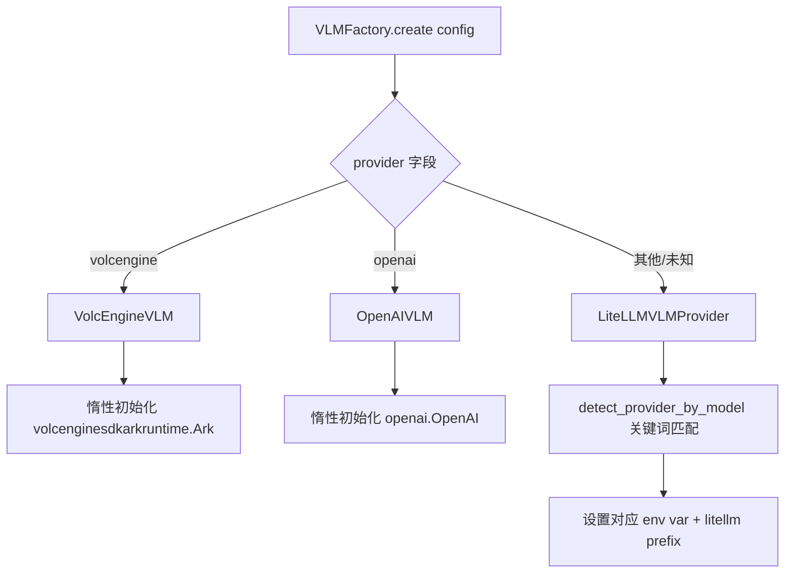
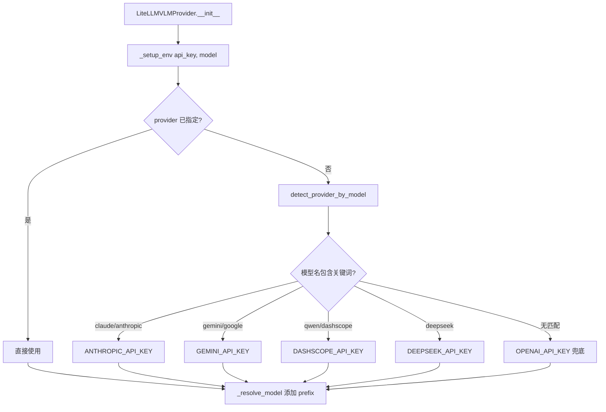
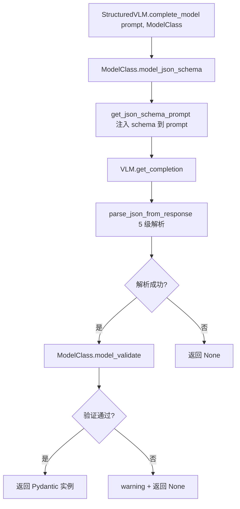

# PD-323.01 OpenViking — VLMFactory 多 Provider 抽象与结构化输出

> 文档编号：PD-323.01
> 来源：OpenViking `openviking/models/vlm/`
> GitHub：https://github.com/volcengine/OpenViking.git
> 问题域：PD-323 多 Provider LLM 抽象 Multi-Provider LLM Abstraction
> 状态：可复用方案

---

## 第 1 章 问题与动机

### 1.1 核心问题

多模型 Agent 系统需要同时调用不同 LLM Provider（OpenAI、火山引擎、Anthropic、DeepSeek 等），每家 SDK 的初始化方式、请求参数、响应格式、图片编码规范各不相同。如果业务代码直接耦合某一家 SDK，切换 Provider 就意味着大面积改代码。更棘手的是 Vision 场景——不同 Provider 支持的图片格式、MIME 类型、base64 编码方式都有差异，VolcEngine 支持 HEIC/HEIF/BMP 等 13 种格式，而 OpenAI 只支持 4 种。

此外，Agent 系统经常需要 LLM 输出结构化 JSON 而非自由文本，但 LLM 的 JSON 输出不稳定——可能包裹在 markdown 代码块中、引号不匹配、甚至混入非 JSON 文本。需要一套健壮的解析链来兜底。

### 1.2 OpenViking 的解法概述

OpenViking 采用三层架构解决上述问题：

1. **VLMBase 抽象基类** (`base.py:14`) — 定义 text/vision × sync/async 共 4 个抽象方法，所有 Provider 必须实现
2. **VLMFactory 工厂** (`base.py:111`) — 静态方法 `create()` 按 `provider` 字段路由到具体实现，未知 Provider 兜底到 LiteLLM
3. **StructuredVLM 装饰层** (`llm.py:141`) — 在 VLM 之上封装 JSON Schema 约束 + Pydantic 模型验证 + 5 级 JSON 解析降级链
4. **LiteLLM 万能兜底** (`litellm_vlm.py:90`) — 通过 `PROVIDER_CONFIGS` 字典 + `detect_provider_by_model()` 自动识别 11 种 Provider，按模型名关键词路由
5. **TokenUsageTracker** (`token_usage.py:124`) — 三层数据结构（TokenUsage → ModelTokenUsage → Tracker）按 model×provider 二维追踪用量

### 1.3 设计思想

| 设计原则 | 具体实现 | 理由 | 替代方案 |
|----------|----------|------|----------|
| 惰性初始化 | `_sync_client`/`_async_client` 首次调用时才创建 (`openai_vlm.py:25-43`) | 避免未使用的 Provider 浪费连接资源 | 构造时立即初始化（浪费资源） |
| 继承复用 | VolcEngineVLM 继承 OpenAIVLM (`volcengine_vlm.py:16`)，只覆写 client 创建和 thinking 参数 | 火山引擎 SDK 兼容 OpenAI 接口，90% 代码可复用 | 独立实现（大量重复代码） |
| 兜底路由 | VLMFactory 的 else 分支走 LiteLLM (`base.py:140-143`) | 新 Provider 无需改工厂代码，LiteLLM 已支持 100+ Provider | 每个 Provider 都要注册（扩展成本高） |
| 多级 JSON 修复 | 5 级解析链：直接解析 → 代码块提取 → 正则提取 → 引号修复 → json_repair (`llm.py:23-72`) | LLM 输出格式不可控，需要层层兜底 | 只用 json.loads（脆弱） |
| 按 Provider 追踪 | TokenUsage 按 model×provider 二维聚合 (`token_usage.py:62-67`) | 同一模型可能通过不同 Provider 调用，成本不同 | 只按模型聚合（丢失成本信息） |

---

## 第 2 章 源码实现分析

### 2.1 架构概览

```
┌─────────────────────────────────────────────────────────┐
│                    StructuredVLM                         │
│  complete_json() / complete_model() / vision            │
│  ┌─────────────────────────────────────────────────┐    │
│  │  JSON Schema Prompt + 5-Level Parse Chain       │    │
│  └─────────────────────────────────────────────────┘    │
├─────────────────────────────────────────────────────────┤
│                     VLMFactory.create()                  │
│         provider="volcengine" │ "openai" │ else          │
├──────────────┬───────────────┼───────────────────────────┤
│ VolcEngineVLM│   OpenAIVLM   │   LiteLLMVLMProvider     │
│ (继承 OpenAI)│   (原生 SDK)   │   (11 Provider 自动路由)  │
├──────────────┴───────────────┴───────────────────────────┤
│                      VLMBase (ABC)                       │
│  get_completion() / get_vision_completion()              │
│  get_completion_async() / get_vision_completion_async()  │
│  ┌─────────────────────────────────────────────────┐    │
│  │           TokenUsageTracker                      │    │
│  │  TokenUsage → ModelTokenUsage → Tracker          │    │
│  └─────────────────────────────────────────────────┘    │
└─────────────────────────────────────────────────────────┘
```

### 2.2 核心实现

#### 2.2.1 VLMFactory 工厂路由



对应源码 `openviking/models/vlm/base.py:114-143`：

```python
class VLMFactory:
    @staticmethod
    def create(config: Dict[str, Any]) -> VLMBase:
        provider = (config.get("provider") or config.get("backend") or "openai").lower()

        if provider == "volcengine":
            from .backends.volcengine_vlm import VolcEngineVLM
            return VolcEngineVLM(config)
        elif provider == "openai":
            from .backends.openai_vlm import OpenAIVLM
            return OpenAIVLM(config)
        else:
            from .backends.litellm_vlm import LiteLLMVLMProvider
            return LiteLLMVLMProvider(config)
```

关键设计：`else` 分支不是报错，而是走 LiteLLM 兜底。这意味着任何 LiteLLM 支持的 Provider（Anthropic、Gemini、DeepSeek、Moonshot、智谱等）都自动可用，无需修改工厂代码。延迟 import 避免未安装的 SDK 导致启动失败。

#### 2.2.2 LiteLLM 11 Provider 自动路由



对应源码 `openviking/models/vlm/backends/litellm_vlm.py:22-87`：

```python
PROVIDER_CONFIGS: Dict[str, Dict[str, Any]] = {
    "openrouter": {"keywords": ("openrouter",), "env_key": "OPENROUTER_API_KEY", "litellm_prefix": "openrouter"},
    "anthropic":  {"keywords": ("claude", "anthropic"), "env_key": "ANTHROPIC_API_KEY", "litellm_prefix": "anthropic"},
    "deepseek":   {"keywords": ("deepseek",), "env_key": "DEEPSEEK_API_KEY", "litellm_prefix": "deepseek"},
    "gemini":     {"keywords": ("gemini", "google"), "env_key": "GEMINI_API_KEY", "litellm_prefix": "gemini"},
    "dashscope":  {"keywords": ("qwen", "dashscope"), "env_key": "DASHSCOPE_API_KEY", "litellm_prefix": "dashscope"},
    # ... 共 11 个 Provider
}

def detect_provider_by_model(model: str) -> str | None:
    model_lower = model.lower()
    for provider, config in PROVIDER_CONFIGS.items():
        if any(kw in model_lower for kw in config["keywords"]):
            return provider
    return None
```

`_resolve_model()` (`litellm_vlm.py:128-141`) 自动为模型名添加 LiteLLM 要求的 prefix（如 `anthropic/claude-3-opus`），用户只需传模型名即可。

#### 2.2.3 StructuredVLM 结构化输出



对应源码 `openviking/models/vlm/llm.py:23-72`（5 级 JSON 解析链）：

```python
def parse_json_from_response(response: str) -> Optional[Any]:
    # Level 1: 直接 json.loads
    try:
        return json.loads(response)
    except json.JSONDecodeError:
        pass
    # Level 2: 提取 ```json ... ``` 代码块
    match = re.search(r"```(?:json)?\s*([\s\S]*?)\s*```", response, re.DOTALL)
    if match:
        try: return json.loads(match.group(1).strip())
        except json.JSONDecodeError: pass
    # Level 3: 正则提取 {...} 或 [...]
    match = re.search(r"(\{[\s\S]*\}|\[[\s\S]*\])", response)
    if match:
        try: return json.loads(match.group(0))
        except json.JSONDecodeError: pass
    # Level 4: 修复引号问题
    try: return json.loads(_fix_json_quotes(response))
    except json.JSONDecodeError: pass
    # Level 5: json_repair 库兜底
    try: return json_repair.loads(response)
    except (json.JSONDecodeError, ValueError):
        logger.error(f"Failed to parse JSON from response: {response}")
    return None
```

### 2.3 实现细节

**VolcEngine 继承复用**：`VolcEngineVLM` 继承 `OpenAIVLM` (`volcengine_vlm.py:16`)，因为火山引擎 Ark SDK 的 `chat.completions.create()` 接口与 OpenAI 兼容。差异点仅有：
- 客户端类型：`volcenginesdkarkruntime.Ark` vs `openai.OpenAI` (`volcengine_vlm.py:41`)
- `thinking` 参数：VolcEngine 支持 `{"type": "enabled"}` 控制推理模式 (`volcengine_vlm.py:69`)
- 图片格式：VolcEngine 支持 13 种格式（含 HEIC/HEIF/BMP/TIFF/SGI/JPEG2000），OpenAI 仅 4 种 (`volcengine_vlm.py:104-168`)

**Token 追踪三层结构** (`token_usage.py:12-208`)：
- `TokenUsage` — 单个计数器（prompt_tokens + completion_tokens）
- `ModelTokenUsage` — 按 provider 分桶的模型级聚合，`usage_by_provider: Dict[str, TokenUsage]`
- `TokenUsageTracker` — 按 model 分桶的全局追踪器，`_usage_by_model: Dict[str, ModelTokenUsage]`

每次 API 调用后，各 Provider 实现调用 `self._update_token_usage_from_response(response)` 从响应中提取 usage 并更新追踪器。

---

## 第 3 章 迁移指南

### 3.1 迁移清单

**阶段 1：基础抽象层（必须）**
- [ ] 定义 VLMBase 抽象基类，包含 text/vision × sync/async 4 个抽象方法
- [ ] 实现 VLMFactory，按 provider 字段路由到具体实现
- [ ] 实现至少一个 Provider 后端（如 OpenAIVLM）
- [ ] 集成 TokenUsageTracker 到基类

**阶段 2：多 Provider 扩展（推荐）**
- [ ] 添加 LiteLLM 兜底 Provider，支持 100+ 模型
- [ ] 配置 PROVIDER_CONFIGS 字典，按模型名关键词自动路由
- [ ] 实现 `_resolve_model()` 自动添加 LiteLLM prefix

**阶段 3：结构化输出（按需）**
- [ ] 实现 StructuredVLM 装饰层
- [ ] 集成 5 级 JSON 解析链（json.loads → 代码块提取 → 正则 → 引号修复 → json_repair）
- [ ] 添加 Pydantic model_validate 验证

### 3.2 适配代码模板

以下代码可直接复用，实现一个最小可用的多 Provider VLM 抽象：

```python
"""Minimal multi-provider VLM abstraction — adapted from OpenViking"""
from abc import ABC, abstractmethod
from dataclasses import dataclass, field
from datetime import datetime
from typing import Any, Dict, List, Optional, Type, TypeVar, Union
import json, re

from pydantic import BaseModel

T = TypeVar("T", bound=BaseModel)


@dataclass
class TokenUsage:
    prompt_tokens: int = 0
    completion_tokens: int = 0
    total_tokens: int = 0

    def update(self, prompt: int, completion: int):
        self.prompt_tokens += prompt
        self.completion_tokens += completion
        self.total_tokens = self.prompt_tokens + self.completion_tokens


class VLMBase(ABC):
    def __init__(self, config: Dict[str, Any]):
        self.config = config
        self.provider = config.get("provider", "openai")
        self.model = config.get("model")
        self.api_key = config.get("api_key")
        self.api_base = config.get("api_base")
        self.temperature = config.get("temperature", 0.0)
        self._usage: Dict[str, TokenUsage] = {}  # key = "model::provider"

    @abstractmethod
    def get_completion(self, prompt: str) -> str: ...

    @abstractmethod
    async def get_completion_async(self, prompt: str) -> str: ...

    def track_usage(self, model: str, provider: str, prompt_tokens: int, completion_tokens: int):
        key = f"{model}::{provider}"
        if key not in self._usage:
            self._usage[key] = TokenUsage()
        self._usage[key].update(prompt_tokens, completion_tokens)


class VLMFactory:
    _registry: Dict[str, type] = {}

    @classmethod
    def register(cls, name: str, impl: type):
        cls._registry[name.lower()] = impl

    @classmethod
    def create(cls, config: Dict[str, Any]) -> VLMBase:
        provider = (config.get("provider") or "openai").lower()
        if provider in cls._registry:
            return cls._registry[provider](config)
        # Fallback: try litellm
        try:
            from your_project.vlm.litellm_backend import LiteLLMProvider
            return LiteLLMProvider(config)
        except ImportError:
            raise ValueError(f"Unknown provider: {provider}")


def parse_json_robust(text: str) -> Optional[Any]:
    """5-level JSON parse chain from OpenViking"""
    text = text.strip()
    # L1: direct parse
    try: return json.loads(text)
    except json.JSONDecodeError: pass
    # L2: extract from ```json ... ```
    m = re.search(r"```(?:json)?\s*([\s\S]*?)\s*```", text)
    if m:
        try: return json.loads(m.group(1).strip())
        except json.JSONDecodeError: pass
    # L3: extract {...} or [...]
    m = re.search(r"(\{[\s\S]*\}|\[[\s\S]*\])", text)
    if m:
        try: return json.loads(m.group(0))
        except json.JSONDecodeError: pass
    # L4: try json_repair if available
    try:
        import json_repair
        return json_repair.loads(text)
    except Exception: pass
    return None


def complete_as_model(vlm: VLMBase, prompt: str, model_class: Type[T]) -> Optional[T]:
    """StructuredVLM pattern: schema injection + parse + validate"""
    schema = model_class.model_json_schema()
    full_prompt = f"{prompt}\n\nOutput JSON matching this schema:\n```json\n{json.dumps(schema, indent=2)}\n```\nOnly output JSON."
    raw = vlm.get_completion(full_prompt)
    data = parse_json_robust(raw)
    if data is None:
        return None
    try:
        return model_class.model_validate(data)
    except Exception:
        return None
```

### 3.3 适用场景

| 场景 | 适用度 | 说明 |
|------|--------|------|
| 多模型 Agent 系统 | ⭐⭐⭐ | 核心场景，不同任务用不同模型 |
| Vision + Text 混合调用 | ⭐⭐⭐ | VLMBase 统一了 text/vision 接口 |
| 需要结构化 JSON 输出 | ⭐⭐⭐ | StructuredVLM + 5 级解析链非常健壮 |
| 成本追踪与预算控制 | ⭐⭐ | TokenUsageTracker 提供按 model×provider 聚合 |
| 单一 Provider 简单项目 | ⭐ | 抽象层增加了复杂度，直接用 SDK 更简单 |
| 流式输出场景 | ⭐ | 当前实现不支持 streaming，需自行扩展 |

---

## 第 4 章 测试用例

```python
"""Tests for OpenViking VLM abstraction — based on actual signatures"""
import json
import pytest
from unittest.mock import MagicMock, AsyncMock, patch
from pydantic import BaseModel
from typing import Optional


# --- Token Usage Tests ---

class TestTokenUsageTracker:
    """Based on token_usage.py:124-208"""

    def test_update_new_model(self):
        """首次更新创建新的 ModelTokenUsage"""
        from openviking.models.vlm.token_usage import TokenUsageTracker
        tracker = TokenUsageTracker()
        tracker.update("gpt-4o", "openai", 100, 50)
        usage = tracker.get_model_usage("gpt-4o")
        assert usage is not None
        assert usage.total_usage.prompt_tokens == 100
        assert usage.total_usage.completion_tokens == 50
        assert usage.total_usage.total_tokens == 150

    def test_update_same_model_different_providers(self):
        """同一模型通过不同 Provider 调用，分别追踪"""
        from openviking.models.vlm.token_usage import TokenUsageTracker
        tracker = TokenUsageTracker()
        tracker.update("gpt-4o", "openai", 100, 50)
        tracker.update("gpt-4o", "openrouter", 200, 80)
        usage = tracker.get_model_usage("gpt-4o")
        assert usage.total_usage.total_tokens == 430  # 100+50+200+80
        assert usage.get_provider_usage("openai").total_tokens == 150
        assert usage.get_provider_usage("openrouter").total_tokens == 280

    def test_get_total_usage_across_models(self):
        """跨模型汇总"""
        from openviking.models.vlm.token_usage import TokenUsageTracker
        tracker = TokenUsageTracker()
        tracker.update("gpt-4o", "openai", 100, 50)
        tracker.update("claude-3", "anthropic", 200, 100)
        total = tracker.get_total_usage()
        assert total.total_tokens == 450

    def test_reset_clears_all(self):
        """重置清空所有数据"""
        from openviking.models.vlm.token_usage import TokenUsageTracker
        tracker = TokenUsageTracker()
        tracker.update("gpt-4o", "openai", 100, 50)
        tracker.reset()
        assert tracker.get_total_usage().total_tokens == 0


# --- JSON Parse Tests ---

class TestParseJsonFromResponse:
    """Based on llm.py:23-72"""

    def test_direct_json(self):
        from openviking.models.vlm.llm import parse_json_from_response
        result = parse_json_from_response('{"key": "value"}')
        assert result == {"key": "value"}

    def test_json_in_code_block(self):
        from openviking.models.vlm.llm import parse_json_from_response
        text = 'Here is the result:\n```json\n{"key": "value"}\n```'
        result = parse_json_from_response(text)
        assert result == {"key": "value"}

    def test_json_embedded_in_text(self):
        from openviking.models.vlm.llm import parse_json_from_response
        text = 'The answer is {"key": "value"} as shown above.'
        result = parse_json_from_response(text)
        assert result == {"key": "value"}

    def test_invalid_json_returns_none(self):
        from openviking.models.vlm.llm import parse_json_from_response
        result = parse_json_from_response("not json at all")
        # json_repair may still parse something, but pure garbage should fail
        # This tests the full chain


# --- VLMFactory Tests ---

class TestVLMFactory:
    """Based on base.py:111-151"""

    def test_create_openai(self):
        from openviking.models.vlm.base import VLMFactory
        vlm = VLMFactory.create({"provider": "openai", "api_key": "test"})
        assert vlm.provider == "openai"

    def test_create_volcengine(self):
        from openviking.models.vlm.base import VLMFactory
        vlm = VLMFactory.create({"provider": "volcengine", "api_key": "test"})
        assert vlm.provider == "volcengine"

    def test_create_unknown_falls_to_litellm(self):
        from openviking.models.vlm.base import VLMFactory
        vlm = VLMFactory.create({"provider": "anthropic", "model": "claude-3-opus", "api_key": "test"})
        assert isinstance(vlm, object)  # LiteLLMVLMProvider


# --- StructuredVLM Tests ---

class TestStructuredVLM:
    """Based on llm.py:141-250"""

    def test_complete_model_with_pydantic(self):
        class TaskResult(BaseModel):
            status: str
            score: float

        from openviking.models.vlm.llm import parse_json_to_model
        result = parse_json_to_model('{"status": "done", "score": 0.95}', TaskResult)
        assert result is not None
        assert result.status == "done"
        assert result.score == 0.95

    def test_complete_model_invalid_schema(self):
        class TaskResult(BaseModel):
            status: str
            score: float

        from openviking.models.vlm.llm import parse_json_to_model
        result = parse_json_to_model('{"wrong_field": 123}', TaskResult)
        assert result is None  # validation fails


# --- Provider Detection Tests ---

class TestProviderDetection:
    """Based on litellm_vlm.py:81-87"""

    def test_detect_anthropic(self):
        from openviking.models.vlm.backends.litellm_vlm import detect_provider_by_model
        assert detect_provider_by_model("claude-3-opus") == "anthropic"

    def test_detect_gemini(self):
        from openviking.models.vlm.backends.litellm_vlm import detect_provider_by_model
        assert detect_provider_by_model("gemini-2.0-flash") == "gemini"

    def test_detect_deepseek(self):
        from openviking.models.vlm.backends.litellm_vlm import detect_provider_by_model
        assert detect_provider_by_model("deepseek-chat") == "deepseek"

    def test_detect_unknown_returns_none(self):
        from openviking.models.vlm.backends.litellm_vlm import detect_provider_by_model
        assert detect_provider_by_model("some-random-model") is None
```

---

## 第 5 章 跨域关联

| 关联域 | 关系类型 | 说明 |
|--------|----------|------|
| PD-03 容错与重试 | 协同 | OpenAIVLM 和 LiteLLMVLMProvider 的 `get_completion_async` 内置指数退避重试（`asyncio.sleep(2**attempt)`），与容错域直接相关 |
| PD-11 可观测性 | 依赖 | TokenUsageTracker 提供按 model×provider 的用量数据，是成本追踪的数据源 |
| PD-04 工具系统 | 协同 | StructuredVLM 的 `complete_model()` 可作为工具调用的 JSON 输出层，确保工具参数结构化 |
| PD-01 上下文管理 | 协同 | VLMBase 的 `max_retries` 和 `temperature` 配置影响上下文窗口的使用效率 |
| PD-12 推理增强 | 协同 | VolcEngineVLM 支持 `thinking` 参数控制推理模式（`{"type": "enabled"}`），直接关联推理增强域 |

---

## 第 6 章 来源文件索引

| 文件 | 行范围 | 关键实现 |
|------|--------|----------|
| `openviking/models/vlm/base.py` | L14-L63 | VLMBase 抽象基类，4 个抽象方法 + TokenUsageTracker 集成 |
| `openviking/models/vlm/base.py` | L111-L151 | VLMFactory 工厂，三路 Provider 路由 |
| `openviking/models/vlm/registry.py` | L1-L22 | Provider 注册表，VALID_PROVIDERS 元组 |
| `openviking/models/vlm/llm.py` | L23-L72 | parse_json_from_response 5 级 JSON 解析链 |
| `openviking/models/vlm/llm.py` | L92-L111 | parse_json_to_model Pydantic 验证 |
| `openviking/models/vlm/llm.py` | L114-L138 | get_json_schema_prompt Schema 注入 |
| `openviking/models/vlm/llm.py` | L141-L250 | StructuredVLM 装饰层完整实现 |
| `openviking/models/vlm/token_usage.py` | L12-L58 | TokenUsage 数据类 |
| `openviking/models/vlm/token_usage.py` | L61-L121 | ModelTokenUsage 按 Provider 分桶 |
| `openviking/models/vlm/token_usage.py` | L124-L208 | TokenUsageTracker 全局追踪器 |
| `openviking/models/vlm/backends/openai_vlm.py` | L16-L196 | OpenAIVLM 完整实现（含 vision + 图片格式检测） |
| `openviking/models/vlm/backends/volcengine_vlm.py` | L16-L267 | VolcEngineVLM 继承 OpenAIVLM，13 种图片格式 |
| `openviking/models/vlm/backends/litellm_vlm.py` | L22-L78 | PROVIDER_CONFIGS 11 Provider 配置表 |
| `openviking/models/vlm/backends/litellm_vlm.py` | L81-L87 | detect_provider_by_model 关键词匹配 |
| `openviking/models/vlm/backends/litellm_vlm.py` | L90-L305 | LiteLLMVLMProvider 完整实现 |

---

## 第 7 章 横向对比维度

```json comparison_data
{
  "project": "OpenViking",
  "dimensions": {
    "Provider 路由": "VLMFactory 三路分发 + LiteLLM else 兜底，11 Provider 关键词自动检测",
    "接口统一": "VLMBase ABC 定义 text/vision × sync/async 4 方法，VolcEngine 继承 OpenAI 复用",
    "结构化输出": "StructuredVLM 封装 JSON Schema prompt 注入 + 5 级解析降级链 + Pydantic 验证",
    "Token 追踪": "三层 dataclass（TokenUsage→ModelTokenUsage→Tracker）按 model×provider 二维聚合",
    "惰性初始化": "所有 Provider 的 sync/async client 首次调用时才创建，延迟 import 避免缺失依赖",
    "Vision 适配": "VolcEngine 支持 13 种图片格式 magic bytes 检测，OpenAI 仅 4 种"
  }
}
```

### 域元数据补充

```json domain_metadata
{
  "solution_summary": "OpenViking 用 VLMFactory 三路分发 + LiteLLM 兜底实现 11 Provider 自动路由，StructuredVLM 封装 5 级 JSON 解析降级链确保结构化输出稳定性",
  "description": "多 Provider 统一抽象需兼顾 Vision 多格式适配与结构化 JSON 输出健壮性",
  "sub_problems": [
    "LLM JSON 输出不稳定的多级修复与降级",
    "Vision 场景跨 Provider 图片格式兼容（HEIC/BMP/TIFF 等）",
    "模型名到 Provider 的自动检测与 prefix 路由"
  ],
  "best_practices": [
    "惰性初始化 client + 延迟 import 避免未安装 SDK 阻塞启动",
    "继承复用兼容 SDK（VolcEngine 继承 OpenAI）减少重复代码",
    "json_repair 库作为 JSON 解析最终兜底"
  ]
}
```
