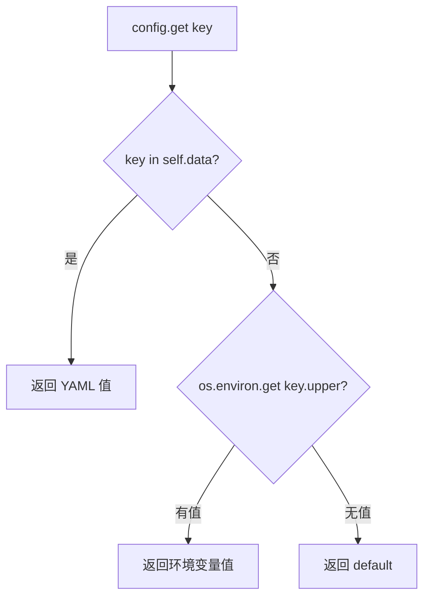
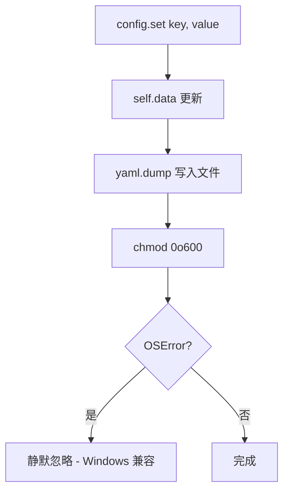
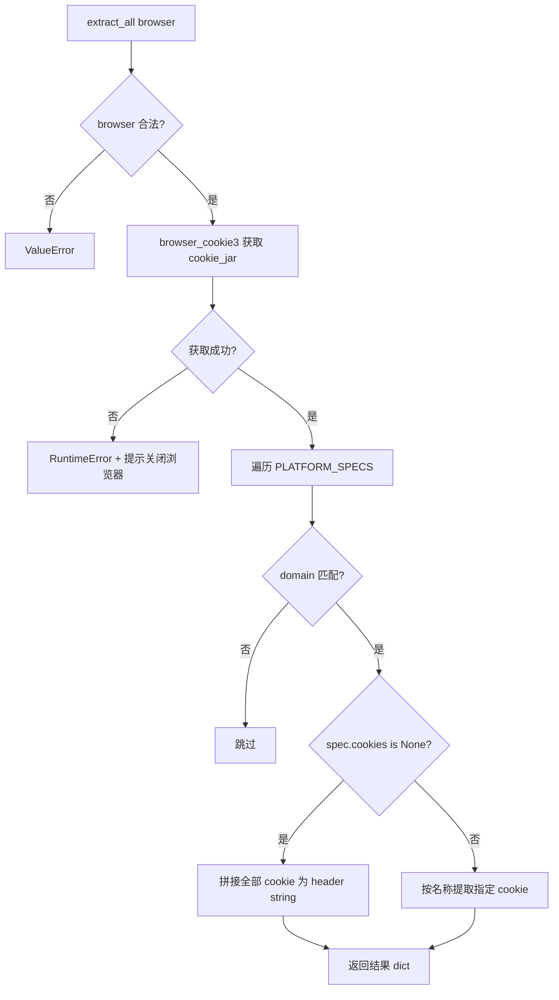

# PD-324.01 Agent Reach — YAML 双层凭据管理与浏览器 Cookie 自动提取

> 文档编号：PD-324.01
> 来源：Agent Reach `agent_reach/config.py`, `agent_reach/cookie_extract.py`, `agent_reach/doctor.py`
> GitHub：https://github.com/Panniantong/Agent-Reach.git
> 问题域：PD-324 凭据与密钥管理 Credential & Secret Management
> 状态：可复用方案

---

## 第 1 章 问题与动机

### 1.1 核心问题

多渠道 Agent 系统需要管理大量异构凭据——API Key、OAuth Token、浏览器 Cookie、代理地址等。这些凭据有三个核心挑战：

1. **安全存储**：凭据不能明文暴露在日志、版本控制或其他用户可读的位置
2. **来源多样**：有的凭据来自环境变量（CI/CD 场景），有的来自配置文件（本地开发），有的需要从浏览器自动提取（Cookie 类凭据）
3. **完整性校验**：Agent 启动前需要知道哪些功能可用、哪些凭据缺失，而不是运行时才报错

Agent Reach 面对 12 个渠道（Twitter、GitHub、Bilibili、小红书等），每个渠道的凭据类型和获取方式都不同，必须有一套统一的凭据管理体系。

### 1.2 Agent Reach 的解法概述

Agent Reach 采用三层防御式凭据管理架构：

1. **YAML 配置文件 + 环境变量双层读取**（`config.py:61-70`）：配置文件优先，环境变量兜底，key 自动大写映射
2. **0o600 文件权限自动保护**（`config.py:55-59`）：每次 save 自动 chmod，Doctor 检查时二次验证
3. **browser_cookie3 五浏览器 Cookie 自动提取**（`cookie_extract.py:38-112`）：从 Chrome/Firefox/Edge/Brave/Opera 提取 Twitter、小红书、Bilibili 的 Cookie
4. **to_dict 敏感值自动遮蔽**（`config.py:94-102`）：含 key/token/password/proxy 的字段自动截断为前 8 字符
5. **FEATURE_REQUIREMENTS 映射表**（`config.py:22-28`）：声明式定义每个功能需要哪些凭据，一次性检查完整性

### 1.3 设计思想

| 设计原则 | 具体实现 | 理由 | 替代方案 |
|----------|----------|------|----------|
| 配置文件优先 | `get()` 先查 YAML 再查 env var | 本地开发体验好，CI/CD 用 env 覆盖 | 纯 env var（12-Factor 风格） |
| 写时加固 | `save()` 自动 chmod 0o600 | 用户不需要记住权限设置 | 文档提醒手动 chmod |
| 声明式需求 | `FEATURE_REQUIREMENTS` 字典 | 新增渠道只需加一行映射 | 每个渠道自己检查 |
| 自动提取 | browser_cookie3 读取本地浏览器 | 用户无需手动复制 Cookie | 手动粘贴 Cookie 字符串 |
| 防泄漏 | `to_dict()` 自动遮蔽 | 日志/诊断输出安全 | 依赖调用方自行遮蔽 |

---

## 第 2 章 源码实现分析

### 2.1 架构概览

Agent Reach 的凭据管理由三个模块协作完成，形成"存储—提取—校验"闭环：

```
┌─────────────────────────────────────────────────────────────┐
│                      CLI 入口 (cli.py)                       │
│  configure --from-browser chrome  │  install  │  doctor     │
└──────────┬────────────────────────┴─────┬─────┴──────┬──────┘
           │                              │            │
           ▼                              ▼            ▼
┌──────────────────┐  ┌──────────────────────┐  ┌───────────┐
│ cookie_extract.py│  │     config.py         │  │ doctor.py │
│                  │  │                       │  │           │
│ extract_all()    │  │ Config class          │  │ check_all │
│  ├─ Chrome       │  │  ├─ get(): YAML→env  │  │ format_   │
│  ├─ Firefox      │──│  ├─ set(): +chmod    │──│  report() │
│  ├─ Edge         │  │  ├─ to_dict(): mask  │  │ 权限检查   │
│  ├─ Brave        │  │  └─ is_configured()  │  │           │
│  └─ Opera        │  │                       │  │           │
│                  │  │ ~/.agent-reach/       │  │           │
│ configure_from_  │  │   config.yaml (0o600) │  │           │
│   browser()      │  │                       │  │           │
└──────────────────┘  └──────────────────────┘  └───────────┘
           │                    ▲                      │
           └────── set() ──────┘                      │
                                                      │
           ┌──────────────────────────────────────────┘
           ▼
┌──────────────────────────────────────────┐
│         channels/ (12 个渠道)             │
│  每个 Channel.check(config) 自检凭据状态  │
│  tier 0: 零配置  │  tier 1: 免费 key     │
│  tier 2: 需配置                           │
└──────────────────────────────────────────┘
```

### 2.2 核心实现

#### 2.2.1 双层凭据读取：YAML 优先 + 环境变量兜底



对应源码 `agent_reach/config.py:61-70`：

```python
def get(self, key: str, default: Any = None) -> Any:
    """Get a config value. Also checks environment variables (uppercase)."""
    # Config file first
    if key in self.data:
        return self.data[key]
    # Then env var (uppercase)
    env_val = os.environ.get(key.upper())
    if env_val:
        return env_val
    return default
```

关键设计：key 在 YAML 中是小写（`exa_api_key`），环境变量自动映射为大写（`EXA_API_KEY`）。配置文件优先级高于环境变量，这样本地开发可以用文件覆盖 CI 的 env var。

#### 2.2.2 写时自动加固权限



对应源码 `agent_reach/config.py:49-59`：

```python
def save(self):
    """Save config to YAML file."""
    self._ensure_dir()
    with open(self.config_path, "w") as f:
        yaml.dump(self.data, f, default_flow_style=False, allow_unicode=True)
    # Restrict permissions — config may contain credentials
    try:
        import stat
        self.config_path.chmod(stat.S_IRUSR | stat.S_IWUSR)  # 0o600
    except OSError:
        pass  # Windows or permission edge cases
```

每次 `save()` 都重新设置权限，即使用户手动改过也会被修正回来。`OSError` 静默处理兼容 Windows（Windows 没有 Unix 权限模型）。

#### 2.2.3 Doctor 二次权限审计

`doctor.py:77-89` 在健康检查报告中额外验证配置文件权限：

```python
# Security check: config file permissions
config_path = Config.CONFIG_DIR / "config.yaml"
if config_path.exists():
    try:
        mode = config_path.stat().st_mode
        if mode & (stat.S_IRGRP | stat.S_IROTH):
            lines.append("⚠️  安全提示：config.yaml 权限过宽（其他用户可读）")
            lines.append("   修复：chmod 600 ~/.agent-reach/config.yaml")
    except OSError:
        pass
```

这是双重保险：`save()` 负责主动加固，`doctor` 负责被动检测。即使有外部程序修改了权限，doctor 也能发现。


#### 2.2.4 五浏览器 Cookie 自动提取



对应源码 `agent_reach/cookie_extract.py:38-112`：

```python
def extract_all(browser: str = "chrome") -> Dict[str, dict]:
    browser_funcs = {
        "chrome": browser_cookie3.chrome,
        "firefox": browser_cookie3.firefox,
        "edge": browser_cookie3.edge,
        "brave": browser_cookie3.brave,
        "opera": browser_cookie3.opera,
    }
    # ...
    for spec in PLATFORM_SPECS:
        for cookie in cookie_jar:
            domain_match = any(
                cookie.domain.endswith(d) or cookie.domain == d.lstrip(".")
                for d in spec["domains"]
            )
            if not domain_match:
                continue
            if spec["cookies"] is not None:
                if cookie.name in spec["cookies"]:
                    platform_cookies[cookie.name] = cookie.value
```

`PLATFORM_SPECS`（`cookie_extract.py:16-35`）是声明式的平台 Cookie 规格表：

```python
PLATFORM_SPECS = [
    {
        "name": "Twitter/X",
        "domains": [".x.com", ".twitter.com"],
        "cookies": ["auth_token", "ct0"],       # 精确提取指定 cookie
        "config_key": "twitter",
    },
    {
        "name": "XiaoHongShu",
        "domains": [".xiaohongshu.com"],
        "cookies": None,  # None = grab all cookies as header string
        "config_key": "xhs",
    },
]
```

`cookies: None` 表示"抓取该域名下所有 Cookie 拼成 header 字符串"，这是小红书等需要完整 Cookie 的平台的处理方式。

#### 2.2.5 敏感值自动遮蔽

对应源码 `agent_reach/config.py:94-102`：

```python
def to_dict(self) -> dict:
    """Return config as dict (masks sensitive values)."""
    masked = {}
    for k, v in self.data.items():
        if any(s in k.lower() for s in ("key", "token", "password", "proxy")):
            masked[k] = f"{str(v)[:8]}..." if v else None
        else:
            masked[k] = v
    return masked
```

遮蔽规则：字段名包含 `key`/`token`/`password`/`proxy` 的值只显示前 8 字符。这确保 `doctor` 报告和调试输出不会泄漏完整凭据。

### 2.3 实现细节

**FEATURE_REQUIREMENTS 声明式完整性检查**（`config.py:22-28, 82-92`）：

```python
FEATURE_REQUIREMENTS = {
    "exa_search": ["exa_api_key"],
    "reddit_proxy": ["reddit_proxy"],
    "twitter_bird": ["twitter_auth_token", "twitter_ct0"],
    "groq_whisper": ["groq_api_key"],
    "github_token": ["github_token"],
}

def is_configured(self, feature: str) -> bool:
    required = self.FEATURE_REQUIREMENTS.get(feature, [])
    return all(self.get(k) for k in required)
```

每个 feature 声明需要哪些 key，`is_configured()` 一次性检查所有依赖是否满足。`get_configured_features()` 返回全局状态快照，供 Doctor 和 CLI 使用。

**Tier 分级渠道健康检查**（`doctor.py:12-24, channels/base.py:24`）：

渠道按 tier 分级：0=零配置、1=需免费 key、2=需手动配置。Doctor 按 tier 分组展示，用户一眼看出哪些功能开箱即用、哪些需要额外配置。

**CLI 自动 Cookie 导入流程**（`cli.py:172-193`）：

安装命令 `agent-reach install` 在本地环境自动尝试从 Chrome 提取 Cookie，失败则回退到 Firefox。这是"零摩擦"设计——用户只需运行一条命令，凭据自动就位。

---

## 第 3 章 迁移指南

### 3.1 迁移清单

**阶段 1：基础凭据管理**
- [ ] 创建 Config 类，实现 YAML 读写 + 环境变量兜底
- [ ] 实现 `save()` 自动 chmod 0o600
- [ ] 实现 `to_dict()` 敏感值遮蔽
- [ ] 定义 `FEATURE_REQUIREMENTS` 映射表

**阶段 2：浏览器 Cookie 提取**
- [ ] 安装 `browser-cookie3` 依赖
- [ ] 定义 `PLATFORM_SPECS` 平台 Cookie 规格
- [ ] 实现 `extract_all()` 多浏览器提取
- [ ] 实现 `configure_from_browser()` 自动配置

**阶段 3：健康检查集成**
- [ ] 实现 Doctor 权限审计
- [ ] 按 tier 分级展示渠道状态
- [ ] CLI 安装流程集成自动 Cookie 导入

### 3.2 适配代码模板

以下是可直接复用的凭据管理模块：

```python
"""Portable credential manager — adapted from Agent Reach."""
import os
import stat
from pathlib import Path
from typing import Any, Dict, Optional
import yaml


class CredentialManager:
    """YAML + env var dual-layer credential management with auto-hardening."""

    CONFIG_DIR = Path.home() / ".my-agent"
    CONFIG_FILE = CONFIG_DIR / "config.yaml"

    # Feature → required credential keys
    FEATURE_REQUIREMENTS: Dict[str, list] = {
        # "my_feature": ["api_key", "api_secret"],
    }

    SENSITIVE_PATTERNS = ("key", "token", "password", "secret", "proxy", "cookie")

    def __init__(self, config_path: Optional[Path] = None):
        self.config_path = Path(config_path) if config_path else self.CONFIG_FILE
        self.config_dir = self.config_path.parent
        self.data: dict = {}
        self.config_dir.mkdir(parents=True, exist_ok=True)
        self._load()

    def _load(self):
        if self.config_path.exists():
            with open(self.config_path, "r") as f:
                self.data = yaml.safe_load(f) or {}

    def save(self):
        with open(self.config_path, "w") as f:
            yaml.dump(self.data, f, default_flow_style=False, allow_unicode=True)
        try:
            self.config_path.chmod(stat.S_IRUSR | stat.S_IWUSR)  # 0o600
        except OSError:
            pass  # Windows compatibility

    def get(self, key: str, default: Any = None) -> Any:
        if key in self.data:
            return self.data[key]
        env_val = os.environ.get(key.upper())
        return env_val if env_val else default

    def set(self, key: str, value: Any):
        self.data[key] = value
        self.save()

    def is_configured(self, feature: str) -> bool:
        required = self.FEATURE_REQUIREMENTS.get(feature, [])
        return all(self.get(k) for k in required)

    def to_safe_dict(self) -> dict:
        """Return config with sensitive values masked."""
        masked = {}
        for k, v in self.data.items():
            if any(s in k.lower() for s in self.SENSITIVE_PATTERNS):
                masked[k] = f"{str(v)[:8]}..." if v else None
            else:
                masked[k] = v
        return masked

    def audit_permissions(self) -> Optional[str]:
        """Check config file permissions. Returns warning message or None."""
        if not self.config_path.exists():
            return None
        try:
            mode = self.config_path.stat().st_mode
            if mode & (stat.S_IRGRP | stat.S_IROTH):
                return f"Config file permissions too open: {oct(mode)}. Run: chmod 600 {self.config_path}"
        except OSError:
            pass
        return None
```

### 3.3 适用场景

| 场景 | 适用度 | 说明 |
|------|--------|------|
| 多渠道 Agent 系统 | ⭐⭐⭐ | 核心场景，多种凭据类型统一管理 |
| CLI 工具凭据管理 | ⭐⭐⭐ | YAML 配置 + env var 兜底是 CLI 标准模式 |
| 需要浏览器 Cookie 的爬虫 | ⭐⭐⭐ | browser_cookie3 自动提取省去手动复制 |
| 微服务/容器化部署 | ⭐⭐ | env var 兜底可用，但缺少 Vault/KMS 集成 |
| 企业级密钥管理 | ⭐ | 无加密存储、无审计日志、无轮换机制 |


---

## 第 4 章 测试用例

基于 Agent Reach 真实测试（`tests/test_config.py`）扩展：

```python
"""Tests for credential management — adapted from Agent Reach test_config.py."""
import os
import stat
from pathlib import Path
import pytest
import yaml


class TestDualLayerRead:
    """Test YAML-first, env-var-fallback reading."""

    def test_yaml_value_returned(self, tmp_path):
        config = CredentialManager(config_path=tmp_path / "config.yaml")
        config.set("api_key", "from-yaml")
        assert config.get("api_key") == "from-yaml"

    def test_env_var_fallback(self, tmp_path, monkeypatch):
        config = CredentialManager(config_path=tmp_path / "config.yaml")
        monkeypatch.setenv("API_KEY", "from-env")
        assert config.get("api_key") == "from-env"

    def test_yaml_priority_over_env(self, tmp_path, monkeypatch):
        config = CredentialManager(config_path=tmp_path / "config.yaml")
        monkeypatch.setenv("MY_KEY", "from_env")
        config.set("my_key", "from_config")
        assert config.get("my_key") == "from_config"

    def test_default_when_missing(self, tmp_path):
        config = CredentialManager(config_path=tmp_path / "config.yaml")
        assert config.get("nonexistent") is None
        assert config.get("nonexistent", "fallback") == "fallback"


class TestPermissionHardening:
    """Test auto chmod 0o600 on save."""

    @pytest.mark.skipif(os.name == "nt", reason="Unix permissions only")
    def test_save_sets_0o600(self, tmp_path):
        config = CredentialManager(config_path=tmp_path / "config.yaml")
        config.set("secret", "value")
        mode = config.config_path.stat().st_mode
        assert not (mode & stat.S_IRGRP), "Group should not have read"
        assert not (mode & stat.S_IROTH), "Others should not have read"
        assert mode & stat.S_IRUSR, "Owner should have read"
        assert mode & stat.S_IWUSR, "Owner should have write"

    @pytest.mark.skipif(os.name == "nt", reason="Unix permissions only")
    def test_audit_detects_open_permissions(self, tmp_path):
        config = CredentialManager(config_path=tmp_path / "config.yaml")
        config.set("key", "val")
        config.config_path.chmod(0o644)  # Simulate bad permissions
        warning = config.audit_permissions()
        assert warning is not None
        assert "too open" in warning


class TestSensitiveMasking:
    """Test to_safe_dict masks credentials."""

    def test_masks_key_fields(self, tmp_path):
        config = CredentialManager(config_path=tmp_path / "config.yaml")
        config.set("exa_api_key", "super-secret-key-12345")
        config.set("normal_setting", "visible")
        masked = config.to_safe_dict()
        assert masked["exa_api_key"] == "super-se..."
        assert masked["normal_setting"] == "visible"

    def test_masks_token_fields(self, tmp_path):
        config = CredentialManager(config_path=tmp_path / "config.yaml")
        config.set("twitter_auth_token", "abcdefghijklmnop")
        masked = config.to_safe_dict()
        assert "abcdefghijklmnop" not in str(masked["twitter_auth_token"])

    def test_masks_none_values(self, tmp_path):
        config = CredentialManager(config_path=tmp_path / "config.yaml")
        config.data["api_key"] = None
        masked = config.to_safe_dict()
        assert masked["api_key"] is None


class TestFeatureRequirements:
    """Test declarative feature completeness check."""

    def test_unconfigured_feature(self, tmp_path):
        mgr = CredentialManager(config_path=tmp_path / "config.yaml")
        mgr.FEATURE_REQUIREMENTS = {"search": ["api_key", "api_secret"]}
        assert not mgr.is_configured("search")

    def test_partially_configured(self, tmp_path):
        mgr = CredentialManager(config_path=tmp_path / "config.yaml")
        mgr.FEATURE_REQUIREMENTS = {"search": ["api_key", "api_secret"]}
        mgr.set("api_key", "key123")
        assert not mgr.is_configured("search")  # api_secret still missing

    def test_fully_configured(self, tmp_path):
        mgr = CredentialManager(config_path=tmp_path / "config.yaml")
        mgr.FEATURE_REQUIREMENTS = {"search": ["api_key", "api_secret"]}
        mgr.set("api_key", "key123")
        mgr.set("api_secret", "secret456")
        assert mgr.is_configured("search")
```

---

## 第 5 章 跨域关联

| 关联域 | 关系类型 | 说明 |
|--------|----------|------|
| PD-04 工具系统 | 依赖 | 每个 Channel 的 `check(config)` 依赖 Config 提供凭据，工具可用性取决于凭据完整性 |
| PD-11 可观测性 | 协同 | `to_dict()` 遮蔽机制确保可观测性输出不泄漏凭据；Doctor 报告是可观测性的一部分 |
| PD-03 容错与重试 | 协同 | Cookie 提取失败时 Chrome→Firefox 自动降级（`cli.py:177-186`），是容错模式的应用 |
| PD-09 Human-in-the-Loop | 协同 | `configure --from-browser` 和手动 `configure key value` 提供人机交互式凭据配置 |

---

## 第 6 章 来源文件索引

| 文件 | 行范围 | 关键实现 |
|------|--------|----------|
| `agent_reach/config.py` | L1-L103 | Config 类：YAML 读写、env var 兜底、chmod 0o600、敏感值遮蔽、FEATURE_REQUIREMENTS |
| `agent_reach/cookie_extract.py` | L1-L167 | PLATFORM_SPECS 声明、extract_all() 五浏览器提取、configure_from_browser() 自动配置 |
| `agent_reach/doctor.py` | L1-L92 | check_all() 渠道健康检查、format_report() 分 tier 报告、权限二次审计 |
| `agent_reach/channels/base.py` | L1-L37 | Channel 基类：tier 分级、check() 接口 |
| `agent_reach/channels/twitter.py` | L1-L39 | TwitterChannel：bird CLI 检测 + Cookie 状态检查 |
| `agent_reach/channels/__init__.py` | L1-L59 | 12 渠道注册表、get_all_channels() |
| `agent_reach/cli.py` | L113-L199 | install 命令：自动 Cookie 导入 + Chrome→Firefox 降级 |
| `agent_reach/cli.py` | L551-L660 | configure 命令：手动配置 + 浏览器提取 + 自动测试 |
| `tests/test_config.py` | L1-L81 | Config 单元测试：双层读取、遮蔽、feature 检查 |

---

## 第 7 章 横向对比维度

```json comparison_data
{
  "project": "Agent Reach",
  "dimensions": {
    "存储方式": "YAML 文件 + 环境变量双层，~/.agent-reach/config.yaml",
    "权限保护": "save() 自动 chmod 0o600 + Doctor 二次审计",
    "凭据来源": "browser_cookie3 自动提取 5 浏览器 Cookie + 手动配置",
    "遮蔽机制": "to_dict() 按字段名模式匹配截断前 8 字符",
    "完整性校验": "FEATURE_REQUIREMENTS 声明式映射 + is_configured() 批量检查",
    "平台覆盖": "Twitter/小红书/Bilibili 三平台 Cookie 规格声明式定义"
  }
}
```

### 域元数据补充

```json domain_metadata
{
  "solution_summary": "Agent Reach 用 YAML+env 双层读取、save() 自动 chmod 0o600、browser_cookie3 五浏览器 Cookie 提取、FEATURE_REQUIREMENTS 声明式完整性校验实现凭据管理",
  "description": "多渠道 Agent 的异构凭据统一管理与浏览器自动提取",
  "sub_problems": [
    "多平台 Cookie 规格声明与按需提取策略",
    "渠道 tier 分级与凭据依赖可视化"
  ],
  "best_practices": [
    "声明式 FEATURE_REQUIREMENTS 映射表实现凭据完整性批量校验",
    "安装流程自动尝试 Chrome→Firefox 降级提取 Cookie"
  ]
}
```
