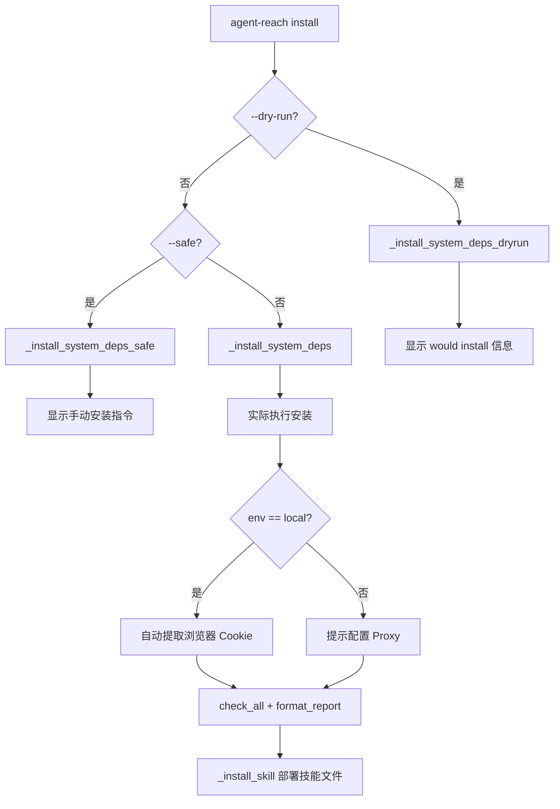
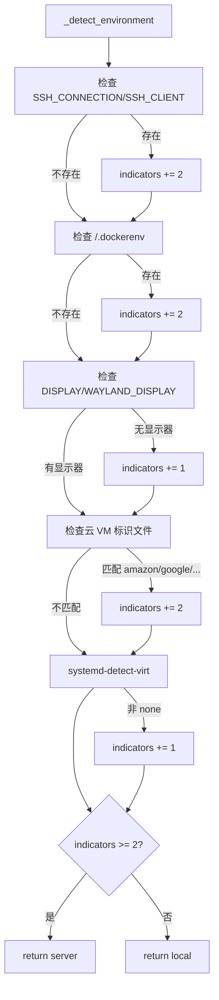

# PD-325.01 Agent Reach — 三模式安装器与环境自检引导

> 文档编号：PD-325.01
> 来源：Agent Reach `agent_reach/cli.py`, `agent_reach/doctor.py`, `agent_reach/config.py`
> GitHub：https://github.com/Panniantong/Agent-Reach.git
> 问题域：PD-325 环境引导与依赖管理 Environment Bootstrapping & Dependency Management
> 状态：可复用方案

---

## 第 1 章 问题与动机

### 1.1 核心问题

AI Agent 工具链的安装配置是一个被严重低估的工程问题。一个典型的多平台 Agent（如 Agent Reach 覆盖 12+ 平台）依赖大量异构上游工具：系统级 CLI（gh、node）、npm 全局包（bird、mcporter、undici）、Python 包（yt-dlp、browser-cookie3）、以及各平台的凭证（Cookie、API Key、Proxy）。这些依赖跨越三个包管理器（apt/brew、npm、pip），运行在两种截然不同的环境（本地桌面 vs 无头服务器），且每个依赖的安装失败不应阻塞其他依赖。

传统做法是写一个 `install.sh` 脚本一把梭，但这对 AI Agent 场景有三个致命缺陷：
1. **不可预览**：用户不知道脚本会做什么系统变更
2. **不可控制**：要么全装要么不装，没有中间态
3. **不感知环境**：本地电脑和服务器的安装策略完全不同（如 Cookie 提取只在本地有意义）

### 1.2 Agent Reach 的解法概述

Agent Reach 实现了一套三模式安装器 + 环境自检 + Channel 健康检查的完整引导体系：

1. **三模式安装**（`cli.py:113-233`）：`auto` 模式自动安装一切、`safe` 模式只报告不动手、`dry-run` 模式预览所有操作
2. **环境自动检测**（`cli.py:510-548`）：通过 SSH 会话、Docker 标记、显示器、云 VM 标识、systemd-detect-virt 五维指标加权判断 local vs server
3. **Channel 自检体系**（`doctor.py:12-24` + `channels/base.py:18-37`）：每个 Channel 自带 `check()` 方法，Doctor 聚合所有结果并按 Tier 分层报告
4. **凭证双源获取**（`config.py:61-70`）：YAML 文件优先、环境变量兜底，敏感值自动 `chmod 600`
5. **Skill 自动分发**（`cli.py:236-274`）：安装完成后自动将 SKILL.md 部署到 OpenClaw/Claude Code/通用 Agent 的技能目录

### 1.3 设计思想

| 设计原则 | 具体实现 | 理由 | 替代方案 |
|----------|----------|------|----------|
| 渐进式信任 | auto → safe → dry-run 三档 | 用户对系统变更的信任度不同，新用户先 dry-run 看看 | 单一 install 脚本（无法预览） |
| 环境感知 | 五维加权指标检测 local/server | 本地可提取 Cookie，服务器需要 Proxy 提示 | 手动 --env=local/server（用户可能不知道） |
| 依赖隔离 | 每个依赖独立 try/except，失败不阻塞 | gh 装不上不影响 yt-dlp | 串行安装，一个失败全部中止 |
| Channel 自治 | 每个 Channel 自带 check() 方法 | 新增平台只需实现 Channel 子类 | 中心化检查函数（难扩展） |
| 凭证安全 | YAML 0o600 + to_dict 脱敏 + 环境变量兜底 | 防止凭证泄露，同时支持 CI/CD 环境变量注入 | 明文 .env 文件（不安全） |

---

## 第 2 章 源码实现分析

### 2.1 架构概览

Agent Reach 的环境引导体系由四个核心模块组成：

```
┌─────────────────────────────────────────────────────────┐
│                    CLI Entry (cli.py)                     │
│  ┌──────────┐  ┌──────────┐  ┌──────────┐  ┌─────────┐ │
│  │ install   │  │ doctor   │  │ setup    │  │configure│ │
│  │ --safe    │  │          │  │(wizard)  │  │--from-  │ │
│  │ --dry-run │  │          │  │          │  │ browser │ │
│  └────┬─────┘  └────┬─────┘  └────┬─────┘  └────┬────┘ │
│       │              │             │              │       │
│  ┌────▼──────────────▼─────────────▼──────────────▼────┐ │
│  │              Config (config.py)                      │ │
│  │  YAML file → env var fallback → 0o600 permissions   │ │
│  └────┬────────────────────────────────────────────────┘ │
│       │                                                   │
│  ┌────▼────────────────────────────────────────────────┐ │
│  │           Doctor (doctor.py)                         │ │
│  │  for ch in get_all_channels(): ch.check(config)     │ │
│  └────┬────────────────────────────────────────────────┘ │
│       │                                                   │
│  ┌────▼────────────────────────────────────────────────┐ │
│  │        Channel Registry (channels/__init__.py)       │ │
│  │  12 Channels × 3 Tiers (0=zero-config, 1=key, 2=setup)│
│  │  Each: can_handle(url) + check(config) → (status,msg)│ │
│  └─────────────────────────────────────────────────────┘ │
└─────────────────────────────────────────────────────────┘
```

### 2.2 核心实现

#### 2.2.1 三模式安装器



对应源码 `agent_reach/cli.py:113-234`：

```python
def _cmd_install(args):
    """One-shot deterministic installer."""
    safe_mode = args.safe
    dry_run = args.dry_run
    config = Config()

    # Auto-detect environment
    env = args.env
    if env == "auto":
        env = _detect_environment()

    # ── Install system dependencies ──
    if dry_run:
        _install_system_deps_dryrun()
    elif safe_mode:
        _install_system_deps_safe()
    else:
        _install_system_deps()

    # ── mcporter (for Exa search + XiaoHongShu) ──
    if dry_run:
        print("📦 [dry-run] Would install mcporter and configure Exa search")
    elif safe_mode:
        _install_mcporter_safe()
    else:
        _install_mcporter()

    # Auto-import cookies on local computers
    if env == "local" and not safe_mode and not dry_run:
        from agent_reach.cookie_extract import configure_from_browser
        results = configure_from_browser("chrome", config)
        # ... fallback to firefox if chrome yields nothing
```

三个模式的关键差异在于系统依赖安装函数的实现。`_install_system_deps()` (`cli.py:277-371`) 实际执行 `subprocess.run` 安装命令；`_install_system_deps_safe()` (`cli.py:374-401`) 只用 `shutil.which` 检测并打印手动安装指令；`_install_system_deps_dryrun()` (`cli.py:404-421`) 同样只检测，但输出格式为 "would install via: ..."。

#### 2.2.2 环境自动检测



对应源码 `agent_reach/cli.py:510-548`：

```python
def _detect_environment():
    """Auto-detect if running on local computer or server."""
    indicators = 0

    # SSH session
    if os.environ.get("SSH_CONNECTION") or os.environ.get("SSH_CLIENT"):
        indicators += 2

    # Docker / container
    if os.path.exists("/.dockerenv") or os.path.exists("/run/.containerenv"):
        indicators += 2

    # No display (headless)
    if not os.environ.get("DISPLAY") and not os.environ.get("WAYLAND_DISPLAY"):
        indicators += 1

    # Cloud VM identifiers
    for cloud_file in ["/sys/hypervisor/uuid", "/sys/class/dmi/id/product_name"]:
        if os.path.exists(cloud_file):
            content = open(cloud_file).read().lower()
            if any(x in content for x in ["amazon", "google", "microsoft",
                                           "digitalocean", "linode", "vultr", "hetzner"]):
                indicators += 2

    # systemd-detect-virt
    try:
        result = subprocess.run(["systemd-detect-virt"],
                                capture_output=True, text=True, timeout=3)
        if result.returncode == 0 and result.stdout.strip() != "none":
            indicators += 1
    except:
        pass

    return "server" if indicators >= 2 else "local"
```

五维检测的权重设计很精妙：SSH 和 Docker 是强信号（+2），无显示器和虚拟化是弱信号（+1），阈值 2 意味着单个弱信号不会误判。

### 2.3 实现细节

#### Channel Tier 分层与 Doctor 聚合

每个 Channel 声明自己的 `tier` 级别（`channels/base.py:24`）：
- Tier 0：零配置即用（Web、GitHub、YouTube、RSS）
- Tier 1：需要免费 Key 或 MCP（Exa、Twitter、Reddit）
- Tier 2：需要手动配置（Bilibili Cookie、XiaoHongShu）

Doctor (`doctor.py:12-24`) 遍历所有 Channel 调用 `check(config)`，返回统一的 `{status, name, message, tier, backends}` 字典。`format_report()` (`doctor.py:27-91`) 按 Tier 分组输出，并在末尾检查 config.yaml 的文件权限是否过宽。

#### Config 双源查找与安全存储

`Config.get()` (`config.py:61-70`) 先查 YAML 文件，再查大写环境变量。`Config.save()` (`config.py:49-59`) 写入后立即 `chmod 0o600`，防止多用户环境下凭证泄露。`to_dict()` (`config.py:94-102`) 对含 key/token/password/proxy 的字段自动截断脱敏，用于日志输出。

#### Skill 自动分发

`_install_skill()` (`cli.py:236-274`) 扫描三个已知技能目录（`~/.openclaw/skills`、`~/.claude/skills`、`~/.agents/skills`），将 SKILL.md 从 Python 包资源中读出并写入。如果没有任何已知目录存在，默认创建 OpenClaw 目录。


---

## 第 3 章 迁移指南

### 3.1 迁移清单

**阶段 1：基础框架（1 天）**
- [ ] 创建 `Config` 类：YAML 存储 + 环境变量兜底 + 0o600 权限
- [ ] 创建 `Channel` 抽象基类：`name`, `tier`, `backends`, `check(config)`, `can_handle(url)`
- [ ] 实现 `doctor.py`：遍历 Channel 聚合健康状态

**阶段 2：安装器（1 天）**
- [ ] 实现 `_detect_environment()`：五维加权环境检测
- [ ] 实现三模式安装：`_install_system_deps()` / `_safe()` / `_dryrun()`
- [ ] 实现 CLI 入口：argparse + subcommands

**阶段 3：凭证管理（0.5 天）**
- [ ] 实现 `cookie_extract.py`：browser-cookie3 多浏览器提取
- [ ] 实现 `configure` 命令：手动设置 + `--from-browser` 自动提取
- [ ] 实现 `FEATURE_REQUIREMENTS` 映射：feature → required keys

**阶段 4：扩展（按需）**
- [ ] 为每个平台实现 Channel 子类
- [ ] 实现 Skill 自动分发
- [ ] 实现 `watch` 命令（定时健康检查）

### 3.2 适配代码模板

#### 可复用的三模式安装器骨架

```python
"""三模式安装器模板 — 可直接复用"""
import shutil
import subprocess
import platform
from dataclasses import dataclass
from typing import List, Tuple, Callable
from enum import Enum


class InstallMode(Enum):
    AUTO = "auto"
    SAFE = "safe"
    DRY_RUN = "dry-run"


@dataclass
class Dependency:
    name: str
    binaries: List[str]          # shutil.which 检测用
    label: str                   # 人类可读名称
    install_hint: str            # 手动安装提示
    install_fn: Callable         # 自动安装函数（仅 AUTO 模式调用）


def check_and_install(deps: List[Dependency], mode: InstallMode) -> List[Tuple[str, bool, str]]:
    """三模式依赖安装。返回 [(name, installed, message)]"""
    results = []
    for dep in deps:
        found = any(shutil.which(b) for b in dep.binaries)
        if found:
            results.append((dep.name, True, f"{dep.label} already installed"))
            continue

        if mode == InstallMode.DRY_RUN:
            results.append((dep.name, False, f"Would install: {dep.install_hint}"))
        elif mode == InstallMode.SAFE:
            results.append((dep.name, False, f"Not found. Install: {dep.install_hint}"))
        else:  # AUTO
            try:
                dep.install_fn()
                installed = any(shutil.which(b) for b in dep.binaries)
                if installed:
                    results.append((dep.name, True, f"{dep.label} installed"))
                else:
                    results.append((dep.name, False, f"Install failed. Try: {dep.install_hint}"))
            except Exception as e:
                results.append((dep.name, False, f"Install failed: {e}"))
    return results


def detect_environment() -> str:
    """五维加权环境检测 — 从 Agent Reach 移植"""
    import os
    indicators = 0

    if os.environ.get("SSH_CONNECTION") or os.environ.get("SSH_CLIENT"):
        indicators += 2
    if os.path.exists("/.dockerenv") or os.path.exists("/run/.containerenv"):
        indicators += 2
    if not os.environ.get("DISPLAY") and not os.environ.get("WAYLAND_DISPLAY"):
        indicators += 1

    for cloud_file in ["/sys/hypervisor/uuid", "/sys/class/dmi/id/product_name"]:
        if os.path.exists(cloud_file):
            try:
                content = open(cloud_file).read().lower()
                if any(x in content for x in ["amazon", "google", "microsoft",
                                               "digitalocean", "linode", "vultr", "hetzner"]):
                    indicators += 2
            except OSError:
                pass

    try:
        result = subprocess.run(["systemd-detect-virt"],
                                capture_output=True, text=True, timeout=3)
        if result.returncode == 0 and result.stdout.strip() != "none":
            indicators += 1
    except (FileNotFoundError, subprocess.TimeoutExpired):
        pass

    return "server" if indicators >= 2 else "local"
```

#### 可复用的 Channel 健康检查骨架

```python
"""Channel 健康检查模板"""
from abc import ABC, abstractmethod
from typing import Tuple, List


class Channel(ABC):
    name: str = ""
    description: str = ""
    backends: List[str] = []
    tier: int = 0  # 0=zero-config, 1=free-key, 2=manual-setup

    @abstractmethod
    def can_handle(self, url: str) -> bool: ...

    def check(self, config=None) -> Tuple[str, str]:
        """返回 (status, message)，status ∈ {ok, warn, off, error}"""
        return "ok", "内置"


def doctor(channels: List[Channel], config=None) -> dict:
    results = {}
    for ch in channels:
        status, message = ch.check(config)
        results[ch.name] = {
            "status": status, "name": ch.description,
            "message": message, "tier": ch.tier,
        }
    return results
```

### 3.3 适用场景

| 场景 | 适用度 | 说明 |
|------|--------|------|
| 多平台 Agent 工具链安装 | ⭐⭐⭐ | 核心场景，直接复用三模式安装器 |
| CLI 工具的首次运行引导 | ⭐⭐⭐ | setup wizard + doctor 模式可直接移植 |
| CI/CD 环境依赖检查 | ⭐⭐ | dry-run 模式适合 CI 预检，但需补充退出码 |
| 容器化部署 | ⭐⭐ | 环境检测可识别 Docker，但安装逻辑需适配 |
| 单一依赖项目 | ⭐ | 过度设计，直接 `shutil.which` 检查即可 |

---

## 第 4 章 测试用例

```python
"""基于 Agent Reach 真实函数签名的测试用例"""
import os
import tempfile
from pathlib import Path
from unittest.mock import patch, MagicMock

import pytest


# ── 环境检测测试 ──

class TestDetectEnvironment:
    """测试 _detect_environment() 五维加权检测"""

    def test_local_default(self):
        """无任何服务器指标 → local"""
        with patch.dict(os.environ, {}, clear=True):
            with patch("os.path.exists", return_value=False):
                from agent_reach.cli import _detect_environment
                assert _detect_environment() == "local"

    def test_ssh_session_detected_as_server(self):
        """SSH_CONNECTION 存在 → server（权重 2，达到阈值）"""
        with patch.dict(os.environ, {"SSH_CONNECTION": "1.2.3.4 22 5.6.7.8 54321"}):
            from agent_reach.cli import _detect_environment
            assert _detect_environment() == "server"

    def test_docker_detected_as_server(self):
        """/.dockerenv 存在 → server"""
        with patch("os.path.exists") as mock_exists:
            mock_exists.side_effect = lambda p: p == "/.dockerenv"
            from agent_reach.cli import _detect_environment
            assert _detect_environment() == "server"

    def test_headless_alone_not_server(self):
        """仅无显示器（权重 1）不足以判定为 server"""
        with patch.dict(os.environ, {}, clear=True):
            with patch("os.path.exists", return_value=False):
                from agent_reach.cli import _detect_environment
                # indicators = 1 (no DISPLAY) < 2 threshold
                assert _detect_environment() == "local"


# ── Config 测试 ──

class TestConfig:
    def test_yaml_priority_over_env(self, tmp_path, monkeypatch):
        """YAML 文件值优先于环境变量"""
        from agent_reach.config import Config
        config = Config(config_path=tmp_path / "config.yaml")
        monkeypatch.setenv("MY_KEY", "from_env")
        config.set("my_key", "from_config")
        assert config.get("my_key") == "from_config"

    def test_env_fallback(self, tmp_path, monkeypatch):
        """YAML 无值时回退到环境变量"""
        from agent_reach.config import Config
        config = Config(config_path=tmp_path / "config.yaml")
        monkeypatch.setenv("TEST_KEY", "env_value")
        assert config.get("test_key") == "env_value"

    def test_sensitive_masking(self, tmp_path):
        """to_dict() 对敏感字段脱敏"""
        from agent_reach.config import Config
        config = Config(config_path=tmp_path / "config.yaml")
        config.set("exa_api_key", "super-secret-key-12345")
        masked = config.to_dict()
        assert masked["exa_api_key"] == "super-se..."

    def test_feature_requirements(self, tmp_path):
        """is_configured 检查所有必需 key"""
        from agent_reach.config import Config
        config = Config(config_path=tmp_path / "config.yaml")
        assert not config.is_configured("twitter_bird")
        config.set("twitter_auth_token", "tok")
        assert not config.is_configured("twitter_bird")  # 还缺 ct0
        config.set("twitter_ct0", "ct0val")
        assert config.is_configured("twitter_bird")


# ── Doctor 测试 ──

class TestDoctor:
    def test_aggregates_all_channels(self, tmp_path):
        """doctor 聚合所有 Channel 的 check 结果"""
        from agent_reach.config import Config
        from agent_reach.doctor import check_all
        config = Config(config_path=tmp_path / "config.yaml")
        results = check_all(config)
        assert "web" in results
        assert "github" in results
        assert results["web"]["status"] == "ok"

    def test_tier_classification(self, tmp_path):
        """Channel 按 tier 正确分类"""
        from agent_reach.config import Config
        from agent_reach.doctor import check_all
        config = Config(config_path=tmp_path / "config.yaml")
        results = check_all(config)
        assert results["web"]["tier"] == 0
        assert results["twitter"]["tier"] == 1
```


---

## 第 5 章 跨域关联

| 关联域 | 关系类型 | 说明 |
|--------|----------|------|
| PD-04 工具系统 | 依赖 | 安装器的核心目标是安装上游工具链（gh、bird、mcporter），工具系统的设计决定了需要安装什么 |
| PD-11 可观测性 | 协同 | Doctor 健康检查是可观测性的一部分，`watch` 命令可作为定时监控探针 |
| PD-06 记忆持久化 | 协同 | Config YAML 是一种轻量持久化，凭证存储与记忆系统共享安全存储需求 |
| PD-03 容错与重试 | 协同 | 每个依赖安装独立 try/except 是容错设计，safe/dry-run 是降级策略 |
| PD-09 Human-in-the-Loop | 协同 | safe 模式本质是 HITL：系统报告状态，人类决定是否执行 |

---

## 第 6 章 来源文件索引

| 文件 | 行范围 | 关键实现 |
|------|--------|----------|
| `agent_reach/cli.py` | L36-107 | CLI 入口 argparse 定义与命令分发 |
| `agent_reach/cli.py` | L113-234 | `_cmd_install()` 三模式安装主流程 |
| `agent_reach/cli.py` | L236-274 | `_install_skill()` 技能文件自动分发 |
| `agent_reach/cli.py` | L277-371 | `_install_system_deps()` 实际安装逻辑（gh/node/bird/undici） |
| `agent_reach/cli.py` | L374-401 | `_install_system_deps_safe()` 安全模式检测 |
| `agent_reach/cli.py` | L404-421 | `_install_system_deps_dryrun()` 预览模式 |
| `agent_reach/cli.py` | L424-492 | `_install_mcporter()` MCP 工具安装与配置 |
| `agent_reach/cli.py` | L510-548 | `_detect_environment()` 五维环境检测 |
| `agent_reach/config.py` | L15-102 | Config 类：YAML 存储 + 环境变量兜底 + 权限保护 |
| `agent_reach/doctor.py` | L12-24 | `check_all()` Channel 健康聚合 |
| `agent_reach/doctor.py` | L27-91 | `format_report()` Tier 分层报告 + 权限安全检查 |
| `agent_reach/channels/base.py` | L18-37 | Channel 抽象基类（name/tier/backends/check） |
| `agent_reach/channels/__init__.py` | L25-38 | ALL_CHANNELS 注册表（12 个 Channel 实例） |
| `agent_reach/cookie_extract.py` | L16-35 | PLATFORM_SPECS 平台 Cookie 规格定义 |
| `agent_reach/cookie_extract.py` | L38-112 | `extract_all()` 多浏览器 Cookie 提取 |
| `agent_reach/cookie_extract.py` | L115-166 | `configure_from_browser()` 提取并写入配置 |
| `pyproject.toml` | L30-38 | Python 依赖声明（核心 + optional） |

---

## 第 7 章 横向对比维度

```json comparison_data
{
  "project": "Agent Reach",
  "dimensions": {
    "安装模式": "三档 auto/safe/dry-run，argparse flag 切换",
    "环境检测": "五维加权指标（SSH/Docker/Display/CloudVM/systemd），阈值 2",
    "依赖安装策略": "shutil.which 检测 + subprocess 跨平台安装（brew/apt/npm）",
    "健康检查": "Channel.check() 自治 + Doctor 聚合 + Tier 分层报告",
    "凭证管理": "YAML 0o600 + 环境变量兜底 + to_dict 脱敏",
    "技能分发": "安装后自动部署 SKILL.md 到 OpenClaw/Claude Code 技能目录"
  }
}
```

### 域元数据补充

```json domain_metadata
{
  "solution_summary": "Agent Reach 用三模式安装器(auto/safe/dry-run) + 五维加权环境检测 + Channel Tier 分层健康检查实现 12+ 平台工具链的一键引导",
  "description": "Agent 工具链安装不仅是依赖管理，更是信任建立过程",
  "sub_problems": [
    "安装后技能文件自动分发到多 Agent 框架目录",
    "浏览器 Cookie 自动提取与平台凭证配置",
    "定时健康监控与版本更新检查(watch 命令)"
  ],
  "best_practices": [
    "每个依赖独立 try/except，单个失败不阻塞整体安装",
    "Config 存储后立即 chmod 0o600 防止凭证泄露",
    "Channel 自带 check() 方法实现自治式健康检查"
  ]
}
```

