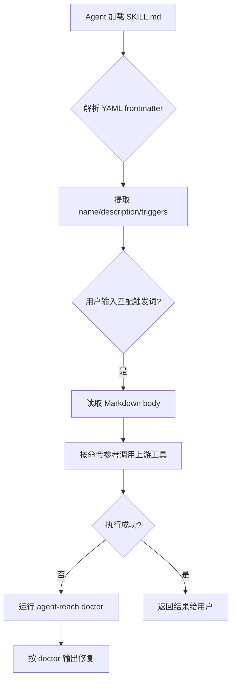
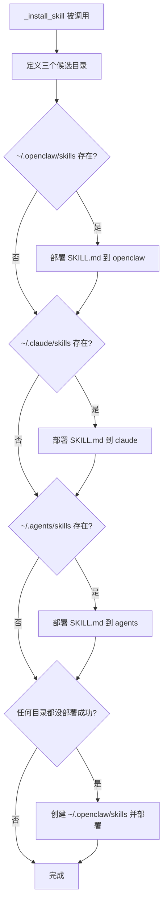

# PD-326.01 Agent Reach — SKILL.md 跨 Agent 平台技能注入协议

> 文档编号：PD-326.01
> 来源：Agent Reach `agent_reach/skill/SKILL.md` `agent_reach/cli.py`
> GitHub：https://github.com/Panniantong/Agent-Reach.git
> 问题域：PD-326 Agent 技能协议 Agent Skill Protocol
> 状态：可复用方案

---

## 第 1 章 问题与动机

### 1.1 核心问题

AI Agent 的能力边界由其可调用的工具决定，但不同 Agent 平台（Claude Code、OpenClaw、Cursor 等）的技能注入方式各不相同。如何让一个工具包在安装时自动将"使用说明书"部署到 Agent 能理解的位置，使 Agent 无需人工配置就能发现并使用新能力？

这个问题包含三个子问题：
1. **技能指令格式**：Agent 需要什么格式的指令才能自主调用上游工具？
2. **多平台适配**：不同 Agent 平台的 skills 目录在哪里？如何自动检测和部署？
3. **版本一致性**：技能文件如何随包分发，确保安装的版本与工具版本匹配？

### 1.2 Agent Reach 的解法概述

Agent Reach 采用"安装即注入"的设计：pip install 完成后，`agent-reach install` 命令自动将 SKILL.md 部署到所有已知 Agent 平台的 skills 目录。核心要点：

1. **SKILL.md 作为唯一技能契约** — 一个 Markdown 文件包含 YAML frontmatter（触发词、描述）+ 完整命令参考 + 故障排查指南，Agent 读取后即可自主调用 12+ 上游工具（`agent_reach/skill/SKILL.md:1-259`）
2. **三目录探测部署** — `_install_skill()` 函数依次检测 `~/.openclaw/skills`、`~/.claude/skills`、`~/.agents/skills`，存在即部署（`agent_reach/cli.py:242-274`）
3. **importlib.resources 随包分发** — SKILL.md 打包在 wheel 内，通过 `importlib.resources.files()` 读取，确保版本一致（`agent_reach/cli.py:255`）
4. **上游工具直接调用** — Agent Reach 不做 wrapper，SKILL.md 教 Agent 直接调用 bird、yt-dlp、mcporter 等原生命令（`agent_reach/skill/SKILL.md:77-245`）
5. **doctor 驱动的自愈** — SKILL.md 指导 Agent 遇到问题时运行 `agent-reach doctor` 获取诊断，而非记忆每个平台的修复步骤（`agent_reach/skill/SKILL.md:54`）

### 1.3 设计思想

| 设计原则 | 具体实现 | 理由 | 替代方案 |
|----------|----------|------|----------|
| 技能即文档 | SKILL.md 纯 Markdown + YAML frontmatter | Agent 原生理解 Markdown，无需解析器 | JSON Schema 定义（需要额外解析层） |
| 安装即注入 | `_install_skill()` 在 install 流程末尾自动执行 | 零配置体验，用户无需知道 skills 目录在哪 | 手动 copy 或 symlink（增加用户负担） |
| 不做 wrapper | SKILL.md 列出上游工具原生命令 | 避免维护中间层，减少故障点 | 统一 API 封装（增加维护成本和延迟） |
| doctor 驱动 | "Do NOT memorize per-channel steps. Always rely on doctor output" | 单一诊断入口，避免 SKILL.md 膨胀 | 每个平台独立故障排查文档 |
| 包内分发 | `importlib.resources.files("agent_reach").joinpath("skill", "SKILL.md")` | 版本锁定，pip install 即获取匹配版本 | 从 GitHub raw URL 下载（网络依赖+版本漂移） |

---

## 第 2 章 源码实现分析

### 2.1 架构概览

Agent Reach 的技能协议架构分为三层：分发层（wheel 打包）、部署层（多平台探测）、消费层（Agent 读取 SKILL.md）。

```
┌─────────────────────────────────────────────────────────┐
│                    pip install                           │
│  ┌──────────────┐    ┌──────────────┐                   │
│  │ pyproject.toml│───→│ wheel 包含:  │                   │
│  │ force-include │    │ agent_reach/ │                   │
│  │ skill/       │    │   skill/     │                   │
│  └──────────────┘    │   SKILL.md   │                   │
│                      └──────┬───────┘                   │
├─────────────────────────────┼───────────────────────────┤
│              agent-reach install                        │
│                             │                           │
│  ┌──────────────────────────▼──────────────────────┐    │
│  │           _install_skill()                      │    │
│  │  ┌─────────────┐ ┌────────────┐ ┌────────────┐ │    │
│  │  │~/.openclaw/ │ │~/.claude/  │ │~/.agents/  │ │    │
│  │  │  skills/    │ │  skills/   │ │  skills/   │ │    │
│  │  │  agent-reach│ │  agent-reach│ │  agent-reach│ │   │
│  │  │  /SKILL.md  │ │  /SKILL.md │ │  /SKILL.md │ │    │
│  │  └─────────────┘ └────────────┘ └────────────┘ │    │
│  └─────────────────────────────────────────────────┘    │
├─────────────────────────────────────────────────────────┤
│                Agent 消费层                              │
│  ┌──────────────────────────────────────────────────┐   │
│  │ Agent 读取 SKILL.md → 解析 frontmatter 触发词    │   │
│  │ → 按命令参考直接调用 bird/yt-dlp/mcporter/gh    │   │
│  │ → 遇错运行 agent-reach doctor 自诊断            │   │
│  └──────────────────────────────────────────────────┘   │
└─────────────────────────────────────────────────────────┘
```

### 2.2 核心实现

#### 2.2.1 SKILL.md 技能契约格式

SKILL.md 采用 YAML frontmatter + Markdown body 的双层结构。frontmatter 提供机器可解析的元数据（名称、描述、触发词），body 提供 Agent 可读的完整操作指南。



对应源码 `agent_reach/skill/SKILL.md:1-12`：
```yaml
---
name: agent-reach
description: >
  Give your AI agent eyes to see the entire internet. Install and configure
  upstream tools for Twitter/X, Reddit, YouTube, GitHub, Bilibili, XiaoHongShu,
  Douyin, LinkedIn, Boss直聘, RSS, and any web page — then call them directly.
  Use when: (1) setting up platform access tools for the first time,
  (2) checking which platforms are available,
  (3) user asks to configure/enable a platform channel.
  Triggers: "帮我配", "帮我添加", "帮我安装", "agent reach", "install channels",
  "configure twitter", "enable reddit".
---
```

SKILL.md body 的关键设计是"配置渠道"工作流（`agent_reach/skill/SKILL.md:44-54`）：
```markdown
## Configuring a channel ("帮我配 XXX")

When a user asks to configure/enable any channel:

1. Run `agent-reach doctor`
2. Find the channel — it shows status (✅/⚠️/⬜) and **what to do next**
3. Execute what you can automatically (install packages, start services)
4. For human-required steps (paste cookies), tell the user what to do
5. Run `agent-reach doctor` again to verify

**Do NOT memorize per-channel steps.** Always rely on `doctor` output.
```

这段指令的核心思想是：SKILL.md 不试图穷举所有平台的配置步骤，而是教 Agent 一个通用的"诊断-修复-验证"循环。

#### 2.2.2 多平台技能目录探测与部署



对应源码 `agent_reach/cli.py:236-274`：
```python
def _install_skill():
    """Install Agent Reach as an agent skill (OpenClaw / Claude Code)."""
    import os
    import importlib.resources

    # Determine skill install path
    skill_dirs = [
        os.path.expanduser("~/.openclaw/skills"),   # OpenClaw
        os.path.expanduser("~/.claude/skills"),      # Claude Code
        os.path.expanduser("~/.agents/skills"),      # Generic agents
    ]

    installed = False
    for skill_dir in skill_dirs:
        if os.path.isdir(skill_dir):
            target = os.path.join(skill_dir, "agent-reach")
            try:
                os.makedirs(target, exist_ok=True)
                # Read SKILL.md from package data
                skill_md = importlib.resources.files("agent_reach") \
                    .joinpath("skill", "SKILL.md").read_text()
                with open(os.path.join(target, "SKILL.md"), "w") as f:
                    f.write(skill_md)
                platform_name = ("OpenClaw" if "openclaw" in skill_dir
                    else "Claude Code" if "claude" in skill_dir
                    else "Agent")
                print(f"🧩 Skill installed for {platform_name}: {target}")
                installed = True
            except Exception:
                pass

    if not installed:
        # No known skill directory found — create for OpenClaw by default
        target = os.path.expanduser("~/.openclaw/skills/agent-reach")
        try:
            os.makedirs(target, exist_ok=True)
            skill_md = importlib.resources.files("agent_reach") \
                .joinpath("skill", "SKILL.md").read_text()
            with open(os.path.join(target, "SKILL.md"), "w") as f:
                f.write(skill_md)
            print(f"🧩 Skill installed: {target}")
        except Exception:
            print("  ⬜ Could not install agent skill (optional)")
```

### 2.3 实现细节

#### wheel 打包确保技能文件随包分发

`pyproject.toml:60-62` 通过 hatch 的 `force-include` 确保 skill 目录和 guides 目录被打入 wheel：

```toml
[tool.hatch.build.targets.wheel.force-include]
"agent_reach/guides" = "agent_reach/guides"
"agent_reach/skill" = "agent_reach/skill"
```

#### Channel 抽象基类与 doctor 诊断体系

SKILL.md 的 doctor 驱动设计依赖 Channel 抽象基类（`agent_reach/channels/base.py:18-37`）。每个 Channel 实现 `check(config)` 方法返回 `(status, message)` 元组，doctor 聚合所有 Channel 的检查结果并按 tier 分组展示：

```
Channel.check() → ("ok"/"warn"/"off"/"error", "诊断消息")
     ↓
doctor.check_all() → 遍历 ALL_CHANNELS 收集结果
     ↓
doctor.format_report() → 按 tier 0/1/2 分组格式化
```

12 个 Channel 实现分布在 `agent_reach/channels/` 目录下（`agent_reach/channels/__init__.py:25-38`），每个 Channel 声明自己的 `tier`（0=零配置、1=需免费 key、2=需手动配置）和 `backends`（上游工具名）。

#### 安装指南作为 Agent 可消费的指令文档

`docs/install.md` 是另一个关键的技能协议文件。它分为"For Humans"和"For AI Agents"两部分（`docs/install.md:3-19`），Agent 部分包含明确的边界约束（不 sudo、不改系统文件）和 5 步安装流程。这种"双受众"文档设计让同一个 URL 既能给人看，也能直接喂给 Agent 执行。

---
## 第 3 章 迁移指南

### 3.1 迁移清单

将 Agent Reach 的技能协议模式迁移到自己的项目，需要完成以下步骤：

**阶段 1：定义技能契约**
- [ ] 创建 `your_package/skill/SKILL.md`，包含 YAML frontmatter（name、description、triggers）
- [ ] 在 Markdown body 中列出所有可用命令的完整用法（不是 API 文档，是 Agent 可直接执行的命令）
- [ ] 添加"配置渠道"通用工作流：诊断 → 修复 → 验证
- [ ] 添加故障排查入口（指向 doctor 命令或等效诊断工具）

**阶段 2：打包分发**
- [ ] 在 `pyproject.toml` 中配置 `force-include` 确保 skill 目录进入 wheel
- [ ] 使用 `importlib.resources.files()` 读取包内技能文件（不要硬编码路径）

**阶段 3：自动部署**
- [ ] 实现 `_install_skill()` 函数，探测已知 Agent 平台的 skills 目录
- [ ] 在 install 命令末尾自动调用部署
- [ ] 提供 fallback：无已知目录时创建默认目录

### 3.2 适配代码模板

以下模板可直接复用，实现"pip install 后自动部署技能文件到 Agent 平台"：

```python
"""skill_deployer.py — 通用 Agent 技能部署器"""
import os
import importlib.resources
from pathlib import Path
from typing import List, Tuple


# 已知 Agent 平台的 skills 目录
KNOWN_SKILL_DIRS = [
    ("OpenClaw", Path.home() / ".openclaw" / "skills"),
    ("Claude Code", Path.home() / ".claude" / "skills"),
    ("Generic Agent", Path.home() / ".agents" / "skills"),
]

# 你的包名和技能文件路径
PACKAGE_NAME = "your_package"
SKILL_SUBPATH = ("skill", "SKILL.md")
SKILL_DIR_NAME = "your-skill-name"


def deploy_skill(
    default_platform: str = "OpenClaw",
) -> List[Tuple[str, str]]:
    """
    将 SKILL.md 从 wheel 包内部署到所有已知 Agent 平台。

    Returns:
        [(platform_name, target_path), ...] 成功部署的列表
    """
    # 从包内读取 SKILL.md
    skill_content = (
        importlib.resources.files(PACKAGE_NAME)
        .joinpath(*SKILL_SUBPATH)
        .read_text(encoding="utf-8")
    )

    deployed = []
    for platform_name, skill_dir in KNOWN_SKILL_DIRS:
        if not skill_dir.is_dir():
            continue
        target = skill_dir / SKILL_DIR_NAME
        try:
            target.mkdir(parents=True, exist_ok=True)
            (target / "SKILL.md").write_text(skill_content, encoding="utf-8")
            deployed.append((platform_name, str(target)))
        except OSError:
            pass

    # Fallback: 无已知目录时创建默认目录
    if not deployed:
        fallback_dir = KNOWN_SKILL_DIRS[0][1]  # 默认用第一个平台
        fallback_name = KNOWN_SKILL_DIRS[0][0]
        target = fallback_dir / SKILL_DIR_NAME
        try:
            target.mkdir(parents=True, exist_ok=True)
            (target / "SKILL.md").write_text(skill_content, encoding="utf-8")
            deployed.append((fallback_name, str(target)))
        except OSError:
            pass

    return deployed
```

SKILL.md 模板：

```markdown
---
name: your-tool-name
description: >
  一句话描述工具能力。
  Use when: (1) 场景1, (2) 场景2.
  Triggers: "关键词1", "关键词2", "keyword3".
---

# Your Tool Name

简短描述 + 安装命令。

## Management

\`\`\`bash
your-tool doctor        # 健康检查
your-tool watch         # 定时监控
\`\`\`

## Using Tools Directly

### 功能 A

\`\`\`bash
upstream-tool-a command --flag value
\`\`\`

## Troubleshooting

运行 `your-tool doctor` 查看诊断。
```

### 3.3 适用场景

| 场景 | 适用度 | 说明 |
|------|--------|------|
| CLI 工具包需要被 Agent 发现和使用 | ⭐⭐⭐ | 核心场景，SKILL.md 让 Agent 零配置获取工具能力 |
| 多上游工具的统一安装器 | ⭐⭐⭐ | Agent Reach 模式：自己不做 wrapper，只做安装+诊断+技能注入 |
| MCP Server 需要被 Agent 平台识别 | ⭐⭐ | 可与 MCP 互补，SKILL.md 提供高层指令，MCP 提供结构化 API |
| 纯 Python 库（无 CLI） | ⭐ | 不太适合，SKILL.md 主要面向命令行工具 |

---

## 第 4 章 测试用例

```python
"""test_skill_protocol.py — Agent 技能协议测试"""
import os
import tempfile
from pathlib import Path
from unittest.mock import patch, MagicMock
import pytest


class TestSkillMdFormat:
    """测试 SKILL.md 格式规范"""

    def test_skill_md_has_yaml_frontmatter(self):
        """SKILL.md 必须包含 YAML frontmatter"""
        import importlib.resources
        content = (
            importlib.resources.files("agent_reach")
            .joinpath("skill", "SKILL.md")
            .read_text()
        )
        assert content.startswith("---"), "SKILL.md must start with YAML frontmatter"
        # 找到第二个 ---
        second_sep = content.index("---", 3)
        frontmatter = content[3:second_sep].strip()
        assert "name:" in frontmatter
        assert "description:" in frontmatter

    def test_skill_md_has_triggers(self):
        """SKILL.md frontmatter 必须包含触发词"""
        import importlib.resources
        content = (
            importlib.resources.files("agent_reach")
            .joinpath("skill", "SKILL.md")
            .read_text()
        )
        assert "Triggers:" in content or "triggers:" in content

    def test_skill_md_has_command_reference(self):
        """SKILL.md 必须包含可执行的命令参考"""
        import importlib.resources
        content = (
            importlib.resources.files("agent_reach")
            .joinpath("skill", "SKILL.md")
            .read_text()
        )
        assert "```bash" in content, "SKILL.md must contain bash command examples"

    def test_skill_md_has_doctor_reference(self):
        """SKILL.md 必须引导 Agent 使用 doctor 诊断"""
        import importlib.resources
        content = (
            importlib.resources.files("agent_reach")
            .joinpath("skill", "SKILL.md")
            .read_text()
        )
        assert "doctor" in content.lower()


class TestSkillDeployment:
    """测试技能文件部署逻辑"""

    def test_install_skill_to_existing_dir(self):
        """已存在的 skills 目录应被自动部署"""
        with tempfile.TemporaryDirectory() as tmpdir:
            skill_dir = Path(tmpdir) / ".openclaw" / "skills"
            skill_dir.mkdir(parents=True)

            with patch("agent_reach.cli.os.path.expanduser") as mock_expand:
                mock_expand.side_effect = lambda p: str(
                    Path(tmpdir) / p.lstrip("~/")
                )
                from agent_reach.cli import _install_skill
                _install_skill()

            target = skill_dir / "agent-reach" / "SKILL.md"
            assert target.exists(), "SKILL.md should be deployed"
            content = target.read_text()
            assert "name: agent-reach" in content

    def test_install_skill_creates_fallback(self):
        """无已知目录时应创建默认目录"""
        with tempfile.TemporaryDirectory() as tmpdir:
            with patch("agent_reach.cli.os.path.expanduser") as mock_expand:
                mock_expand.side_effect = lambda p: str(
                    Path(tmpdir) / p.lstrip("~/")
                )
                from agent_reach.cli import _install_skill
                _install_skill()

            fallback = Path(tmpdir) / ".openclaw" / "skills" / "agent-reach" / "SKILL.md"
            assert fallback.exists(), "Fallback directory should be created"


class TestSkillVersionConsistency:
    """测试技能文件版本一致性"""

    def test_packaged_skill_matches_source(self):
        """wheel 内的 SKILL.md 应与源文件一致"""
        import importlib.resources
        packaged = (
            importlib.resources.files("agent_reach")
            .joinpath("skill", "SKILL.md")
            .read_text()
        )
        source_path = Path(__file__).parent.parent / "agent_reach" / "skill" / "SKILL.md"
        if source_path.exists():
            source = source_path.read_text()
            assert packaged == source, "Packaged SKILL.md must match source"
```

---
## 第 5 章 跨域关联

| 关联域 | 关系类型 | 说明 |
|--------|----------|------|
| PD-04 工具系统 | 协同 | SKILL.md 是工具系统的"使用说明书"层，与 MCP 工具注册互补：MCP 提供结构化 API，SKILL.md 提供高层操作指令 |
| PD-03 容错与重试 | 依赖 | SKILL.md 的 doctor 驱动设计依赖底层 Channel.check() 的健康检查能力，doctor 输出指导 Agent 自愈 |
| PD-11 可观测性 | 协同 | doctor 命令本质是可观测性的一种形式——渠道级健康状态 + tier 分级展示，为 Agent 提供运行时诊断 |
| PD-06 记忆持久化 | 协同 | Config 类（`~/.agent-reach/config.yaml`）持久化凭据和配置，SKILL.md 引导 Agent 通过 configure 命令写入配置 |

---

## 第 6 章 来源文件索引

| 文件 | 行范围 | 关键实现 |
|------|--------|----------|
| `agent_reach/skill/SKILL.md` | L1-L259 | 完整技能契约：YAML frontmatter + 命令参考 + 故障排查 |
| `agent_reach/cli.py` | L236-L274 | `_install_skill()` 多平台探测部署逻辑 |
| `agent_reach/cli.py` | L113-L233 | `_cmd_install()` 安装主流程，末尾调用 `_install_skill()` |
| `pyproject.toml` | L57-L62 | hatch force-include 确保 skill/ 和 guides/ 进入 wheel |
| `agent_reach/channels/base.py` | L18-L37 | Channel 抽象基类，定义 check() 接口供 doctor 调用 |
| `agent_reach/channels/__init__.py` | L25-L38 | 12 个 Channel 注册表 ALL_CHANNELS |
| `agent_reach/doctor.py` | L12-L24 | `check_all()` 遍历所有 Channel 收集健康状态 |
| `agent_reach/doctor.py` | L27-L91 | `format_report()` 按 tier 分组格式化诊断报告 |
| `agent_reach/config.py` | L15-L103 | Config 类：YAML 配置 + 环境变量 fallback + 权限保护 |
| `docs/install.md` | L1-L292 | 双受众安装指南（For Humans / For AI Agents） |
| `agent_reach/integrations/mcp_server.py` | L1-L67 | MCP Server 集成，暴露 doctor 为 MCP tool |
| `agent_reach/guides/setup-twitter.md` | L1-L68 | 平台配置指南模板（Agent 可读的分步指令） |

---

## 第 7 章 横向对比维度

```json comparison_data
{
  "project": "Agent Reach",
  "dimensions": {
    "技能格式": "YAML frontmatter + Markdown body 双层结构",
    "部署方式": "importlib.resources 包内读取 + 三目录探测自动部署",
    "命令映射": "SKILL.md 直接列出 12+ 上游工具原生命令，不做 wrapper",
    "故障排查": "doctor 驱动单入口诊断，SKILL.md 不穷举修复步骤",
    "版本管理": "wheel force-include 随包分发，pip install 即版本锁定",
    "平台覆盖": "OpenClaw + Claude Code + 通用 Agent 三平台"
  }
}
```

### 域元数据补充

```json domain_metadata
{
  "solution_summary": "Agent Reach 通过 YAML frontmatter + Markdown body 双层 SKILL.md 协议，配合 importlib.resources 包内分发和三目录探测自动部署，实现 pip install 后零配置注入 12+ 平台工具能力到 OpenClaw/Claude Code/通用 Agent",
  "description": "技能协议需要解决跨 Agent 平台的自动发现、版本一致和 doctor 驱动自愈问题",
  "sub_problems": [
    "双受众文档设计(人类+Agent共用同一URL)",
    "doctor驱动的诊断-修复-验证自愈循环",
    "wheel打包确保技能文件版本与工具版本锁定"
  ],
  "best_practices": [
    "SKILL.md 用 doctor 单入口替代穷举式故障排查，避免文档膨胀",
    "install.md 分 For Humans/For AI Agents 双受众，同一 URL 服务两类消费者",
    "pyproject.toml force-include 确保 skill 目录进入 wheel，避免 MANIFEST.in 遗漏"
  ]
}
```
