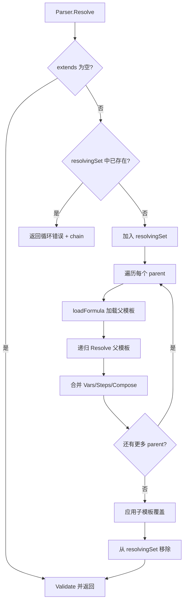
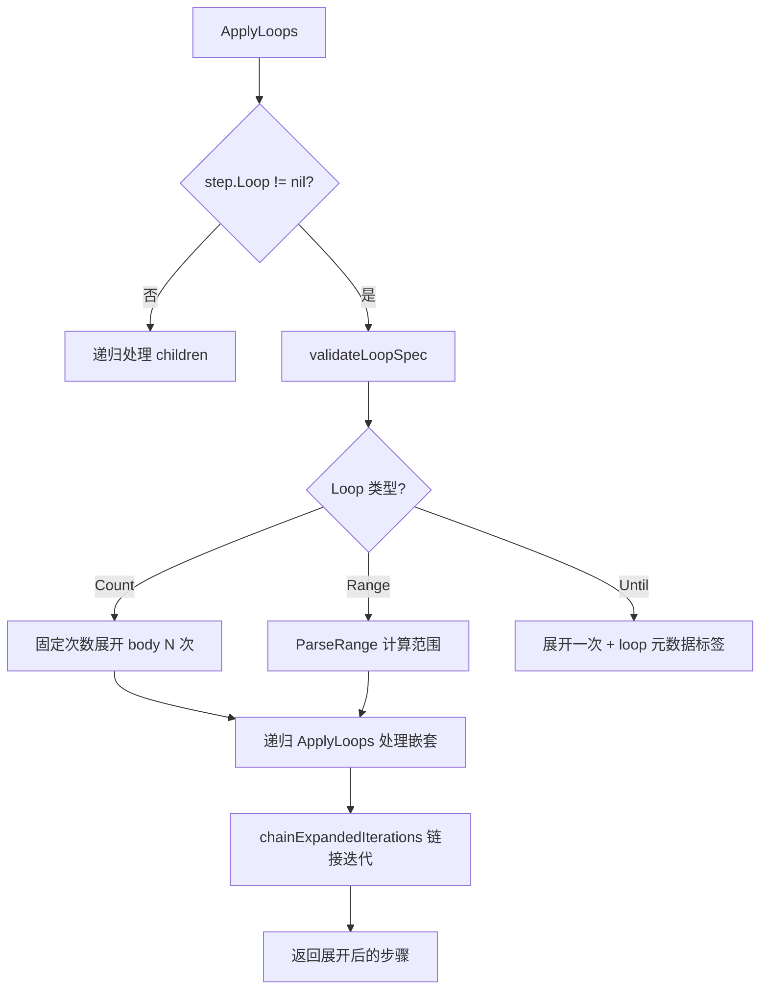
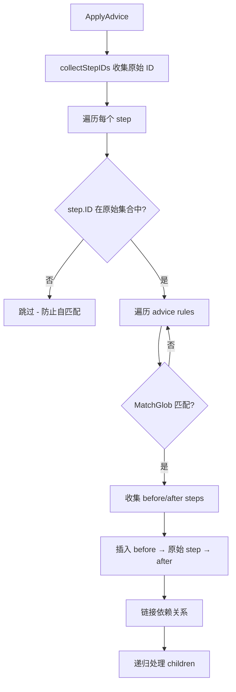

# PD-327.01 beads — Formula 声明式工作流模板引擎

> 文档编号：PD-327.01
> 来源：beads `internal/formula/`
> GitHub：https://github.com/steveyegge/beads.git
> 问题域：PD-327 工作流模板引擎 Workflow Template Engine
> 状态：可复用方案

---

## 第 1 章 问题与动机

### 1.1 核心问题

在 Agent 工程中，工作流的定义和执行是两个独立的关注点。硬编码的工作流难以复用、难以组合、难以测试。当团队需要在不同项目中复用相似的工作流模式（如"设计→实现→测试→部署"），或者需要在运行时根据条件动态调整工作流结构时，缺乏一个声明式的模板系统来描述工作流的结构和行为。

核心挑战包括：
- **模板复用**：如何让工作流模板支持继承和组合，避免重复定义
- **动态展开**：如何在编译时根据变量和条件展开循环、条件分支
- **横切关注点**：如何将日志、审批、安全扫描等横切逻辑声明式地注入到任意工作流步骤
- **安全边界**：如何防止无限继承、无限展开等递归陷阱

### 1.2 beads 的解法概述

beads 的 Formula 系统是一个完整的工作流模板编译器，将声明式 TOML/JSON 模板编译为 issue 依赖图。核心设计：

1. **三类 Formula 类型**：`workflow`（标准工作流）、`expansion`（宏展开模板）、`aspect`（横切关注点），分别对应不同的模板用途 (`internal/formula/types.go:38-48`)
2. **多层继承 + 循环检测**：通过 `extends` 字段支持多父继承，Parser 内置 `resolvingSet` 追踪解析链防止循环 (`internal/formula/parser.go:160-172`)
3. **7 阶段编译管道**：继承解析 → 控制流展开 → Advice 注入 → 内联展开 → Compose 展开 → Aspect 应用 → 条件过滤 (`cmd/bd/cook.go:156-220`)
4. **深度限制安全阀**：`DefaultMaxExpansionDepth = 5` 防止递归展开失控 (`internal/formula/expand.go:26`)
5. **Source Tracing**：每个步骤记录来源 formula 和位置，支持调试和审计 (`internal/formula/parser.go:439-462`)

### 1.3 设计思想

| 设计原则 | 具体实现 | 理由 | 替代方案 |
|----------|----------|------|----------|
| 声明式优先 | TOML/JSON 定义工作流，不写代码 | 非程序员也能定义工作流 | 代码 DSL（如 Airflow Python） |
| 编译时展开 | 循环/条件在 cook 阶段静态展开 | 生成的依赖图可预览、可审计 | 运行时动态展开（不可预测） |
| AOP 横切注入 | Advice before/after/around + Pointcut 匹配 | 安全/日志等关注点与业务解耦 | 手动在每个步骤中添加 |
| 不可变转换 | 每个阶段返回新 slice，不修改输入 | 管道各阶段可独立测试 | 原地修改（难以调试） |
| 深度限制 | 展开深度硬限 5 层 | 防止模板递归炸弹 | 无限制（危险） |

---

## 第 2 章 源码实现分析

### 2.1 架构概览

Formula 系统的编译管道是一个 7 阶段的线性流水线，每个阶段接收步骤列表并输出新的步骤列表：

```
┌──────────────┐     ┌──────────────┐     ┌──────────────┐     ┌──────────────┐
│  ParseFile   │────→│   Resolve    │────→│ ApplyControl │────→│ ApplyAdvice  │
│ TOML/JSON→Go │     │  继承合并     │     │  Flow(循环/  │     │ before/after │
│              │     │  循环检测     │     │  分支/门控)  │     │  /around     │
└──────────────┘     └──────────────┘     └──────────────┘     └──────────────┘
                                                                      │
┌──────────────┐     ┌──────────────┐     ┌──────────────┐           │
│ cookFormula  │←────│ FilterSteps  │←────│ ApplyAspects │←──────────┘
│ ToSubgraph   │     │  ByCondition │     │ + Expansions │
│ Steps→Issues │     │  条件过滤     │     │  宏展开      │
└──────────────┘     └──────────────┘     └──────────────┘
```

### 2.2 核心实现

#### 2.2.1 继承解析与循环检测



对应源码 `internal/formula/parser.go:160-238`：

```go
func (p *Parser) Resolve(formula *Formula) (*Formula, error) {
    // 循环检测：resolvingSet 追踪当前解析链
    if p.resolvingSet[formula.Formula] {
        chain := append(p.resolvingChain, formula.Formula)
        return nil, fmt.Errorf("circular extends detected: %s",
            strings.Join(chain, " -> "))
    }
    p.resolvingSet[formula.Formula] = true
    p.resolvingChain = append(p.resolvingChain, formula.Formula)
    defer func() {
        delete(p.resolvingSet, formula.Formula)
        p.resolvingChain = p.resolvingChain[:len(p.resolvingChain)-1]
    }()

    // 多父继承：按顺序合并每个 parent
    merged := &Formula{...}
    for _, parentName := range formula.Extends {
        parent, err := p.loadFormula(parentName)
        parent, err = p.Resolve(parent) // 递归解析
        // 合并 vars（parent 先，child 覆盖）
        for name, varDef := range parent.Vars {
            if _, exists := merged.Vars[name]; !exists {
                merged.Vars[name] = varDef
            }
        }
        merged.Steps = append(merged.Steps, parent.Steps...)
        merged.Compose = mergeComposeRules(merged.Compose, parent.Compose)
    }
    // 子模板覆盖
    for name, varDef := range formula.Vars {
        merged.Vars[name] = varDef
    }
    merged.Steps = append(merged.Steps, formula.Steps...)
    return merged, nil
}
```

关键设计：`resolvingSet` + `resolvingChain` 的组合不仅检测循环，还能在错误消息中输出完整的继承链路径（如 `A -> B -> C -> A`），极大方便调试。

#### 2.2.2 循环展开与范围表达式



对应源码 `internal/formula/controlflow.go:110-210`：

```go
func expandLoopWithVars(step *Step, vars map[string]string) ([]*Step, error) {
    if step.Loop.Count > 0 {
        // 固定次数循环：展开 body N 次
        for i := 1; i <= step.Loop.Count; i++ {
            iterSteps, _ := expandLoopIteration(step, i, nil)
            result = append(result, iterSteps...)
        }
        // 先递归展开嵌套循环，再链接迭代
        result, _ = ApplyLoops(result)
        if step.Loop.Count > 1 {
            result = chainExpandedIterations(result, step.ID, step.Loop.Count)
        }
    } else if step.Loop.Range != "" {
        // 范围循环：解析表达式 "1..2^{disks}"
        rangeSpec, _ := ParseRange(step.Loop.Range, vars)
        for val := rangeSpec.Start; val <= rangeSpec.End; val++ {
            iterVars := map[string]string{}
            if step.Loop.Var != "" {
                iterVars[step.Loop.Var] = fmt.Sprintf("%d", val)
            }
            iterSteps, _ := expandLoopIteration(step, iterNum, iterVars)
            result = append(result, iterSteps...)
        }
    } else {
        // 条件循环：展开一次 + 运行时元数据
        iterSteps, _ := expandLoopIteration(step, 1, nil)
        loopMeta := map[string]interface{}{"until": step.Loop.Until, "max": step.Loop.Max}
        loopJSON, _ := json.Marshal(loopMeta)
        iterSteps[0].Labels = append(iterSteps[0].Labels,
            fmt.Sprintf("loop:%s", string(loopJSON)))
    }
    return result, nil
}
```

Range 表达式求值器 (`internal/formula/range.go:72-91`) 实现了完整的递归下降解析器，支持 `+ - * / ^` 运算符和括号，优先级正确处理。

#### 2.2.3 AOP Advice 注入



对应源码 `internal/formula/advice.go:62-155`：

```go
func ApplyAdvice(steps []*Step, advice []*AdviceRule) []*Step {
    // 关键：收集原始 step ID，防止 advice 匹配自己插入的步骤
    originalIDs := collectStepIDs(steps)
    return applyAdviceWithGuard(steps, advice, originalIDs)
}

func applyAdviceWithGuard(steps []*Step, advice []*AdviceRule,
    originalIDs map[string]bool) []*Step {
    for _, step := range steps {
        if !originalIDs[step.ID] { // 自匹配防护
            result = append(result, step)
            continue
        }
        var beforeSteps, afterSteps []*Step
        for _, rule := range advice {
            if !MatchGlob(rule.Target, step.ID) { continue }
            if rule.Before != nil {
                beforeSteps = append(beforeSteps, adviceStepToStep(rule.Before, step))
            }
            if rule.Around != nil {
                for _, as := range rule.Around.Before {
                    beforeSteps = append(beforeSteps, adviceStepToStep(as, step))
                }
            }
            // ... after 同理
        }
        // 插入顺序：before → original → after，自动链接依赖
        result = append(result, beforeSteps...)
        clonedStep := cloneStep(step)
        if len(beforeSteps) > 0 {
            clonedStep.Needs = appendUnique(clonedStep.Needs, beforeSteps[len(beforeSteps)-1].ID)
        }
        result = append(result, clonedStep)
        // after steps 链接...
    }
    return result
}
```

自匹配防护是关键设计：`originalIDs` 集合确保 advice 只匹配调用前已存在的步骤，避免 advice 插入的步骤被同一 advice 再次匹配导致无限递归。

### 2.3 实现细节

**变量系统双层设计**：Formula 支持两种变量语法：
- `{{var}}` — 模板变量，在 cook/pour 时替换（`internal/formula/parser.go:310`）
- `{target}` / `{var}` — 展开占位符，在 expand 阶段替换（`internal/formula/expand.go:255-273`）

**BondPoint 组合机制**：`ComposeRules` 中的 `BondPoints` 定义了命名的附着点，允许其他 formula 在指定位置（`after_step` 或 `before_step`）注入步骤。合并时按 ID 覆盖（`internal/formula/parser.go:284-295`）。

**Expand vs Map**：`ExpandRule` 针对单个目标步骤展开，`MapRule` 使用 glob 模式批量匹配展开。两者共享 `expandStep` 核心逻辑，但 Map 额外需要 `MatchGlob` 过滤（`internal/formula/expand.go:104-156`）。

**不可变转换保证**：每个转换阶段（ApplyLoops、ApplyAdvice、ApplyExpansions 等）都返回新的 `[]*Step` slice，通过 `cloneStep` / `cloneStepDeep` 确保不修改输入。这使得管道各阶段可以独立测试和组合。


---

## 第 3 章 迁移指南

### 3.1 迁移清单

**阶段 1：核心类型定义**
- [ ] 定义 `Formula` 根结构体（name, version, type, vars, steps, compose）
- [ ] 定义 `Step` 结构体（id, title, depends_on, needs, condition, children, loop）
- [ ] 定义 `VarDef` 变量定义（default, required, enum, pattern 约束）
- [ ] 实现 TOML + JSON 双格式解析器

**阶段 2：继承与变量系统**
- [ ] 实现 `Resolve` 多父继承合并（vars 子覆盖父，steps 追加）
- [ ] 实现循环检测（resolvingSet + resolvingChain）
- [ ] 实现 `{{var}}` 变量替换和 `ValidateVars` 约束校验
- [ ] 实现搜索路径优先级（项目级 > 用户级 > 全局级）

**阶段 3：控制流展开**
- [ ] 实现 `ApplyLoops`（固定次数 / Range 表达式 / 条件循环）
- [ ] 实现 `ApplyBranches`（fork-join 并行模式）
- [ ] 实现 `ApplyGates`（条件门控标签）
- [ ] 实现 Range 表达式求值器（递归下降解析 `+ - * / ^`）

**阶段 4：AOP 与展开**
- [ ] 实现 `ApplyAdvice`（before/after/around + 自匹配防护）
- [ ] 实现 `ApplyExpansions`（单目标 expand + 批量 map）
- [ ] 实现 `ApplyInlineExpansions`（步骤级内联展开）
- [ ] 实现 `MatchGlob` 模式匹配（exact / prefix.* / *.suffix）

**阶段 5：编译输出**
- [ ] 实现 `cookFormulaToSubgraph`（Steps → Issue 依赖图）
- [ ] 实现 Source Tracing（SourceFormula + SourceLocation 传播）
- [ ] 实现 compile-time / runtime 双模式

### 3.2 适配代码模板

以下是一个可运行的 Go 模板引擎核心骨架，提取了 beads 的关键设计模式：

```go
package workflow

import (
    "fmt"
    "strings"
)

// FormulaType 模板类型
type FormulaType string

const (
    TypeWorkflow  FormulaType = "workflow"
    TypeExpansion FormulaType = "expansion"
    TypeAspect    FormulaType = "aspect"
)

// Formula 工作流模板根结构
type Formula struct {
    Name    string                `json:"name"`
    Type    FormulaType           `json:"type"`
    Extends []string              `json:"extends,omitempty"`
    Vars    map[string]*VarDef    `json:"vars,omitempty"`
    Steps   []*Step               `json:"steps,omitempty"`
    Advice  []*AdviceRule         `json:"advice,omitempty"`
}

// Step 工作流步骤
type Step struct {
    ID          string   `json:"id"`
    Title       string   `json:"title"`
    DependsOn   []string `json:"depends_on,omitempty"`
    Condition   string   `json:"condition,omitempty"`
    Children    []*Step  `json:"children,omitempty"`
    SourceFrom  string   `json:"-"` // 来源追踪
}

// VarDef 变量定义（含约束）
type VarDef struct {
    Default  *string  `json:"default,omitempty"`
    Required bool     `json:"required,omitempty"`
    Enum     []string `json:"enum,omitempty"`
}

// Parser 模板解析器（含循环检测）
type Parser struct {
    searchPaths    []string
    cache          map[string]*Formula
    resolvingSet   map[string]bool   // 循环检测
    resolvingChain []string          // 错误链路
}

// Resolve 解析继承链（核心：循环检测 + 多父合并）
func (p *Parser) Resolve(f *Formula) (*Formula, error) {
    if p.resolvingSet[f.Name] {
        chain := append(p.resolvingChain, f.Name)
        return nil, fmt.Errorf("circular extends: %s",
            strings.Join(chain, " -> "))
    }
    p.resolvingSet[f.Name] = true
    p.resolvingChain = append(p.resolvingChain, f.Name)
    defer func() {
        delete(p.resolvingSet, f.Name)
        p.resolvingChain = p.resolvingChain[:len(p.resolvingChain)-1]
    }()

    if len(f.Extends) == 0 {
        return f, nil
    }

    merged := &Formula{Name: f.Name, Type: f.Type, Vars: make(map[string]*VarDef)}
    for _, parentName := range f.Extends {
        parent, err := p.Load(parentName)
        if err != nil { return nil, err }
        parent, err = p.Resolve(parent)
        if err != nil { return nil, err }
        // 合并：parent vars 先入，child 覆盖
        for k, v := range parent.Vars {
            if _, exists := merged.Vars[k]; !exists {
                merged.Vars[k] = v
            }
        }
        merged.Steps = append(merged.Steps, parent.Steps...)
    }
    // 子模板覆盖
    for k, v := range f.Vars { merged.Vars[k] = v }
    merged.Steps = append(merged.Steps, f.Steps...)
    return merged, nil
}
```

### 3.3 适用场景

| 场景 | 适用度 | 说明 |
|------|--------|------|
| CI/CD 流水线模板 | ⭐⭐⭐ | 继承 + 条件步骤天然适合多环境部署 |
| Agent 任务编排 | ⭐⭐⭐ | 声明式定义 Agent 工作流，支持动态展开 |
| 项目管理模板 | ⭐⭐⭐ | 标准化的 feature/bug/release 工作流 |
| 审批流程引擎 | ⭐⭐ | Gate 机制支持异步等待，但缺少复杂条件路由 |
| 数据处理管道 | ⭐⭐ | 循环展开适合批处理，但不支持流式处理 |
| 实时事件响应 | ⭐ | 编译时展开不适合需要运行时动态决策的场景 |

---

## 第 4 章 测试用例

基于 beads 真实函数签名编写的测试代码：

```go
package workflow_test

import (
    "testing"
    "github.com/stretchr/testify/assert"
    "github.com/stretchr/testify/require"
)

// TestResolveInheritance 测试多父继承合并
func TestResolveInheritance(t *testing.T) {
    parser := NewParser("/tmp/formulas")

    // 准备父模板
    parent := &Formula{
        Name: "base-workflow",
        Type: TypeWorkflow,
        Vars: map[string]*VarDef{
            "component": {Required: true},
        },
        Steps: []*Step{
            {ID: "design", Title: "Design {{component}}"},
            {ID: "implement", Title: "Implement {{component}}", DependsOn: []string{"design"}},
        },
    }
    parser.cache["base-workflow"] = parent

    // 子模板继承并扩展
    child := &Formula{
        Name:    "feature-workflow",
        Type:    TypeWorkflow,
        Extends: []string{"base-workflow"},
        Steps: []*Step{
            {ID: "test", Title: "Test {{component}}", DependsOn: []string{"implement"}},
        },
    }

    resolved, err := parser.Resolve(child)
    require.NoError(t, err)
    assert.Len(t, resolved.Steps, 3) // design + implement + test
    assert.Equal(t, "design", resolved.Steps[0].ID)
    assert.Equal(t, "test", resolved.Steps[2].ID)
}

// TestCircularInheritanceDetection 测试循环继承检测
func TestCircularInheritanceDetection(t *testing.T) {
    parser := NewParser()
    a := &Formula{Name: "A", Extends: []string{"B"}}
    b := &Formula{Name: "B", Extends: []string{"A"}}
    parser.cache["A"] = a
    parser.cache["B"] = b

    _, err := parser.Resolve(a)
    require.Error(t, err)
    assert.Contains(t, err.Error(), "circular extends detected")
    assert.Contains(t, err.Error(), "A -> B -> A")
}

// TestLoopExpansion 测试固定次数循环展开
func TestLoopExpansion(t *testing.T) {
    steps := []*Step{
        {
            ID: "review-loop",
            Loop: &LoopSpec{
                Count: 3,
                Body: []*Step{
                    {ID: "review", Title: "Review iteration"},
                    {ID: "fix", Title: "Fix issues", DependsOn: []string{"review"}},
                },
            },
        },
    }

    expanded, err := ApplyLoops(steps)
    require.NoError(t, err)
    assert.Len(t, expanded, 6) // 3 iterations × 2 steps
    // 验证迭代 ID 格式
    assert.Equal(t, "review-loop.iter1.review", expanded[0].ID)
    assert.Equal(t, "review-loop.iter1.fix", expanded[1].ID)
    // 验证迭代间链接
    assert.Contains(t, expanded[2].Needs, expanded[1].ID) // iter2 depends on iter1.fix
}

// TestAdviceSelfMatchPrevention 测试 Advice 自匹配防护
func TestAdviceSelfMatchPrevention(t *testing.T) {
    steps := []*Step{
        {ID: "implement", Title: "Implement feature"},
    }
    advice := []*AdviceRule{
        {
            Target: "*", // 匹配所有
            Before: &AdviceStep{ID: "log-{step.id}", Title: "Log before {step.id}"},
        },
    }

    result := ApplyAdvice(steps, advice)
    // 应该只有 2 个步骤：log-implement + implement
    // log-implement 不应被 advice 再次匹配
    assert.Len(t, result, 2)
    assert.Equal(t, "log-implement", result[0].ID)
    assert.Equal(t, "implement", result[1].ID)
}

// TestExpansionDepthLimit 测试展开深度限制
func TestExpansionDepthLimit(t *testing.T) {
    // 构造深度超过 5 层的嵌套模板
    target := &Step{ID: "root", Title: "Root"}
    template := []*Step{
        {
            ID: "level",
            Children: []*Step{
                {ID: "nested", Children: []*Step{
                    {ID: "deep", Children: []*Step{
                        {ID: "deeper", Children: []*Step{
                            {ID: "deepest", Children: []*Step{
                                {ID: "overflow"},
                            }},
                        }},
                    }},
                }},
            },
        },
    }

    _, err := expandStep(target, template, 0, nil)
    require.Error(t, err)
    assert.Contains(t, err.Error(), "expansion depth limit exceeded")
}

// TestStepConditionEvaluation 测试条件步骤过滤
func TestStepConditionEvaluation(t *testing.T) {
    tests := []struct {
        condition string
        vars      map[string]string
        expected  bool
    }{
        {"", nil, true},                                    // 空条件 = 始终包含
        {"{{debug}}", map[string]string{"debug": "true"}, true},
        {"{{debug}}", map[string]string{"debug": "false"}, false},
        {"!{{debug}}", map[string]string{"debug": "true"}, false},
        {"{{env}} == prod", map[string]string{"env": "prod"}, true},
        {"{{env}} != prod", map[string]string{"env": "staging"}, true},
    }

    for _, tt := range tests {
        result, err := EvaluateStepCondition(tt.condition, tt.vars)
        require.NoError(t, err)
        assert.Equal(t, tt.expected, result, "condition: %s", tt.condition)
    }
}
```


---

## 第 5 章 跨域关联

| 关联域 | 关系类型 | 说明 |
|--------|----------|------|
| PD-02 多 Agent 编排 | 协同 | Formula 的 Branch fork-join 模式可作为多 Agent 并行编排的声明式定义层 |
| PD-04 工具系统 | 协同 | Formula 步骤可通过 Expand 引用工具调用模板，工具注册表可作为 Formula 的 BondPoint 附着源 |
| PD-06 记忆持久化 | 依赖 | Formula 的 Source Tracing 需要持久化存储来追踪步骤来源；cook 的 persist 模式依赖 Dolt 数据库 |
| PD-09 Human-in-the-Loop | 协同 | Gate 机制（`gate.type: human`）天然支持人工审批节点，条件循环的 `until` 可等待人工确认 |
| PD-10 中间件管道 | 协同 | Formula 的 7 阶段编译管道本身就是中间件模式的实践；Advice 注入等同于中间件 Hook |
| PD-11 可观测性 | 协同 | SourceFormula + SourceLocation 提供步骤级来源追踪，可直接接入可观测性系统 |

---

## 第 6 章 来源文件索引

| 文件 | 行范围 | 关键实现 |
|------|--------|----------|
| `internal/formula/types.go` | L36-109 | Formula/Step/VarDef/ComposeRules 核心类型定义 |
| `internal/formula/types.go` | L179-255 | Step 结构体（含 Loop/Gate/OnComplete/Condition） |
| `internal/formula/types.go` | L271-301 | LoopSpec 循环定义（Count/Until/Range） |
| `internal/formula/types.go` | L371-400 | ComposeRules（BondPoints/Hooks/Expand/Map/Branch/Gate/Aspects） |
| `internal/formula/types.go` | L478-523 | AdviceRule/AdviceStep/AroundAdvice AOP 类型 |
| `internal/formula/types.go` | L526-643 | Formula.Validate 完整校验逻辑 |
| `internal/formula/parser.go` | L26-54 | Parser 结构体（cache + resolvingSet + resolvingChain） |
| `internal/formula/parser.go` | L78-120 | ParseFile 双格式解析 + 缓存 + Source Tracing |
| `internal/formula/parser.go` | L160-238 | Resolve 多父继承 + 循环检测 |
| `internal/formula/parser.go` | L309-360 | 变量提取与替换（{{var}} 模式） |
| `internal/formula/parser.go` | L362-416 | ValidateVars 约束校验（required/enum/pattern） |
| `internal/formula/parser.go` | L439-462 | SetSourceInfo 递归设置来源追踪 |
| `internal/formula/expand.go` | L23-26 | DefaultMaxExpansionDepth = 5 安全阀 |
| `internal/formula/expand.go` | L34-164 | ApplyExpansions（expand + map 规则应用） |
| `internal/formula/expand.go` | L196-252 | expandStep 递归展开 + 深度检查 |
| `internal/formula/expand.go` | L333-365 | UpdateDependenciesForExpansion 依赖重写 |
| `internal/formula/expand.go` | L372-408 | propagateTargetDeps 根步骤依赖传播 |
| `internal/formula/expand.go` | L449-520 | ApplyInlineExpansions 步骤级内联展开 |
| `internal/formula/advice.go` | L20-53 | MatchGlob 四模式匹配（exact/prefix/suffix/all） |
| `internal/formula/advice.go` | L62-155 | ApplyAdvice + 自匹配防护 |
| `internal/formula/advice.go` | L252-292 | MatchPointcut/MatchAnyPointcut Aspect 匹配 |
| `internal/formula/controlflow.go` | L18-54 | ApplyLoops 循环展开入口 |
| `internal/formula/controlflow.go` | L110-210 | expandLoopWithVars 三类循环展开 |
| `internal/formula/controlflow.go` | L375-410 | chainExpandedIterations 迭代间依赖链接 |
| `internal/formula/controlflow.go` | L412-482 | ApplyBranches fork-join 依赖注入 |
| `internal/formula/controlflow.go` | L484-544 | ApplyGates 条件门控标签 |
| `internal/formula/controlflow.go` | L546-576 | ApplyControlFlow 统一入口（loops→branches→gates） |
| `internal/formula/stepcondition.go` | L31-82 | EvaluateStepCondition 四模式条件求值 |
| `internal/formula/stepcondition.go` | L109-153 | FilterStepsByCondition 递归条件过滤 |
| `internal/formula/range.go` | L34-70 | ParseRange 范围表达式解析 |
| `internal/formula/range.go` | L72-91 | EvaluateExpr 数学表达式求值 |
| `internal/formula/range.go` | L128-198 | tokenize 词法分析器 |
| `internal/formula/range.go` | L219-345 | 递归下降解析器（优先级：+- < */ < ^） |
| `cmd/bd/cook.go` | L156-220 | loadAndResolveFormula 7 阶段编译管道 |
| `cmd/bd/cook.go` | L424-477 | cookFormulaToSubgraph Steps→Issues 转换 |
| `cmd/bd/cook.go` | L520-564 | processStepToIssue 步骤→Issue 映射 |
| `cmd/bd/cook.go` | L574-646 | collectSteps 递归收集 + Gate 创建 |
| `cmd/bd/cook.go` | L877-942 | collectDependencies 依赖收集（depends_on/needs/waits_for） |

---

## 第 7 章 横向对比维度

```json comparison_data
{
  "project": "beads",
  "dimensions": {
    "模板格式": "TOML/JSON 双格式声明式模板，TOML 优先",
    "继承机制": "多父 extends 继承，resolvingSet 循环检测",
    "变量系统": "双层变量（{{var}} 模板变量 + {target} 展开占位符），支持 enum/pattern 约束",
    "控制流": "编译时展开：固定循环/Range 表达式/条件循环 + fork-join 分支",
    "AOP 支持": "完整 before/after/around Advice + Pointcut 匹配 + 自匹配防护",
    "组合机制": "BondPoint 命名附着点 + Hook 条件触发 + Expand/Map 宏展开",
    "安全边界": "展开深度硬限 5 层 + 循环继承检测 + 重复 ID 校验",
    "编译管道": "7 阶段不可变转换管道，每阶段返回新 slice"
  }
}
```

### 域元数据补充

```json domain_metadata
{
  "solution_summary": "beads 用 TOML/JSON 双格式声明式模板 + 7 阶段不可变编译管道（继承→控制流→AOP→展开→Aspect→条件过滤→Issue 图），将工作流模板编译为 issue 依赖图",
  "description": "声明式模板到依赖图的编译器设计，含 AOP 横切注入与安全深度限制",
  "sub_problems": [
    "Range 表达式求值（递归下降解析器支持 + - * / ^ 运算）",
    "展开后依赖重写（propagateTargetDeps 根步骤依赖传播）",
    "Gate 异步等待（gh:run/gh:pr/timer/human/mail 多类型门控）",
    "OnComplete 运行时展开（for-each 遍历步骤输出动态生成子工作流）"
  ],
  "best_practices": [
    "不可变转换管道：每阶段返回新 slice，不修改输入",
    "自匹配防护：Advice 只匹配调用前已存在的步骤 ID",
    "compile-time vs runtime 双模式：编译时保留占位符可预览，运行时替换变量",
    "resolvingChain 错误链路：循环检测不仅报错还输出完整继承路径"
  ]
}
```

