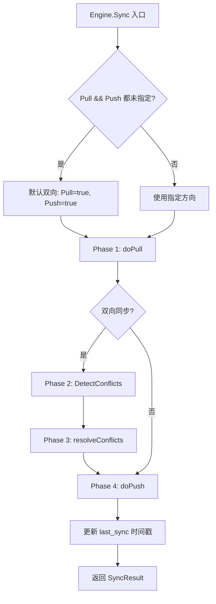
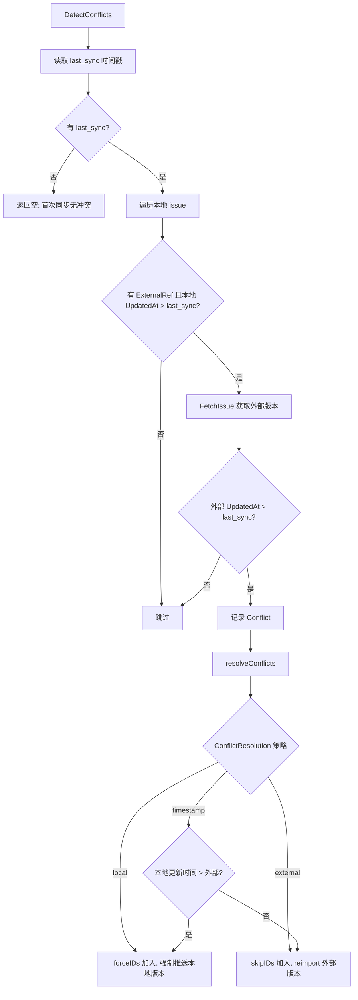
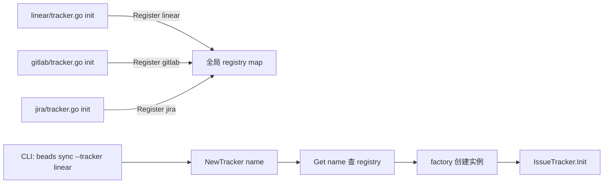

# PD-328.01 Beads — Pull-Detect-Resolve-Push 四阶段双向同步引擎

> 文档编号：PD-328.01
> 来源：Beads `internal/tracker/engine.go`, `internal/tracker/tracker.go`, `internal/tracker/registry.go`
> GitHub：https://github.com/steveyegge/beads.git
> 问题域：PD-328 外部系统双向同步 External System Bidirectional Sync
> 状态：可复用方案

---

## 第 1 章 问题与动机

### 1.1 核心问题

当本地系统（如 Beads issue tracker）需要与多个外部项目管理工具（Linear、GitLab、Jira）保持数据同步时，面临三大挑战：

1. **双向冲突**：同一 issue 在本地和外部同时被修改，谁的版本应该胜出？
2. **字段异构**：不同系统的优先级、状态、类型定义完全不同（Linear 用 0-4 表示优先级，Beads 也用 0-4 但语义相反）
3. **适配器膨胀**：每新增一个外部系统，同步逻辑就要重写一遍，Pull/Push/冲突检测代码大量重复

### 1.2 Beads 的解法概述

Beads 通过一个统一的 `SyncEngine` 实现 Pull→Detect→Resolve→Push 四阶段同步模式，将所有 tracker 适配器的共性逻辑抽取到引擎层：

1. **Plugin 接口隔离**：`IssueTracker`（12 方法）+ `FieldMapper`（8 方法）双接口定义适配器契约（`internal/tracker/tracker.go:13-89`）
2. **四阶段引擎**：`Engine.Sync()` 统一编排 Pull→Detect→Resolve→Push，适配器只需实现数据获取和字段转换（`internal/tracker/engine.go:96-186`）
3. **Hook 机制**：`PullHooks`（3 个钩子）+ `PushHooks`（5 个钩子）让适配器定制行为而不修改引擎（`internal/tracker/engine.go:22-65`）
4. **Registry 工厂**：`init()` 自注册 + `sync.RWMutex` 并发安全的全局注册表（`internal/tracker/registry.go:17-52`）
5. **三策略冲突解决**：timestamp（默认，新者胜）/ local（本地优先）/ external（外部优先）（`internal/tracker/engine.go:522-545`）

### 1.3 设计思想

| 设计原则 | 具体实现 | 理由 | 替代方案 |
|----------|----------|------|----------|
| 模板方法模式 | Engine 定义四阶段骨架，Hook 注入变化点 | 消除 Linear/GitLab/Jira 间 80% 重复代码 | 每个适配器独立实现完整同步（代码膨胀） |
| 双接口分离 | IssueTracker 管 CRUD，FieldMapper 管转换 | 字段映射逻辑独立可测，不污染 tracker 主逻辑 | 单一大接口（职责混杂） |
| 时间戳冲突检测 | last_sync 基准 + 双端 UpdatedAt 比较 | 简单可靠，无需向量时钟 | CRDT / 三路合并（复杂度过高） |
| init() 自注册 | 适配器包的 init() 调用 Register() | Go 惯用法，import 即注册，零配置 | 手动注册表（易遗漏） |
| Content-hash 去重 | PushHooks.ContentEqual 跳过无变化的 API 调用 | 减少外部 API 调用量，避免触发限流 | 每次都推送（浪费配额） |

---

## 第 2 章 源码实现分析

### 2.1 架构概览

Beads 的 tracker 同步系统由四层组成：

```
┌─────────────────────────────────────────────────────────┐
│                    CLI / API 调用层                       │
│              beads sync --tracker linear                 │
└──────────────────────┬──────────────────────────────────┘
                       │
┌──────────────────────▼──────────────────────────────────┐
│                   SyncEngine 引擎层                      │
│  Engine.Sync() → doPull() → DetectConflicts()           │
│                → resolveConflicts() → doPush()          │
│  PullHooks: GenerateID / TransformIssue / ShouldImport  │
│  PushHooks: FormatDescription / ContentEqual /          │
│             ShouldPush / BuildStateCache / ResolveState  │
└──────────────────────┬──────────────────────────────────┘
                       │
┌──────────────────────▼──────────────────────────────────┐
│              Plugin 接口层 (tracker.go)                   │
│  IssueTracker: Name/Init/Validate/Close/Fetch/Create/   │
│                Update/FieldMapper/IsExternalRef/...      │
│  FieldMapper:  PriorityToBeads/StatusToBeads/TypeToBeads │
│                IssueToBeads/IssueToTracker               │
└──────────────────────┬──────────────────────────────────┘
                       │
┌──────────────────────▼──────────────────────────────────┐
│              适配器实现层 (linear/ gitlab/ jira/)          │
│  linear.Tracker → GraphQL Client → Linear API           │
│  gitlab.Tracker → REST Client → GitLab API              │
│  jira.Tracker   → REST Client → Jira API                │
│  各自的 FieldMapper + MappingConfig                      │
└─────────────────────────────────────────────────────────┘
```

### 2.2 核心实现

#### 2.2.1 四阶段同步引擎



对应源码 `internal/tracker/engine.go:96-186`：

```go
func (e *Engine) Sync(ctx context.Context, opts SyncOptions) (*SyncResult, error) {
    ctx, span := syncTracer.Start(ctx, "tracker.sync",
        trace.WithAttributes(
            attribute.String("sync.tracker", e.Tracker.DisplayName()),
            attribute.Bool("sync.pull", opts.Pull || (!opts.Pull && !opts.Push)),
            attribute.Bool("sync.push", opts.Push || (!opts.Pull && !opts.Push)),
            attribute.Bool("sync.dry_run", opts.DryRun),
        ),
    )
    defer span.End()

    result := &SyncResult{Success: true}
    // Default to bidirectional if neither specified
    if !opts.Pull && !opts.Push {
        opts.Pull = true
        opts.Push = true
    }
    // Track IDs to skip/force during push based on conflict resolution
    skipPushIDs := make(map[string]bool)
    forcePushIDs := make(map[string]bool)

    // Phase 1: Pull
    if opts.Pull {
        pullStats, err := e.doPull(ctx, opts)
        // ...
    }
    // Phase 2: Detect conflicts (only for bidirectional sync)
    if opts.Pull && opts.Push {
        conflicts, err := e.DetectConflicts(ctx)
        if len(conflicts) > 0 {
            e.resolveConflicts(ctx, opts, conflicts, skipPushIDs, forcePushIDs)
        }
    }
    // Phase 3: Push
    if opts.Push {
        pushStats, err := e.doPush(ctx, opts, skipPushIDs, forcePushIDs)
        // ...
    }
    // Update last_sync timestamp
    if !opts.DryRun {
        lastSync := now.Format(time.RFC3339)
        key := e.Tracker.ConfigPrefix() + ".last_sync"
        e.Store.SetConfig(ctx, key, lastSync)
    }
    return result, nil
}
```

#### 2.2.2 冲突检测与解决



对应源码 `internal/tracker/engine.go:190-252`（检测）和 `engine.go:522-545`（解决）：

```go
func (e *Engine) DetectConflicts(ctx context.Context) ([]Conflict, error) {
    // Get last sync time
    key := e.Tracker.ConfigPrefix() + ".last_sync"
    lastSyncStr, err := e.Store.GetConfig(ctx, key)
    if err != nil || lastSyncStr == "" {
        return nil, nil // No previous sync, no conflicts possible
    }
    lastSync, _ := time.Parse(time.RFC3339, lastSyncStr)

    issues, _ := e.Store.SearchIssues(ctx, "", types.IssueFilter{})
    var conflicts []Conflict
    for _, issue := range issues {
        extRef := derefStr(issue.ExternalRef)
        if extRef == "" || !e.Tracker.IsExternalRef(extRef) { continue }
        if issue.UpdatedAt.Before(lastSync) || issue.UpdatedAt.Equal(lastSync) { continue }
        extIssue, _ := e.Tracker.FetchIssue(ctx, e.Tracker.ExtractIdentifier(extRef))
        if extIssue != nil && extIssue.UpdatedAt.After(lastSync) {
            conflicts = append(conflicts, Conflict{
                IssueID: issue.ID, LocalUpdated: issue.UpdatedAt,
                ExternalUpdated: extIssue.UpdatedAt, ExternalRef: extRef,
            })
        }
    }
    return conflicts, nil
}

func (e *Engine) resolveConflicts(ctx context.Context, opts SyncOptions,
    conflicts []Conflict, skipIDs, forceIDs map[string]bool) {
    for _, c := range conflicts {
        switch opts.ConflictResolution {
        case ConflictLocal:
            forceIDs[c.IssueID] = true
        case ConflictExternal:
            skipIDs[c.IssueID] = true
            e.reimportIssue(ctx, c)
        default: // ConflictTimestamp
            if c.LocalUpdated.After(c.ExternalUpdated) {
                forceIDs[c.IssueID] = true
            } else {
                skipIDs[c.IssueID] = true
                e.reimportIssue(ctx, c)
            }
        }
    }
}
```

#### 2.2.3 Plugin 注册与工厂



对应源码 `internal/tracker/registry.go:17-52`：

```go
var (
    registryMu sync.RWMutex
    registry   = make(map[string]TrackerFactory)
)

func Register(name string, factory TrackerFactory) {
    registryMu.Lock()
    defer registryMu.Unlock()
    registry[name] = factory
}

func NewTracker(name string) (IssueTracker, error) {
    factory := Get(name)
    if factory == nil {
        return nil, fmt.Errorf("tracker %q not registered; available: %v", name, List())
    }
    return factory(), nil
}
```

适配器自注册示例 `internal/linear/tracker.go:14-18`：

```go
func init() {
    tracker.Register("linear", func() tracker.IssueTracker {
        return &Tracker{}
    })
}
```

### 2.3 实现细节

#### Hook 机制：Pull 阶段的三个钩子

`PullHooks` 定义在 `internal/tracker/engine.go:22-38`，在 `doPull()` 的不同阶段被调用：

| 钩子 | 调用时机 | 用途 | 示例 |
|------|----------|------|------|
| `ShouldImport` | FieldMapper 转换前 | 过滤不需要导入的 issue | Linear 按前缀过滤 |
| `TransformIssue` | FieldMapper 转换后、存储前 | 描述格式化、字段规范化 | 合并 AcceptanceCriteria/Design/Notes 到 Description |
| `GenerateID` | TransformIssue 后、存储前 | 生成 hash-based ID 避免碰撞 | `idgen.GenerateHashID(prefix, title, desc, creator, time, length, nonce)` |

#### Hook 机制：Push 阶段的五个钩子

`PushHooks` 定义在 `internal/tracker/engine.go:42-65`：

| 钩子 | 调用时机 | 用途 | 示例 |
|------|----------|------|------|
| `ShouldPush` | 类型/状态过滤后 | 自定义推送过滤 | 按 ID 前缀排除 |
| `FormatDescription` | 推送前 | 格式化描述（不修改本地数据） | `BuildLinearDescription()` 合并结构化字段 |
| `ContentEqual` | 推送前 | 内容比较跳过无变化推送 | 标题+描述 hash 比较 |
| `BuildStateCache` | Push 循环前调用一次 | 预缓存工作流状态映射 | 一次 API 调用获取所有 Linear workflow states |
| `ResolveState` | 每个 issue 推送时 | 用缓存解析状态 ID | `cache[status] → stateID` |

#### 增量同步

`doPull()` 通过 `FetchOptions.Since` 实现增量同步（`engine.go:266-277`）：读取 `{tracker}.last_sync` 配置，传给 `FetchIssues(ctx, FetchOptions{Since: &t})`，外部 tracker 只返回该时间之后更新的 issue。

#### 冲突感知的 Pull 保护

`doPull()` 在更新已有 issue 时检查本地修改时间（`engine.go:335-338`）：如果本地 issue 在 last_sync 之后被修改过，跳过更新，留给 Phase 2 冲突检测处理。这防止 Pull 阶段静默覆盖本地变更。

#### OTel 可观测性

每个阶段（sync/pull/push/detect_conflicts）都创建 OTel span，记录 tracker 名称、dry_run 标志、各项统计数据（`engine.go:97-105, 256-262, 390-396`）。

---

## 第 3 章 迁移指南

### 3.1 迁移清单

**阶段 1：定义接口层**
- [ ] 定义 `IssueTracker` 接口（至少包含 Name/Init/FetchIssues/FetchIssue/CreateIssue/UpdateIssue/FieldMapper）
- [ ] 定义 `FieldMapper` 接口（至少包含双向 Priority/Status/Type 转换 + IssueToLocal/IssueToRemote）
- [ ] 定义中间类型 `TrackerIssue`（通用的外部 issue 表示）

**阶段 2：实现同步引擎**
- [ ] 实现 `Engine.Sync()` 四阶段骨架
- [ ] 实现 `doPull()` 含增量同步 + 冲突感知保护
- [ ] 实现 `DetectConflicts()` 基于 last_sync 时间戳
- [ ] 实现 `resolveConflicts()` 三策略分发
- [ ] 实现 `doPush()` 含 ContentEqual 去重

**阶段 3：实现适配器**
- [ ] 实现第一个适配器（如 Linear），包含 FieldMapper
- [ ] 实现 Registry 自注册机制
- [ ] 配置化字段映射（MappingConfig）

**阶段 4：Hook 定制**
- [ ] 按需实现 PullHooks（ShouldImport/TransformIssue/GenerateID）
- [ ] 按需实现 PushHooks（FormatDescription/ContentEqual/BuildStateCache）

### 3.2 适配代码模板

以下是一个可运行的 Go 同步引擎骨架：

```go
package sync

import (
    "context"
    "fmt"
    "sync"
    "time"
)

// --- 接口层 ---

type ExternalIssue struct {
    ID          string
    Identifier  string
    Title       string
    Description string
    Priority    int
    State       interface{}
    UpdatedAt   time.Time
    Raw         interface{}
}

type FetchOptions struct {
    Since *time.Time
    State string
}

type FieldMapper interface {
    PriorityToLocal(externalPriority interface{}) int
    PriorityToExternal(localPriority int) interface{}
    StatusToLocal(externalState interface{}) string
    StatusToExternal(localStatus string) interface{}
    IssueToLocal(ext *ExternalIssue) *LocalIssue
    IssueToExternal(local *LocalIssue) map[string]interface{}
}

type Tracker interface {
    Name() string
    Init(ctx context.Context) error
    FetchIssues(ctx context.Context, opts FetchOptions) ([]ExternalIssue, error)
    FetchIssue(ctx context.Context, id string) (*ExternalIssue, error)
    CreateIssue(ctx context.Context, issue *LocalIssue) (*ExternalIssue, error)
    UpdateIssue(ctx context.Context, extID string, issue *LocalIssue) error
    FieldMapper() FieldMapper
    IsExternalRef(ref string) bool
    ExtractIdentifier(ref string) string
    BuildExternalRef(issue *ExternalIssue) string
}

// --- Registry ---

type TrackerFactory func() Tracker

var (
    registryMu sync.RWMutex
    registry   = make(map[string]TrackerFactory)
)

func Register(name string, factory TrackerFactory) {
    registryMu.Lock()
    defer registryMu.Unlock()
    registry[name] = factory
}

func NewTracker(name string) (Tracker, error) {
    registryMu.RLock()
    defer registryMu.RUnlock()
    factory, ok := registry[name]
    if !ok {
        return nil, fmt.Errorf("tracker %q not registered", name)
    }
    return factory(), nil
}

// --- 同步引擎 ---

type ConflictStrategy string
const (
    ConflictTimestamp ConflictStrategy = "timestamp"
    ConflictLocal    ConflictStrategy = "local"
    ConflictExternal ConflictStrategy = "external"
)

type SyncOptions struct {
    Pull, Push, DryRun bool
    ConflictResolution ConflictStrategy
}

type Engine struct {
    Tracker Tracker
    Store   LocalStore // 你的本地存储接口
}

func (e *Engine) Sync(ctx context.Context, opts SyncOptions) error {
    if !opts.Pull && !opts.Push {
        opts.Pull, opts.Push = true, true
    }
    skipIDs := make(map[string]bool)
    forceIDs := make(map[string]bool)

    if opts.Pull {
        if err := e.doPull(ctx, opts); err != nil {
            return fmt.Errorf("pull: %w", err)
        }
    }
    if opts.Pull && opts.Push {
        conflicts := e.detectConflicts(ctx)
        e.resolveConflicts(opts, conflicts, skipIDs, forceIDs)
    }
    if opts.Push {
        if err := e.doPush(ctx, opts, skipIDs, forceIDs); err != nil {
            return fmt.Errorf("push: %w", err)
        }
    }
    return nil
}
```

### 3.3 适用场景

| 场景 | 适用度 | 说明 |
|------|--------|------|
| 本地 issue tracker 同步到 Linear/Jira/GitLab | ⭐⭐⭐ | 完美匹配，直接复用四阶段模式 |
| CRM 数据双向同步 | ⭐⭐⭐ | 替换 IssueTracker 为 CRM 接口即可 |
| 配置中心多源同步 | ⭐⭐ | 冲突检测逻辑可复用，但字段映射较简单 |
| 实时事件流同步 | ⭐ | 不适合，本方案是批量拉取模式，非事件驱动 |
| 单向数据导入 | ⭐⭐ | 可以只用 Pull 阶段，但方案偏重 |

---

## 第 4 章 测试用例

基于 Beads 真实测试模式（`internal/tracker/engine_test.go`），以下是可运行的测试骨架：

```go
package sync_test

import (
    "context"
    "testing"
    "time"
)

// mockTracker 实现 Tracker 接口用于测试
type mockTracker struct {
    issues  []ExternalIssue
    created []*LocalIssue
    updated map[string]*LocalIssue
}

func newMockTracker() *mockTracker {
    return &mockTracker{updated: make(map[string]*LocalIssue)}
}

func (m *mockTracker) FetchIssues(_ context.Context, _ FetchOptions) ([]ExternalIssue, error) {
    return m.issues, nil
}

// TestPullOnly 验证单向拉取创建本地 issue
func TestPullOnly(t *testing.T) {
    tracker := newMockTracker()
    tracker.issues = []ExternalIssue{
        {ID: "1", Identifier: "EXT-1", Title: "First", UpdatedAt: time.Now()},
        {ID: "2", Identifier: "EXT-2", Title: "Second", UpdatedAt: time.Now()},
    }
    engine := &Engine{Tracker: tracker, Store: newMockStore()}
    err := engine.Sync(context.Background(), SyncOptions{Pull: true})
    if err != nil {
        t.Fatalf("Sync error: %v", err)
    }
    // 验证创建了 2 个本地 issue
}

// TestConflictDetection 验证双端修改被检测为冲突
func TestConflictDetection(t *testing.T) {
    lastSync := time.Now().Add(-1 * time.Hour)
    // 本地 issue 在 last_sync 后被修改
    // 外部 issue 也在 last_sync 后被修改
    // 期望检测到 1 个冲突
}

// TestConflictResolutionTimestamp 验证 timestamp 策略选择更新的版本
func TestConflictResolutionTimestamp(t *testing.T) {
    // 本地修改时间 30 分钟前，外部修改时间 15 分钟前
    // timestamp 策略应选择外部版本（更新）
}

// TestDryRun 验证 dry-run 不实际写入
func TestDryRun(t *testing.T) {
    tracker := newMockTracker()
    tracker.issues = []ExternalIssue{
        {ID: "1", Identifier: "EXT-1", Title: "Issue", UpdatedAt: time.Now()},
    }
    engine := &Engine{Tracker: tracker, Store: newMockStore()}
    engine.Sync(context.Background(), SyncOptions{Pull: true, DryRun: true})
    // 验证 store 中没有新 issue
}

// TestPullHookShouldImport 验证 ShouldImport 钩子过滤
func TestPullHookShouldImport(t *testing.T) {
    // 设置 ShouldImport 过滤标题含 "Skip" 的 issue
    // 3 个外部 issue，1 个被过滤
    // 期望创建 2 个，跳过 1 个
}

// TestPushHookContentEqual 验证内容相同时跳过推送
func TestPushHookContentEqual(t *testing.T) {
    // 本地和外部标题相同
    // ContentEqual 返回 true
    // 期望 Updated=0，不调用 UpdateIssue
}
```

---

## 第 5 章 跨域关联

| 关联域 | 关系类型 | 说明 |
|--------|----------|------|
| PD-04 工具系统 | 协同 | IssueTracker 接口 + Registry 模式与 Tool System 的插件注册机制同构，可共享 Registry 实现 |
| PD-06 记忆持久化 | 依赖 | 同步引擎依赖 `storage.Storage` 持久化 issue 和 last_sync 时间戳，Beads 使用 Dolt（版本化 SQL 数据库） |
| PD-03 容错与重试 | 协同 | doPull/doPush 中的错误处理采用 warn-and-continue 模式（单个 issue 失败不中断整体同步），可叠加指数退避重试 |
| PD-11 可观测性 | 协同 | 每个同步阶段创建 OTel span，记录 tracker 名称、统计数据、错误信息，与 Beads 全链路追踪体系集成 |
| PD-10 中间件管道 | 协同 | PullHooks/PushHooks 本质是轻量级中间件管道，ShouldImport→TransformIssue→GenerateID 形成 Pull 管道 |
| PD-09 Human-in-the-Loop | 协同 | DryRun 模式让用户预览同步结果后再决定是否执行，冲突解决策略也可扩展为交互式选择 |

---

## 第 6 章 来源文件索引

| 文件 | 行范围 | 关键实现 |
|------|--------|----------|
| `internal/tracker/tracker.go` | L10-L89 | IssueTracker（12 方法）+ FieldMapper（8 方法）双接口定义 |
| `internal/tracker/engine.go` | L22-L65 | PullHooks（3 钩子）+ PushHooks（5 钩子）定义 |
| `internal/tracker/engine.go` | L67-L93 | Engine 结构体 + NewEngine 构造函数 |
| `internal/tracker/engine.go` | L96-L186 | Sync() 四阶段主流程：Pull→Detect→Resolve→Push |
| `internal/tracker/engine.go` | L190-L252 | DetectConflicts() 基于 last_sync 的冲突检测 |
| `internal/tracker/engine.go` | L255-L386 | doPull() 增量同步 + 冲突感知保护 + Hook 调用链 |
| `internal/tracker/engine.go` | L389-L519 | doPush() 含 ContentEqual 去重 + StateCache 预缓存 |
| `internal/tracker/engine.go` | L522-L545 | resolveConflicts() 三策略冲突解决 |
| `internal/tracker/engine.go` | L548-L575 | reimportIssue() 外部版本重导入 |
| `internal/tracker/registry.go` | L9-L52 | 全局 Registry：Register/Get/List/NewTracker |
| `internal/tracker/types.go` | L17-L160 | TrackerIssue/FetchOptions/SyncOptions/Conflict/ConflictResolution 类型定义 |
| `internal/linear/tracker.go` | L14-L18 | init() 自注册到全局 Registry |
| `internal/linear/tracker.go` | L33-L60 | Linear Tracker.Init() 配置加载（API Key + Team ID + 环境变量降级） |
| `internal/linear/fieldmapper.go` | L1-L85 | linearFieldMapper 实现 FieldMapper 接口 |
| `internal/linear/mapping.go` | L122-L239 | MappingConfig 可配置字段映射 + LoadMappingConfig 从存储加载 |
| `internal/linear/mapping.go` | L391-L492 | IssueToBeads() 完整转换含依赖关系提取 |
| `internal/tracker/engine_test.go` | L173-L752 | 10 个测试用例覆盖 Pull/Push/DryRun/Hooks/Conflicts |

---

## 第 7 章 横向对比维度

```json comparison_data
{
  "project": "Beads",
  "dimensions": {
    "同步模式": "Pull-Detect-Resolve-Push 四阶段批量同步，默认双向",
    "冲突检测": "last_sync 时间戳基准 + 双端 UpdatedAt 比较",
    "冲突解决": "三策略可选：timestamp（新者胜）/ local / external",
    "适配器架构": "IssueTracker + FieldMapper 双接口 + init() 自注册 Registry",
    "字段映射": "MappingConfig 可配置映射表，支持从存储层动态加载覆盖默认值",
    "Hook 定制": "PullHooks（3 钩子）+ PushHooks（5 钩子）注入变化点",
    "去重策略": "ContentEqual Hook 支持 content-hash 比较跳过无变化推送",
    "可观测性": "OTel span 覆盖每个同步阶段，记录统计数据和错误"
  }
}
```

### 域元数据补充

```json domain_metadata
{
  "solution_summary": "Beads 用 SyncEngine 四阶段模式（Pull→Detect→Resolve→Push）+ IssueTracker/FieldMapper 双接口 + 8 个 Hook 钩子实现 Linear/GitLab/Jira 三系统双向同步",
  "description": "批量拉取模式下的双向同步引擎设计，含 Hook 机制和可配置字段映射",
  "sub_problems": [
    "Hook 机制定制同步行为的粒度控制",
    "工作流状态预缓存避免 N+1 API 调用",
    "依赖关系的延迟创建（所有 issue 导入后再建立关联）"
  ],
  "best_practices": [
    "Pull 阶段冲突感知保护：跳过 last_sync 后本地修改的 issue，留给冲突检测处理",
    "FormatDescription Hook 操作副本不修改本地数据，保证本地数据完整性",
    "MappingConfig 从存储层动态加载覆盖默认映射，支持运行时自定义"
  ]
}
```
