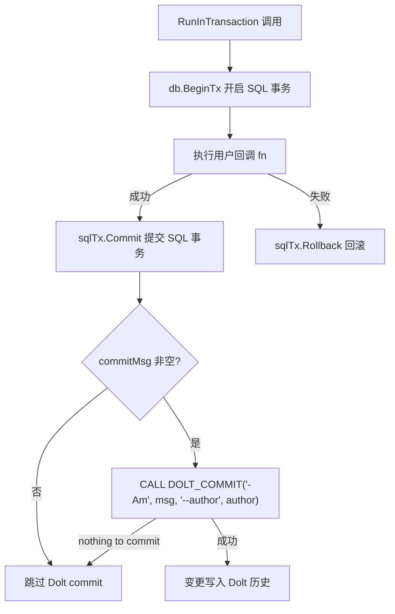
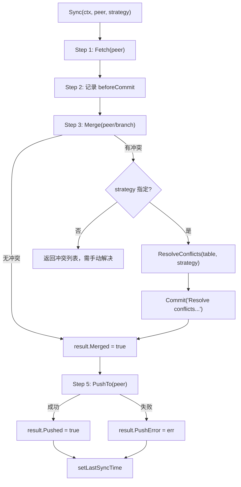

# PD-329.01 beads — Dolt 版本控制数据库与 Federation 同步

> 文档编号：PD-329.01
> 来源：beads `internal/storage/dolt/`, `internal/doltserver/`
> GitHub：https://github.com/steveyegge/beads.git
> 问题域：PD-329 版本控制数据库 Version-Controlled Database
> 状态：可复用方案

---

## 第 1 章 问题与动机

### 1.1 核心问题

传统数据库（SQLite、PostgreSQL）只存储当前状态，缺乏原生的变更历史追踪能力。对于 Agent 工程系统，这带来三个关键痛点：

1. **变更不可追溯**：Agent 对数据的修改无法回溯到具体时间点，出错后难以定位和恢复
2. **多实例同步困难**：多个 Agent 实例或多个部署环境之间的数据同步需要自建复杂的同步协议
3. **数据主权模糊**：在分布式部署中，不同节点的数据敏感度不同，缺乏原生的分级控制机制

Beads 选择 Dolt（"Git for Data"）作为存储后端，将版本控制语义直接嵌入数据库层，从根本上解决这三个问题。

### 1.2 beads 的解法概述

1. **SQL + Git 语义统一**：通过 Dolt 的 MySQL 协议接口，所有 CRUD 操作使用标准 SQL，版本控制操作通过 `DOLT_COMMIT`、`DOLT_PUSH`、`DOLT_PULL` 等存储过程完成（`internal/storage/dolt/store.go:966`）
2. **Server 模式 + 自动启动**：DoltStore 连接到 `dolt sql-server` 进程，支持透明的自动启动和空闲监控（`internal/doltserver/doltserver.go:347-370`）
3. **Federation 双向同步**：通过 Dolt remote 实现 peer-to-peer 同步，支持 fetch → merge → push 全流程，含冲突自动解决（`internal/storage/dolt/federation.go:157-227`）
4. **Sovereignty 四级分控**：T1（公开）到 T4（匿名）四级数据主权控制，每个 peer 绑定 sovereignty 级别（`internal/config/sync.go:128-148`）
5. **事务 + 自动 Commit**：每次写操作包裹在 SQL 事务中，事务提交后自动创建 Dolt commit，保留完整变更历史（`internal/storage/dolt/transaction.go:40-89`）

### 1.3 设计思想

| 设计原则 | 具体实现 | 理由 | 替代方案 |
|----------|----------|------|----------|
| 数据即版本 | 每次写操作自动 DOLT_COMMIT | 无需额外审计表，Dolt 原生提供完整历史 | 手动触发 commit / 审计日志表 |
| 纯 Go 无 CGO | Server 模式通过 MySQL 协议连接 | 跨平台编译简单，无 C 依赖 | Embedded 模式（需 CGO） |
| 确定性端口 | FNV hash(path) → 13307-14306 | 同一项目总是同一端口，避免端口冲突 | 随机端口 / 固定端口 |
| 凭证加密存储 | AES-256-GCM 加密 peer 密码 | 数据库中不存明文密码 | 系统 keyring / 外部密钥管理 |
| 冲突策略可配 | ours/theirs/manual 三种策略 | 不同场景需要不同的冲突解决方式 | 仅支持手动解决 |

---

## 第 2 章 源码实现分析

### 2.1 架构概览

Beads 的 Dolt 存储层由三个核心模块组成：

```
┌─────────────────────────────────────────────────────────────────┐
│                        bd CLI Commands                          │
├─────────────────────────────────────────────────────────────────┤
│                                                                 │
│  ┌──────────────┐   ┌──────────────┐   ┌──────────────────┐   │
│  │  DoltStore   │   │  Federation  │   │   DoltServer     │   │
│  │  (store.go)  │   │(federation.go│   │ (doltserver.go)  │   │
│  │              │   │ credentials  │   │                  │   │
│  │ - CRUD ops   │   │  .go)        │   │ - Auto-start     │   │
│  │ - Commit     │   │              │   │ - Idle monitor   │   │
│  │ - Push/Pull  │   │ - PushTo     │   │ - Port derive    │   │
│  │ - Branch     │   │ - PullFrom   │   │ - Process mgmt   │   │
│  │ - History    │   │ - Sync       │   │                  │   │
│  │ - Diff       │   │ - Credentials│   │                  │   │
│  └──────┬───────┘   └──────┬───────┘   └────────┬─────────┘   │
│         │                  │                     │             │
│         └──────────────────┼─────────────────────┘             │
│                            │                                   │
│                    MySQL Protocol (TCP)                         │
│                            │                                   │
├────────────────────────────┼───────────────────────────────────┤
│                   dolt sql-server                               │
│              (版本控制 SQL 数据库引擎)                            │
│                                                                 │
│  ┌─────────┐  ┌──────────┐  ┌──────────┐  ┌───────────────┐   │
│  │ issues  │  │ labels   │  │ events   │  │ federation_   │   │
│  │         │  │          │  │          │  │ peers         │   │
│  └─────────┘  └──────────┘  └──────────┘  └───────────────┘   │
│                                                                 │
│  dolt_history_*  dolt_diff()  dolt_status  dolt_conflicts      │
└─────────────────────────────────────────────────────────────────┘
```

### 2.2 核心实现

#### 2.2.1 事务 + 自动 Dolt Commit



对应源码 `internal/storage/dolt/transaction.go:40-89`：

```go
func (s *DoltStore) RunInTransaction(ctx context.Context, commitMsg string, fn func(tx storage.Transaction) error) error {
	return s.withRetry(ctx, func() error {
		return s.runDoltTransaction(ctx, commitMsg, fn)
	})
}

func (s *DoltStore) runDoltTransaction(ctx context.Context, commitMsg string, fn func(tx storage.Transaction) error) error {
	sqlTx, err := s.db.BeginTx(ctx, nil)
	if err != nil {
		return fmt.Errorf("failed to begin transaction: %w", err)
	}
	tx := &doltTransaction{tx: sqlTx, store: s}
	defer func() {
		if r := recover(); r != nil {
			_ = sqlTx.Rollback()
			panic(r)
		}
	}()
	if err := fn(tx); err != nil {
		_ = sqlTx.Rollback()
		return err
	}
	// SQL commit first, then Dolt commit outside transaction
	if err := sqlTx.Commit(); err != nil {
		return fmt.Errorf("sql commit: %w", err)
	}
	if commitMsg != "" {
		_, err := s.db.ExecContext(ctx, "CALL DOLT_COMMIT('-Am', ?, '--author', ?)",
			commitMsg, s.commitAuthorString())
		if err != nil && !isDoltNothingToCommit(err) {
			return fmt.Errorf("dolt commit: %w", err)
		}
	}
	return nil
}
```

关键设计：SQL 事务先提交（确保 wisp 等 dolt-ignored 表的数据持久化），然后在事务外执行 `DOLT_COMMIT`。这解决了之前在事务内调用 `DOLT_COMMIT` 返回 "nothing to commit" 时导致 SQL 事务状态损坏的问题。

#### 2.2.2 Federation 双向同步



对应源码 `internal/storage/dolt/federation.go:157-227`：

```go
func (s *DoltStore) Sync(ctx context.Context, peer string, strategy string) (*SyncResult, error) {
	result := &SyncResult{Peer: peer, StartTime: time.Now()}

	// Step 1: Fetch
	if err := s.Fetch(ctx, peer); err != nil {
		result.Error = fmt.Errorf("fetch failed: %w", err)
		return result, result.Error
	}
	result.Fetched = true

	// Step 2-3: Merge peer's branch
	beforeCommit, _ := s.GetCurrentCommit(ctx)
	remoteBranch := fmt.Sprintf("%s/%s", peer, s.branch)
	conflicts, err := s.Merge(ctx, remoteBranch)
	if err != nil {
		result.Error = fmt.Errorf("merge failed: %w", err)
		return result, result.Error
	}

	// Step 4: Handle conflicts
	if len(conflicts) > 0 {
		result.Conflicts = conflicts
		if strategy == "" {
			result.Error = fmt.Errorf("merge conflicts require resolution")
			return result, result.Error
		}
		for _, c := range conflicts {
			if err := s.ResolveConflicts(ctx, c.Field, strategy); err != nil {
				result.Error = fmt.Errorf("conflict resolution failed: %w", err)
				return result, result.Error
			}
		}
		result.ConflictsResolved = true
		if err := s.Commit(ctx, fmt.Sprintf("Resolve conflicts from %s using %s strategy", peer, strategy)); err != nil {
			return result, err
		}
	}
	result.Merged = true

	// Step 5: Push
	if err := s.PushTo(ctx, peer); err != nil {
		result.PushError = err // Non-fatal
	} else {
		result.Pushed = true
	}
	_ = s.setLastSyncTime(ctx, peer)
	result.EndTime = time.Now()
	return result, nil
}
```

### 2.3 实现细节

#### Server 自动启动与端口派生

DoltServer 模块（`internal/doltserver/doltserver.go`）实现了透明的服务器生命周期管理：

- **端口派生**：`DerivePort()` 使用 FNV-32a hash 将项目路径映射到 13307-14306 端口范围（`doltserver.go:127-135`），确保同一项目总是使用同一端口
- **自动启动**：`EnsureRunning()` 检查服务器状态，未运行时自动启动（`doltserver.go:351-370`）
- **空闲监控**：独立的 idle monitor 进程每 60 秒检查活动时间戳，空闲 30 分钟后自动停止服务器（`doltserver.go:992-1030`）
- **端口回收**：`reclaimPort()` 识别端口占用者——如果是自己的 Dolt 进程则 adopt，如果是孤儿进程则 kill，如果是非 Dolt 进程则报错（`doltserver.go:157-206`）

#### 凭证加密与 Federation 认证

Federation peer 的密码使用 AES-256-GCM 加密存储在数据库中（`credentials.go:56-78`）。加密密钥由数据库路径的 SHA-256 hash 派生，将凭证绑定到特定数据库实例。

同步操作时，`withPeerCredentials()` 临时设置 `DOLT_REMOTE_USER` / `DOLT_REMOTE_PASSWORD` 环境变量，通过 `federationEnvMutex` 互斥锁保护并发安全（`credentials.go:283-309`）。

#### 时间旅行查询

Dolt 原生支持 `AS OF` 语法和 `dolt_history_*` 系统表，Beads 直接利用这些能力实现历史查询：

- `AsOf(issueID, ref)` — 查询某个 commit 时刻的 issue 状态（`history.go:154-212`）
- `History(issueID)` — 通过 `dolt_history_issues` 获取完整变更历史（`history.go:75-151`）
- `Diff(fromRef, toRef)` — 通过 `dolt_diff()` 表函数获取两个 commit 之间的差异（`versioned.go:39-137`）

---

## 第 3 章 迁移指南

### 3.1 迁移清单

**阶段 1：基础 Dolt 存储（1-2 天）**
- [ ] 安装 Dolt CLI（`brew install dolt` 或从 dolthub.com 下载）
- [ ] 创建 DoltStore 结构体，封装 `*sql.DB` 连接
- [ ] 实现 `New()` 构造函数：连接 dolt sql-server、初始化 schema
- [ ] 实现 `Commit()` 方法：`CALL DOLT_COMMIT('-Am', msg, '--author', author)`
- [ ] 实现 `RunInTransaction()`：SQL 事务 + Dolt commit 两阶段提交

**阶段 2：版本控制查询（1 天）**
- [ ] 实现 `History()` — 查询 `dolt_history_*` 系统表
- [ ] 实现 `AsOf()` — 使用 `AS OF 'commit_hash'` 语法
- [ ] 实现 `Diff()` — 使用 `dolt_diff(from, to, 'table')` 表函数
- [ ] 实现 `GetConflicts()` — 查询 `dolt_conflicts` 系统表

**阶段 3：Federation 同步（2-3 天）**
- [ ] 实现 `AddRemote()` / `ListRemotes()` — Dolt remote 管理
- [ ] 实现 `Push()` / `Pull()` — 基础同步
- [ ] 实现 `Sync()` — fetch → merge → resolve → push 全流程
- [ ] 实现凭证加密存储（AES-256-GCM）
- [ ] 实现 `withPeerCredentials()` — 临时环境变量注入

**阶段 4：服务器生命周期（1-2 天）**
- [ ] 实现 `DerivePort()` — 路径 hash 派生端口
- [ ] 实现 `EnsureRunning()` — 自动启动 dolt sql-server
- [ ] 实现 idle monitor — 空闲自动停止
- [ ] 实现 `reclaimPort()` — 端口冲突处理

### 3.2 适配代码模板

以下是一个最小可运行的 Dolt 版本控制存储层模板（Go）：

```go
package vcdstore

import (
	"context"
	"database/sql"
	"fmt"
	"time"

	_ "github.com/go-sql-driver/mysql"
)

// VCDStore wraps a Dolt sql-server connection with version control semantics.
type VCDStore struct {
	db             *sql.DB
	committerName  string
	committerEmail string
}

// New connects to a running dolt sql-server.
func New(host string, port int, database string) (*VCDStore, error) {
	dsn := fmt.Sprintf("root@tcp(%s:%d)/%s?parseTime=true&timeout=5s", host, port, database)
	db, err := sql.Open("mysql", dsn)
	if err != nil {
		return nil, err
	}
	db.SetMaxOpenConns(10)
	db.SetConnMaxLifetime(5 * time.Minute)
	if err := db.Ping(); err != nil {
		return nil, fmt.Errorf("dolt server unreachable: %w", err)
	}
	return &VCDStore{db: db, committerName: "agent", committerEmail: "agent@local"}, nil
}

// RunInTransaction executes fn in a SQL transaction, then creates a Dolt commit.
func (s *VCDStore) RunInTransaction(ctx context.Context, msg string, fn func(tx *sql.Tx) error) error {
	tx, err := s.db.BeginTx(ctx, nil)
	if err != nil {
		return err
	}
	if err := fn(tx); err != nil {
		_ = tx.Rollback()
		return err
	}
	if err := tx.Commit(); err != nil {
		return err
	}
	// Dolt commit outside transaction
	author := fmt.Sprintf("%s <%s>", s.committerName, s.committerEmail)
	_, err = s.db.ExecContext(ctx, "CALL DOLT_COMMIT('-Am', ?, '--author', ?)", msg, author)
	if err != nil && !isNothingToCommit(err) {
		return err
	}
	return nil
}

// History returns the version history for a record.
func (s *VCDStore) History(ctx context.Context, table, idCol, id string) ([]map[string]interface{}, error) {
	query := fmt.Sprintf("SELECT *, commit_hash, committer, commit_date FROM dolt_history_%s WHERE %s = ? ORDER BY commit_date DESC", table, idCol)
	rows, err := s.db.QueryContext(ctx, query, id)
	if err != nil {
		return nil, err
	}
	defer rows.Close()
	// ... scan rows into maps
	return nil, nil
}

// Sync performs bidirectional sync with a peer remote.
func (s *VCDStore) Sync(ctx context.Context, peer, branch, strategy string) error {
	// 1. Fetch
	if _, err := s.db.ExecContext(ctx, "CALL DOLT_FETCH(?)", peer); err != nil {
		return fmt.Errorf("fetch: %w", err)
	}
	// 2. Merge
	remoteBranch := fmt.Sprintf("%s/%s", peer, branch)
	if _, err := s.db.ExecContext(ctx, "CALL DOLT_MERGE(?)", remoteBranch); err != nil {
		// Check conflicts and resolve with strategy
		if strategy != "" {
			s.db.ExecContext(ctx, fmt.Sprintf("CALL DOLT_CONFLICTS_RESOLVE('--%s', 'issues')", strategy))
			s.db.ExecContext(ctx, "CALL DOLT_COMMIT('-Am', 'resolve conflicts')")
		}
	}
	// 3. Push
	_, err := s.db.ExecContext(ctx, "CALL DOLT_PUSH(?, ?)", peer, branch)
	return err
}

func isNothingToCommit(err error) bool {
	if err == nil { return false }
	s := err.Error()
	return contains(s, "nothing to commit") || contains(s, "no changes")
}
```

### 3.3 适用场景

| 场景 | 适用度 | 说明 |
|------|--------|------|
| Agent 工作记录审计 | ⭐⭐⭐ | 每次操作自动 commit，完整审计链 |
| 多实例数据同步 | ⭐⭐⭐ | Federation 原生支持 push/pull/merge |
| 数据回滚恢复 | ⭐⭐⭐ | AS OF 时间旅行查询 + branch/checkout |
| 高并发写入 | ⭐⭐ | Dolt 写入性能约为 MySQL 的 60-70% |
| 大规模数据（>10GB） | ⭐ | Dolt 存储开销较大，适合中小规模数据 |
| 实时分析查询 | ⭐⭐ | 支持标准 SQL，但复杂查询性能不如专用 OLAP |

---

## 第 4 章 测试用例

```go
package vcdstore_test

import (
	"context"
	"database/sql"
	"fmt"
	"testing"
	"time"

	_ "github.com/go-sql-driver/mysql"
)

// TestDoltCommitAfterTransaction verifies that RunInTransaction
// creates a Dolt commit after SQL transaction completes.
func TestDoltCommitAfterTransaction(t *testing.T) {
	ctx := context.Background()
	db := connectTestDB(t)

	// Get initial commit count
	var beforeCount int
	db.QueryRowContext(ctx, "SELECT COUNT(*) FROM dolt_log").Scan(&beforeCount)

	// Execute a transaction with commit message
	tx, _ := db.BeginTx(ctx, nil)
	tx.ExecContext(ctx, "INSERT INTO issues (id, title, status) VALUES (?, ?, ?)",
		"test-001", "Test Issue", "open")
	tx.Commit()
	db.ExecContext(ctx, "CALL DOLT_COMMIT('-Am', 'create test issue', '--author', 'test <test@local>')")

	// Verify commit was created
	var afterCount int
	db.QueryRowContext(ctx, "SELECT COUNT(*) FROM dolt_log").Scan(&afterCount)
	if afterCount <= beforeCount {
		t.Errorf("expected new commit, got before=%d after=%d", beforeCount, afterCount)
	}
}

// TestAsOfTimeTravel verifies that AS OF queries return historical state.
func TestAsOfTimeTravel(t *testing.T) {
	ctx := context.Background()
	db := connectTestDB(t)

	// Create and commit an issue
	db.ExecContext(ctx, "INSERT INTO issues (id, title, status) VALUES ('tt-001', 'Original', 'open')")
	db.ExecContext(ctx, "CALL DOLT_COMMIT('-Am', 'create issue')")

	// Get commit hash
	var hash1 string
	db.QueryRowContext(ctx, "SELECT DOLT_HASHOF('HEAD')").Scan(&hash1)

	// Update the issue
	db.ExecContext(ctx, "UPDATE issues SET title = 'Updated' WHERE id = 'tt-001'")
	db.ExecContext(ctx, "CALL DOLT_COMMIT('-Am', 'update title')")

	// Query AS OF the first commit — should see original title
	var title string
	query := fmt.Sprintf("SELECT title FROM issues AS OF '%s' WHERE id = 'tt-001'", hash1)
	db.QueryRowContext(ctx, query).Scan(&title)
	if title != "Original" {
		t.Errorf("AS OF query returned %q, want 'Original'", title)
	}
}

// TestFederationSyncWithConflicts verifies conflict detection and resolution.
func TestFederationSyncWithConflicts(t *testing.T) {
	ctx := context.Background()
	db := connectTestDB(t)

	// Simulate: check for conflicts after merge
	var conflictCount int
	err := db.QueryRowContext(ctx, "SELECT COUNT(*) FROM dolt_conflicts").Scan(&conflictCount)
	if err != nil {
		t.Skipf("dolt_conflicts not available: %v", err)
	}
	// In a real test, create divergent branches and merge to produce conflicts
	// Then verify DOLT_CONFLICTS_RESOLVE('--ours', 'table') works
}

// TestRetryableErrorDetection verifies transient error classification.
func TestRetryableErrorDetection(t *testing.T) {
	tests := []struct {
		errMsg    string
		retryable bool
	}{
		{"driver: bad connection", true},
		{"connection reset by peer", true},
		{"connection refused", true},
		{"database is read only", true},
		{"unique constraint violation", false},
		{"table not found", false},
	}
	for _, tt := range tests {
		err := fmt.Errorf(tt.errMsg)
		// isRetryableError logic: check for known transient patterns
		got := containsAny(err.Error(), "bad connection", "connection reset",
			"connection refused", "database is read only", "lost connection", "gone away")
		if got != tt.retryable {
			t.Errorf("isRetryable(%q) = %v, want %v", tt.errMsg, got, tt.retryable)
		}
	}
}

func connectTestDB(t *testing.T) *sql.DB {
	t.Helper()
	db, err := sql.Open("mysql", "root@tcp(127.0.0.1:3307)/testdb?parseTime=true")
	if err != nil {
		t.Skipf("dolt server not available: %v", err)
	}
	if err := db.Ping(); err != nil {
		t.Skipf("dolt server not reachable: %v", err)
	}
	return db
}

func containsAny(s string, patterns ...string) bool {
	for _, p := range patterns {
		if len(s) >= len(p) {
			for i := 0; i <= len(s)-len(p); i++ {
				if s[i:i+len(p)] == p {
					return true
				}
			}
		}
	}
	return false
}
```

---

## 第 5 章 跨域关联

| 关联域 | 关系类型 | 说明 |
|--------|----------|------|
| PD-06 记忆持久化 | 协同 | Dolt 提供持久化存储层，每次写操作自动 commit 形成记忆历史链；`dolt_history_*` 表天然支持记忆回溯 |
| PD-03 容错与重试 | 协同 | DoltStore 的 `withRetry()` 使用指数退避重试瞬态错误（bad connection、connection refused 等），`isRetryableError()` 分类 14 种瞬态错误模式 |
| PD-11 可观测性 | 协同 | 全链路 OTel tracing：每个 SQL 操作创建 span（`dolt.exec`、`dolt.query`），记录 retry count 和 lock wait 指标 |
| PD-05 沙箱隔离 | 协同 | 测试模式通过 FNV hash(path) 派生唯一数据库名实现隔离；`isTestDatabaseName()` 防火墙阻止测试数据库在生产端口创建 |
| PD-01 上下文管理 | 依赖 | Dolt 的 compaction 机制（`compact.go`）实现 Tier 1/2 分级压缩，30 天/90 天阈值自动清理已关闭 issue 的冗余数据 |

---

## 第 6 章 来源文件索引

| 文件 | 行范围 | 关键实现 |
|------|--------|----------|
| `internal/storage/dolt/store.go` | L70-L100 | DoltStore 结构体定义，含版本控制配置字段 |
| `internal/storage/dolt/store.go` | L138-L250 | 指数退避重试机制 + 14 种瞬态错误分类 |
| `internal/storage/dolt/store.go` | L307-L337 | execContext：显式 BEGIN/COMMIT 包裹写操作 |
| `internal/storage/dolt/store.go` | L468-L602 | New() 构造函数：连接、自动启动、schema 初始化 |
| `internal/storage/dolt/store.go` | L958-L973 | Commit()：DOLT_COMMIT 存储过程调用 |
| `internal/storage/dolt/store.go` | L1100-L1200 | Push/Pull：Federation 基础操作 + Hosted Dolt 认证 |
| `internal/storage/dolt/transaction.go` | L40-L89 | RunInTransaction：两阶段提交（SQL → Dolt） |
| `internal/storage/dolt/federation.go` | L16-L60 | PushTo/PullFrom/Fetch：peer 级同步操作 |
| `internal/storage/dolt/federation.go` | L157-L227 | Sync()：完整双向同步流程 |
| `internal/storage/dolt/credentials.go` | L47-L108 | AES-256-GCM 凭证加密/解密 |
| `internal/storage/dolt/credentials.go` | L264-L309 | withPeerCredentials：环境变量注入 + 互斥锁 |
| `internal/storage/dolt/history.go` | L75-L151 | getIssueHistory：dolt_history_issues 查询 |
| `internal/storage/dolt/history.go` | L154-L212 | getIssueAsOf：AS OF 时间旅行查询 |
| `internal/storage/dolt/versioned.go` | L39-L137 | Diff()：dolt_diff() 表函数查询 |
| `internal/storage/dolt/versioned.go` | L161-L168 | GetCurrentCommit：DOLT_HASHOF('HEAD') |
| `internal/storage/dolt/compact.go` | L17-L67 | CheckEligibility：Tier 1/2 压缩资格检查 |
| `internal/storage/dolt/compact.go` | L83-L140 | GetTier1/2Candidates：压缩候选查询 |
| `internal/storage/versioned.go` | L49-L60 | FederationPeer 类型定义（含 Sovereignty 字段） |
| `internal/config/sync.go` | L128-L219 | Sovereignty 类型定义 + T1-T4 常量 + 验证逻辑 |
| `internal/doltserver/doltserver.go` | L127-L135 | DerivePort：FNV hash 端口派生 |
| `internal/doltserver/doltserver.go` | L157-L206 | reclaimPort：端口冲突检测与回收 |
| `internal/doltserver/doltserver.go` | L347-L370 | EnsureRunning：自动启动入口 |
| `internal/doltserver/doltserver.go` | L377-L520 | Start：完整服务器启动流程 |
| `internal/doltserver/doltserver.go` | L639-L718 | FlushWorkingSet：停机前数据刷盘 |
| `internal/doltserver/doltserver.go` | L986-L1030 | RunIdleMonitor：空闲监控 + 看门狗重启 |

---

## 第 7 章 横向对比维度

```json comparison_data
{
  "project": "beads",
  "dimensions": {
    "存储引擎": "Dolt（Git for Data），MySQL 协议兼容，纯 Go 连接",
    "版本控制粒度": "Cell-level 三路合并，每次写操作自动 DOLT_COMMIT",
    "同步机制": "Federation：fetch → merge → resolve → push 双向同步",
    "冲突解决": "ours/theirs/manual 三策略，DOLT_CONFLICTS_RESOLVE 存储过程",
    "数据主权": "T1-T4 四级 Sovereignty，per-peer 绑定",
    "服务器管理": "自动启动 + FNV hash 端口派生 + 空闲 30min 自动停止",
    "凭证安全": "AES-256-GCM 加密存储 + 环境变量临时注入 + 互斥锁保护",
    "历史查询": "AS OF 时间旅行 + dolt_history_* + dolt_diff() 表函数"
  }
}
```

### 域元数据补充

```json domain_metadata
{
  "solution_summary": "Beads 用 Dolt sql-server 模式 + 两阶段提交（SQL 事务 → DOLT_COMMIT）实现每次写操作自动版本化，Federation fetch-merge-push 双向同步含 AES-GCM 凭证加密",
  "description": "版本控制数据库需要解决服务器生命周期管理和分布式凭证安全问题",
  "sub_problems": [
    "服务器自动启动与空闲停止",
    "确定性端口派生避免冲突",
    "停机前工作集自动刷盘",
    "测试数据库与生产端口隔离防火墙"
  ],
  "best_practices": [
    "SQL 事务先提交再执行 Dolt commit 避免状态损坏",
    "FNV hash 路径派生端口确保确定性",
    "环境变量注入凭证 + 互斥锁保护并发安全",
    "14 种瞬态错误分类 + 指数退避重试"
  ]
}
```
