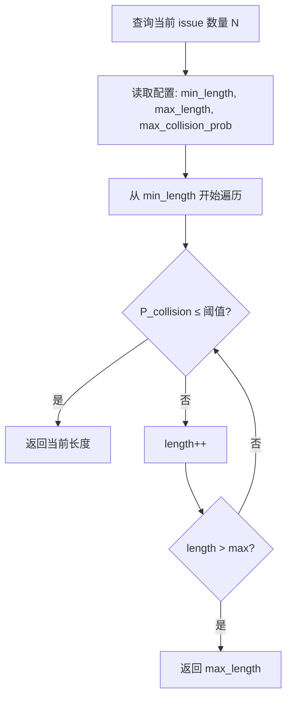
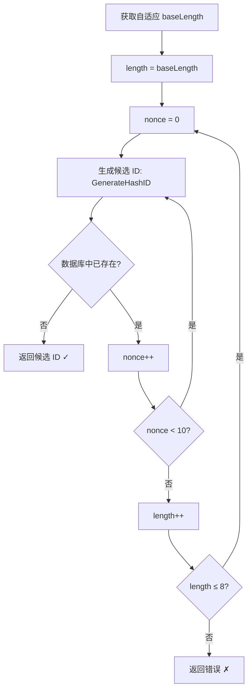

# PD-330.01 Beads — SHA256+Base36 自适应长度无冲突 ID 生成

> 文档编号：PD-330.01
> 来源：Beads `internal/idgen/hash.go` `internal/storage/dolt/adaptive_length.go`
> GitHub：https://github.com/steveyegge/beads.git
> 问题域：PD-330 无冲突 ID 生成 Collision-Free ID Generation
> 状态：可复用方案

---

## 第 1 章 问题与动机

### 1.1 核心问题

在多 Agent/多分支并行创建 issue 的场景下，ID 生成面临三重挑战：

1. **并发冲突**：多个 Agent 同时创建 issue，自增 ID 在分布式 Git 分支上必然冲突；UUID 虽无冲突但不可读（`550e8400-e29b-41d4-a716-446655440000`）
2. **可读性与唯一性的矛盾**：短 ID（如 `bd-a1b`）好记但命名空间小，长 ID 唯一但难以口头交流
3. **层级关系表达**：Epic 拆分为子任务时，ID 需要体现父子关系（`bd-a3f8.1.2`），同时保持全局唯一

Beads 的核心洞察是：**内容哈希天然解决并发冲突**——相同内容产生相同 ID（幂等），不同内容产生不同 ID（唯一），无需中心化协调。

### 1.2 Beads 的解法概述

1. **SHA256 内容哈希**：将 `title|description|creator|timestamp|nonce` 拼接后取 SHA256，确保确定性（`internal/idgen/hash.go:58`）
2. **Base36 编码**：用 `0-9a-z` 编码哈希字节，比 hex 密度高 56%（36^n vs 16^n），同样长度容纳更多 ID（`internal/idgen/hash.go:16-50`）
3. **自适应长度**：基于生日悖论公式动态计算最优 ID 长度（3-8 位），小项目用 3 位，大项目自动扩展（`internal/storage/dolt/adaptive_length.go:42-61`）
4. **Nonce 碰撞重试**：碰撞时递增 nonce 参数重新哈希，每个长度尝试 10 次，再逐级加长（`internal/storage/dolt/issues.go:1295-1311`）
5. **层级 ID**：子任务用 `parent.N` 格式，原子计数器保证同级唯一，最大深度 3 层（`internal/types/id_generator.go:47-49`）

### 1.3 设计思想

| 设计原则 | 具体实现 | 理由 | 替代方案 |
|----------|----------|------|----------|
| 内容寻址 | SHA256(title\|desc\|creator\|ts\|nonce) | 相同内容=相同ID，天然幂等，多分支合并无冲突 | UUID（随机，不可读）、自增（需中心协调） |
| 信息密度优先 | Base36 编码（0-9a-z） | 36^4=1.7M vs 16^4=65K，同长度命名空间大 26 倍 | Hex（密度低）、Base62（含大写，口头易混） |
| 按需扩展 | 生日悖论公式动态选长度 | 小项目 3 位够用，大项目自动加长，不浪费字符 | 固定长度（小项目浪费，大项目不够） |
| 层级可读 | parent.N 点分格式 | 一眼看出父子关系，`bd-a3f8.1.2` 即 a3f8 的第 1 个子任务的第 2 个孙任务 | 扁平 ID + 外部关系表（不直观） |
| 双模式兼容 | hash 模式 + counter 模式可切换 | 团队偏好不同，counter 模式给习惯自增 ID 的团队 | 只支持一种模式 |

---

## 第 2 章 源码实现分析

### 2.1 架构概览

Beads 的 ID 生成系统由四个组件协作：

```
┌─────────────────────────────────────────────────────────────────┐
│                    Issue Creation Flow                          │
│                                                                 │
│  ┌──────────┐    ┌──────────────┐    ┌───────────────────┐     │
│  │ bd create│───→│ issues.go    │───→│ generateIssueID() │     │
│  │ (CLI)    │    │ CreateIssue  │    │ (mode dispatch)   │     │
│  └──────────┘    └──────────────┘    └────────┬──────────┘     │
│                                        ┌──────┴──────┐         │
│                                        ▼             ▼         │
│                              ┌──────────────┐ ┌────────────┐   │
│                              │ Hash Mode    │ │Counter Mode│   │
│                              │ (default)    │ │ (optional) │   │
│                              └──────┬───────┘ └────────────┘   │
│                                     │                          │
│                    ┌────────────────┼────────────────┐         │
│                    ▼                ▼                ▼         │
│           ┌──────────────┐ ┌──────────────┐ ┌──────────────┐  │
│           │ idgen/hash.go│ │adaptive_     │ │ Collision    │  │
│           │ SHA256+Base36│ │length.go     │ │ Retry Loop   │  │
│           │ GenerateHash │ │ Birthday     │ │ nonce 0-9 ×  │  │
│           │ ID()         │ │ Paradox Calc │ │ length++     │  │
│           └──────────────┘ └──────────────┘ └──────────────┘  │
│                                                                 │
│  ┌──────────────────────────────────────────────────────────┐  │
│  │ Hierarchical IDs: types/id_generator.go                  │  │
│  │ GetNextChildID() → parent.N (atomic counter)             │  │
│  │ ParseHierarchicalID() → (rootID, parentID, depth)        │  │
│  │ CheckHierarchyDepth() → max 3 levels                     │  │
│  └──────────────────────────────────────────────────────────┘  │
└─────────────────────────────────────────────────────────────────┘
```

### 2.2 核心实现

#### 2.2.1 SHA256 + Base36 哈希 ID 生成

```mermaid
graph TD
    A[输入: title, desc, creator, timestamp, nonce] --> B[拼接: title|desc|creator|ts_nano|nonce]
    B --> C[SHA256 哈希 → 32 bytes]
    C --> D{根据目标长度选取字节数}
    D -->|3 chars| E[取前 2 bytes]
    D -->|4 chars| F[取前 3 bytes]
    D -->|5-6 chars| G[取前 4 bytes]
    D -->|7-8 chars| H[取前 5 bytes]
    E --> I[big.Int 除 36 取余循环]
    F --> I
    G --> I
    H --> I
    I --> J[反转 + 左补零/右截断]
    J --> K[返回 prefix-base36hash]
```

对应源码 `internal/idgen/hash.go:55-85`：

```go
func GenerateHashID(prefix, title, description, creator string, timestamp time.Time, length, nonce int) string {
    // 将所有输入拼接为稳定的内容字符串，nonce 用于碰撞重试
    content := fmt.Sprintf("%s|%s|%s|%d|%d", title, description, creator, timestamp.UnixNano(), nonce)

    // SHA256 哈希
    hash := sha256.Sum256([]byte(content))

    // 根据目标长度决定使用多少字节
    var numBytes int
    switch length {
    case 3:  numBytes = 2  // 2 bytes = 16 bits ≈ 3.09 base36 chars
    case 4:  numBytes = 3  // 3 bytes = 24 bits ≈ 4.63 base36 chars
    case 5:  numBytes = 4  // 4 bytes = 32 bits ≈ 6.18 base36 chars
    case 6:  numBytes = 4
    case 7:  numBytes = 5  // 5 bytes = 40 bits ≈ 7.73 base36 chars
    case 8:  numBytes = 5
    default: numBytes = 3
    }

    shortHash := EncodeBase36(hash[:numBytes], length)
    return fmt.Sprintf("%s-%s", prefix, shortHash)
}
```

Base36 编码核心 `internal/idgen/hash.go:16-50`：

```go
func EncodeBase36(data []byte, length int) string {
    num := new(big.Int).SetBytes(data)
    base := big.NewInt(36)
    zero := big.NewInt(0)
    mod := new(big.Int)

    // 反复除 36 取余，构建 base36 字符串
    chars := make([]byte, 0, length)
    for num.Cmp(zero) > 0 {
        num.DivMod(num, base, mod)
        chars = append(chars, base36Alphabet[mod.Int64()])
    }

    // 反转 + 补零/截断到精确长度
    // ...（省略反转逻辑）
    return str
}
```

#### 2.2.2 自适应长度计算（生日悖论）



对应源码 `internal/storage/dolt/adaptive_length.go:39-61`：

```go
// 生日悖论近似: P(collision) ≈ 1 - e^(-n²/2N)
func collisionProbability(numIssues int, idLength int) float64 {
    const base = 36.0
    totalPossibilities := math.Pow(base, float64(idLength))
    exponent := -float64(numIssues*numIssues) / (2.0 * totalPossibilities)
    return 1.0 - math.Exp(exponent)
}

func computeAdaptiveLength(numIssues int, config AdaptiveIDConfig) int {
    for length := config.MinLength; length <= config.MaxLength; length++ {
        prob := collisionProbability(numIssues, length)
        if prob <= config.MaxCollisionProbability {
            return length
        }
    }
    return config.MaxLength
}
```

命名空间容量表（`adaptive_length.go:23-30` 注释）：

| 长度 | 命名空间 | 25% 碰撞阈值 issue 数 |
|------|----------|----------------------|
| 3 | ~46K | ~160 |
| 4 | ~1.7M | ~980 |
| 5 | ~60M | ~5,900 |
| 6 | ~2.2B | ~35,000 |
| 7 | ~78B | ~212,000 |
| 8 | ~2.8T | ~1,000,000+ |

#### 2.2.3 碰撞重试循环



对应源码 `internal/storage/dolt/issues.go:1269-1314`：

```go
func generateIssueID(ctx context.Context, tx *sql.Tx, prefix string, issue *types.Issue, actor string) (string, error) {
    // 支持 counter 模式切换
    counterMode, err := isCounterModeTx(ctx, tx)
    if counterMode {
        return nextCounterIDTx(ctx, tx, prefix)
    }

    // 自适应长度
    baseLength, err := GetAdaptiveIDLengthTx(ctx, tx, prefix)
    if err != nil {
        baseLength = 6 // 降级到 6
    }

    maxLength := 8
    for length := baseLength; length <= maxLength; length++ {
        for nonce := 0; nonce < 10; nonce++ {
            candidate := generateHashID(prefix, issue.Title, issue.Description, actor, issue.CreatedAt, length, nonce)
            var count int
            err = tx.QueryRowContext(ctx, `SELECT COUNT(*) FROM issues WHERE id = ?`, candidate).Scan(&count)
            if err != nil {
                return "", fmt.Errorf("failed to check for ID collision: %w", err)
            }
            if count == 0 {
                return candidate, nil
            }
        }
    }
    return "", fmt.Errorf("failed to generate unique ID after trying lengths %d-%d with 10 nonces each", baseLength, maxLength)
}
```

### 2.3 实现细节

**内容哈希 vs ID 哈希的双重设计**

Beads 实际上有两套哈希机制：

1. **ID 哈希**（`idgen/hash.go`）：用于生成短 ID，输入是 `title|desc|creator|timestamp|nonce`，输出 3-8 位 base36
2. **内容哈希**（`types/types.go:132-210`）：用于变更检测，输入是 Issue 的所有实质字段（排除 ID、时间戳、压缩元数据），输出完整 64 字符 hex

内容哈希使用 `hashFieldWriter` 辅助结构（`types/types.go:214-261`），每个字段后写入 `\0` 分隔符防止字段拼接歧义：

```go
type hashFieldWriter struct { h hash.Hash }

func (w hashFieldWriter) str(s string) {
    w.h.Write([]byte(s))
    w.h.Write([]byte{0}) // null 分隔符
}
```

**前缀系统的三层优先级**（`issues.go:94-100`）：

1. `configPrefix`：从数据库 config 表读取（如 `bd`）
2. `IDPrefix`：追加模式（如 `bd` + `mol` → `bd-mol`）
3. `PrefixOverride`：完全替换（用于跨 rig 创建）

预定义前缀常量（`types/types.go:1089-1092`）：
- `IDPrefixMol = "mol"` → 持久化分子（`bd-mol-xxx`）
- `IDPrefixWisp = "wisp"` → 临时消息（`bd-wisp-xxx`）

---

## 第 3 章 迁移指南

### 3.1 迁移清单

**阶段 1：核心 ID 生成（最小可用）**

- [ ] 实现 Base36 编码函数（`EncodeBase36`）
- [ ] 实现 SHA256 内容哈希 ID 生成（`GenerateHashID`）
- [ ] 定义 ID 前缀配置（如 `bd`、`proj`）
- [ ] 实现碰撞检测（数据库查重）

**阶段 2：自适应长度**

- [ ] 实现生日悖论碰撞概率计算
- [ ] 实现自适应长度选择（基于当前 issue 数量）
- [ ] 添加配置项：`min_hash_length`、`max_hash_length`、`max_collision_prob`

**阶段 3：碰撞重试 + 层级 ID**

- [ ] 实现 nonce 递增重试循环（每长度 10 次 × 逐级加长）
- [ ] 实现层级 ID 生成（`parent.N` 格式）
- [ ] 实现原子子计数器（`child_counters` 表）
- [ ] 实现层级深度校验（默认最大 3 层）

**阶段 4：双模式支持（可选）**

- [ ] 实现 counter 模式（`bd-1, bd-2, ...`）
- [ ] 实现模式切换配置（`issue_id_mode=counter`）

### 3.2 适配代码模板

以下 Python 实现可直接复用，覆盖 Beads 的核心 ID 生成逻辑：

```python
import hashlib
import math
from typing import Optional

# ===== Base36 编码 =====
BASE36_ALPHABET = "0123456789abcdefghijklmnopqrstuvwxyz"

def encode_base36(data: bytes, length: int) -> str:
    """将字节数组编码为指定长度的 base36 字符串"""
    num = int.from_bytes(data, byteorder='big')
    if num == 0:
        return "0" * length

    chars = []
    while num > 0:
        num, remainder = divmod(num, 36)
        chars.append(BASE36_ALPHABET[remainder])
    result = "".join(reversed(chars))

    # 左补零或右截断到精确长度
    if len(result) < length:
        result = "0" * (length - len(result)) + result
    elif len(result) > length:
        result = result[-length:]  # 保留最低有效位
    return result


# ===== 字节数映射表 =====
BYTES_FOR_LENGTH = {3: 2, 4: 3, 5: 4, 6: 4, 7: 5, 8: 5}

def generate_hash_id(
    prefix: str, title: str, description: str,
    creator: str, timestamp_ns: int, nonce: int = 0, length: int = 4
) -> str:
    """SHA256 + Base36 内容哈希 ID 生成"""
    content = f"{title}|{description}|{creator}|{timestamp_ns}|{nonce}"
    hash_bytes = hashlib.sha256(content.encode()).digest()
    num_bytes = BYTES_FOR_LENGTH.get(length, 3)
    short_hash = encode_base36(hash_bytes[:num_bytes], length)
    return f"{prefix}-{short_hash}"


# ===== 生日悖论自适应长度 =====
def collision_probability(num_issues: int, id_length: int) -> float:
    """P(collision) ≈ 1 - e^(-n²/2N)"""
    total = 36 ** id_length
    return 1.0 - math.exp(-(num_issues ** 2) / (2.0 * total))

def compute_adaptive_length(
    num_issues: int, min_len: int = 3, max_len: int = 8,
    max_prob: float = 0.25
) -> int:
    """根据当前 issue 数量计算最优 ID 长度"""
    for length in range(min_len, max_len + 1):
        if collision_probability(num_issues, length) <= max_prob:
            return length
    return max_len


# ===== 碰撞重试 =====
def generate_unique_id(
    prefix: str, title: str, description: str, creator: str,
    timestamp_ns: int, num_issues: int,
    exists_fn=lambda id: False  # 替换为实际数据库查重
) -> str:
    """带碰撞重试的完整 ID 生成流程"""
    base_length = compute_adaptive_length(num_issues)
    for length in range(base_length, 9):  # 最大 8
        for nonce in range(10):
            candidate = generate_hash_id(prefix, title, description, creator, timestamp_ns, nonce, length)
            if not exists_fn(candidate):
                return candidate
    raise RuntimeError(f"Failed to generate unique ID after {(9-base_length)*10} attempts")


# ===== 层级 ID =====
MAX_HIERARCHY_DEPTH = 3

def generate_child_id(parent_id: str, child_number: int) -> str:
    return f"{parent_id}.{child_number}"

def parse_hierarchical_id(id: str) -> tuple[str, str, int]:
    """返回 (root_id, parent_id, depth)"""
    parts = id.split(".")
    depth = len(parts) - 1
    if depth == 0:
        return id, "", 0
    root_id = parts[0]
    parent_id = ".".join(parts[:-1])
    return root_id, parent_id, depth

def check_hierarchy_depth(parent_id: str, max_depth: int = MAX_HIERARCHY_DEPTH) -> None:
    depth = parent_id.count(".")
    if depth >= max_depth:
        raise ValueError(f"Maximum hierarchy depth ({max_depth}) exceeded for parent {parent_id}")
```

### 3.3 适用场景

| 场景 | 适用度 | 说明 |
|------|--------|------|
| 多 Agent 并行创建 issue | ⭐⭐⭐ | 内容哈希天然避免并发冲突，无需分布式锁 |
| Git 分支合并场景 | ⭐⭐⭐ | 不同分支创建的相同内容 issue 自动去重 |
| Epic 子任务拆分 | ⭐⭐⭐ | 层级 ID 直观表达父子关系 |
| 小型项目（<200 issue） | ⭐⭐⭐ | 3 位 ID 极简可读（如 `bd-vju`） |
| 大型项目（>10K issue） | ⭐⭐ | 自适应扩展到 6-8 位，仍可读但不如短 ID 方便 |
| 需要人类口头交流 ID | ⭐⭐⭐ | Base36 全小写无歧义（不像 Base62 的 l/1/I 混淆） |
| 需要跨系统同步 | ⭐⭐ | 内容哈希确定性好，但需要同步 nonce 状态 |

---

## 第 4 章 测试用例

基于 Beads 真实测试向量（`internal/idgen/hash_test.go:8-30`）和核心逻辑编写：

```python
import pytest
import math
from datetime import datetime

# 假设上面的函数已导入

class TestBase36Encoding:
    def test_zero_padding(self):
        """短结果应左补零到目标长度"""
        result = encode_base36(b'\x00\x01', 4)
        assert len(result) == 4
        assert result.startswith("0")

    def test_truncation(self):
        """长结果应截断到目标长度（保留低位）"""
        result = encode_base36(b'\xff\xff\xff\xff\xff', 3)
        assert len(result) == 3

    def test_alphabet_range(self):
        """输出只包含 0-9a-z"""
        result = encode_base36(b'\xab\xcd\xef\x12\x34', 8)
        assert all(c in BASE36_ALPHABET for c in result)

    def test_deterministic(self):
        """相同输入产生相同输出"""
        data = b'\x12\x34\x56'
        assert encode_base36(data, 5) == encode_base36(data, 5)


class TestGenerateHashID:
    def test_format(self):
        """ID 格式为 prefix-base36hash"""
        result = generate_hash_id("bd", "Fix login", "Details", "jira-import", 1704164645006000000, 0, 4)
        assert result.startswith("bd-")
        assert len(result.split("-")[1]) == 4

    def test_nonce_changes_output(self):
        """不同 nonce 产生不同 ID"""
        id0 = generate_hash_id("bd", "title", "desc", "user", 1000, 0, 4)
        id1 = generate_hash_id("bd", "title", "desc", "user", 1000, 1, 4)
        assert id0 != id1

    def test_content_sensitivity(self):
        """不同内容产生不同 ID"""
        id_a = generate_hash_id("bd", "Bug A", "", "user", 1000, 0, 6)
        id_b = generate_hash_id("bd", "Bug B", "", "user", 1000, 0, 6)
        assert id_a != id_b

    def test_idempotent(self):
        """相同内容产生相同 ID（幂等性）"""
        args = ("bd", "Fix login", "Details", "user", 1704164645006000000, 0, 6)
        assert generate_hash_id(*args) == generate_hash_id(*args)

    def test_length_range(self):
        """支持 3-8 位长度"""
        for length in range(3, 9):
            result = generate_hash_id("bd", "title", "desc", "user", 1000, 0, length)
            hash_part = result.split("-")[1]
            assert len(hash_part) == length


class TestAdaptiveLength:
    def test_small_project(self):
        """<160 issue 应返回 3"""
        assert compute_adaptive_length(100) == 3

    def test_medium_project(self):
        """~1000 issue 应返回 4 或 5"""
        length = compute_adaptive_length(1000)
        assert length in (4, 5)

    def test_large_project(self):
        """>35000 issue 应返回 7 或 8"""
        length = compute_adaptive_length(50000)
        assert length >= 7

    def test_collision_probability_formula(self):
        """验证生日悖论公式"""
        # 3 chars = 46656 possibilities, 160 items → ~25%
        prob = collision_probability(160, 3)
        assert 0.20 < prob < 0.30

    def test_monotonic_growth(self):
        """issue 数增加时长度不减"""
        prev = compute_adaptive_length(0)
        for n in [100, 500, 2000, 10000, 100000]:
            curr = compute_adaptive_length(n)
            assert curr >= prev
            prev = curr


class TestHierarchicalID:
    def test_child_id_format(self):
        assert generate_child_id("bd-a3f8", 1) == "bd-a3f8.1"
        assert generate_child_id("bd-a3f8.1", 2) == "bd-a3f8.1.2"

    def test_parse_root(self):
        root, parent, depth = parse_hierarchical_id("bd-a3f8")
        assert root == "bd-a3f8"
        assert parent == ""
        assert depth == 0

    def test_parse_child(self):
        root, parent, depth = parse_hierarchical_id("bd-a3f8.1")
        assert root == "bd-a3f8"
        assert parent == "bd-a3f8"
        assert depth == 1

    def test_parse_grandchild(self):
        root, parent, depth = parse_hierarchical_id("bd-a3f8.1.2")
        assert root == "bd-a3f8"
        assert parent == "bd-a3f8.1"
        assert depth == 2

    def test_max_depth_enforcement(self):
        check_hierarchy_depth("bd-a3f8", 3)  # depth 0, OK
        check_hierarchy_depth("bd-a3f8.1", 3)  # depth 1, OK
        check_hierarchy_depth("bd-a3f8.1.2", 3)  # depth 2, OK
        with pytest.raises(ValueError):
            check_hierarchy_depth("bd-a3f8.1.2.3", 3)  # depth 3, exceeds


class TestCollisionRetry:
    def test_no_collision(self):
        """无碰撞时直接返回"""
        result = generate_unique_id("bd", "title", "desc", "user", 1000, 50)
        assert result.startswith("bd-")

    def test_retry_on_collision(self):
        """碰撞时通过 nonce 重试"""
        seen = set()
        def mock_exists(id):
            if id not in seen and len(seen) < 3:
                seen.add(id)
                return True  # 前 3 次碰撞
            return False
        result = generate_unique_id("bd", "title", "desc", "user", 1000, 50, mock_exists)
        assert result.startswith("bd-")
```

---

## 第 5 章 跨域关联

| 关联域 | 关系类型 | 说明 |
|--------|----------|------|
| PD-02 多 Agent 编排 | 协同 | 多 Agent 并行创建 issue 时，内容哈希 ID 天然避免冲突，无需编排层做 ID 协调 |
| PD-06 记忆持久化 | 依赖 | ID 是持久化的主键，层级 ID 的 `child_counters` 表需要持久化存储支持 |
| PD-153 层级 Epic 系统 | 协同 | 层级 ID（`bd-a3f8.1.2`）直接服务于 Epic 子任务拆分，`MaxHierarchyDepth=3` 限制过度分解 |
| PD-152 Hash ID 碰撞防护 | 同域 | 本文档即 PD-330 的 Beads 实现，与 PD-152 为同一问题域的不同编号 |
| PD-11 可观测性 | 协同 | ID 前缀（`bd-mol-`、`bd-wisp-`）可用于日志过滤和指标分组 |

---

## 第 6 章 来源文件索引

| 文件 | 行范围 | 关键实现 |
|------|--------|----------|
| `internal/idgen/hash.go` | L1-86 | SHA256+Base36 哈希 ID 生成核心（`GenerateHashID`、`EncodeBase36`） |
| `internal/idgen/hash_test.go` | L1-31 | 哈希 ID 测试向量（Jira 导入兼容性验证） |
| `internal/storage/dolt/adaptive_length.go` | L1-129 | 生日悖论自适应长度计算（`collisionProbability`、`computeAdaptiveLength`） |
| `internal/storage/dolt/issues.go` | L70-119 | Issue 创建流程：前缀读取、ID 生成、插入 |
| `internal/storage/dolt/issues.go` | L1259-1320 | 碰撞重试循环（`generateIssueID`）、counter 模式切换 |
| `internal/types/id_generator.go` | L1-115 | 层级 ID 生成/解析（`GenerateChildID`、`ParseHierarchicalID`、`CheckHierarchyDepth`） |
| `internal/types/types.go` | L15-127 | Issue 结构体定义（ID、IDPrefix、PrefixOverride 字段） |
| `internal/types/types.go` | L129-261 | 内容哈希计算（`ComputeContentHash`、`hashFieldWriter`） |
| `internal/types/types.go` | L1089-1092 | ID 前缀常量（`IDPrefixMol`、`IDPrefixWisp`） |
| `internal/storage/dolt/queries.go` | L1239-1271 | 层级子 ID 原子计数器（`GetNextChildID`、`child_counters` 表） |

---

## 第 7 章 横向对比维度

```json comparison_data
{
  "project": "beads",
  "dimensions": {
    "哈希算法": "SHA256 内容哈希（title|desc|creator|ts|nonce）",
    "编码方式": "Base36（0-9a-z），比 hex 密度高 56%",
    "长度策略": "生日悖论自适应 3-8 位，按 issue 数量动态扩展",
    "碰撞处理": "双层循环：nonce×10 + length++ 逐级加长",
    "层级 ID": "parent.N 点分格式，原子计数器，最大 3 层",
    "双模式": "hash 模式（默认）+ counter 模式（bd-1, bd-2）可切换",
    "前缀系统": "三层优先级：config → IDPrefix 追加 → PrefixOverride 替换"
  }
}
```

### 域元数据补充

```json domain_metadata
{
  "solution_summary": "Beads 用 SHA256+Base36 编码生成内容哈希 ID，通过生日悖论公式自适应 3-8 位长度，双层 nonce×length 重试循环确保零冲突，支持 parent.N 层级 ID 和 hash/counter 双模式切换",
  "description": "分布式 Git 分支并行场景下的确定性 ID 生成与自适应扩展",
  "sub_problems": [
    "自适应长度的碰撞概率阈值选择（Beads 默认 25%）",
    "hash 模式与 counter 模式的运行时切换",
    "多前缀命名空间隔离（mol/wisp/跨 rig）"
  ],
  "best_practices": [
    "生日悖论公式驱动自适应长度，避免固定长度的浪费或不足",
    "双层重试（nonce 递增 + 长度递增）最大化碰撞解决概率",
    "内容哈希字段间用 null 分隔符防止拼接歧义"
  ]
}
```
