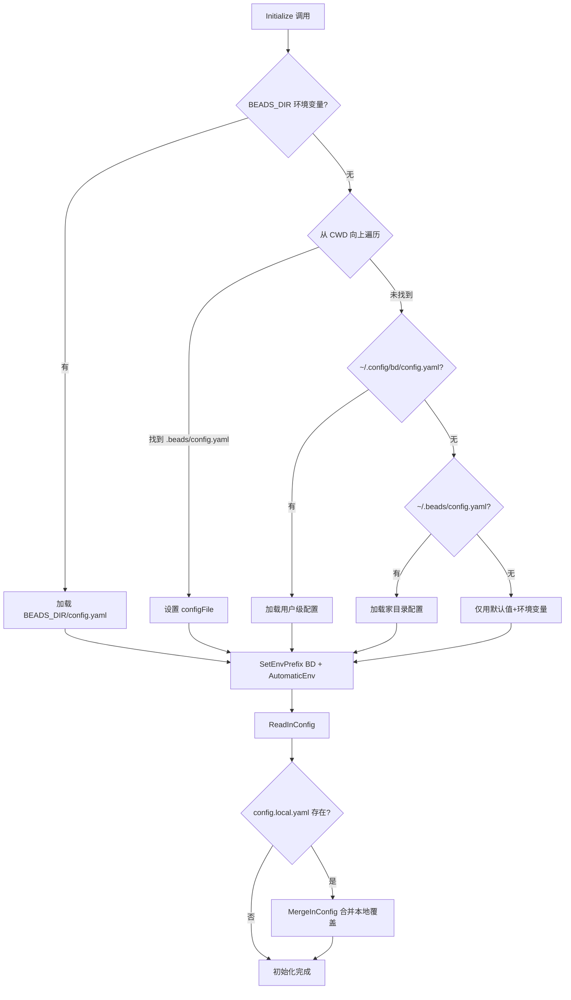
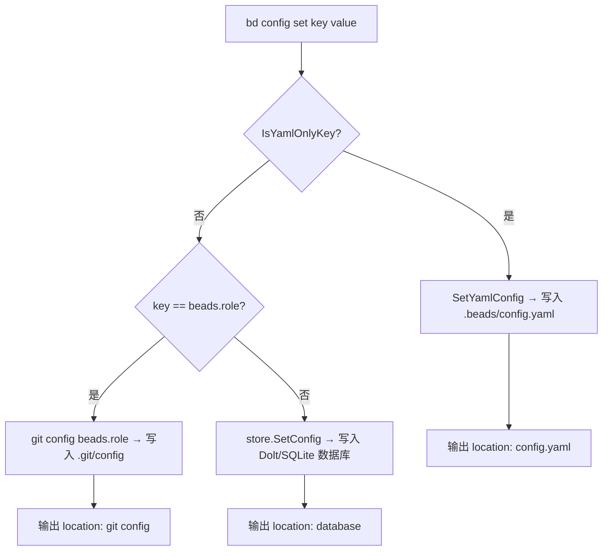
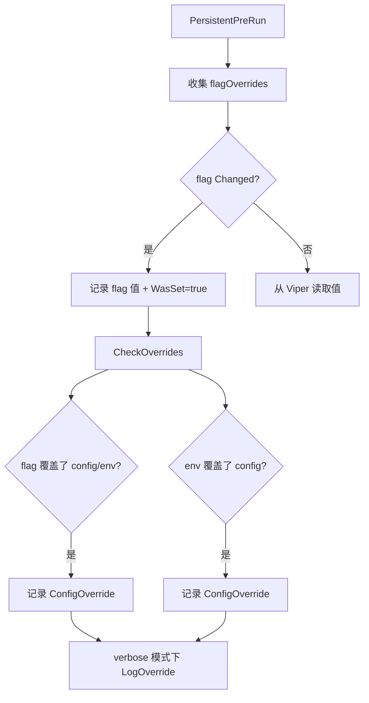

# PD-331.01 Beads — Viper 四级配置优先级链与双层存储分离

> 文档编号：PD-331.01
> 来源：Beads `internal/config/config.go`, `internal/config/yaml_config.go`, `internal/configfile/configfile.go`
> GitHub：https://github.com/steveyegge/beads.git
> 问题域：PD-331 层级配置管理 Hierarchical Configuration Management
> 状态：可复用方案

---

## 第 1 章 问题与动机

### 1.1 核心问题

CLI 工具的配置管理面临多层冲突：开发者在不同机器上有不同偏好（本地覆盖），团队需要共享项目级配置（版本控制），CI/CD 需要通过环境变量注入临时配置，而命令行 flag 必须拥有最高优先级以便调试。当配置来源超过两层时，"我的配置到底从哪来"成为最常见的排障问题。

更深层的问题是**启动时序**：某些配置（如 `no-db`、`routing.mode`）必须在数据库打开之前读取，如果把它们存进数据库，用户执行 `bd config set no-db true` 看似成功但实际无效——这正是 Beads 的 GH#536 bug。

### 1.2 Beads 的解法概述

Beads 采用 **Viper 驱动的四级优先级链 + 双层存储分离** 架构：

1. **四级优先级链**：CLI flag > 环境变量(BD_*) > config.yaml > 硬编码默认值，由 Viper 库统一管理（`internal/config/config.go:119-123`）
2. **双层存储分离**：启动期配置存 YAML（`YamlOnlyKeys` 白名单），运行期配置存数据库（Dolt/SQLite），`bd config set` 自动路由到正确存储层（`cmd/bd/config.go:66`）
3. **四级配置文件搜索**：BEADS_DIR > 项目级 `.beads/config.yaml`（向上遍历）> 用户级 `~/.config/bd/` > 家目录 `~/.beads/`（`internal/config/config.go:42-114`）
4. **config.local.yaml 本地覆盖**：机器特定配置通过 Viper MergeInConfig 合并，不污染版本控制（`internal/config/config.go:222-231`）
5. **覆盖检测与告警**：`CheckOverrides()` 函数在 verbose 模式下报告哪些配置被哪一层覆盖了（`internal/config/config.go:299-366`）

### 1.3 设计思想

| 设计原则 | 具体实现 | 理由 | 替代方案 |
|----------|----------|------|----------|
| 启动/运行分离 | YamlOnlyKeys 白名单 + IsYamlOnlyKey() 前缀匹配 | 数据库未打开时需要读取的配置不能存数据库 | 全部存 YAML（丧失数据库查询能力） |
| 就近原则 | 从 CWD 向上遍历查找 .beads/config.yaml | monorepo 子目录也能找到项目配置 | 只查固定路径（子目录失效） |
| 本地覆盖隔离 | config.local.yaml + MergeInConfig | 机器特定配置（如 WSL 路径）不进版本控制 | .env 文件（缺乏结构化） |
| 覆盖可追溯 | ConfigSource 枚举 + CheckOverrides() | 排障时快速定位"配置从哪来" | 无追溯（用户只能猜） |
| 环境变量自动绑定 | BD_ 前缀 + SetEnvKeyReplacer 点号/连字符转下划线 | CI/CD 无需修改配置文件 | 手动 BindEnv 每个 key（易遗漏） |

---

## 第 2 章 源码实现分析

### 2.1 架构概览

Beads 的配置系统由三个核心模块组成，形成双层存储架构：

```
┌─────────────────────────────────────────────────────────────────┐
│                        bd CLI (cmd/bd/main.go)                  │
│  PersistentPreRun: flag → viper fallback → override detection   │
├─────────────────────────────────────────────────────────────────┤
│                                                                 │
│  ┌──────────────────────┐    ┌─────────────────────────────┐   │
│  │  config (Viper层)     │    │  configfile (JSON元数据层)   │   │
│  │  config.yaml          │    │  metadata.json              │   │
│  │  config.local.yaml    │    │  数据库连接参数              │   │
│  │  BD_* 环境变量        │    │  后端类型(dolt/sqlite)       │   │
│  │  CLI flags            │    │  Dolt 服务器配置             │   │
│  ├──────────────────────┤    ├─────────────────────────────┤   │
│  │ yaml_config.go        │    │ BEADS_* 环境变量覆盖         │   │
│  │ YamlOnlyKeys 白名单   │    │ 每个 getter 独立优先级链     │   │
│  │ bd config set 自动路由 │    │ 密码只走环境变量             │   │
│  └──────────────────────┘    └─────────────────────────────┘   │
│                                                                 │
│  ┌──────────────────────────────────────────────────────────┐  │
│  │              Dolt/SQLite 数据库 (运行期配置)               │  │
│  │  jira.*, linear.*, github.*, status.*, custom.*          │  │
│  │  bd config set/get/list/unset → store.SetConfig()        │  │
│  └──────────────────────────────────────────────────────────┘  │
└─────────────────────────────────────────────────────────────────┘
```

### 2.2 核心实现

#### 2.2.1 Viper 初始化与四级配置文件搜索



对应源码 `internal/config/config.go:32-238`：

```go
func Initialize() error {
	v = viper.New()
	v.SetConfigType("yaml")

	configFileSet := false

	// 0. BEADS_DIR 最高优先级
	if beadsDir := os.Getenv("BEADS_DIR"); beadsDir != "" && !configFileSet {
		configPath := filepath.Join(beadsDir, "config.yaml")
		if _, err := os.Stat(configPath); err == nil {
			v.SetConfigFile(configPath)
			configFileSet = true
		}
	}

	// 1. 从 CWD 向上遍历查找 .beads/config.yaml
	cwd, err := os.Getwd()
	if err == nil && !configFileSet {
		for dir := cwd; dir != filepath.Dir(dir); dir = filepath.Dir(dir) {
			configPath := filepath.Join(dir, ".beads", "config.yaml")
			if _, err := os.Stat(configPath); err == nil {
				v.SetConfigFile(configPath)
				configFileSet = true
				break
			}
		}
	}

	// 2-3. 用户级 → 家目录级（省略）

	// 环境变量自动绑定
	v.SetEnvPrefix("BD")
	v.SetEnvKeyReplacer(strings.NewReplacer(".", "_", "-", "_"))
	v.AutomaticEnv()

	// 读取配置文件 + 合并 config.local.yaml
	if configFileSet {
		if err := v.ReadInConfig(); err != nil {
			return fmt.Errorf("error reading config file: %w", err)
		}
		localConfigPath := filepath.Join(filepath.Dir(v.ConfigFileUsed()), "config.local.yaml")
		if _, err := os.Stat(localConfigPath); err == nil {
			v.SetConfigFile(localConfigPath)
			if err := v.MergeInConfig(); err != nil {
				return fmt.Errorf("error merging local config file: %w", err)
			}
		}
	}
	return nil
}
```

#### 2.2.2 YamlOnlyKeys 双层存储路由



对应源码 `internal/config/yaml_config.go:14-79`：

```go
// YamlOnlyKeys 白名单：启动期配置必须存 YAML
var YamlOnlyKeys = map[string]bool{
	"no-db": true, "json": true,
	"db": true, "actor": true, "identity": true,
	"git.author": true, "git.no-gpg-sign": true,
	"routing.mode": true, "routing.default": true,
	"routing.maintainer": true, "routing.contributor": true,
	"validation.on-create": true, "validation.on-sync": true,
	"hierarchy.max-depth": true,
	// ...
}

func IsYamlOnlyKey(key string) bool {
	if YamlOnlyKeys[key] { return true }
	// 前缀匹配：routing.*, sync.*, git.*, dolt.*, federation.* 等
	prefixes := []string{"routing.", "sync.", "git.", "directory.",
		"repos.", "external_projects.", "validation.",
		"hierarchy.", "ai.", "dolt.", "federation."}
	for _, prefix := range prefixes {
		if strings.HasPrefix(key, prefix) { return true }
	}
	return false
}
```

#### 2.2.3 覆盖检测与源追踪



对应源码 `internal/config/config.go:247-395`：

```go
type ConfigSource string
const (
	SourceDefault    ConfigSource = "default"
	SourceConfigFile ConfigSource = "config_file"
	SourceEnvVar     ConfigSource = "env_var"
	SourceFlag       ConfigSource = "flag"
)

type ConfigOverride struct {
	Key            string
	EffectiveValue interface{}
	OverriddenBy   ConfigSource
	OriginalSource ConfigSource
	OriginalValue  interface{}
}

func GetValueSource(key string) ConfigSource {
	// 构造 BD_KEY_NAME 检查环境变量
	envKey := "BD_" + strings.ToUpper(
		strings.ReplaceAll(strings.ReplaceAll(key, "-", "_"), ".", "_"))
	if os.Getenv(envKey) != "" { return SourceEnvVar }
	// 检查 BEADS_ 前缀（兼容旧版）
	beadsEnvKey := "BEADS_" + strings.ToUpper(...)
	if os.Getenv(beadsEnvKey) != "" { return SourceEnvVar }
	if v.InConfig(key) { return SourceConfigFile }
	return SourceDefault
}
```

### 2.3 实现细节

**configfile 层的独立优先级链**：`internal/configfile/configfile.go` 中每个 Dolt 服务器参数都有独立的 `BEADS_*` 环境变量覆盖，形成第二条优先级链（`configfile.go:271-350`）：

```
GetDoltServerHost: BEADS_DOLT_SERVER_HOST > metadata.json > "127.0.0.1"
GetDoltServerPort: BEADS_DOLT_SERVER_PORT > metadata.json > 3307
GetDoltServerUser: BEADS_DOLT_SERVER_USER > metadata.json > "root"
GetDoltDatabase:   BEADS_DOLT_SERVER_DATABASE > metadata.json > "beads"
GetDoltServerTLS:  BEADS_DOLT_SERVER_TLS > metadata.json > false
GetDoltDataDir:    BEADS_DOLT_DATA_DIR > metadata.json > ""
GetBackend:        BEADS_BACKEND > metadata.json > "dolt"
Password:          BEADS_DOLT_PASSWORD（仅环境变量，不存文件）
```

**SaveConfigValue 的精确写入**：`config.go:400-427` 中 `SaveConfigValue` 不会把 Viper 的全部合并状态（默认值+环境变量+覆盖）dump 到文件，而是只读取现有文件内容，用 `setNestedKey` 修改单个 key，再写回。这避免了配置文件膨胀。

**测试隔离**：`BEADS_TEST_IGNORE_REPO_CONFIG` 环境变量（`config.go:62`）让测试跳过仓库级配置，避免测试结果受开发者本地配置影响。


---

## 第 3 章 迁移指南

### 3.1 迁移清单

**阶段 1：基础四级优先级链（1 个文件）**
- [ ] 引入 `github.com/spf13/viper` 依赖
- [ ] 创建 `config/config.go`，实现 `Initialize()` 函数
- [ ] 设置 `SetEnvPrefix` + `SetEnvKeyReplacer` + `AutomaticEnv`
- [ ] 注册所有 `SetDefault` 默认值
- [ ] 实现配置文件搜索链（项目级 → 用户级 → 家目录级）

**阶段 2：双层存储分离（2 个文件）**
- [ ] 创建 `config/yaml_config.go`，定义 `YamlOnlyKeys` 白名单
- [ ] 实现 `IsYamlOnlyKey()` 精确匹配 + 前缀匹配
- [ ] 在 `config set` 命令中根据 key 类型路由到 YAML 或数据库

**阶段 3：覆盖检测（可选增强）**
- [ ] 定义 `ConfigSource` 枚举和 `ConfigOverride` 结构体
- [ ] 实现 `GetValueSource()` 和 `CheckOverrides()`
- [ ] 在 verbose/debug 模式下输出覆盖告警

**阶段 4：本地覆盖文件（可选增强）**
- [ ] 在 `ReadInConfig` 后检查 `config.local.yaml` 并 `MergeInConfig`
- [ ] 将 `config.local.yaml` 加入 `.gitignore`

### 3.2 适配代码模板

以下是一个可直接运行的 Go 配置管理模块，复用 Beads 的核心模式：

```go
package config

import (
	"fmt"
	"os"
	"path/filepath"
	"strings"

	"github.com/spf13/viper"
)

var v *viper.Viper

// YamlOnlyKeys 定义必须存储在 YAML 中的启动期配置
var YamlOnlyKeys = map[string]bool{
	"log-level": true,
	"port":      true,
	"db.driver": true,
}

// Initialize 初始化四级配置优先级链
func Initialize(appName string) error {
	v = viper.New()
	v.SetConfigType("yaml")

	// 1. 从 CWD 向上查找 .<appName>/config.yaml
	if cwd, err := os.Getwd(); err == nil {
		for dir := cwd; dir != filepath.Dir(dir); dir = filepath.Dir(dir) {
			configPath := filepath.Join(dir, "."+appName, "config.yaml")
			if _, err := os.Stat(configPath); err == nil {
				v.SetConfigFile(configPath)
				break
			}
		}
	}

	// 2. 用户级配置
	if configDir, err := os.UserConfigDir(); err == nil {
		v.AddConfigPath(filepath.Join(configDir, appName))
	}

	// 环境变量自动绑定：APP_LOG_LEVEL 对应 log-level
	v.SetEnvPrefix(strings.ToUpper(appName))
	v.SetEnvKeyReplacer(strings.NewReplacer(".", "_", "-", "_"))
	v.AutomaticEnv()

	// 默认值
	v.SetDefault("log-level", "info")
	v.SetDefault("port", 8080)

	// 读取配置文件
	if err := v.ReadInConfig(); err != nil {
		if _, ok := err.(viper.ConfigFileNotFoundError); !ok {
			return fmt.Errorf("config read error: %w", err)
		}
	}

	// 合并本地覆盖
	if configFile := v.ConfigFileUsed(); configFile != "" {
		localPath := filepath.Join(filepath.Dir(configFile), "config.local.yaml")
		if _, err := os.Stat(localPath); err == nil {
			v.SetConfigFile(localPath)
			_ = v.MergeInConfig()
		}
	}

	return nil
}

// IsYamlOnlyKey 判断 key 是否必须存储在 YAML
func IsYamlOnlyKey(key string) bool {
	if YamlOnlyKeys[key] {
		return true
	}
	for _, prefix := range []string{"db.", "auth.", "server."} {
		if strings.HasPrefix(key, prefix) {
			return true
		}
	}
	return false
}

// GetString 类型安全的字符串读取
func GetString(key string) string {
	if v == nil { return "" }
	return v.GetString(key)
}

// GetInt 类型安全的整数读取
func GetInt(key string) int {
	if v == nil { return 0 }
	return v.GetInt(key)
}

// GetBool 类型安全的布尔读取
func GetBool(key string) bool {
	if v == nil { return false }
	return v.GetBool(key)
}
```

### 3.3 适用场景

| 场景 | 适用度 | 说明 |
|------|--------|------|
| Go CLI 工具（Cobra + Viper） | ⭐⭐⭐ | 完美匹配，Beads 就是这个技术栈 |
| 多环境部署的后端服务 | ⭐⭐⭐ | 四级优先级链天然适合 dev/staging/prod |
| monorepo 中的子项目工具 | ⭐⭐⭐ | 向上遍历查找配置文件是关键特性 |
| Python CLI 工具 | ⭐⭐ | 需要用 python-dotenv + pydantic 替代 Viper |
| 前端项目配置 | ⭐ | 前端通常用 .env 文件，不需要这么复杂的层级 |

---

## 第 4 章 测试用例

```go
package config_test

import (
	"os"
	"path/filepath"
	"testing"

	"github.com/stretchr/testify/assert"
	"github.com/stretchr/testify/require"
)

// TestConfigPriorityChain 验证四级优先级链
func TestConfigPriorityChain(t *testing.T) {
	// 准备：创建临时项目目录
	tmpDir := t.TempDir()
	beadsDir := filepath.Join(tmpDir, ".beads")
	require.NoError(t, os.MkdirAll(beadsDir, 0755))

	// 写入 config.yaml 设置 actor=yaml-user
	configPath := filepath.Join(beadsDir, "config.yaml")
	require.NoError(t, os.WriteFile(configPath, []byte("actor: yaml-user\n"), 0600))

	// 场景 1：config.yaml 值生效
	require.NoError(t, os.Chdir(tmpDir))
	os.Setenv("BEADS_TEST_IGNORE_REPO_CONFIG", "1")
	defer os.Unsetenv("BEADS_TEST_IGNORE_REPO_CONFIG")

	config.ResetForTesting()
	require.NoError(t, config.Initialize())
	assert.Equal(t, "yaml-user", config.GetString("actor"))

	// 场景 2：环境变量覆盖 config.yaml
	os.Setenv("BD_ACTOR", "env-user")
	defer os.Unsetenv("BD_ACTOR")
	config.ResetForTesting()
	require.NoError(t, config.Initialize())
	assert.Equal(t, "env-user", config.GetString("actor"))

	// 场景 3：默认值兜底
	os.Unsetenv("BD_ACTOR")
	os.Remove(configPath)
	config.ResetForTesting()
	require.NoError(t, config.Initialize())
	assert.Equal(t, "", config.GetString("actor")) // 默认空字符串
}

// TestYamlOnlyKeyRouting 验证双层存储路由
func TestYamlOnlyKeyRouting(t *testing.T) {
	// 精确匹配
	assert.True(t, config.IsYamlOnlyKey("no-db"))
	assert.True(t, config.IsYamlOnlyKey("routing.mode"))
	assert.True(t, config.IsYamlOnlyKey("hierarchy.max-depth"))

	// 前缀匹配
	assert.True(t, config.IsYamlOnlyKey("routing.custom-field"))
	assert.True(t, config.IsYamlOnlyKey("dolt.idle-timeout"))
	assert.True(t, config.IsYamlOnlyKey("federation.remote"))

	// 数据库存储的 key
	assert.False(t, config.IsYamlOnlyKey("jira.url"))
	assert.False(t, config.IsYamlOnlyKey("status.custom"))
	assert.False(t, config.IsYamlOnlyKey("custom.field"))
}

// TestConfigLocalYamlMerge 验证本地覆盖文件合并
func TestConfigLocalYamlMerge(t *testing.T) {
	tmpDir := t.TempDir()
	beadsDir := filepath.Join(tmpDir, ".beads")
	require.NoError(t, os.MkdirAll(beadsDir, 0755))

	// 主配置
	require.NoError(t, os.WriteFile(
		filepath.Join(beadsDir, "config.yaml"),
		[]byte("actor: team-default\nai:\n  model: claude-sonnet\n"), 0600))

	// 本地覆盖
	require.NoError(t, os.WriteFile(
		filepath.Join(beadsDir, "config.local.yaml"),
		[]byte("ai:\n  model: claude-opus\n"), 0600))

	require.NoError(t, os.Chdir(tmpDir))
	config.ResetForTesting()
	require.NoError(t, config.Initialize())

	// 本地覆盖生效
	assert.Equal(t, "claude-opus", config.GetString("ai.model"))
	// 未覆盖的保持原值
	assert.Equal(t, "team-default", config.GetString("actor"))
}

// TestOverrideDetection 验证覆盖检测
func TestOverrideDetection(t *testing.T) {
	tmpDir := t.TempDir()
	beadsDir := filepath.Join(tmpDir, ".beads")
	require.NoError(t, os.MkdirAll(beadsDir, 0755))
	require.NoError(t, os.WriteFile(
		filepath.Join(beadsDir, "config.yaml"),
		[]byte("json: true\n"), 0600))

	require.NoError(t, os.Chdir(tmpDir))
	os.Setenv("BD_JSON", "false")
	defer os.Unsetenv("BD_JSON")

	config.ResetForTesting()
	require.NoError(t, config.Initialize())

	source := config.GetValueSource("json")
	assert.Equal(t, config.SourceEnvVar, source)
}

// TestSaveConfigValuePrecision 验证精确写入不污染文件
func TestSaveConfigValuePrecision(t *testing.T) {
	tmpDir := t.TempDir()
	beadsDir := filepath.Join(tmpDir, ".beads")
	require.NoError(t, os.MkdirAll(beadsDir, 0755))

	original := "actor: original\n"
	configPath := filepath.Join(beadsDir, "config.yaml")
	require.NoError(t, os.WriteFile(configPath, []byte(original), 0600))

	require.NoError(t, os.Chdir(tmpDir))
	config.ResetForTesting()
	require.NoError(t, config.Initialize())

	// 只修改一个 key
	require.NoError(t, config.SaveConfigValue("ai.model", "gpt-4", beadsDir))

	// 验证原有 key 保留，新 key 添加，无默认值泄漏
	data, err := os.ReadFile(configPath)
	require.NoError(t, err)
	content := string(data)
	assert.Contains(t, content, "actor: original")
	assert.Contains(t, content, "model: gpt-4")
	assert.NotContains(t, content, "no-db") // 默认值不应出现
}
```


---

## 第 5 章 跨域关联

| 关联域 | 关系类型 | 说明 |
|--------|----------|------|
| PD-06 记忆持久化 | 协同 | Beads 的 config.yaml 本身就是一种持久化记忆，`SaveConfigValue` 的精确写入模式避免了配置膨胀，与 Dolt 版本控制数据库的持久化策略互补 |
| PD-09 Human-in-the-Loop | 协同 | `routing.mode` 配置决定了 maintainer/contributor 的工作流路由，`create.require-description` 强制人工输入描述，都是通过配置控制人机交互行为 |
| PD-11 可观测性 | 依赖 | `CheckOverrides()` + `LogOverride()` 是配置层的可观测性实现，verbose 模式下输出覆盖链路，帮助排障"配置从哪来" |
| PD-03 容错与重试 | 协同 | `configfile.go` 中每个 Dolt 参数的 getter 都有 env > config > default 三级降级链，`BEADS_BACKEND` 环境变量作为损坏配置的逃生舱口 |
| PD-05 沙箱隔离 | 协同 | `BEADS_TEST_IGNORE_REPO_CONFIG` 实现测试环境与开发环境的配置隔离，`config.local.yaml` 实现机器级隔离 |

---

## 第 6 章 来源文件索引

| 文件 | 行范围 | 关键实现 |
|------|--------|----------|
| `internal/config/config.go` | L32-L238 | Viper 初始化、四级文件搜索、环境变量绑定、config.local.yaml 合并 |
| `internal/config/config.go` | L247-L395 | ConfigSource 枚举、ConfigOverride 结构体、GetValueSource、CheckOverrides、LogOverride |
| `internal/config/config.go` | L397-L442 | SaveConfigValue 精确写入、setNestedKey 嵌套路径处理 |
| `internal/config/config.go` | L444-L576 | 类型安全 getter 函数族（GetString/GetBool/GetInt/GetDuration/GetStringSlice/GetStringMapString） |
| `internal/config/config.go` | L580-L606 | GetDirectoryLabels 目录感知标签作用域 |
| `internal/config/config.go` | L608-L678 | MultiRepoConfig、GetExternalProjects、ResolveExternalProjectPath 跨项目路径解析 |
| `internal/config/config.go` | L680-L713 | GetIdentity 四级身份解析链（flag > env > git user.name > hostname） |
| `internal/config/yaml_config.go` | L14-L79 | YamlOnlyKeys 白名单、IsYamlOnlyKey 精确+前缀匹配 |
| `internal/config/yaml_config.go` | L95-L206 | SetYamlConfig、findProjectConfigYaml、updateYamlKey（支持注释行恢复） |
| `internal/config/yaml_config.go` | L274-L296 | validateYamlConfigValue 配置值校验（hierarchy.max-depth、dolt.idle-timeout） |
| `internal/config/sync.go` | L28-L46 | SyncMode 类型定义与验证 |
| `internal/config/sync.go` | L53-L125 | ConflictStrategy、FieldStrategy 枚举与验证 |
| `internal/config/sync.go` | L127-L219 | Sovereignty 分级与 GetConflictStrategy/GetSovereignty 带告警的安全读取 |
| `internal/configfile/configfile.go` | L14-L42 | Config 结构体（metadata.json 数据库元数据） |
| `internal/configfile/configfile.go` | L54-L95 | Load 函数含 config.json → metadata.json 自动迁移 |
| `internal/configfile/configfile.go` | L215-L350 | GetBackend/GetDoltServerHost/Port/User/Database/Password/TLS/DataDir 独立优先级链 |
| `cmd/bd/main.go` | L280-L337 | PersistentPreRun flag→viper 回退 + flagOverrides 收集 + CheckOverrides 调用 |
| `cmd/bd/config.go` | L55-L120 | configSetCmd：YamlOnlyKey 路由 → YAML / git config / 数据库三路分发 |
| `internal/routing/routing.go` | L19-L91 | UserRole 检测、RoutingConfig 结构体、DetermineTargetRepo 路由决策 |

---

## 第 7 章 横向对比维度

```json comparison_data
{
  "project": "beads",
  "dimensions": {
    "配置框架": "Viper 单例 + Cobra flag 手动绑定，AutomaticEnv 自动映射",
    "优先级层数": "四级：CLI flag > BD_* 环境变量 > config.yaml > SetDefault 默认值",
    "文件搜索策略": "四路搜索：BEADS_DIR > CWD 向上遍历 > ~/.config/bd/ > ~/.beads/",
    "存储分离": "双层：YamlOnlyKeys 白名单路由启动期配置到 YAML，运行期配置到 Dolt/SQLite 数据库",
    "本地覆盖": "config.local.yaml 通过 MergeInConfig 合并，gitignore 隔离",
    "覆盖追溯": "ConfigSource 四枚举 + CheckOverrides 检测 + verbose 模式 LogOverride 输出",
    "配置校验": "validateYamlConfigValue 类型校验 + sync/conflict/sovereignty 枚举验证 + 无效值告警降级",
    "敏感信息处理": "密码仅通过 BEADS_DOLT_PASSWORD 环境变量传递，不存入任何配置文件"
  }
}
```

### 域元数据补充

```json domain_metadata
{
  "solution_summary": "Beads 用 Viper 单例实现 Flag>Env>YAML>Default 四级优先级链，通过 YamlOnlyKeys 白名单将启动期配置路由到 YAML、运行期配置路由到 Dolt 数据库，config.local.yaml 隔离机器特定覆盖",
  "description": "CLI 工具中启动期与运行期配置的存储分离与自动路由",
  "sub_problems": [
    "启动期配置与运行期配置的存储层分离",
    "配置文件向上遍历搜索（monorepo 子目录支持）",
    "精确写入避免配置文件膨胀（不 dump 全部 Viper 状态）",
    "测试环境配置隔离（跳过仓库级配置）"
  ],
  "best_practices": [
    "敏感信息（密码）仅通过环境变量传递，不存入任何文件",
    "SaveConfigValue 只修改目标 key，不 dump Viper 全部合并状态",
    "updateYamlKey 支持恢复注释行（# key: value → key: new_value）",
    "无效枚举值降级到默认值并输出告警，不直接报错"
  ]
}
```

