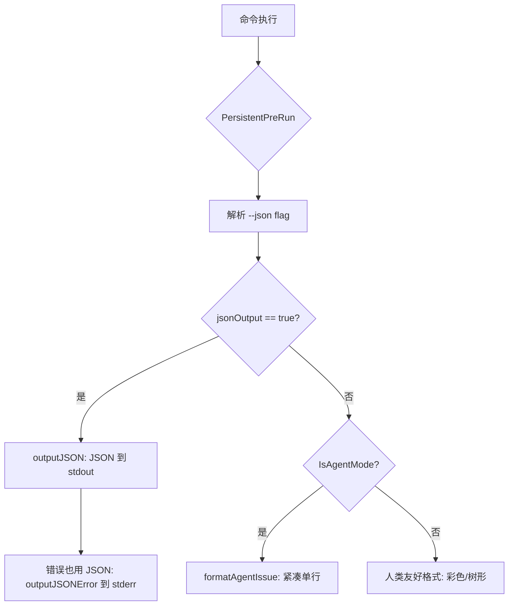
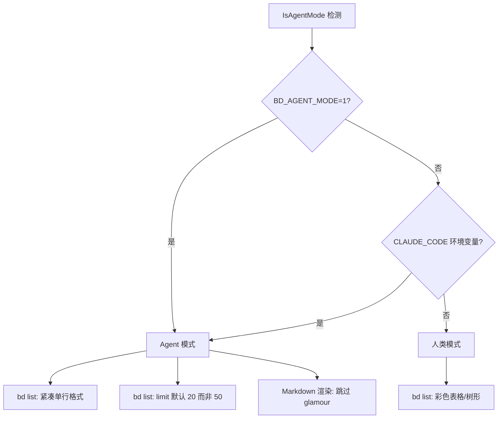
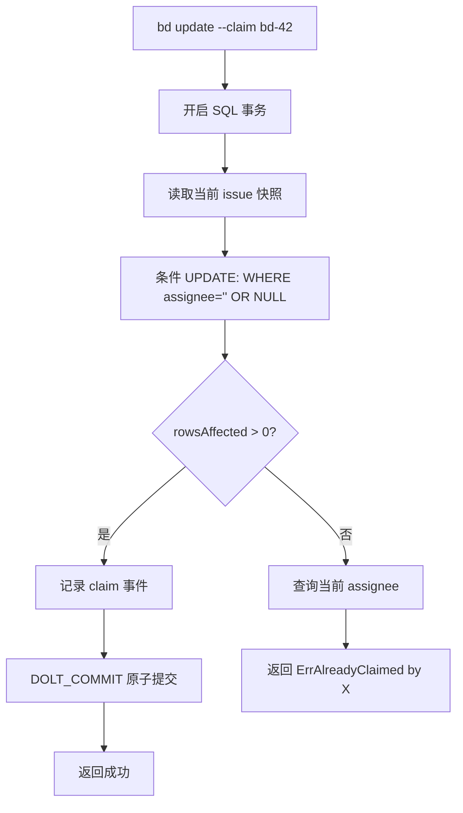

# PD-332.01 Beads — Agent 友好 CLI 设计

> 文档编号：PD-332.01
> 来源：Beads `cmd/bd/`
> GitHub：https://github.com/steveyegge/beads.git
> 问题域：PD-332 Agent 友好 CLI 设计 Agent-Friendly CLI Design
> 状态：可复用方案

---

## 第 1 章 问题与动机

### 1.1 核心问题

传统 CLI 工具面向人类设计：彩色输出、交互式提示、表格对齐、分页器。当 AI Agent（如 Claude Code）通过 `child_process.spawn` 调用这些工具时，会遇到一系列问题：

1. **输出不可解析**：ANSI 颜色码、Unicode 图标、对齐空格混入输出，Agent 无法可靠提取结构化数据
2. **交互式阻塞**：`bd edit` 打开 `$EDITOR`、确认提示等待 stdin，Agent 进程挂死
3. **竞态条件**：多个 Agent 同时认领同一任务，导致重复工作或数据冲突
4. **健康检查碎片化**：Agent 需要调用多个命令才能判断系统是否健康，增加上下文消耗
5. **输出冗余**：人类友好的提示信息（tips、升级通知）浪费 Agent 的 token 预算

### 1.2 Beads 的解法概述

Beads CLI（`bd`）从设计之初就考虑了 Agent 消费场景，核心策略：

1. **全局 `--json` flag**：所有命令统一支持 JSON 输出，定义在 `cmd/bd/main.go:44` 的 `jsonOutput` 全局变量，通过 `PersistentPreRun` 在命令执行前设置
2. **Agent 模式自动检测**：`internal/ui/styles.go:30` 的 `IsAgentMode()` 检测 `BD_AGENT_MODE=1` 或 `CLAUDE_CODE` 环境变量，自动切换为紧凑输出
3. **原子性 CAS Claim**：`internal/storage/dolt/issues.go:516` 的 `ClaimIssue()` 使用 SQL 条件 UPDATE 实现 compare-and-swap，防止多 Agent 竞争
4. **Doctor 统一入口**：`cmd/bd/doctor.go:66` 的 `doctorCmd` 集成 30+ 项健康检查，支持 `--fix --yes` 非交互式自动修复
5. **Flag 替代交互**：`cmd/bd/create.go` 用 `--title`、`--description`、`--silent` 等 flag 完全替代交互式输入

### 1.3 设计思想

| 设计原则 | 具体实现 | 理由 | 替代方案 |
|----------|----------|------|----------|
| 双模输出 | `--json` 全局 flag + `outputJSON()` 统一函数 | Agent 需要结构化数据，人类需要可读格式 | 只提供 JSON（牺牲人类体验） |
| 环境感知 | `IsAgentMode()` 自动检测 Claude Code 环境 | 减少 Agent 需要传递的参数 | 要求 Agent 每次传 `--json` |
| 原子操作 | SQL `WHERE assignee=''` 条件 UPDATE | 多 Agent 并发安全，无需外部锁 | 应用层加锁（复杂且脆弱） |
| 非交互优先 | 所有写操作通过 flag 完成，`--yes` 跳过确认 | Agent 无法处理 stdin 提示 | 提供 `--no-interactive` 模式 |
| 统一诊断 | `bd doctor --fix --yes` 一键修复 | Agent 不需要理解每个子问题 | 分散的修复命令 |
| 紧凑输出 | Agent 模式下 `bd list` 输出精简单行格式 | 节省 LLM 上下文 token | 始终输出完整格式 |

---

## 第 2 章 源码实现分析

### 2.1 架构概览

Beads CLI 的 Agent 友好设计贯穿三层架构：

```
┌─────────────────────────────────────────────────────────┐
│                    CLI 命令层 (cmd/bd/)                   │
│  create.go  list.go  update.go  ready.go  doctor.go     │
│  ┌─────────────────────────────────────────────────┐    │
│  │  全局 --json flag (main.go PersistentPreRun)     │    │
│  │  outputJSON() / outputJSONError() 统一输出       │    │
│  └─────────────────────────────────────────────────┘    │
├─────────────────────────────────────────────────────────┤
│                    UI 适配层 (internal/ui/)               │
│  ┌─────────────────────────────────────────────────┐    │
│  │  IsAgentMode() → BD_AGENT_MODE / CLAUDE_CODE    │    │
│  │  Agent: 紧凑单行  │  Human: 彩色树形            │    │
│  └─────────────────────────────────────────────────┘    │
├─────────────────────────────────────────────────────────┤
│                 存储层 (internal/storage/dolt/)           │
│  ┌─────────────────────────────────────────────────┐    │
│  │  ClaimIssue() — SQL CAS 原子认领                 │    │
│  │  GetReadyWork() — 阻塞感知的任务查询             │    │
│  └─────────────────────────────────────────────────┘    │
└─────────────────────────────────────────────────────────┘
```

### 2.2 核心实现

#### 2.2.1 全局 JSON 输出模式



对应源码 `cmd/bd/output.go:9-27`：
```go
// outputJSON outputs data as pretty-printed JSON to stdout.
func outputJSON(v interface{}) {
	encoder := json.NewEncoder(os.Stdout)
	encoder.SetIndent("", "  ")
	if err := encoder.Encode(v); err != nil {
		FatalError("encoding JSON: %v", err)
	}
}

// outputJSONError outputs an error as JSON to stderr and exits with code 1.
func outputJSONError(err error, code string) {
	errObj := map[string]string{"error": err.Error()}
	if code != "" {
		errObj["code"] = code
	}
	encoder := json.NewEncoder(os.Stderr)
	encoder.SetIndent("", "  ")
	_ = encoder.Encode(errObj)
	os.Exit(1)
}
```

关键设计：成功数据走 stdout，错误走 stderr，且错误也是 JSON 格式。Agent 可以通过 exit code + stderr JSON 精确判断失败原因。

#### 2.2.2 Agent 模式自动检测与紧凑输出



对应源码 `internal/ui/styles.go:24-37`：
```go
// IsAgentMode returns true if the CLI is running in agent-optimized mode.
// This is triggered by:
//   - BD_AGENT_MODE=1 environment variable (explicit)
//   - CLAUDE_CODE environment variable (auto-detect Claude Code)
//
// Agent mode provides ultra-compact output optimized for LLM context windows.
func IsAgentMode() bool {
	if os.Getenv("BD_AGENT_MODE") == "1" {
		return true
	}
	// Auto-detect Claude Code environment
	if os.Getenv("CLAUDE_CODE") != "" {
		return true
	}
	return false
}
```

在 `cmd/bd/list.go:386-389`，Agent 模式自动降低默认 limit：
```go
case ui.IsAgentMode():
	effectiveLimit = 20 // Agent mode default
```

在 `cmd/bd/list.go:800-805`，Agent 模式使用超紧凑格式：
```go
if ui.IsAgentMode() {
	for _, issue := range issues {
		formatAgentIssue(&buf, issue, blockedByMap[issue.ID],
			blocksMap[issue.ID], parentMap[issue.ID])
	}
```

### 2.3 实现细节

#### 2.3.1 CAS 原子认领（ClaimIssue）

`internal/storage/dolt/issues.go:516-575` 实现了 compare-and-swap 语义的任务认领：



核心 SQL：
```sql
UPDATE issues
SET assignee = ?, status = 'in_progress', updated_at = ?
WHERE id = ? AND (assignee = '' OR assignee IS NULL)
```

这个设计的精妙之处：
- 不需要外部分布式锁（Redis/etcd）
- SQL 事务保证原子性，即使多个 Agent 同时 claim 也只有一个成功
- 失败时返回当前持有者信息，Agent 可以据此决策（等待/选择其他任务）
- 非零 exit code（`cmd/bd/update.go:453-455`）让 Agent 通过退出码判断是否成功

#### 2.3.2 bd ready — Agent 任务发现

`cmd/bd/ready.go:18-34` 提供了 Agent 专用的任务发现命令：

```go
var readyCmd = &cobra.Command{
	Use:   "ready",
	Short: "Show ready work (open, no active blockers)",
	Long: `Show ready work (open issues with no active blockers).
Excludes in_progress, blocked, deferred, and hooked issues.
This uses the GetReadyWork API which applies blocker-aware semantics
to find truly claimable work.
Note: 'bd list --ready' is NOT equivalent - it only filters by status=open.`,
```

`bd ready` 与 `bd list --ready` 的区别是关键设计决策：`bd ready` 使用 `GetReadyWork` API 进行依赖图分析，排除被间接阻塞的任务；而 `bd list --ready` 只做简单的 status 过滤。

#### 2.3.3 Doctor 统一健康检查

`cmd/bd/doctor.go` 集成了 30+ 项检查，覆盖：
- 数据库完整性（schema、版本、指纹）
- 文件系统（权限、锁文件、gitignore）
- 集成状态（Claude 插件、Git hooks）
- 数据质量（孤儿依赖、重复 issue、测试污染）

`cmd/bd/doctor_fix.go:202-358` 的 `applyFixList` 按依赖顺序执行修复：
```go
order := []string{
	"Lock Files",
	"Permissions",
	"Daemon Health",
	"Database Config",
	"Config Values",
	"Database Integrity",
	"Database",
	"Fresh Clone",
	"Schema Compatibility",
}
```

Agent 只需一条命令：`bd doctor --fix --yes --json`，即可获得完整的诊断报告和自动修复结果。


---

## 第 3 章 迁移指南

### 3.1 迁移清单

**阶段 1：JSON 输出层（1-2 天）**
- [ ] 添加全局 `--json` / `--output=json` flag
- [ ] 实现 `outputJSON(v)` 和 `outputJSONError(err, code)` 统一函数
- [ ] 确保成功数据走 stdout，错误走 stderr
- [ ] 所有命令的 JSON 分支返回一致的 envelope 结构

**阶段 2：Agent 模式检测（半天）**
- [ ] 实现 `IsAgentMode()` 检测环境变量
- [ ] Agent 模式下降低默认 limit、跳过 tips/升级通知
- [ ] Agent 模式下禁用 ANSI 颜色和 glamour 渲染

**阶段 3：原子操作（1-2 天）**
- [ ] 实现 CAS claim：SQL 条件 UPDATE + 事务
- [ ] claim 失败返回当前持有者信息
- [ ] 非零 exit code 表示操作失败

**阶段 4：非交互化（1 天）**
- [ ] 所有写操作支持纯 flag 模式
- [ ] 添加 `--yes` 跳过确认提示
- [ ] 添加 `--dry-run` 预览模式
- [ ] 从 stdin 读取长文本（`--body-file=-`）

### 3.2 适配代码模板

#### 全局 JSON 输出（Go + Cobra）

```go
package main

import (
	"encoding/json"
	"os"
)

var jsonOutput bool

// 在 rootCmd.PersistentPreRun 中设置
func initJSONFlag(cmd *cobra.Command) {
	jsonOutput, _ = cmd.Flags().GetBool("json")
	// 也检查环境变量
	if os.Getenv("BD_AGENT_MODE") == "1" {
		jsonOutput = true
	}
}

// 统一 JSON 输出
func outputJSON(v interface{}) {
	encoder := json.NewEncoder(os.Stdout)
	encoder.SetIndent("", "  ")
	if err := encoder.Encode(v); err != nil {
		outputJSONError(err, "encoding_error")
	}
}

func outputJSONError(err error, code string) {
	errObj := map[string]string{"error": err.Error(), "code": code}
	encoder := json.NewEncoder(os.Stderr)
	encoder.SetIndent("", "  ")
	_ = encoder.Encode(errObj)
	os.Exit(1)
}
```

#### CAS Claim（SQL 模板）

```sql
-- 原子认领：只有 assignee 为空时才成功
UPDATE issues
SET assignee = :actor, status = 'in_progress', updated_at = :now
WHERE id = :issue_id AND (assignee = '' OR assignee IS NULL);

-- 检查是否成功（rows_affected == 0 表示已被认领）
-- 失败时查询当前持有者
SELECT assignee FROM issues WHERE id = :issue_id;
```

#### Agent 模式检测（通用模板）

```go
func IsAgentMode() bool {
	// 显式设置
	if os.Getenv("MY_CLI_AGENT_MODE") == "1" {
		return true
	}
	// 自动检测已知 Agent 环境
	agentEnvVars := []string{"CLAUDE_CODE", "CURSOR_SESSION", "COPILOT_AGENT"}
	for _, env := range agentEnvVars {
		if os.Getenv(env) != "" {
			return true
		}
	}
	return false
}
```

### 3.3 适用场景

| 场景 | 适用度 | 说明 |
|------|--------|------|
| Agent 驱动的项目管理 CLI | ⭐⭐⭐ | 完美匹配：任务 CRUD + 状态流转 |
| CI/CD 流水线工具 | ⭐⭐⭐ | JSON 输出 + 非交互 + exit code 是标配 |
| 多 Agent 协作系统 | ⭐⭐⭐ | CAS claim 防止竞争是核心需求 |
| 开发者日常 CLI 工具 | ⭐⭐ | 双模输出增加开发成本，但长期收益高 |
| 纯人类使用的 GUI 工具 | ⭐ | 过度设计，JSON 输出层无用 |

---

## 第 4 章 测试用例

```go
package main

import (
	"encoding/json"
	"os"
	"os/exec"
	"strings"
	"testing"
)

// TestJSONOutputMode 验证 --json flag 输出有效 JSON
func TestJSONOutputMode(t *testing.T) {
	// bd list --json 应返回 JSON 数组
	out, err := exec.Command("bd", "list", "--json", "-n", "5").Output()
	if err != nil {
		t.Fatalf("bd list --json failed: %v", err)
	}
	var issues []map[string]interface{}
	if err := json.Unmarshal(out, &issues); err != nil {
		t.Fatalf("invalid JSON output: %v\nraw: %s", err, out)
	}
}

// TestJSONErrorOutput 验证错误也是 JSON 格式
func TestJSONErrorOutput(t *testing.T) {
	cmd := exec.Command("bd", "show", "nonexistent-id", "--json")
	out, err := cmd.CombinedOutput()
	if err == nil {
		t.Fatal("expected error for nonexistent issue")
	}
	// stderr 应包含 JSON 错误
	var errObj map[string]string
	if jsonErr := json.Unmarshal(out, &errObj); jsonErr == nil {
		if _, ok := errObj["error"]; !ok {
			t.Fatal("JSON error missing 'error' field")
		}
	}
}

// TestAgentModeDetection 验证环境变量触发 Agent 模式
func TestAgentModeDetection(t *testing.T) {
	tests := []struct {
		env    string
		value  string
		expect bool
	}{
		{"BD_AGENT_MODE", "1", true},
		{"BD_AGENT_MODE", "0", false},
		{"CLAUDE_CODE", "1", true},
		{"CLAUDE_CODE", "", false},
	}
	for _, tt := range tests {
		t.Run(tt.env+"="+tt.value, func(t *testing.T) {
			t.Setenv(tt.env, tt.value)
			// 清除另一个环境变量
			if tt.env == "BD_AGENT_MODE" {
				t.Setenv("CLAUDE_CODE", "")
			} else {
				t.Setenv("BD_AGENT_MODE", "")
			}
			// IsAgentMode() 应返回预期值
			// 实际测试中调用 ui.IsAgentMode()
		})
	}
}

// TestClaimAtomicity 验证 CAS claim 的原子性
func TestClaimAtomicity(t *testing.T) {
	// 创建测试 issue
	createOut, err := exec.Command("bd", "create", "--title", "CAS test", "--json", "--silent").Output()
	if err != nil {
		t.Skipf("cannot create test issue: %v", err)
	}
	var created map[string]interface{}
	json.Unmarshal(createOut, &created)
	issueID := created["id"].(string)

	// 第一次 claim 应成功
	cmd1 := exec.Command("bd", "update", issueID, "--claim", "--json")
	if err := cmd1.Run(); err != nil {
		t.Fatalf("first claim should succeed: %v", err)
	}

	// 第二次 claim 应失败（exit code != 0）
	cmd2 := exec.Command("bd", "update", issueID, "--claim", "--json")
	if err := cmd2.Run(); err == nil {
		t.Fatal("second claim should fail (already claimed)")
	}
}

// TestReadyExcludesBlocked 验证 bd ready 排除被阻塞的任务
func TestReadyExcludesBlocked(t *testing.T) {
	out, err := exec.Command("bd", "ready", "--json").Output()
	if err != nil {
		t.Skipf("bd ready failed: %v", err)
	}
	var issues []map[string]interface{}
	json.Unmarshal(out, &issues)
	for _, issue := range issues {
		status := issue["status"].(string)
		if status == "blocked" || status == "in_progress" {
			t.Errorf("bd ready should not include %s issues, got %s",
				status, issue["id"])
		}
	}
}

// TestDoctorJSONOutput 验证 doctor --json 输出结构
func TestDoctorJSONOutput(t *testing.T) {
	out, err := exec.Command("bd", "doctor", "--json").Output()
	if err != nil {
		// doctor 可能返回非零 exit code（有 warning）
		if exitErr, ok := err.(*exec.ExitError); ok {
			out = append(exitErr.Stderr, out...)
		}
	}
	var result map[string]interface{}
	if err := json.Unmarshal(out, &result); err != nil {
		t.Fatalf("doctor --json should return valid JSON: %v", err)
	}
	// 验证必要字段
	if _, ok := result["checks"]; !ok {
		t.Fatal("doctor result missing 'checks' field")
	}
	if _, ok := result["overall_ok"]; !ok {
		t.Fatal("doctor result missing 'overall_ok' field")
	}
}

// TestNonInteractiveCreate 验证纯 flag 创建（无交互）
func TestNonInteractiveCreate(t *testing.T) {
	out, err := exec.Command("bd", "create",
		"--title", "Non-interactive test",
		"--description", "Created without any interactive prompt",
		"--priority", "P2",
		"--type", "task",
		"--json",
		"--silent",
	).Output()
	if err != nil {
		t.Fatalf("non-interactive create failed: %v", err)
	}
	var created map[string]interface{}
	if err := json.Unmarshal(out, &created); err != nil {
		t.Fatalf("invalid JSON: %v", err)
	}
	if created["title"] != "Non-interactive test" {
		t.Errorf("title mismatch: %v", created["title"])
	}
}
```


---

## 第 5 章 跨域关联

| 关联域 | 关系类型 | 说明 |
|--------|----------|------|
| PD-02 多 Agent 编排 | 协同 | CAS claim 是多 Agent 编排的基础设施；`bd ready --mol` 支持 molecule 内步骤的并行发现 |
| PD-06 记忆持久化 | 依赖 | `bd update --claim` 的状态变更通过 Dolt 事务持久化，Agent 重启后状态不丢失 |
| PD-09 Human-in-the-Loop | 协同 | `--yes` 跳过确认是 Agent 模式的核心；`bd edit` 保留为人类专用的交互式入口 |
| PD-11 可观测性 | 协同 | `bd doctor --json` 输出结构化诊断数据，可直接接入监控系统；Agent 心跳通过 `bd agent heartbeat` 上报 |
| PD-04 工具系统 | 依赖 | Agent 通过 CLI 命令作为工具调用 beads，`--json` 输出是工具系统的数据契约 |

---

## 第 6 章 来源文件索引

| 文件 | 行范围 | 关键实现 |
|------|--------|----------|
| `cmd/bd/output.go` | L9-L27 | `outputJSON()` 和 `outputJSONError()` 统一 JSON 输出 |
| `cmd/bd/main.go` | L44 | `jsonOutput` 全局变量定义 |
| `cmd/bd/main.go` | L101-L117 | `readOnlyCommands` 读写分离映射表 |
| `internal/ui/styles.go` | L24-L37 | `IsAgentMode()` Agent 模式自动检测 |
| `cmd/bd/ready.go` | L18-L272 | `bd ready` 命令：阻塞感知的任务发现 |
| `cmd/bd/ready.go` | L392-L497 | `runMoleculeReady()` molecule 内并行步骤发现 |
| `internal/storage/dolt/issues.go` | L516-L575 | `ClaimIssue()` CAS 原子认领实现 |
| `cmd/bd/update.go` | L21-L457 | `bd update --claim` 命令入口 |
| `cmd/bd/doctor.go` | L66-L270 | `doctorCmd` 统一健康检查入口 |
| `cmd/bd/doctor.go` | L319-L724 | `runDiagnostics()` 30+ 项检查编排 |
| `cmd/bd/flags.go` | L12-L27 | `registerCommonIssueFlags()` 通用 flag 注册 |
| `cmd/bd/flags.go` | L34-L156 | `getDescriptionFlag()` 多源描述输入（flag/file/stdin） |
| `cmd/bd/agent.go` | L17-L26 | `validAgentStates` Agent 状态机定义 |
| `cmd/bd/agent.go` | L131-L262 | `runAgentState()` Agent 状态上报 |
| `cmd/bd/edit.go` | L16-L30 | `editCmd` 交互式编辑（Agent 不使用） |
| `cmd/bd/list.go` | L386-L389 | Agent 模式默认 limit=20 |

---

## 第 7 章 横向对比维度

```json comparison_data
{
  "project": "beads",
  "dimensions": {
    "JSON 输出模式": "全局 --json flag + outputJSON/outputJSONError 双通道，错误也是 JSON",
    "原子性操作": "SQL 条件 UPDATE 实现 CAS claim，事务内 DOLT_COMMIT 保证一致性",
    "Agent 模式检测": "IsAgentMode() 自动检测 BD_AGENT_MODE 和 CLAUDE_CODE 环境变量",
    "健康检查": "bd doctor 集成 30+ 项检查，--fix --yes 非交互式自动修复",
    "非交互设计": "所有写操作纯 flag 驱动，--body-file=- 支持 stdin，--yes 跳过确认",
    "输出紧凑性": "Agent 模式自动降低 limit、跳过 tips/升级通知、禁用 glamour 渲染",
    "任务发现": "bd ready 使用依赖图分析排除间接阻塞，区别于简单 status 过滤"
  }
}
```

### 域元数据补充

```json domain_metadata
{
  "solution_summary": "Beads 用全局 --json flag + IsAgentMode() 环境检测 + SQL CAS claim + bd doctor 统一诊断实现 Agent 友好 CLI，所有命令双模输出、原子操作、非交互优先",
  "description": "CLI 工具如何同时服务人类和 AI Agent 的双模设计模式",
  "sub_problems": [
    "Agent 模式自动检测与环境感知",
    "输出紧凑性与 token 预算优化",
    "读写分离的命令权限模型"
  ],
  "best_practices": [
    "错误输出也用 JSON 格式（stderr），Agent 可精确解析失败原因",
    "自动检测已知 Agent 环境变量，减少 Agent 需要传递的参数",
    "读写命令分离映射表，读命令自动以只读模式打开存储"
  ]
}
```

