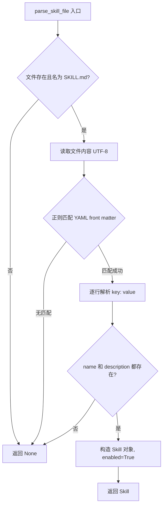
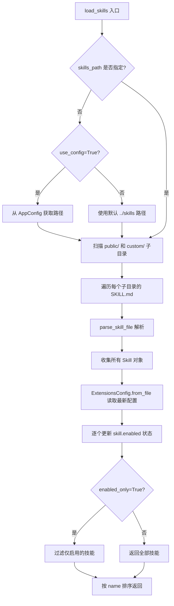

# PD-333.01 DeerFlow — Markdown 驱动三层渐进式技能系统

> 文档编号：PD-333.01
> 来源：DeerFlow 2.0 `backend/src/skills/`, `skills/public/`
> GitHub：https://github.com/bytedance/deer-flow.git
> 问题域：PD-333 技能系统 Skill System
> 状态：可复用方案

---

## 第 1 章 问题与动机（Problem & Motivation）

### 1.1 核心问题

Agent 系统需要一种可扩展的能力模块化机制：如何让 Agent 在不修改核心代码的前提下获得新的领域专长？传统做法是把所有指令塞进 system prompt，但这会导致上下文窗口爆炸——每个技能的完整指令可能数千 token，而 Agent 同时可能有 15+ 个技能可用。

核心矛盾：**技能数量增长 vs 上下文窗口有限**。

### 1.2 DeerFlow 的解法概述

DeerFlow 2.0 实现了一套完整的 Markdown 驱动技能系统，核心设计：

1. **SKILL.md 作为唯一入口** — 每个技能是一个目录，包含 `SKILL.md`（YAML front matter + Markdown body），无需代码注册（`backend/src/skills/parser.py:7-64`）
2. **三层渐进式加载** — 元数据（~100 words）始终在 prompt 中；SKILL.md body 仅在触发时加载；bundled resources（scripts/references/assets）按需读取（`backend/src/agents/lead_agent/prompt.py:336-350`）
3. **public/custom 双分类** — 技能按 `public`（官方）和 `custom`（用户自建）分类管理，目录扫描自动发现（`backend/src/skills/loader.py:57-73`）
4. **ExtensionsConfig 统一管控** — 技能启用状态与 MCP Server 配置统一在 `extensions_config.json` 中管理，支持热更新（`backend/src/config/extensions_config.py:31-43`）
5. **容器路径映射** — 技能目录挂载到沙箱容器的 `/mnt/skills` 路径，Agent 通过容器路径访问技能文件（`backend/src/skills/types.py:22-44`）

### 1.3 设计思想

| 设计原则 | 具体实现 | 理由 | 替代方案 |
|----------|----------|------|----------|
| Markdown 即配置 | SKILL.md YAML front matter 定义元数据 | 零代码门槛，任何人都能创建技能 | JSON Schema / Python 装饰器注册 |
| 渐进式披露 | 三层加载：metadata → body → resources | 上下文窗口是公共资源，按需消费 | 全量注入所有技能内容 |
| 约定优于配置 | 目录名 = 技能名，SKILL.md = 入口 | 无需注册表，文件系统即注册表 | 中心化 registry.yaml |
| 关注点分离 | 技能定义（SKILL.md）与启用状态（extensions_config.json）分离 | 技能内容不可变，状态可变 | 在 SKILL.md 中加 enabled 字段 |
| 沙箱隔离 | 技能通过 /mnt/skills 容器路径访问 | 技能脚本在沙箱中执行，宿主安全 | 直接暴露宿主文件系统路径 |

---

## 第 2 章 源码实现分析（Source Code Analysis）

### 2.1 架构概览

DeerFlow 技能系统由 4 个核心模块组成：

```
┌─────────────────────────────────────────────────────────────┐
│                    Lead Agent Prompt                         │
│  ┌─────────────────────────────────────────────────────┐    │
│  │ <skill_system>                                       │    │
│  │   <available_skills>                                 │    │
│  │     <skill>                                          │    │
│  │       <name>deep-research</name>                     │    │
│  │       <description>...</description>                 │    │
│  │       <location>/mnt/skills/public/deep-research/    │    │
│  │                  SKILL.md</location>                  │    │
│  │     </skill>                                         │    │
│  │   </available_skills>                                │    │
│  └─────────────────────────────────────────────────────┘    │
│         ↑ 仅注入 name + description + location              │
└─────────────────────────────────────────────────────────────┘
          │ Agent 触发时 read_file(location)
          ↓
┌─────────────────────────────────────────────────────────────┐
│  skills/                                                     │
│  ├── public/                                                 │
│  │   ├── deep-research/                                      │
│  │   │   └── SKILL.md  ← YAML front matter + Markdown body  │
│  │   ├── skill-creator/                                      │
│  │   │   ├── SKILL.md                                        │
│  │   │   ├── scripts/   ← init_skill.py, package_skill.py   │
│  │   │   └── references/ ← workflows.md, output-patterns.md │
│  │   └── ...（15+ public skills）                            │
│  └── custom/             ← 用户自建技能                      │
└─────────────────────────────────────────────────────────────┘
          ↑ 扫描发现
┌─────────────────────────────────────────────────────────────┐
│  Backend Core                                                │
│  ├── skills/loader.py    ← load_skills() 目录扫描            │
│  ├── skills/parser.py    ← parse_skill_file() YAML 解析      │
│  ├── skills/types.py     ← Skill dataclass + 容器路径映射    │
│  ├── config/skills_config.py      ← SkillsConfig Pydantic    │
│  ├── config/extensions_config.py  ← ExtensionsConfig 统一管控│
│  └── gateway/routers/skills.py    ← REST API CRUD + Install  │
└─────────────────────────────────────────────────────────────┘
```

### 2.2 核心实现

#### 2.2.1 SKILL.md 解析器



对应源码 `backend/src/skills/parser.py:7-64`：

```python
def parse_skill_file(skill_file: Path, category: str) -> Skill | None:
    if not skill_file.exists() or skill_file.name != "SKILL.md":
        return None
    try:
        content = skill_file.read_text(encoding="utf-8")
        # 正则提取 YAML front matter
        front_matter_match = re.match(r"^---\s*\n(.*?)\n---\s*\n", content, re.DOTALL)
        if not front_matter_match:
            return None
        front_matter = front_matter_match.group(1)
        # 简单 key:value 解析（不依赖 PyYAML）
        metadata = {}
        for line in front_matter.split("\n"):
            line = line.strip()
            if not line:
                continue
            if ":" in line:
                key, value = line.split(":", 1)
                metadata[key.strip()] = value.strip()
        name = metadata.get("name")
        description = metadata.get("description")
        if not name or not description:
            return None
        return Skill(
            name=name, description=description,
            license=metadata.get("license"),
            skill_dir=skill_file.parent, skill_file=skill_file,
            category=category, enabled=True,
        )
    except Exception as e:
        print(f"Error parsing skill file {skill_file}: {e}")
        return None
```

关键设计：parser 使用简单的 `str.split(":", 1)` 而非 PyYAML 库解析 front matter，减少依赖。但 Gateway 层的验证器（`gateway/routers/skills.py:88-93`）使用 `yaml.safe_load` 做严格校验。

#### 2.2.2 技能加载与状态合并



对应源码 `backend/src/skills/loader.py:21-97`：

```python
def load_skills(skills_path: Path | None = None, use_config: bool = True,
                enabled_only: bool = False) -> list[Skill]:
    if skills_path is None:
        if use_config:
            try:
                from src.config import get_app_config
                config = get_app_config()
                skills_path = config.skills.get_skills_path()
            except Exception:
                skills_path = get_skills_root_path()
        else:
            skills_path = get_skills_root_path()
    if not skills_path.exists():
        return []
    skills = []
    for category in ["public", "custom"]:
        category_path = skills_path / category
        if not category_path.exists() or not category_path.is_dir():
            continue
        for skill_dir in category_path.iterdir():
            if not skill_dir.is_dir():
                continue
            skill_file = skill_dir / "SKILL.md"
            if not skill_file.exists():
                continue
            skill = parse_skill_file(skill_file, category=category)
            if skill:
                skills.append(skill)
    # 关键：每次从磁盘重新读取配置，确保跨进程一致性
    try:
        from src.config.extensions_config import ExtensionsConfig
        extensions_config = ExtensionsConfig.from_file()
        for skill in skills:
            skill.enabled = extensions_config.is_skill_enabled(skill.name, skill.category)
    except Exception as e:
        print(f"Warning: Failed to load extensions config: {e}")
    if enabled_only:
        skills = [skill for skill in skills if skill.enabled]
    skills.sort(key=lambda s: s.name)
    return skills
```

注意 `loader.py:76-79` 的注释：使用 `ExtensionsConfig.from_file()` 而非缓存的 `get_extensions_config()`，因为 Gateway API 和 LangGraph Server 运行在不同进程中，必须每次从磁盘读取最新配置。

### 2.3 实现细节

#### 2.3.1 渐进式加载的 Prompt 注入

技能注入到 Agent prompt 的关键在 `backend/src/agents/lead_agent/prompt.py:312-350`：

```python
def get_skills_prompt_section() -> str:
    skills = load_skills(enabled_only=True)
    # ...
    skill_items = "\n".join(
        f"    <skill>\n        <name>{skill.name}</name>\n"
        f"        <description>{skill.description}</description>\n"
        f"        <location>{skill.get_container_file_path(container_base_path)}"
        f"</location>\n    </skill>" for skill in skills
    )
    # 仅注入元数据，body 由 Agent 按需 read_file
```

Agent 收到的 prompt 中只有 `<name>` + `<description>` + `<location>`，约 100 words/skill。当用户请求匹配某个技能时，Agent 主动调用 `read_file(location)` 加载 SKILL.md body（第二层），再根据 body 中的引用按需加载 scripts/references（第三层）。

#### 2.3.2 技能启用状态的默认策略

`backend/src/config/extensions_config.py:152-166`：

```python
def is_skill_enabled(self, skill_name: str, skill_category: str) -> bool:
    skill_config = self.skills.get(skill_name)
    if skill_config is None:
        # 默认：public 和 custom 技能都启用
        return skill_category in ("public", "custom")
    return skill_config.enabled
```

未在配置文件中显式声明的技能默认启用——这是"约定优于配置"的体现。

#### 2.3.3 技能安装流程（.skill 包）

Gateway 提供 `POST /api/skills/install` 端点（`gateway/routers/skills.py:329-442`），支持从 `.skill` 文件（ZIP 格式）安装技能到 `custom/` 目录。安装流程包含严格的 front matter 验证：

- 名称必须 hyphen-case（`^[a-z0-9-]+$`），最长 64 字符
- 描述不能含 `<>` 角括号（防 XSS），最长 1024 字符
- 仅允许 5 个 front matter 属性：`name`, `description`, `license`, `allowed-tools`, `metadata`

#### 2.3.4 容器路径映射

`backend/src/skills/types.py:22-44` 定义了 Skill 到容器路径的映射：

```python
def get_container_file_path(self, container_base_path: str = "/mnt/skills") -> str:
    return f"{container_base_path}/{self.category}/{self.skill_dir.name}/SKILL.md"
```

宿主机路径 `skills/public/deep-research/SKILL.md` 映射为容器路径 `/mnt/skills/public/deep-research/SKILL.md`，Agent 只能通过容器路径访问，实现沙箱隔离。


---

## 第 3 章 迁移指南（Migration Guide）

### 3.1 迁移清单

**阶段 1：基础技能系统（1-2 天）**
- [ ] 定义 Skill 数据模型（name, description, category, enabled, path）
- [ ] 实现 SKILL.md 解析器（YAML front matter 提取）
- [ ] 实现目录扫描加载器（public/custom 双分类）
- [ ] 编写技能元数据注入到 system prompt 的逻辑

**阶段 2：状态管理与 API（1 天）**
- [ ] 实现 extensions_config.json 读写（技能启用/禁用）
- [ ] 添加 REST API：GET /skills, PUT /skills/{name}, POST /skills/install
- [ ] 实现 .skill 包（ZIP）的安装与验证

**阶段 3：渐进式加载（0.5 天）**
- [ ] 在 prompt 中仅注入 name + description + location
- [ ] 确保 Agent 可通过 read_file 按需加载 SKILL.md body
- [ ] 在 SKILL.md 中引用 scripts/references/assets 子目录

### 3.2 适配代码模板

以下是一个最小可运行的技能系统实现：

```python
"""minimal_skill_system.py — 可直接运行的技能系统核心"""
import re
from dataclasses import dataclass, field
from pathlib import Path
from typing import Optional


@dataclass
class Skill:
    name: str
    description: str
    category: str  # "public" or "custom"
    skill_dir: Path
    enabled: bool = True
    license: Optional[str] = None

    def get_container_path(self, base: str = "/mnt/skills") -> str:
        return f"{base}/{self.category}/{self.skill_dir.name}/SKILL.md"


def parse_skill_md(skill_file: Path, category: str) -> Optional[Skill]:
    """解析 SKILL.md 的 YAML front matter，提取 name 和 description"""
    if not skill_file.exists():
        return None
    content = skill_file.read_text(encoding="utf-8")
    match = re.match(r"^---\s*\n(.*?)\n---\s*\n", content, re.DOTALL)
    if not match:
        return None
    metadata = {}
    for line in match.group(1).split("\n"):
        line = line.strip()
        if ":" in line:
            k, v = line.split(":", 1)
            metadata[k.strip()] = v.strip()
    name = metadata.get("name")
    desc = metadata.get("description")
    if not name or not desc:
        return None
    return Skill(name=name, description=desc, category=category,
                 skill_dir=skill_file.parent, license=metadata.get("license"))


def load_all_skills(skills_root: Path, enabled_map: dict[str, bool] | None = None) -> list[Skill]:
    """扫描 public/ 和 custom/ 目录，加载所有技能"""
    skills = []
    for category in ["public", "custom"]:
        cat_dir = skills_root / category
        if not cat_dir.is_dir():
            continue
        for skill_dir in sorted(cat_dir.iterdir()):
            if not skill_dir.is_dir():
                continue
            skill = parse_skill_md(skill_dir / "SKILL.md", category)
            if skill:
                if enabled_map:
                    skill.enabled = enabled_map.get(skill.name, True)
                skills.append(skill)
    return sorted(skills, key=lambda s: s.name)


def build_skills_prompt(skills: list[Skill], container_base: str = "/mnt/skills") -> str:
    """生成注入到 system prompt 的技能元数据 XML"""
    enabled = [s for s in skills if s.enabled]
    if not enabled:
        return ""
    items = "\n".join(
        f'  <skill>\n    <name>{s.name}</name>\n'
        f'    <description>{s.description}</description>\n'
        f'    <location>{s.get_container_path(container_base)}</location>\n  </skill>'
        for s in enabled
    )
    return (
        "<skill_system>\n"
        "Progressive Loading: 1) Match skill by description → "
        "2) read_file(location) to load body → "
        "3) Load referenced resources as needed\n\n"
        f"<available_skills>\n{items}\n</available_skills>\n"
        "</skill_system>"
    )


# 使用示例
if __name__ == "__main__":
    root = Path("skills")
    skills = load_all_skills(root, enabled_map={"deprecated-skill": False})
    prompt_section = build_skills_prompt(skills)
    print(prompt_section)
```

### 3.3 适用场景

| 场景 | 适用度 | 说明 |
|------|--------|------|
| LLM Agent 能力扩展 | ⭐⭐⭐ | 核心场景，通过 SKILL.md 给 Agent 注入领域专长 |
| 多租户技能市场 | ⭐⭐⭐ | public/custom 分类天然支持官方 + 用户自建 |
| 上下文窗口受限的 Agent | ⭐⭐⭐ | 三层渐进式加载显著节省 token |
| 需要沙箱执行的场景 | ⭐⭐ | 容器路径映射提供隔离，但需要容器基础设施 |
| 非 LLM 的插件系统 | ⭐ | 该方案专为 LLM prompt 注入设计，传统插件系统不适用 |

---

## 第 4 章 测试用例（Test Cases）

```python
"""test_skill_system.py — 基于 DeerFlow 真实函数签名的测试"""
import json
import tempfile
from pathlib import Path

import pytest


# ---- 测试 parse_skill_md ----

class TestParseSkillFile:
    def _create_skill(self, tmp_path: Path, content: str) -> Path:
        skill_dir = tmp_path / "test-skill"
        skill_dir.mkdir()
        skill_file = skill_dir / "SKILL.md"
        skill_file.write_text(content)
        return skill_file

    def test_valid_skill(self, tmp_path):
        """正常路径：完整的 YAML front matter"""
        content = "---\nname: my-skill\ndescription: A test skill\nlicense: MIT\n---\n\n# My Skill\n"
        skill_file = self._create_skill(tmp_path, content)
        from minimal_skill_system import parse_skill_md
        skill = parse_skill_md(skill_file, category="public")
        assert skill is not None
        assert skill.name == "my-skill"
        assert skill.description == "A test skill"
        assert skill.license == "MIT"
        assert skill.category == "public"

    def test_missing_name(self, tmp_path):
        """边界：缺少 name 字段"""
        content = "---\ndescription: No name here\n---\n\n# Oops\n"
        skill_file = self._create_skill(tmp_path, content)
        from minimal_skill_system import parse_skill_md
        assert parse_skill_md(skill_file, category="public") is None

    def test_no_frontmatter(self, tmp_path):
        """边界：没有 YAML front matter"""
        content = "# Just a markdown file\nNo frontmatter here."
        skill_file = self._create_skill(tmp_path, content)
        from minimal_skill_system import parse_skill_md
        assert parse_skill_md(skill_file, category="public") is None

    def test_nonexistent_file(self, tmp_path):
        """降级：文件不存在"""
        from minimal_skill_system import parse_skill_md
        assert parse_skill_md(tmp_path / "ghost" / "SKILL.md", category="public") is None


# ---- 测试 load_all_skills ----

class TestLoadSkills:
    def _setup_skills(self, tmp_path: Path) -> Path:
        skills_root = tmp_path / "skills"
        for cat, names in [("public", ["alpha", "beta"]), ("custom", ["gamma"])]:
            for name in names:
                d = skills_root / cat / name
                d.mkdir(parents=True)
                (d / "SKILL.md").write_text(
                    f"---\nname: {name}\ndescription: Skill {name}\n---\n\n# {name}\n"
                )
        return skills_root

    def test_loads_all_categories(self, tmp_path):
        """正常路径：扫描 public + custom"""
        from minimal_skill_system import load_all_skills
        root = self._setup_skills(tmp_path)
        skills = load_all_skills(root)
        assert len(skills) == 3
        assert [s.name for s in skills] == ["alpha", "beta", "gamma"]

    def test_enabled_map_disables(self, tmp_path):
        """状态管理：通过 enabled_map 禁用技能"""
        from minimal_skill_system import load_all_skills
        root = self._setup_skills(tmp_path)
        skills = load_all_skills(root, enabled_map={"beta": False})
        beta = next(s for s in skills if s.name == "beta")
        assert beta.enabled is False

    def test_empty_directory(self, tmp_path):
        """降级：空目录返回空列表"""
        from minimal_skill_system import load_all_skills
        empty = tmp_path / "empty_skills"
        empty.mkdir()
        assert load_all_skills(empty) == []


# ---- 测试 build_skills_prompt ----

class TestBuildSkillsPrompt:
    def test_generates_xml(self):
        """正常路径：生成包含技能元数据的 XML"""
        from minimal_skill_system import Skill, build_skills_prompt
        skills = [Skill(name="test", description="A test", category="public",
                        skill_dir=Path("/skills/public/test"))]
        prompt = build_skills_prompt(skills)
        assert "<name>test</name>" in prompt
        assert "<description>A test</description>" in prompt
        assert "/mnt/skills/public/test/SKILL.md" in prompt

    def test_filters_disabled(self):
        """状态管理：禁用的技能不出现在 prompt 中"""
        from minimal_skill_system import Skill, build_skills_prompt
        skills = [
            Skill(name="on", description="Enabled", category="public",
                  skill_dir=Path("/s/public/on"), enabled=True),
            Skill(name="off", description="Disabled", category="public",
                  skill_dir=Path("/s/public/off"), enabled=False),
        ]
        prompt = build_skills_prompt(skills)
        assert "<name>on</name>" in prompt
        assert "<name>off</name>" not in prompt

    def test_empty_returns_empty(self):
        """降级：无技能时返回空字符串"""
        from minimal_skill_system import build_skills_prompt
        assert build_skills_prompt([]) == ""
```


---

## 第 5 章 跨域关联（Cross-Domain Relations）

| 关联域 | 关系类型 | 说明 |
|--------|----------|------|
| PD-01 上下文管理 | 协同 | 三层渐进式加载本质上是上下文窗口管理策略——仅注入元数据（~100 words/skill），避免 15+ 技能全量注入导致上下文爆炸 |
| PD-04 工具系统 | 依赖 | 技能通过 `read_file` 工具按需加载 SKILL.md body，技能中的 scripts/ 通过 `bash` 工具执行，技能系统依赖工具系统的基础能力 |
| PD-05 沙箱隔离 | 协同 | 技能目录挂载到容器 `/mnt/skills` 路径，技能脚本在沙箱中执行，两个域共同保障安全性 |
| PD-06 记忆持久化 | 互补 | 技能提供静态领域知识（SKILL.md），记忆系统提供动态运行时经验，两者共同构成 Agent 的知识体系 |
| PD-10 中间件管道 | 协同 | 技能元数据注入发生在 prompt 构建管道中（`apply_prompt_template` → `get_skills_prompt_section`），是管道的一个环节 |

---

## 第 6 章 来源文件索引（Source File Index）

| 文件 | 行范围 | 关键实现 |
|------|--------|----------|
| `backend/src/skills/types.py` | L1-L48 | Skill dataclass 定义，含 `get_container_path` 和 `get_container_file_path` 容器路径映射 |
| `backend/src/skills/parser.py` | L7-L64 | `parse_skill_file` — YAML front matter 正则解析，提取 name/description/license |
| `backend/src/skills/loader.py` | L21-L97 | `load_skills` — 目录扫描 + ExtensionsConfig 状态合并 + enabled_only 过滤 |
| `backend/src/config/skills_config.py` | L6-L49 | `SkillsConfig` Pydantic 模型，定义 skills path 和 container_path 配置 |
| `backend/src/config/extensions_config.py` | L31-L226 | `ExtensionsConfig` — 统一管理 MCP servers + skills 启用状态，含 singleton 缓存和热重载 |
| `backend/src/agents/lead_agent/prompt.py` | L312-L392 | `get_skills_prompt_section` — 渐进式加载的 prompt 注入逻辑，仅注入 name+description+location |
| `backend/src/gateway/routers/skills.py` | L1-L443 | Skills REST API — list/get/update/install 四个端点，含 .skill 包安装和 front matter 严格验证 |
| `skills/public/skill-creator/SKILL.md` | L1-L357 | 技能创建指南 — 定义了三层渐进式披露原则和 SKILL.md 编写规范 |
| `skills/public/skill-creator/scripts/init_skill.py` | L1-L303 | 技能初始化脚本 — 生成模板目录结构（SKILL.md + scripts/ + references/ + assets/） |
| `skills/public/skill-creator/scripts/package_skill.py` | L1-L111 | 技能打包脚本 — 验证 + ZIP 打包为 .skill 分发文件 |
| `skills/public/skill-creator/scripts/quick_validate.py` | L1-L95 | 技能验证脚本 — front matter 格式校验（名称规范、描述长度、属性白名单） |
| `extensions_config.example.json` | L1-L54 | 配置示例 — 展示 mcpServers + skills 的 JSON 结构 |

---

## 第 7 章 横向对比维度（Cross-Project Comparison）

```json comparison_data
{
  "project": "DeerFlow",
  "dimensions": {
    "技能定义格式": "SKILL.md YAML front matter + Markdown body，零代码门槛",
    "加载策略": "三层渐进式：metadata 常驻 → body 触发加载 → resources 按需读取",
    "分类管理": "public/custom 双目录，文件系统即注册表，无中心化 registry",
    "启用状态管理": "extensions_config.json 统一管控，与 MCP Server 配置同文件",
    "技能分发": ".skill ZIP 包 + REST API 安装，含 front matter 严格验证",
    "沙箱映射": "/mnt/skills 容器路径挂载，Agent 仅通过容器路径访问",
    "技能创建工具链": "init_skill.py → 开发 → quick_validate.py → package_skill.py 完整流水线"
  }
}
```

### 域元数据补充

```json domain_metadata
{
  "solution_summary": "DeerFlow 用 SKILL.md YAML front matter 定义技能元数据，三层渐进式加载（metadata→body→resources）节省上下文，ExtensionsConfig 统一管控启用状态，.skill ZIP 包支持分发安装",
  "description": "技能的完整生命周期管理：创建、验证、打包、分发、安装",
  "sub_problems": [
    "技能分发与安装（.skill ZIP 包格式）",
    "技能 front matter 安全验证（XSS 防护、属性白名单）",
    "跨进程配置一致性（Gateway vs LangGraph Server）",
    "技能创建工具链（init → validate → package）"
  ],
  "best_practices": [
    "技能内容与启用状态分离存储",
    "默认启用策略（未声明的 public/custom 技能自动启用）",
    "三层渐进式披露控制上下文消耗",
    "front matter 属性白名单防止注入"
  ]
}
```

