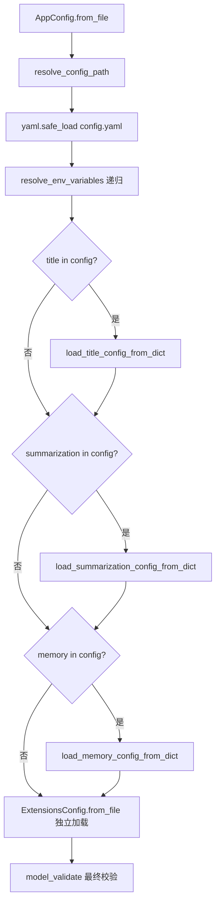
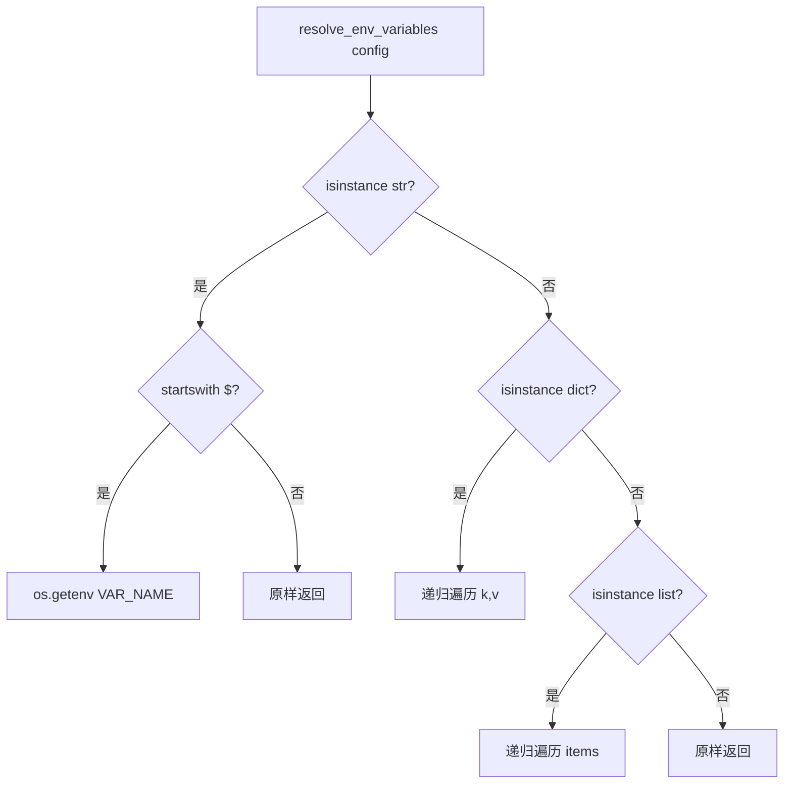

# PD-334.01 DeerFlow — 分层 Pydantic 配置与反射驱动组件加载

> 文档编号：PD-334.01
> 来源：DeerFlow `backend/src/config/app_config.py`
> GitHub：https://github.com/bytedance/deer-flow.git
> 问题域：PD-334 配置管理 Configuration Management
> 状态：可复用方案

---

## 第 1 章 问题与动机

### 1.1 核心问题

Agent 应用的配置管理面临三重挑战：

1. **多关注点分离** — 模型、工具、沙箱、MCP 扩展、记忆、摘要等子系统各有独立配置需求，混在一起难以维护
2. **运行时动态性** — MCP 服务器和技能状态需要通过 API 热更新，不能每次都重启进程
3. **环境适配** — 同一份配置文件需要在开发/测试/生产环境间切换，敏感信息（API Key）不能硬编码

传统做法要么用一个巨大的 `.env` 文件（缺乏结构），要么用 JSON Schema（缺乏类型安全），都无法同时满足类型校验、环境变量注入和热重载。

### 1.2 DeerFlow 的解法概述

DeerFlow 2.0 采用**双文件分层配置 + Pydantic 类型安全 + 反射驱动组件加载**的架构：

1. **双文件分离** — `config.yaml`（YAML）管理应用核心配置（模型/工具/沙箱/摘要/记忆/标题），`extensions_config.json`（JSON）管理 MCP 和技能状态，两者独立加载互不干扰（`app_config.py:90-92`）
2. **Pydantic 强类型** — 每个子系统一个 `BaseModel`（共 10 个配置类），字段带 `Field` 约束（`ge`/`le`/`default`），加载时自动校验（`memory_config.py:6-48`）
3. **递归环境变量解析** — `$VAR` 语法在 YAML 和 JSON 中均可用，递归遍历 dict/list 结构自动替换（`app_config.py:98-117`）
4. **多路径回退查找** — 配置文件按优先级查找：参数指定 → 环境变量 → CWD → 父目录 → 兼容旧文件名（`extensions_config.py:46-93`）
5. **单例缓存 + 热重载** — 全局 `_app_config` 单例避免重复解析，`reload_app_config()` / `reload_extensions_config()` 支持运行时刷新（`app_config.py:153-206`）

### 1.3 设计思想

| 设计原则 | 具体实现 | 理由 | 替代方案 |
|----------|----------|------|----------|
| 关注点分离 | YAML（应用配置）+ JSON（扩展配置）双文件 | 应用配置变更频率低，扩展配置需 API 热更新 | 单文件 YAML（扩展更新需重写整个文件） |
| 类型安全 | 10 个 Pydantic BaseModel + Field 约束 | 加载时即校验，IDE 自动补全 | TypedDict（无运行时校验） |
| 反射加载 | `use: "module:ClassName"` + `resolve_class()` | 配置文件声明组件，运行时动态实例化 | 硬编码 if-else 分支 |
| 环境隔离 | `$VAR` 语法 + `dotenv` 自动加载 | 敏感信息不入库，环境间零修改切换 | 多份配置文件（维护成本高） |
| 渐进式发现 | 多路径回退 + 旧文件名兼容 | 降低用户配置门槛，向后兼容 | 强制指定路径（新用户体验差） |

---

## 第 2 章 源码实现分析

### 2.1 架构概览

DeerFlow 的配置系统由 10 个 Pydantic 模型组成，通过 `AppConfig` 聚合为统一入口：

```
┌─────────────────────────────────────────────────────────┐
│                    AppConfig (聚合根)                      │
│  config.yaml ──→ from_file() ──→ Pydantic 校验           │
├─────────────────────────────────────────────────────────┤
│  models: list[ModelConfig]     ← 模型供应商声明           │
│  tools: list[ToolConfig]       ← 工具 use 路径声明        │
│  tool_groups: list[ToolGroupConfig]                      │
│  sandbox: SandboxConfig        ← 沙箱容器配置             │
│  skills: SkillsConfig          ← 技能目录路径             │
│  extensions: ExtensionsConfig  ← MCP + 技能状态           │
├─────────────────────────────────────────────────────────┤
│  副作用加载（from_file 内部）：                             │
│  ├─ TitleConfig      → load_title_config_from_dict()     │
│  ├─ SummarizationConfig → load_summarization_config_from_dict() │
│  └─ MemoryConfig     → load_memory_config_from_dict()    │
└─────────────────────────────────────────────────────────┘
         ↕ 单例缓存                    ↕ 反射加载
┌──────────────────┐        ┌──────────────────────────┐
│ get_app_config() │        │ resolve_class/variable() │
│ reload_app_config│        │ "module:Class" → 实例     │
│ reset_app_config │        └──────────────────────────┘
└──────────────────┘
```

### 2.2 核心实现

#### 2.2.1 双文件加载与副作用分发



对应源码 `backend/src/config/app_config.py:61-95`：

```python
@classmethod
def from_file(cls, config_path: str | None = None) -> Self:
    resolved_path = cls.resolve_config_path(config_path)
    with open(resolved_path) as f:
        config_data = yaml.safe_load(f)
    config_data = cls.resolve_env_variables(config_data)

    # 副作用：将 YAML 中的子配置分发到各自的全局单例
    if "title" in config_data:
        load_title_config_from_dict(config_data["title"])
    if "summarization" in config_data:
        load_summarization_config_from_dict(config_data["summarization"])
    if "memory" in config_data:
        load_memory_config_from_dict(config_data["memory"])

    # 扩展配置从独立 JSON 文件加载，不混入 YAML
    extensions_config = ExtensionsConfig.from_file()
    config_data["extensions"] = extensions_config.model_dump()

    result = cls.model_validate(config_data)
    return result
```

关键设计：`title`/`summarization`/`memory` 三个子配置通过 `load_xxx_from_dict()` 写入各自的模块级全局变量，而非嵌套在 `AppConfig` 内部。这样其他模块可以直接 `from src.config import get_memory_config` 获取，无需传递整个 `AppConfig`。

#### 2.2.2 递归环境变量解析



对应源码 `backend/src/config/app_config.py:98-117`：

```python
@classmethod
def resolve_env_variables(cls, config: Any) -> Any:
    if isinstance(config, str):
        if config.startswith("$"):
            return os.getenv(config[1:], config)  # 未找到时保留原始 $VAR
        return config
    elif isinstance(config, dict):
        return {k: cls.resolve_env_variables(v) for k, v in config.items()}
    elif isinstance(config, list):
        return [cls.resolve_env_variables(item) for item in config]
    return config
```

注意 `AppConfig` 和 `ExtensionsConfig` 各有一份 `resolve_env_variables`，实现略有不同：
- `AppConfig` 版本：未找到环境变量时**保留原始 `$VAR` 字符串**（`app_config.py:111`）
- `ExtensionsConfig` 版本：未找到环境变量时**保留 `None`**（`extensions_config.py:133-134`），且只处理 dict 输入

#### 2.2.3 多路径回退查找

`ExtensionsConfig.resolve_config_path()` 实现了 5 级回退策略（`extensions_config.py:46-93`）：

```python
# 优先级 1: 显式参数
if config_path: return Path(config_path)
# 优先级 2: 环境变量
elif os.getenv("DEER_FLOW_EXTENSIONS_CONFIG_PATH"): ...
# 优先级 3: CWD/extensions_config.json
# 优先级 4: CWD/../extensions_config.json
# 优先级 5: CWD/mcp_config.json（向后兼容旧文件名）
# 优先级 6: CWD/../mcp_config.json（向后兼容）
# 未找到: return None（扩展配置是可选的）
```

`AppConfig.resolve_config_path()` 类似但更严格 — 找不到 `config.yaml` 时直接抛 `FileNotFoundError`（`app_config.py:57-58`），因为应用配置是必需的。

#### 2.2.4 反射驱动组件加载

配置文件中的 `use` 字段声明组件的 Python 模块路径，运行时通过反射实例化（`reflection/resolvers.py:7-71`）：

```python
# config.yaml 中声明：
# tools:
#   - name: bash
#     group: sandbox
#     use: src.sandbox.tools:bash_tool

# 运行时加载（tools/tools.py:43）：
loaded_tools = [resolve_variable(tool.use, BaseTool) for tool in config.tools]

# resolve_variable 内部（resolvers.py:25-46）：
module_path, variable_name = variable_path.rsplit(":", 1)  # "src.sandbox.tools" : "bash_tool"
module = import_module(module_path)
variable = getattr(module, variable_name)
```

同样的机制用于模型加载（`models/factory.py:24`）和沙箱 Provider 加载。

### 2.3 实现细节

**单例缓存的三件套模式** — 每个配置模块都遵循相同的 get/reload/reset/set 四函数模式：

| 函数 | 用途 | 调用场景 |
|------|------|----------|
| `get_xxx_config()` | 惰性加载 + 缓存返回 | 业务代码读取配置 |
| `reload_xxx_config()` | 强制重新加载文件 | API 热更新后刷新 |
| `reset_xxx_config()` | 清空缓存（下次 get 重新加载） | 测试隔离 |
| `set_xxx_config()` | 注入自定义实例 | 测试 mock |

`TracingConfig` 额外使用了 `threading.Lock` 双重检查锁（`tracing_config.py:34-35`），因为它从环境变量构建而非文件加载，需要线程安全保证。

**MCP 配置的跨进程一致性** — Gateway API 和 LangGraph Server 运行在不同进程中。Gateway 通过 `reload_extensions_config()` 更新自身缓存，而 LangGraph Server 通过 `ExtensionsConfig.from_file()` 每次从磁盘读取最新配置（`tools/tools.py:56`），绕过缓存实现跨进程一致性。

---

## 第 3 章 迁移指南

### 3.1 迁移清单

**阶段 1：基础配置框架（1 个文件）**

- [ ] 创建 `config/app_config.py`，定义 `AppConfig(BaseModel)` 聚合根
- [ ] 实现 `resolve_config_path()` 多路径回退查找
- [ ] 实现 `resolve_env_variables()` 递归环境变量解析
- [ ] 实现 `get/reload/reset/set` 四函数单例模式

**阶段 2：子配置拆分（按需）**

- [ ] 为每个子系统创建独立的 Pydantic 模型（如 `MemoryConfig`、`SandboxConfig`）
- [ ] 在 `AppConfig.from_file()` 中通过 `load_xxx_from_dict()` 分发到全局单例
- [ ] 在 `__init__.py` 中统一导出 `get_xxx_config()` 函数

**阶段 3：反射加载（可选）**

- [ ] 实现 `resolve_class()` / `resolve_variable()` 反射解析器
- [ ] 在配置文件中使用 `use: "module:ClassName"` 声明组件
- [ ] 业务代码通过反射实例化，消除硬编码依赖

**阶段 4：扩展配置热更新（可选）**

- [ ] 创建独立的 `extensions_config.json` 管理动态配置
- [ ] 通过 API 端点实现写入文件 + `reload_extensions_config()` 刷新缓存
- [ ] 跨进程场景使用 `from_file()` 绕过缓存直接读磁盘

### 3.2 适配代码模板

以下是一个可直接复用的最小配置框架：

```python
"""config/app_config.py — 可复用的分层配置框架"""
import os
from pathlib import Path
from typing import Any, Self

import yaml
from pydantic import BaseModel, Field


class ModelConfig(BaseModel):
    """模型配置：use 字段声明 Python 类路径"""
    name: str
    use: str = Field(..., description="module:ClassName 格式")
    model: str


class AppConfig(BaseModel):
    """应用配置聚合根"""
    models: list[ModelConfig] = Field(default_factory=list)

    @classmethod
    def resolve_config_path(cls, config_path: str | None = None) -> Path:
        if config_path:
            p = Path(config_path)
            if not p.exists():
                raise FileNotFoundError(f"Config not found: {p}")
            return p
        env_path = os.getenv("APP_CONFIG_PATH")
        if env_path:
            p = Path(env_path)
            if not p.exists():
                raise FileNotFoundError(f"Config not found: {p}")
            return p
        for candidate in [Path.cwd() / "config.yaml", Path.cwd().parent / "config.yaml"]:
            if candidate.exists():
                return candidate
        raise FileNotFoundError("config.yaml not found")

    @classmethod
    def resolve_env_variables(cls, config: Any) -> Any:
        if isinstance(config, str):
            return os.getenv(config[1:], config) if config.startswith("$") else config
        elif isinstance(config, dict):
            return {k: cls.resolve_env_variables(v) for k, v in config.items()}
        elif isinstance(config, list):
            return [cls.resolve_env_variables(item) for item in config]
        return config

    @classmethod
    def from_file(cls, config_path: str | None = None) -> Self:
        path = cls.resolve_config_path(config_path)
        with open(path) as f:
            data = yaml.safe_load(f)
        data = cls.resolve_env_variables(data)
        return cls.model_validate(data)


# 单例缓存四件套
_app_config: AppConfig | None = None

def get_app_config() -> AppConfig:
    global _app_config
    if _app_config is None:
        _app_config = AppConfig.from_file()
    return _app_config

def reload_app_config(config_path: str | None = None) -> AppConfig:
    global _app_config
    _app_config = AppConfig.from_file(config_path)
    return _app_config

def reset_app_config() -> None:
    global _app_config
    _app_config = None

def set_app_config(config: AppConfig) -> None:
    global _app_config
    _app_config = config
```

反射解析器模板：

```python
"""reflection/resolvers.py — 通用反射加载器"""
from importlib import import_module
from typing import TypeVar

T = TypeVar("T")

def resolve_variable(variable_path: str, expected_type: type[T] | None = None) -> T:
    module_path, variable_name = variable_path.rsplit(":", 1)
    module = import_module(module_path)
    variable = getattr(module, variable_name)
    if expected_type and not isinstance(variable, expected_type):
        raise ValueError(f"{variable_path} is not {expected_type.__name__}")
    return variable

def resolve_class(class_path: str, base_class: type[T] | None = None) -> type[T]:
    cls = resolve_variable(class_path, expected_type=type)
    if base_class and not issubclass(cls, base_class):
        raise ValueError(f"{class_path} is not subclass of {base_class.__name__}")
    return cls
```

### 3.3 适用场景

| 场景 | 适用度 | 说明 |
|------|--------|------|
| LLM Agent 应用（多模型/多工具） | ⭐⭐⭐ | 完美匹配：模型/工具/沙箱各有独立配置，反射加载消除硬编码 |
| 微服务配置管理 | ⭐⭐⭐ | 双文件分离 + 热重载适合服务运行时配置更新 |
| CLI 工具配置 | ⭐⭐ | 多路径回退查找对 CLI 友好，但热重载通常不需要 |
| 简单脚本 | ⭐ | 过度设计，直接用 `dotenv` + `os.getenv` 即可 |
| 多租户 SaaS | ⭐⭐ | 需要扩展为每租户独立配置实例，当前单例模式不够 |

---

## 第 4 章 测试用例

```python
"""tests/test_config.py — 基于 DeerFlow 真实签名的测试"""
import os
import json
import tempfile
from pathlib import Path
from unittest.mock import patch

import pytest
import yaml


# ---- AppConfig 测试 ----

class TestResolveEnvVariables:
    """测试递归环境变量解析（对应 app_config.py:98-117）"""

    def test_string_with_env_var(self):
        """$VAR 被替换为环境变量值"""
        from config.app_config import AppConfig
        with patch.dict(os.environ, {"MY_KEY": "secret123"}):
            result = AppConfig.resolve_env_variables({"api_key": "$MY_KEY"})
            assert result == {"api_key": "secret123"}

    def test_string_without_env_var_keeps_original(self):
        """未找到的 $VAR 保留原始字符串"""
        from config.app_config import AppConfig
        result = AppConfig.resolve_env_variables("$NONEXISTENT_VAR")
        assert result == "$NONEXISTENT_VAR"

    def test_nested_dict_recursive(self):
        """嵌套 dict 递归解析"""
        from config.app_config import AppConfig
        with patch.dict(os.environ, {"KEY": "val"}):
            result = AppConfig.resolve_env_variables({"a": {"b": "$KEY"}})
            assert result == {"a": {"b": "val"}}

    def test_list_recursive(self):
        """list 中的 $VAR 也被解析"""
        from config.app_config import AppConfig
        with patch.dict(os.environ, {"X": "1"}):
            result = AppConfig.resolve_env_variables(["$X", "plain"])
            assert result == ["1", "plain"]

    def test_non_string_passthrough(self):
        """非字符串值原样返回"""
        from config.app_config import AppConfig
        assert AppConfig.resolve_env_variables(42) == 42
        assert AppConfig.resolve_env_variables(True) is True


class TestResolveConfigPath:
    """测试多路径回退查找（对应 app_config.py:33-59）"""

    def test_explicit_path(self, tmp_path):
        from config.app_config import AppConfig
        cfg = tmp_path / "config.yaml"
        cfg.write_text("models: []")
        assert AppConfig.resolve_config_path(str(cfg)) == cfg

    def test_explicit_path_not_found(self):
        from config.app_config import AppConfig
        with pytest.raises(FileNotFoundError):
            AppConfig.resolve_config_path("/nonexistent/config.yaml")

    def test_env_var_path(self, tmp_path):
        from config.app_config import AppConfig
        cfg = tmp_path / "config.yaml"
        cfg.write_text("models: []")
        with patch.dict(os.environ, {"DEER_FLOW_CONFIG_PATH": str(cfg)}):
            assert AppConfig.resolve_config_path() == cfg

    def test_cwd_fallback(self, tmp_path, monkeypatch):
        from config.app_config import AppConfig
        cfg = tmp_path / "config.yaml"
        cfg.write_text("models: []")
        monkeypatch.chdir(tmp_path)
        assert AppConfig.resolve_config_path() == cfg


class TestSingletonPattern:
    """测试 get/reload/reset/set 四件套"""

    def test_get_returns_cached(self):
        from config.app_config import get_app_config, reset_app_config, set_app_config, AppConfig
        reset_app_config()
        mock_config = AppConfig(models=[], sandbox=None, tools=[])
        set_app_config(mock_config)
        assert get_app_config() is mock_config
        assert get_app_config() is mock_config  # 同一实例

    def test_reset_clears_cache(self):
        from config.app_config import reset_app_config, set_app_config, AppConfig
        set_app_config(AppConfig(models=[], sandbox=None, tools=[]))
        reset_app_config()
        # 下次 get 会重新加载（此处需要 config.yaml 存在）


# ---- ExtensionsConfig 测试 ----

class TestExtensionsConfig:
    """测试扩展配置加载（对应 extensions_config.py）"""

    def test_from_file_with_env_resolution(self, tmp_path, monkeypatch):
        from config.extensions_config import ExtensionsConfig
        config_data = {
            "mcpServers": {
                "github": {
                    "command": "npx",
                    "args": ["-y", "@mcp/server-github"],
                    "env": {"GITHUB_TOKEN": "$GH_TOKEN"}
                }
            }
        }
        cfg_file = tmp_path / "extensions_config.json"
        cfg_file.write_text(json.dumps(config_data))
        monkeypatch.chdir(tmp_path)
        with patch.dict(os.environ, {"GH_TOKEN": "ghp_test123"}):
            config = ExtensionsConfig.from_file()
            assert config.mcp_servers["github"].env["GITHUB_TOKEN"] == "ghp_test123"

    def test_backward_compat_mcp_config_json(self, tmp_path, monkeypatch):
        """向后兼容旧文件名 mcp_config.json"""
        from config.extensions_config import ExtensionsConfig
        old_file = tmp_path / "mcp_config.json"
        old_file.write_text('{"mcpServers": {}}')
        monkeypatch.chdir(tmp_path)
        path = ExtensionsConfig.resolve_config_path()
        assert path.name == "mcp_config.json"

    def test_missing_file_returns_empty(self, tmp_path, monkeypatch):
        """扩展配置文件不存在时返回空配置"""
        from config.extensions_config import ExtensionsConfig
        monkeypatch.chdir(tmp_path)
        config = ExtensionsConfig.from_file()
        assert config.mcp_servers == {}
        assert config.skills == {}

    def test_skill_enabled_default_by_category(self):
        """未配置的技能按 category 决定默认启用状态"""
        from config.extensions_config import ExtensionsConfig
        config = ExtensionsConfig(mcp_servers={}, skills={})
        assert config.is_skill_enabled("my_skill", "public") is True
        assert config.is_skill_enabled("my_skill", "custom") is True
        assert config.is_skill_enabled("my_skill", "internal") is False
```

---

## 第 5 章 跨域关联

| 关联域 | 关系类型 | 说明 |
|--------|----------|------|
| PD-04 工具系统 | 强依赖 | 工具通过 `config.yaml` 的 `tools[].use` 字段声明，由 `resolve_variable()` 反射加载（`tools/tools.py:43`）。配置管理是工具系统的基础设施 |
| PD-06 记忆持久化 | 协同 | `MemoryConfig` 定义记忆参数（`max_facts`/`debounce_seconds`），通过 `load_memory_config_from_dict()` 从 YAML 加载到全局单例 |
| PD-01 上下文管理 | 协同 | `SummarizationConfig` 定义上下文压缩策略（`trigger`/`keep` 阈值），是上下文管理的配置入口 |
| PD-05 沙箱隔离 | 协同 | `SandboxConfig` 声明沙箱 Provider 的 `use` 路径和容器参数，沙箱系统依赖配置驱动实例化 |
| PD-11 可观测性 | 协同 | `TracingConfig` 从环境变量构建 LangSmith 追踪配置，使用线程安全的双重检查锁单例 |
| PD-10 中间件管道 | 间接 | MCP 服务器配置通过 `ExtensionsConfig` 管理，MCP 工具的初始化和缓存刷新依赖配置热重载 |

---

## 第 6 章 来源文件索引

| 文件 | 行范围 | 关键实现 |
|------|--------|----------|
| `backend/src/config/app_config.py` | L1-L207 | AppConfig 聚合根、from_file 加载、环境变量解析、单例四件套 |
| `backend/src/config/extensions_config.py` | L1-L226 | ExtensionsConfig、5 级路径回退、MCP/技能状态管理、热重载 |
| `backend/src/config/memory_config.py` | L1-L70 | MemoryConfig Pydantic 模型、全局单例 |
| `backend/src/config/model_config.py` | L1-L22 | ModelConfig：use 字段 + supports_thinking/vision 能力声明 |
| `backend/src/config/tool_config.py` | L1-L21 | ToolConfig/ToolGroupConfig：use 字段声明工具路径 |
| `backend/src/config/sandbox_config.py` | L1-L67 | SandboxConfig：容器镜像/端口/挂载/环境变量 |
| `backend/src/config/skills_config.py` | L1-L50 | SkillsConfig：技能目录路径解析 |
| `backend/src/config/title_config.py` | L1-L54 | TitleConfig：标题生成参数 + prompt 模板 |
| `backend/src/config/summarization_config.py` | L1-L75 | SummarizationConfig：上下文压缩触发/保留策略 |
| `backend/src/config/tracing_config.py` | L1-L52 | TracingConfig：LangSmith 追踪、线程安全双重检查锁 |
| `backend/src/config/__init__.py` | L1-L17 | 统一导出所有 get_xxx_config 函数 |
| `backend/src/reflection/resolvers.py` | L1-L72 | resolve_variable/resolve_class 反射解析器 |
| `backend/src/models/factory.py` | L1-L59 | create_chat_model：从配置反射实例化模型 |
| `backend/src/tools/tools.py` | L1-L85 | get_available_tools：从配置反射加载工具 |
| `backend/src/gateway/routers/mcp.py` | L1-L149 | MCP 配置 CRUD API + reload 热更新 |

---

## 第 7 章 横向对比维度

```json comparison_data
{
  "project": "DeerFlow",
  "dimensions": {
    "配置格式": "YAML（应用）+ JSON（扩展）双文件分离",
    "类型校验": "10 个 Pydantic BaseModel + Field 约束（ge/le/default）",
    "环境变量": "$VAR 递归解析，未找到时保留原始字符串",
    "路径查找": "5 级回退：参数→环境变量→CWD→父目录→旧文件名兼容",
    "热重载": "reload_xxx_config() 刷新单例缓存，跨进程用 from_file() 绕过缓存",
    "组件加载": "反射驱动：use 字段声明 module:Class，resolve_class() 动态实例化"
  }
}
```

### 域元数据补充

```json domain_metadata
{
  "solution_summary": "DeerFlow 用 YAML+JSON 双文件分离 + 10 个 Pydantic 模型强类型校验 + resolve_class 反射驱动组件加载，实现配置声明式管理与运行时热重载",
  "description": "配置系统需要同时支持类型安全校验、反射驱动组件实例化和跨进程一致性",
  "sub_problems": [
    "反射驱动组件实例化（use 字段 → 动态 import）",
    "跨进程配置一致性（Gateway vs LangGraph Server）",
    "副作用子配置分发（from_file 内部写入多个全局单例）"
  ],
  "best_practices": [
    "get/reload/reset/set 四函数单例模式统一配置访问",
    "use 字段声明 module:Class 路径实现反射加载",
    "向后兼容旧文件名降低迁移成本"
  ]
}
```
