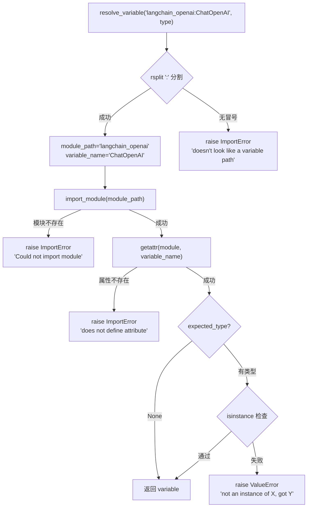
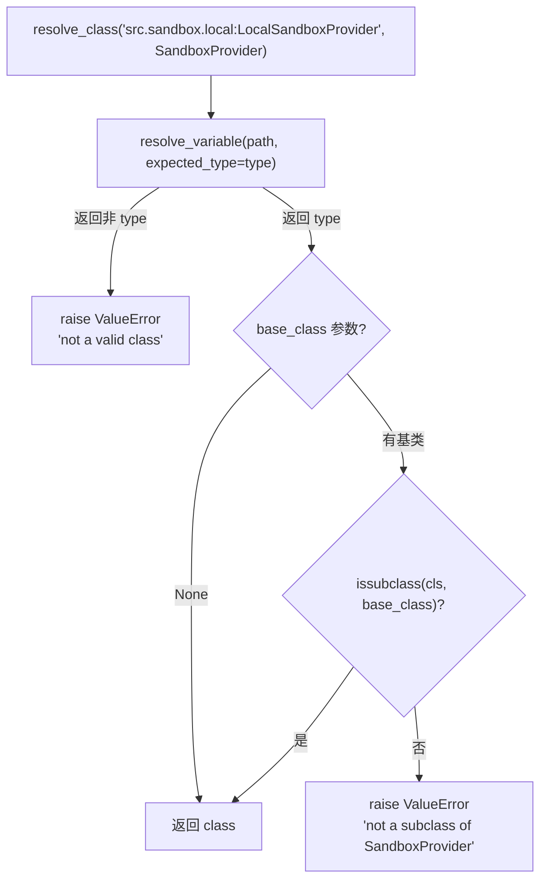

# PD-335.01 DeerFlow — resolve 反射加载与配置驱动组件替换

> 文档编号：PD-335.01
> 来源：DeerFlow `backend/src/reflection/resolvers.py`
> GitHub：https://github.com/bytedance/deer-flow.git
> 问题域：PD-335 反射加载 Reflection Loading
> 状态：可复用方案

---

## 第 1 章 问题与动机

### 1.1 核心问题

Agent 系统需要在运行时动态加载不同的 LLM 提供商、工具实现和沙箱环境，但硬编码 `import` 会导致：

- **强耦合**：切换 `ChatOpenAI` 到 `ChatAnthropic` 需要改代码、改导入、重新部署
- **扩展困难**：社区贡献新的工具或模型适配器时，必须修改核心代码的 import 语句
- **配置与代码不分离**：运维人员无法通过修改配置文件来替换组件，必须懂 Python

这是 Agent 框架的基础设施问题——如何让组件可插拔，同时保持类型安全。

### 1.2 DeerFlow 的解法概述

DeerFlow 2.0 设计了一套极简的反射加载系统，核心只有两个函数 72 行代码：

1. **统一路径格式** `module.path:ClassName` — 用冒号分隔模块路径和属性名（`backend/src/reflection/resolvers.py:26`）
2. **两级 resolve** — `resolve_variable` 加载任意变量/实例，`resolve_class` 在此基础上增加类型和基类校验（`resolvers.py:7-71`）
3. **YAML 配置驱动** — 所有可替换组件通过 `config.yaml` 的 `use` 字段声明路径（`config.example.yaml:19`）
4. **Pydantic 配置模型** — `ModelConfig`/`SandboxConfig`/`ToolConfig` 都有 `use: str` 字段 + `extra="allow"` 透传参数（`model_config.py:10-13`）
5. **单例工厂 + 延迟加载** — `get_sandbox_provider()` / `create_chat_model()` 在首次调用时才 resolve（`sandbox_provider.py:42-56`）

### 1.3 设计思想

| 设计原则 | 具体实现 | 理由 | 替代方案 |
|----------|----------|------|----------|
| 约定优于配置 | `module:class` 冒号分隔格式 | 与 Python entry_points 和 uvicorn 的 `app:module` 格式一致，开发者零学习成本 | Java 风格全限定名 `com.pkg.Class`（Python 不适用） |
| 最小惊讶原则 | resolve 失败抛 `ImportError`/`ValueError`，错误信息包含完整路径和期望类型 | 调试时一眼看出是路径错还是类型错 | 静默返回 None（隐藏错误） |
| 组合优于继承 | `resolve_class` 复用 `resolve_variable`，只加一层 `issubclass` 检查 | 两个函数职责清晰，变量加载和类加载分离 | 单一 resolve 函数用 flag 区分模式 |
| 配置即代码 | YAML `use` 字段 + Pydantic `extra="allow"` 透传所有参数给构造函数 | 新增模型参数（如 `temperature`）无需改 Python 代码 | 每个参数都在 Config 类中显式声明 |
| 延迟绑定 | 单例工厂在首次调用时才 resolve，不在 import 时执行 | 避免启动时因缺少某个 provider 包而崩溃 | 启动时预加载所有组件（fail-fast 但不灵活） |

---

## 第 2 章 源码实现分析

### 2.1 架构概览

DeerFlow 的反射加载系统由三层组成：

```
┌─────────────────────────────────────────────────────────┐
│                    config.yaml (YAML)                    │
│  models:                                                 │
│    - use: langchain_openai:ChatOpenAI                   │
│  sandbox:                                                │
│    use: src.sandbox.local:LocalSandboxProvider           │
│  tools:                                                  │
│    - use: src.community.tavily.tools:web_search_tool    │
└──────────────────────┬──────────────────────────────────┘
                       │ Pydantic 解析
                       ▼
┌─────────────────────────────────────────────────────────┐
│              Config Models (Pydantic)                     │
│  ModelConfig.use ──→ resolve_class(path, BaseChatModel)  │
│  SandboxConfig.use → resolve_class(path, SandboxProvider)│
│  ToolConfig.use ───→ resolve_variable(path, BaseTool)    │
└──────────────────────┬──────────────────────────────────┘
                       │ 运行时反射
                       ▼
┌─────────────────────────────────────────────────────────┐
│            reflection/resolvers.py (72 行)               │
│  resolve_variable(path, expected_type)                   │
│    └→ importlib.import_module + getattr + isinstance     │
│  resolve_class(path, base_class)                         │
│    └→ resolve_variable + issubclass                      │
└─────────────────────────────────────────────────────────┘
```

三个消费者各自使用不同的 resolve 函数：
- **模型工厂** (`models/factory.py`) → `resolve_class` + 基类 `BaseChatModel`
- **沙箱提供者** (`sandbox/sandbox_provider.py`) → `resolve_class` + 基类 `SandboxProvider`
- **工具加载器** (`tools/tools.py`) → `resolve_variable` + 类型 `BaseTool`（工具是实例不是类）

### 2.2 核心实现

#### resolve_variable：通用变量反射加载



对应源码 `backend/src/reflection/resolvers.py:7-46`：

```python
def resolve_variable[T](
    variable_path: str,
    expected_type: type[T] | tuple[type, ...] | None = None,
) -> T:
    try:
        module_path, variable_name = variable_path.rsplit(":", 1)
    except ValueError as err:
        raise ImportError(
            f"{variable_path} doesn't look like a variable path. "
            f"Example: parent_package_name.sub_package_name.module_name:variable_name"
        ) from err

    try:
        module = import_module(module_path)
    except ImportError as err:
        raise ImportError(f"Could not import module {module_path}") from err

    try:
        variable = getattr(module, variable_name)
    except AttributeError as err:
        raise ImportError(
            f"Module {module_path} does not define a {variable_name} attribute/class"
        ) from err

    if expected_type is not None:
        if not isinstance(variable, expected_type):
            type_name = (expected_type.__name__ if isinstance(expected_type, type)
                        else " or ".join(t.__name__ for t in expected_type))
            raise ValueError(
                f"{variable_path} is not an instance of {type_name}, "
                f"got {type(variable).__name__}"
            )
    return variable
```

关键设计点：
- 使用 `rsplit(":", 1)` 而非 `split`，支持模块路径中包含点号（`resolvers.py:26`）
- 三层 try-except 分别捕获路径格式错误、模块导入错误、属性不存在，错误信息精确到具体原因（`resolvers.py:27-38`）
- Python 3.12+ 泛型语法 `def resolve_variable[T]`，返回类型与 `expected_type` 参数联动（`resolvers.py:7`）

#### resolve_class：类级别反射 + 基类校验



对应源码 `backend/src/reflection/resolvers.py:49-71`：

```python
def resolve_class[T](class_path: str, base_class: type[T] | None = None) -> type[T]:
    model_class = resolve_variable(class_path, expected_type=type)

    if not isinstance(model_class, type):
        raise ValueError(f"{class_path} is not a valid class")

    if base_class is not None and not issubclass(model_class, base_class):
        raise ValueError(f"{class_path} is not a subclass of {base_class.__name__}")

    return model_class
```

`resolve_class` 是 `resolve_variable` 的特化版本：先用 `expected_type=type` 确保加载的是类（不是实例或函数），再用 `issubclass` 确保继承关系正确。

### 2.3 实现细节：三个消费者的不同用法

**模型工厂** — resolve 类 + 实例化（`backend/src/models/factory.py:9-58`）：

```python
def create_chat_model(name: str | None = None, thinking_enabled: bool = False, **kwargs):
    config = get_app_config()
    model_config = config.get_model_config(name)
    # resolve_class 确保加载的是 BaseChatModel 的子类
    model_class = resolve_class(model_config.use, BaseChatModel)
    # Pydantic model_dump 提取配置参数，exclude 掉元数据字段
    model_settings = model_config.model_dump(exclude_none=True, exclude={"use", "name", ...})
    # 直接用 **kwargs 透传给构造函数
    model_instance = model_class(**kwargs, **model_settings)
    return model_instance
```

**沙箱提供者** — resolve 类 + 单例缓存（`backend/src/sandbox/sandbox_provider.py:42-56`）：

```python
def get_sandbox_provider(**kwargs) -> SandboxProvider:
    global _default_sandbox_provider
    if _default_sandbox_provider is None:
        config = get_app_config()
        cls = resolve_class(config.sandbox.use, SandboxProvider)
        _default_sandbox_provider = cls(**kwargs)
    return _default_sandbox_provider
```

**工具加载器** — resolve 变量实例（`backend/src/tools/tools.py:43`）：

```python
loaded_tools = [resolve_variable(tool.use, BaseTool) for tool in config.tools
                if groups is None or tool.group in groups]
```

工具使用 `resolve_variable` 而非 `resolve_class`，因为工具在模块级别已经是实例化好的对象（如 `web_search_tool = TavilySearchTool(...)`），不需要再 `cls()` 实例化。

---

## 第 3 章 迁移指南

### 3.1 迁移清单

**阶段 1：核心反射模块（30 分钟可完成）**

- [ ] 创建 `reflection/` 包，包含 `resolvers.py` 和 `__init__.py`
- [ ] 实现 `resolve_variable` 和 `resolve_class` 两个函数（直接复用 DeerFlow 代码）
- [ ] 确认 Python 版本 ≥ 3.12（使用了 `def func[T]` 泛型语法），或改写为 `TypeVar` 兼容写法

**阶段 2：配置模型改造**

- [ ] 在现有配置模型中添加 `use: str` 字段
- [ ] 设置 Pydantic `model_config = ConfigDict(extra="allow")` 以透传额外参数
- [ ] 在 YAML 配置文件中为每个可替换组件添加 `use` 路径

**阶段 3：工厂函数改造**

- [ ] 将硬编码的 `from xxx import YYY` 替换为 `resolve_class(config.use, BaseClass)`
- [ ] 对于已实例化的模块级变量（如工具），使用 `resolve_variable(config.use, BaseType)`
- [ ] 添加单例缓存（如需要），参考 `get_sandbox_provider` 模式

### 3.2 适配代码模板

#### 最小可用版本（兼容 Python 3.10+）

```python
"""reflection/resolvers.py — 可直接复用的反射加载模块"""
from importlib import import_module
from typing import TypeVar, Optional, Type, Union, Tuple

T = TypeVar("T")


def resolve_variable(
    variable_path: str,
    expected_type: Optional[Union[Type[T], Tuple[Type, ...]]] = None,
) -> T:
    """从 'module.path:variable_name' 格式的字符串路径加载变量。

    Args:
        variable_path: 变量路径，格式为 "package.module:variable"
        expected_type: 可选的类型校验，支持单类型或元组

    Returns:
        加载的变量

    Raises:
        ImportError: 路径格式错误、模块不存在、属性不存在
        ValueError: 类型校验失败
    """
    try:
        module_path, variable_name = variable_path.rsplit(":", 1)
    except ValueError as err:
        raise ImportError(
            f"{variable_path} 不是有效的变量路径。"
            f"格式示例: package.module:variable_name"
        ) from err

    try:
        module = import_module(module_path)
    except ImportError as err:
        raise ImportError(f"无法导入模块 {module_path}") from err

    try:
        variable = getattr(module, variable_name)
    except AttributeError as err:
        raise ImportError(
            f"模块 {module_path} 中不存在属性 {variable_name}"
        ) from err

    if expected_type is not None and not isinstance(variable, expected_type):
        type_name = (
            expected_type.__name__
            if isinstance(expected_type, type)
            else " | ".join(t.__name__ for t in expected_type)
        )
        raise ValueError(
            f"{variable_path} 不是 {type_name} 的实例，"
            f"实际类型为 {type(variable).__name__}"
        )
    return variable


def resolve_class(
    class_path: str,
    base_class: Optional[Type[T]] = None,
) -> Type[T]:
    """从字符串路径加载类，并可选校验基类继承关系。

    Args:
        class_path: 类路径，格式为 "package.module:ClassName"
        base_class: 可选的基类校验

    Returns:
        加载的类

    Raises:
        ImportError: 路径格式错误、模块不存在
        ValueError: 不是类、不是基类的子类
    """
    cls = resolve_variable(class_path, expected_type=type)
    if not isinstance(cls, type):
        raise ValueError(f"{class_path} 不是一个有效的类")
    if base_class is not None and not issubclass(cls, base_class):
        raise ValueError(
            f"{class_path} 不是 {base_class.__name__} 的子类"
        )
    return cls
```

#### 配置驱动工厂模板

```python
"""factory.py — 配置驱动的组件工厂模板"""
from pydantic import BaseModel, ConfigDict, Field
from reflection.resolvers import resolve_class

class ProviderConfig(BaseModel):
    """通用的可反射加载组件配置"""
    use: str = Field(..., description="组件类路径，如 myapp.providers:MyProvider")
    model_config = ConfigDict(extra="allow")  # 透传所有额外参数给构造函数

_cached_instance = None

def get_provider(config: ProviderConfig, base_class: type) -> object:
    """单例工厂：首次调用时 resolve + 实例化，后续返回缓存"""
    global _cached_instance
    if _cached_instance is None:
        cls = resolve_class(config.use, base_class)
        # model_dump 提取所有配置参数，排除 use 字段本身
        params = config.model_dump(exclude_none=True, exclude={"use"})
        _cached_instance = cls(**params)
    return _cached_instance
```

### 3.3 适用场景

| 场景 | 适用度 | 说明 |
|------|--------|------|
| LLM 多供应商切换 | ⭐⭐⭐ | 最典型场景，YAML 改一行 `use` 即可切换 OpenAI/Anthropic/本地模型 |
| 插件化工具系统 | ⭐⭐⭐ | 社区工具通过 `use` 路径注册，无需修改核心代码 |
| 沙箱/执行环境切换 | ⭐⭐⭐ | 本地开发用 LocalSandbox，生产用 DockerSandbox，只改配置 |
| 存储后端替换 | ⭐⭐ | 适用于有明确基类的存储抽象（如 `BaseStorage`） |
| 高频热路径组件 | ⭐ | 反射加载有 import_module 开销，不适合每次请求都 resolve（应配合单例缓存） |

---

## 第 4 章 测试用例

```python
"""test_resolvers.py — 反射加载模块测试"""
import pytest
from unittest.mock import patch, MagicMock
from importlib import import_module


# ---- 被测模块（假设已按 3.2 模板实现） ----
from reflection.resolvers import resolve_variable, resolve_class


class TestResolveVariable:
    """resolve_variable 测试"""

    def test_resolve_builtin_module(self):
        """正常路径：加载标准库中的变量"""
        # os.path.sep 是一个字符串变量
        result = resolve_variable("os.path:sep", expected_type=str)
        assert isinstance(result, str)

    def test_resolve_class_as_variable(self):
        """加载类对象（作为 type 实例）"""
        result = resolve_variable("collections:OrderedDict", expected_type=type)
        assert result is __import__("collections").OrderedDict

    def test_invalid_path_format(self):
        """路径格式错误：缺少冒号分隔符"""
        with pytest.raises(ImportError, match="不是有效的变量路径"):
            resolve_variable("no_colon_here")

    def test_module_not_found(self):
        """模块不存在"""
        with pytest.raises(ImportError, match="无法导入模块"):
            resolve_variable("nonexistent_module_xyz:Foo")

    def test_attribute_not_found(self):
        """模块存在但属性不存在"""
        with pytest.raises(ImportError, match="不存在属性"):
            resolve_variable("os:nonexistent_attr_xyz")

    def test_type_mismatch(self):
        """类型校验失败"""
        with pytest.raises(ValueError, match="不是.*的实例"):
            resolve_variable("os.path:sep", expected_type=int)

    def test_no_type_check(self):
        """不传 expected_type 时跳过校验"""
        result = resolve_variable("os.path:sep")
        assert result is not None

    def test_tuple_expected_type(self):
        """支持元组形式的多类型校验"""
        result = resolve_variable("os.path:sep", expected_type=(str, bytes))
        assert isinstance(result, (str, bytes))


class TestResolveClass:
    """resolve_class 测试"""

    def test_resolve_valid_class(self):
        """正常路径：加载类"""
        cls = resolve_class("collections:OrderedDict")
        assert cls is __import__("collections").OrderedDict

    def test_base_class_check_pass(self):
        """基类校验通过"""
        from collections import OrderedDict
        cls = resolve_class("collections:OrderedDict", base_class=dict)
        assert issubclass(cls, dict)

    def test_base_class_check_fail(self):
        """基类校验失败"""
        with pytest.raises(ValueError, match="不是.*的子类"):
            resolve_class("collections:OrderedDict", base_class=list)

    def test_resolve_non_class(self):
        """加载的不是类（是变量实例）"""
        with pytest.raises(ValueError, match="不是一个有效的类"):
            resolve_class("os.path:sep")

    def test_resolve_abc_subclass(self):
        """加载 ABC 子类并校验"""
        from io import IOBase
        cls = resolve_class("io:BytesIO", base_class=IOBase)
        assert issubclass(cls, IOBase)
```

---

## 第 5 章 跨域关联

| 关联域 | 关系类型 | 说明 |
|--------|----------|------|
| PD-04 工具系统 | 依赖 | 工具加载器 `tools.py:43` 直接调用 `resolve_variable` 实现配置驱动的工具注册，反射加载是工具系统可插拔的基础 |
| PD-05 沙箱隔离 | 依赖 | `sandbox_provider.py:54` 通过 `resolve_class` 加载沙箱实现类，使 Local/Docker/AIO 沙箱可通过配置切换 |
| PD-12 推理增强 | 协同 | `create_chat_model` 中的 `thinking_enabled` 参数与反射加载配合，同一模型类可通过配置注入不同的推理参数 |
| PD-03 容错与重试 | 协同 | 反射加载的三层异常（ImportError/AttributeError/ValueError）为上层容错提供精确的错误分类信号 |
| PD-10 中间件管道 | 协同 | 反射加载模式可扩展到中间件的动态注册，通过 `use` 路径配置中间件链 |

---

## 第 6 章 来源文件索引

| 文件 | 行范围 | 关键实现 |
|------|--------|----------|
| `backend/src/reflection/resolvers.py` | L1-L71 | 核心反射加载函数 `resolve_variable` 和 `resolve_class` |
| `backend/src/reflection/__init__.py` | L1-L3 | 模块导出 |
| `backend/src/models/factory.py` | L9-L58 | 模型工厂，使用 `resolve_class` 加载 LLM 类并实例化 |
| `backend/src/sandbox/sandbox_provider.py` | L1-L97 | 沙箱提供者抽象基类 + 单例工厂 + `resolve_class` 加载 |
| `backend/src/tools/tools.py` | L1-L84 | 工具加载器，使用 `resolve_variable` 加载工具实例 |
| `backend/src/config/model_config.py` | L1-L22 | ModelConfig Pydantic 模型，`use` 字段定义 |
| `backend/src/config/sandbox_config.py` | L1-L67 | SandboxConfig Pydantic 模型，`use` 字段 + `extra="allow"` |
| `backend/src/config/tool_config.py` | L1-L21 | ToolConfig Pydantic 模型，`use` 字段定义 |
| `backend/src/config/app_config.py` | L1-L207 | 应用配置入口，YAML 加载 + 环境变量解析 + 单例管理 |
| `config.example.yaml` | L1-L284 | 配置示例，展示 `use` 字段的实际用法 |

---

## 第 7 章 横向对比维度

> **重要：** 本章用于自动填充 Butcher Wiki 的横向对比表。

```json comparison_data
{
  "project": "DeerFlow",
  "dimensions": {
    "路径格式": "module.path:name 冒号分隔，与 uvicorn/entry_points 一致",
    "类型安全": "双层校验：isinstance 类型检查 + issubclass 基类检查",
    "配置集成": "Pydantic extra=allow 透传参数，YAML use 字段驱动",
    "加载时机": "延迟单例：首次调用时 resolve，全局缓存实例",
    "错误处理": "三层精确异常：路径格式/模块导入/属性查找分别捕获",
    "消费者模式": "双函数分工：resolve_variable 加载实例，resolve_class 加载类"
  }
}
```

### 域元数据补充

```json domain_metadata
{
  "solution_summary": "DeerFlow 用 resolve_variable/resolve_class 双函数 72 行实现 module:class 路径反射加载，配合 Pydantic extra=allow 透传参数，支持模型/工具/沙箱三类组件的零代码替换",
  "description": "运行时从字符串路径动态加载模块、类和变量，实现组件可插拔",
  "sub_problems": [
    "配置参数透传与构造函数注入",
    "单例缓存与生命周期管理",
    "变量加载与类加载的职责分离"
  ],
  "best_practices": [
    "Pydantic extra=allow 实现配置到构造函数的零损耗透传",
    "resolve_variable 与 resolve_class 分离：实例用前者、类用后者",
    "三层 try-except 提供精确到具体失败环节的错误信息"
  ]
}
```
