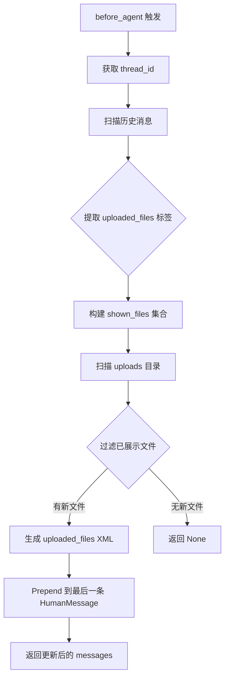
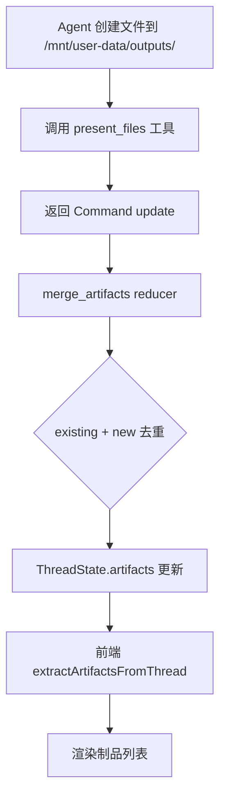

# PD-336.01 DeerFlow — 三目录虚拟路径文件上传与制品呈现体系

> 文档编号：PD-336.01
> 来源：DeerFlow `backend/src/agents/middlewares/uploads_middleware.py`, `backend/src/gateway/routers/artifacts.py`, `backend/src/gateway/routers/uploads.py`
> GitHub：https://github.com/bytedance/deer-flow.git
> 问题域：PD-336 文件上传与制品管理 File Upload & Artifact Management
> 状态：可复用方案

---

## 第 1 章 问题与动机

### 1.1 核心问题

在 Agent 系统中，文件管理面临三个核心挑战：

1. **上传文件如何让 Agent 感知？** 用户通过前端上传文件后，Agent 运行在沙箱中，需要一种机制让 Agent 知道有哪些文件可用，且不能重复注入已经告知过的文件信息。
2. **沙箱内文件如何组织？** Agent 的工作文件（workspace）、用户上传文件（uploads）、最终交付物（outputs）需要隔离，避免混淆和误删。
3. **Agent 产出的制品如何安全地呈现给用户？** 沙箱内的文件路径是虚拟的（`/mnt/user-data/...`），需要映射到宿主机真实路径，同时防止路径遍历攻击。

### 1.2 DeerFlow 的解法概述

DeerFlow 2.0 构建了一套完整的文件生命周期管理体系：

1. **三目录隔离**：`ThreadDataMiddleware` 在 `backend/src/agents/middlewares/thread_data_middleware.py:22-25` 为每个 thread 创建 `workspace/uploads/outputs` 三个独立目录，支持懒初始化。
2. **增量文件注入**：`UploadsMiddleware` 在 `backend/src/agents/middlewares/uploads_middleware.py:51-78` 通过扫描历史消息中的 `<uploaded_files>` 标签，计算已展示文件集合，只注入新增文件。
3. **虚拟路径映射**：`path_utils.py:14-44` 将沙箱虚拟路径 `/mnt/user-data/...` 映射到宿主机 `.deer-flow/threads/{thread_id}/user-data/...`，含路径遍历防护。
4. **制品呈现工具**：`present_file_tool.py:11-39` 提供 `present_files` 工具，Agent 调用后通过 `merge_artifacts` reducer 去重合并到 ThreadState。
5. **全格式制品下载**：`artifacts.py:61-158` 支持 HTML 渲染、文本预览、二进制下载、ZIP 内文件提取（`.skill` 归档）。

### 1.3 设计思想

| 设计原则 | 具体实现 | 理由 | 替代方案 |
|----------|----------|------|----------|
| 增量注入 | 扫描历史消息提取已展示文件名集合，只注入差集 | 避免上下文膨胀，多轮对话中不重复告知 | 全量注入（浪费 token）、状态标记（需额外存储） |
| 虚拟路径抽象 | `/mnt/user-data/` 统一前缀，运行时映射到真实路径 | 沙箱内外路径解耦，本地/容器沙箱统一接口 | 直接暴露真实路径（不安全、不可移植） |
| 懒初始化 | `ThreadDataMiddleware` 默认 `lazy_init=True`，目录按需创建 | 减少不必要的 I/O，大量 thread 时性能更好 | 预创建所有目录（浪费资源） |
| Reducer 去重 | `merge_artifacts` 用 `dict.fromkeys` 保序去重 | 多个工具并行调用 `present_files` 时不会产生重复 | 列表直接追加（可能重复） |
| 格式自动转换 | 上传时自动将 PDF/PPT/Excel/Word 转为 Markdown | Agent 可直接读取文本内容，无需额外工具 | 让 Agent 自行调用转换工具（增加步骤） |

---

## 第 2 章 源码实现分析

### 2.1 架构概览

DeerFlow 的文件管理体系分为四层：

```
┌─────────────────────────────────────────────────────────────────┐
│                     Frontend (React/Next.js)                     │
│  uploadFiles() ──→ POST /uploads    useArtifactContent() ←── GET /artifacts │
└──────────┬──────────────────────────────────────────┬───────────┘
           │                                          │
┌──────────▼──────────────────────────────────────────▼───────────┐
│                     Gateway (FastAPI Routers)                     │
│  uploads.py: 上传/列表/删除    artifacts.py: 制品下载/预览        │
│  path_utils.py: 虚拟路径 → 真实路径映射 + 路径遍历防护           │
└──────────┬──────────────────────────────────────────┬───────────┘
           │                                          │
┌──────────▼──────────────────────────────────────────▼───────────┐
│                     Middleware Layer                              │
│  ThreadDataMiddleware: 三目录路径计算（懒初始化）                  │
│  UploadsMiddleware: 增量文件检测 → <uploaded_files> 标签注入      │
└──────────┬──────────────────────────────────────────┬───────────┘
           │                                          │
┌──────────▼──────────────────────────────────────────▼───────────┐
│                     Agent Tools & State                           │
│  present_files: 制品呈现工具 → artifacts[] (merge_artifacts)     │
│  bash/read_file/write_file: 虚拟路径自动替换                      │
│  ThreadState.artifacts: Annotated[list[str], merge_artifacts]    │
└─────────────────────────────────────────────────────────────────┘
           │
┌──────────▼──────────────────────────────────────────────────────┐
│                     Storage Layer                                 │
│  .deer-flow/threads/{thread_id}/user-data/                       │
│    ├── workspace/   (Agent 工作区)                                │
│    ├── uploads/     (用户上传文件)                                │
│    └── outputs/     (最终交付物)                                  │
└─────────────────────────────────────────────────────────────────┘
```

### 2.2 核心实现

#### 2.2.1 增量文件注入中间件



对应源码 `backend/src/agents/middlewares/uploads_middleware.py:139-221`：

```python
@override
def before_agent(self, state: UploadsMiddlewareState, runtime: Runtime) -> dict | None:
    thread_id = runtime.context.get("thread_id")
    if thread_id is None:
        return None

    messages = list(state.get("messages", []))
    if not messages:
        return None

    # 扫描除最后一条外的所有历史消息，提取已展示文件名
    shown_files: set[str] = set()
    for msg in messages[:-1]:
        if isinstance(msg, HumanMessage):
            content = msg.content if isinstance(msg.content, str) else ""
            extracted = self._extract_files_from_message(content)
            shown_files.update(extracted)

    # 只列出新上传的文件（差集）
    files = self._list_newly_uploaded_files(thread_id, shown_files)

    if not files:
        return None

    # 生成 <uploaded_files> 标签并 prepend 到最后一条 HumanMessage
    files_message = self._create_files_message(files)
    updated_message = HumanMessage(
        content=f"{files_message}\n\n{original_content}",
        id=last_message.id,
    )
    messages[last_message_index] = updated_message

    return {"uploaded_files": files, "messages": messages}
```

#### 2.2.2 制品呈现与 Reducer 去重



对应源码 `backend/src/tools/builtins/present_file_tool.py:11-39`：

```python
@tool("present_files", parse_docstring=True)
def present_file_tool(
    runtime: ToolRuntime[ContextT, ThreadState],
    filepaths: list[str],
    tool_call_id: Annotated[str, InjectedToolCallId],
) -> Command:
    """Make files visible to the user for viewing and rendering."""
    # merge_artifacts reducer 自动处理合并和去重
    return Command(
        update={
            "artifacts": filepaths,
            "messages": [ToolMessage("Successfully presented files", tool_call_id=tool_call_id)],
        },
    )
```

去重 reducer 定义在 `backend/src/agents/thread_state.py:21-28`：

```python
def merge_artifacts(existing: list[str] | None, new: list[str] | None) -> list[str]:
    """Reducer for artifacts list - merges and deduplicates artifacts."""
    if existing is None:
        return new or []
    if new is None:
        return existing
    return list(dict.fromkeys(existing + new))
```

### 2.3 实现细节

#### 虚拟路径映射与安全防护

`path_utils.py:14-44` 实现了虚拟路径到真实路径的映射，关键安全措施：

1. **前缀校验**：路径必须以 `mnt/user-data` 开头
2. **路径遍历防护**：`resolve()` 后检查是否仍在 `base_dir` 下
3. **双层映射**：sandbox 工具层（`replace_virtual_path`）和 Gateway 层（`resolve_thread_virtual_path`）各自独立映射

#### 文件格式自动转换

`uploads.py:51-74` 在上传时自动将 PDF/PPT/Excel/Word 转为 Markdown：

```python
CONVERTIBLE_EXTENSIONS = {".pdf", ".ppt", ".pptx", ".xls", ".xlsx", ".doc", ".docx"}

async def convert_file_to_markdown(file_path: Path) -> Path | None:
    from markitdown import MarkItDown
    md = MarkItDown()
    result = md.convert(str(file_path))
    md_path = file_path.with_suffix(".md")
    md_path.write_text(result.text_content, encoding="utf-8")
    return md_path
```

#### ZIP 归档内文件提取

`artifacts.py:28-58` 支持从 `.skill` ZIP 归档中提取内部文件，用于技能包预览：

```python
def _extract_file_from_skill_archive(zip_path: Path, internal_path: str) -> bytes | None:
    with zipfile.ZipFile(zip_path, "r") as zip_ref:
        namelist = zip_ref.namelist()
        if internal_path in namelist:
            return zip_ref.read(internal_path)
        for name in namelist:
            if name.endswith("/" + internal_path):
                return zip_ref.read(name)
    return None
```

#### 前端制品 URL 构建

`frontend/src/core/artifacts/utils.ts:4-14` 构建制品访问 URL：

```typescript
export function urlOfArtifact({ filepath, threadId, download = false }) {
  return `${getBackendBaseURL()}/api/threads/${threadId}/artifacts${filepath}${download ? "?download=true" : ""}`;
}
```

---

## 第 3 章 迁移指南

### 3.1 迁移清单

**阶段 1：三目录隔离（基础）**
- [ ] 定义虚拟路径常量（`/mnt/user-data/`）和三子目录（workspace/uploads/outputs）
- [ ] 实现 ThreadDataMiddleware，为每个会话创建隔离目录
- [ ] 实现虚拟路径 → 真实路径映射函数，含路径遍历防护

**阶段 2：文件上传 API**
- [ ] 实现 POST 上传端点，支持多文件批量上传
- [ ] 实现文件格式自动转换（PDF/Office → Markdown）
- [ ] 实现 GET 列表和 DELETE 删除端点
- [ ] 上传时同步写入沙箱（`sandbox.update_file`）

**阶段 3：增量文件注入中间件**
- [ ] 实现 UploadsMiddleware，在 `before_agent` 钩子中注入文件信息
- [ ] 实现历史消息扫描，提取已展示文件名集合
- [ ] 生成 `<uploaded_files>` XML 标签，prepend 到最后一条 HumanMessage

**阶段 4：制品呈现**
- [ ] 实现 `present_files` 工具，Agent 调用后更新 ThreadState.artifacts
- [ ] 实现 `merge_artifacts` reducer，保序去重
- [ ] 实现制品下载 API，支持 MIME 类型自动检测、HTML 渲染、强制下载

### 3.2 适配代码模板

#### 增量文件注入中间件（可直接复用）

```python
import os
import re
from pathlib import Path
from typing import Protocol

class FileInjectionMiddleware:
    """增量文件注入中间件 — 从 DeerFlow UploadsMiddleware 提取的可移植版本。"""

    def __init__(self, uploads_dir_fn):
        """
        Args:
            uploads_dir_fn: 接收 session_id 返回 uploads 目录 Path 的函数
        """
        self._uploads_dir_fn = uploads_dir_fn

    def get_new_files(self, session_id: str, history_messages: list[dict]) -> list[dict]:
        """检测新上传文件，返回未注入过的文件列表。"""
        shown = self._extract_shown_files(history_messages)
        uploads_dir = self._uploads_dir_fn(session_id)
        if not uploads_dir.exists():
            return []
        return [
            {"filename": f.name, "size": f.stat().st_size, "path": f"/uploads/{f.name}"}
            for f in sorted(uploads_dir.iterdir())
            if f.is_file() and f.name not in shown
        ]

    def format_injection(self, files: list[dict]) -> str:
        """生成 <uploaded_files> XML 标签。"""
        if not files:
            return ""
        lines = ["<uploaded_files>"]
        for f in files:
            size_str = f"{f['size'] / 1024:.1f} KB"
            lines.append(f"- {f['filename']} ({size_str})")
            lines.append(f"  Path: {f['path']}")
        lines.append("</uploaded_files>")
        return "\n".join(lines)

    def _extract_shown_files(self, messages: list[dict]) -> set[str]:
        """从历史消息中提取已展示的文件名集合。"""
        shown = set()
        for msg in messages:
            content = msg.get("content", "")
            match = re.search(r"<uploaded_files>([\s\S]*?)</uploaded_files>", content)
            if match:
                for line in match.group(1).split("\n"):
                    file_match = re.match(r"^-\s+(.+?)\s*\(", line.strip())
                    if file_match:
                        shown.add(file_match.group(1).strip())
        return shown
```

#### 虚拟路径映射（含安全防护）

```python
from pathlib import Path
from fastapi import HTTPException

VIRTUAL_PREFIX = "/mnt/user-data"
SUBDIR_MAPPING = {"workspace", "uploads", "outputs"}

def resolve_virtual_path(session_id: str, virtual_path: str, base_dir: Path) -> Path:
    """将虚拟路径映射到真实路径，含路径遍历防护。"""
    virtual_path = virtual_path.lstrip("/")
    prefix = VIRTUAL_PREFIX.lstrip("/")
    if not virtual_path.startswith(prefix):
        raise HTTPException(400, f"Path must start with {VIRTUAL_PREFIX}")

    relative = virtual_path[len(prefix):].lstrip("/")
    user_data_dir = base_dir / session_id / "user-data"
    actual = (user_data_dir / relative).resolve()

    if not str(actual).startswith(str(user_data_dir.resolve())):
        raise HTTPException(403, "Path traversal detected")

    return actual
```

### 3.3 适用场景

| 场景 | 适用度 | 说明 |
|------|--------|------|
| 多轮对话 Agent + 文件上传 | ⭐⭐⭐ | 核心场景，增量注入避免 token 浪费 |
| 沙箱化代码执行 Agent | ⭐⭐⭐ | 三目录隔离 + 虚拟路径映射完美适配 |
| 文档处理 Agent（PDF/Office） | ⭐⭐⭐ | 自动转 Markdown，Agent 直接读取 |
| 单轮对话 Agent | ⭐⭐ | 增量注入价值不大，但目录隔离仍有用 |
| 无沙箱的轻量 Agent | ⭐ | 虚拟路径映射过度设计，直接用真实路径即可 |

---

## 第 4 章 测试用例

```python
import os
import tempfile
from pathlib import Path
from unittest.mock import MagicMock

import pytest


class TestUploadsMiddleware:
    """测试增量文件注入中间件。"""

    def setup_method(self):
        self.tmpdir = tempfile.mkdtemp()
        self.uploads_dir = Path(self.tmpdir) / "uploads"
        self.uploads_dir.mkdir()

    def test_new_files_detected(self):
        """新上传文件应被检测到。"""
        (self.uploads_dir / "report.pdf").write_text("fake pdf")
        (self.uploads_dir / "data.csv").write_text("a,b,c")

        middleware = FileInjectionMiddleware(lambda _: self.uploads_dir)
        files = middleware.get_new_files("session-1", [])

        assert len(files) == 2
        assert {f["filename"] for f in files} == {"report.pdf", "data.csv"}

    def test_incremental_injection_skips_shown(self):
        """已在历史消息中展示过的文件不应重复注入。"""
        (self.uploads_dir / "report.pdf").write_text("fake pdf")
        (self.uploads_dir / "new.txt").write_text("new content")

        history = [{"content": "<uploaded_files>\n- report.pdf (0.1 KB)\n  Path: /uploads/report.pdf\n</uploaded_files>"}]
        middleware = FileInjectionMiddleware(lambda _: self.uploads_dir)
        files = middleware.get_new_files("session-1", history)

        assert len(files) == 1
        assert files[0]["filename"] == "new.txt"

    def test_empty_uploads_dir(self):
        """空目录应返回空列表。"""
        middleware = FileInjectionMiddleware(lambda _: self.uploads_dir)
        files = middleware.get_new_files("session-1", [])
        assert files == []

    def test_format_injection_xml(self):
        """生成的 XML 标签格式正确。"""
        middleware = FileInjectionMiddleware(lambda _: self.uploads_dir)
        result = middleware.format_injection([
            {"filename": "test.pdf", "size": 2048, "path": "/uploads/test.pdf"}
        ])
        assert "<uploaded_files>" in result
        assert "test.pdf" in result
        assert "2.0 KB" in result


class TestMergeArtifacts:
    """测试制品去重 reducer。"""

    def test_merge_deduplicates(self):
        existing = ["/mnt/user-data/outputs/a.html", "/mnt/user-data/outputs/b.csv"]
        new = ["/mnt/user-data/outputs/b.csv", "/mnt/user-data/outputs/c.png"]
        result = list(dict.fromkeys(existing + new))
        assert result == ["/mnt/user-data/outputs/a.html", "/mnt/user-data/outputs/b.csv", "/mnt/user-data/outputs/c.png"]

    def test_merge_preserves_order(self):
        existing = ["/outputs/z.txt", "/outputs/a.txt"]
        new = ["/outputs/m.txt"]
        result = list(dict.fromkeys(existing + new))
        assert result == ["/outputs/z.txt", "/outputs/a.txt", "/outputs/m.txt"]

    def test_merge_none_existing(self):
        result = list(dict.fromkeys([] + ["/outputs/a.txt"]))
        assert result == ["/outputs/a.txt"]


class TestVirtualPathResolution:
    """测试虚拟路径映射安全性。"""

    def test_normal_path_resolves(self):
        """正常路径应正确映射。"""
        base = Path(tempfile.mkdtemp())
        user_data = base / "session-1" / "user-data" / "outputs"
        user_data.mkdir(parents=True)
        (user_data / "result.html").write_text("<h1>done</h1>")

        actual = resolve_virtual_path("session-1", "/mnt/user-data/outputs/result.html", base)
        assert actual.exists()
        assert actual.name == "result.html"

    def test_path_traversal_blocked(self):
        """路径遍历攻击应被阻止。"""
        base = Path(tempfile.mkdtemp())
        (base / "session-1" / "user-data").mkdir(parents=True)

        with pytest.raises(Exception):  # HTTPException
            resolve_virtual_path("session-1", "/mnt/user-data/../../etc/passwd", base)
```

---

## 第 5 章 跨域关联

| 关联域 | 关系类型 | 说明 |
|--------|----------|------|
| PD-01 上下文管理 | 协同 | 增量文件注入本质是上下文管理的一部分——避免重复信息膨胀上下文窗口。`UploadsMiddleware` 的 `_extract_files_from_message` 扫描历史消息是一种上下文感知机制 |
| PD-05 沙箱隔离 | 依赖 | 三目录隔离依赖沙箱提供的虚拟文件系统。`sandbox.update_file()` 将上传文件同步到沙箱，`replace_virtual_path()` 在本地沙箱模式下做路径替换 |
| PD-10 中间件管道 | 依赖 | `UploadsMiddleware` 和 `ThreadDataMiddleware` 都是 `AgentMiddleware` 子类，通过 `before_agent` 钩子注入状态，依赖中间件管道的执行顺序 |
| PD-04 工具系统 | 协同 | `present_files` 是一个标准 LangChain tool，通过 `Command` 返回状态更新。前端通过 `hasPresentFiles()` 检测工具调用来触发制品渲染 |
| PD-11 可观测性 | 协同 | 上传和制品操作通过 `logging.getLogger(__name__)` 记录日志，包括文件名、大小、路径等关键信息 |

---

## 第 6 章 来源文件索引

| 文件 | 行范围 | 关键实现 |
|------|--------|----------|
| `backend/src/agents/middlewares/uploads_middleware.py` | L1-222 | 增量文件注入中间件：`_list_newly_uploaded_files`、`_extract_files_from_message`、`before_agent` |
| `backend/src/gateway/routers/uploads.py` | L1-217 | 上传 REST API：多文件上传、markitdown 格式转换、列表、删除 |
| `backend/src/gateway/routers/artifacts.py` | L1-159 | 制品下载 API：MIME 检测、HTML 渲染、ZIP 内文件提取 |
| `backend/src/tools/builtins/present_file_tool.py` | L1-39 | `present_files` 工具：通过 Command 更新 artifacts 状态 |
| `backend/src/agents/thread_state.py` | L21-28 | `merge_artifacts` reducer：`dict.fromkeys` 保序去重 |
| `backend/src/agents/thread_state.py` | L48-55 | `ThreadState` 定义：`artifacts: Annotated[list[str], merge_artifacts]` |
| `backend/src/agents/middlewares/thread_data_middleware.py` | L19-95 | 三目录路径计算与懒初始化 |
| `backend/src/gateway/path_utils.py` | L14-44 | 虚拟路径映射 + 路径遍历防护 |
| `backend/src/sandbox/consts.py` | L1-4 | 常量定义：`THREAD_DATA_BASE_DIR`、`VIRTUAL_PATH_PREFIX` |
| `backend/src/sandbox/tools.py` | L17-61 | `replace_virtual_path`：沙箱工具层虚拟路径替换 |
| `frontend/src/core/uploads/api.ts` | L1-99 | 前端上传 API：`uploadFiles`、`listUploadedFiles`、`deleteUploadedFile` |
| `frontend/src/core/artifacts/utils.ts` | L1-23 | 制品 URL 构建：`urlOfArtifact`、`extractArtifactsFromThread` |
| `frontend/src/core/messages/utils.ts` | L217-242 | `hasPresentFiles`、`extractPresentFilesFromMessage`：前端制品检测 |
| `frontend/src/core/messages/utils.ts` | L286-319 | `parseUploadedFiles`：前端解析 `<uploaded_files>` 标签 |

---

## 第 7 章 横向对比维度

```json comparison_data
{
  "project": "DeerFlow",
  "dimensions": {
    "目录组织": "三目录隔离：workspace/uploads/outputs，ThreadDataMiddleware 懒初始化",
    "上传机制": "Gateway REST API + markitdown 自动转换 PDF/Office → Markdown",
    "注入策略": "UploadsMiddleware 扫描历史消息提取已展示文件名，增量差集注入",
    "制品呈现": "present_files 工具 + merge_artifacts reducer 保序去重",
    "路径安全": "双层虚拟路径映射（sandbox 工具层 + Gateway 层），resolve() 路径遍历防护",
    "格式支持": "HTML 渲染、文本预览、二进制下载、ZIP 内文件提取（.skill 归档）"
  }
}
```

### 域元数据补充

```json domain_metadata
{
  "solution_summary": "DeerFlow 通过 UploadsMiddleware 增量差集注入 + present_files 工具 merge_artifacts reducer 去重 + 双层虚拟路径映射，实现三目录隔离的文件上传与制品呈现全链路",
  "description": "Agent 系统中文件从上传到沙箱感知到制品交付的全生命周期管理",
  "sub_problems": [
    "文件格式自动转换（PDF/Office → Markdown）",
    "ZIP 归档内文件提取与预览",
    "前端制品消息分组与渲染"
  ],
  "best_practices": [
    "虚拟路径双层映射（工具层+Gateway层）各自独立防护",
    "merge_artifacts reducer 用 dict.fromkeys 保序去重支持并行工具调用",
    "ThreadDataMiddleware 懒初始化减少不必要 I/O"
  ]
}
```
