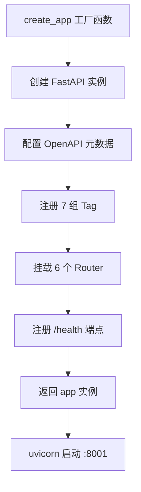
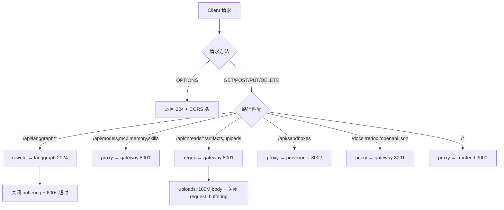

# PD-337.01 DeerFlow — FastAPI + nginx 四服务网关与路径路由

> 文档编号：PD-337.01
> 来源：DeerFlow `backend/src/gateway/app.py`, `docker/nginx/nginx.conf`
> GitHub：https://github.com/bytedance/deer-flow.git
> 问题域：PD-337 API 网关 API Gateway
> 状态：可复用方案

---

## 第 1 章 问题与动机

### 1.1 核心问题

Agent 系统通常由多个独立进程组成——LLM 编排引擎（如 LangGraph Server）、自定义业务 API、前端 SPA、沙箱管理器等。这些进程各自监听不同端口，前端需要知道每个服务的地址，CORS 策略分散在各服务中难以统一管理，SSE/WebSocket 长连接需要特殊的代理配置。

核心挑战：
1. **多进程端口分散**：前端需要同时对接 3-4 个不同端口的后端服务
2. **CORS 策略碎片化**：每个服务各自配置 CORS，容易遗漏或冲突
3. **SSE 流式代理**：LangGraph 的流式响应需要关闭 proxy_buffering，普通反代配置会导致流式失效
4. **关注点分离**：Agent 编排逻辑不应与配置管理、文件上传等业务 API 混在同一进程

### 1.2 DeerFlow 的解法概述

DeerFlow 2.0 采用 **nginx 统一入口 + FastAPI Gateway 进程 + LangGraph Server 进程** 的三层架构：

1. **nginx 作为唯一入口**（端口 2026）：所有请求经 nginx 路径路由分发到 4 个 upstream（`gateway:8001`、`langgraph:2024`、`frontend:3000`、`provisioner:8002`），CORS 由 nginx 统一处理（`docker/nginx/nginx.conf:49-57`）
2. **FastAPI Gateway 独立进程**（端口 8001）：提供 models/mcp/memory/skills/artifacts/uploads/health 七组 REST API，不处理 Agent 编排逻辑（`backend/src/gateway/app.py:35-134`）
3. **LangGraph Server 独立进程**（端口 2024）：专注 Agent 编排，nginx 通过 rewrite 将 `/api/langgraph/*` 转发为 `/*`（`docker/nginx/nginx.conf:61-85`）
4. **Gateway 不初始化 MCP 工具**：明确注释说明 MCP 工具由 LangGraph Server 懒加载，两个进程缓存独立（`backend/src/gateway/app.py:26-29`）
5. **OpenAPI 文档自动暴露**：FastAPI 内置 `/docs`、`/redoc`、`/openapi.json` 三端点，nginx 透传到 Gateway（`backend/src/gateway/app.py:65-67`）

### 1.3 设计思想

| 设计原则 | 具体实现 | 理由 | 替代方案 |
|----------|----------|------|----------|
| 单一入口 | nginx 监听 2026 端口，路径路由分发 | 前端只需知道一个地址，简化部署 | API Gateway 框架（Kong/Traefik） |
| CORS 集中化 | nginx `add_header` + `proxy_hide_header` 去重 | 避免 upstream 和 nginx 双重 CORS 头冲突 | 每个服务各自配 CORS |
| 进程分离 | Gateway(8001) 与 LangGraph(2024) 独立进程 | Agent 编排崩溃不影响配置 API | 单体 FastAPI 应用 |
| 路径前缀约定 | 所有 Gateway API 统一 `/api` 前缀 | 便于 nginx location 匹配和路由 | 无前缀，按域名区分 |
| 懒加载隔离 | Gateway 不初始化 MCP 工具，由 LangGraph 按需加载 | 减少 Gateway 启动时间和内存占用 | Gateway 也初始化一份 |

---

## 第 2 章 源码实现分析

### 2.1 架构概览

DeerFlow 的 API 网关采用 nginx + 4 upstream 的路径路由架构：

```
                          ┌─────────────────────────────────────────────┐
                          │           nginx (:2026)                     │
                          │  ┌─────────────────────────────────────┐    │
  Client ──── HTTPS ────→ │  │  CORS: add_header * always          │    │
                          │  │  OPTIONS → 204                      │    │
                          │  └─────────────────────────────────────┘    │
                          │                                             │
                          │  /api/langgraph/* ──→ rewrite /$1 ──→ langgraph:2024  │
                          │  /api/models      ──→ gateway:8001                    │
                          │  /api/mcp         ──→ gateway:8001                    │
                          │  /api/memory      ──→ gateway:8001                    │
                          │  /api/skills      ──→ gateway:8001                    │
                          │  /api/threads/*/artifacts ──→ gateway:8001            │
                          │  /api/threads/*/uploads   ──→ gateway:8001            │
                          │  /api/sandboxes   ──→ provisioner:8002                │
                          │  /docs /redoc     ──→ gateway:8001                    │
                          │  /health          ──→ gateway:8001                    │
                          │  /*               ──→ frontend:3000                   │
                          └─────────────────────────────────────────────┘
```

四个 upstream 进程完全独立，各自有自己的生命周期和缓存。

### 2.2 核心实现

#### 2.2.1 FastAPI Gateway 应用工厂



对应源码 `backend/src/gateway/app.py:35-134`：

```python
def create_app() -> FastAPI:
    app = FastAPI(
        title="DeerFlow API Gateway",
        description="...",
        version="0.1.0",
        lifespan=lifespan,
        docs_url="/docs",
        redoc_url="/redoc",
        openapi_url="/openapi.json",
        openapi_tags=[
            {"name": "models", "description": "Operations for querying available AI models..."},
            {"name": "mcp", "description": "Manage Model Context Protocol..."},
            {"name": "memory", "description": "Access and manage global memory data..."},
            {"name": "skills", "description": "Manage skills and their configurations"},
            {"name": "artifacts", "description": "Access and download thread artifacts..."},
            {"name": "uploads", "description": "Upload and manage user files for threads"},
            {"name": "health", "description": "Health check and system status endpoints"},
        ],
    )
    # CORS is handled by nginx - no need for FastAPI middleware
    app.include_router(models.router)
    app.include_router(mcp.router)
    app.include_router(memory.router)
    app.include_router(skills.router)
    app.include_router(artifacts.router)
    app.include_router(uploads.router)

    @app.get("/health", tags=["health"])
    async def health_check() -> dict:
        return {"status": "healthy", "service": "deer-flow-gateway"}

    return app
```

关键设计点：
- **L100**: 显式注释 "CORS is handled by nginx"，不添加 FastAPI CORSMiddleware
- **L42-98**: 7 组 `openapi_tags` 为 Swagger UI 提供分组导航
- **L64**: `lifespan` 上下文管理器处理启动/关闭日志

#### 2.2.2 nginx 路径路由与 CORS 集中化



对应源码 `docker/nginx/nginx.conf:43-57`（CORS 集中处理）：

```nginx
# Hide CORS headers from upstream to prevent duplicates
proxy_hide_header 'Access-Control-Allow-Origin';
proxy_hide_header 'Access-Control-Allow-Methods';
proxy_hide_header 'Access-Control-Allow-Headers';
proxy_hide_header 'Access-Control-Allow-Credentials';

# CORS headers for all responses (nginx handles CORS centrally)
add_header 'Access-Control-Allow-Origin' '*' always;
add_header 'Access-Control-Allow-Methods' 'GET, POST, PUT, DELETE, PATCH, OPTIONS' always;
add_header 'Access-Control-Allow-Headers' '*' always;

# Handle OPTIONS requests (CORS preflight)
if ($request_method = 'OPTIONS') {
    return 204;
}
```

关键技巧：`proxy_hide_header` 先剥离 upstream 返回的 CORS 头，再由 nginx 统一添加，避免浏览器收到重复 CORS 头导致请求失败。

#### 2.2.3 SSE 流式代理配置

对应源码 `docker/nginx/nginx.conf:61-85`（LangGraph 路由）：

```nginx
location /api/langgraph/ {
    rewrite ^/api/langgraph/(.*) /$1 break;
    proxy_pass http://langgraph;
    proxy_http_version 1.1;
    proxy_set_header Connection '';
    # SSE/Streaming support
    proxy_buffering off;
    proxy_cache off;
    proxy_set_header X-Accel-Buffering no;
    # Timeouts for long-running requests
    proxy_connect_timeout 600s;
    proxy_send_timeout 600s;
    proxy_read_timeout 600s;
    chunked_transfer_encoding on;
}
```

三个关键配置：
- `proxy_buffering off` + `proxy_cache off`：禁止 nginx 缓冲响应，SSE 事件实时透传
- `X-Accel-Buffering no`：告知上游代理（如 CDN）也不要缓冲
- `Connection ''`：清除 Connection 头，避免 HTTP/1.1 keep-alive 干扰流式传输

### 2.3 实现细节

#### Router 模块化设计

每个 Router 遵循统一模式（`backend/src/gateway/routers/models.py:6`）：

```python
router = APIRouter(prefix="/api", tags=["models"])
```

所有 Router 共享 `/api` 前缀，通过 `tags` 分组。Pydantic BaseModel 同时作为请求/响应模型和 OpenAPI Schema 定义，实现"代码即文档"。

#### 虚拟路径安全解析

`backend/src/gateway/path_utils.py:14-44` 实现了沙箱虚拟路径到真实文件系统路径的安全映射：

```python
def resolve_thread_virtual_path(thread_id: str, virtual_path: str) -> Path:
    virtual_path = virtual_path.lstrip("/")
    if not virtual_path.startswith(VIRTUAL_PATH_PREFIX):
        raise HTTPException(status_code=400, ...)
    actual_path = actual_path.resolve()
    if not str(actual_path).startswith(str(base_resolved)):
        raise HTTPException(status_code=403, detail="Access denied: path traversal detected")
    return actual_path
```

通过 `Path.resolve()` + 前缀检查防止路径穿越攻击，artifacts 和 uploads 两个 Router 共用此工具函数。

#### Gateway 配置管理

`backend/src/gateway/config.py:6-27` 使用 Pydantic BaseModel + 环境变量注入：

```python
class GatewayConfig(BaseModel):
    host: str = Field(default="0.0.0.0")
    port: int = Field(default=8001)
    cors_origins: list[str] = Field(default_factory=lambda: ["http://localhost:3000"])
```

通过 `GATEWAY_HOST`、`GATEWAY_PORT`、`CORS_ORIGINS` 环境变量覆盖默认值，支持 Docker 和本地开发两种部署模式。

#### MCP 配置热更新

`backend/src/gateway/routers/mcp.py:83-148` 的 PUT 端点实现了 MCP 配置的运行时更新：

1. 写入 `extensions_config.json` 文件
2. 重载 Gateway 进程内的配置缓存
3. LangGraph Server 通过 mtime 检测文件变更自动重新初始化（跨进程通信通过文件系统）


---

## 第 3 章 迁移指南

### 3.1 迁移清单

**阶段 1：Gateway 进程搭建**
- [ ] 创建 FastAPI 应用工厂（`create_app` 模式）
- [ ] 定义 Router 模块，每个业务域一个文件，统一 `/api` 前缀
- [ ] 用 Pydantic BaseModel 定义所有请求/响应模型
- [ ] 配置 OpenAPI tags 分组
- [ ] 添加 `/health` 端点

**阶段 2：nginx 反向代理**
- [ ] 编写 nginx.conf，定义 upstream 块（每个后端服务一个）
- [ ] 配置路径路由 location 块
- [ ] 集中化 CORS：`proxy_hide_header` + `add_header always`
- [ ] 为 SSE/流式端点关闭 `proxy_buffering` 并设置长超时
- [ ] 为文件上传端点设置 `client_max_body_size`

**阶段 3：Docker 编排**
- [ ] 编写 docker-compose，定义 gateway、agent-server、frontend、nginx 四个服务
- [ ] 准备 `nginx.local.conf`（localhost upstream）用于本地开发
- [ ] 准备 `nginx.conf`（Docker service name upstream）用于容器部署

### 3.2 适配代码模板

#### 最小 Gateway 模板

```python
# gateway/app.py
from collections.abc import AsyncGenerator
from contextlib import asynccontextmanager
from fastapi import FastAPI

@asynccontextmanager
async def lifespan(app: FastAPI) -> AsyncGenerator[None, None]:
    print("Gateway starting...")
    yield
    print("Gateway shutting down...")

def create_app() -> FastAPI:
    app = FastAPI(
        title="My Agent Gateway",
        version="0.1.0",
        lifespan=lifespan,
        docs_url="/docs",
        redoc_url="/redoc",
    )
    # 不要在 Gateway 添加 CORSMiddleware，由 nginx 统一处理
    # app.add_middleware(CORSMiddleware, ...)  # ← 不要这样做

    from .routers import models, config, health
    app.include_router(models.router)
    app.include_router(config.router)

    @app.get("/health", tags=["health"])
    async def health_check():
        return {"status": "healthy", "service": "my-gateway"}

    return app

app = create_app()
```

#### 最小 nginx.conf 模板

```nginx
upstream gateway {
    server gateway:8001;
}
upstream agent_server {
    server agent-server:2024;
}
upstream frontend {
    server frontend:3000;
}

server {
    listen 80;

    # CORS 集中化
    proxy_hide_header 'Access-Control-Allow-Origin';
    add_header 'Access-Control-Allow-Origin' '*' always;
    add_header 'Access-Control-Allow-Methods' 'GET, POST, PUT, DELETE, OPTIONS' always;
    add_header 'Access-Control-Allow-Headers' '*' always;
    if ($request_method = 'OPTIONS') { return 204; }

    # Agent 流式 API（SSE）
    location /api/agent/ {
        rewrite ^/api/agent/(.*) /$1 break;
        proxy_pass http://agent_server;
        proxy_buffering off;
        proxy_cache off;
        proxy_set_header X-Accel-Buffering no;
        proxy_read_timeout 600s;
        chunked_transfer_encoding on;
    }

    # 业务 API
    location /api/ {
        proxy_pass http://gateway;
    }

    # 前端
    location / {
        proxy_pass http://frontend;
        proxy_set_header Upgrade $http_upgrade;
        proxy_set_header Connection 'upgrade';
    }
}
```

### 3.3 适用场景

| 场景 | 适用度 | 说明 |
|------|--------|------|
| Agent + 配置管理 API 分离 | ⭐⭐⭐ | Gateway 管配置，Agent Server 管编排，互不干扰 |
| 多服务 Docker 部署 | ⭐⭐⭐ | nginx 路径路由天然适配 Docker Compose 服务发现 |
| SSE/流式 Agent 响应 | ⭐⭐⭐ | nginx 关闭 buffering 是 SSE 代理的标准做法 |
| 单体小项目 | ⭐ | 过度设计，直接用 FastAPI CORSMiddleware 即可 |
| 需要认证/限流 | ⭐⭐ | 需额外添加 nginx auth 模块或 Gateway 中间件 |

---

## 第 4 章 测试用例

```python
"""Tests for DeerFlow API Gateway pattern."""
import pytest
from fastapi.testclient import TestClient


# ── Gateway App Factory Tests ──

class TestGatewayAppFactory:
    """Test the create_app factory pattern."""

    def test_app_creation(self):
        """App factory should return a configured FastAPI instance."""
        from gateway.app import create_app
        app = create_app()
        assert app.title == "DeerFlow API Gateway"
        assert app.version == "0.1.0"
        assert app.docs_url == "/docs"
        assert app.redoc_url == "/redoc"

    def test_all_routers_registered(self):
        """All 6 routers should be registered."""
        from gateway.app import create_app
        app = create_app()
        routes = [r.path for r in app.routes]
        assert "/api/models" in routes or any("/api/models" in str(r) for r in routes)
        assert "/health" in routes

    def test_health_endpoint(self):
        """Health endpoint should return healthy status."""
        from gateway.app import create_app
        app = create_app()
        client = TestClient(app)
        resp = client.get("/health")
        assert resp.status_code == 200
        data = resp.json()
        assert data["status"] == "healthy"
        assert "service" in data


# ── Router Pattern Tests ──

class TestRouterPattern:
    """Test the unified router pattern."""

    def test_router_prefix(self):
        """All routers should use /api prefix."""
        from gateway.routers import models, mcp, memory, skills
        assert models.router.prefix == "/api"
        assert mcp.router.prefix == "/api"
        assert memory.router.prefix == "/api"
        assert skills.router.prefix == "/api"

    def test_models_list(self):
        """GET /api/models should return model list."""
        from gateway.app import create_app
        app = create_app()
        client = TestClient(app)
        resp = client.get("/api/models")
        assert resp.status_code == 200
        assert "models" in resp.json()

    def test_model_not_found(self):
        """GET /api/models/<nonexistent> should return 404."""
        from gateway.app import create_app
        app = create_app()
        client = TestClient(app)
        resp = client.get("/api/models/nonexistent-model")
        assert resp.status_code == 404


# ── Path Security Tests ──

class TestPathSecurity:
    """Test virtual path resolution security."""

    def test_path_traversal_blocked(self):
        """Path traversal attempts should be rejected."""
        from gateway.path_utils import resolve_thread_virtual_path
        from fastapi import HTTPException
        with pytest.raises(HTTPException) as exc_info:
            resolve_thread_virtual_path("thread-1", "mnt/user-data/../../etc/passwd")
        assert exc_info.value.status_code == 403

    def test_invalid_prefix_rejected(self):
        """Paths without mnt/user-data prefix should be rejected."""
        from gateway.path_utils import resolve_thread_virtual_path
        from fastapi import HTTPException
        with pytest.raises(HTTPException) as exc_info:
            resolve_thread_virtual_path("thread-1", "/etc/passwd")
        assert exc_info.value.status_code == 400


# ── CORS Centralization Tests ──

class TestCORSCentralization:
    """Test that Gateway does NOT add CORS middleware."""

    def test_no_cors_middleware(self):
        """Gateway should not have CORSMiddleware (nginx handles it)."""
        from gateway.app import create_app
        app = create_app()
        middleware_classes = [m.cls.__name__ for m in app.user_middleware]
        assert "CORSMiddleware" not in middleware_classes
```


---

## 第 5 章 跨域关联

| 关联域 | 关系类型 | 说明 |
|--------|----------|------|
| PD-04 工具系统 | 协同 | Gateway 的 `/api/mcp/config` 端点管理 MCP 工具配置，LangGraph Server 通过文件 mtime 检测变更后重新初始化工具 |
| PD-05 沙箱隔离 | 协同 | Gateway 的 artifacts/uploads Router 通过 `path_utils.resolve_thread_virtual_path` 将沙箱虚拟路径映射到真实文件系统，防止路径穿越 |
| PD-06 记忆持久化 | 协同 | Gateway 的 `/api/memory` 端点暴露记忆数据的 CRUD 接口，记忆更新由 LangGraph Server 的 middleware 完成 |
| PD-11 可观测性 | 依赖 | Gateway 的 `/health` 端点是可观测性的基础，nginx access_log 输出到 stdout 供容器日志收集 |
| PD-09 Human-in-the-Loop | 协同 | Gateway 的 skills 管理 API 允许用户运行时启用/禁用技能，影响 Agent 行为 |

---

## 第 6 章 来源文件索引

| 文件 | 行范围 | 关键实现 |
|------|--------|----------|
| `backend/src/gateway/app.py` | L1-134 | FastAPI 应用工厂，7 组 Router 注册，lifespan 管理 |
| `backend/src/gateway/config.py` | L1-27 | GatewayConfig Pydantic 模型，环境变量注入 |
| `backend/src/gateway/routers/models.py` | L1-110 | Models CRUD API，Pydantic 响应模型 |
| `backend/src/gateway/routers/mcp.py` | L1-148 | MCP 配置 GET/PUT API，文件持久化 + 缓存重载 |
| `backend/src/gateway/routers/memory.py` | L1-201 | Memory 四端点 API（data/reload/config/status） |
| `backend/src/gateway/routers/skills.py` | L1-443 | Skills CRUD + install API，frontmatter 校验 |
| `backend/src/gateway/routers/artifacts.py` | L1-159 | Artifact 文件服务，.skill ZIP 内文件提取 |
| `backend/src/gateway/routers/uploads.py` | L1-217 | 文件上传 + markitdown 转换 + 沙箱同步 |
| `backend/src/gateway/path_utils.py` | L1-44 | 虚拟路径安全解析，路径穿越防护 |
| `backend/src/config/extensions_config.py` | L1-226 | 统一扩展配置，环境变量解析，单例缓存 |
| `docker/nginx/nginx.conf` | L1-221 | 生产 nginx 配置，4 upstream + 路径路由 + CORS |
| `docker/nginx/nginx.local.conf` | L1-203 | 本地开发 nginx 配置（localhost upstream） |

---

## 第 7 章 横向对比维度

```json comparison_data
{
  "project": "DeerFlow",
  "dimensions": {
    "网关框架": "FastAPI 应用工厂 + uvicorn，7 组 Router 模块化",
    "反向代理": "nginx 路径路由，4 upstream（gateway/langgraph/frontend/provisioner）",
    "CORS 策略": "nginx 集中化：proxy_hide_header 去重 + add_header always 统一添加",
    "流式支持": "nginx 关闭 proxy_buffering + X-Accel-Buffering no + 600s 超时",
    "API 文档": "FastAPI 内置 /docs(Swagger) + /redoc + /openapi.json，nginx 透传",
    "路径安全": "path_utils 虚拟路径解析 + Path.resolve() 防穿越",
    "配置热更新": "MCP 配置写文件 + LangGraph mtime 检测自动重载"
  }
}
```

### 域元数据补充

```json domain_metadata
{
  "solution_summary": "DeerFlow 用 nginx 四 upstream 路径路由 + FastAPI Gateway 独立进程，CORS 由 nginx proxy_hide_header 去重后统一添加，SSE 流式代理关闭 buffering 并设 600s 超时",
  "description": "统一入口路径路由与跨服务 CORS 集中化管理",
  "sub_problems": [
    "SSE/流式响应的反向代理配置",
    "跨进程配置同步（文件 mtime 检测）",
    "虚拟路径到真实文件系统的安全映射"
  ],
  "best_practices": [
    "nginx proxy_hide_header 去重后再 add_header 避免 CORS 头冲突",
    "Gateway 不初始化 Agent 工具，保持进程职责单一",
    "本地开发与容器部署使用不同 nginx 配置（localhost vs service name）"
  ]
}
```

