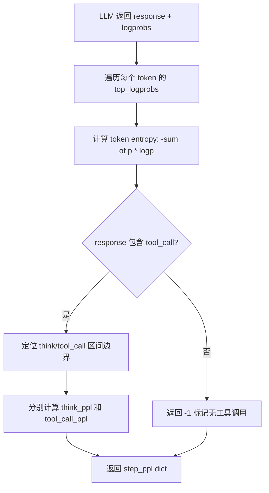
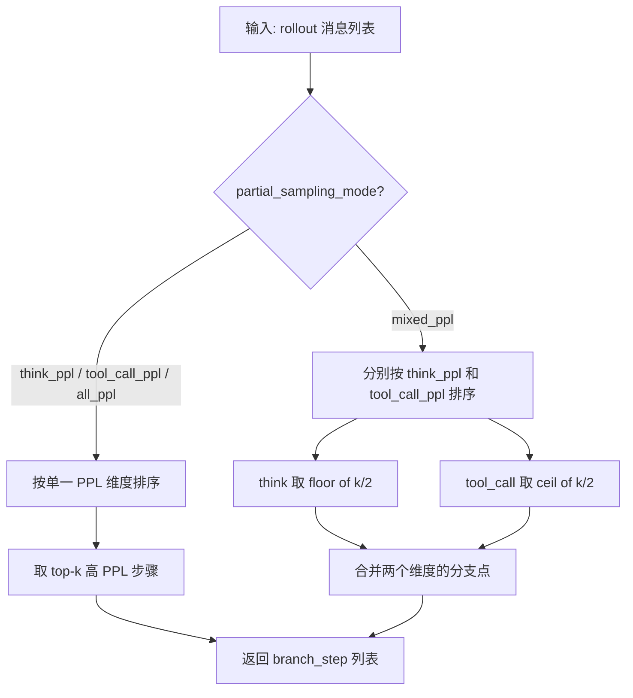

# PD-338.01 DeepResearch — ParallelMuse 不确定性驱动分支采样与 Report 压缩聚合

> 文档编号：PD-338.01
> 来源：DeepResearch `WebAgent/ParallelMuse/functionality_specified_partial_rollout.py`, `WebAgent/ParallelMuse/compressed_reasoning_aggregation.py`
> GitHub：https://github.com/Alibaba-NLP/DeepResearch
> 问题域：PD-338 并行推理与Test-Time Scaling Parallel Inference & Test-Time Scaling
> 状态：可复用方案

---

## 第 1 章 问题与动机

### 1.1 核心问题

Agent 在执行长链推理（long-horizon reasoning）任务时，单条推理路径（trajectory）的质量受限于模型在关键决策步骤的不确定性。传统的 test-time scaling 方法（如 Best-of-N）对每个问题独立采样 N 条完整轨迹，计算成本与 N 线性增长，但大量采样预算浪费在模型已经"确信"的步骤上。

核心矛盾：**如何在固定采样预算下，将计算资源集中投放到模型最不确定的推理步骤，而非均匀撒网？**

这个问题在 Deep Research 类任务中尤为突出——一次完整 rollout 可能包含数十轮 search/visit 工具调用，每轮都有 thinking（推理）和 tool_call（工具选择）两个决策点。某些步骤模型非常确定（如格式化输出），某些步骤则高度不确定（如选择搜索关键词、判断信息是否充分）。

### 1.2 DeepResearch 的解法概述

DeepResearch 的 ParallelMuse 模块实现了一套**功能特化的部分采样**（Functionality-Specified Partial Rollout）策略：

1. **PPL 信号采集**：每次 LLM 调用时请求 `logprobs`，计算 token-level entropy，再按 `<think>` 和 `<tool_call>` 区间分别聚合为 `think_ppl` 和 `tool_call_ppl`（`functionality_specified_partial_rollout.py:113-157`）
2. **分支点识别**：对初始 rollout 的每个 step，按 PPL 降序排列，取 top-k 作为高不确定性分支点（`functionality_specified_partial_rollout.py:285-317`）
3. **部分重采样**：从分支点截断原始轨迹，以截断前的消息历史为前缀，重新 rollout 多次（`functionality_specified_partial_rollout.py:439-446`）
4. **Report 压缩**：将每条完整轨迹压缩为结构化 report（Solution Planning + Solution Methods + Final Reasoning），大幅减少聚合阶段的 token 消耗（`compressed_reasoning_aggregation.py:26-45`）
5. **投票聚合**：将多份 report 送入 LLM 做批判性评估，通过一致性投票选出最优答案（`compressed_reasoning_aggregation.py:48-68`）

### 1.3 设计思想

| 设计原则 | 具体实现 | 理由 | 替代方案 |
|----------|----------|------|----------|
| 功能特化不确定性度量 | 分离 think_ppl 和 tool_call_ppl | 推理不确定性和工具选择不确定性是不同维度，混合度量会模糊信号 | 全局 PPL（all_ppl）不区分功能区间 |
| 预算感知采样 | sampling_budget 参数控制总采样数，按 initial + partial 分配 | 固定预算下最大化信息增益 | 无预算限制的贪心采样 |
| 压缩后聚合 | 先 report 再 integrate，而非直接拼接原始轨迹 | 原始轨迹可达 128K tokens，直接拼接超出上下文窗口 | 截断拼接、摘要拼接 |
| 混合采样模式 | mixed_ppl 模式同时考虑 think 和 tool_call 两个维度 | 单一维度可能遗漏另一维度的高不确定性步骤 | 仅用 tool_call_ppl |
| 异步并行执行 | asyncio.Semaphore 控制 LLM/search/visit 并发 | 多条 rollout 可完全并行，受限于 API QPS 而非串行等待 | 串行执行 |

---

## 第 2 章 源码实现分析

### 2.1 架构概览

ParallelMuse 的整体架构分为两个阶段：**采样阶段**（partial rollout）和**聚合阶段**（compressed reasoning aggregation）。

```
┌─────────────────────────────────────────────────────────────────┐
│                    Phase 1: Partial Rollout                      │
│                                                                  │
│  Question ──→ Initial Rollout (N条) ──→ PPL 计算                │
│                     │                      │                     │
│                     ▼                      ▼                     │
│              step_ppl 记录          branch_high_uncertainty      │
│              (think/tool_call)      (top-k 高 PPL 步骤)         │
│                                          │                       │
│                                          ▼                       │
│                                   Partial Rollout               │
│                                   (从分支点重新采样)             │
│                                          │                       │
│                                          ▼                       │
│                              所有 rollout 结果 (JSONL)           │
├─────────────────────────────────────────────────────────────────┤
│                    Phase 2: Aggregation                          │
│                                                                  │
│  Rollout 结果 ──→ cluster_by_question                           │
│                        │                                         │
│                        ▼                                         │
│              call_state_report (每条轨迹 → 压缩 report)         │
│                        │                                         │
│                        ▼                                         │
│              call_info_integrate (多 report → 投票聚合)          │
│                        │                                         │
│                        ▼                                         │
│                   Final Answer                                   │
└─────────────────────────────────────────────────────────────────┘
```

### 2.2 核心实现

#### 2.2.1 Token-Level Entropy 计算与功能区间 PPL 聚合



对应源码 `WebAgent/ParallelMuse/functionality_specified_partial_rollout.py:113-157`：

```python
all_token_entropies = []  # [(token, entropy), ...]
for tok, toplogprobs in zip(result_tokens, result_toplogprobs):
    logprob_values = np.array([tlp.logprob for tlp in toplogprobs], dtype=np.float64)
    
    probs = np.exp(logprob_values)
    probs = probs / probs.sum()

    entropy = -np.sum(probs * logprob_values)
    all_token_entropies.append((tok, entropy))

# 定位功能区间边界
if "<tool_call>" in ''.join(result_tokens):
    think_start = find_pattern_last_idx(['<think>'])
    think_end = find_pattern_last_idx(['</think>'])
    tool_call_start = find_pattern_last_idx(['<tool_call>'])
    tool_call_end = find_pattern_last_idx(['</tool_call>'])

    entropies = [entropy for _, entropy in all_token_entropies]
    think_ppl = np.exp(np.mean(entropies[think_start+1: think_end])) if think_end else -1
    tool_call_ppl = np.exp(np.mean(entropies[tool_call_start+1: tool_call_end])) \
        if tool_call_start and tool_call_end else -1
    all_ppl = np.exp(np.mean(entropies))
```

关键细节：
- 使用 `top_logprobs=16` 获取 top-16 候选 token 的 logprob（`functionality_specified_partial_rollout.py:92`）
- entropy 计算使用归一化后的概率分布，而非原始 logprob
- PPL 通过 `exp(mean(entropy))` 计算，而非传统的 `exp(mean(neg_logprob))`——这是一种基于 entropy 的 PPL 变体，更能反映模型的"犹豫程度"

#### 2.2.2 分支点识别与混合采样模式



对应源码 `WebAgent/ParallelMuse/functionality_specified_partial_rollout.py:285-317`：

```python
def branch_high_uncertainty_steps(rollout, partial_sampling_topk, partial_sampling_mode):
    branch_step = []

    if partial_sampling_mode != "mixed_ppl":
        for i, msg in enumerate(rollout):
            if msg.get("step_ppl", None):
                branch_step.append({'step_id': i, 'step_ppl': msg['step_ppl'][partial_sampling_mode]})
        
        branch_step = sorted(branch_step, key=lambda x: x['step_ppl'], reverse=True)[:partial_sampling_topk]

    else:
        tool_call_sampling_topk = math.ceil(partial_sampling_topk / 2)
        think_sampling_topk = math.floor(partial_sampling_topk / 2)

        tool_call_branch_step = []
        think_branch_step = []

        for i, msg in enumerate(rollout):
            if msg.get("step_ppl", None):
                tool_call_branch_step.append({'step_id': i, 'step_ppl': msg['step_ppl']['tool_call_ppl']})
        tool_call_branch_step = sorted(tool_call_branch_step, key=lambda x: x['step_ppl'], reverse=True)[:tool_call_sampling_topk]

        for i, msg in enumerate(rollout):
            if msg.get("step_ppl", None):
                think_branch_step.append({'step_id': i, 'step_ppl': msg['step_ppl']['think_ppl']})
        think_branch_step = sorted(think_branch_step, key=lambda x: x['step_ppl'], reverse=True)[:think_sampling_topk]

        branch_step.extend(tool_call_branch_step)
        branch_step.extend(think_branch_step)

    return branch_step
```

五种采样模式（`functionality_specified_partial_rollout.py:515`）：
- `none`：传统 Best-of-N，不做部分采样
- `all_ppl`：按全局 PPL 排序
- `think_ppl`：仅按推理区间 PPL 排序
- `tool_call_ppl`：仅按工具调用区间 PPL 排序
- `mixed_ppl`：混合模式，同时从两个维度各取一半

### 2.3 实现细节

#### 采样预算分配

预算分配公式（`functionality_specified_partial_rollout.py:403`）：

```
sampling_budget >= initial_rollout_num 
    + initial_rollout_num * partial_sampling_topk * partial_sampling_rounds * partial_sampling_times_per_pos
```

默认参数（`functionality_specified_partial_rollout.py:509-518`）：
- `sampling_budget = 8`（总采样预算）
- `initial_rollout_num = 1`（初始完整 rollout 数）
- `partial_sampling_topk = 2`（每条 rollout 取 top-2 分支点）
- `partial_sampling_rounds = 1`（采样轮数）
- `partial_sampling_times_per_pos = 3`（每个分支点重采样 3 次）

即：1 条初始 + 2 分支点 × 1 轮 × 3 次 = 7 条部分 rollout，总计 8 条。

#### 部分 Rollout 的截断与续写

从分支点截断时，使用 `r['rollout'][:int(b['step_id'])]` 作为前缀消息，并将剩余 turn 数设为 `max_turn - (step_id - 2) / 2`（`functionality_specified_partial_rollout.py:441-443`），确保部分 rollout 不会超出总步数限制。

#### Report 压缩 Prompt 设计

`compressed_reasoning_aggregation.py:26-45` 定义了 REPORT_PROMPT，要求 LLM 将完整轨迹蒸馏为三部分：
1. **Solution Planning**：子问题分解与依赖关系
2. **Solution Methods**：每个子问题的工具调用参数和关键结果片段（不重复完整工具输出）
3. **Final Reasoning**：从子答案到最终答案的推导过程

#### 投票聚合的批判性评估

`compressed_reasoning_aggregation.py:48-68` 的 INTEGRATE_PROMPT 包含多条关键约束：
- 多份 report 得出相同结论时增加可信度，但不保证正确
- 没有明确最终答案的 report 应降低置信度
- 禁止合并不同答案或给出过于宽泛的答案
- 禁止调用外部工具验证，必须基于已有信息分析

---

## 第 3 章 迁移指南

### 3.1 迁移清单

**阶段 1：PPL 信号采集（1-2 天）**
- [ ] 确认 LLM 推理后端支持 `logprobs` 返回（vLLM、OpenAI API 均支持）
- [ ] 在 LLM 调用层添加 `logprobs=True, top_logprobs=16` 参数
- [ ] 实现 token-level entropy 计算函数
- [ ] 实现功能区间定位（根据你的 prompt 格式定义 think/tool_call 边界标记）
- [ ] 将 step_ppl 附加到每个 assistant 消息的 metadata 中

**阶段 2：分支采样引擎（1-2 天）**
- [ ] 实现 `branch_high_uncertainty_steps` 函数
- [ ] 实现部分 rollout 的截断与续写逻辑
- [ ] 实现采样预算分配与断言校验
- [ ] 添加 `partial_sampling_mode` 配置（至少支持 `none` 和 `tool_call_ppl`）

**阶段 3：Report 压缩与聚合（1 天）**
- [ ] 设计 REPORT_PROMPT（可直接复用 DeepResearch 的模板）
- [ ] 实现轨迹 → 交互文本的格式化函数
- [ ] 实现 INTEGRATE_PROMPT 的投票聚合逻辑
- [ ] 添加错误 report 过滤（跳过 `[No Prediction]` 和 `[Error]`）

**阶段 4：并发控制与持久化（0.5 天）**
- [ ] 使用 asyncio.Semaphore 分别控制 LLM/工具的并发数
- [ ] 实现 JSONL 增量写入 + fsync 持久化
- [ ] 实现断点续传（读取已有结果，跳过已完成的 question）

### 3.2 适配代码模板

以下是一个可直接运行的最小化实现，包含 PPL 计算和分支采样核心逻辑：

```python
import math
import numpy as np
from dataclasses import dataclass, field
from typing import Optional


@dataclass
class StepPPL:
    think_ppl: float = -1.0
    tool_call_ppl: float = -1.0
    all_ppl: float = -1.0


def compute_step_ppl(
    tokens: list[str],
    top_logprobs: list[list[dict]],  # [{token, logprob}, ...]
    think_start_tag: str = "<think>",
    think_end_tag: str = "</think>",
    tool_call_start_tag: str = "<tool_call>",
    tool_call_end_tag: str = "</tool_call>",
) -> StepPPL:
    """从 LLM 返回的 logprobs 计算功能特化 PPL。"""
    entropies = []
    for tok_logprobs in top_logprobs:
        logprob_values = np.array([lp["logprob"] for lp in tok_logprobs], dtype=np.float64)
        probs = np.exp(logprob_values)
        probs = probs / probs.sum()
        entropy = -np.sum(probs * logprob_values)
        entropies.append(entropy)

    full_text = "".join(tokens)
    result = StepPPL(all_ppl=float(np.exp(np.mean(entropies))))

    def find_tag_end(tag: str) -> Optional[int]:
        acc = ""
        for i, t in enumerate(tokens):
            acc += t
            if tag in acc:
                return i
        return None

    if tool_call_start_tag in full_text:
        ts = find_tag_end(think_start_tag)
        te = find_tag_end(think_end_tag)
        tcs = find_tag_end(tool_call_start_tag)
        tce = find_tag_end(tool_call_end_tag)

        if ts is not None and te is not None:
            result.think_ppl = float(np.exp(np.mean(entropies[ts + 1 : te])))
        if tcs is not None and tce is not None:
            result.tool_call_ppl = float(np.exp(np.mean(entropies[tcs + 1 : tce])))

    return result


def select_branch_points(
    steps: list[dict],  # [{"step_id": int, "step_ppl": StepPPL}, ...]
    top_k: int = 2,
    mode: str = "tool_call_ppl",  # "think_ppl" | "tool_call_ppl" | "all_ppl" | "mixed_ppl"
) -> list[dict]:
    """选择 top-k 高不确定性步骤作为分支点。"""
    if mode != "mixed_ppl":
        scored = [
            {"step_id": s["step_id"], "score": getattr(s["step_ppl"], mode)}
            for s in steps if s["step_ppl"].all_ppl > 0
        ]
        scored.sort(key=lambda x: x["score"], reverse=True)
        return scored[:top_k]

    # mixed_ppl: 从两个维度各取一半
    tc_k = math.ceil(top_k / 2)
    th_k = math.floor(top_k / 2)

    tc_scored = sorted(
        [{"step_id": s["step_id"], "score": s["step_ppl"].tool_call_ppl} for s in steps if s["step_ppl"].tool_call_ppl > 0],
        key=lambda x: x["score"], reverse=True
    )[:tc_k]

    th_scored = sorted(
        [{"step_id": s["step_id"], "score": s["step_ppl"].think_ppl} for s in steps if s["step_ppl"].think_ppl > 0],
        key=lambda x: x["score"], reverse=True
    )[:th_k]

    return tc_scored + th_scored
```

### 3.3 适用场景

| 场景 | 适用度 | 说明 |
|------|--------|------|
| Deep Research / 长链搜索推理 | ⭐⭐⭐ | 原生场景，多轮 search+visit 有大量分支决策点 |
| 数学推理 / 代码生成 | ⭐⭐⭐ | 推理步骤多，PPL 信号清晰，分支采样收益高 |
| 简单 QA / 单轮对话 | ⭐ | 步骤太少，分支采样无意义，直接 Best-of-N 即可 |
| 实时交互场景 | ⭐ | 需要等待多条 rollout 完成，延迟不可接受 |
| 离线批量评估 | ⭐⭐⭐ | 可充分利用并行，预算可控，最适合 |
| 无 logprobs 的 API（如部分闭源模型） | ❌ | 无法获取 token-level entropy，方案不可用 |

---

## 第 4 章 测试用例

```python
import math
import numpy as np
import pytest
from unittest.mock import MagicMock


class StepPPL:
    def __init__(self, think_ppl=-1.0, tool_call_ppl=-1.0, all_ppl=-1.0):
        self.think_ppl = think_ppl
        self.tool_call_ppl = tool_call_ppl
        self.all_ppl = all_ppl


class TestEntropyComputation:
    """测试 token-level entropy 计算的正确性。"""

    def test_uniform_distribution_max_entropy(self):
        """均匀分布应产生最大 entropy。"""
        n = 16
        logprobs = [math.log(1.0 / n)] * n
        probs = np.exp(np.array(logprobs, dtype=np.float64))
        probs = probs / probs.sum()
        entropy = -np.sum(probs * np.array(logprobs, dtype=np.float64))
        assert entropy > 2.5  # ln(16) ≈ 2.77

    def test_peaked_distribution_low_entropy(self):
        """高度集中的分布应产生低 entropy。"""
        logprobs = [math.log(0.99)] + [math.log(0.01 / 15)] * 15
        probs = np.exp(np.array(logprobs, dtype=np.float64))
        probs = probs / probs.sum()
        entropy = -np.sum(probs * np.array(logprobs, dtype=np.float64))
        assert entropy < 0.2

    def test_ppl_from_entropy(self):
        """PPL = exp(mean(entropy))，验证计算链。"""
        entropies = [0.5, 1.0, 1.5]
        ppl = np.exp(np.mean(entropies))
        assert abs(ppl - np.exp(1.0)) < 1e-6


class TestBranchPointSelection:
    """测试分支点选择逻辑。"""

    def _make_steps(self, ppls):
        return [
            {"step_id": i, "step_ppl": StepPPL(think_ppl=t, tool_call_ppl=tc, all_ppl=a)}
            for i, (t, tc, a) in enumerate(ppls)
        ]

    def test_topk_selection_by_tool_call_ppl(self):
        """应按 tool_call_ppl 降序取 top-k。"""
        steps = self._make_steps([
            (1.0, 3.0, 2.0),  # step 0
            (2.0, 1.0, 1.5),  # step 1
            (1.5, 5.0, 3.0),  # step 2
            (3.0, 2.0, 2.5),  # step 3
        ])
        # 手动实现 select_branch_points 逻辑
        scored = sorted(
            [{"step_id": s["step_id"], "score": s["step_ppl"].tool_call_ppl} for s in steps],
            key=lambda x: x["score"], reverse=True
        )[:2]
        assert scored[0]["step_id"] == 2  # tool_call_ppl=5.0
        assert scored[1]["step_id"] == 0  # tool_call_ppl=3.0

    def test_mixed_ppl_splits_budget(self):
        """mixed_ppl 模式应从两个维度各取一半。"""
        top_k = 4
        tc_k = math.ceil(top_k / 2)  # 2
        th_k = math.floor(top_k / 2)  # 2
        assert tc_k == 2
        assert th_k == 2
        assert tc_k + th_k == top_k

    def test_negative_ppl_filtered(self):
        """PPL 为 -1（无工具调用）的步骤应被过滤。"""
        steps = self._make_steps([
            (1.0, -1.0, 1.0),  # 无 tool_call
            (2.0, 3.0, 2.5),   # 有 tool_call
        ])
        valid = [s for s in steps if s["step_ppl"].tool_call_ppl > 0]
        assert len(valid) == 1
        assert valid[0]["step_id"] == 1


class TestSamplingBudget:
    """测试采样预算分配的正确性。"""

    def test_budget_formula(self):
        """验证预算公式：budget >= initial + initial * topk * rounds * times_per_pos。"""
        initial = 1
        topk = 2
        rounds = 1
        times_per_pos = 3
        budget = 8
        required = initial + initial * topk * rounds * times_per_pos
        assert budget >= required  # 8 >= 1 + 1*2*1*3 = 7

    def test_budget_insufficient_raises(self):
        """预算不足时应触发断言。"""
        initial = 2
        topk = 3
        rounds = 1
        times_per_pos = 3
        budget = 10
        required = initial + initial * topk * rounds * times_per_pos
        assert budget < required  # 10 < 2 + 2*3*1*3 = 20


class TestReportCompression:
    """测试 report 压缩与聚合逻辑。"""

    def test_construct_interaction_extracts_thinking(self):
        """应正确提取 <think> 和 <tool_call> 区间内容。"""
        record = [
            {"role": "system", "content": "You are a research assistant."},
            {"role": "user", "content": "What is X?"},
            {"role": "assistant", "content": "<think>I need to search</think>\n<tool_call>{\"name\":\"search\",\"arguments\":{\"query\":[\"X\"]}}</tool_call>"},
            {"role": "user", "content": "<tool_response>Result about X</tool_response>"},
        ]
        # 验证 thinking 提取
        raw = record[2]["content"]
        thinking = raw.split("<think>")[-1].split("</think>")[0].strip()
        assert thinking == "I need to search"

    def test_no_prediction_filtered(self):
        """prediction 为 [No Prediction] 的轨迹应被跳过。"""
        traj = {"prediction": "[No Prediction]", "rollout": []}
        assert traj["prediction"] == "[No Prediction]"
        # compressed_reasoning_aggregation.py:164 会返回 error
```

---

## 第 5 章 跨域关联

| 关联域 | 关系类型 | 说明 |
|--------|----------|------|
| PD-01 上下文管理 | 依赖 | Report 压缩本质上是一种上下文压缩策略——将 128K 的完整轨迹压缩为结构化 report，使聚合阶段不超出上下文窗口 |
| PD-02 多 Agent 编排 | 协同 | 多条 partial rollout 可视为多个"虚拟 Agent"并行探索不同推理路径，聚合阶段类似 multi-agent 投票 |
| PD-03 容错与重试 | 协同 | 部分 rollout 天然具备容错能力——某条路径失败（`llm_error_occurred`、`max_length_exceeded`）不影响其他路径，聚合时自动过滤错误 report |
| PD-07 质量检查 | 协同 | INTEGRATE_PROMPT 中的批判性评估规则（一致性投票、置信度降级）是一种内置的质量保障机制 |
| PD-11 可观测性 | 依赖 | step_ppl 记录在每个 assistant 消息的 metadata 中，为可观测性提供了 token-level 的不确定性追踪数据 |
| PD-12 推理增强 | 协同 | ParallelMuse 本身就是一种推理增强策略——通过 test-time scaling 在推理阶段提升模型能力上限 |

---

## 第 6 章 来源文件索引

| 文件 | 行范围 | 关键实现 |
|------|--------|----------|
| `WebAgent/ParallelMuse/functionality_specified_partial_rollout.py` | L72-L159 | `call_llm` 函数：LLM 调用 + logprobs 获取 + token entropy 计算 + 功能区间 PPL 聚合 |
| `WebAgent/ParallelMuse/functionality_specified_partial_rollout.py` | L179-L202 | `get_initial_rollouts`：初始 rollout 选择策略（优先 answer 终止的、排除 error 的） |
| `WebAgent/ParallelMuse/functionality_specified_partial_rollout.py` | L205-L282 | `rollout_single_traj`：单条轨迹的完整 rollout 循环（LLM → tool_call 解析 → tool 执行 → 循环） |
| `WebAgent/ParallelMuse/functionality_specified_partial_rollout.py` | L285-L317 | `branch_high_uncertainty_steps`：分支点识别核心函数，支持 5 种采样模式 |
| `WebAgent/ParallelMuse/functionality_specified_partial_rollout.py` | L320-L494 | `main`：主流程编排——初始 rollout → 分支检测 → 部分采样 → 异步执行 → JSONL 持久化 |
| `WebAgent/ParallelMuse/functionality_specified_partial_rollout.py` | L497-L526 | argparse 参数定义：采样预算、并发控制、采样模式等全部配置项 |
| `WebAgent/ParallelMuse/compressed_reasoning_aggregation.py` | L26-L45 | `REPORT_PROMPT`：轨迹压缩 prompt 模板（Solution Planning + Methods + Final Reasoning） |
| `WebAgent/ParallelMuse/compressed_reasoning_aggregation.py` | L48-L68 | `INTEGRATE_PROMPT`：多 report 投票聚合 prompt 模板（批判性评估 + 一致性投票） |
| `WebAgent/ParallelMuse/compressed_reasoning_aggregation.py` | L117-L157 | `construct_interaction_from_record`：将 rollout 消息列表格式化为可读交互文本 |
| `WebAgent/ParallelMuse/compressed_reasoning_aggregation.py` | L159-L193 | `call_state_report`：单条轨迹 → 压缩 report 的异步调用 |
| `WebAgent/ParallelMuse/compressed_reasoning_aggregation.py` | L196-L233 | `call_info_integrate`：多 report → 最终答案的投票聚合 |
| `WebAgent/ParallelMuse/compressed_reasoning_aggregation.py` | L236-L249 | `call_converge`：编排 report 生成 + 聚合的完整流程 |
| `WebAgent/ParallelMuse/vllm_deploy.sh` | L1-L7 | vLLM 部署脚本：128K 上下文、4 卡张量并行 |

---

## 第 7 章 横向对比维度

```json comparison_data
{
  "project": "DeepResearch",
  "dimensions": {
    "推理方式": "PPL 驱动部分 rollout：初始完整轨迹 + 高不确定性步骤分支重采样",
    "分支策略": "功能特化 PPL（think_ppl/tool_call_ppl/mixed_ppl）top-k 选择",
    "聚合机制": "两阶段：轨迹→Report 压缩 + 多 Report 批判性投票聚合",
    "预算控制": "公式化预算分配：initial + topk × rounds × times_per_pos",
    "并发模型": "asyncio.Semaphore 三级并发控制（LLM/search/visit 独立限流）",
    "成本": "比 Best-of-N 更高效：固定预算下将计算集中在高不确定性步骤"
  }
}
```

### 域元数据补充

```json domain_metadata
{
  "solution_summary": "DeepResearch ParallelMuse 用功能特化 PPL（think_ppl/tool_call_ppl）识别高不确定性步骤，在分支点部分重采样，通过 Report 压缩+投票聚合得到最优答案",
  "description": "功能区间级别的不确定性度量与预算感知的部分重采样策略",
  "sub_problems": [
    "如何将完整轨迹压缩为可聚合的结构化 report 而不丢失关键推理链",
    "如何在混合采样模式下平衡 think 和 tool_call 两个维度的分支预算"
  ],
  "best_practices": [
    "分离 think 区间和 tool_call 区间分别计算 PPL，避免功能混淆",
    "两阶段聚合：先压缩为 report 再投票，解决多轨迹拼接超出上下文窗口的问题",
    "公式化预算分配并用 assert 校验，防止采样预算溢出或不足"
  ]
}
```
