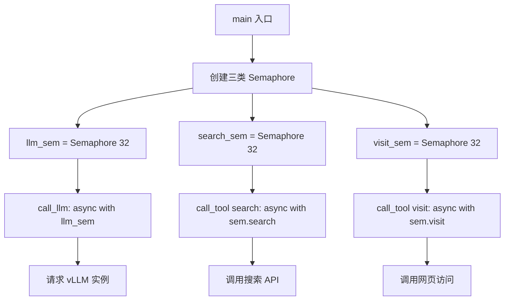
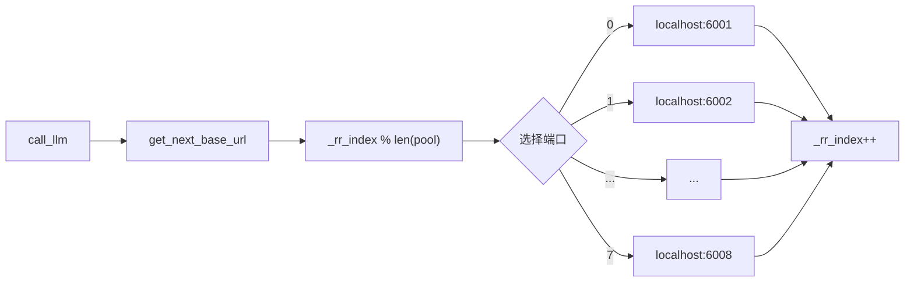

# PD-339.01 DeepResearch — 三层并发模型与 vLLM 轮询负载均衡

> 文档编号：PD-339.01
> 来源：DeepResearch `inference/run_multi_react.py` `WebAgent/ParallelMuse/functionality_specified_partial_rollout.py`
> GitHub：https://github.com/Alibaba-NLP/DeepResearch
> 问题域：PD-339 并发执行与负载均衡 Concurrent Execution & Load Balancing
> 状态：可复用方案

---

## 第 1 章 问题与动机

### 1.1 核心问题

大规模 Agent 推理场景（如 BrowseComp 1266 题 × 8 rollout = 10000+ 并发任务）面临三重挑战：

1. **GPU 资源瓶颈**：单 vLLM 实例无法承载数百并发请求，需要多实例分摊负载
2. **异构资源竞争**：LLM 推理（GPU 密集）与工具调用（网络 I/O 密集）争抢事件循环/线程池
3. **分布式扩展**：单机 8 卡不够时，需要跨节点水平扩展，且数据不能重复处理

DeepResearch 的解法不是引入 Kubernetes 或消息队列等重型基础设施，而是用 Python 原生并发原语（asyncio.Semaphore + ThreadPoolExecutor + 全局 round-robin 计数器）构建了一套轻量但有效的三层并发控制体系。

### 1.2 DeepResearch 的解法概述

1. **三类 Semaphore 分治**：LLM 调用、搜索工具、访问工具各自独立的 Semaphore 控制并发上限，避免资源类型间互相阻塞（`functionality_specified_partial_rollout.py:321-325`）
2. **全局 round-robin 负载均衡**：通过全局 `_rr_index` 计数器在多个 vLLM 端口间轮询分配请求，无需服务发现组件（`functionality_specified_partial_rollout.py:24-28, 64-69`）
3. **数据分片（total_splits/worker_split）**：支持多节点分布式推理，每个 worker 只处理自己的数据切片，通过 `math.ceil` 均匀分配（`run_multi_react.py:73-80`）
4. **双并发模型共存**：asyncio 协程用于 I/O 密集的 ParallelMuse/NestBrowse 场景，ThreadPoolExecutor 用于 CPU 密集的 run_multi_react 场景，按需选择
5. **断点续传**：通过 Counter 统计已完成任务，跳过已处理的 question，支持中断后恢复（`run_multi_react.py:91-108`）

### 1.3 设计思想

| 设计原则 | 具体实现 | 理由 | 替代方案 |
|----------|----------|------|----------|
| 资源分类隔离 | LLM/search/visit 三独立 Semaphore | GPU 推理与网络 I/O 特性不同，统一限流会导致 GPU 空闲时网络请求也被阻塞 | 单一全局 Semaphore（简单但浪费资源） |
| 无状态负载均衡 | 全局 `_rr_index` 模运算轮询 | 无需服务注册/发现，vLLM 实例同构时 round-robin 即最优 | 一致性哈希（过度设计）、随机选择（不均匀） |
| 数据级并行 | `total_splits/worker_split` 切片 | 利用 WORLD_SIZE/RANK 环境变量，与分布式训练框架无缝对接 | 消息队列分发（引入额外依赖） |
| 粘性端口分配 | `question_to_ports` 字典缓存 | 同一 question 的多次 rollout 发往同一 vLLM 实例，利用 KV Cache 局部性 | 每次随机分配（丢失缓存亲和性） |
| 渐进式写入 | `f.flush() + os.fsync()` 每条结果立即落盘 | 长时间推理任务中断时不丢失已完成结果 | 批量写入（中断丢失整批） |

---

## 第 2 章 源码实现分析

### 2.1 架构概览

DeepResearch 的并发体系分为三层，从上到下分别是：数据分片层、任务调度层、资源控制层。

```
┌─────────────────────────────────────────────────────────────────┐
│                    数据分片层 (Data Sharding)                     │
│  run_react_infer.sh: WORLD_SIZE / RANK → total_splits/worker_split │
│  每个节点只处理 items[start_idx:end_idx]                          │
├─────────────────────────────────────────────────────────────────┤
│                    任务调度层 (Task Scheduling)                    │
│  ┌──────────────────────┐  ┌──────────────────────────────┐     │
│  │ ThreadPoolExecutor   │  │ asyncio.as_completed         │     │
│  │ (run_multi_react.py) │  │ (partial_rollout.py)         │     │
│  │ max_workers=20       │  │ 全部 tasks 一次性提交         │     │
│  └──────────────────────┘  └──────────────────────────────┘     │
├─────────────────────────────────────────────────────────────────┤
│                    资源控制层 (Resource Control)                   │
│  ┌─────────────┐  ┌──────────────┐  ┌──────────────┐           │
│  │ llm_sem(32) │  │ search_sem(32)│  │ visit_sem(32)│           │
│  └──────┬──────┘  └──────┬───────┘  └──────┬───────┘           │
│         │                │                  │                    │
│  ┌──────▼──────────────────────────────────────────┐            │
│  │     vLLM Round-Robin Pool (ports 6001-6008)     │            │
│  │     _rr_index % len(pool) → 选择端口             │            │
│  └─────────────────────────────────────────────────┘            │
└─────────────────────────────────────────────────────────────────┘
```

### 2.2 核心实现

#### 2.2.1 三类 Semaphore 分治控制



对应源码 `WebAgent/ParallelMuse/functionality_specified_partial_rollout.py:320-325`：

```python
async def main(args):
    llm_sem = asyncio.Semaphore(args.max_llm_workers)
    tool_sem = {
        'search': asyncio.Semaphore(args.max_search_workers),
        'visit': asyncio.Semaphore(args.max_visit_workers)
    }
```

工具调用端的 Semaphore 使用（`functionality_specified_partial_rollout.py:162-171`）：

```python
async def call_tool(sem, tool_name: str, tool_args: dict):
    if tool_name == "search":
        async with sem['search']:
            return await search.call(tool_args)
    elif tool_name == "visit":
        async with sem['visit']:
            return await visit.call(tool_args)
```

NestBrowse 进一步扩展为三类 Semaphore（`NestBrowse/infer_async_nestbrowse.py:178-182`）：

```python
sem = {
    'session': asyncio.Semaphore(MAX_WORKERS),
    'llm': asyncio.Semaphore(MAX_WORKERS),
    'tool': asyncio.Semaphore(MAX_WORKERS),
}
```

这里 `session` Semaphore 控制整体会话并发数，`llm` 和 `tool` 分别控制 LLM 调用和工具调用的并发度，实现了更细粒度的资源隔离。

#### 2.2.2 Round-Robin 负载均衡



对应源码 `WebAgent/ParallelMuse/functionality_specified_partial_rollout.py:24-28, 64-69`：

```python
_rr_index = 0
AGENT_LLM_BASE_URL_POOL = [
    "http://localhost:8000/v1",
    # You can add more LLM API URLs here to balance the workload.
]

def get_next_base_url():
    global _rr_index
    url = AGENT_LLM_BASE_URL_POOL[_rr_index % len(AGENT_LLM_BASE_URL_POOL)]
    _rr_index += 1
    return url
```

在 `run_multi_react.py` 中，采用了更精细的**粘性端口分配**策略（`run_multi_react.py:113-140`）：

```python
planning_ports = [6001, 6002, 6003, 6004, 6005, 6006, 6007, 6008]
planning_rr_idx = 0
question_to_ports = {}

for rollout_idx in range(1, roll_out_count + 1):
    for item in items:
        question = item.get("question", "").strip()
        if question not in question_to_ports:
            planning_port = planning_ports[planning_rr_idx % len(planning_ports)]
            question_to_ports[question] = planning_port
            planning_rr_idx += 1
        planning_port = question_to_ports[question]
```

这里的关键设计是 `question_to_ports` 字典：同一个 question 的所有 rollout 都路由到同一个 vLLM 端口，利用 vLLM 的 prefix caching 机制（相同 system prompt + question 的 KV Cache 可复用），显著减少重复计算。

### 2.3 实现细节

#### 数据分片与分布式推理

Shell 脚本启动 8 个 vLLM 实例，每个绑定一张 GPU（`run_react_infer.sh:30-37`）：

```bash
CUDA_VISIBLE_DEVICES=0 vllm serve $MODEL_PATH --host 0.0.0.0 --port 6001 &
CUDA_VISIBLE_DEVICES=1 vllm serve $MODEL_PATH --host 0.0.0.0 --port 6002 &
# ... 共 8 个实例，端口 6001-6008
```

Python 端的数据分片（`run_multi_react.py:73-83`）：

```python
total_items = len(items)
items_per_split = math.ceil(total_items / total_splits)
start_idx = (worker_split - 1) * items_per_split
end_idx = min(worker_split * items_per_split, total_items)
items = items[start_idx:end_idx]
```

Shell 脚本通过环境变量传递分布式参数（`run_react_infer.sh:117`）：

```bash
python -u run_multi_react.py ... --total_splits ${WORLD_SIZE:-1} --worker_split $((${RANK:-0} + 1))
```

#### ThreadPoolExecutor + 写锁保护

`run_multi_react.py` 使用 ThreadPoolExecutor 而非 asyncio，因为 `react_agent.py` 中的 `_run` 方法是同步阻塞的（内部使用同步 OpenAI 客户端）。写锁保护并发文件写入（`run_multi_react.py:172-191`）：

```python
write_locks = {i: threading.Lock() for i in range(1, roll_out_count + 1)}

with ThreadPoolExecutor(max_workers=args.max_workers) as executor:
    future_to_task = {
        executor.submit(test_agent._run, task, model): task
        for task in tasks_to_run_all
    }
    for future in tqdm(as_completed(future_to_task), total=len(tasks_to_run_all)):
        task_info = future_to_task[future]
        rollout_idx = task_info["rollout_idx"]
        with write_locks[rollout_idx]:
            with open(output_file, "a", encoding="utf-8") as f:
                f.write(json.dumps(result, ensure_ascii=False) + "\n")
```

#### parallel_executor 的串并行分流

WebWatcher 子项目中的 `parallel_executor.py` 实现了工具级别的串并行分流（`WebAgent/WebWatcher/.../parallel_executor.py:9-67`）：

```python
def parallel_exec(fn, list_of_kwargs, max_workers=None, jitter=0.0,
    non_parallelizable_tool_names=['real_code_interpreter', 'code_interpreter', 'python_executor']):
    # 不可并行的工具串行执行
    serial_kwargs = [k for k in list_of_kwargs if k.get('tool_name', '') in non_parallelizable_tool_names]
    if serial_kwargs:
        serial_results = serial_exec(fn, serial_kwargs)
        results.extend(serial_results)
    # 可并行的工具用 ThreadPoolExecutor
    list_of_kwargs = [k for k in list_of_kwargs if k.get('tool_name', '') not in non_parallelizable_tool_names]
    with ThreadPoolExecutor(max_workers=max_workers) as executor:
        futures = []
        for kwargs in list_of_kwargs:
            futures.append(executor.submit(fn, **kwargs))
            if jitter > 0.0:
                time.sleep(jitter * random.random())
```

这里的 `jitter` 参数用于在提交任务时引入随机延迟，避免所有请求同时打到同一个后端实例。`non_parallelizable_tool_names` 列表确保代码解释器等有状态工具不会被并行执行。

#### LLM 调用的指数退避重试

`react_agent.py:70-109` 中的 `call_server` 方法实现了指数退避重试：

```python
def call_server(self, msgs, planning_port, max_tries=10):
    base_sleep_time = 1
    for attempt in range(max_tries):
        try:
            chat_response = client.chat.completions.create(...)
            if content and content.strip():
                return content.strip()
        except (APIError, APIConnectionError, APITimeoutError) as e:
            pass
        if attempt < max_tries - 1:
            sleep_time = base_sleep_time * (2 ** attempt) + random.uniform(0, 1)
            sleep_time = min(sleep_time, 30)
            time.sleep(sleep_time)
```


---

## 第 3 章 迁移指南

### 3.1 迁移清单

**阶段 1：基础并发控制（1 个文件）**
- [ ] 实现分类 Semaphore 字典，按资源类型（LLM、搜索、访问）独立限流
- [ ] 配置化并发上限参数（`max_llm_workers`, `max_search_workers`, `max_visit_workers`）

**阶段 2：负载均衡（1 个文件）**
- [ ] 实现 round-robin URL 池和 `get_next_base_url()` 函数
- [ ] 可选：实现粘性路由（question → port 映射），利用 KV Cache 亲和性

**阶段 3：数据分片（改造入口脚本）**
- [ ] 添加 `total_splits/worker_split` 参数
- [ ] 实现 `math.ceil` 均匀分片逻辑
- [ ] Shell 脚本中通过 `WORLD_SIZE/RANK` 环境变量传递分布式参数

**阶段 4：断点续传（改造输出逻辑）**
- [ ] 启动时扫描已有输出文件，统计已完成 question
- [ ] 跳过已完成任务，只提交未完成的
- [ ] 每条结果立即 `flush + fsync` 落盘

### 3.2 适配代码模板

```python
"""
可复用的三层并发控制模板
从 DeepResearch 提取，适用于任何大规模 Agent 推理场景
"""
import asyncio
import threading
import math
import json
import os
from collections import Counter
from concurrent.futures import ThreadPoolExecutor, as_completed
from typing import Dict, List, Optional


# ============ Layer 1: Round-Robin Load Balancer ============

class RoundRobinBalancer:
    """线程安全的 round-robin 负载均衡器"""
    
    def __init__(self, endpoints: List[str]):
        self._endpoints = endpoints
        self._index = 0
        self._lock = threading.Lock()
        # 粘性路由缓存
        self._sticky_map: Dict[str, str] = {}
    
    def next(self, sticky_key: Optional[str] = None) -> str:
        """获取下一个端点，支持粘性路由"""
        if sticky_key and sticky_key in self._sticky_map:
            return self._sticky_map[sticky_key]
        
        with self._lock:
            endpoint = self._endpoints[self._index % len(self._endpoints)]
            self._index += 1
        
        if sticky_key:
            self._sticky_map[sticky_key] = endpoint
        return endpoint


# ============ Layer 2: Typed Semaphore Pool ============

class SemaphorePool:
    """按资源类型分类的 Semaphore 池"""
    
    def __init__(self, limits: Dict[str, int]):
        self._semaphores = {
            name: asyncio.Semaphore(limit)
            for name, limit in limits.items()
        }
    
    def get(self, resource_type: str) -> asyncio.Semaphore:
        return self._semaphores[resource_type]
    
    async def acquire(self, resource_type: str):
        """上下文管理器用法: async with pool.acquire('llm')"""
        return self._semaphores[resource_type]


# ============ Layer 3: Data Sharding ============

def shard_dataset(items: list, total_splits: int, worker_split: int) -> list:
    """
    均匀分片数据集
    
    Args:
        items: 完整数据集
        total_splits: 总分片数（对应 WORLD_SIZE）
        worker_split: 当前 worker 编号，1-indexed（对应 RANK+1）
    
    Returns:
        当前 worker 应处理的数据切片
    """
    assert 1 <= worker_split <= total_splits
    items_per_split = math.ceil(len(items) / total_splits)
    start_idx = (worker_split - 1) * items_per_split
    end_idx = min(worker_split * items_per_split, len(items))
    return items[start_idx:end_idx]


# ============ Layer 4: Resumable Task Runner ============

class ResumableRunner:
    """支持断点续传的任务运行器"""
    
    def __init__(self, output_path: str, key_field: str = "question"):
        self.output_path = output_path
        self.key_field = key_field
        self._completed = self._scan_completed()
    
    def _scan_completed(self) -> set:
        completed = set()
        if os.path.exists(self.output_path):
            with open(self.output_path, "r") as f:
                for line in f:
                    try:
                        data = json.loads(line)
                        if self.key_field in data and "error" not in data:
                            completed.add(data[self.key_field].strip())
                    except json.JSONDecodeError:
                        pass
        return completed
    
    def is_completed(self, key: str) -> bool:
        return key.strip() in self._completed
    
    def write_result(self, result: dict, lock: threading.Lock):
        with lock:
            with open(self.output_path, "a") as f:
                f.write(json.dumps(result, ensure_ascii=False) + "\n")
                f.flush()
                os.fsync(f.fileno())
```

### 3.3 适用场景

| 场景 | 适用度 | 说明 |
|------|--------|------|
| 多 GPU 本地推理 | ⭐⭐⭐ | 核心场景，8 卡 vLLM 轮询 |
| 多节点分布式推理 | ⭐⭐⭐ | total_splits/worker_split 直接支持 |
| API 调用限流 | ⭐⭐⭐ | Semaphore 控制并发度，避免触发 rate limit |
| 混合 I/O 密集型任务 | ⭐⭐ | 分类 Semaphore 避免资源竞争 |
| 单 GPU 场景 | ⭐ | 过度设计，直接串行即可 |

---

## 第 4 章 测试用例

```python
import asyncio
import math
import threading
import pytest
from unittest.mock import AsyncMock, patch, MagicMock


class TestRoundRobinBalancer:
    """测试 round-robin 负载均衡"""
    
    def test_basic_round_robin(self):
        """验证基本轮询分配"""
        endpoints = ["http://localhost:6001", "http://localhost:6002", "http://localhost:6003"]
        balancer = RoundRobinBalancer(endpoints)
        
        results = [balancer.next() for _ in range(6)]
        assert results == endpoints * 2
    
    def test_sticky_routing(self):
        """验证粘性路由：同一 key 始终路由到同一端点"""
        endpoints = ["http://localhost:6001", "http://localhost:6002"]
        balancer = RoundRobinBalancer(endpoints)
        
        first = balancer.next(sticky_key="question_A")
        for _ in range(10):
            assert balancer.next(sticky_key="question_A") == first
    
    def test_sticky_different_keys_distribute(self):
        """验证不同 key 分布到不同端点"""
        endpoints = ["http://localhost:6001", "http://localhost:6002"]
        balancer = RoundRobinBalancer(endpoints)
        
        port_a = balancer.next(sticky_key="question_A")
        port_b = balancer.next(sticky_key="question_B")
        assert port_a != port_b


class TestSemaphorePool:
    """测试分类 Semaphore"""
    
    @pytest.mark.asyncio
    async def test_independent_limits(self):
        """验证不同资源类型的 Semaphore 互不影响"""
        pool = SemaphorePool({'llm': 2, 'search': 1})
        
        # LLM 可以获取 2 个
        async with pool.get('llm'):
            async with pool.get('llm'):
                # search 仍然可以获取 1 个（不受 LLM 影响）
                async with pool.get('search'):
                    pass
    
    @pytest.mark.asyncio
    async def test_semaphore_blocks_at_limit(self):
        """验证达到上限时阻塞"""
        pool = SemaphorePool({'llm': 1})
        acquired = False
        
        async with pool.get('llm'):
            # 尝试在超时内获取第二个，应该失败
            try:
                await asyncio.wait_for(pool.get('llm').acquire(), timeout=0.1)
                acquired = True
            except asyncio.TimeoutError:
                acquired = False
        
        assert not acquired


class TestDataSharding:
    """测试数据分片"""
    
    def test_even_split(self):
        """验证均匀分片"""
        items = list(range(100))
        shard = shard_dataset(items, total_splits=4, worker_split=1)
        assert len(shard) == 25
        assert shard == list(range(25))
    
    def test_uneven_split_last_worker(self):
        """验证不均匀分片时最后一个 worker 的数据量"""
        items = list(range(10))
        shard = shard_dataset(items, total_splits=3, worker_split=3)
        # ceil(10/3)=4, worker3: items[8:10] = [8, 9]
        assert shard == [8, 9]
    
    def test_single_split(self):
        """验证单分片时返回全部数据"""
        items = list(range(50))
        shard = shard_dataset(items, total_splits=1, worker_split=1)
        assert shard == items
    
    def test_no_overlap(self):
        """验证所有分片无重叠且覆盖全部数据"""
        items = list(range(17))
        all_shards = []
        for i in range(1, 4):
            all_shards.extend(shard_dataset(items, total_splits=3, worker_split=i))
        assert sorted(all_shards) == items


class TestResumableRunner:
    """测试断点续传"""
    
    def test_skip_completed(self, tmp_path):
        """验证跳过已完成的任务"""
        output_file = tmp_path / "results.jsonl"
        output_file.write_text('{"question": "Q1", "answer": "A1"}\n')
        
        runner = ResumableRunner(str(output_file))
        assert runner.is_completed("Q1")
        assert not runner.is_completed("Q2")
    
    def test_skip_errored(self, tmp_path):
        """验证不跳过出错的任务"""
        output_file = tmp_path / "results.jsonl"
        output_file.write_text('{"question": "Q1", "error": "timeout"}\n')
        
        runner = ResumableRunner(str(output_file))
        assert not runner.is_completed("Q1")
```


---

## 第 5 章 跨域关联

| 关联域 | 关系类型 | 说明 |
|--------|----------|------|
| PD-01 上下文管理 | 协同 | 并发推理时每个 rollout 独立维护 messages 上下文，`max_context_length` 限制避免单任务占用过多 GPU 显存 |
| PD-03 容错与重试 | 依赖 | `call_server` 的指数退避重试（`2^attempt + jitter`，上限 30s）是并发场景下的必要保护，避免瞬时错误导致大量任务失败 |
| PD-04 工具系统 | 协同 | `call_tool` 的分类 Semaphore 与工具注册表配合，`non_parallelizable_tool_names` 列表确保有状态工具（如 PythonInterpreter）不被并行执行 |
| PD-11 可观测性 | 协同 | `tqdm(asyncio.as_completed(...))` 提供实时进度条，`inference_error.txt` 记录错误日志，`step_ppl` 记录每步困惑度用于质量分析 |
| PD-12 推理增强 | 依赖 | ParallelMuse 的 `partial_sampling` 机制（基于 PPL 的分支采样）依赖并发执行框架来并行运行多条分支轨迹 |

---

## 第 6 章 来源文件索引

| 文件 | 行范围 | 关键实现 |
|------|--------|----------|
| `WebAgent/ParallelMuse/functionality_specified_partial_rollout.py` | L24-28 | round-robin URL 池定义 |
| `WebAgent/ParallelMuse/functionality_specified_partial_rollout.py` | L64-69 | `get_next_base_url()` 轮询函数 |
| `WebAgent/ParallelMuse/functionality_specified_partial_rollout.py` | L72-76 | `call_llm` 的 Semaphore 控制 |
| `WebAgent/ParallelMuse/functionality_specified_partial_rollout.py` | L162-171 | `call_tool` 分类 Semaphore |
| `WebAgent/ParallelMuse/functionality_specified_partial_rollout.py` | L320-325 | `main` 中三类 Semaphore 初始化 |
| `WebAgent/ParallelMuse/functionality_specified_partial_rollout.py` | L477-494 | `asyncio.as_completed` 非阻塞结果收集 |
| `inference/run_multi_react.py` | L73-83 | 数据分片 `total_splits/worker_split` |
| `inference/run_multi_react.py` | L113-146 | 8 端口 round-robin + 粘性路由 |
| `inference/run_multi_react.py` | L172-191 | ThreadPoolExecutor + 写锁 |
| `inference/run_react_infer.sh` | L30-37 | 8 GPU × 8 vLLM 实例启动 |
| `inference/run_react_infer.sh` | L117 | WORLD_SIZE/RANK 传递分布式参数 |
| `inference/react_agent.py` | L59-110 | `call_server` 指数退避重试 |
| `WebAgent/NestBrowse/infer_async_nestbrowse.py` | L178-182 | 三类 Semaphore（session/llm/tool） |
| `WebAgent/WebWatcher/.../parallel_executor.py` | L9-67 | 串并行分流 + jitter 延迟 |
| `WebAgent/ParallelMuse/compressed_reasoning_aggregation.py` | L75-78 | `random.choice` 随机负载均衡 |

---

## 第 7 章 横向对比维度

```json comparison_data
{
  "project": "DeepResearch",
  "dimensions": {
    "并发模型": "asyncio Semaphore + ThreadPoolExecutor 双模型按场景选择",
    "负载均衡": "全局 _rr_index round-robin + question 粘性路由利用 KV Cache",
    "并发限制": "三类 Semaphore 分治（LLM/search/visit 各 32 并发）",
    "数据分片": "total_splits/worker_split 静态均匀分片，对接 WORLD_SIZE/RANK",
    "断点续传": "Counter 统计已完成 question + flush/fsync 逐条落盘",
    "串并行分流": "non_parallelizable_tool_names 白名单隔离有状态工具"
  }
}
```

### 域元数据补充

```json domain_metadata
{
  "solution_summary": "DeepResearch 用三类 asyncio.Semaphore 分治 LLM/搜索/访问并发，全局 round-robin 轮询 8 端口 vLLM 实例，配合 question 粘性路由利用 KV Cache 亲和性",
  "description": "大规模推理场景下异构资源的分类限流与缓存亲和性负载均衡",
  "sub_problems": [
    "如何利用 KV Cache 亲和性优化多 rollout 场景的推理效率",
    "如何在有状态工具与无状态工具间实现串并行分流"
  ],
  "best_practices": [
    "粘性路由将同一 question 的多次 rollout 路由到同一 vLLM 实例以复用 prefix cache",
    "non_parallelizable_tool_names 白名单隔离有状态工具避免并发副作用",
    "每条结果 flush+fsync 立即落盘，配合 Counter 扫描实现断点续传"
  ]
}
```

