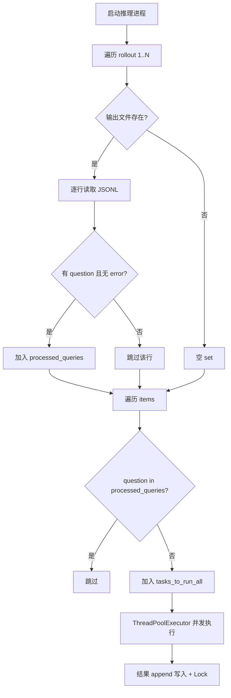
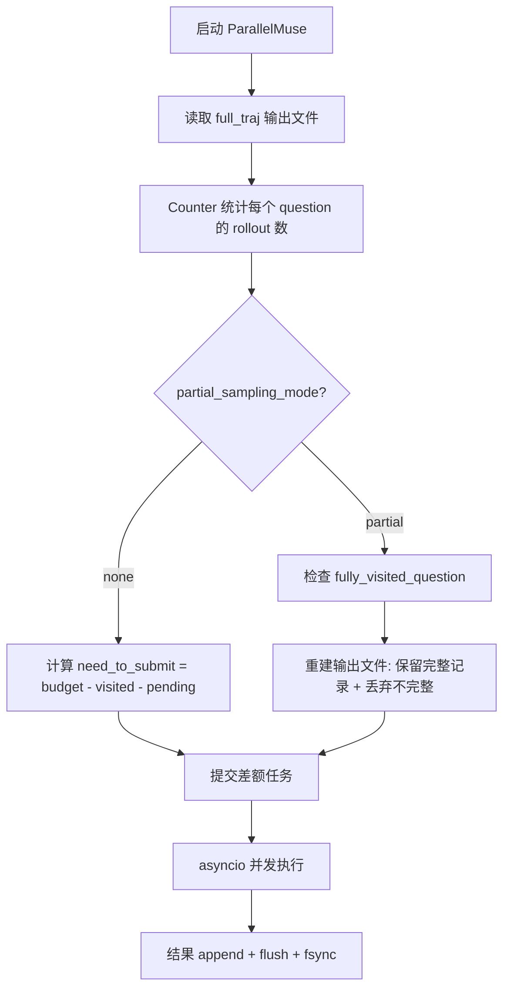

# PD-340.01 DeepResearch — 已处理集合断点续跑与多 Rollout 幂等推理

> 文档编号：PD-340.01
> 来源：DeepResearch `inference/run_multi_react.py`, `WebAgent/ParallelMuse/functionality_specified_partial_rollout.py`, `WebAgent/NestBrowse/infer_async_nestbrowse.py`, `WebAgent/AgentFold/infer.py`, `WebAgent/WebSailor/src/run_multi_react.py`
> GitHub：https://github.com/Alibaba-NLP/DeepResearch
> 问题域：PD-340 断点续跑与幂等推理 Checkpoint Resume & Idempotent Inference
> 状态：可复用方案

---

## 第 1 章 问题与动机

### 1.1 核心问题

大规模 LLM 推理任务（如 GAIA、BrowseComp 等 benchmark 评测）通常需要对数百个 question 执行多轮 rollout，每个 rollout 涉及多次 LLM 调用和工具调用（搜索、网页访问），单次推理可能耗时数分钟到数十分钟。在这种场景下：

1. **进程中断不可避免**：GPU 节点故障、网络超时、OOM 等导致推理进程随时可能中断
2. **重复计算代价高昂**：每次 LLM 调用消耗大量 GPU 算力和 API 费用，重跑已完成的 question 是纯粹的浪费
3. **多 Rollout 并行复杂性**：同一 question 需要多次独立 rollout（如 3-8 次），每个 rollout 的完成状态需要独立追踪
4. **并发写入一致性**：20+ 线程/协程并发写入同一输出文件，中断时文件可能处于不一致状态

DeepResearch 项目在 5 个不同的推理入口中实现了 3 种断点续跑模式，覆盖了从简单的 question 去重到复杂的 partial rollout 恢复。

### 1.2 DeepResearch 的解法概述

1. **启动时扫描输出文件构建已处理集合**：每个推理入口启动时读取已有输出 JSONL 文件，提取已成功完成的 question 构成 `processed_queries: set` 或 `visited_counter: Counter`（`inference/run_multi_react.py:91-108`，`WebAgent/AgentFold/infer.py:325-328`）
2. **错误记录排除机制**：只有不含 `"error"` 字段的记录才计入已处理集合，失败的 question 会在下次启动时自动重试（`inference/run_multi_react.py:102`）
3. **Per-Rollout 独立追踪**：多 rollout 场景下，每个 rollout 有独立的输出文件和独立的 `processed_queries` 集合（`inference/run_multi_react.py:87-108`）
4. **Counter 计数式追踪**：ParallelMuse 和 NestBrowse 使用 `Counter` 统计每个 question 的已完成 rollout 数，只提交差额任务（`functionality_specified_partial_rollout.py:335-340`）
5. **线程安全追加写入 + fsync 刷盘**：所有写入使用 `threading.Lock` 或 append 模式 + `f.flush(); os.fsync(f.fileno())` 确保中断时数据不丢失（`inference/run_multi_react.py:172,189-191`，`functionality_specified_partial_rollout.py:483-484`）

### 1.3 设计思想

| 设计原则 | 具体实现 | 理由 | 替代方案 |
|----------|----------|------|----------|
| 零状态外部依赖 | 用输出文件本身作为 checkpoint，无需额外数据库或状态文件 | 推理脚本通常在临时 GPU 节点运行，不依赖外部服务更可靠 | SQLite/Redis 状态存储 |
| 错误可重试 | error 记录不计入已处理集合，下次启动自动重试 | LLM 调用失败是暂时性的，重试通常能成功 | 手动清理错误记录后重跑 |
| 追加写入不覆盖 | 所有输出用 `"a"` 模式追加，不修改已有内容 | 追加模式天然幂等，中断不会破坏已有数据 | 原子写入临时文件后 rename |
| 粒度匹配任务单元 | 以 question 为粒度追踪，与任务提交粒度一致 | question 是最小可独立执行的单元 | 以 batch 或 step 为粒度 |
| 并发安全写入 | threading.Lock + fsync 双重保护 | Lock 防止交错写入，fsync 防止 OS 缓冲区丢失 | 队列收集 + 单线程写入 |

---

## 第 2 章 源码实现分析

### 2.1 架构概览

DeepResearch 的断点续跑体系分布在 5 个推理入口中，形成 3 种模式：

```
┌─────────────────────────────────────────────────────────────────┐
│                    DeepResearch 断点续跑体系                      │
├─────────────────────────────────────────────────────────────────┤
│                                                                 │
│  模式 A: Per-Rollout Set 去重                                    │
│  ┌──────────────────┐  ┌──────────────────────────────────┐     │
│  │ run_multi_react   │  │ WebSailor/run_multi_react        │     │
│  │ (ThreadPool)      │  │ (ThreadPool)                     │     │
│  │ processed_queries │  │ processed_queries                │     │
│  │ per rollout file  │  │ per rollout file                 │     │
│  └──────────────────┘  └──────────────────────────────────┘     │
│                                                                 │
│  模式 B: Counter 计数式追踪                                      │
│  ┌──────────────────────────┐  ┌────────────────────────┐       │
│  │ ParallelMuse/partial_    │  │ NestBrowse/infer_async │       │
│  │ rollout (asyncio)        │  │ (asyncio)              │       │
│  │ visited_counter: Counter │  │ visited_counter        │       │
│  │ fully_visited_question   │  │ pending_counter        │       │
│  └──────────────────────────┘  └────────────────────────┘       │
│                                                                 │
│  模式 C: Simple Set 去重                                         │
│  ┌──────────────────────────┐                                   │
│  │ AgentFold/infer.py       │                                   │
│  │ processed_questions: set │                                   │
│  │ 单文件单 rollout          │                                   │
│  └──────────────────────────┘                                   │
│                                                                 │
│  共享机制: JSONL append + Lock/fsync + error 排除                 │
└─────────────────────────────────────────────────────────────────┘
```

### 2.2 核心实现

#### 模式 A：Per-Rollout Set 去重（run_multi_react.py）



对应源码 `inference/run_multi_react.py:91-108`：

```python
processed_queries_per_rollout = {}

for rollout_idx in range(1, roll_out_count + 1):
    output_file = output_files[rollout_idx]
    processed_queries = set()
    if os.path.exists(output_file):
        try:
            with open(output_file, "r", encoding="utf-8") as f:
                for line in f:
                    try:
                        data = json.loads(line)
                        if "question" in data and "error" not in data:
                            processed_queries.add(data["question"].strip())
                    except json.JSONDecodeError:
                        print(f"Warning: Skipping invalid line in output file: {line.strip()}")
        except FileNotFoundError:
            pass
    processed_queries_per_rollout[rollout_idx] = processed_queries
```

任务过滤与提交 `inference/run_multi_react.py:119-146`：

```python
for rollout_idx in range(1, roll_out_count + 1):
    processed_queries = processed_queries_per_rollout[rollout_idx]
    for item in items:
        question = item.get("question", "").strip()
        # ... question 提取逻辑 ...
        if question not in processed_queries:
            tasks_to_run_all.append({
                "item": item.copy(),
                "rollout_idx": rollout_idx,
                "planning_port": planning_port,
            })
            per_rollout_task_counts[rollout_idx] += 1
```

并发安全写入 `inference/run_multi_react.py:172-225`：

```python
write_locks = {i: threading.Lock() for i in range(1, roll_out_count + 1)}

with ThreadPoolExecutor(max_workers=args.max_workers) as executor:
    # ... submit tasks ...
    for future in tqdm(as_completed(future_to_task), total=len(tasks_to_run_all)):
        task_info = future_to_task[future]
        rollout_idx = task_info["rollout_idx"]
        output_file = output_files[rollout_idx]
        try:
            result = future.result()
            with write_locks[rollout_idx]:
                with open(output_file, "a", encoding="utf-8") as f:
                    f.write(json.dumps(result, ensure_ascii=False) + "\n")
        except concurrent.futures.TimeoutError:
            # 超时也写入 error 记录，下次启动时会被排除并重试
            error_result = {
                "question": question,
                "error": "Timeout (>1800s)",
                "prediction": "[Failed]"
            }
            with write_locks[rollout_idx]:
                with open(output_file, "a", encoding="utf-8") as f:
                    f.write(json.dumps(error_result, ensure_ascii=False) + "\n")
```

#### 模式 B：Counter 计数式追踪（ParallelMuse）



对应源码 `WebAgent/ParallelMuse/functionality_specified_partial_rollout.py:335-374`：

```python
visited_counter = Counter()
if os.path.exists(full_traj_rollout_output_file_path):
    existing_rollouts = read_jsonl(full_traj_rollout_output_file_path)
    for visited_data in existing_rollouts:
        question = visited_data['question']
        visited_counter[question] += 1

# partial rollout 恢复：检测完全完成的 question
fully_visited_question = []
if os.path.exists(output_file_path) and output_file_path != full_traj_rollout_output_file_path:
    visited_rollouts = read_jsonl(output_file_path)
    visited_initial_rollouts = visited_rollouts[:initial_num * args.initial_rollout_num]
    visited_rollouts = visited_rollouts[initial_num * args.initial_rollout_num:]

    visited_rollouts_counter = Counter()
    for visited_data in visited_rollouts:
        question = visited_data['question']
        visited_rollouts_counter[question] += 1

    fully_visited_question = [
        question for question, count in visited_rollouts_counter.items()
        if count == args.sampling_budget - args.initial_rollout_num
    ]
```

### 2.3 实现细节

**错误记录的双重角色**：error 记录既是日志（记录失败原因），又是"占位符"（防止并发重复提交），但不计入已处理集合（下次启动时自动重试）。这是一个精巧的设计——`inference/run_multi_react.py:102` 的 `"error" not in data` 条件同时实现了"记录失败"和"允许重试"两个目标。

**数据分片与断点续跑的交互**：`run_multi_react.py:73-89` 支持 `--total_splits` 和 `--worker_split` 参数将数据集分片到多个 worker，每个 worker 有独立的输出文件（`iter{i}_split{j}of{k}.jsonl`），断点续跑在分片级别独立工作。

**ParallelMuse 的输出文件重建**：`functionality_specified_partial_rollout.py:369-374` 在恢复时会删除原文件并重建，只保留完全完成的 question 的记录。这是因为 partial rollout 的中间状态不可复用——一个 question 的 partial rollout 要么全部完成，要么全部重做。

**fsync 的关键作用**：`functionality_specified_partial_rollout.py:483-484` 中的 `f.flush(); os.fsync(f.fileno())` 确保数据从 OS 缓冲区刷到磁盘。没有 fsync，进程崩溃时最近几秒的写入可能丢失，导致输出文件中有不完整的 JSON 行。


---

## 第 3 章 迁移指南

### 3.1 迁移清单

**阶段 1：基础断点续跑（1-2 小时）**
- [ ] 定义任务唯一标识字段（如 `question`、`task_id`）
- [ ] 实现启动时扫描输出文件构建已处理集合
- [ ] 实现错误记录排除逻辑（含 `error` 字段的不计入已处理）
- [ ] 将输出写入改为 append 模式 + Lock

**阶段 2：多 Rollout 支持（2-3 小时）**
- [ ] 为每个 rollout 创建独立输出文件
- [ ] 实现 per-rollout 的 processed_queries 追踪
- [ ] 添加 rollout 进度汇总日志

**阶段 3：高级恢复（可选）**
- [ ] 实现 Counter 计数式追踪（适用于 sampling budget 场景）
- [ ] 添加 fsync 刷盘保护
- [ ] 实现数据分片 + 分片级断点续跑

### 3.2 适配代码模板

以下是一个可直接复用的断点续跑框架，整合了 DeepResearch 三种模式的精华：

```python
"""checkpoint_resume.py — 通用断点续跑框架
从 DeepResearch 提炼，支持多 rollout + 错误重试 + 并发安全写入。
"""
import json
import os
import threading
from collections import Counter
from concurrent.futures import ThreadPoolExecutor, as_completed
from typing import Any, Callable, Dict, List, Optional, Set


class CheckpointResumeRunner:
    """断点续跑推理运行器。
    
    核心思想：用输出 JSONL 文件本身作为 checkpoint，
    启动时扫描已完成记录，只执行剩余任务。
    """
    
    def __init__(
        self,
        output_dir: str,
        task_id_field: str = "question",
        rollout_count: int = 1,
        max_workers: int = 20,
        use_fsync: bool = True,
    ):
        self.output_dir = output_dir
        self.task_id_field = task_id_field
        self.rollout_count = rollout_count
        self.max_workers = max_workers
        self.use_fsync = use_fsync
        
        os.makedirs(output_dir, exist_ok=True)
        self._write_locks: Dict[int, threading.Lock] = {
            i: threading.Lock() for i in range(rollout_count)
        }
    
    def _output_path(self, rollout_idx: int) -> str:
        if self.rollout_count == 1:
            return os.path.join(self.output_dir, "results.jsonl")
        return os.path.join(self.output_dir, f"rollout_{rollout_idx}.jsonl")
    
    def _scan_processed(self, rollout_idx: int) -> Set[str]:
        """扫描输出文件，构建已处理任务 ID 集合。
        关键：含 error 字段的记录不计入，下次启动自动重试。
        """
        output_path = self._output_path(rollout_idx)
        processed = set()
        if not os.path.exists(output_path):
            return processed
        with open(output_path, "r", encoding="utf-8") as f:
            for line in f:
                try:
                    data = json.loads(line)
                    task_id = data.get(self.task_id_field, "").strip()
                    if task_id and "error" not in data:
                        processed.add(task_id)
                except json.JSONDecodeError:
                    continue  # 跳过损坏行（中断时的不完整写入）
        return processed
    
    def _write_result(self, rollout_idx: int, result: dict):
        """线程安全写入 + 可选 fsync 刷盘。"""
        output_path = self._output_path(rollout_idx)
        with self._write_locks[rollout_idx]:
            with open(output_path, "a", encoding="utf-8") as f:
                f.write(json.dumps(result, ensure_ascii=False) + "\n")
                if self.use_fsync:
                    f.flush()
                    os.fsync(f.fileno())
    
    def run(
        self,
        items: List[dict],
        process_fn: Callable[[dict], dict],
    ) -> None:
        """执行断点续跑推理。"""
        for rollout_idx in range(self.rollout_count):
            processed = self._scan_processed(rollout_idx)
            pending = [
                item for item in items
                if item.get(self.task_id_field, "").strip() not in processed
            ]
            
            print(f"Rollout {rollout_idx}: "
                  f"processed={len(processed)}, pending={len(pending)}")
            
            if not pending:
                continue
            
            with ThreadPoolExecutor(max_workers=self.max_workers) as executor:
                futures = {
                    executor.submit(process_fn, item): item
                    for item in pending
                }
                for future in as_completed(futures):
                    item = futures[future]
                    task_id = item.get(self.task_id_field, "")
                    try:
                        result = future.result()
                        self._write_result(rollout_idx, result)
                    except Exception as exc:
                        error_result = {
                            self.task_id_field: task_id,
                            "error": str(exc),
                            "prediction": "[Failed]",
                        }
                        self._write_result(rollout_idx, error_result)


# 使用示例
if __name__ == "__main__":
    def my_inference(item: dict) -> dict:
        """替换为你的推理逻辑。"""
        question = item["question"]
        # ... LLM 调用 + 工具调用 ...
        return {"question": question, "answer": "...", "prediction": "..."}
    
    runner = CheckpointResumeRunner(
        output_dir="./results/my_experiment",
        task_id_field="question",
        rollout_count=3,
        max_workers=20,
    )
    
    items = [{"question": f"Q{i}"} for i in range(100)]
    runner.run(items, my_inference)
```

### 3.3 适用场景

| 场景 | 适用度 | 说明 |
|------|--------|------|
| LLM Benchmark 评测 | ⭐⭐⭐ | 完美匹配：大量独立 question，多 rollout，长时间运行 |
| 批量数据处理管道 | ⭐⭐⭐ | 每条记录独立处理，天然适合 question 级去重 |
| Agent 多轮推理 | ⭐⭐ | 适合任务级断点，但不支持单任务内的 step 级恢复 |
| 实时在线推理 | ⭐ | 不适用：在线推理不需要断点续跑 |
| 有状态依赖的流水线 | ⭐ | 不适用：任务间有依赖时需要更复杂的 DAG 调度 |

---

## 第 4 章 测试用例

```python
"""test_checkpoint_resume.py — 断点续跑机制测试
基于 DeepResearch 的真实函数签名和行为编写。
"""
import json
import os
import tempfile
import threading
from collections import Counter
from typing import Set


def scan_processed_queries(output_file: str) -> Set[str]:
    """复现 inference/run_multi_react.py:91-108 的扫描逻辑。"""
    processed = set()
    if not os.path.exists(output_file):
        return processed
    with open(output_file, "r", encoding="utf-8") as f:
        for line in f:
            try:
                data = json.loads(line)
                if "question" in data and "error" not in data:
                    processed.add(data["question"].strip())
            except json.JSONDecodeError:
                continue
    return processed


def scan_visited_counter(output_file: str) -> Counter:
    """复现 functionality_specified_partial_rollout.py:335-340 的计数逻辑。"""
    visited = Counter()
    if not os.path.exists(output_file):
        return visited
    for item in _read_jsonl(output_file):
        visited[item["question"]] += 1
    return visited


def _read_jsonl(path: str):
    with open(path, "r", encoding="utf-8") as f:
        for line in f:
            line = line.strip()
            if line:
                yield json.loads(line)


class TestScanProcessedQueries:
    """测试 Set 去重模式。"""

    def test_empty_file(self, tmp_path):
        output = str(tmp_path / "iter1.jsonl")
        assert scan_processed_queries(output) == set()

    def test_file_not_exists(self, tmp_path):
        output = str(tmp_path / "nonexistent.jsonl")
        assert scan_processed_queries(output) == set()

    def test_successful_records_included(self, tmp_path):
        output = str(tmp_path / "iter1.jsonl")
        with open(output, "w") as f:
            f.write(json.dumps({"question": "Q1", "prediction": "A1"}) + "\n")
            f.write(json.dumps({"question": "Q2", "prediction": "A2"}) + "\n")
        assert scan_processed_queries(output) == {"Q1", "Q2"}

    def test_error_records_excluded(self, tmp_path):
        """关键测试：含 error 的记录不计入已处理，允许重试。"""
        output = str(tmp_path / "iter1.jsonl")
        with open(output, "w") as f:
            f.write(json.dumps({"question": "Q1", "prediction": "A1"}) + "\n")
            f.write(json.dumps({"question": "Q2", "error": "Timeout"}) + "\n")
            f.write(json.dumps({"question": "Q3", "prediction": "A3"}) + "\n")
        result = scan_processed_queries(output)
        assert result == {"Q1", "Q3"}
        assert "Q2" not in result  # Q2 失败，应被排除

    def test_malformed_json_skipped(self, tmp_path):
        """中断时可能产生不完整的 JSON 行。"""
        output = str(tmp_path / "iter1.jsonl")
        with open(output, "w") as f:
            f.write(json.dumps({"question": "Q1", "prediction": "A1"}) + "\n")
            f.write('{"question": "Q2", "predict\n')  # 截断行
        assert scan_processed_queries(output) == {"Q1"}

    def test_question_strip_whitespace(self, tmp_path):
        output = str(tmp_path / "iter1.jsonl")
        with open(output, "w") as f:
            f.write(json.dumps({"question": "  Q1  ", "prediction": "A1"}) + "\n")
        assert scan_processed_queries(output) == {"Q1"}


class TestVisitedCounter:
    """测试 Counter 计数模式。"""

    def test_count_multiple_rollouts(self, tmp_path):
        output = str(tmp_path / "rollouts.jsonl")
        with open(output, "w") as f:
            for _ in range(3):
                f.write(json.dumps({"question": "Q1", "answer": "A"}) + "\n")
            for _ in range(1):
                f.write(json.dumps({"question": "Q2", "answer": "B"}) + "\n")
        counter = scan_visited_counter(output)
        assert counter["Q1"] == 3
        assert counter["Q2"] == 1

    def test_need_to_submit_calculation(self, tmp_path):
        """复现 NestBrowse 的差额计算逻辑。"""
        output = str(tmp_path / "rollouts.jsonl")
        with open(output, "w") as f:
            for _ in range(2):
                f.write(json.dumps({"question": "Q1"}) + "\n")
        visited = scan_visited_counter(output)
        sampling_budget = 5
        need = sampling_budget - visited["Q1"]
        assert need == 3


class TestConcurrentWriteSafety:
    """测试并发写入安全性。"""

    def test_lock_protected_append(self, tmp_path):
        output = str(tmp_path / "concurrent.jsonl")
        lock = threading.Lock()
        results = []

        def write_result(question: str):
            with lock:
                with open(output, "a") as f:
                    f.write(json.dumps({"question": question}) + "\n")
            results.append(question)

        threads = [
            threading.Thread(target=write_result, args=(f"Q{i}",))
            for i in range(50)
        ]
        for t in threads:
            t.start()
        for t in threads:
            t.join()

        # 验证所有记录都完整写入
        written = list(_read_jsonl(output))
        assert len(written) == 50
        assert {r["question"] for r in written} == {f"Q{i}" for i in range(50)}
```


---

## 第 5 章 跨域关联

| 关联域 | 关系类型 | 说明 |
|--------|----------|------|
| PD-03 容错与重试 | 协同 | 断点续跑是容错的宏观层面（进程级恢复），PD-03 的重试是微观层面（单次调用恢复）。DeepResearch 的 error 记录排除机制将两者衔接：单次调用失败写入 error 记录（PD-03），下次启动时自动重试（PD-340） |
| PD-02 多 Agent 编排 | 依赖 | 多 rollout 的并行执行依赖编排层的 ThreadPoolExecutor/asyncio 并发管理。`run_multi_react.py` 的 per-rollout Lock 设计与编排层的并发模型紧密耦合 |
| PD-11 可观测性 | 协同 | 断点续跑的进度日志（`already processed: N, to run: M`）是可观测性的一部分。ParallelMuse 的 `visited_counter` 统计可直接用于推理进度仪表盘 |
| PD-06 记忆持久化 | 协同 | JSONL 追加写入模式与记忆持久化共享相同的存储模式。两者都使用"文件即状态"的设计哲学，避免外部数据库依赖 |
| PD-01 上下文管理 | 互补 | ParallelMuse 的 partial rollout 恢复需要理解 rollout 的上下文结构（initial rollouts vs partial rollouts），与上下文管理的分层压缩策略相关 |

---

## 第 6 章 来源文件索引

| 文件 | 行范围 | 关键实现 |
|------|--------|----------|
| `inference/run_multi_react.py` | L91-L108 | Per-rollout processed_queries 集合构建，error 排除逻辑 |
| `inference/run_multi_react.py` | L119-L146 | 任务过滤：跳过已处理 question，构建 tasks_to_run_all |
| `inference/run_multi_react.py` | L172-L225 | 并发写入：per-rollout write_locks + append 模式 + error 记录 |
| `inference/run_multi_react.py` | L73-L89 | 数据分片：total_splits/worker_split + 分片级输出文件 |
| `WebAgent/ParallelMuse/functionality_specified_partial_rollout.py` | L335-L340 | Counter 计数式 visited_counter 构建 |
| `WebAgent/ParallelMuse/functionality_specified_partial_rollout.py` | L343-L374 | fully_visited_question 检测 + 输出文件重建 |
| `WebAgent/ParallelMuse/functionality_specified_partial_rollout.py` | L378-L391 | need_to_submit 差额计算 + pending_counter 防重复提交 |
| `WebAgent/ParallelMuse/functionality_specified_partial_rollout.py` | L478-L484 | asyncio 写入 + flush + fsync 刷盘 |
| `WebAgent/NestBrowse/infer_async_nestbrowse.py` | L120-L140 | NestBrowse 的 visited_counter + pending_counter 差额提交 |
| `WebAgent/NestBrowse/infer_async_nestbrowse.py` | L145-L151 | asyncio append 写入 + flush + fsync |
| `WebAgent/AgentFold/infer.py` | L325-L331 | 最简模式：processed_questions set + 列表过滤 |
| `WebAgent/AgentFold/infer.py` | L334-L343 | Lock 保护的 append 写入 |
| `WebAgent/WebSailor/src/run_multi_react.py` | L82-L95 | WebSailor 的 processed_queries 扫描（与 run_multi_react 同构） |
| `WebAgent/WebSailor/src/run_multi_react.py` | L143-L164 | ThreadPool + write_lock 并发写入 |

---

## 第 7 章 横向对比维度

> **重要：** 本章用于自动填充 Butcher Wiki 的横向对比表。

```json comparison_data
{
  "project": "DeepResearch",
  "dimensions": {
    "追踪粒度": "question 级，per-rollout 独立追踪",
    "恢复策略": "启动时扫描输出 JSONL 构建已处理集合，error 记录自动重试",
    "状态存储": "输出文件即 checkpoint，零外部依赖",
    "并发保护": "per-rollout threading.Lock + fsync 刷盘",
    "分片支持": "worker_split 参数实现数据分片级断点续跑",
    "多模式覆盖": "3 种模式：Set 去重 / Counter 计数 / fully_visited 检测"
  }
}
```

### 域元数据补充

```json domain_metadata
{
  "solution_summary": "DeepResearch 用 JSONL 输出文件自身作为 checkpoint，启动时扫描构建 processed_queries Set 或 visited_counter Counter，error 记录自动排除实现失败重试，per-rollout Lock + fsync 保证并发写入一致性",
  "description": "大规模推理任务的进程级断点恢复与结果文件幂等性保障",
  "sub_problems": [
    "多 rollout 场景下如何独立追踪每个 rollout 的完成状态",
    "partial rollout 中断后如何判断哪些 question 需要全部重做",
    "数据分片与断点续跑如何协同工作"
  ],
  "best_practices": [
    "error 记录不计入已处理集合，实现自动失败重试",
    "per-rollout 独立输出文件 + 独立 write_lock 避免跨 rollout 干扰",
    "flush + fsync 双重刷盘防止 OS 缓冲区丢失"
  ]
}
```
