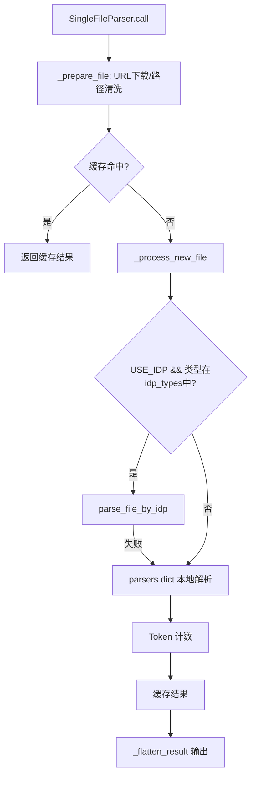
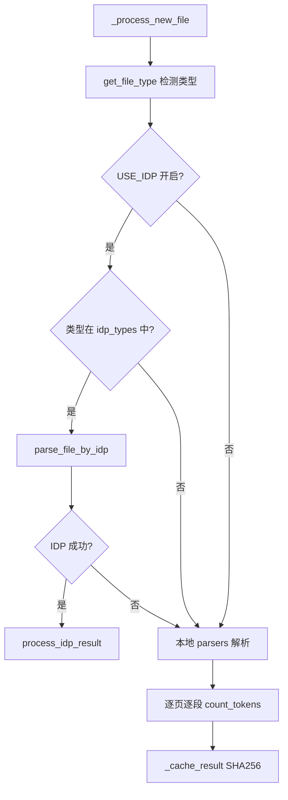
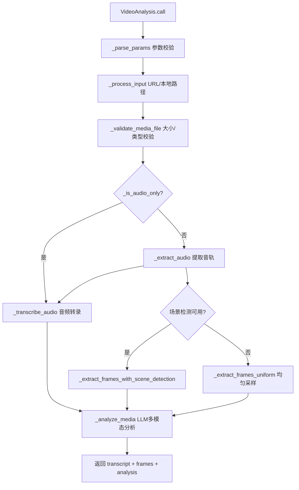

# PD-342.01 DeepResearch — 多格式文件解析与视频 Agent 处理链路

> 文档编号：PD-342.01
> 来源：DeepResearch `inference/file_tools/file_parser.py` `inference/tool_file.py` `inference/file_tools/video_agent.py`
> GitHub：https://github.com/Alibaba-NLP/DeepResearch
> 问题域：PD-342 文件解析与多模态处理 Multimodal File Parsing
> 状态：可复用方案

---

## 第 1 章 问题与动机

### 1.1 核心问题

Agent 系统在执行深度研究任务时，用户上传的文件格式多种多样——PDF 论文、Word 报告、Excel 数据表、PPT 演示文稿、CSV 数据集、ZIP 压缩包，甚至视频和音频文件。每种格式的解析逻辑完全不同，且解析后的文本量可能远超 LLM 的上下文窗口限制。

核心挑战：
1. **格式碎片化**：16+ 种文件格式需要统一的解析入口和输出格式
2. **Token 超限**：大型 Excel 或长 PDF 解析后可能产生数十万 token，必须自动压缩
3. **云端 vs 本地**：复杂文档（含表格、图片的 PDF）需要云端 IDP 服务，但必须有本地 fallback
4. **多模态处理**：视频/音频文件需要独立的处理链路（关键帧提取 + 音频转录 + AI 分析）

### 1.2 DeepResearch 的解法概述

DeepResearch 构建了一个三层文件处理架构：

1. **统一入口层**（`tool_file.py:99-141`）：`FileParser` 类按文件扩展名将文件分流到文本解析器或视频 Agent，音频文件（.mp3）走 `VideoAgent`，其余走 `SingleFileParser`
2. **格式分发层**（`file_parser.py:481-498`）：`SingleFileParser` 内部维护一个 `parsers` 字典，将 16 种文件类型映射到对应的解析函数，包括 PDF（pdfminer+pdfplumber）、DOCX（python-docx）、PPTX（python-pptx）、表格文件（pandas）等
3. **云端增强层**（`file_parser.py:527-531`）：对 PDF/DOCX/PPTX/XLSX/JPG/PNG/MP3 等格式，优先使用阿里云 IDP（Intelligent Document Processing）服务解析，失败时自动降级到本地解析器
4. **Token 压缩层**（`file_parser.py:453-460`）：当解析结果总 token 超过 `DEFAULT_MAX_INPUT_TOKENS` 时，按文件数量均分 token 预算，用 tokenizer 截断
5. **视频处理层**（`video_analysis.py:49-619`）：`VideoAnalysis` 工具实现完整的视频分析链路——关键帧提取（支持场景检测）+ 音频转录 + LLM 多模态分析

### 1.3 设计思想

| 设计原则 | 具体实现 | 理由 | 替代方案 |
|----------|----------|------|----------|
| 字典分发 | `parsers` dict 映射文件类型到解析函数 | O(1) 查找，新增格式只需加一行 | if-elif 链（不可扩展） |
| 云端优先+本地兜底 | IDP 优先，异常时 fallback 到本地 parser | 云端解析质量更高（表格/图片），但不能依赖网络 | 纯本地（质量差）或纯云端（不可靠） |
| 统一页面模型 | 所有格式输出 `[{page_num, content: [{text/table/schema}]}]` | 下游消费者无需关心原始格式 | 每种格式返回不同结构（下游复杂） |
| Token 预算均分 | `compress()` 按文件数均分 max_token，tokenizer 截断 | 多文件场景下公平分配上下文窗口 | 按文件大小加权（实现复杂） |
| SHA256 缓存 | 文件路径 hash 作为缓存 key，避免重复解析 | 同一文件多次引用时零成本 | 无缓存（重复解析浪费时间） |

---

## 第 2 章 源码实现分析

### 2.1 架构概览

```
┌─────────────────────────────────────────────────────────────┐
│                    FileParser (tool_file.py)                 │
│              统一入口：按扩展名分流文件                        │
├──────────────────────┬──────────────────────────────────────┤
│   非音视频文件        │         音视频文件 (.mp3等)            │
│   ↓                  │         ↓                             │
│   file_parser()      │         VideoAgent                    │
│   ↓                  │         ↓                             │
│   SingleFileParser   │         VideoAnalysis                 │
│   ↓                  │         ├─ 音频转录 (Qwen-Omni)       │
│   parsers dict 分发   │         ├─ 关键帧提取 (ffmpeg)        │
│   ├─ PDF  (pdfminer) │         └─ AI 分析 (Qwen-Plus)       │
│   ├─ DOCX (python-docx)                                     │
│   ├─ PPTX (python-pptx)                                     │
│   ├─ CSV/XLSX (pandas)                                       │
│   ├─ HTML (BeautifulSoup)                                    │
│   ├─ XML (ElementTree)                                       │
│   ├─ ZIP (递归解压)                                           │
│   └─ TXT/JSONL/PY (直读)                                     │
│        ↓                                                     │
│   [IDP 云端优先 → 本地 fallback]                              │
│        ↓                                                     │
│   Token 计数 → 超限压缩 compress()                            │
│        ↓                                                     │
│   SHA256 缓存                                                │
└─────────────────────────────────────────────────────────────┘
```

### 2.2 核心实现

#### 2.2.1 格式分发字典



对应源码 `inference/file_tools/file_parser.py:481-498`：

```python
self.parsers = {
    'pdf': parse_pdf,
    'docx': parse_word,
    'doc': parse_word,
    'pptx': parse_ppt,
    'txt': parse_txt,
    'jsonl': parse_txt,
    'jsonld': parse_txt,
    'pdb': parse_txt,
    'py': parse_txt,
    'html': parse_html,
    'xml': parse_xml,
    'csv': lambda p: parse_tabular_file(p, sep=','),
    'tsv': lambda p: parse_tabular_file(p, sep='\t'),
    'xlsx': parse_tabular_file,
    'xls': parse_tabular_file,
    'zip': self.parse_zip
}
```

这个字典是整个文件解析系统的核心路由表。新增文件格式只需添加一行映射，无需修改任何控制流。注意 `csv`/`tsv` 使用 lambda 包装来传递分隔符参数。

#### 2.2.2 IDP 云端解析与本地降级



对应源码 `inference/file_tools/file_parser.py:516-551`：

```python
def _process_new_file(self, file_path: str) -> Union[str, list]:
    file_type = get_file_type(file_path)
    idp_types = ['pdf', 'docx', 'pptx', 'xlsx', 'jpg', 'png', 'mp3']

    if file_type not in idp_types:
        file_type = get_basename_from_url(file_path).split('.')[-1].lower()

    try:
        if USE_IDP and file_type in idp_types:
            try:
                results = parse_file_by_idp(file_path=file_path)
            except Exception as e:
                results = self.parsers[file_type](file_path)
        else:
            results = self.parsers[file_type](file_path)
        tokens = 0
        for page in results:
            for para in page['content']:
                if 'schema' in para:
                    para['token'] = count_tokens(json.dumps(para['schema']))
                else:
                    para['token'] = count_tokens(para.get('text', para.get('table')))
                tokens += para['token']
        # ...缓存和返回
```

关键设计：IDP 调用包裹在内层 try-except 中，外层 try-except 捕获本地解析错误。这实现了"云端优先、本地兜底"的双层容错。

#### 2.2.3 表格文件的 Schema 降级

对应源码 `inference/file_tools/file_parser.py:366-378`：

当表格文件（CSV/XLSX）解析后 token 超限时，不是简单截断，而是降级为 schema 模式——只返回列名、数据类型和前 3 行样本数据：

```python
def parse_tabular_file(file_path: str, **kwargs) -> List[dict]:
    try:
        df = pd.read_excel(file_path) if file_path.endswith(('.xlsx', '.xls')) else \
            pd.read_csv(file_path, **kwargs)
        if count_tokens(df_to_markdown(df)) > DEFAULT_MAX_INPUT_TOKENS:
            schema = extract_xls_schema(file_path) if file_path.endswith(('.xlsx', '.xls')) else \
                extract_csv_schema(file_path)
            return [{'page_num': 1, 'content': [{'schema': schema}]}]
        else:
            return [{'page_num': 1, 'content': [{'table': df_to_markdown(df)}]}]
    except Exception as e:
        logger.error(f"Table parsing failed: {str(e)}")
        return []
```

#### 2.2.4 视频处理链路



对应源码 `inference/file_tools/video_analysis.py:138-196`：

```python
def call(self, params: Union[str, Dict], **kwargs) -> AnalysisResult:
    result: AnalysisResult = {'status': 'success', 'data': None, 'error': None}
    try:
        params = self._parse_params(params)
        with temp_directory() as temp_dir:
            media_path = self._process_input(params['url'], temp_dir)
            self._validate_media_file(media_path)
            is_audio = self._is_audio_only(media_path)
            audio_path = media_path if is_audio else self._extract_audio(media_path, temp_dir)
            transcript = self._transcribe_audio(audio_path)
            frames = []
            if not is_audio:
                frames = self._extract_keyframes(
                    media_path,
                    min(params['num_frames'], self.config['max_frames'])
                )
            analysis_result = self._analyze_media(
                prompt=params['prompt'], transcript=transcript,
                frames=frames, is_audio=is_audio
            )
            result['data'] = {
                'transcript': transcript,
                'frame_count': len(frames),
                'analysis': analysis_result
            }
    except Exception as e:
        result.update({'status': 'error', 'error': {...}})
    return result
```

### 2.3 实现细节

**IDP 轮询机制**（`file_parser.py:56-73`）：阿里云 IDP 是异步服务，提交文件后需要轮询状态。DeepResearch 实现了最多 10 次轮询、每次间隔 10 秒的等待机制，总超时约 100 秒。

**PDF 后处理**（`file_parser.py:275-309`）：`postprocess_page_content` 做了两件关键事：
1. 去重：当 pdfminer 同时识别出 LTRect（表格）和 LTTextContainer（文本）时，通过 bbox 包含关系判断去除重复
2. 段落合并：基于字体大小和行高判断被错误分割的段落，自动合并

**智能关键帧提取**（`video_analysis.py:483-520`）：优先使用 SceneDetect 的 ContentDetector 检测场景切换点，如果检测到的场景数不足则补充均匀采样帧，场景数过多则等间隔采样子集。

**文件类型智能检测**（`utils.py:235-266`）：`get_file_type` 实现了三级检测——先看扩展名，再看 HTTP Content-Type 头，最后读取文件内容判断是否含 HTML 标签。

---

## 第 3 章 迁移指南

### 3.1 迁移清单

**阶段 1：基础文件解析（1-2 天）**
- [ ] 安装依赖：`pdfminer.six`, `pdfplumber`, `python-docx`, `python-pptx`, `pandas`, `tabulate`, `beautifulsoup4`, `lxml`
- [ ] 复制统一页面模型：`[{page_num: int, content: [{text/table/schema: str}]}]`
- [ ] 实现 `parsers` 字典分发模式
- [ ] 实现 `get_file_type()` 三级类型检测
- [ ] 实现 SHA256 缓存层

**阶段 2：Token 压缩（0.5 天）**
- [ ] 集成 tokenizer（tiktoken 或 qwen tokenizer）
- [ ] 实现表格文件的 schema 降级逻辑
- [ ] 实现 `compress()` 多文件 token 均分截断
- [ ] 实现 XML 大文件的骨架提取

**阶段 3：云端增强（可选，1 天）**
- [ ] 接入文档解析云服务（阿里云 IDP / Azure Document Intelligence / AWS Textract）
- [ ] 实现异步轮询 + 超时机制
- [ ] 实现云端失败 → 本地 fallback 的双层容错

**阶段 4：视频/音频处理（可选，1-2 天）**
- [ ] 安装 ffmpeg 和 ffmpeg-python
- [ ] 实现音频转录（接入 Whisper / Qwen-Omni）
- [ ] 实现关键帧提取（均匀采样 + 可选场景检测）
- [ ] 实现 LLM 多模态分析（转录文本 + 关键帧图片）

### 3.2 适配代码模板

以下是一个可直接运行的最小化文件解析器，复用了 DeepResearch 的核心设计模式：

```python
"""
最小化多格式文件解析器 — 基于 DeepResearch 的字典分发模式
依赖: pip install pdfminer.six pdfplumber python-docx python-pptx pandas tabulate tiktoken
"""
import hashlib
import json
from pathlib import Path
from typing import Any, Dict, List, Optional, Union

import tiktoken

# Token 限制配置
MAX_INPUT_TOKENS = 128_000
tokenizer = tiktoken.encoding_for_model("gpt-4")


def count_tokens(text: str) -> int:
    return len(tokenizer.encode(text))


def compress(results: list, max_total_tokens: int = MAX_INPUT_TOKENS) -> list:
    """多文件 token 均分压缩"""
    max_per_file = max_total_tokens // max(len(results), 1)
    compressed = []
    for text in results:
        tokens = tokenizer.encode(text)
        if len(tokens) > max_per_file:
            tokens = tokens[:max_per_file]
        compressed.append(tokenizer.decode(tokens))
    return compressed


class FileParser:
    """统一文件解析入口 — 字典分发 + 缓存 + Token 压缩"""

    def __init__(self, cache_dir: str = "/tmp/file_parser_cache"):
        self.cache_dir = Path(cache_dir)
        self.cache_dir.mkdir(parents=True, exist_ok=True)
        self._cache: Dict[str, str] = {}

        # 核心：格式分发字典
        self.parsers = {
            'pdf': self._parse_pdf,
            'docx': self._parse_docx,
            'txt': self._parse_txt,
            'csv': lambda p: self._parse_tabular(p, sep=','),
            'xlsx': self._parse_tabular,
            'html': self._parse_html,
        }

    def parse(self, file_path: str) -> str:
        cache_key = hashlib.sha256(file_path.encode()).hexdigest()
        if cache_key in self._cache:
            return self._cache[cache_key]

        ext = Path(file_path).suffix.lstrip('.').lower()
        parser = self.parsers.get(ext, self._parse_txt)
        pages = parser(file_path)

        result = '\n'.join(
            para.get('text', para.get('table', ''))
            for page in pages for para in page['content']
        )
        self._cache[cache_key] = result
        return result

    def parse_multiple(self, file_paths: List[str]) -> List[str]:
        results = [self.parse(fp) for fp in file_paths]
        total_tokens = sum(count_tokens(r) for r in results)
        if total_tokens > MAX_INPUT_TOKENS:
            return compress(results)
        return results

    # --- 各格式解析器（统一输出页面模型） ---

    def _parse_pdf(self, path: str) -> List[dict]:
        from pdfminer.high_level import extract_text
        text = extract_text(path)
        return [{'page_num': 1, 'content': [{'text': text}]}]

    def _parse_docx(self, path: str) -> List[dict]:
        from docx import Document
        doc = Document(path)
        content = [{'text': p.text} for p in doc.paragraphs if p.text.strip()]
        return [{'page_num': 1, 'content': content}]

    def _parse_txt(self, path: str) -> List[dict]:
        with open(path, 'r', encoding='utf-8') as f:
            text = f.read()
        return [{'page_num': 1, 'content': [{'text': text}]}]

    def _parse_tabular(self, path: str, **kwargs) -> List[dict]:
        import pandas as pd
        from tabulate import tabulate
        df = pd.read_excel(path) if path.endswith(('.xlsx', '.xls')) else pd.read_csv(path, **kwargs)
        md = tabulate(df.dropna(how='all').fillna(''), headers='keys', tablefmt='pipe', showindex=False)
        if count_tokens(md) > MAX_INPUT_TOKENS:
            schema = {"columns": df.columns.tolist(), "dtypes": df.dtypes.astype(str).to_dict(),
                       "sample": df.head(3).to_dict(orient='list')}
            return [{'page_num': 1, 'content': [{'schema': schema}]}]
        return [{'page_num': 1, 'content': [{'table': md}]}]

    def _parse_html(self, path: str) -> List[dict]:
        from bs4 import BeautifulSoup
        with open(path, 'r', encoding='utf-8') as f:
            soup = BeautifulSoup(f, 'lxml')
        content = [{'text': p.get_text().strip()} for p in soup.find_all(['p', 'div']) if p.get_text().strip()]
        return [{'page_num': 1, 'content': content}]
```

### 3.3 适用场景

| 场景 | 适用度 | 说明 |
|------|--------|------|
| RAG 系统文档预处理 | ⭐⭐⭐ | 统一页面模型 + token 压缩非常适合 RAG 管线 |
| Agent 文件分析工具 | ⭐⭐⭐ | 直接作为 Agent 的 tool 注册使用 |
| 多模态研究助手 | ⭐⭐⭐ | 视频/音频 + 文档的完整处理链路 |
| 批量文档转换 | ⭐⭐ | 缓存机制适合批量场景，但缺少并行处理 |
| 实时文档协作 | ⭐ | 同步解析模式不适合实时场景 |

---

## 第 4 章 测试用例

```python
"""
测试用例 — 基于 DeepResearch file_parser 的真实函数签名
依赖: pip install pytest pdfminer.six python-docx pandas tabulate
"""
import json
import os
import tempfile
from unittest.mock import patch, MagicMock

import pytest


class TestSingleFileParser:
    """测试 SingleFileParser 核心逻辑"""

    def test_parsers_dict_covers_all_types(self):
        """验证 parsers 字典覆盖所有声明的文件类型"""
        from file_tools.file_parser import SingleFileParser, PARSER_SUPPORTED_FILE_TYPES
        parser = SingleFileParser()
        for ft in PARSER_SUPPORTED_FILE_TYPES:
            ft_clean = ft.lstrip('.')
            if ft_clean not in ('mp4', 'mov', 'mkv', 'webm', 'mp3', 'wav'):
                assert ft_clean in parser.parsers, f"Missing parser for {ft_clean}"

    def test_parse_txt_returns_page_model(self):
        """验证 TXT 解析返回统一页面模型"""
        from file_tools.file_parser import parse_txt
        with tempfile.NamedTemporaryFile(mode='w', suffix='.txt', delete=False) as f:
            f.write("Hello\nWorld\nTest")
            f.flush()
            result = parse_txt(f.name)
        os.unlink(f.name)
        assert len(result) == 1
        assert result[0]['page_num'] == 1
        assert len(result[0]['content']) == 3
        assert result[0]['content'][0]['text'] == 'Hello'

    def test_compress_distributes_tokens_evenly(self):
        """验证 compress 按文件数均分 token 预算"""
        from file_tools.file_parser import compress
        long_text = "word " * 10000
        results = [long_text, long_text, long_text]
        compressed = compress(results)
        assert len(compressed) == 3
        # 每个结果的 token 数应该大致相等
        from qwen_agent.utils.tokenization_qwen import count_tokens
        tokens = [count_tokens(r) for r in compressed]
        assert max(tokens) - min(tokens) < 100

    def test_tabular_schema_degradation(self):
        """验证表格文件超限时降级为 schema"""
        from file_tools.file_parser import parse_tabular_file
        import pandas as pd
        # 创建一个大 CSV
        with tempfile.NamedTemporaryFile(mode='w', suffix='.csv', delete=False) as f:
            df = pd.DataFrame({'col1': range(100000), 'col2': ['text'] * 100000})
            df.to_csv(f.name, index=False)
            result = parse_tabular_file(f.name, sep=',')
        os.unlink(f.name)
        # 如果超限，应该返回 schema 而不是完整表格
        content = result[0]['content'][0]
        assert 'schema' in content or 'table' in content

    def test_idp_fallback_on_failure(self):
        """验证 IDP 失败时降级到本地解析"""
        from file_tools.file_parser import SingleFileParser
        parser = SingleFileParser()
        with tempfile.NamedTemporaryFile(mode='w', suffix='.txt', delete=False) as f:
            f.write("Test content for fallback")
            f.flush()
            # 模拟 IDP 失败
            with patch('file_tools.file_parser.USE_IDP', True):
                with patch('file_tools.file_parser.parse_file_by_idp', side_effect=Exception("IDP down")):
                    result = parser._process_new_file(f.name)
        os.unlink(f.name)
        assert result is not None

    def test_sha256_cache_hit(self):
        """验证 SHA256 缓存命中"""
        from file_tools.file_parser import SingleFileParser
        parser = SingleFileParser()
        with tempfile.NamedTemporaryFile(mode='w', suffix='.txt', delete=False) as f:
            f.write("Cached content")
            f.flush()
            # 第一次解析
            result1 = parser.call(json.dumps({'url': f.name}))
            # 第二次应该命中缓存
            result2 = parser.call(json.dumps({'url': f.name}))
        os.unlink(f.name)
        assert result1 == result2


class TestVideoAnalysis:
    """测试 VideoAnalysis 工具"""

    def test_is_audio_only_by_extension(self):
        """验证音频文件扩展名检测"""
        from file_tools.video_analysis import VideoAnalysis, SUPPORTED_AUDIO_TYPES
        va = VideoAnalysis()
        from pathlib import Path
        for ext in SUPPORTED_AUDIO_TYPES:
            assert va._is_audio_only(Path(f"/tmp/test{ext}")) is True

    def test_parse_params_validates_required(self):
        """验证参数校验拒绝缺失字段"""
        from file_tools.video_analysis import VideoAnalysis
        va = VideoAnalysis()
        with pytest.raises(ValueError, match="Missing required"):
            va._parse_params({"url": "test.mp4"})  # 缺少 prompt

    def test_file_size_validation(self):
        """验证文件大小校验"""
        from file_tools.video_analysis import VideoAnalysis, MAX_FILE_SIZE
        va = VideoAnalysis()
        with tempfile.NamedTemporaryFile(suffix='.mp4', delete=False) as f:
            f.write(b'\x00' * (MAX_FILE_SIZE + 1))
            f.flush()
            with pytest.raises(ValueError, match="exceeds limit"):
                va._validate_media_file(Path(f.name))
        os.unlink(f.name)
```

---

## 第 5 章 跨域关联

| 关联域 | 关系类型 | 说明 |
|--------|----------|------|
| PD-01 上下文管理 | 依赖 | 文件解析后的 token 压缩直接依赖上下文窗口管理策略，`compress()` 使用 `DEFAULT_MAX_INPUT_TOKENS` 作为预算上限 |
| PD-03 容错与重试 | 协同 | IDP 云端解析的轮询重试（10次×10秒）和 fallback 到本地解析器是典型的容错模式 |
| PD-04 工具系统 | 依赖 | `SingleFileParser` 和 `VideoAgent` 都继承自 `qwen_agent.tools.base.BaseTool`，通过 `@register_tool` 注册到工具系统 |
| PD-08 搜索与检索 | 协同 | 文件解析是 RAG 检索管线的前置步骤，解析输出的统一页面模型可直接喂入向量化和索引 |
| PD-11 可观测性 | 协同 | 解析过程中的 token 计数（`count_tokens`）为成本追踪提供数据基础 |

---

## 第 6 章 来源文件索引

| 文件 | 行范围 | 关键实现 |
|------|--------|----------|
| `inference/file_tools/file_parser.py` | L464-498 | `SingleFileParser` 类定义 + parsers 字典分发 |
| `inference/file_tools/file_parser.py` | L516-551 | `_process_new_file` IDP 优先 + 本地 fallback |
| `inference/file_tools/file_parser.py` | L453-460 | `compress()` 多文件 token 均分压缩 |
| `inference/file_tools/file_parser.py` | L366-378 | `parse_tabular_file` 表格 schema 降级 |
| `inference/file_tools/file_parser.py` | L175-224 | `parse_pdf` PDF 解析 + 后处理 |
| `inference/file_tools/file_parser.py` | L275-309 | `postprocess_page_content` 去重 + 段落合并 |
| `inference/file_tools/file_parser.py` | L56-73 | `parse_file_by_idp` IDP 轮询机制 |
| `inference/tool_file.py` | L99-141 | `FileParser` 统一入口 + 音视频分流 |
| `inference/file_tools/video_agent.py` | L62-82 | `VideoAgent` 多文件视频分析 |
| `inference/file_tools/video_analysis.py` | L49-196 | `VideoAnalysis` 完整视频处理链路 |
| `inference/file_tools/video_analysis.py` | L460-520 | 智能关键帧提取（场景检测 + 均匀采样） |
| `inference/file_tools/video_analysis.py` | L419-458 | 音频转录（base64 + Qwen-Omni 流式） |
| `inference/file_tools/idp.py` | L15-89 | 阿里云 IDP 客户端（提交 + 分页查询） |
| `inference/file_tools/utils.py` | L235-266 | `get_file_type` 三级文件类型检测 |

---

## 第 7 章 横向对比维度

```json comparison_data
{
  "project": "DeepResearch",
  "dimensions": {
    "解析架构": "字典分发 + IDP 云端优先 + 本地 fallback 三层架构",
    "格式覆盖": "16+ 格式：PDF/DOCX/PPTX/XLSX/CSV/HTML/XML/ZIP/MP4/MP3 等",
    "Token 控制": "count_tokens 逐段计数 + compress 均分截断 + 表格 schema 降级",
    "缓存策略": "SHA256(file_path) 作为 key，Storage 持久化缓存",
    "多模态处理": "VideoAnalysis 独立链路：场景检测关键帧 + 音频转录 + LLM 多模态分析",
    "云端集成": "阿里云 IDP 智能文档解析，异步轮询 10×10s，失败自动降级"
  }
}
```

### 域元数据补充

```json domain_metadata
{
  "solution_summary": "DeepResearch 用字典分发 + IDP 云端优先本地 fallback 三层架构实现 16+ 格式文件解析，VideoAnalysis 独立处理视频/音频的关键帧提取与转录分析",
  "description": "覆盖视频/音频多模态处理链路与云端文档解析服务集成",
  "sub_problems": [
    "如何实现视频关键帧的智能提取（场景检测 vs 均匀采样）",
    "如何将音频转录与视觉帧分析结合为统一的多模态分析结果"
  ],
  "best_practices": [
    "SHA256 缓存避免重复解析，同一文件多次引用零成本",
    "表格文件超限时降级为 schema（列名+类型+样本）而非简单截断",
    "视频处理优先场景检测提取关键帧，不足时补充均匀采样"
  ]
}
```
