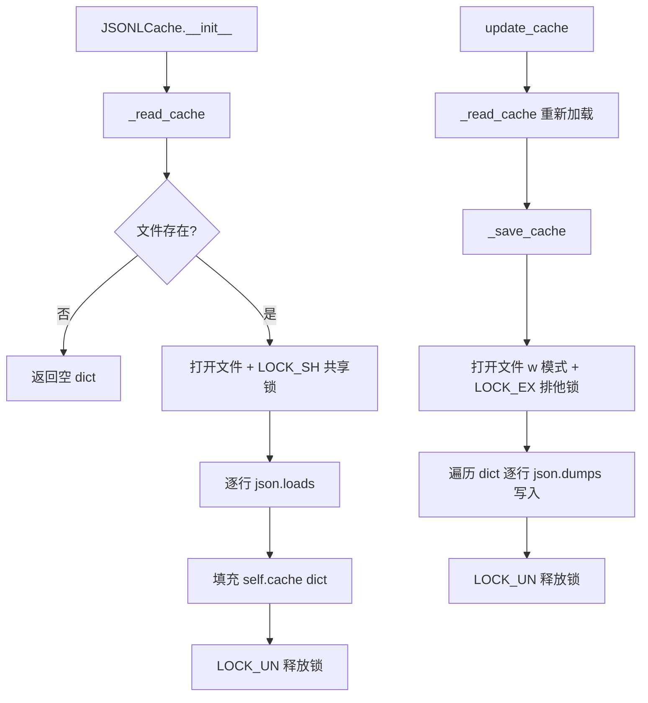
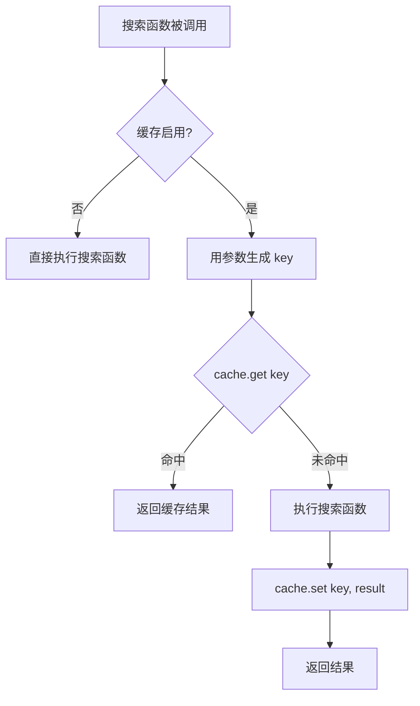

# PD-343.01 DeepResearch — JSONL 文件锁搜索缓存系统

> 文档编号：PD-343.01
> 来源：DeepResearch `WebAgent/WebDancer/demos/tools/private/cache_utils.py`
> GitHub：https://github.com/Alibaba-NLP/DeepResearch
> 问题域：PD-343 搜索结果缓存 Search Result Caching
> 状态：可复用方案

---

## 第 1 章 问题与动机

### 1.1 核心问题

深度研究型 Agent 在执行多轮搜索时，同一查询可能被重复发起——用户修改 prompt 重跑、Agent 多步推理中重复搜索、多进程并行搜索同一关键词。每次搜索都调用外部 API（Google Serper、SerpAPI），不仅产生费用，还受限于 API 速率限制。

核心矛盾：**搜索 API 调用成本高且有速率限制，但 Agent 的搜索行为天然存在大量重复**。

DeepResearch 的 WebDancer 和 WebWatcher 两个子系统都面临这个问题：
- WebDancer 的 `search` 工具调用 Google Serper API，每次 10 条结果
- WebWatcher 的 `VLSearchText` 和 `VLSearchImage` 调用视觉搜索 API，涉及图片下载和 OSS 上传

如果不缓存，同一个查询在不同 Agent 轮次中被重复执行，成本线性增长。

### 1.2 DeepResearch 的解法概述

DeepResearch 实现了一个轻量级的 JSONL 文件缓存系统（`JSONLCache`），核心特点：

1. **JSONL 格式存储**：每行一个 `{"key": ..., "value": ...}` JSON 对象，追加友好（`cache_utils.py:38-41`）
2. **fcntl 文件锁**：读取用共享锁 `LOCK_SH`，写入用排他锁 `LOCK_EX`，保证多进程并发安全（`cache_utils.py:12-18`）
3. **装饰器模式集成**：通过 `search_cache_decorator` 透明地为搜索函数添加缓存能力（`vl_search_text.py:38-52`）
4. **环境变量开关**：通过 `VL_TEXT_SEARCH_ENABLE_CACHE` / `VL_IMG_SEARCH_ENABLE_CACHE` 控制是否启用（`vl_search_text.py:33`）
5. **atexit 持久化**：进程退出时自动将内存缓存回写到文件（`vl_search_text.py:37`）

### 1.3 设计思想

| 设计原则 | 具体实现 | 理由 | 替代方案 |
|----------|----------|------|----------|
| 零依赖 | 仅用 `json` + `fcntl` 标准库 | 研究项目不想引入 Redis/SQLite 等外部依赖 | Redis、SQLite、shelve |
| 读写锁分离 | `LOCK_SH` 共享读 + `LOCK_EX` 排他写 | 允许多进程并发读取，只在写入时互斥 | 全局排他锁（性能差） |
| 透明集成 | 装饰器 `@search_cache_decorator` | 不修改搜索函数签名，一行注解启用缓存 | 在每个搜索函数内部手动 if/else |
| 可选启用 | 环境变量开关，默认关闭 | 开发调试时可能需要真实 API 响应 | 硬编码开关 |
| 延迟写入 | 内存 dict 缓存 + atexit 回写 | 减少磁盘 I/O，批量写入更高效 | 每次 set 立即写入文件 |

---

## 第 2 章 源码实现分析

### 2.1 架构概览

DeepResearch 的缓存系统由三层组成：

```
┌─────────────────────────────────────────────────────┐
│                  搜索工具层                           │
│  VLSearchText / VLSearchImage / WebSearch            │
│  @search_cache_decorator                             │
├─────────────────────────────────────────────────────┤
│                  缓存核心层                           │
│  JSONLCache                                          │
│  ┌──────────┐  ┌──────────┐  ┌──────────────────┐   │
│  │ get(key) │  │ set(k,v) │  │ update_cache()   │   │
│  │ 内存读取  │  │ 内存写入  │  │ 文件读→内存→文件写│   │
│  └──────────┘  └──────────┘  └──────────────────┘   │
├─────────────────────────────────────────────────────┤
│                  文件存储层                           │
│  search_cache_text.jsonl / search_cache_image.jsonl  │
│  fcntl.LOCK_SH (读) / fcntl.LOCK_EX (写)            │
└─────────────────────────────────────────────────────┘
```

缓存在两个子系统中被复用：
- **WebDancer**：`demos/tools/private/cache_utils.py` 定义 `JSONLCache`
- **WebWatcher**：`infer/vl_search_r1/.../tools/private/cache_utils.py` 同一份代码副本，被 `vl_search_text.py` 和 `vl_search_image.py` 使用

### 2.2 核心实现

#### JSONLCache 类：文件锁保护的 KV 缓存



对应源码 `WebAgent/WebDancer/demos/tools/private/cache_utils.py:1-57`：

```python
import os
import json
import fcntl


class JSONLCache:
    def __init__(self, cache_file):
        self.cache_file = cache_file
        self.cache = {}
        self._read_cache()
        
    def _lock_file(self, file, lock_type=fcntl.LOCK_EX):
        """ 获取文件锁 """
        fcntl.flock(file, lock_type)

    def _unlock_file(self, file):
        """ 释放文件锁 """
        fcntl.flock(file, fcntl.LOCK_UN)

    def _read_cache(self):
        """ 读取缓存文件 """
        if not os.path.exists(self.cache_file):
            return
        with open(self.cache_file, 'r') as f:
            self._lock_file(f, fcntl.LOCK_SH)  # 共享锁
            try:
                for line in f:
                    data = json.loads(line)
                    self.cache[data['key']] = data['value']
            finally:
                self._unlock_file(f)

    def _save_cache(self):
        """ 保存缓存到文件 """
        with open(self.cache_file, 'w') as f:
            self._lock_file(f, fcntl.LOCK_EX)  # 排它锁
            try:
                for key, value in self.cache.items():
                    data = {'key': key, 'value': value}
                    f.write(json.dumps(data, ensure_ascii=False) + '\n')
            finally:
                self._unlock_file(f)
```

关键设计点：
- `_read_cache` 使用 `LOCK_SH`（`cache_utils.py:25`）：多个进程可以同时读取缓存文件
- `_save_cache` 使用 `LOCK_EX`（`cache_utils.py:36`）：写入时独占文件，防止并发写入导致数据损坏
- `_save_cache` 用 `'w'` 模式全量重写（`cache_utils.py:35`）：而非追加，确保 JSONL 文件中没有重复 key

#### 装饰器模式：透明缓存集成



对应源码 `WebAgent/WebWatcher/.../tools/vl_search_text.py:33-52`：

```python
enable_search_cache = os.getenv('VL_TEXT_SEARCH_ENABLE_CACHE', 'false').lower() \
    in ('y', 'yes', 't', 'true', '1', 'on')
cache = JSONLCache(os.path.join(
    os.path.dirname(__file__), "vl_search/search_cache_text.jsonl"))

if enable_search_cache:
    atexit.register(cache.update_cache)

def search_cache_decorator(func):
    @wraps(func)
    def wrapper(self, img_url, *args, **kwargs):
        if enable_search_cache:
            key = str(img_url)
            cached_result = cache.get(key)
            if cached_result is not None:
                return cached_result
            result = func(self, img_url, *args, **kwargs)
            cache.set(key, result)
        else:
            result = func(self, img_url, *args, **kwargs)
        return result
    return wrapper
```

使用方式（`vl_search_text.py:77-78`）：
```python
@search_cache_decorator
def search_image_by_text(self, gold_query, max_retry=10, timeout=30):
    ...
```

### 2.3 实现细节

**双子系统复用**：WebDancer 和 WebWatcher 各自维护独立的 `cache_utils.py` 副本和独立的 JSONL 缓存文件：
- WebWatcher 文本搜索：`vl_search/search_cache_text.jsonl`（`vl_search_text.py:34`）
- WebWatcher 图片搜索：`vl_search/search_cache_image.jsonl`（`vl_search_image.py:37`）
- WebDancer 的 `search.py` 和 `visit.py` 未使用缓存——这是一个有意的设计选择，WebDancer 的搜索工具更轻量，而 WebWatcher 的视觉搜索涉及图片下载和 OSS 上传，成本更高

**atexit 回写机制**：`atexit.register(cache.update_cache)` 确保进程正常退出时，内存中新增的缓存条目被持久化。`update_cache()` 先 `_read_cache()` 合并其他进程写入的新条目，再 `_save_cache()` 全量回写（`cache_utils.py:44-48`）。

**缓存 key 策略**：直接用搜索查询字符串或图片 URL 作为 key（`vl_search_text.py:43`），简单直接，但不处理语义相似的查询去重。


---

## 第 3 章 迁移指南

### 3.1 迁移清单

**阶段 1：核心缓存类（30 分钟）**
- [ ] 复制 `JSONLCache` 类到项目的 `utils/cache.py`
- [ ] 确认目标平台支持 `fcntl`（Linux/macOS），Windows 需替换为 `msvcrt` 或 `portalocker`
- [ ] 创建缓存文件目录（如 `data/cache/`）

**阶段 2：装饰器集成（15 分钟）**
- [ ] 编写 `search_cache_decorator`，适配你的搜索函数签名
- [ ] 确定缓存 key 的生成策略（查询字符串、URL、或参数哈希）
- [ ] 添加环境变量开关（默认关闭）

**阶段 3：生命周期管理（15 分钟）**
- [ ] 注册 `atexit` 回调确保进程退出时持久化
- [ ] 考虑是否需要缓存过期机制（原实现无 TTL）
- [ ] 考虑是否需要缓存大小限制（原实现无上限）

### 3.2 适配代码模板

以下是一个增强版的可运行模板，增加了 TTL 和跨平台锁支持：

```python
import os
import json
import time
from functools import wraps
from typing import Any, Optional

# 跨平台文件锁
try:
    import fcntl
    def lock_shared(f):
        fcntl.flock(f, fcntl.LOCK_SH)
    def lock_exclusive(f):
        fcntl.flock(f, fcntl.LOCK_EX)
    def unlock(f):
        fcntl.flock(f, fcntl.LOCK_UN)
except ImportError:
    # Windows fallback
    import msvcrt
    def lock_shared(f):
        msvcrt.locking(f.fileno(), msvcrt.LK_NBLCK, 1)
    def lock_exclusive(f):
        msvcrt.locking(f.fileno(), msvcrt.LK_LOCK, 1)
    def unlock(f):
        msvcrt.locking(f.fileno(), msvcrt.LK_UNLCK, 1)


class JSONLCache:
    """JSONL 文件缓存，支持文件锁并发安全和可选 TTL。"""

    def __init__(self, cache_file: str, ttl: Optional[int] = None):
        self.cache_file = cache_file
        self.cache: dict[str, dict] = {}
        self.ttl = ttl  # 秒，None 表示永不过期
        os.makedirs(os.path.dirname(cache_file), exist_ok=True)
        self._read_cache()

    def _read_cache(self):
        if not os.path.exists(self.cache_file):
            return
        with open(self.cache_file, 'r') as f:
            lock_shared(f)
            try:
                for line in f:
                    line = line.strip()
                    if not line:
                        continue
                    data = json.loads(line)
                    if self.ttl and time.time() - data.get('ts', 0) > self.ttl:
                        continue  # 跳过过期条目
                    self.cache[data['key']] = data
            finally:
                unlock(f)

    def _save_cache(self):
        with open(self.cache_file, 'w') as f:
            lock_exclusive(f)
            try:
                for key, entry in self.cache.items():
                    f.write(json.dumps(entry, ensure_ascii=False) + '\n')
            finally:
                unlock(f)

    def get(self, key: str) -> Optional[Any]:
        entry = self.cache.get(key)
        if entry is None:
            return None
        if self.ttl and time.time() - entry.get('ts', 0) > self.ttl:
            del self.cache[key]
            return None
        return entry['value']

    def set(self, key: str, value: Any):
        self.cache[key] = {
            'key': key,
            'value': value,
            'ts': time.time()
        }

    def flush(self):
        """合并磁盘数据并回写。"""
        self._read_cache()
        self._save_cache()


def cached_search(cache: JSONLCache, key_fn=str):
    """搜索缓存装饰器工厂。"""
    def decorator(func):
        @wraps(func)
        def wrapper(*args, **kwargs):
            key = key_fn(*args[1:2])  # 取第一个非 self 参数
            cached = cache.get(key)
            if cached is not None:
                return cached
            result = func(*args, **kwargs)
            cache.set(key, result)
            return result
        return wrapper
    return decorator
```

### 3.3 适用场景

| 场景 | 适用度 | 说明 |
|------|--------|------|
| 研究型 Agent 多轮搜索 | ⭐⭐⭐ | 同一查询高频重复，缓存命中率高 |
| 单机多进程并行搜索 | ⭐⭐⭐ | fcntl 文件锁天然支持进程间共享 |
| 开发调试阶段 | ⭐⭐⭐ | 避免反复消耗 API 配额 |
| 分布式多机部署 | ⭐ | JSONL 文件锁仅限单机，需换 Redis |
| 高并发生产环境 | ⭐ | 全量重写策略在大缓存时性能差 |
| 需要缓存失效的场景 | ⭐⭐ | 原实现无 TTL，需自行扩展 |

---

## 第 4 章 测试用例

```python
import os
import json
import tempfile
import multiprocessing
import time
import pytest


class TestJSONLCache:
    """基于 DeepResearch JSONLCache 真实接口的测试。"""

    def setup_method(self):
        self.tmp = tempfile.NamedTemporaryFile(
            suffix='.jsonl', delete=False, mode='w')
        self.tmp.close()
        self.cache_file = self.tmp.name

    def teardown_method(self):
        os.unlink(self.cache_file)

    def test_basic_get_set(self):
        """正常路径：set 后 get 返回相同值。"""
        from cache_utils import JSONLCache
        cache = JSONLCache(self.cache_file)
        cache.set("query:python tutorial", {"results": [1, 2, 3]})
        assert cache.get("query:python tutorial") == {"results": [1, 2, 3]}
        assert cache.get("nonexistent") is None

    def test_persistence_across_instances(self):
        """持久化：写入后新实例能读取。"""
        from cache_utils import JSONLCache
        c1 = JSONLCache(self.cache_file)
        c1.set("k1", "v1")
        c1._save_cache()

        c2 = JSONLCache(self.cache_file)
        assert c2.get("k1") == "v1"

    def test_update_cache_merges(self):
        """update_cache 合并内存和磁盘数据。"""
        from cache_utils import JSONLCache
        c1 = JSONLCache(self.cache_file)
        c1.set("k1", "v1")
        c1._save_cache()

        c2 = JSONLCache(self.cache_file)
        c2.set("k2", "v2")
        c2.update_cache()  # 读取 k1 + 保留 k2

        c3 = JSONLCache(self.cache_file)
        assert c3.get("k1") == "v1"
        assert c3.get("k2") == "v2"

    def test_concurrent_write_safety(self):
        """并发安全：多进程同时写入不丢数据。"""
        from cache_utils import JSONLCache

        def writer(cache_file, prefix, count):
            cache = JSONLCache(cache_file)
            for i in range(count):
                cache.set(f"{prefix}_{i}", f"value_{i}")
            cache._save_cache()

        procs = []
        for p in range(4):
            proc = multiprocessing.Process(
                target=writer, args=(self.cache_file, f"p{p}", 10))
            procs.append(proc)
            proc.start()
        for proc in procs:
            proc.join()

        # 最后一个写入的进程的数据应完整（全量重写语义）
        cache = JSONLCache(self.cache_file)
        # 至少有一个进程的 10 条数据完整
        total = sum(1 for k in cache.cache if cache.cache[k] is not None)
        assert total >= 10

    def test_empty_file_handling(self):
        """边界：空文件不报错。"""
        from cache_utils import JSONLCache
        cache = JSONLCache(self.cache_file)
        assert cache.get("anything") is None

    def test_nonexistent_file(self):
        """边界：文件不存在时正常初始化。"""
        from cache_utils import JSONLCache
        os.unlink(self.cache_file)
        cache = JSONLCache(self.cache_file)
        assert cache.get("anything") is None
        cache.set("k", "v")
        assert cache.get("k") == "v"

    def test_unicode_values(self):
        """边界：中文等 Unicode 内容正确存储。"""
        from cache_utils import JSONLCache
        cache = JSONLCache(self.cache_file)
        cache.set("搜索:深度学习", {"结果": "找到 10 条"})
        cache._save_cache()

        cache2 = JSONLCache(self.cache_file)
        assert cache2.get("搜索:深度学习") == {"结果": "找到 10 条"}
```


---

## 第 5 章 跨域关联

| 关联域 | 关系类型 | 说明 |
|--------|----------|------|
| PD-08 搜索与检索 | 依赖 | 缓存系统直接服务于搜索工具，减少重复 API 调用 |
| PD-11 可观测性 | 协同 | 缓存命中率是重要的成本追踪指标，`update_cache` 中的 print 是原始可观测手段 |
| PD-03 容错与重试 | 协同 | 搜索失败重试时，缓存可避免对已成功查询的重复调用 |
| PD-04 工具系统 | 依赖 | 缓存通过装饰器与 qwen_agent 的 `BaseTool` 工具注册体系集成 |
| PD-01 上下文管理 | 互补 | 缓存减少重复搜索，间接降低上下文中的冗余信息 |

---

## 第 6 章 来源文件索引

| 文件 | 行范围 | 关键实现 |
|------|--------|----------|
| `WebAgent/WebDancer/demos/tools/private/cache_utils.py` | L1-L57 | JSONLCache 完整实现：fcntl 文件锁 + JSONL 读写 |
| `WebAgent/WebWatcher/.../tools/private/cache_utils.py` | L1-L57 | JSONLCache 副本（与 WebDancer 版本相同） |
| `WebAgent/WebWatcher/.../tools/vl_search_text.py` | L22, L33-52, L77 | 文本搜索缓存集成：环境变量开关 + 装饰器 + atexit |
| `WebAgent/WebWatcher/.../tools/vl_search_image.py` | L21, L36-55, L74 | 图片搜索缓存集成：同上模式 |
| `WebAgent/WebWatcher/.../tools/private/nlp_web_search.py` | L14 | JSONLCache import（WebSearch 工具未实际使用缓存装饰器） |
| `WebAgent/WebDancer/demos/tools/private/search.py` | L1-L99 | WebDancer 搜索工具（未使用缓存，对比参考） |

---

## 第 7 章 横向对比维度

> **重要：** 本章用于自动填充 Butcher Wiki 的横向对比表。

```json comparison_data
{
  "project": "DeepResearch",
  "dimensions": {
    "缓存策略": "JSONL 文件级 KV 缓存，内存 dict + atexit 延迟回写",
    "并发模型": "fcntl 读写锁分离（LOCK_SH 共享读 + LOCK_EX 排他写）",
    "缓存粒度": "查询字符串/URL 精确匹配，无语义去重",
    "失效机制": "无 TTL，全量重写覆盖，手动 update_cache 合并",
    "集成方式": "装饰器模式 + 环境变量开关，零侵入搜索函数"
  }
}
```

### 域元数据补充

```json domain_metadata
{
  "solution_summary": "DeepResearch 用 JSONLCache + fcntl 读写锁实现零依赖的文件级搜索缓存，通过装饰器透明集成到 VLSearchText/VLSearchImage 工具",
  "description": "研究型 Agent 中搜索 API 调用去重与成本控制的轻量方案",
  "sub_problems": [
    "如何在不修改搜索函数签名的前提下透明添加缓存",
    "如何处理进程异常退出时的缓存数据丢失"
  ],
  "best_practices": [
    "用装饰器模式 + 环境变量开关实现零侵入缓存集成",
    "atexit 注册回调确保进程退出时缓存持久化"
  ]
}
```
