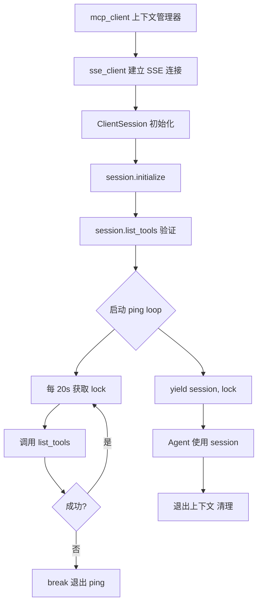
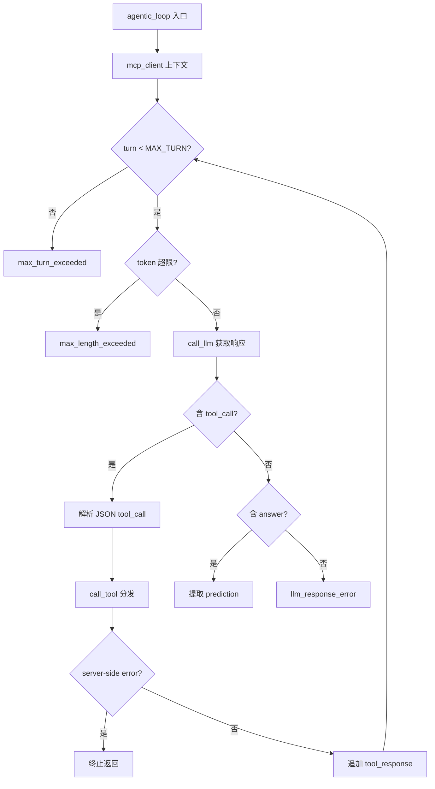

# PD-344.01 DeepResearch — MCP 协议驱动的浏览器自动化 Agent

> 文档编号：PD-344.01
> 来源：DeepResearch `WebAgent/NestBrowse/`
> GitHub：https://github.com/Alibaba-NLP/DeepResearch
> 问题域：PD-344 浏览器自动化Agent Browser Automation Agent
> 状态：可复用方案

---

## 第 1 章 问题与动机

### 1.1 核心问题

深度研究型 Agent 需要超越搜索引擎摘要，进入真实网页环境进行交互式信息采集。传统的 HTTP 请求 + HTML 解析方式无法处理 JavaScript 渲染页面、动态加载内容、需要点击/填写表单才能获取的深层信息。核心挑战包括：

1. **真实浏览器环境接入**：Agent 需要操控一个完整的浏览器实例，而非模拟 HTTP 请求
2. **会话状态一致性**：多个浏览器操作（导航→点击→填写）必须在同一个浏览器会话中顺序执行，不能并发破坏页面状态
3. **长连接稳定性**：浏览器操作耗时不确定（页面加载、JS 执行），MCP 连接必须在整个 Agent 循环期间保持存活
4. **页面内容理解**：原始 DOM 内容过长，需要 LLM 辅助提取与目标相关的关键信息

### 1.2 DeepResearch 的解法概述

DeepResearch 的 NestBrowse 模块通过以下方案解决上述问题：

1. **MCP 协议桥接浏览器服务**：通过 `sse_client` 连接远程 MCP 浏览器服务器，使用标准 MCP `call_tool` 接口调用 `browser_navigate`/`browser_click`/`browser_type` 三种原子操作（`toolkit/mcp_client.py:17-19`）
2. **asyncio.Lock 保证会话串行**：所有浏览器操作共享一把 `asyncio.Lock`，确保同一会话内操作不会并发冲突（`toolkit/mcp_client.py:21`）
3. **心跳保活机制**：后台 ping 任务每 20 秒调用 `list_tools()` 保持 SSE 连接存活（`toolkit/mcp_client.py:32-45`）
4. **LLM 驱动的页面摘要**：`process_response` 对原始页面内容进行分片摘要，提取 evidence + summary 结构化信息（`toolkit/tool_explore.py:7-47`）
5. **三级信号量并发控制**：`session`/`llm`/`tool` 三个独立信号量分别限制并发会话数、LLM 调用数和工具调用数（`infer_async_nestbrowse.py:178-182`）

### 1.3 设计思想

| 设计原则 | 具体实现 | 理由 | 替代方案 |
|----------|----------|------|----------|
| 协议标准化 | MCP 协议 + SSE 传输 | 浏览器服务可独立部署/扩缩容，Agent 端无需嵌入浏览器驱动 | 直接嵌入 Playwright/Puppeteer |
| 会话隔离 | UUID ROUTE-KEY + asyncio.Lock | 每个 Agent 循环独占一个浏览器会话，操作串行保证页面状态一致 | 无锁并发 + 乐观重试 |
| 连接保活 | 20s ping loop（list_tools） | SSE 长连接在空闲时可能被中间代理/负载均衡器断开 | WebSocket 双向通信 |
| 内容压缩 | LLM 分片摘要（evidence/summary） | 原始 DOM 可能超过 128K token，必须压缩后才能放入 Agent 上下文 | 规则式 DOM 裁剪 |
| 资源隔离 | 三级 Semaphore（session/llm/tool） | 防止某一类资源过载拖垮整个系统 | 全局单一并发限制 |

---

## 第 2 章 源码实现分析

### 2.1 架构概览

NestBrowse 的整体架构是一个 Agentic Loop + MCP 浏览器桥接的双层结构：

```
┌─────────────────────────────────────────────────────────┐
│                    Agent Loop (LLM)                      │
│  ┌──────────┐    ┌──────────┐    ┌──────────┐           │
│  │  search   │    │  visit   │    │click/fill│           │
│  │ (HTTP API)│    │(MCP call)│    │(MCP call)│           │
│  └────┬─────┘    └────┬─────┘    └────┬─────┘           │
│       │               │               │                  │
│       │          ┌────┴───────────────┴────┐             │
│       │          │   asyncio.Lock (串行化)  │             │
│       │          └────────────┬────────────┘             │
│       │                       │                          │
│       │          ┌────────────┴────────────┐             │
│       │          │  MCP ClientSession (SSE) │             │
│       │          │  + 20s ping heartbeat    │             │
│       │          └────────────┬────────────┘             │
│       │                       │                          │
└───────┼───────────────────────┼──────────────────────────┘
        │                       │
   Search API          MCP Browser Server
   (Google等)          (远程浏览器实例)
```

关键组件关系：
- `infer_async_nestbrowse.py` — Agent 主循环，管理 LLM 对话和工具调度
- `toolkit/mcp_client.py` — MCP 会话管理器，SSE 连接 + 心跳 + Lock
- `toolkit/browser.py` — Visit/Click/Fill 三个工具类，封装 MCP call_tool
- `toolkit/tool_explore.py` — 页面内容 LLM 摘要处理器

### 2.2 核心实现

#### 2.2.1 MCP 会话管理器



对应源码 `toolkit/mcp_client.py:13-49`：

```python
@asynccontextmanager
async def mcp_client(server_url: str):
    async with sse_client(url=server_url, headers={
            "ROUTE-KEY": str(uuid.uuid4())
        }) as streams:
            async with ClientSession(*streams) as session:
                lock = asyncio.Lock()
                initialize = await session.initialize()

                response = await session.list_tools()
                tools = response.tools

                async def _ping_loop(ping_interval_seconds: int):
                    try:
                        while True:
                            await anyio.sleep(ping_interval_seconds)
                            try:
                                async with lock:
                                    await session.list_tools()
                            except Exception as e:
                                print(f"MCPClient: Ping loop error: {repr(e)}")
                                break
                    except anyio.get_cancelled_exc_class():
                        print("MCPClient: Ping task was cancelled.")

                session._task_group.start_soon(_ping_loop, 20)
                yield session, lock
```

关键设计点：
- `ROUTE-KEY: uuid4()` — 每个会话生成唯一路由键，MCP 服务器据此分配独立浏览器实例（`mcp_client.py:18`）
- `asyncio.Lock()` — 所有 MCP 调用（包括 ping）都必须获取锁，保证同一时刻只有一个操作在执行（`mcp_client.py:21`）
- `_ping_loop` 挂载到 `session._task_group` — 利用 anyio TaskGroup 的生命周期管理，会话退出时 ping 任务自动取消（`mcp_client.py:45`）

#### 2.2.2 Agentic Loop 与工具调度



对应源码 `infer_async_nestbrowse.py:35-113`：

```python
async def agentic_loop(sem, data, messages):
    async with sem['session']:
        async with mcp_client(server_url=BROWSER_SERVER_URL) as (client, lock):
            for turn in range(MAX_AGENT_TURN):
                if count_tokens(record, tokenizer) > MAX_AGENT_LEN:
                    termination = 'max_length_exceeded'
                    break
                
                response = await call_llm(sem, record, ...)
                record.append({"role": "assistant", "content": response})

                if "<tool_call>" in response and "</tool_call>" in response:
                    tool_call = json.loads(
                        response.split('<tool_call>')[-1]
                               .split('</tool_call>')[0].strip()
                    )
                    result = await call_tool(sem, tool_call['name'],
                                             tool_call['arguments'],
                                             client, lock)
                    # ... 处理结果
                else:
                    if "<answer>" in response:
                        prediction = response.split('<answer>')[-1]
                                            .split('</answer>')[0].strip()
```

关键设计点：
- `sem['session']` 信号量控制并发会话数（`infer_async_nestbrowse.py:46`），`MAX_WORKERS=16` 意味着最多 16 个 Agent 同时运行
- XML 标签式工具调用（`<tool_call>...</tool_call>`）而非 OpenAI function calling 格式 — 适配自训练模型（`infer_async_nestbrowse.py:60-62`）
- 五种终止条件：`answer`、`max_turn_exceeded`、`max_length_exceeded`、`llm_response_error`、`server_side_error`（`infer_async_nestbrowse.py:43-110`）

### 2.3 实现细节

#### 页面内容 LLM 分片摘要

`process_response`（`toolkit/tool_explore.py:7-47`）处理浏览器返回的原始页面内容：

1. **Token 计数**：用 tokenizer 计算原始内容长度
2. **分片**：超过 `MAX_SUMMARY_SHARD_LEN`（64K）时按 token 切片
3. **增量摘要**：第一片用 `SUMMARY_PROMPT`，后续片用 `SUMMARY_PROMPT_INCREMENTAL` 携带已有 evidence/summary 进行增量合并
4. **结构化输出**：LLM 输出 `<useful_info>{"rational", "evidence", "summary"}</useful_info>` JSON

#### 三级信号量体系

```python
sem = {
    'session': asyncio.Semaphore(MAX_WORKERS),   # 并发 Agent 会话数
    'llm':     asyncio.Semaphore(MAX_WORKERS),   # 并发 LLM 调用数
    'tool':    asyncio.Semaphore(MAX_WORKERS),   # 并发工具调用数
}
```

三个信号量独立控制，避免某一类资源（如 LLM 推理）的排队阻塞其他资源（如浏览器操作）。`call_tool` 获取 `sem['tool']`（`infer_async_nestbrowse.py:21`），`call_llm` 获取 `sem['llm']`（`utils.py:26`），`agentic_loop` 获取 `sem['session']`（`infer_async_nestbrowse.py:46`）。

#### Visit/Click/Fill 工具的锁保护

三个浏览器工具类（`toolkit/browser.py`）在调用 MCP 时都通过 `async with lock:` 串行化：

- `Visit.call` → `client.call_tool('browser_navigate', {'url': url})`（`browser.py:57-58`）
- `Click.call` → `client.call_tool('browser_click', {'ref': ref, 'element': ''})`（`browser.py:119-120`）
- `Fill.call` → `client.call_tool('browser_type', {'ref': ref, 'submit': False, 'text': text, 'element': ""})`（`browser.py:178-184`）

锁只保护 MCP 调用本身，后续的 `process_response`（LLM 摘要）不持锁，允许其他会话的浏览器操作并行执行。

---

## 第 3 章 迁移指南

### 3.1 迁移清单

**阶段 1：MCP 浏览器服务搭建**
- [ ] 部署 MCP 浏览器服务器（如 Playwright MCP Server 或自建）
- [ ] 确保服务器支持 SSE 传输和 `ROUTE-KEY` 路由
- [ ] 验证 `browser_navigate`/`browser_click`/`browser_type` 三个工具可用

**阶段 2：MCP 客户端集成**
- [ ] 安装 `mcp` Python SDK（`pip install mcp`）
- [ ] 实现 `mcp_client` 上下文管理器（SSE 连接 + Lock + Ping）
- [ ] 配置心跳间隔（建议 15-30s，视网络环境调整）

**阶段 3：浏览器工具封装**
- [ ] 实现 Visit/Click/Fill 三个工具类
- [ ] 每个工具的 `call` 方法内用 `async with lock:` 保护 MCP 调用
- [ ] Visit/Click 返回后调用 LLM 摘要处理器压缩页面内容

**阶段 4：Agent 循环集成**
- [ ] 在 Agent 主循环中用 `async with mcp_client(...)` 包裹整个对话
- [ ] 实现工具调度器（`call_tool`），根据工具名分发到对应类
- [ ] 配置三级信号量控制并发

### 3.2 适配代码模板

以下是一个可直接运行的最小化 MCP 浏览器 Agent 模板：

```python
import uuid
import asyncio
import anyio
from contextlib import asynccontextmanager
from mcp import ClientSession
from mcp.client.sse import sse_client


@asynccontextmanager
async def browser_session(server_url: str, ping_interval: int = 20):
    """MCP 浏览器会话管理器，含心跳保活和操作锁。"""
    async with sse_client(
        url=server_url,
        headers={"ROUTE-KEY": str(uuid.uuid4())}
    ) as streams:
        async with ClientSession(*streams) as session:
            lock = asyncio.Lock()
            await session.initialize()
            
            # 验证浏览器工具可用
            tools = (await session.list_tools()).tools
            tool_names = [t.name for t in tools]
            assert "browser_navigate" in tool_names, "Missing browser_navigate tool"

            async def _ping_loop():
                try:
                    while True:
                        await anyio.sleep(ping_interval)
                        async with lock:
                            await session.list_tools()
                except (anyio.get_cancelled_exc_class(), Exception):
                    pass

            session._task_group.start_soon(_ping_loop)
            yield session, lock


async def browser_navigate(session, lock, url: str) -> str:
    """导航到指定 URL，返回页面内容。"""
    async with lock:
        response = await session.call_tool("browser_navigate", {"url": url})
    if response.isError:
        raise RuntimeError(f"Navigate failed: {response.content[0].text}")
    return response.content[0].text


async def browser_click(session, lock, ref: str) -> str:
    """点击页面元素，返回更新后的页面内容。"""
    async with lock:
        response = await session.call_tool("browser_click", {
            "ref": ref, "element": ""
        })
    if response.isError:
        raise RuntimeError(f"Click failed: {response.content[0].text}")
    return response.content[0].text


async def browser_fill(session, lock, ref: str, text: str) -> str:
    """填写表单字段。"""
    async with lock:
        response = await session.call_tool("browser_type", {
            "ref": ref, "text": text, "submit": False, "element": ""
        })
    if response.isError:
        raise RuntimeError(f"Fill failed: {response.content[0].text}")
    return response.content[0].text


# 使用示例
async def main():
    server_url = "http://localhost:3000/sse"
    async with browser_session(server_url) as (session, lock):
        # 导航
        content = await browser_navigate(session, lock, "https://example.com")
        print(f"Page content length: {len(content)}")
        
        # 点击（ref 来自页面内容中的 [ref=XXX] 标记）
        # updated = await browser_click(session, lock, "some-ref-id")

if __name__ == "__main__":
    asyncio.run(main())
```

### 3.3 适用场景

| 场景 | 适用度 | 说明 |
|------|--------|------|
| 深度研究 Agent（需要浏览网页获取信息） | ⭐⭐⭐ | 核心场景，visit→click→fill 完整交互链 |
| 表单自动填写（注册、登录、提交） | ⭐⭐⭐ | fill 工具直接支持，lock 保证操作顺序 |
| 多 Agent 并行浏览不同网站 | ⭐⭐⭐ | 每个 Agent 独立 MCP 会话 + ROUTE-KEY 隔离 |
| 需要 JavaScript 渲染的页面采集 | ⭐⭐⭐ | 真实浏览器环境，完整 JS 执行 |
| 高频爬虫（每秒数百请求） | ⭐ | MCP + SSE 开销较大，不适合高频场景 |
| 简单静态页面抓取 | ⭐ | 杀鸡用牛刀，HTTP 请求 + BeautifulSoup 更轻量 |

---

## 第 4 章 测试用例

```python
import pytest
import asyncio
import uuid
from unittest.mock import AsyncMock, MagicMock, patch
from contextlib import asynccontextmanager


class TestMCPClientSession:
    """测试 MCP 客户端会话管理。"""

    @pytest.mark.asyncio
    async def test_session_creates_unique_route_key(self):
        """每个会话应生成唯一的 ROUTE-KEY。"""
        route_keys = set()
        for _ in range(100):
            key = str(uuid.uuid4())
            assert key not in route_keys
            route_keys.add(key)
        assert len(route_keys) == 100

    @pytest.mark.asyncio
    async def test_lock_serializes_operations(self):
        """asyncio.Lock 应保证操作串行执行。"""
        lock = asyncio.Lock()
        execution_order = []

        async def operation(name: str, delay: float):
            async with lock:
                execution_order.append(f"{name}_start")
                await asyncio.sleep(delay)
                execution_order.append(f"{name}_end")

        await asyncio.gather(
            operation("A", 0.1),
            operation("B", 0.05),
        )
        # A 先获取锁，B 必须等 A 完成
        assert execution_order == ["A_start", "A_end", "B_start", "B_end"]

    @pytest.mark.asyncio
    async def test_semaphore_limits_concurrency(self):
        """三级信号量应限制并发数。"""
        max_workers = 2
        sem = asyncio.Semaphore(max_workers)
        active = 0
        max_active = 0

        async def task():
            nonlocal active, max_active
            async with sem:
                active += 1
                max_active = max(max_active, active)
                await asyncio.sleep(0.05)
                active -= 1

        await asyncio.gather(*[task() for _ in range(10)])
        assert max_active <= max_workers


class TestBrowserTools:
    """测试浏览器工具类。"""

    @pytest.mark.asyncio
    async def test_visit_returns_content_on_success(self):
        """Visit 成功时应返回页面内容。"""
        mock_client = AsyncMock()
        mock_response = MagicMock()
        mock_response.isError = False
        mock_response.content = [MagicMock(text="<html>Hello</html>")]
        mock_client.call_tool.return_value = mock_response

        lock = asyncio.Lock()
        async with lock:
            pass  # 验证 lock 可用

        # 模拟 Visit.call 的核心逻辑
        async with lock:
            response = await mock_client.call_tool(
                'browser_navigate', {'url': 'https://example.com'}
            )
        assert not response.isError
        assert "Hello" in response.content[0].text

    @pytest.mark.asyncio
    async def test_visit_returns_error_on_failure(self):
        """Visit 失败时应返回错误信息。"""
        mock_client = AsyncMock()
        mock_response = MagicMock()
        mock_response.isError = True
        mock_response.content = [MagicMock(text="Connection refused")]
        mock_client.call_tool.return_value = mock_response

        lock = asyncio.Lock()
        async with lock:
            response = await mock_client.call_tool(
                'browser_navigate', {'url': 'https://invalid.example'}
            )
        assert response.isError
        assert "Connection refused" in response.content[0].text

    @pytest.mark.asyncio
    async def test_fill_passes_correct_params(self):
        """Fill 应传递正确的 MCP 参数。"""
        mock_client = AsyncMock()
        mock_response = MagicMock()
        mock_response.isError = False
        mock_response.content = [MagicMock(text="OK")]
        mock_client.call_tool.return_value = mock_response

        lock = asyncio.Lock()
        async with lock:
            await mock_client.call_tool('browser_type', {
                'ref': 'input-123',
                'submit': False,
                'text': 'hello world',
                'element': ''
            })

        mock_client.call_tool.assert_called_with('browser_type', {
            'ref': 'input-123',
            'submit': False,
            'text': 'hello world',
            'element': ''
        })


class TestAgentLoop:
    """测试 Agent 主循环逻辑。"""

    def test_tool_call_parsing(self):
        """XML 标签式工具调用应正确解析。"""
        response = 'thinking...\n<tool_call>\n{"name": "visit", "arguments": {"url": "https://example.com", "goal": "get info"}}\n</tool_call>'
        tool_call_str = response.split('<tool_call>')[-1].split('</tool_call>')[0].strip()
        import json
        tool_call = json.loads(tool_call_str)
        assert tool_call['name'] == 'visit'
        assert tool_call['arguments']['url'] == 'https://example.com'

    def test_answer_extraction(self):
        """answer 标签应正确提取预测结果。"""
        response = 'Based on my research, <answer>42</answer>'
        prediction = response.split('<answer>')[-1].split('</answer>')[0].strip()
        assert prediction == '42'

    def test_termination_on_missing_answer(self):
        """无 tool_call 也无 answer 时应返回 llm_response_error。"""
        response = "I don't know the answer."
        has_tool_call = "<tool_call>" in response and "</tool_call>" in response
        has_answer = "<answer>" in response and "</answer>" in response
        assert not has_tool_call
        assert not has_answer
        # 此时 termination 应为 'llm_response_error'
```

---

## 第 5 章 跨域关联

| 关联域 | 关系类型 | 说明 |
|--------|----------|------|
| PD-01 上下文管理 | 依赖 | 浏览器返回的页面内容需要 LLM 摘要压缩后才能放入 Agent 上下文窗口，`process_response` 的分片摘要本质是上下文管理策略 |
| PD-03 容错与重试 | 协同 | MCP 连接断开、浏览器操作超时等需要容错处理；当前实现中 `server-side error` 直接终止，可增强为重试 |
| PD-04 工具系统 | 依赖 | Visit/Click/Fill 是工具系统的具体实例，`tool_schema` 定义遵循 OpenAI function calling 格式，`call_tool` 是工具调度器 |
| PD-08 搜索与检索 | 协同 | NestBrowse 的 `search` 工具与浏览器工具并列，搜索结果中的 URL 通过 `visit` 进入深度浏览 |
| PD-11 可观测性 | 协同 | 当前仅有 print 日志，可增加 MCP 调用耗时追踪、页面加载时间统计、Token 消耗计量 |
| PD-12 推理增强 | 协同 | `process_response` 的 evidence/summary 提取本质是推理增强——用 LLM 从原始页面中提炼结构化知识 |

---

## 第 6 章 来源文件索引

| 文件 | 行范围 | 关键实现 |
|------|--------|----------|
| `WebAgent/NestBrowse/toolkit/mcp_client.py` | L1-L49 | MCP 会话管理器：SSE 连接、Lock、心跳 ping loop |
| `WebAgent/NestBrowse/toolkit/browser.py` | L16-L76 | Visit 工具类：导航 + LLM 摘要 |
| `WebAgent/NestBrowse/toolkit/browser.py` | L78-L136 | Click 工具类：元素点击 + LLM 摘要 |
| `WebAgent/NestBrowse/toolkit/browser.py` | L139-L192 | Fill 工具类：表单填写 |
| `WebAgent/NestBrowse/infer_async_nestbrowse.py` | L19-L32 | call_tool 工具调度器 |
| `WebAgent/NestBrowse/infer_async_nestbrowse.py` | L35-L113 | agentic_loop Agent 主循环 |
| `WebAgent/NestBrowse/infer_async_nestbrowse.py` | L161-L201 | 配置与启动：信号量、工具实例化 |
| `WebAgent/NestBrowse/toolkit/tool_explore.py` | L7-L47 | process_response 页面内容分片摘要 |
| `WebAgent/NestBrowse/prompts.py` | L2-L59 | 摘要 prompt 模板（初始 + 增量） |
| `WebAgent/NestBrowse/prompts.py` | L63-L82 | Agent 系统 prompt（含工具定义） |
| `WebAgent/NestBrowse/utils.py` | L9-L63 | call_llm：双模式 LLM 调用 + 10 次重试 + token 减半降级 |

---

## 第 7 章 横向对比维度

```json comparison_data
{
  "project": "DeepResearch",
  "dimensions": {
    "浏览器接入方式": "MCP 协议 + SSE 传输连接远程浏览器服务",
    "会话隔离": "UUID ROUTE-KEY 路由 + asyncio.Lock 串行化",
    "连接保活": "20s ping loop 调用 list_tools 维持 SSE",
    "操作原语": "visit/click/fill 三种原子操作",
    "页面理解": "LLM 分片增量摘要提取 evidence+summary",
    "并发模型": "三级 Semaphore（session/llm/tool）独立限流"
  }
}
```

### 域元数据补充

```json domain_metadata
{
  "solution_summary": "DeepResearch NestBrowse 通过 MCP SSE 协议连接远程浏览器服务，用 asyncio.Lock 串行化 visit/click/fill 三种操作，配合 20s 心跳保活和 LLM 分片摘要实现深度网页交互",
  "description": "Agent 通过标准协议操控真实浏览器进行交互式信息采集与页面理解",
  "sub_problems": [
    "如何将超长页面 DOM 压缩为 Agent 可消费的结构化摘要",
    "如何在多 Agent 并行场景下隔离浏览器资源（信号量分级）"
  ],
  "best_practices": [
    "用 UUID ROUTE-KEY 实现 MCP 会话级浏览器实例隔离",
    "Lock 仅保护 MCP 调用本身，LLM 摘要不持锁以提高并发度",
    "LLM 增量分片摘要处理超长页面内容（evidence+summary 结构化输出）"
  ]
}
```
