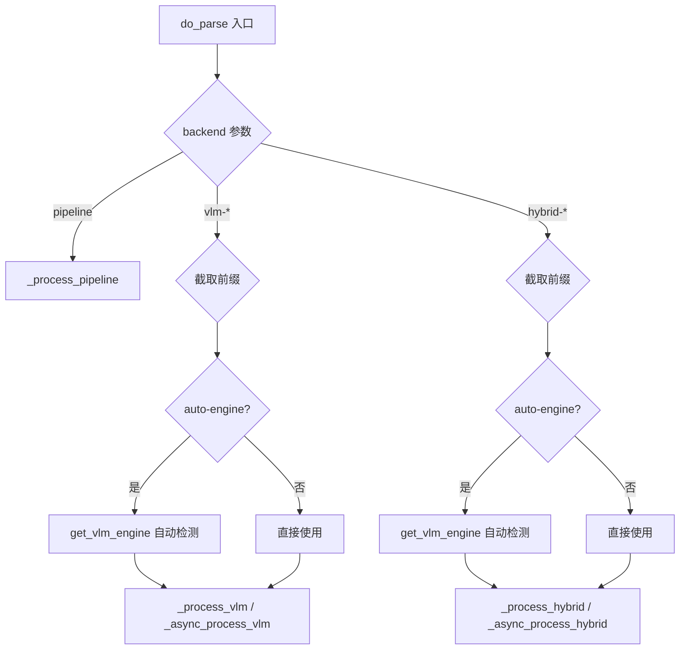
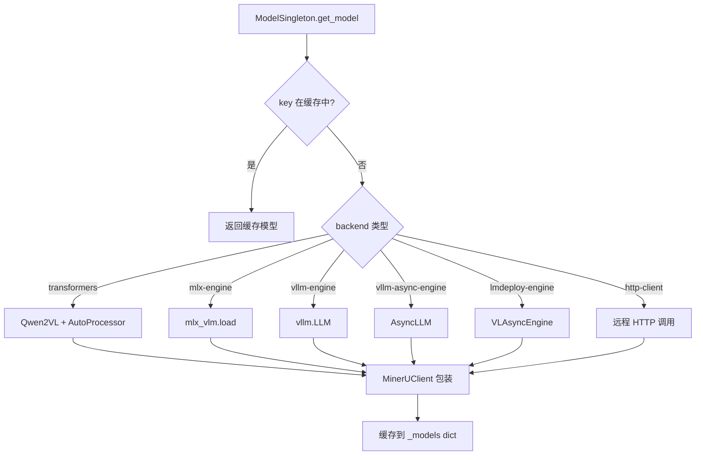
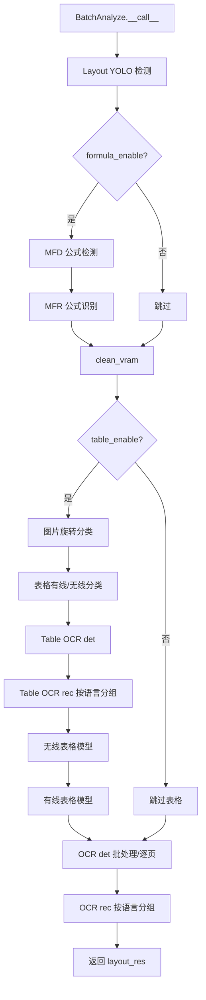

# PD-345.01 MinerU — 三后端可切换文档解析管线

> 文档编号：PD-345.01
> 来源：MinerU `mineru/cli/common.py`, `mineru/backend/pipeline/`, `mineru/backend/vlm/`, `mineru/backend/hybrid/`
> GitHub：https://github.com/opendatalab/MinerU.git
> 问题域：PD-345 文档处理管线 Document Processing Pipeline
> 状态：可复用方案

---

## 第 1 章 问题与动机

### 1.1 核心问题

文档解析（PDF → 结构化 Markdown/JSON）是一个多阶段串联处理任务，涉及 PDF 分类、图像加载、布局检测、OCR、公式识别、表格识别等环节。不同场景对精度、速度、硬件的需求差异巨大：

- **高精度场景**：需要传统 pipeline 逐模型串联，每个子任务用专用模型（YOLO 布局检测 + Unimernet 公式识别 + PaddleOCR 文字识别 + SLANet 表格识别）
- **高速场景**：用单个 VLM（视觉语言模型）端到端完成所有识别，省去多模型加载和中间传递开销
- **平衡场景**：VLM 做粗粒度布局和文本提取，pipeline 模型补充行内公式检测和 OCR 细节

如何在一个统一框架下支持这三种模式，且共享 PDF 加载、结果序列化、输出格式化等公共逻辑，是核心工程挑战。

### 1.2 MinerU 的解法概述

MinerU 实现了 pipeline / vlm / hybrid 三条可切换的文档解析后端：

1. **字符串前缀路由**：`do_parse()` 函数通过 `backend` 参数的字符串前缀（`"pipeline"` / `"vlm-"` / `"hybrid-"`）路由到不同处理函数（`mineru/cli/common.py:439-483`）
2. **Singleton 模型管理**：每个后端用独立的 `ModelSingleton` 类缓存已加载模型，避免重复初始化（`mineru/backend/vlm/vlm_analyze.py:23-30`）
3. **原子模型注册表**：pipeline 后端将 8 种子模型（layout/mfd/mfr/ocr/wired_table/wireless_table/table_cls/img_ori_cls）注册到 `AtomModelSingleton`，按需懒加载（`mineru/backend/pipeline/model_init.py:121-152`）
4. **VRAM 自适应批处理**：根据 GPU 显存自动计算 batch_ratio，分辨率分组 padding 后批量推理（`mineru/backend/pipeline/pipeline_analyze.py:178-188`）
5. **Sync/Async 双 API**：VLM 和 hybrid 后端同时提供 `doc_analyze` 和 `aio_doc_analyze`，支持同步和异步调用模式

### 1.3 设计思想

| 设计原则 | 具体实现 | 理由 | 替代方案 |
|----------|----------|------|----------|
| 后端可切换 | 字符串前缀路由 `backend.startswith("vlm-")` | 简单直接，无需抽象基类 | 策略模式 + 注册表 |
| 模型复用 | Singleton + dict 缓存 `(backend, model_path, server_url)` 三元组为 key | 避免重复加载数 GB 模型权重 | 全局变量 / LRU 缓存 |
| 硬件自适应 | VRAM 阈值分级 batch_ratio | 不同显卡自动获得最优吞吐 | 固定 batch_size / 用户手动配置 |
| 渐进式精度 | pipeline → hybrid → vlm 三级精度-速度权衡 | 用户按需选择 | 单一管线 + 参数调节 |
| PDF 智能分类 | `classify()` 自动判断 txt/ocr 类型 | 避免对可提取文本 PDF 做无谓 OCR | 始终 OCR / 用户手动指定 |

---

## 第 2 章 源码实现分析

### 2.1 架构概览

MinerU 的文档解析架构分为三层：路由层、后端层、模型层。

```
┌─────────────────────────────────────────────────────────┐
│                    CLI / API 入口                        │
│              do_parse() / aio_do_parse()                │
│                 (common.py:414-555)                      │
└──────────┬──────────────┬──────────────┬────────────────┘
           │              │              │
    backend="pipeline"  "vlm-*"      "hybrid-*"
           │              │              │
           ▼              ▼              ▼
┌──────────────┐ ┌──────────────┐ ┌──────────────────────┐
│  Pipeline    │ │    VLM       │ │      Hybrid          │
│  Backend     │ │   Backend    │ │     Backend          │
│              │ │              │ │                      │
│ BatchAnalyze │ │ MinerUClient │ │ VLM + Pipeline OCR   │
│ 8 AtomModels │ │ 6 Engines    │ │ + Formula Detection  │
└──────┬───────┘ └──────┬───────┘ └──────────┬───────────┘
       │                │                     │
       ▼                ▼                     ▼
┌─────────────────────────────────────────────────────────┐
│              Shared Infrastructure                       │
│  PDF classify │ Image loader │ middle_json │ Markdown    │
└─────────────────────────────────────────────────────────┘
```

### 2.2 核心实现

#### 2.2.1 后端路由器



对应源码 `mineru/cli/common.py:414-483`：

```python
def do_parse(
        output_dir,
        pdf_file_names: list[str],
        pdf_bytes_list: list[bytes],
        p_lang_list: list[str],
        backend="pipeline",
        parse_method="auto",
        formula_enable=True,
        table_enable=True,
        server_url=None,
        **kwargs,
):
    pdf_bytes_list = _prepare_pdf_bytes(pdf_bytes_list, start_page_id, end_page_id)

    if backend == "pipeline":
        _process_pipeline(
            output_dir, pdf_file_names, pdf_bytes_list, p_lang_list,
            parse_method, formula_enable, table_enable, ...
        )
    else:
        if backend.startswith("vlm-"):
            backend = backend[4:]  # 截取 "vlm-" 前缀
            if backend == "auto-engine":
                backend = get_vlm_engine(inference_engine='auto', is_async=False)
            _process_vlm(output_dir, pdf_file_names, pdf_bytes_list, backend, ...)
        elif backend.startswith("hybrid-"):
            backend = backend[7:]  # 截取 "hybrid-" 前缀
            if backend == "auto-engine":
                backend = get_vlm_engine(inference_engine='auto', is_async=False)
            _process_hybrid(output_dir, pdf_file_names, pdf_bytes_list, ...)
```

#### 2.2.2 VLM 后端 — 6 引擎 Singleton 管理



对应源码 `mineru/backend/vlm/vlm_analyze.py:23-219`：

```python
class ModelSingleton:
    _instance = None
    _models = {}

    def __new__(cls, *args, **kwargs):
        if cls._instance is None:
            cls._instance = super().__new__(cls)
        return cls._instance

    def get_model(
        self,
        backend: str,
        model_path: str | None,
        server_url: str | None,
        **kwargs,
    ) -> MinerUClient:
        key = (backend, model_path, server_url)
        if key not in self._models:
            model = None; processor = None
            vllm_llm = None; lmdeploy_engine = None; vllm_async_llm = None
            if backend == "transformers":
                model = Qwen2VLForConditionalGeneration.from_pretrained(
                    model_path, device_map={"": device}, **{dtype_key: "auto"},
                )
                processor = AutoProcessor.from_pretrained(model_path, use_fast=True)
            elif backend == "vllm-engine":
                vllm_llm = vllm.LLM(**kwargs)
            elif backend == "lmdeploy-engine":
                lmdeploy_engine = VLAsyncEngine(model_path, backend=lm_backend, ...)
            # ... 其他引擎
            self._models[key] = MinerUClient(
                backend=backend, model=model, processor=processor,
                lmdeploy_engine=lmdeploy_engine, vllm_llm=vllm_llm, ...
            )
        return self._models[key]
```

#### 2.2.3 Pipeline 后端 — 原子模型注册表与批处理



对应源码 `mineru/backend/pipeline/batch_analyze.py:25-436`：

```python
class BatchAnalyze:
    def __init__(self, model_manager, batch_ratio: int, formula_enable,
                 table_enable, enable_ocr_det_batch: bool = True):
        self.batch_ratio = batch_ratio
        self.formula_enable = get_formula_enable(formula_enable)
        self.table_enable = get_table_enable(table_enable)
        self.model_manager = model_manager
        self.enable_ocr_det_batch = enable_ocr_det_batch

    def __call__(self, images_with_extra_info: list) -> list:
        # 1. Layout YOLO 检测
        images_layout_res += self.model.layout_model.batch_predict(
            pil_images, YOLO_LAYOUT_BASE_BATCH_SIZE
        )
        # 2. 公式检测 + 识别
        if self.formula_enable:
            images_mfd_res = self.model.mfd_model.batch_predict(np_images, ...)
            images_formula_list = self.model.mfr_model.batch_predict(
                images_mfd_res, np_images,
                batch_size=self.batch_ratio * MFR_BASE_BATCH_SIZE,
            )
        # 3. 表格识别（旋转分类 → 有线/无线分类 → OCR → 结构识别）
        # 4. OCR det（分辨率分组批处理）+ OCR rec（按语言分组）
        return images_layout_res
```

### 2.3 实现细节

#### VRAM 自适应 batch_ratio

Pipeline 后端根据 GPU 显存自动选择批处理倍率（`mineru/backend/pipeline/pipeline_analyze.py:178-188`）：

| GPU 显存 | batch_ratio | 实际 OCR det batch_size |
|----------|-------------|------------------------|
| ≥ 16 GB  | 16          | 256                    |
| ≥ 12 GB  | 8           | 128                    |
| ≥ 8 GB   | 4           | 64                     |
| ≥ 6 GB   | 2           | 32                     |
| < 6 GB   | 1           | 16                     |

Hybrid 后端有独立的 batch_ratio 计算（`mineru/backend/hybrid/hybrid_analyze.py:323-366`），支持通过环境变量 `MINERU_HYBRID_BATCH_RATIO` 覆盖。

#### 分辨率分组批处理

OCR 检测需要输入图像尺寸一致才能批处理。MinerU 按 64 像素步长对裁剪图像分组，同组内 padding 到统一尺寸（`mineru/backend/pipeline/batch_analyze.py:284-310`）：

```python
RESOLUTION_GROUP_STRIDE = 64
resolution_groups = defaultdict(list)
for crop_info in lang_crop_list:
    h, w = crop_info[0].shape[:2]
    target_h = ((h + RESOLUTION_GROUP_STRIDE - 1) // RESOLUTION_GROUP_STRIDE) * RESOLUTION_GROUP_STRIDE
    target_w = ((w + RESOLUTION_GROUP_STRIDE - 1) // RESOLUTION_GROUP_STRIDE) * RESOLUTION_GROUP_STRIDE
    group_key = (target_h, target_w)
    resolution_groups[group_key].append(crop_info)
```

#### PDF 智能分类

`classify()` 函数（`mineru/utils/pdf_classify.py:17-58`）通过三重检测判断 PDF 是否需要 OCR：
1. 平均每页有效字符数 < 50 → 需要 OCR
2. 检测到 `(cid:xxx)` 乱码字符占比 > 5% → 需要 OCR
3. 图像覆盖率 ≥ 80% 的页面占比 ≥ 80% → 需要 OCR

#### Hybrid 后端的 VLM-OCR 智能切换

Hybrid 后端根据条件决定是否让 VLM 直接做 OCR（`mineru/backend/hybrid/hybrid_analyze.py:369-381`）：

```python
def _should_enable_vlm_ocr(ocr_enable, language, inline_formula_enable):
    force_enable = os.getenv("MINERU_FORCE_VLM_OCR_ENABLE", "0").lower() in ("1", "true", "yes")
    if force_enable:
        return True
    force_pipeline = os.getenv("MINERU_HYBRID_FORCE_PIPELINE_ENABLE", "0").lower() in ("1", "true", "yes")
    return (
        ocr_enable
        and language in ["ch", "en"]
        and inline_formula_enable
        and not force_pipeline
    )
```

当 VLM OCR 启用时，跳过 pipeline 的 OCR/公式检测阶段，直接用 VLM 的 `batch_two_step_extract` 结果。


---

## 第 3 章 迁移指南

### 3.1 迁移清单

**阶段 1：后端路由框架**
- [ ] 定义后端枚举或字符串常量（pipeline / vlm / hybrid）
- [ ] 实现 `do_parse()` 路由函数，按 backend 参数分发
- [ ] 为每个后端创建独立的 `doc_analyze()` 入口函数

**阶段 2：模型管理**
- [ ] 实现 `ModelSingleton` 基类，用 `(backend, model_path)` 元组做缓存 key
- [ ] 实现 `AtomModelSingleton` 原子模型注册表（如需 pipeline 后端）
- [ ] 添加 VRAM 检测和 batch_ratio 自适应逻辑

**阶段 3：管线阶段编排**
- [ ] 实现 `BatchAnalyze` 可调用类，串联各阶段模型
- [ ] 实现分辨率分组批处理逻辑
- [ ] 添加 PDF 分类器（auto/ocr/txt 判断）

**阶段 4：异步支持**
- [ ] 为 VLM/hybrid 后端添加 `aio_doc_analyze()` 异步版本
- [ ] 在路由层添加 `aio_do_parse()` 异步入口

### 3.2 适配代码模板

以下是一个可直接复用的三后端路由框架：

```python
from __future__ import annotations
import time
from typing import Any
from loguru import logger


class ModelSingleton:
    """通用模型单例管理器，按 (backend, model_id) 缓存模型实例"""
    _instance = None
    _models: dict[tuple, Any] = {}

    def __new__(cls):
        if cls._instance is None:
            cls._instance = super().__new__(cls)
        return cls._instance

    def get_model(self, backend: str, model_id: str | None = None, **kwargs) -> Any:
        key = (backend, model_id)
        if key not in self._models:
            start = time.time()
            self._models[key] = self._init_model(backend, model_id, **kwargs)
            logger.info(f"Model init ({backend}): {time.time() - start:.2f}s")
        return self._models[key]

    def _init_model(self, backend: str, model_id: str | None, **kwargs) -> Any:
        if backend == "pipeline":
            return PipelineModel(model_id, **kwargs)
        elif backend == "vlm":
            return VLMModel(model_id, **kwargs)
        elif backend == "hybrid":
            return HybridModel(model_id, **kwargs)
        raise ValueError(f"Unknown backend: {backend}")


def get_batch_ratio(gpu_memory_gb: float) -> int:
    """根据 GPU 显存自动计算批处理倍率"""
    thresholds = [(16, 16), (12, 8), (8, 4), (6, 2)]
    for mem, ratio in thresholds:
        if gpu_memory_gb >= mem:
            return ratio
    return 1


class BatchAnalyze:
    """多阶段串联批处理分析器"""
    def __init__(self, models: dict[str, Any], batch_ratio: int):
        self.models = models
        self.batch_ratio = batch_ratio

    def __call__(self, images: list) -> list:
        results = []
        # Stage 1: Layout detection
        layout_results = self.models["layout"].batch_predict(images)
        # Stage 2: Formula detection (optional)
        if "formula" in self.models:
            formula_results = self.models["formula"].batch_predict(images)
            for i, fr in enumerate(formula_results):
                layout_results[i].extend(fr)
        # Stage 3: OCR (resolution-grouped batching)
        ocr_results = self._resolution_grouped_ocr(images, layout_results)
        return layout_results

    def _resolution_grouped_ocr(self, images, layout_results):
        """分辨率分组批处理 OCR"""
        from collections import defaultdict
        STRIDE = 64
        groups = defaultdict(list)
        for img_info in self._collect_ocr_regions(images, layout_results):
            h, w = img_info["crop"].shape[:2]
            key = (
                ((h + STRIDE - 1) // STRIDE) * STRIDE,
                ((w + STRIDE - 1) // STRIDE) * STRIDE,
            )
            groups[key].append(img_info)
        # Batch predict per resolution group
        for (th, tw), group in groups.items():
            batch = self._pad_to_size(group, th, tw)
            self.models["ocr"].batch_predict(batch)

    def _collect_ocr_regions(self, images, layout_results):
        # Crop regions that need OCR from layout results
        ...

    def _pad_to_size(self, group, target_h, target_w):
        # Pad images to uniform size for batching
        ...


def do_parse(
    pdf_bytes: bytes,
    backend: str = "pipeline",
    parse_method: str = "auto",
    **kwargs,
) -> dict:
    """统一入口：按 backend 路由到不同处理管线"""
    if backend == "pipeline":
        return _process_pipeline(pdf_bytes, parse_method, **kwargs)
    elif backend.startswith("vlm"):
        engine = backend.split("-", 1)[1] if "-" in backend else "auto"
        return _process_vlm(pdf_bytes, engine, **kwargs)
    elif backend.startswith("hybrid"):
        engine = backend.split("-", 1)[1] if "-" in backend else "auto"
        return _process_hybrid(pdf_bytes, parse_method, engine, **kwargs)
    raise ValueError(f"Unknown backend: {backend}")
```

### 3.3 适用场景

| 场景 | 适用度 | 说明 |
|------|--------|------|
| PDF/文档解析系统 | ⭐⭐⭐ | 核心场景，三后端覆盖精度-速度全谱 |
| 多模型推理服务 | ⭐⭐⭐ | Singleton + 原子模型注册表模式通用 |
| 图像批处理管线 | ⭐⭐ | 分辨率分组批处理可迁移到任何 CV 管线 |
| LLM 多引擎适配 | ⭐⭐ | VLM 后端的 6 引擎切换模式可复用 |
| 轻量 CLI 工具 | ⭐ | 架构偏重，小工具可只取路由模式 |

---

## 第 4 章 测试用例

```python
import pytest
from unittest.mock import MagicMock, patch
from collections import defaultdict


class TestBackendRouting:
    """测试后端路由逻辑"""

    def test_pipeline_backend_routes_correctly(self):
        """pipeline 后端应调用 _process_pipeline"""
        with patch("mineru.cli.common._process_pipeline") as mock_pipeline:
            from mineru.cli.common import do_parse
            do_parse("/tmp/out", ["test.pdf"], [b"fake_pdf"], ["ch"],
                     backend="pipeline")
            mock_pipeline.assert_called_once()

    def test_vlm_backend_strips_prefix(self):
        """vlm-transformers 应截取前缀后传递 'transformers'"""
        with patch("mineru.cli.common._process_vlm") as mock_vlm:
            from mineru.cli.common import do_parse
            do_parse("/tmp/out", ["test.pdf"], [b"fake_pdf"], ["ch"],
                     backend="vlm-transformers")
            args = mock_vlm.call_args
            # backend 参数应为截取后的 "transformers"
            assert "transformers" in str(args)

    def test_hybrid_backend_strips_prefix(self):
        """hybrid-vllm-engine 应截取前缀后传递 'vllm-engine'"""
        with patch("mineru.cli.common._process_hybrid") as mock_hybrid:
            from mineru.cli.common import do_parse
            do_parse("/tmp/out", ["test.pdf"], [b"fake_pdf"], ["ch"],
                     backend="hybrid-vllm-engine")
            mock_hybrid.assert_called_once()

    def test_unknown_backend_raises(self):
        """未知后端应抛出异常或被忽略"""
        # MinerU 当前实现中未知后端会静默跳过
        # 迁移时建议改为 raise ValueError
        pass


class TestModelSingleton:
    """测试模型单例缓存"""

    def test_same_key_returns_cached_model(self):
        """相同参数应返回同一模型实例"""
        from mineru.backend.vlm.vlm_analyze import ModelSingleton
        singleton = ModelSingleton()
        # 需要 mock 实际模型加载
        with patch.object(singleton, '_ModelSingleton__class__', create=True):
            pass  # 实际测试需要 mock MinerUClient

    def test_different_backend_creates_new_model(self):
        """不同 backend 应创建不同模型实例"""
        # key = (backend, model_path, server_url)
        # 不同 backend 产生不同 key
        key1 = ("transformers", "/path/model", None)
        key2 = ("vllm-engine", "/path/model", None)
        assert key1 != key2


class TestBatchRatio:
    """测试 VRAM 自适应批处理"""

    @pytest.mark.parametrize("gpu_mem,expected_ratio", [
        (32, 16), (16, 16), (12, 8), (8, 4), (6, 2), (4, 1),
    ])
    def test_pipeline_batch_ratio(self, gpu_mem, expected_ratio):
        """Pipeline 后端 batch_ratio 应与显存匹配"""
        # 模拟 pipeline_analyze.py:178-188 的逻辑
        if gpu_mem >= 16: ratio = 16
        elif gpu_mem >= 12: ratio = 8
        elif gpu_mem >= 8: ratio = 4
        elif gpu_mem >= 6: ratio = 2
        else: ratio = 1
        assert ratio == expected_ratio

    def test_hybrid_batch_ratio_env_override(self):
        """环境变量应覆盖自动计算的 batch_ratio"""
        import os
        os.environ["MINERU_HYBRID_BATCH_RATIO"] = "4"
        from mineru.backend.hybrid.hybrid_analyze import get_batch_ratio
        ratio = get_batch_ratio("cuda:0")
        assert ratio == 4
        del os.environ["MINERU_HYBRID_BATCH_RATIO"]


class TestResolutionGrouping:
    """测试分辨率分组批处理"""

    def test_images_grouped_by_stride(self):
        """不同尺寸图像应按 64 步长分组"""
        import numpy as np
        STRIDE = 64
        images = [
            np.zeros((100, 200, 3)),  # → (128, 256)
            np.zeros((110, 210, 3)),  # → (128, 256) 同组
            np.zeros((300, 400, 3)),  # → (320, 448) 不同组
        ]
        groups = defaultdict(list)
        for img in images:
            h, w = img.shape[:2]
            key = (
                ((h + STRIDE - 1) // STRIDE) * STRIDE,
                ((w + STRIDE - 1) // STRIDE) * STRIDE,
            )
            groups[key].append(img)
        assert len(groups) == 2
        assert len(groups[(128, 256)]) == 2
        assert len(groups[(320, 448)]) == 1


class TestPdfClassify:
    """测试 PDF 分类逻辑"""

    def test_empty_pdf_returns_ocr(self):
        """空 PDF 应返回 'ocr'"""
        # classify() 对 0 页 PDF 返回 'ocr'
        pass

    def test_text_rich_pdf_returns_txt(self):
        """文本丰富的 PDF 应返回 'txt'"""
        # 平均每页 > 50 字符 + 无乱码 + 低图像覆盖率
        pass

    def test_cid_garbled_pdf_returns_ocr(self):
        """含 (cid:xxx) 乱码的 PDF 应返回 'ocr'"""
        # cid_chars_radio > 0.05 时返回 'ocr'
        pass
```


---

## 第 5 章 跨域关联

| 关联域 | 关系类型 | 说明 |
|--------|----------|------|
| PD-02 多 Agent 编排 | 协同 | Pipeline 后端的 BatchAnalyze 本质是多模型串联编排，可视为单进程内的多 Agent 协调 |
| PD-03 容错与重试 | 依赖 | 表格分类和图片旋转检测均有 try/except 容错（batch_analyze.py:127-130），失败时降级使用原始图像 |
| PD-04 工具系统 | 协同 | AtomModelSingleton 的注册表模式与工具注册表设计理念一致，按名称 + 参数懒加载 |
| PD-11 可观测性 | 协同 | 每个阶段均有 loguru 计时日志（load_images_time, infer_time），tqdm 进度条追踪批处理进度 |

---

## 第 6 章 来源文件索引

| 文件 | 行范围 | 关键实现 |
|------|--------|----------|
| `mineru/cli/common.py` | L414-L483 | `do_parse()` 后端路由器（sync） |
| `mineru/cli/common.py` | L486-L555 | `aio_do_parse()` 后端路由器（async） |
| `mineru/cli/common.py` | L171-L223 | `_process_pipeline()` pipeline 处理函数 |
| `mineru/cli/common.py` | L308-L358 | `_process_hybrid()` hybrid 处理函数 |
| `mineru/backend/vlm/vlm_analyze.py` | L23-L219 | `ModelSingleton` 6 引擎模型管理 |
| `mineru/backend/vlm/vlm_analyze.py` | L222-L246 | `doc_analyze()` VLM 后端入口 |
| `mineru/backend/pipeline/pipeline_analyze.py` | L70-L153 | `doc_analyze()` Pipeline 后端入口 |
| `mineru/backend/pipeline/pipeline_analyze.py` | L156-L211 | `batch_image_analyze()` 批处理调度 |
| `mineru/backend/pipeline/batch_analyze.py` | L25-L436 | `BatchAnalyze` 多阶段串联处理 |
| `mineru/backend/pipeline/model_init.py` | L121-L198 | `AtomModelSingleton` 原子模型注册表 |
| `mineru/backend/pipeline/model_init.py` | L201-L271 | `MineruPipelineModel` 管线模型组合 |
| `mineru/backend/pipeline/model_init.py` | L274-L371 | `MineruHybridModel` 混合模型组合 |
| `mineru/backend/pipeline/model_list.py` | L1-L10 | `AtomicModel` 8 种原子模型枚举 |
| `mineru/backend/hybrid/hybrid_analyze.py` | L384-L453 | `doc_analyze()` Hybrid 后端入口 |
| `mineru/backend/hybrid/hybrid_analyze.py` | L323-L366 | `get_batch_ratio()` VRAM 自适应 |
| `mineru/backend/hybrid/hybrid_analyze.py` | L369-L381 | `_should_enable_vlm_ocr()` VLM-OCR 切换 |
| `mineru/utils/pdf_classify.py` | L17-L58 | `classify()` PDF 智能分类 |

---

## 第 7 章 横向对比维度

```json comparison_data
{
  "project": "MinerU",
  "dimensions": {
    "管线架构": "pipeline/vlm/hybrid 三后端字符串前缀路由，共享 PDF 加载和输出格式化",
    "阶段编排": "BatchAnalyze 可调用类串联 8 种原子模型，按 layout→formula→table→OCR 固定顺序",
    "后端路由": "do_parse() 按 backend 字符串前缀分发，支持 auto-engine 自动检测推理引擎",
    "模型管理": "三层 Singleton（VLM/Pipeline/Atom），按参数元组缓存，避免重复加载",
    "批处理策略": "VRAM 自适应 batch_ratio + 64px 步长分辨率分组 padding",
    "异步支持": "VLM 和 hybrid 后端提供 sync/async 双 API，pipeline 仅 sync"
  }
}
```

### 域元数据补充

```json domain_metadata
{
  "solution_summary": "MinerU 用 pipeline/vlm/hybrid 三后端字符串前缀路由 + 三层 Singleton 模型缓存 + VRAM 自适应分辨率分组批处理，实现 PDF 到结构化文本的多精度可切换解析管线",
  "description": "文档解析管线需要在精度、速度、硬件适配之间动态权衡",
  "sub_problems": [
    "多推理引擎统一适配（transformers/vllm/lmdeploy/mlx/http）",
    "VRAM 自适应批处理倍率计算",
    "分辨率分组 padding 批处理",
    "PDF 智能分类（txt/ocr 自动判断）"
  ],
  "best_practices": [
    "用 Singleton + 参数元组做模型缓存 key 避免重复加载",
    "原子模型注册表按需懒加载减少初始化开销",
    "按 64px 步长分辨率分组实现变尺寸图像批处理",
    "环境变量覆盖机制为 C/S 分离部署提供灵活配置"
  ]
}
```

