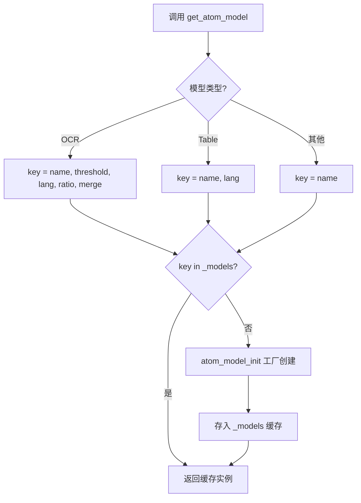
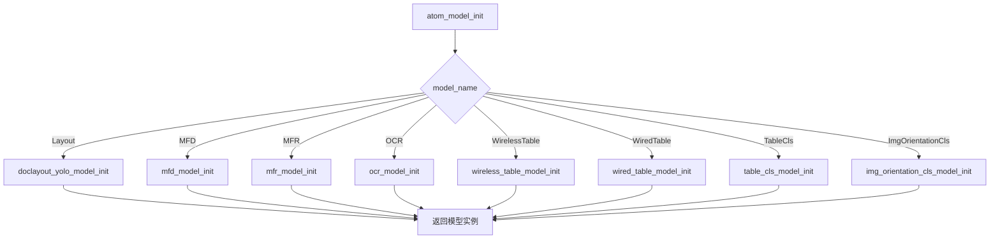
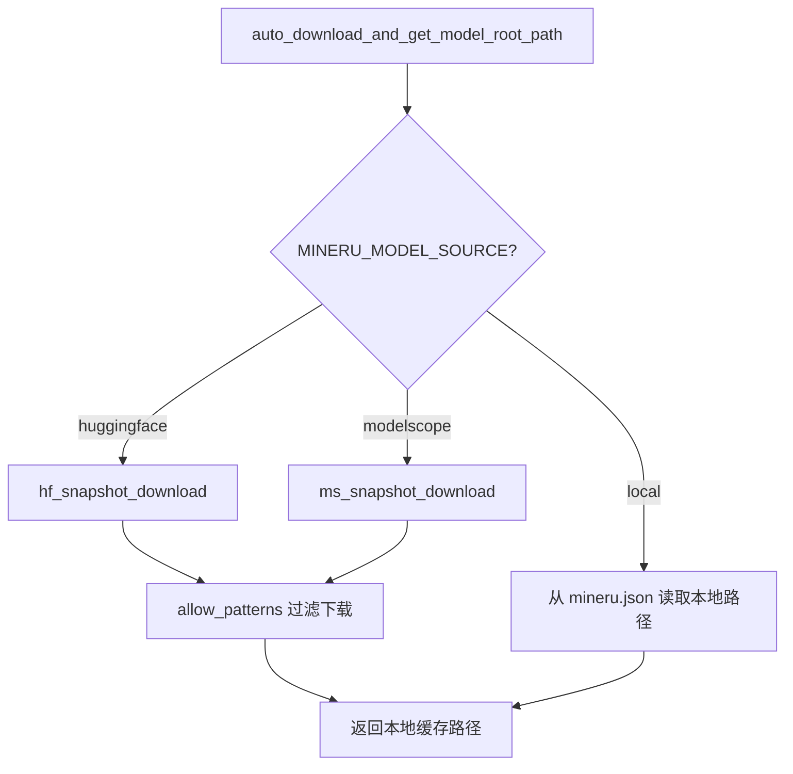

# PD-346.01 MinerU — AtomModelSingleton 多模型单例管理与双源自动下载

> 文档编号：PD-346.01
> 来源：MinerU `mineru/backend/pipeline/model_init.py`, `mineru/utils/models_download_utils.py`
> GitHub：https://github.com/opendatalab/MinerU.git
> 问题域：PD-346 模型管理与自动下载 Model Management & Auto Download
> 状态：可复用方案

---

## 第 1 章 问题与动机

### 1.1 核心问题

文档智能解析系统需要同时加载多种 AI 模型（Layout 检测、OCR、公式检测/识别、表格识别等），每个模型体积从数十 MB 到数 GB 不等。核心挑战：

1. **内存爆炸**：8 种模型如果每次推理都重新加载，GPU/CPU 内存会被反复分配释放，导致 OOM 或严重碎片化
2. **启动延迟**：大模型加载耗时数秒到数十秒，重复加载不可接受
3. **模型源碎片化**：HuggingFace 在国内访问受限，ModelScope 在海外不可用，需要透明切换
4. **参数化实例复用**：同一模型类型（如 OCR）在不同参数配置下（语言、检测阈值）需要独立实例，但相同参数应复用

### 1.2 MinerU 的解法概述

MinerU 采用三层单例架构解决上述问题：

1. **AtomModelSingleton**（`model_init.py:121-152`）：原子模型级单例，管理 8 种基础模型实例，通过参数化缓存键实现"同参数复用、异参数独立"
2. **ModelSingleton / HybridModelSingleton**（`pipeline_analyze.py:18-40`, `model_init.py:274-294`）：管线级单例，按 `(lang, formula_enable, table_enable)` 组合缓存完整的模型管线实例
3. **auto_download_and_get_model_root_path**（`models_download_utils.py:8-69`）：统一下载入口，通过 `MINERU_MODEL_SOURCE` 环境变量在 HuggingFace/ModelScope/本地三源间透明切换

### 1.3 设计思想

| 设计原则 | 具体实现 | 理由 | 替代方案 |
|----------|----------|------|----------|
| 参数化单例 | 缓存键为 `(model_name, lang, threshold...)` 元组 | 同类型模型不同参数需独立实例，纯名称键会导致参数冲突 | 全局唯一实例（不支持多语言并行） |
| 三源透明切换 | 环境变量 `MINERU_MODEL_SOURCE` 控制 huggingface/modelscope/local | 一行环境变量切换，无需改代码 | 配置文件（需要文件系统写入权限） |
| 延迟加载 | 模型在首次 `get_atom_model()` 时才初始化 | 避免加载未使用的模型，节省启动时间和内存 | 预加载所有模型（浪费资源） |
| 路径常量集中 | `ModelPath` 类集中定义所有模型相对路径 | 模型路径变更只需改一处 | 散落在各初始化函数中（维护噩梦） |
| 工厂分发 | `atom_model_init()` 按名称分发到具体初始化函数 | 新增模型只需加一个 elif 分支 | 每个调用方自行构造（重复代码） |

---

## 第 2 章 源码实现分析

### 2.1 架构概览

MinerU 的模型管理分为三层：路径注册层、下载层、实例管理层。

```
┌─────────────────────────────────────────────────────────────┐
│                    Pipeline / Hybrid 入口                     │
│  MineruPipelineModel / MineruHybridModel                     │
│  (按功能组合多个原子模型)                                      │
├─────────────────────────────────────────────────────────────┤
│              ModelSingleton / HybridModelSingleton            │
│  key = (lang, formula_enable, table_enable)                  │
│  缓存完整管线实例                                              │
├─────────────────────────────────────────────────────────────┤
│                    AtomModelSingleton                         │
│  key = (model_name, param1, param2, ...)                     │
│  缓存原子模型实例（Layout/OCR/MFD/MFR/Table...）              │
├─────────────────────────────────────────────────────────────┤
│              auto_download_and_get_model_root_path            │
│  MINERU_MODEL_SOURCE → huggingface / modelscope / local      │
│  snapshot_download() 按需下载到本地缓存                        │
├─────────────────────────────────────────────────────────────┤
│                    ModelPath (enum_class.py)                  │
│  集中定义所有模型的仓库 ID 和相对路径                           │
└─────────────────────────────────────────────────────────────┘
```

### 2.2 核心实现

#### 2.2.1 AtomModelSingleton — 参数化模型缓存



对应源码 `mineru/backend/pipeline/model_init.py:121-152`：

```python
class AtomModelSingleton:
    _instance = None
    _models = {}

    def __new__(cls, *args, **kwargs):
        if cls._instance is None:
            cls._instance = super().__new__(cls)
        return cls._instance

    def get_atom_model(self, atom_model_name: str, **kwargs):
        lang = kwargs.get('lang', None)
        if atom_model_name in [AtomicModel.WiredTable, AtomicModel.WirelessTable]:
            key = (atom_model_name, lang)
        elif atom_model_name in [AtomicModel.OCR]:
            key = (
                atom_model_name,
                kwargs.get('det_db_box_thresh', 0.3),
                lang,
                kwargs.get('det_db_unclip_ratio', 1.8),
                kwargs.get('enable_merge_det_boxes', True)
            )
        else:
            key = atom_model_name
        if key not in self._models:
            self._models[key] = atom_model_init(model_name=atom_model_name, **kwargs)
        return self._models[key]
```

关键设计点：
- **类变量 `_models = {}`**（`model_init.py:123`）：所有实例共享同一个字典，因为 `__new__` 保证只有一个实例
- **OCR 的 5 元组键**（`model_init.py:140-146`）：OCR 模型参数最多，不同阈值/语言组合产生不同实例
- **Table 的 2 元组键**（`model_init.py:135-138`）：表格模型只按语言区分

#### 2.2.2 工厂分发函数 atom_model_init



对应源码 `mineru/backend/pipeline/model_init.py:154-198`：

```python
def atom_model_init(model_name: str, **kwargs):
    atom_model = None
    if model_name == AtomicModel.Layout:
        atom_model = doclayout_yolo_model_init(
            kwargs.get('doclayout_yolo_weights'),
            kwargs.get('device')
        )
    elif model_name == AtomicModel.MFD:
        atom_model = mfd_model_init(
            kwargs.get('mfd_weights'), kwargs.get('device')
        )
    elif model_name == AtomicModel.MFR:
        atom_model = mfr_model_init(
            kwargs.get('mfr_weight_dir'), kwargs.get('device')
        )
    elif model_name == AtomicModel.OCR:
        atom_model = ocr_model_init(
            kwargs.get('det_db_box_thresh', 0.3),
            kwargs.get('lang'),
            kwargs.get('det_db_unclip_ratio', 1.8),
            kwargs.get('enable_merge_det_boxes', True)
        )
    # ... WirelessTable, WiredTable, TableCls, ImgOrientationCls
    if atom_model is None:
        logger.error('model init failed')
        exit(1)
    return atom_model
```

#### 2.2.3 双源自动下载



对应源码 `mineru/utils/models_download_utils.py:8-69`：

```python
def auto_download_and_get_model_root_path(relative_path: str, repo_mode='pipeline') -> str:
    model_source = os.getenv('MINERU_MODEL_SOURCE', "huggingface")

    if model_source == 'local':
        local_models_config = get_local_models_dir()
        root_path = local_models_config.get(repo_mode, None)
        if not root_path:
            raise ValueError(f"Local path for repo_mode '{repo_mode}' is not configured.")
        return root_path

    repo_mapping = {
        'pipeline': {
            'huggingface': ModelPath.pipeline_root_hf,
            'modelscope': ModelPath.pipeline_root_modelscope,
            'default': ModelPath.pipeline_root_hf
        },
        'vlm': {
            'huggingface': ModelPath.vlm_root_hf,
            'modelscope': ModelPath.vlm_root_modelscope,
            'default': ModelPath.vlm_root_hf
        }
    }

    if model_source == "huggingface":
        snapshot_download = hf_snapshot_download
    elif model_source == "modelscope":
        snapshot_download = ms_snapshot_download
    else:
        raise ValueError(f"未知的仓库类型: {model_source}")

    cache_dir = snapshot_download(repo, allow_patterns=[relative_path, relative_path+"/*"])
    return cache_dir
```

### 2.3 实现细节

**模型路径注册表**（`mineru/utils/enum_class.py:93-107`）：

ModelPath 类集中管理所有模型的仓库 ID 和相对路径，形成一个静态注册表：

| 模型 | 相对路径 | 用途 |
|------|----------|------|
| doclayout_yolo | `models/Layout/YOLO/doclayout_yolo_docstructbench_imgsz1280_2501.pt` | 文档版面检测 |
| yolo_v8_mfd | `models/MFD/YOLO/yolo_v8_ft.pt` | 数学公式检测 |
| unimernet_small | `models/MFR/unimernet_hf_small_2503` | 公式识别（英文） |
| pp_formulanet_plus_m | `models/MFR/pp_formulanet_plus_m` | 公式识别（中文） |
| pytorch_paddle | `models/OCR/paddleocr_torch` | OCR 文字识别 |
| layout_reader | `models/ReadingOrder/layout_reader` | 阅读顺序 |
| slanet_plus | `models/TabRec/SlanetPlus/slanet-plus.onnx` | 无线表格识别 |
| unet_structure | `models/TabRec/UnetStructure/unet.onnx` | 有线表格识别 |
| paddle_table_cls | `models/TabCls/paddle_table_cls/PP-LCNet_x1_0_table_cls.onnx` | 表格分类 |
| paddle_orientation_classification | `models/OriCls/paddle_orientation_classification/PP-LCNet_x1_0_doc_ori.onnx` | 方向分类 |

**三层单例的协作关系**：

```
MineruPipelineModel.__init__() (model_init.py:201-271)
  ├── AtomModelSingleton().get_atom_model(AtomicModel.MFD, ...)
  │     └── auto_download_and_get_model_root_path(ModelPath.yolo_v8_mfd)
  │           └── snapshot_download(repo, allow_patterns=[...])
  ├── AtomModelSingleton().get_atom_model(AtomicModel.MFR, ...)
  ├── AtomModelSingleton().get_atom_model(AtomicModel.Layout, ...)
  ├── AtomModelSingleton().get_atom_model(AtomicModel.OCR, ...)
  ├── AtomModelSingleton().get_atom_model(AtomicModel.WiredTable, ...)
  ├── AtomModelSingleton().get_atom_model(AtomicModel.WirelessTable, ...)
  ├── AtomModelSingleton().get_atom_model(AtomicModel.TableCls)
  └── AtomModelSingleton().get_atom_model(AtomicModel.ImgOrientationCls)
```

**环境变量驱动的公式模型切换**（`model_init.py:21-28`）：

`MINERU_FORMULA_CH_SUPPORT` 环境变量控制公式识别模型选择：
- `true/1/yes` → `pp_formulanet_plus_m`（支持中文公式）
- `false/0/no` → `unimernet_small`（默认，英文公式）

**设备自动检测链**（`config_reader.py:75-107`）：

`get_device()` 按优先级检测 8 种硬件后端：
`MINERU_DEVICE_MODE 环境变量 → CUDA → MPS → NPU → GCU → MUSA → MLU → SDAA → CPU`


---

## 第 3 章 迁移指南

### 3.1 迁移清单

**阶段 1：模型注册表**
- [ ] 定义 `ModelRegistry` 类，集中声明所有模型的名称、相对路径、仓库 ID
- [ ] 为每种模型源（HuggingFace/ModelScope/本地）配置仓库映射

**阶段 2：下载层**
- [ ] 实现 `auto_download()` 函数，支持环境变量切换模型源
- [ ] 集成 `huggingface_hub.snapshot_download` 和 `modelscope.snapshot_download`
- [ ] 支持 `allow_patterns` 按需下载（避免下载整个仓库）

**阶段 3：单例管理层**
- [ ] 实现 `AtomModelSingleton`，支持参数化缓存键
- [ ] 实现管线级 `ModelSingleton`，按功能组合缓存
- [ ] 确保线程安全（如需多线程场景加锁）

**阶段 4：集成**
- [ ] 在模型初始化入口调用 `auto_download()` 获取本地路径
- [ ] 通过单例管理器获取/创建模型实例
- [ ] 配置环境变量文档

### 3.2 适配代码模板

```python
"""可直接复用的模型管理框架 — 从 MinerU 提炼"""
import os
from typing import Any, Dict, Tuple, Optional
from dataclasses import dataclass, field


@dataclass
class ModelSpec:
    """模型规格声明"""
    name: str
    relative_path: str
    hf_repo: str
    ms_repo: str = ""
    init_fn: str = ""  # 初始化函数名


class ModelRegistry:
    """模型路径注册表 — 对应 MinerU 的 ModelPath"""
    _specs: Dict[str, ModelSpec] = {}

    @classmethod
    def register(cls, spec: ModelSpec):
        cls._specs[spec.name] = spec

    @classmethod
    def get(cls, name: str) -> ModelSpec:
        if name not in cls._specs:
            raise KeyError(f"Model '{name}' not registered")
        return cls._specs[name]


def auto_download(model_name: str) -> str:
    """统一下载入口 — 对应 MinerU 的 auto_download_and_get_model_root_path"""
    source = os.getenv("MODEL_SOURCE", "huggingface")
    spec = ModelRegistry.get(model_name)

    if source == "local":
        local_dir = os.getenv("LOCAL_MODELS_DIR", "")
        if not local_dir:
            raise ValueError("LOCAL_MODELS_DIR not set")
        return os.path.join(local_dir, spec.relative_path)

    if source == "huggingface":
        from huggingface_hub import snapshot_download
        repo = spec.hf_repo
    elif source == "modelscope":
        from modelscope import snapshot_download
        repo = spec.ms_repo
    else:
        raise ValueError(f"Unknown source: {source}")

    cache_dir = snapshot_download(
        repo,
        allow_patterns=[spec.relative_path, spec.relative_path + "/*"]
    )
    return os.path.join(cache_dir, spec.relative_path)


class AtomModelSingleton:
    """参数化模型单例 — 对应 MinerU 的 AtomModelSingleton"""
    _instance = None
    _models: Dict[Any, Any] = {}

    def __new__(cls):
        if cls._instance is None:
            cls._instance = super().__new__(cls)
        return cls._instance

    def get_model(self, model_name: str, **kwargs) -> Any:
        # 构建参数化缓存键
        key = self._make_key(model_name, **kwargs)
        if key not in self._models:
            weight_path = auto_download(model_name)
            self._models[key] = self._init_model(model_name, weight_path, **kwargs)
        return self._models[key]

    def _make_key(self, model_name: str, **kwargs) -> Tuple:
        """按模型类型构建不同粒度的缓存键"""
        # 默认：模型名 + 所有参数的排序元组
        param_tuple = tuple(sorted(kwargs.items()))
        return (model_name,) + param_tuple

    def _init_model(self, model_name: str, weight_path: str, **kwargs) -> Any:
        """工厂方法 — 按名称分发到具体初始化函数"""
        spec = ModelRegistry.get(model_name)
        init_fn = globals().get(spec.init_fn)
        if init_fn is None:
            raise ValueError(f"Init function '{spec.init_fn}' not found")
        return init_fn(weight_path, **kwargs)


# === 使用示例 ===
# 注册模型
ModelRegistry.register(ModelSpec(
    name="layout",
    relative_path="models/Layout/yolo.pt",
    hf_repo="myorg/my-models",
    ms_repo="MyOrg/my-models",
    init_fn="init_layout_model",
))

# 获取模型（首次调用自动下载+初始化，后续直接返回缓存）
# manager = AtomModelSingleton()
# layout_model = manager.get_model("layout", device="cuda")
```

### 3.3 适用场景

| 场景 | 适用度 | 说明 |
|------|--------|------|
| 多模型文档解析系统 | ⭐⭐⭐ | 完美匹配，MinerU 的原始场景 |
| 多模态 RAG 管线 | ⭐⭐⭐ | Embedding + Reranker + VLM 多模型共存 |
| 单模型推理服务 | ⭐ | 过度设计，直接加载即可 |
| 分布式多 GPU 推理 | ⭐⭐ | 需扩展为进程级单例（如用 multiprocessing.Manager） |
| 模型 A/B 测试 | ⭐⭐ | 参数化键天然支持同模型不同版本共存 |

---

## 第 4 章 测试用例

```python
import os
import pytest
from unittest.mock import patch, MagicMock


class TestAtomModelSingleton:
    """测试参数化单例模型管理器"""

    def setup_method(self):
        """每个测试前重置单例状态"""
        # 模拟 MinerU 的 AtomModelSingleton 重置
        from types import SimpleNamespace
        self.singleton_cls = type('AtomModelSingleton', (), {
            '_instance': None,
            '_models': {},
            '__new__': lambda cls, *a, **kw: (
                super(type(cls), cls).__new__(cls) if cls._instance is None
                else cls._instance
            ),
        })
        self.singleton_cls._instance = None
        self.singleton_cls._models = {}

    def test_singleton_identity(self):
        """同一类的两次实例化返回同一对象"""
        a = self.singleton_cls()
        b = self.singleton_cls()
        assert a is b

    def test_parameterized_cache_key_ocr(self):
        """OCR 模型不同参数产生不同缓存键"""
        key_en = ("ocr", 0.3, "en", 1.8, True)
        key_ch = ("ocr", 0.3, "ch", 1.8, True)
        key_threshold = ("ocr", 0.5, "en", 1.6, False)
        assert key_en != key_ch
        assert key_en != key_threshold

    def test_same_params_reuse(self):
        """相同参数返回同一模型实例"""
        cache = {}
        mock_model = MagicMock()

        def get_model(name, **kwargs):
            key = (name, kwargs.get('lang'))
            if key not in cache:
                cache[key] = mock_model
            return cache[key]

        m1 = get_model("ocr", lang="ch")
        m2 = get_model("ocr", lang="ch")
        assert m1 is m2

    def test_different_params_separate(self):
        """不同参数返回不同模型实例"""
        cache = {}

        def get_model(name, **kwargs):
            key = (name, kwargs.get('lang'))
            if key not in cache:
                cache[key] = MagicMock()
            return cache[key]

        m1 = get_model("ocr", lang="ch")
        m2 = get_model("ocr", lang="en")
        assert m1 is not m2


class TestAutoDownload:
    """测试双源自动下载"""

    @patch.dict(os.environ, {"MINERU_MODEL_SOURCE": "local"})
    def test_local_source(self):
        """本地模式直接返回配置路径"""
        with patch('mineru.utils.config_reader.get_local_models_dir',
                   return_value={'pipeline': '/opt/models'}):
            from mineru.utils.models_download_utils import auto_download_and_get_model_root_path
            result = auto_download_and_get_model_root_path("models/OCR/paddleocr_torch")
            assert result == '/opt/models'

    @patch.dict(os.environ, {"MINERU_MODEL_SOURCE": "huggingface"})
    def test_huggingface_source(self):
        """HuggingFace 模式调用 hf_snapshot_download"""
        with patch('mineru.utils.models_download_utils.hf_snapshot_download',
                   return_value='/cache/hf') as mock_dl:
            from mineru.utils.models_download_utils import auto_download_and_get_model_root_path
            result = auto_download_and_get_model_root_path("models/OCR/paddleocr_torch")
            mock_dl.assert_called_once()
            assert result == '/cache/hf'

    @patch.dict(os.environ, {"MINERU_MODEL_SOURCE": "unknown_source"})
    def test_unknown_source_raises(self):
        """未知模型源抛出 ValueError"""
        with pytest.raises(ValueError, match="未知的仓库类型"):
            from mineru.utils.models_download_utils import auto_download_and_get_model_root_path
            auto_download_and_get_model_root_path("models/OCR/paddleocr_torch")


class TestModelPath:
    """测试模型路径注册表"""

    def test_all_paths_defined(self):
        """所有 8 种原子模型都有对应路径"""
        from mineru.utils.enum_class import ModelPath
        required = [
            'doclayout_yolo', 'yolo_v8_mfd', 'unimernet_small',
            'pytorch_paddle', 'layout_reader', 'slanet_plus',
            'unet_structure', 'paddle_table_cls'
        ]
        for attr in required:
            assert hasattr(ModelPath, attr), f"Missing path: {attr}"

    def test_hf_and_ms_repos(self):
        """HuggingFace 和 ModelScope 仓库 ID 都已定义"""
        from mineru.utils.enum_class import ModelPath
        assert ModelPath.pipeline_root_hf == "opendatalab/PDF-Extract-Kit-1.0"
        assert ModelPath.pipeline_root_modelscope == "OpenDataLab/PDF-Extract-Kit-1.0"
```


---

## 第 5 章 跨域关联

| 关联域 | 关系类型 | 说明 |
|--------|----------|------|
| PD-01 上下文管理 | 协同 | 模型加载占用大量 GPU 内存，单例复用直接减少内存压力，为上下文窗口留出更多空间 |
| PD-03 容错与重试 | 依赖 | `auto_download_and_get_model_root_path` 依赖 `snapshot_download` 的内置重试机制，但缺少显式的重试/降级逻辑 |
| PD-04 工具系统 | 协同 | 模型管理器可视为一种"内部工具注册表"，与外部工具系统的注册模式相似 |
| PD-11 可观测性 | 协同 | `MineruPipelineModel.__init__` 中有 `logger.info('DocAnalysis init done!')` 和耗时日志，但缺少模型级别的内存/加载时间指标 |

---

## 第 6 章 来源文件索引

| 文件 | 行范围 | 关键实现 |
|------|--------|----------|
| `mineru/backend/pipeline/model_init.py` | L121-L152 | AtomModelSingleton 参数化单例 |
| `mineru/backend/pipeline/model_init.py` | L154-L198 | atom_model_init 工厂分发函数 |
| `mineru/backend/pipeline/model_init.py` | L201-L271 | MineruPipelineModel 管线模型组合 |
| `mineru/backend/pipeline/model_init.py` | L274-L294 | HybridModelSingleton 混合管线单例 |
| `mineru/backend/pipeline/model_init.py` | L21-L28 | MFR_MODEL 环境变量驱动公式模型选择 |
| `mineru/utils/models_download_utils.py` | L8-L69 | auto_download_and_get_model_root_path 双源下载 |
| `mineru/utils/enum_class.py` | L93-L107 | ModelPath 模型路径注册表 |
| `mineru/backend/pipeline/model_list.py` | L1-L9 | AtomicModel 8 种原子模型名称常量 |
| `mineru/utils/config_reader.py` | L75-L107 | get_device 8 种硬件后端自动检测 |
| `mineru/utils/config_reader.py` | L146-L153 | get_local_models_dir 本地模型路径配置 |
| `mineru/backend/pipeline/pipeline_analyze.py` | L18-L40 | ModelSingleton 管线级单例 |
| `mineru/backend/vlm/vlm_analyze.py` | L23-L58 | VLM ModelSingleton 含 auto_download VLM 模型 |

---

## 第 7 章 横向对比维度

```json comparison_data
{
  "project": "MinerU",
  "dimensions": {
    "单例粒度": "三层单例：原子模型级 + 管线级 + VLM级，参数化元组键",
    "模型源切换": "环境变量 MINERU_MODEL_SOURCE 切换 HuggingFace/ModelScope/本地三源",
    "下载策略": "snapshot_download + allow_patterns 按需下载，避免拉取整仓库",
    "模型注册": "ModelPath 静态类集中声明 10+ 模型的仓库ID和相对路径",
    "设备适配": "get_device 链式检测 8 种硬件后端（CUDA/MPS/NPU/GCU/MUSA/MLU/SDAA/CPU）",
    "参数化复用": "OCR 按 5 元组键缓存，Table 按语言键缓存，其他按名称键缓存"
  }
}
```

### 域元数据补充

```json domain_metadata
{
  "solution_summary": "MinerU 用三层 AtomModelSingleton 参数化单例管理 8 种 AI 模型实例，通过 MINERU_MODEL_SOURCE 环境变量在 HuggingFace/ModelScope/本地三源间透明切换，snapshot_download 按需下载避免拉取整仓库",
  "description": "多模型系统中参数化缓存键与分层单例的工程实践",
  "sub_problems": [
    "参数化模型实例缓存（同类型不同参数需独立实例）",
    "多硬件后端自动检测与适配"
  ],
  "best_practices": [
    "用元组键实现参数化单例，不同参数组合产生独立缓存",
    "snapshot_download 配合 allow_patterns 按需下载子目录",
    "环境变量驱动模型源切换，零代码改动适配不同网络环境"
  ]
}
```

