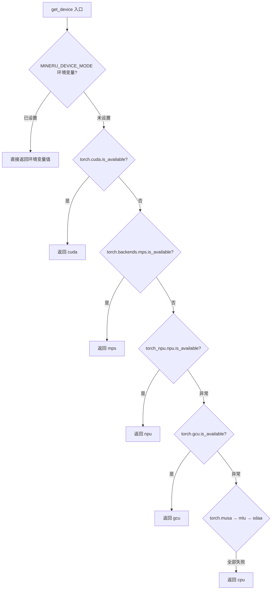
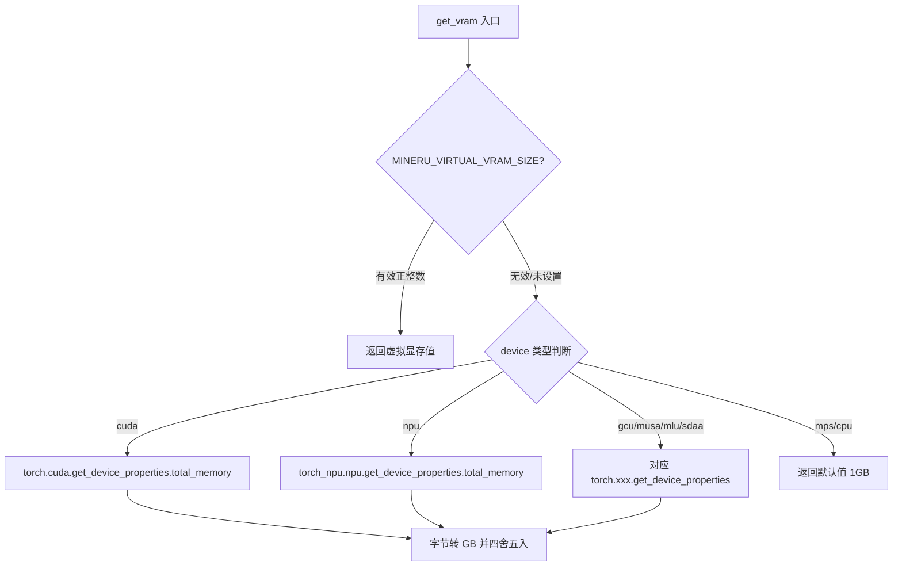

# PD-347.01 MinerU — 七设备统一抽象与显存自适应

> 文档编号：PD-347.01
> 来源：MinerU `mineru/utils/config_reader.py` `mineru/utils/model_utils.py` `mineru/backend/vlm/utils.py`
> GitHub：https://github.com/opendatalab/MinerU.git
> 问题域：PD-347 多硬件适配 Multi-Hardware Adaptation
> 状态：可复用方案

---

## 第 1 章 问题与动机

### 1.1 核心问题

深度学习推理框架需要在多种加速硬件上运行：NVIDIA CUDA、Apple MPS、华为 NPU（Ascend）、燧原 GCU、摩尔线程 MUSA、寒武纪 MLU、太初 SDAA。每种硬件的 PyTorch 扩展 API 不同——可用性检测、显存查询、缓存清理、设备对象构造方式各异。如果在业务代码中直接耦合硬件 API，每新增一种设备就要修改所有调用点，维护成本呈乘法增长。

此外，不同硬件的显存容量差异巨大（从 2GB 到 80GB），batch size 和 GPU memory utilization 需要根据实际显存动态调整，否则要么 OOM 崩溃，要么资源浪费。

### 1.2 MinerU 的解法概述

MinerU 通过三个核心函数构建了一套轻量级硬件抽象层：

1. **`get_device()`** (`config_reader.py:75`) — 设备自动检测与环境变量覆盖，按优先级瀑布式探测 7 种设备
2. **`get_vram()`** (`model_utils.py:450`) — 统一显存查询接口，支持 `MINERU_VIRTUAL_VRAM_SIZE` 环境变量模拟
3. **`clean_memory()`** (`model_utils.py:416`) — 统一缓存清理，按设备类型分发到对应的 `empty_cache()` + `gc.collect()`
4. **`get_batch_ratio()`** (`hybrid_analyze.py:323`) — 基于显存的 batch size 自适应推断
5. **`set_default_gpu_memory_utilization()`** (`vlm/utils.py:82`) — vLLM 显存利用率自适应

这五个函数形成了"检测 → 查询 → 适配 → 清理"的完整生命周期。

### 1.3 设计思想

| 设计原则 | 具体实现 | 理由 | 替代方案 |
|----------|----------|------|----------|
| 环境变量优先 | `MINERU_DEVICE_MODE` 覆盖自动检测 | 容器/CI 环境中硬件检测可能不准确 | 配置文件指定 |
| 瀑布式探测 | CUDA → MPS → NPU → GCU → MUSA → MLU → SDAA → CPU | 按市场占有率排序，减少平均探测次数 | 并行探测（复杂度高） |
| 虚拟显存 | `MINERU_VIRTUAL_VRAM_SIZE` 模拟显存大小 | C/S 分离部署时客户端无法直接查询 GPU | 通过 RPC 查询服务端显存 |
| 字符串前缀匹配 | `str(device).startswith("cuda")` | 兼容 `cuda`、`cuda:0`、`cuda:1` 等变体 | 枚举类型严格匹配 |
| 异常吞没 | 每种设备探测用 `try/except` 包裹 | 未安装对应扩展包时不应崩溃 | `importlib` 预检查 |

---

## 第 2 章 源码实现分析

### 2.1 架构概览

```
┌─────────────────────────────────────────────────────────────┐
│                    业务层 (hybrid_analyze / pipeline)         │
│  doc_analyze() → get_device() → get_batch_ratio()           │
│                → clean_memory() after inference              │
├─────────────────────────────────────────────────────────────┤
│                    硬件抽象层 (config_reader + model_utils)   │
│  ┌──────────┐  ┌──────────┐  ┌──────────────┐              │
│  │get_device│  │ get_vram │  │clean_memory  │              │
│  │ 设备检测  │  │ 显存查询  │  │ 缓存清理     │              │
│  └────┬─────┘  └────┬─────┘  └──────┬───────┘              │
│       │             │               │                       │
├───────┼─────────────┼───────────────┼───────────────────────┤
│       ▼             ▼               ▼                       │
│  ┌─────────────────────────────────────────────────────┐    │
│  │  PyTorch 设备扩展层                                   │    │
│  │  torch.cuda / torch.mps / torch_npu / torch.gcu     │    │
│  │  torch.musa / torch.mlu / torch.sdaa                │    │
│  └─────────────────────────────────────────────────────┘    │
└─────────────────────────────────────────────────────────────┘
```

### 2.2 核心实现

#### 2.2.1 设备自动检测 — 瀑布式探测链



对应源码 `mineru/utils/config_reader.py:75-107`：

```python
def get_device():
    device_mode = os.getenv('MINERU_DEVICE_MODE', None)
    if device_mode is not None:
        return device_mode
    else:
        if torch.cuda.is_available():
            return "cuda"
        elif torch.backends.mps.is_available():
            return "mps"
        else:
            try:
                if torch_npu.npu.is_available():
                    return "npu"
            except Exception as e:
                try:
                    if torch.gcu.is_available():
                        return "gcu"
                except Exception as e:
                    try:
                        if torch.musa.is_available():
                            return "musa"
                    except Exception as e:
                        try:
                            if torch.mlu.is_available():
                                return "mlu"
                        except Exception as e:
                            try:
                                if torch.sdaa.is_available():
                                    return "sdaa"
                            except Exception as e:
                                pass
        return "cpu"
```

关键设计：CUDA 和 MPS 作为主流设备不需要 try/except（PyTorch 原生支持），而 NPU/GCU/MUSA/MLU/SDAA 需要第三方扩展包，用嵌套 try/except 逐级降级。

#### 2.2.2 统一显存查询 — 环境变量优先 + 多设备分发



对应源码 `mineru/utils/model_utils.py:450-486`：

```python
def get_vram(device) -> int:
    env_vram = os.getenv("MINERU_VIRTUAL_VRAM_SIZE")
    if env_vram is not None:
        try:
            total_memory = int(env_vram)
            if total_memory > 0:
                return total_memory
            else:
                logger.warning(f"MINERU_VIRTUAL_VRAM_SIZE value '{env_vram}' is not positive, falling back to auto-detection")
        except ValueError:
            logger.warning(f"MINERU_VIRTUAL_VRAM_SIZE value '{env_vram}' is not a valid integer, falling back to auto-detection")

    total_memory = 1
    if torch.cuda.is_available() and str(device).startswith("cuda"):
        total_memory = round(torch.cuda.get_device_properties(device).total_memory / (1024 ** 3))
    elif str(device).startswith("npu"):
        if torch_npu.npu.is_available():
            total_memory = round(torch_npu.npu.get_device_properties(device).total_memory / (1024 ** 3))
    elif str(device).startswith("gcu"):
        if torch.gcu.is_available():
            total_memory = round(torch.gcu.get_device_properties(device).total_memory / (1024 ** 3))
    # ... musa, mlu, sdaa 同理
    return total_memory
```

### 2.3 实现细节

#### 显存驱动的 Batch Size 自适应

`hybrid_analyze.py:323-366` 中的 `get_batch_ratio()` 实现了两级策略：

1. **环境变量优先**：`MINERU_HYBRID_BATCH_RATIO` 直接指定（适用于 C/S 分离部署）
2. **显存自动推断**：≥32GB→16x, ≥16GB→8x, ≥12GB→4x, ≥8GB→2x, <8GB→1x

VLM 后端的 `set_default_batch_size()` (`vlm/utils.py:92-108`) 和 `set_default_gpu_memory_utilization()` (`vlm/utils.py:82-89`) 也遵循相同模式：先查设备，再查显存，最后映射到配置值。

#### NPU 特殊处理

`model_init.py:329-338` 中 `MineruHybridModel.__init__` 对 NPU 设备有额外初始化：

```python
if str(self.device).startswith('npu'):
    try:
        import torch_npu
        if torch_npu.npu.is_available():
            torch_npu.npu.set_compile_mode(jit_compile=False)
    except Exception as e:
        raise RuntimeError("NPU is selected but torch_npu is not available.") from e
```

这是因为华为 NPU 的 JIT 编译在某些模型上不稳定，需要显式关闭。

#### MPS Fallback 机制

`hybrid_analyze.py:25` 和 `pipeline_analyze.py:15` 都设置了：

```python
os.environ['PYTORCH_ENABLE_MPS_FALLBACK'] = '1'
```

当 MPS 不支持某些算子时自动回退到 CPU 执行，避免运行时崩溃。

#### 设备感知的 Compute Capability 映射

`vlm/utils.py:11-28` 中 `enable_custom_logits_processors()` 对非 CUDA 设备统一映射为 compute capability 8.0，使 vLLM 的功能开关逻辑能统一处理：

```python
elif hasattr(torch, 'npu') and torch.npu.is_available():
    compute_capability = "8.0"
elif hasattr(torch, 'gcu') and torch.gcu.is_available():
    compute_capability = "8.0"
```

#### 设备特定的 vLLM 配置

`vlm/utils.py:111-146` 中 `_get_device_config()` 为不同设备类型提供专属 vLLM 参数（如 corex 的 cudagraph 模式、kxpu 的 block_size 和 splitting_ops），通过 `mod_kwargs_by_device_type()` 在运行时注入。

---

## 第 3 章 迁移指南

### 3.1 迁移清单

**阶段 1：设备检测层（1 个文件）**
- [ ] 创建 `device_utils.py`，实现 `get_device()` 瀑布式探测
- [ ] 支持 `YOUR_APP_DEVICE_MODE` 环境变量覆盖
- [ ] 根据项目需求裁剪设备列表（不需要的设备可删除）

**阶段 2：显存查询层（同文件扩展）**
- [ ] 实现 `get_vram(device)` 统一查询
- [ ] 支持 `YOUR_APP_VIRTUAL_VRAM_SIZE` 环境变量模拟
- [ ] 添加 MPS/CPU 的默认值处理

**阶段 3：缓存清理层**
- [ ] 实现 `clean_memory(device)` 统一清理
- [ ] 在推理循环结束后调用
- [ ] 低显存设备（≤8GB）增加主动清理频率

**阶段 4：Batch Size 自适应**
- [ ] 实现 `get_batch_ratio(device)` 显存→batch 映射
- [ ] 支持环境变量覆盖（C/S 部署场景）

### 3.2 适配代码模板

```python
"""device_utils.py — 多硬件适配层（可直接复用）"""
import os
import gc
from typing import Optional

try:
    import torch
except ImportError:
    torch = None

try:
    import torch_npu
except ImportError:
    torch_npu = None


def get_device(env_var: str = "APP_DEVICE_MODE") -> str:
    """瀑布式设备检测，环境变量优先。"""
    override = os.getenv(env_var)
    if override:
        return override

    if torch is None:
        return "cpu"

    if torch.cuda.is_available():
        return "cuda"
    if hasattr(torch.backends, "mps") and torch.backends.mps.is_available():
        return "mps"

    # 第三方扩展设备：按需裁剪
    for check_fn, name in [
        (lambda: torch_npu and torch_npu.npu.is_available(), "npu"),
        (lambda: hasattr(torch, "gcu") and torch.gcu.is_available(), "gcu"),
        (lambda: hasattr(torch, "musa") and torch.musa.is_available(), "musa"),
        (lambda: hasattr(torch, "mlu") and torch.mlu.is_available(), "mlu"),
        (lambda: hasattr(torch, "sdaa") and torch.sdaa.is_available(), "sdaa"),
    ]:
        try:
            if check_fn():
                return name
        except Exception:
            continue

    return "cpu"


def get_vram(device: str, env_var: str = "APP_VIRTUAL_VRAM_SIZE") -> int:
    """统一显存查询（GB），环境变量可覆盖。"""
    env_val = os.getenv(env_var)
    if env_val:
        try:
            val = int(env_val)
            if val > 0:
                return val
        except ValueError:
            pass

    if torch is None:
        return 1

    _DEVICE_VRAM_GETTERS = {
        "cuda": lambda d: torch.cuda.get_device_properties(d).total_memory if torch.cuda.is_available() else 0,
        "npu": lambda d: torch_npu.npu.get_device_properties(d).total_memory if torch_npu and torch_npu.npu.is_available() else 0,
    }
    # 扩展：gcu, musa, mlu, sdaa 同理添加

    for prefix, getter in _DEVICE_VRAM_GETTERS.items():
        if str(device).startswith(prefix):
            try:
                return max(1, round(getter(device) / (1024 ** 3)))
            except Exception:
                return 1
    return 1


def clean_memory(device: str) -> None:
    """统一缓存清理。"""
    if torch is None:
        gc.collect()
        return

    _CACHE_CLEANERS = {
        "cuda": lambda: (torch.cuda.empty_cache(), torch.cuda.ipc_collect()),
        "mps": lambda: torch.mps.empty_cache(),
        "npu": lambda: torch_npu.npu.empty_cache() if torch_npu and torch_npu.npu.is_available() else None,
    }
    # 扩展：gcu, musa, mlu, sdaa 同理

    for prefix, cleaner in _CACHE_CLEANERS.items():
        if str(device).startswith(prefix):
            try:
                cleaner()
            except Exception:
                pass
            break
    gc.collect()


def get_batch_ratio(device: str, env_var: str = "APP_BATCH_RATIO") -> int:
    """显存驱动的 batch ratio 推断。"""
    env_val = os.getenv(env_var)
    if env_val:
        try:
            return int(env_val)
        except ValueError:
            pass

    vram = get_vram(device)
    if vram >= 32:
        return 16
    elif vram >= 16:
        return 8
    elif vram >= 12:
        return 4
    elif vram >= 8:
        return 2
    return 1
```

### 3.3 适用场景

| 场景 | 适用度 | 说明 |
|------|--------|------|
| 多 GPU 厂商推理服务 | ⭐⭐⭐ | 核心场景，直接复用 |
| 训练框架多设备支持 | ⭐⭐ | 训练还需考虑分布式通信后端适配 |
| 边缘设备部署 | ⭐⭐⭐ | 显存自适应对低端设备尤其重要 |
| C/S 分离推理 | ⭐⭐⭐ | 虚拟显存环境变量专为此设计 |
| 纯 CPU 推理 | ⭐ | 不需要硬件抽象，但 fallback 到 CPU 仍有用 |

---

## 第 4 章 测试用例

```python
"""test_device_utils.py — 基于 MinerU 真实函数签名的测试"""
import os
import gc
from unittest.mock import patch, MagicMock
import pytest


class TestGetDevice:
    """测试 get_device() 瀑布式探测"""

    def test_env_override_takes_priority(self):
        """环境变量覆盖一切自动检测"""
        with patch.dict(os.environ, {"MINERU_DEVICE_MODE": "npu"}):
            from mineru.utils.config_reader import get_device
            assert get_device() == "npu"

    def test_cuda_detected_first(self):
        """CUDA 可用时优先返回 cuda"""
        with patch.dict(os.environ, {}, clear=True):
            with patch("torch.cuda.is_available", return_value=True):
                from mineru.utils.config_reader import get_device
                assert get_device() == "cuda"

    def test_mps_fallback_when_no_cuda(self):
        """无 CUDA 时回退到 MPS"""
        with patch.dict(os.environ, {}, clear=True):
            with patch("torch.cuda.is_available", return_value=False):
                with patch("torch.backends.mps.is_available", return_value=True):
                    from mineru.utils.config_reader import get_device
                    assert get_device() == "mps"

    def test_cpu_fallback_when_nothing_available(self):
        """所有设备不可用时返回 cpu"""
        with patch.dict(os.environ, {}, clear=True):
            with patch("torch.cuda.is_available", return_value=False):
                with patch("torch.backends.mps.is_available", return_value=False):
                    from mineru.utils.config_reader import get_device
                    result = get_device()
                    # 如果没有 NPU/GCU 等扩展包，最终返回 cpu
                    assert result in ("cpu", "npu", "gcu", "musa", "mlu", "sdaa")


class TestGetVram:
    """测试 get_vram() 显存查询"""

    def test_virtual_vram_env_override(self):
        """MINERU_VIRTUAL_VRAM_SIZE 环境变量覆盖"""
        with patch.dict(os.environ, {"MINERU_VIRTUAL_VRAM_SIZE": "24"}):
            from mineru.utils.model_utils import get_vram
            assert get_vram("cuda") == 24

    def test_invalid_virtual_vram_falls_back(self):
        """无效环境变量值回退到自动检测"""
        with patch.dict(os.environ, {"MINERU_VIRTUAL_VRAM_SIZE": "abc"}):
            from mineru.utils.model_utils import get_vram
            result = get_vram("cpu")
            assert isinstance(result, int)
            assert result >= 1

    def test_negative_virtual_vram_falls_back(self):
        """负数环境变量值回退到自动检测"""
        with patch.dict(os.environ, {"MINERU_VIRTUAL_VRAM_SIZE": "-5"}):
            from mineru.utils.model_utils import get_vram
            result = get_vram("cpu")
            assert isinstance(result, int)


class TestCleanMemory:
    """测试 clean_memory() 缓存清理"""

    def test_cuda_clean(self):
        """CUDA 设备调用 empty_cache + ipc_collect"""
        with patch("torch.cuda.is_available", return_value=True), \
             patch("torch.cuda.empty_cache") as mock_empty, \
             patch("torch.cuda.ipc_collect") as mock_ipc:
            from mineru.utils.model_utils import clean_memory
            clean_memory("cuda:0")
            mock_empty.assert_called_once()
            mock_ipc.assert_called_once()

    def test_mps_clean(self):
        """MPS 设备调用 mps.empty_cache"""
        with patch("torch.mps.empty_cache") as mock_empty:
            from mineru.utils.model_utils import clean_memory
            clean_memory("mps")
            mock_empty.assert_called_once()

    def test_unknown_device_only_gc(self):
        """未知设备只做 gc.collect"""
        with patch("gc.collect") as mock_gc:
            from mineru.utils.model_utils import clean_memory
            clean_memory("cpu")
            mock_gc.assert_called()


class TestGetBatchRatio:
    """测试 get_batch_ratio() 显存自适应"""

    def test_env_override(self):
        """环境变量覆盖自动推断"""
        with patch.dict(os.environ, {"MINERU_HYBRID_BATCH_RATIO": "4"}):
            from mineru.backend.hybrid.hybrid_analyze import get_batch_ratio
            assert get_batch_ratio("cuda") == 4

    def test_high_vram_gets_large_batch(self):
        """32GB+ 显存返回 batch_ratio=16"""
        with patch.dict(os.environ, {}, clear=True):
            with patch("mineru.backend.hybrid.hybrid_analyze.get_vram", return_value=32):
                from mineru.backend.hybrid.hybrid_analyze import get_batch_ratio
                assert get_batch_ratio("cuda") == 16

    def test_low_vram_gets_small_batch(self):
        """4GB 显存返回 batch_ratio=1"""
        with patch.dict(os.environ, {}, clear=True):
            with patch("mineru.backend.hybrid.hybrid_analyze.get_vram", return_value=4):
                from mineru.backend.hybrid.hybrid_analyze import get_batch_ratio
                assert get_batch_ratio("cuda") == 1
```

---

## 第 5 章 跨域关联

| 关联域 | 关系类型 | 说明 |
|--------|----------|------|
| PD-01 上下文管理 | 协同 | 显存大小直接影响可加载的上下文长度和模型大小 |
| PD-02 多 Agent 编排 | 协同 | 多 GPU 场景下设备分配影响 Agent 并行度 |
| PD-03 容错与重试 | 依赖 | 设备检测失败时的 fallback 到 CPU 是容错的一种形式 |
| PD-11 可观测性 | 协同 | 显存使用量、batch ratio 选择应纳入可观测指标 |

---

## 第 6 章 来源文件索引

| 文件 | 行范围 | 关键实现 |
|------|--------|----------|
| `mineru/utils/config_reader.py` | L75-L107 | `get_device()` 瀑布式设备检测 |
| `mineru/utils/model_utils.py` | L416-L438 | `clean_memory()` 七设备缓存清理 |
| `mineru/utils/model_utils.py` | L441-L447 | `clean_vram()` 低显存主动清理 |
| `mineru/utils/model_utils.py` | L450-L486 | `get_vram()` 统一显存查询 |
| `mineru/backend/hybrid/hybrid_analyze.py` | L323-L366 | `get_batch_ratio()` 显存自适应 batch |
| `mineru/backend/hybrid/hybrid_analyze.py` | L25 | MPS fallback 环境变量设置 |
| `mineru/backend/vlm/utils.py` | L11-L56 | `enable_custom_logits_processors()` 设备 compute capability 映射 |
| `mineru/backend/vlm/utils.py` | L82-L89 | `set_default_gpu_memory_utilization()` vLLM 显存利用率 |
| `mineru/backend/vlm/utils.py` | L92-L108 | `set_default_batch_size()` VLM batch size 自适应 |
| `mineru/backend/vlm/utils.py` | L111-L146 | `_get_device_config()` 设备特定 vLLM 参数 |
| `mineru/backend/pipeline/model_init.py` | L201-L271 | `MineruPipelineModel` 设备传递到子模型 |
| `mineru/backend/pipeline/model_init.py` | L313-L371 | `MineruHybridModel` NPU JIT 编译关闭 |

---

## 第 7 章 横向对比维度

```json comparison_data
{
  "project": "MinerU",
  "dimensions": {
    "设备检测": "嵌套try/except瀑布式探测7种设备，环境变量MINERU_DEVICE_MODE可覆盖",
    "显存查询": "统一get_vram接口，支持MINERU_VIRTUAL_VRAM_SIZE虚拟显存模拟",
    "缓存清理": "clean_memory按设备前缀分发empty_cache + gc.collect",
    "batch自适应": "双级策略：环境变量优先，否则按显存5档映射batch_ratio",
    "设备特化": "NPU关闭JIT编译、MPS启用fallback、corex/kxpu专属vLLM参数",
    "环境变量体系": "6个环境变量覆盖设备/显存/batch/公式/表格/VLM配置"
  }
}
```

### 域元数据补充

```json domain_metadata
{
  "solution_summary": "MinerU通过get_device瀑布式探测+get_vram统一显存查询+clean_memory分发清理，实现CUDA/MPS/NPU/GCU/MUSA/MLU/SDAA七设备统一抽象，配合6个环境变量支持C/S分离部署",
  "description": "推理框架在异构加速硬件间的统一抽象与运行时自适应",
  "sub_problems": [
    "设备特定编译模式配置（如NPU JIT关闭）",
    "算子不支持时的跨设备fallback（如MPS→CPU）",
    "C/S分离部署时的虚拟显存模拟",
    "设备特定推理框架参数注入（如vLLM device config）"
  ],
  "best_practices": [
    "用环境变量体系覆盖所有自动检测结果，适配容器和CI环境",
    "主流设备（CUDA/MPS）直接检测，小众设备用try/except逐级降级",
    "显存→batch映射采用分档阶梯而非线性公式，避免边界OOM"
  ]
}
```
