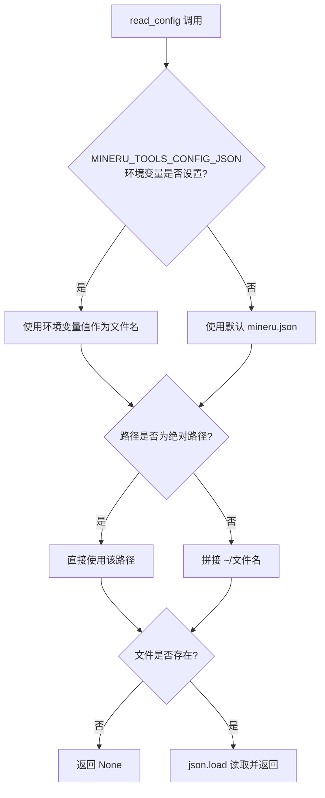
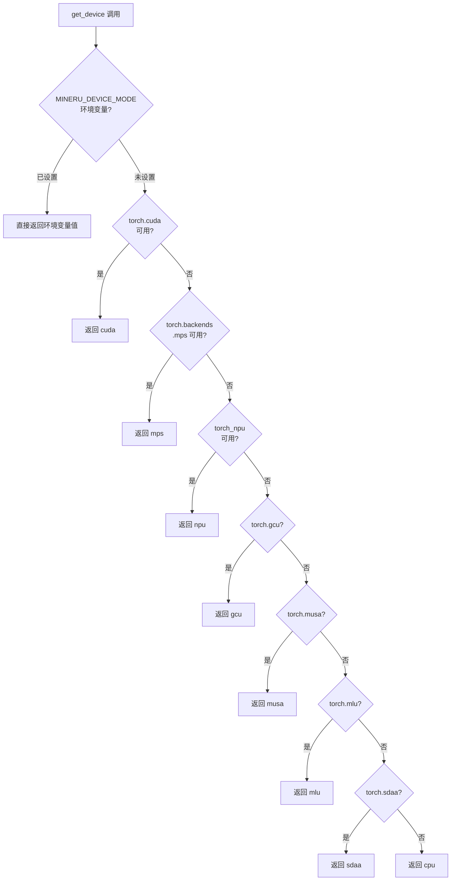

# PD-348.01 MinerU — 环境变量+JSON双层配置体系与硬件感知自动选择

> 文档编号：PD-348.01
> 来源：MinerU `mineru/utils/config_reader.py`, `mineru/utils/os_env_config.py`, `mineru/cli/fast_api.py`
> GitHub：https://github.com/opendatalab/MinerU.git
> 问题域：PD-348 配置管理 Configuration Management
> 状态：可复用方案

---

## 第 1 章 问题与动机（≥ 30 行）

### 1.1 核心问题

文档解析引擎需要在多种硬件（CUDA/NPU/MPS/GCU/MUSA/MLU/SDAA/CPU）、多种推理后端（vLLM/lmdeploy/transformers/MLX）、多种模型源（HuggingFace/ModelScope/本地）之间灵活切换。配置参数涉及：

- **设备选择**：GPU 型号、显存大小、加速卡类型
- **模型管理**：下载源、本地缓存路径、模型版本
- **运行参数**：并发数、超时时间、线程数、日志级别
- **功能开关**：公式识别、表格识别、API 文档暴露
- **S3 存储**：对象存储凭证、端点配置

传统做法要么全用配置文件（部署时不灵活），要么全用环境变量（复杂配置难以表达）。MinerU 的核心挑战是：如何让同一套代码在开发者笔记本、GPU 服务器、多卡集群三种场景下都能零配置启动，同时保留精细调优能力。

### 1.2 MinerU 的解法概述

1. **双层配置体系**：环境变量（`MINERU_` 前缀）优先于 JSON 配置文件（`~/mineru.json`），实现"环境变量覆盖持久化配置"的经典模式 (`config_reader.py:14-30`)
2. **硬件感知自动探测**：`get_device()` 函数按优先级链式探测 7 种加速硬件，环境变量 `MINERU_DEVICE_MODE` 可强制覆盖 (`config_reader.py:75-107`)
3. **推理引擎自动选择**：`get_vlm_engine()` 根据操作系统 + 已安装包自动选择最优推理引擎 (`engine_utils.py:8-33`)
4. **分散式环境变量读取**：每个子系统独立读取自己关心的环境变量，通过 `os_env_config.py` 提供统一的解析工具函数 (`os_env_config.py:4-27`)
5. **CLI→环境变量桥接**：FastAPI 服务将 CLI 参数同步写入环境变量，确保 uvicorn reload 子进程可见 (`fast_api.py:436-441`)

### 1.3 设计思想

| 设计原则 | 具体实现 | 理由 | 替代方案 |
|----------|----------|------|----------|
| 零配置启动 | 所有环境变量都有合理默认值，JSON 配置文件可选 | 降低新用户上手门槛 | 强制配置文件（如 Kubernetes ConfigMap） |
| 环境变量优先 | `MINERU_DEVICE_MODE` 覆盖自动探测结果 | 容器化部署时环境变量最方便 | 配置文件优先（需挂载 volume） |
| 硬件感知降级 | 7 级硬件探测链，最终 fallback 到 CPU | 支持异构硬件环境 | 要求用户手动指定设备 |
| 分散式读取 | 各模块独立 `os.getenv()`，无全局配置对象 | 模块解耦，无启动顺序依赖 | 集中式 Config 单例（耦合度高） |
| 配置文件自动生成 | `models_download` 命令自动下载模板并写入配置 | 避免用户手动编辑 JSON | 要求用户手动创建配置文件 |

---

## 第 2 章 源码实现分析（核心章节）

### 2.1 架构概览

```
┌─────────────────────────────────────────────────────────────┐
│                     配置消费层                                │
│  ┌──────────┐  ┌──────────┐  ┌──────────┐  ┌────────────┐  │
│  │ fast_api  │  │ common   │  │ vlm_     │  │ pipeline_  │  │
│  │ .py      │  │ .py      │  │ analyze  │  │ model_init │  │
│  └────┬─────┘  └────┬─────┘  └────┬─────┘  └─────┬──────┘  │
│       │              │             │               │         │
├───────┼──────────────┼─────────────┼───────────────┼─────────┤
│       ▼              ▼             ▼               ▼         │
│  ┌─────────────────────────────────────────────────────┐     │
│  │              配置读取层                               │     │
│  │  ┌──────────────┐  ┌──────────────┐                 │     │
│  │  │config_reader │  │os_env_config │                 │     │
│  │  │  .py         │  │  .py         │                 │     │
│  │  │ read_config()│  │ get_op_num   │                 │     │
│  │  │ get_device() │  │ _threads()   │                 │     │
│  │  │ get_*()      │  │ get_load_*() │                 │     │
│  │  └──────┬───────┘  └──────┬───────┘                 │     │
│  │         │                 │                          │     │
│  └─────────┼─────────────────┼──────────────────────────┘     │
│            ▼                 ▼                                │
│  ┌──────────────┐  ┌──────────────────┐                      │
│  │ ~/mineru.json│  │ MINERU_* 环境变量 │                      │
│  │ (持久化配置)  │  │ (运行时覆盖)      │                      │
│  └──────────────┘  └──────────────────┘                      │
└─────────────────────────────────────────────────────────────┘
```

### 2.2 核心实现

#### 2.2.1 JSON 配置文件读取



对应源码 `mineru/utils/config_reader.py:13-30`：
```python
# 定义配置文件名常量
CONFIG_FILE_NAME = os.getenv('MINERU_TOOLS_CONFIG_JSON', 'mineru.json')

def read_config():
    if os.path.isabs(CONFIG_FILE_NAME):
        config_file = CONFIG_FILE_NAME
    else:
        home_dir = os.path.expanduser('~')
        config_file = os.path.join(home_dir, CONFIG_FILE_NAME)

    if not os.path.exists(config_file):
        return None
    else:
        with open(config_file, 'r', encoding='utf-8') as f:
            config = json.load(f)
        return config
```

关键设计点：
- 配置文件路径本身也可通过环境变量 `MINERU_TOOLS_CONFIG_JSON` 覆盖
- 支持绝对路径和相对路径（相对于 `$HOME`）
- 文件不存在时静默返回 `None`，不抛异常——这是零配置启动的基础

#### 2.2.2 硬件感知设备探测链



对应源码 `mineru/utils/config_reader.py:75-107`：
```python
def get_device():
    device_mode = os.getenv('MINERU_DEVICE_MODE', None)
    if device_mode is not None:
        return device_mode
    else:
        if torch.cuda.is_available():
            return "cuda"
        elif torch.backends.mps.is_available():
            return "mps"
        else:
            try:
                if torch_npu.npu.is_available():
                    return "npu"
            except Exception as e:
                try:
                    if torch.gcu.is_available():
                        return "gcu"
                except Exception as e:
                    try:
                        if torch.musa.is_available():
                            return "musa"
                    except Exception as e:
                        try:
                            if torch.mlu.is_available():
                                return "mlu"
                        except Exception as e:
                            try:
                                if torch.sdaa.is_available():
                                    return "sdaa"
                            except Exception as e:
                                pass
        return "cpu"
```

关键设计点：
- 环境变量 `MINERU_DEVICE_MODE` 作为最高优先级覆盖
- 嵌套 try-except 处理各种加速库未安装的情况
- 探测顺序反映硬件优先级：CUDA > MPS > NPU > GCU > MUSA > MLU > SDAA > CPU

### 2.3 实现细节

#### 环境变量全景图

MinerU 使用了 20+ 个 `MINERU_` 前缀环境变量，按功能分为 5 类：

| 类别 | 环境变量 | 默认值 | 读取位置 |
|------|----------|--------|----------|
| **设备控制** | `MINERU_DEVICE_MODE` | 自动探测 | `config_reader.py:76` |
| | `MINERU_VIRTUAL_VRAM_SIZE` | 自动探测 | `model_utils.py:451` |
| | `MINERU_VLLM_DEVICE` | "" | `vlm/utils.py:182` |
| | `MINERU_LMDEPLOY_DEVICE` | "" | `lmdeploy_server.py:56` |
| | `MINERU_LMDEPLOY_BACKEND` | 自动选择 | `lmdeploy_server.py:61` |
| **模型管理** | `MINERU_MODEL_SOURCE` | "huggingface" | `models_download_utils.py:17` |
| | `MINERU_FORMULA_CH_SUPPORT` | "False" | `model_init.py:21` |
| **运行参数** | `MINERU_LOG_LEVEL` | "INFO" | `fast_api.py:19` |
| | `MINERU_PDF_RENDER_TIMEOUT` | 300 | `os_env_config.py:10` |
| | `MINERU_PDF_RENDER_THREADS` | 4 | `os_env_config.py:15` |
| | `MINERU_INTRA_OP_NUM_THREADS` | -1 | `table_structure_unet.py:33` |
| | `MINERU_INTER_OP_NUM_THREADS` | -1 | `table_structure_unet.py:34` |
| **API 控制** | `MINERU_API_MAX_CONCURRENT_REQUESTS` | 0(无限制) | `fast_api.py:67` |
| | `MINERU_API_ENABLE_FASTAPI_DOCS` | "1" | `fast_api.py:52` |
| **功能开关** | `MINERU_FORMULA_ENABLE` | 参数传入 | `config_reader.py:111` |
| | `MINERU_TABLE_ENABLE` | 参数传入 | `config_reader.py:117` |
| | `MINERU_VLM_FORMULA_ENABLE` | 运行时设置 | `common.py:456` |
| | `MINERU_VLM_TABLE_ENABLE` | 运行时设置 | `common.py:457` |
| **配置路径** | `MINERU_TOOLS_CONFIG_JSON` | "mineru.json" | `config_reader.py:14` |

#### 推理引擎自动选择

`engine_utils.py` 实现了基于操作系统 + 已安装包的推理引擎自动选择 (`engine_utils.py:8-33`)：

- **Windows**: 优先 lmdeploy，fallback 到 transformers
- **Linux**: 优先 vllm（支持 async），fallback lmdeploy → transformers
- **macOS**: 优先 mlx（需 macOS 版本支持），fallback 到 transformers

#### CLI→环境变量桥接

FastAPI 服务启动时，将 CLI 参数同步到环境变量 (`fast_api.py:436-441`)：

```python
# 将 CLI 的并发参数同步到环境变量，确保 uvicorn 重载子进程可见
try:
    mcr = int(kwargs.get("mineru_api_max_concurrent_requests", 0) or 0)
except ValueError:
    mcr = 0
os.environ["MINERU_API_MAX_CONCURRENT_REQUESTS"] = str(mcr)
```

这解决了 uvicorn `--reload` 模式下子进程无法继承 CLI 参数的问题。

#### 配置文件自动生成

`models_download.py:44-58` 实现了配置文件的自动下载和更新：从 GitHub CDN 下载模板 JSON，合并本地修改后写入 `~/mineru.json`，并支持配置版本检查（`config_version` 字段）。


---

## 第 3 章 迁移指南

### 3.1 迁移清单

**阶段 1：基础配置读取（1 个文件）**
- [ ] 创建 `config_reader.py`，实现 `read_config()` + `get_device()`
- [ ] 定义项目专属环境变量前缀（如 `MYAPP_`）
- [ ] 实现 JSON 配置文件读取，支持绝对/相对路径

**阶段 2：环境变量工具函数（1 个文件）**
- [ ] 创建 `env_config.py`，实现类型安全的环境变量解析
- [ ] 支持 int/float/bool/str 类型自动转换
- [ ] 所有解析函数提供默认值，确保零配置启动

**阶段 3：硬件感知（可选）**
- [ ] 实现设备探测链（根据项目需要裁剪硬件类型）
- [ ] 实现推理引擎自动选择（根据已安装包）

**阶段 4：CLI 集成**
- [ ] CLI 参数通过 `app.state.config` 传递给应用
- [ ] 关键参数同步到环境变量（支持子进程继承）

### 3.2 适配代码模板

```python
"""config_reader.py — 双层配置读取器（可直接复用）"""
import json
import os
from typing import Any, Optional

# 项目专属前缀
ENV_PREFIX = "MYAPP_"
CONFIG_FILE_NAME = os.getenv(f'{ENV_PREFIX}CONFIG_JSON', 'myapp.json')


def read_config() -> Optional[dict]:
    """读取 JSON 配置文件，文件不存在时返回 None"""
    if os.path.isabs(CONFIG_FILE_NAME):
        config_file = CONFIG_FILE_NAME
    else:
        config_file = os.path.join(os.path.expanduser('~'), CONFIG_FILE_NAME)

    if not os.path.exists(config_file):
        return None
    with open(config_file, 'r', encoding='utf-8') as f:
        return json.load(f)


def get_config_value(key: str, default: Any = None) -> Any:
    """优先从环境变量读取，fallback 到 JSON 配置文件"""
    env_key = f"{ENV_PREFIX}{key.upper().replace('-', '_')}"
    env_val = os.getenv(env_key)
    if env_val is not None:
        return env_val

    config = read_config()
    if config and key in config:
        return config[key]
    return default


def get_env_int(env_name: str, default: int) -> int:
    """类型安全的整数环境变量读取"""
    val = os.getenv(env_name)
    if val is not None:
        try:
            parsed = int(val)
            if parsed > 0:
                return parsed
        except ValueError:
            pass
    return default


def get_env_bool(env_name: str, default: bool) -> bool:
    """类型安全的布尔环境变量读取"""
    val = os.getenv(env_name)
    if val is None:
        return default
    return val.lower() in ('true', '1', 'yes')
```

### 3.3 适用场景

| 场景 | 适用度 | 说明 |
|------|--------|------|
| ML 推理服务（多硬件） | ⭐⭐⭐ | 硬件探测链 + 引擎自动选择直接复用 |
| 容器化微服务 | ⭐⭐⭐ | 环境变量优先 + 零配置启动完美匹配 |
| CLI 工具 | ⭐⭐⭐ | CLI→环境变量桥接模式可复用 |
| 桌面应用 | ⭐⭐ | JSON 配置文件部分适用，环境变量不太自然 |
| 纯前端项目 | ⭐ | 不适用，前端通常用 .env 文件 |

---

## 第 4 章 测试用例

```python
"""test_config_management.py — 基于 MinerU 真实函数签名的测试"""
import json
import os
import tempfile
import pytest


class TestReadConfig:
    """测试 config_reader.read_config()"""

    def test_config_file_exists(self, tmp_path):
        """正常路径：配置文件存在时正确读取"""
        config_data = {"models-dir": {"pipeline": "/models"}, "config_version": "1.3.1"}
        config_file = tmp_path / "mineru.json"
        config_file.write_text(json.dumps(config_data))

        os.environ['MINERU_TOOLS_CONFIG_JSON'] = str(config_file)
        try:
            # 模拟 read_config 逻辑
            config_file_name = os.getenv('MINERU_TOOLS_CONFIG_JSON', 'mineru.json')
            assert os.path.isabs(config_file_name)
            with open(config_file_name, 'r') as f:
                result = json.load(f)
            assert result['models-dir']['pipeline'] == '/models'
            assert result['config_version'] == '1.3.1'
        finally:
            del os.environ['MINERU_TOOLS_CONFIG_JSON']

    def test_config_file_not_exists(self):
        """边界情况：配置文件不存在时返回 None"""
        os.environ['MINERU_TOOLS_CONFIG_JSON'] = '/nonexistent/path/mineru.json'
        try:
            config_file = os.getenv('MINERU_TOOLS_CONFIG_JSON')
            assert not os.path.exists(config_file)
            # read_config 应返回 None
            result = None if not os.path.exists(config_file) else json.load(open(config_file))
            assert result is None
        finally:
            del os.environ['MINERU_TOOLS_CONFIG_JSON']

    def test_relative_path_resolves_to_home(self):
        """配置文件名为相对路径时，拼接到 $HOME"""
        config_name = "mineru.json"
        assert not os.path.isabs(config_name)
        expected = os.path.join(os.path.expanduser('~'), config_name)
        assert os.path.isabs(expected)


class TestGetDevice:
    """测试 config_reader.get_device() 的环境变量覆盖"""

    def test_env_override(self):
        """环境变量 MINERU_DEVICE_MODE 覆盖自动探测"""
        os.environ['MINERU_DEVICE_MODE'] = 'cpu'
        try:
            device_mode = os.getenv('MINERU_DEVICE_MODE', None)
            assert device_mode == 'cpu'
        finally:
            del os.environ['MINERU_DEVICE_MODE']

    def test_env_not_set_returns_none(self):
        """环境变量未设置时返回 None，触发自动探测"""
        os.environ.pop('MINERU_DEVICE_MODE', None)
        assert os.getenv('MINERU_DEVICE_MODE', None) is None


class TestEnvConfig:
    """测试 os_env_config.py 的类型安全解析"""

    def test_get_value_from_string_valid(self):
        """正常整数字符串解析"""
        def get_value_from_string(env_value, default_value):
            if env_value is not None:
                try:
                    num = int(env_value)
                    if num > 0:
                        return num
                except ValueError:
                    return default_value
            return default_value

        assert get_value_from_string('8', -1) == 8
        assert get_value_from_string('0', -1) == -1   # 0 不是正数
        assert get_value_from_string('-1', -1) == -1   # 负数
        assert get_value_from_string('abc', -1) == -1  # 非数字
        assert get_value_from_string(None, 300) == 300  # None

    def test_concurrent_requests_parsing(self):
        """API 并发数解析：无效值降级为 0（无限制）"""
        os.environ['MINERU_API_MAX_CONCURRENT_REQUESTS'] = 'invalid'
        try:
            try:
                mcr = int(os.getenv('MINERU_API_MAX_CONCURRENT_REQUESTS', '0'))
            except ValueError:
                mcr = 0
            assert mcr == 0
        finally:
            del os.environ['MINERU_API_MAX_CONCURRENT_REQUESTS']

    def test_bool_env_parsing(self):
        """布尔环境变量解析"""
        os.environ['MINERU_FORMULA_ENABLE'] = 'true'
        try:
            val = os.getenv('MINERU_FORMULA_ENABLE')
            assert val.lower() == 'true'
        finally:
            del os.environ['MINERU_FORMULA_ENABLE']
```


---

## 第 5 章 跨域关联

| 关联域 | 关系类型 | 说明 |
|--------|----------|------|
| PD-03 容错与重试 | 协同 | `get_device()` 的嵌套 try-except 链本身就是一种硬件探测容错；`get_value_from_string()` 对无效值的静默降级也是容错模式 |
| PD-04 工具系统 | 依赖 | 推理引擎选择（`engine_utils.py`）决定了哪些工具/模型可用，配置管理是工具系统初始化的前置条件 |
| PD-11 可观测性 | 协同 | `MINERU_LOG_LEVEL` 环境变量控制日志级别，是可观测性的配置入口；`MINERU_VIRTUAL_VRAM_SIZE` 的 warning 日志提供配置诊断信息 |

---

## 第 6 章 来源文件索引

| 文件 | 行范围 | 关键实现 |
|------|--------|----------|
| `mineru/utils/config_reader.py` | L13-L30 | JSON 配置文件读取，支持环境变量覆盖路径 |
| `mineru/utils/config_reader.py` | L75-L107 | 7 级硬件感知设备探测链 |
| `mineru/utils/config_reader.py` | L110-L119 | 布尔功能开关（公式/表格）环境变量覆盖 |
| `mineru/utils/config_reader.py` | L134-L153 | JSON 配置子项读取（LLM 辅助、LaTeX 分隔符、模型目录） |
| `mineru/utils/os_env_config.py` | L4-L27 | 类型安全的环境变量解析工具函数 |
| `mineru/utils/engine_utils.py` | L8-L33 | 操作系统感知的推理引擎自动选择 |
| `mineru/cli/fast_api.py` | L19-L21 | 日志级别环境变量读取 |
| `mineru/cli/fast_api.py` | L49-L77 | API 并发控制 + 文档开关环境变量 |
| `mineru/cli/fast_api.py` | L430-L441 | CLI→环境变量桥接（uvicorn reload 兼容） |
| `mineru/utils/models_download_utils.py` | L17 | 模型源环境变量读取 |
| `mineru/cli/models_download.py` | L44-L58 | 配置文件自动下载与模板合并 |
| `mineru/backend/pipeline/model_init.py` | L21-L28 | 公式模型选择环境变量 |
| `mineru/utils/model_utils.py` | L450-L464 | 虚拟显存环境变量（含 warning 降级） |
| `mineru/model/vlm/lmdeploy_server.py` | L56-L65 | lmdeploy 设备/后端环境变量覆盖 |
| `mineru/backend/vlm/utils.py` | L172-L193 | vLLM 设备类型配置适配 |
| `mineru/utils/cli_parser.py` | L1-L38 | CLI 额外参数解析器（`--key value` → dict） |
| `mineru.template.json` | 全文 | 配置文件模板（S3、LaTeX、LLM、模型路径） |
| `projects/multi_gpu_v2/_config_endpoint.py` | L10-L57 | 模型源连通性探测与自动降级 |

---

## 第 7 章 横向对比维度

```json comparison_data
{
  "project": "MinerU",
  "dimensions": {
    "配置层级": "环境变量 > JSON文件 > 硬件自动探测三层优先级",
    "配置发现": "分散式os.getenv读取，无全局Config单例",
    "硬件适配": "7级加速硬件探测链+推理引擎OS感知选择",
    "零配置能力": "所有参数有默认值，JSON配置文件可选",
    "配置生成": "CLI命令自动下载模板JSON并合并本地修改",
    "子进程同步": "CLI参数写入os.environ确保reload子进程可见"
  }
}
```

### 域元数据补充

```json domain_metadata
{
  "solution_summary": "MinerU用MINERU_前缀环境变量+~/mineru.json双层配置体系，配合7级硬件探测链和OS感知推理引擎自动选择，实现多硬件零配置启动",
  "description": "ML推理服务的多硬件适配与推理引擎自动选择配置模式",
  "sub_problems": [
    "硬件感知自动探测与多加速卡降级链",
    "推理引擎基于OS和已安装包的自动选择",
    "CLI参数到环境变量的子进程同步",
    "配置文件模板自动下载与版本化合并"
  ],
  "best_practices": [
    "分散式环境变量读取避免全局Config单例耦合",
    "配置文件不存在时静默返回None实现零配置启动",
    "CLI参数同步到os.environ确保uvicorn reload子进程继承"
  ]
}
```

