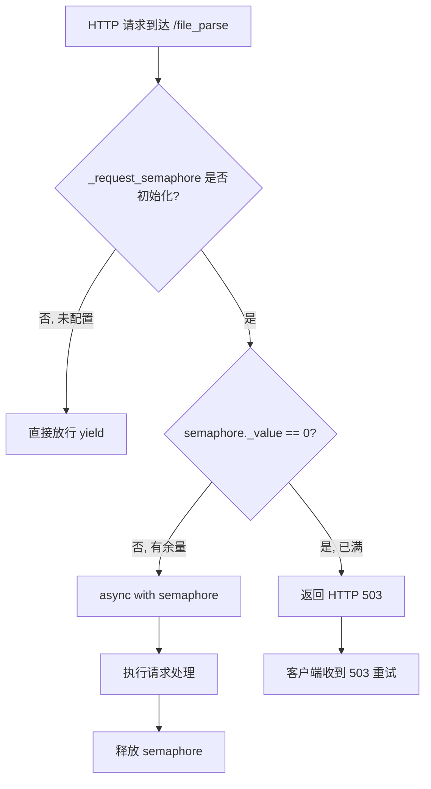
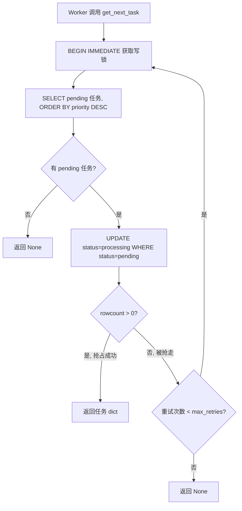
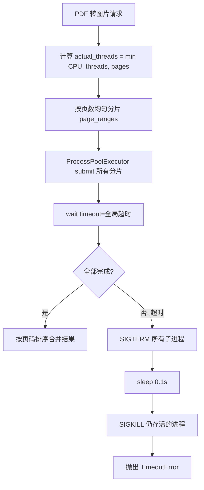

# PD-349.01 MinerU — 三层并发控制与 GPU 资源保护

> 文档编号：PD-349.01
> 来源：MinerU `mineru/cli/fast_api.py`, `projects/mineru_tianshu/task_db.py`, `projects/mineru_tianshu/litserve_worker.py`
> GitHub：https://github.com/opendatalab/MinerU.git
> 问题域：PD-349 并发控制 Concurrency Control
> 状态：可复用方案

---

## 第 1 章 问题与动机

### 1.1 核心问题

GPU 密集型文档解析服务面临三重并发挑战：

1. **请求洪峰**：多个客户端同时提交 PDF 解析请求，GPU 显存有限，无法同时处理所有请求
2. **任务竞争**：多 Worker 从同一任务队列拉取任务时，可能出现重复处理或死锁
3. **进程级资源争抢**：PDF 转图片需要多进程并行，进程数不受控会耗尽 CPU/内存

MinerU 是一个开源的 PDF 文档智能解析工具，支持 OCR、公式识别、表格提取等 GPU 密集操作。当部署为 FastAPI 服务时，必须在请求入口、任务调度、计算执行三个层面实施并发控制，否则 GPU OOM 或服务雪崩不可避免。

### 1.2 MinerU 的解法概述

MinerU 构建了三层并发控制体系：

1. **请求层 — asyncio.Semaphore 门控**：在 FastAPI 入口通过 `Depends(limit_concurrency)` 注入信号量依赖，超限直接返回 503（`fast_api.py:31-46`）
2. **任务层 — SQLite BEGIN IMMEDIATE 原子抢占**：多 Worker 通过 `BEGIN IMMEDIATE` 事务 + `rowcount` 校验实现无锁竞争安全的任务分配（`task_db.py:106-159`）
3. **计算层 — ProcessPoolExecutor 动态分片**：PDF 转图片按页数动态分配进程数，配合全局超时和 SIGTERM→SIGKILL 两阶段强杀（`pdf_image_tools.py:100-169`）

### 1.3 设计思想

| 设计原则 | 具体实现 | 理由 | 替代方案 |
|----------|----------|------|----------|
| 快速拒绝 | Semaphore._value==0 时直接 503，不排队 | GPU 任务耗时长，排队只会让等待时间更长 | 排队 + 超时（增加内存压力） |
| 环境变量驱动 | `MINERU_API_MAX_CONCURRENT_REQUESTS` 控制并发上限 | 容器化部署时无需改代码，通过 env 调整 | 配置文件（需重启） |
| 悲观锁抢占 | SQLite `BEGIN IMMEDIATE` 立即获取写锁 | 避免乐观锁的 ABA 问题，简单可靠 | Redis 分布式锁（引入外部依赖） |
| 资源自适应 | `min(cpu_count, threads, total_pages)` 动态计算进程数 | 避免小文件创建过多进程的浪费 | 固定进程池（浪费或不足） |
| GPU 进程隔离 | `CUDA_VISIBLE_DEVICES` 限制每个 Worker 只看到一张卡 | 防止单进程占用多卡显存 | 手动指定 device_id（易出错） |

---

## 第 2 章 源码实现分析

### 2.1 架构概览

MinerU 的并发控制分布在三个独立层次，每层解决不同粒度的并发问题：

```
┌─────────────────────────────────────────────────────────┐
│                    客户端请求                              │
└──────────────────────┬──────────────────────────────────┘
                       ▼
┌─────────────────────────────────────────────────────────┐
│  Layer 1: FastAPI Semaphore 门控                         │
│  asyncio.Semaphore(N) → 超限返回 503                     │
│  fast_api.py:31-46                                      │
└──────────────────────┬──────────────────────────────────┘
                       ▼
┌─────────────────────────────────────────────────────────┐
│  Layer 2: SQLite 原子任务分配                             │
│  BEGIN IMMEDIATE → SELECT → UPDATE → rowcount 校验       │
│  task_db.py:106-159                                     │
└──────────────────────┬──────────────────────────────────┘
                       ▼
┌─────────────────────────────────────────────────────────┐
│  Layer 3: ProcessPoolExecutor 动态分片                    │
│  min(cpu, threads, pages) → 全局超时 → SIGTERM/SIGKILL   │
│  pdf_image_tools.py:100-169                             │
└──────────────────────┬──────────────────────────────────┘
                       ▼
┌─────────────────────────────────────────────────────────┐
│  GPU Worker Pool (LitServe)                             │
│  workers_per_device=1, CUDA_VISIBLE_DEVICES 隔离         │
│  litserve_worker.py:84-93, 427-502                      │
└─────────────────────────────────────────────────────────┘
```

### 2.2 核心实现

#### 2.2.1 Layer 1：请求级 Semaphore 门控



对应源码 `mineru/cli/fast_api.py:30-46`：

```python
# 并发控制器
_request_semaphore: Optional[asyncio.Semaphore] = None

# 并发控制依赖函数
async def limit_concurrency():
    if _request_semaphore is not None:
        # 检查信号量是否已用尽，如果是则拒绝请求
        if _request_semaphore._value == 0:
            raise HTTPException(
                status_code=503,
                detail=f"Server is at maximum capacity: "
                       f"{os.getenv('MINERU_API_MAX_CONCURRENT_REQUESTS', 'unset')}. "
                       f"Please try again later.",
            )
        async with _request_semaphore:
            yield
    else:
        yield
```

关键设计点：
- **先检查再获取**（`fast_api.py:38`）：不直接 `async with`，而是先检查 `_value == 0`。这避免了请求在 semaphore 上排队等待，实现了"快速拒绝"语义
- **FastAPI Depends 注入**（`fast_api.py:125`）：通过 `dependencies=[Depends(limit_concurrency)]` 装饰路由，零侵入业务代码
- **环境变量初始化**（`fast_api.py:63-74`）：`create_app()` 中从 `MINERU_API_MAX_CONCURRENT_REQUESTS` 读取，默认 0 表示不限制

#### 2.2.2 Layer 2：SQLite 原子任务抢占



对应源码 `projects/mineru_tianshu/task_db.py:106-159`：

```python
def get_next_task(self, worker_id: str, max_retries: int = 3) -> Optional[Dict]:
    for attempt in range(max_retries):
        with self.get_cursor() as cursor:
            # 使用事务确保原子性
            cursor.execute('BEGIN IMMEDIATE')
            
            # 按优先级和创建时间获取任务
            cursor.execute('''
                SELECT * FROM tasks 
                WHERE status = 'pending' 
                ORDER BY priority DESC, created_at ASC 
                LIMIT 1
            ''')
            
            task = cursor.fetchone()
            if task:
                # 立即标记为 processing，并确保状态仍是 pending
                cursor.execute('''
                    UPDATE tasks 
                    SET status = 'processing', 
                        started_at = CURRENT_TIMESTAMP, 
                        worker_id = ?
                    WHERE task_id = ? AND status = 'pending'
                ''', (worker_id, task['task_id']))
                
                # 检查是否更新成功（防止被其他 worker 抢走）
                if cursor.rowcount == 0:
                    continue
                
                return dict(task)
            else:
                return None
    return None
```

关键设计点：
- **BEGIN IMMEDIATE**（`task_db.py:126`）：立即获取写锁而非延迟到 UPDATE，避免两个 Worker 同时 SELECT 到同一任务
- **双重校验**（`task_db.py:144`）：UPDATE WHERE 中再次检查 `status = 'pending'`，即使 BEGIN IMMEDIATE 已获取锁，仍做防御性检查
- **重试而非等待**（`task_db.py:123`）：被抢走时立即重试获取下一个任务，而非 sleep 后重试同一个

#### 2.2.3 Layer 3：ProcessPoolExecutor 动态分片与超时保护



对应源码 `mineru/utils/pdf_image_tools.py:100-169`：

```python
# 实际使用的进程数不超过总页数
actual_threads = min(os.cpu_count() or 1, threads, total_pages)

# 根据实际进程数分组页面范围
pages_per_thread = max(1, total_pages // actual_threads)
page_ranges = []

for i in range(actual_threads):
    range_start = start_page_id + i * pages_per_thread
    if i == actual_threads - 1:
        range_end = end_page_id
    else:
        range_end = start_page_id + (i + 1) * pages_per_thread - 1
    page_ranges.append((range_start, range_end))

executor = ProcessPoolExecutor(max_workers=actual_threads)
try:
    futures = []
    for range_start, range_end in page_ranges:
        future = executor.submit(
            _load_images_from_pdf_worker, pdf_bytes, dpi,
            range_start, range_end, image_type,
        )
        futures.append(future)

    # 使用 wait() 设置单一全局超时
    done, not_done = wait(futures, timeout=timeout, return_when=ALL_COMPLETED)

    if not_done:
        _terminate_executor_processes(executor)
        raise TimeoutError(f"PDF to images conversion timeout after {timeout}s")
finally:
    executor.shutdown(wait=False, cancel_futures=True)
```

关键设计点：
- **三值取最小**（`pdf_image_tools.py:100`）：`min(cpu_count, threads, total_pages)` 确保不会为 3 页 PDF 创建 16 个进程
- **两阶段强杀**（`pdf_image_tools.py:172-189`）：先 SIGTERM 给进程优雅退出机会，0.1s 后对仍存活的发 SIGKILL
- **全局超时而非单任务超时**：用 `wait(timeout=)` 统一控制，避免单个慢分片拖垮整体

### 2.3 实现细节

#### GPU Worker 进程隔离

LitServe Worker 启动时通过 `CUDA_VISIBLE_DEVICES` 实现 GPU 隔离（`litserve_worker.py:84-93`）：

```python
if device != 'auto' and device != 'cpu' and ':' in str(device):
    device_id = str(device).split(':')[-1]
    os.environ['CUDA_VISIBLE_DEVICES'] = device_id
    os.environ['MINERU_DEVICE_MODE'] = 'cuda:0'
```

每个 Worker 进程只能看到分配给它的那张 GPU，物理 GPU N 在进程内映射为逻辑 GPU 0。这防止了一个 Worker 意外占用多张卡的显存。

#### Pull 模式任务循环

Worker 采用主动拉取而非被动推送（`litserve_worker.py:151-200`）：

```python
def _worker_loop(self):
    idle_count = 0
    while self.running:
        task = self.db.get_next_task(self.worker_id)
        if task:
            idle_count = 0
            self._process_task(task)
        else:
            idle_count += 1
            if idle_count == 1:
                logger.debug(f"💤 {self.worker_id} is idle...")
            time.sleep(self.poll_interval)
```

Pull 模式的优势：Worker 处理完一个任务后立即拉取下一个，无需等待调度器分配，最大化 GPU 利用率。

#### 数据库连接安全

每次操作创建新连接，避免跨线程共享（`task_db.py:22-38`）：

```python
def _get_conn(self):
    conn = sqlite3.connect(
        self.db_path, 
        check_same_thread=False,
        timeout=30.0  # 防止死锁
    )
    conn.row_factory = sqlite3.Row
    return conn
```

`timeout=30.0` 确保如果锁等待超过 30 秒会抛出异常而非无限等待。

---

## 第 3 章 迁移指南

### 3.1 迁移清单

**阶段 1：请求级并发控制（最小可用）**
- [ ] 添加 asyncio.Semaphore 全局变量
- [ ] 实现 `limit_concurrency` 依赖函数
- [ ] 在 GPU 密集路由上注入 `Depends(limit_concurrency)`
- [ ] 添加 `MAX_CONCURRENT_REQUESTS` 环境变量支持

**阶段 2：任务队列并发安全**
- [ ] 创建 SQLite 任务表（含 status、worker_id、priority 字段）
- [ ] 实现 `get_next_task` 的 BEGIN IMMEDIATE + rowcount 校验
- [ ] 实现 `reset_stale_tasks` 超时任务回收
- [ ] 添加状态索引加速查询

**阶段 3：计算层资源控制**
- [ ] 用 ProcessPoolExecutor 替代裸 multiprocessing
- [ ] 实现动态 worker 数计算
- [ ] 添加全局超时 + 两阶段进程终止
- [ ] 配置 CUDA_VISIBLE_DEVICES 隔离

### 3.2 适配代码模板

#### 请求级 Semaphore 门控（可直接复用）

```python
import os
import asyncio
from typing import Optional
from fastapi import FastAPI, Depends, HTTPException

_semaphore: Optional[asyncio.Semaphore] = None

def init_concurrency(app: FastAPI):
    """在 app 启动时调用"""
    global _semaphore
    max_req = int(os.getenv("MAX_CONCURRENT_REQUESTS", "0"))
    if max_req > 0:
        _semaphore = asyncio.Semaphore(max_req)

async def limit_concurrency():
    """FastAPI 依赖注入：超限返回 503"""
    if _semaphore is not None:
        if _semaphore._value == 0:
            raise HTTPException(
                status_code=503,
                detail="Server at capacity. Retry later."
            )
        async with _semaphore:
            yield
    else:
        yield

# 使用方式
@app.post("/predict", dependencies=[Depends(limit_concurrency)])
async def predict(data: dict):
    return await do_gpu_work(data)
```

#### SQLite 原子任务抢占（可直接复用）

```python
import sqlite3
from contextlib import contextmanager

class TaskQueue:
    def __init__(self, db_path: str):
        self.db_path = db_path

    @contextmanager
    def _cursor(self):
        conn = sqlite3.connect(self.db_path, timeout=30.0)
        conn.row_factory = sqlite3.Row
        cur = conn.cursor()
        try:
            yield cur
            conn.commit()
        except:
            conn.rollback()
            raise
        finally:
            conn.close()

    def claim_next(self, worker_id: str, retries: int = 3):
        for _ in range(retries):
            with self._cursor() as cur:
                cur.execute("BEGIN IMMEDIATE")
                cur.execute(
                    "SELECT task_id FROM tasks WHERE status='pending' "
                    "ORDER BY priority DESC, created_at ASC LIMIT 1"
                )
                row = cur.fetchone()
                if not row:
                    return None
                cur.execute(
                    "UPDATE tasks SET status='processing', worker_id=? "
                    "WHERE task_id=? AND status='pending'",
                    (worker_id, row["task_id"])
                )
                if cur.rowcount > 0:
                    return row["task_id"]
        return None
```

### 3.3 适用场景

| 场景 | 适用度 | 说明 |
|------|--------|------|
| GPU 推理服务（单机多卡） | ⭐⭐⭐ | 完美匹配：Semaphore + LitServe Worker Pool |
| CPU 密集型批处理 | ⭐⭐⭐ | ProcessPoolExecutor 动态分片直接可用 |
| 微服务 API 限流 | ⭐⭐ | Semaphore 503 模式适合，但大规模需 Redis |
| 分布式多机集群 | ⭐ | SQLite 不支持跨机，需换 PostgreSQL/Redis |
| 低延迟实时推理 | ⭐⭐ | 503 快速拒绝适合，但 Pull 模式有 poll_interval 延迟 |

---

## 第 4 章 测试用例

```python
import asyncio
import sqlite3
import pytest
from unittest.mock import patch, AsyncMock
from concurrent.futures import ProcessPoolExecutor, wait, ALL_COMPLETED


class TestSemaphoreConcurrencyControl:
    """测试请求级 Semaphore 并发控制"""

    @pytest.mark.asyncio
    async def test_semaphore_allows_within_limit(self):
        """并发数未满时正常放行"""
        sem = asyncio.Semaphore(2)
        results = []

        async def handler():
            async with sem:
                results.append(1)
                await asyncio.sleep(0.01)

        await asyncio.gather(handler(), handler())
        assert len(results) == 2

    @pytest.mark.asyncio
    async def test_semaphore_rejects_at_capacity(self):
        """并发数已满时返回 503"""
        sem = asyncio.Semaphore(1)

        # 占满信号量
        await sem.acquire()
        assert sem._value == 0

        # 模拟 limit_concurrency 的快速拒绝逻辑
        with pytest.raises(Exception) as exc_info:
            if sem._value == 0:
                raise Exception("503: Server at capacity")
        assert "503" in str(exc_info.value)
        sem.release()

    @pytest.mark.asyncio
    async def test_semaphore_disabled_when_zero(self):
        """MAX_CONCURRENT_REQUESTS=0 时不限制"""
        max_req = int("0")
        sem = None
        if max_req > 0:
            sem = asyncio.Semaphore(max_req)
        assert sem is None  # 不创建信号量


class TestSQLiteAtomicTaskClaim:
    """测试 SQLite 原子任务抢占"""

    @pytest.fixture
    def db_path(self, tmp_path):
        path = str(tmp_path / "test.db")
        conn = sqlite3.connect(path)
        conn.execute("""
            CREATE TABLE tasks (
                task_id TEXT PRIMARY KEY,
                status TEXT DEFAULT 'pending',
                priority INTEGER DEFAULT 0,
                created_at TIMESTAMP DEFAULT CURRENT_TIMESTAMP,
                worker_id TEXT
            )
        """)
        conn.execute("INSERT INTO tasks (task_id, status) VALUES ('t1', 'pending')")
        conn.execute("INSERT INTO tasks (task_id, status) VALUES ('t2', 'pending')")
        conn.commit()
        conn.close()
        return path

    def test_atomic_claim_success(self, db_path):
        """单 Worker 成功抢占任务"""
        conn = sqlite3.connect(db_path, timeout=30.0)
        conn.row_factory = sqlite3.Row
        cur = conn.cursor()
        cur.execute("BEGIN IMMEDIATE")
        cur.execute("SELECT task_id FROM tasks WHERE status='pending' LIMIT 1")
        row = cur.fetchone()
        cur.execute(
            "UPDATE tasks SET status='processing', worker_id='w1' "
            "WHERE task_id=? AND status='pending'",
            (row["task_id"],)
        )
        assert cur.rowcount == 1
        conn.commit()
        conn.close()

    def test_stale_task_reset(self, db_path):
        """超时任务重置为 pending"""
        conn = sqlite3.connect(db_path)
        conn.execute(
            "UPDATE tasks SET status='processing', worker_id='w1' WHERE task_id='t1'"
        )
        conn.commit()
        # 模拟超时重置
        conn.execute(
            "UPDATE tasks SET status='pending', worker_id=NULL "
            "WHERE task_id='t1' AND status='processing'"
        )
        conn.commit()
        cur = conn.execute("SELECT status FROM tasks WHERE task_id='t1'")
        assert cur.fetchone()[0] == "pending"
        conn.close()


class TestProcessPoolDynamicScaling:
    """测试 ProcessPoolExecutor 动态分片"""

    def test_worker_count_capped_by_pages(self):
        """进程数不超过总页数"""
        cpu_count = 16
        threads = 8
        total_pages = 3
        actual = min(cpu_count, threads, total_pages)
        assert actual == 3

    def test_worker_count_capped_by_cpu(self):
        """进程数不超过 CPU 核数"""
        cpu_count = 2
        threads = 8
        total_pages = 100
        actual = min(cpu_count, threads, total_pages)
        assert actual == 2

    def test_page_range_distribution(self):
        """页面范围均匀分配"""
        total_pages = 10
        actual_threads = 3
        pages_per_thread = max(1, total_pages // actual_threads)
        ranges = []
        for i in range(actual_threads):
            start = i * pages_per_thread
            end = total_pages - 1 if i == actual_threads - 1 else (i + 1) * pages_per_thread - 1
            ranges.append((start, end))
        # 最后一个分片包含剩余页
        assert ranges[-1][1] == 9
        assert len(ranges) == 3
```

---

## 第 5 章 跨域关联

| 关联域 | 关系类型 | 说明 |
|--------|----------|------|
| PD-03 容错与重试 | 协同 | Semaphore 503 拒绝需要客户端重试配合；`reset_stale_tasks` 是任务层的容错恢复 |
| PD-05 沙箱隔离 | 协同 | `CUDA_VISIBLE_DEVICES` 实现 GPU 级进程隔离，与沙箱隔离理念一致 |
| PD-06 记忆持久化 | 依赖 | SQLite 任务队列本身就是持久化存储，任务状态跨重启保留 |
| PD-11 可观测性 | 协同 | `get_queue_stats()` 提供队列监控数据，TaskScheduler 定期健康检查 |
| PD-02 多 Agent 编排 | 协同 | LitServe Worker Pool 本质是多 Worker 编排，Pull 模式是一种去中心化调度 |

---

## 第 6 章 来源文件索引

| 文件 | 行范围 | 关键实现 |
|------|--------|----------|
| `mineru/cli/fast_api.py` | L30-46 | asyncio.Semaphore 门控 + limit_concurrency 依赖 |
| `mineru/cli/fast_api.py` | L49-77 | create_app() 中 Semaphore 初始化 |
| `mineru/cli/fast_api.py` | L125 | `/file_parse` 路由注入 `Depends(limit_concurrency)` |
| `mineru/cli/fast_api.py` | L436-441 | CLI 并发参数同步到环境变量 |
| `projects/mineru_tianshu/task_db.py` | L22-38 | 数据库连接安全（timeout=30.0） |
| `projects/mineru_tianshu/task_db.py` | L106-159 | `get_next_task` 原子抢占（BEGIN IMMEDIATE + rowcount） |
| `projects/mineru_tianshu/task_db.py` | L391-408 | `reset_stale_tasks` 超时任务回收 |
| `projects/mineru_tianshu/litserve_worker.py` | L84-93 | CUDA_VISIBLE_DEVICES GPU 隔离 |
| `projects/mineru_tianshu/litserve_worker.py` | L151-200 | Worker Pull 模式主循环 |
| `projects/mineru_tianshu/litserve_worker.py` | L427-502 | LitServe Worker Pool 启动配置 |
| `mineru/utils/pdf_image_tools.py` | L100-169 | ProcessPoolExecutor 动态分片 + 全局超时 |
| `mineru/utils/pdf_image_tools.py` | L172-189 | 两阶段进程终止（SIGTERM → SIGKILL） |
| `projects/mineru_tianshu/task_scheduler.py` | L94-182 | 调度器监控循环 + 健康检查 + 超时回收 |

---

## 第 7 章 横向对比维度

```json comparison_data
{
  "project": "MinerU",
  "dimensions": {
    "并发模型": "三层控制：Semaphore 门控 + SQLite 原子抢占 + ProcessPool 动态分片",
    "过载策略": "快速拒绝 503，不排队不等待",
    "任务分配": "Pull 模式：Worker 主动轮询 SQLite 队列，BEGIN IMMEDIATE 悲观锁",
    "资源隔离": "CUDA_VISIBLE_DEVICES 进程级 GPU 隔离",
    "超时保护": "ProcessPool 全局超时 + SIGTERM→SIGKILL 两阶段强杀",
    "配置方式": "环境变量驱动（MINERU_API_MAX_CONCURRENT_REQUESTS）"
  }
}
```

### 域元数据补充

```json domain_metadata
{
  "solution_summary": "MinerU 用三层并发控制保护 GPU 资源：asyncio.Semaphore 请求门控返回 503、SQLite BEGIN IMMEDIATE 原子任务抢占、ProcessPoolExecutor 动态分片配合两阶段进程强杀",
  "description": "GPU 密集型服务的多层并发控制与进程级资源隔离",
  "sub_problems": [
    "多 Worker 任务队列竞争安全",
    "计算进程数自适应与超时强杀",
    "GPU 进程级显存隔离"
  ],
  "best_practices": [
    "先检查 Semaphore._value 再 acquire 实现快速拒绝而非排队等待",
    "SQLite BEGIN IMMEDIATE + rowcount 双重校验实现无外部依赖的原子任务分配",
    "ProcessPoolExecutor 用 SIGTERM→SIGKILL 两阶段终止防止僵尸进程"
  ]
}
```
