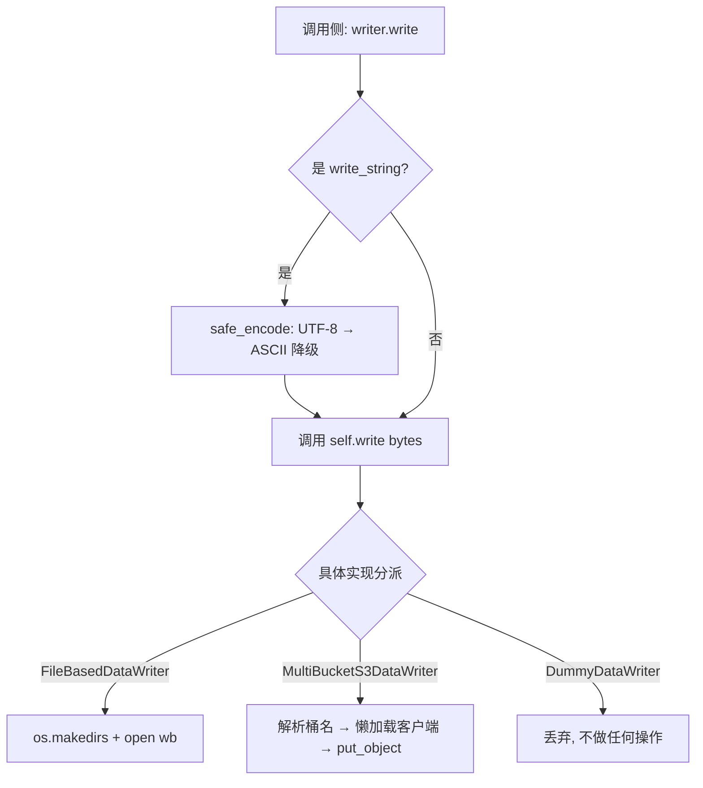
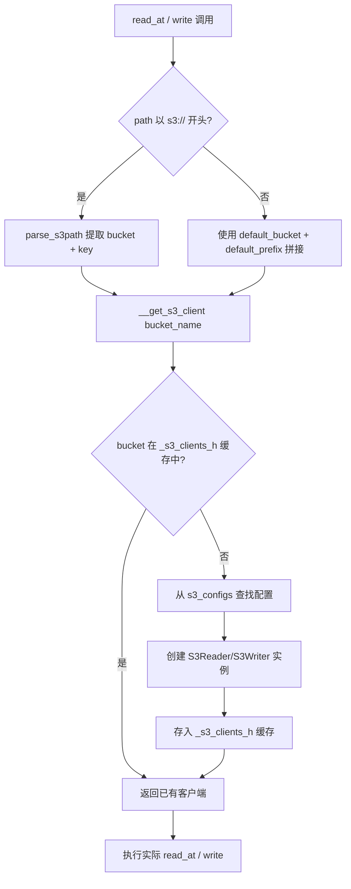
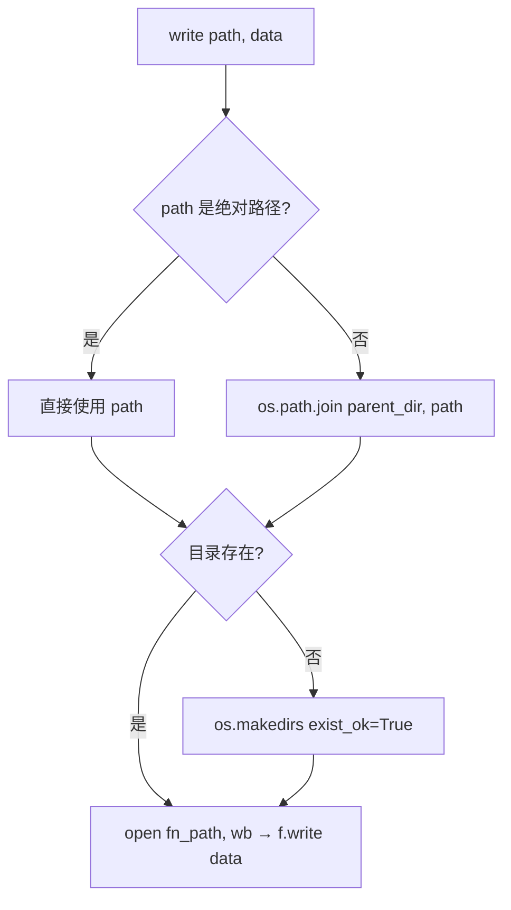

# PD-350.01 MinerU — DataReader/DataWriter 双层抽象存储解耦

> 文档编号：PD-350.01
> 来源：MinerU `mineru/data/data_reader_writer/`
> GitHub：https://github.com/opendatalab/MinerU.git
> 问题域：PD-350 存储抽象层 Storage Abstraction
> 状态：可复用方案

---

## 第 1 章 问题与动机

### 1.1 核心问题

文档解析系统（如 PDF → Markdown 转换）在处理流水线中会产生大量中间产物：提取的图片、中间 JSON、模型输出、最终 Markdown 等。这些产物需要写入存储，但存储后端因部署环境不同而差异巨大：

- **本地开发**：直接写本地文件系统
- **云端生产**：写 S3 兼容对象存储（AWS S3、MinIO、阿里云 OSS 等）
- **多租户场景**：不同租户的数据分布在不同 S3 桶中
- **测试/Dry-run**：不需要实际写入，丢弃即可

如果处理逻辑直接耦合存储 API（`open()` vs `boto3.put_object()`），每换一个存储后端就要改动所有写入点。MinerU 的 PDF 解析流水线有 pipeline、VLM、hybrid 三种后端，每种都有图片写入和结果写入两个写入点，共 6+ 处写入调用。硬编码存储 API 会导致维护成本随后端数量线性增长。

### 1.2 MinerU 的解法概述

MinerU 采用**双层抽象**架构解决存储解耦问题：

1. **IO 层**（`mineru/data/io/base.py:4-42`）：定义 `IOReader`/`IOWriter` 最底层读写接口，S3 实现直接封装 boto3 客户端
2. **DataReaderWriter 层**（`mineru/data/data_reader_writer/base.py:5-63`）：定义 `DataReader`/`DataWriter` 业务级抽象，增加 `write_string()` 编码安全处理、`read_at()` 偏移量读取
3. **四种实现**：`FileBasedDataReader/Writer`（本地）、`S3DataReader/Writer`（单桶 S3）、`MultiBucketS3DataReader/Writer`（多桶 S3）、`DummyDataWriter`（空操作）
4. **Mixin 复用**：`MultiS3Mixin` 提取多桶配置校验和懒加载客户端池的公共逻辑，Reader/Writer 通过多继承复用
5. **调用侧零感知**：流水线函数只依赖 `DataWriter` 抽象类型（`mineru/backend/vlm/vlm_analyze.py:224`），构造时注入具体实现

### 1.3 设计思想

| 设计原则 | 具体实现 | 理由 | 替代方案 |
|----------|----------|------|----------|
| 依赖倒置 | 流水线函数参数类型为 `DataWriter`，不引用具体实现 | 新增存储后端无需改动处理逻辑 | 工厂模式 + 字符串配置 |
| 双层抽象 | IO 层处理协议细节，Data 层处理业务语义（编码、路径拼接） | 职责分离，S3 重试配置不污染业务层 | 单层抽象 + 装饰器 |
| Mixin 复用 | `MultiS3Mixin` 封装桶配置校验 + 客户端懒加载 | Reader/Writer 共享相同的多桶管理逻辑 | 组合模式（持有共享管理器） |
| 懒加载客户端 | `_s3_clients_h` 字典按需创建 S3 客户端 | 避免初始化时连接所有桶，降低启动开销 | 预创建所有客户端 |
| 编码安全降级 | `write_string()` 先尝试 UTF-8，失败回退 ASCII（errors='replace'） | 处理非标准编码的 PDF 提取文本 | 强制 UTF-8 + 异常抛出 |

---

## 第 2 章 源码实现分析

### 2.1 架构概览

MinerU 的存储抽象分为两层，IO 层和 DataReaderWriter 层，通过继承关系组合：

```
┌─────────────────────────────────────────────────────────┐
│                    调用侧（流水线）                        │
│  vlm_analyze.py / common.py / hybrid_analyze.py         │
│  参数类型: DataWriter / DataReader                       │
└──────────────┬──────────────────────────────┬───────────┘
               │                              │
    ┌──────────▼──────────┐       ┌───────────▼───────────┐
    │   DataReader (ABC)  │       │   DataWriter (ABC)    │
    │  base.py:5          │       │  base.py:33           │
    │  + read(path)       │       │  + write(path, data)  │
    │  + read_at(offset)  │       │  + write_string(path) │
    └──────┬──────────────┘       └──────┬────────────────┘
           │                             │
    ┌──────┼──────────┐           ┌──────┼──────────┐
    │      │          │           │      │          │
    ▼      ▼          ▼           ▼      ▼          ▼
 FileBased MultiBucket Dummy   FileBased MultiBucket
 Reader    S3Reader   (N/A)   Writer    S3Writer   DummyWriter
    │         │                   │         │
    │    ┌────┴────┐              │    ┌────┴────┐
    │    │ S3Reader│              │    │S3Writer │
    │    │(单桶简化)│              │    │(单桶简化)│
    │    └─────────┘              │    └─────────┘
    │         │                   │         │
    │    MultiS3Mixin             │    MultiS3Mixin
    │    (桶配置校验+懒加载)        │    (桶配置校验+懒加载)
    │         │                   │         │
    │    ┌────▼────┐              │    ┌────▼────┐
    │    │IOReader │              │    │IOWriter │
    │    │(ABC)    │              │    │(ABC)    │
    │    └────┬────┘              │    └────┬────┘
    │         │                   │         │
    │    S3Reader(io)             │    S3Writer(io)
    │    boto3 客户端              │    boto3 客户端
    └─────────────────────────────┘
```

### 2.2 核心实现

#### 2.2.1 DataReader/DataWriter 抽象基类



对应源码 `mineru/data/data_reader_writer/base.py:33-63`：

```python
class DataWriter(ABC):
    @abstractmethod
    def write(self, path: str, data: bytes) -> None:
        pass

    def write_string(self, path: str, data: str) -> None:
        def safe_encode(data: str, method: str):
            try:
                bit_data = data.encode(encoding=method, errors='replace')
                return bit_data, True
            except:  # noqa
                return None, False

        for method in ['utf-8', 'ascii']:
            bit_data, flag = safe_encode(data, method)
            if flag:
                self.write(path, bit_data)
                break
```

关键设计点：`write_string()` 是模板方法，在抽象基类中实现编码安全逻辑，子类只需实现 `write()` 即可自动获得字符串写入能力。`errors='replace'` 确保即使遇到无法编码的字符也不会抛异常，用替代字符代替。

#### 2.2.2 MultiBucketS3 多桶路由与懒加载



对应源码 `mineru/data/data_reader_writer/multi_bucket_s3.py:50-107`：

```python
class MultiBucketS3DataReader(DataReader, MultiS3Mixin):
    def read_at(self, path: str, offset: int = 0, limit: int = -1) -> bytes:
        if path.startswith('s3://'):
            bucket_name, path = parse_s3path(path)
            s3_reader = self.__get_s3_client(bucket_name)
        else:
            s3_reader = self.__get_s3_client(self.default_bucket)
            if self.default_prefix:
                path = self.default_prefix + '/' + path
        return s3_reader.read_at(path, offset, limit)

    def __get_s3_client(self, bucket_name: str):
        if bucket_name not in set([conf.bucket_name for conf in self.s3_configs]):
            raise InvalidParams(
                f'bucket name: {bucket_name} not found in s3_configs: {self.s3_configs}'
            )
        if bucket_name not in self._s3_clients_h:
            conf = next(
                filter(lambda conf: conf.bucket_name == bucket_name, self.s3_configs)
            )
            self._s3_clients_h[bucket_name] = S3Reader(
                bucket_name, conf.access_key, conf.secret_key,
                conf.endpoint_url, conf.addressing_style,
            )
        return self._s3_clients_h[bucket_name]
```

#### 2.2.3 FileBasedDataWriter 本地文件实现



对应源码 `mineru/data/data_reader_writer/filebase.py:38-62`：

```python
class FileBasedDataWriter(DataWriter):
    def __init__(self, parent_dir: str = '') -> None:
        self._parent_dir = parent_dir

    def write(self, path: str, data: bytes) -> None:
        fn_path = path
        if not os.path.isabs(fn_path) and len(self._parent_dir) > 0:
            fn_path = os.path.join(self._parent_dir, path)
        if not os.path.exists(os.path.dirname(fn_path)) and os.path.dirname(fn_path) != "":
            os.makedirs(os.path.dirname(fn_path), exist_ok=True)
        with open(fn_path, 'wb') as f:
            f.write(data)
```

### 2.3 实现细节

**S3 Range Read 支持**（`multi_bucket_s3.py:51-68`）：`MultiBucketS3DataReader.read()` 解析 URL 中的 `?bytes=offset,limit` 参数，支持 HTTP Range 风格的部分读取。这对大文件（如 PDF 页面图片）的按需加载至关重要。

**S3 IO 层重试配置**（`mineru/data/io/s3.py:34-37`）：底层 boto3 客户端配置了 `retries={'max_attempts': 5, 'mode': 'standard'}`，在 IO 层统一处理网络抖动，上层无需关心。

**Pydantic 配置校验**（`mineru/data/utils/schemas.py:6-13`）：`S3Config` 使用 Pydantic BaseModel，所有字段设置 `min_length=1`，在构造时即校验配置完整性，避免运行时空字符串导致的 boto3 错误。

**MultiS3Mixin 初始化校验**（`multi_bucket_s3.py:10-47`）：三重校验——默认前缀非空、默认桶配置存在、桶名唯一。Fail-fast 设计，配置错误在初始化时立即暴露。

**调用侧注入模式**（`mineru/cli/common.py:203`）：
```python
image_writer, md_writer = FileBasedDataWriter(local_image_dir), FileBasedDataWriter(local_md_dir)
```
在流水线入口处构造具体实现，传入处理函数。处理函数（如 `vlm_doc_analyze`）的参数类型声明为 `DataWriter | None`（`vlm_analyze.py:224`），实现了依赖倒置。


---

## 第 3 章 迁移指南

### 3.1 迁移清单

**阶段 1：定义抽象接口**

- [ ] 创建 `StorageReader` / `StorageWriter` ABC，定义 `read(path) -> bytes`、`write(path, data)` 核心方法
- [ ] 在 Writer 基类中实现 `write_string()` 模板方法（含编码降级逻辑）
- [ ] 在 Reader 基类中实现 `read()` 委托到 `read_at()` 的默认行为

**阶段 2：实现本地文件后端**

- [ ] 实现 `LocalStorageReader`：支持 `parent_dir` + 相对路径拼接
- [ ] 实现 `LocalStorageWriter`：自动创建目录 + 二进制写入

**阶段 3：实现 S3 后端（按需）**

- [ ] 定义 `S3Config` Pydantic 模型（bucket、ak、sk、endpoint、addressing_style）
- [ ] 实现底层 `S3IOReader`/`S3IOWriter`（封装 boto3，配置重试策略）
- [ ] 实现 `MultiBucketS3Reader`/`Writer`（Mixin 模式，懒加载客户端池）
- [ ] 实现 `SingleBucketS3Reader`/`Writer`（继承多桶实现，简化构造参数）

**阶段 4：替换调用侧**

- [ ] 将所有 `open()`/`boto3` 直接调用替换为 `StorageWriter.write()`
- [ ] 函数参数类型改为 `StorageWriter`，在入口处注入具体实现

### 3.2 适配代码模板

以下是可直接复用的最小存储抽象实现：

```python
from abc import ABC, abstractmethod
from typing import Optional
import os

# ---- 抽象层 ----

class StorageReader(ABC):
    def read(self, path: str) -> bytes:
        return self.read_at(path)

    @abstractmethod
    def read_at(self, path: str, offset: int = 0, limit: int = -1) -> bytes:
        pass


class StorageWriter(ABC):
    @abstractmethod
    def write(self, path: str, data: bytes) -> None:
        pass

    def write_string(self, path: str, data: str) -> None:
        for encoding in ['utf-8', 'ascii']:
            try:
                self.write(path, data.encode(encoding=encoding, errors='replace'))
                return
            except Exception:
                continue


# ---- 本地文件实现 ----

class LocalReader(StorageReader):
    def __init__(self, base_dir: str = ''):
        self._base_dir = base_dir

    def read_at(self, path: str, offset: int = 0, limit: int = -1) -> bytes:
        full_path = path if os.path.isabs(path) else os.path.join(self._base_dir, path)
        with open(full_path, 'rb') as f:
            f.seek(offset)
            return f.read() if limit == -1 else f.read(limit)


class LocalWriter(StorageWriter):
    def __init__(self, base_dir: str = ''):
        self._base_dir = base_dir

    def write(self, path: str, data: bytes) -> None:
        full_path = path if os.path.isabs(path) else os.path.join(self._base_dir, path)
        os.makedirs(os.path.dirname(full_path) or '.', exist_ok=True)
        with open(full_path, 'wb') as f:
            f.write(data)


# ---- Dummy 实现（测试/Dry-run）----

class DummyWriter(StorageWriter):
    def write(self, path: str, data: bytes) -> None:
        pass


# ---- 使用示例 ----

def process_document(input_bytes: bytes, writer: StorageWriter) -> None:
    """处理逻辑只依赖 StorageWriter 抽象"""
    result = do_some_processing(input_bytes)
    writer.write("output/result.json", result)
    writer.write_string("output/summary.md", "# Summary\n...")

# 本地开发
process_document(pdf_bytes, LocalWriter("/tmp/output"))
# 测试模式
process_document(pdf_bytes, DummyWriter())
# S3 生产环境（需自行实现 S3Writer）
# process_document(pdf_bytes, S3Writer(config))
```

### 3.3 适用场景

| 场景 | 适用度 | 说明 |
|------|--------|------|
| 文档处理流水线（PDF/图片/音视频） | ⭐⭐⭐ | 多种中间产物需要写入，完美匹配 |
| ETL 数据管道 | ⭐⭐⭐ | 数据源和目标存储多变，抽象层价值高 |
| ML 训练/推理产物管理 | ⭐⭐⭐ | 模型文件、checkpoint、日志需要跨存储 |
| 单一存储的简单 CRUD 应用 | ⭐ | 过度设计，直接用 ORM/SDK 即可 |
| 需要事务性写入的场景 | ⭐ | 该抽象不支持事务，需额外封装 |
| 多云/混合云部署 | ⭐⭐⭐ | 多桶 S3 + 本地混合正是核心场景 |

---

## 第 4 章 测试用例

```python
import os
import tempfile
import pytest
from unittest.mock import MagicMock, patch


# ---- 测试 DataWriter 基类编码降级 ----

class ConcreteWriter:
    """模拟 DataWriter 的 write_string 逻辑"""
    def __init__(self):
        self.written = []

    def write(self, path: str, data: bytes) -> None:
        self.written.append((path, data))

    def write_string(self, path: str, data: str) -> None:
        def safe_encode(data: str, method: str):
            try:
                bit_data = data.encode(encoding=method, errors='replace')
                return bit_data, True
            except:
                return None, False
        for method in ['utf-8', 'ascii']:
            bit_data, flag = safe_encode(data, method)
            if flag:
                self.write(path, bit_data)
                break


class TestWriteStringEncoding:
    def test_utf8_normal(self):
        w = ConcreteWriter()
        w.write_string("test.md", "Hello 你好")
        assert len(w.written) == 1
        assert w.written[0][1] == "Hello 你好".encode('utf-8')

    def test_ascii_with_replace(self):
        w = ConcreteWriter()
        w.write_string("test.txt", "café")
        # UTF-8 优先成功，不会走到 ASCII
        assert w.written[0][1] == "café".encode('utf-8')

    def test_empty_string(self):
        w = ConcreteWriter()
        w.write_string("empty.txt", "")
        assert w.written[0][1] == b""


# ---- 测试 FileBasedDataWriter ----

class TestFileBasedDataWriter:
    def test_write_creates_directory(self):
        with tempfile.TemporaryDirectory() as tmpdir:
            writer = type('W', (), {
                '_parent_dir': tmpdir,
                'write': lambda self, path, data: self._do_write(path, data),
                '_do_write': lambda self, path, data: _file_write(tmpdir, path, data),
            })()
            target = os.path.join(tmpdir, "sub", "dir", "test.bin")
            os.makedirs(os.path.dirname(target), exist_ok=True)
            with open(target, 'wb') as f:
                f.write(b"hello")
            assert os.path.exists(target)
            assert open(target, 'rb').read() == b"hello"

    def test_write_absolute_path_ignores_parent(self):
        with tempfile.TemporaryDirectory() as tmpdir:
            abs_path = os.path.join(tmpdir, "absolute.bin")
            with open(abs_path, 'wb') as f:
                f.write(b"data")
            assert open(abs_path, 'rb').read() == b"data"

    def test_read_at_with_offset_and_limit(self):
        with tempfile.TemporaryDirectory() as tmpdir:
            path = os.path.join(tmpdir, "data.bin")
            with open(path, 'wb') as f:
                f.write(b"0123456789")
            with open(path, 'rb') as f:
                f.seek(3)
                result = f.read(4)
            assert result == b"3456"


# ---- 测试 MultiS3Mixin 配置校验 ----

class TestMultiS3MixinValidation:
    def test_empty_prefix_raises(self):
        """default_prefix 为空应抛出 InvalidConfig"""
        # 模拟 MultiS3Mixin.__init__ 的校验逻辑
        default_prefix = ""
        assert len(default_prefix) == 0  # 会触发 InvalidConfig

    def test_missing_default_bucket_raises(self):
        """默认桶不在配置列表中应抛出 InvalidConfig"""
        default_prefix = "my-bucket/prefix"
        arr = default_prefix.strip('/').split('/')
        default_bucket = arr[0]
        configs_buckets = ["other-bucket"]
        assert default_bucket not in configs_buckets  # 会触发 InvalidConfig

    def test_duplicate_bucket_raises(self):
        """桶名重复应抛出 InvalidConfig"""
        bucket_names = ["bucket-a", "bucket-a", "bucket-b"]
        assert len(set(bucket_names)) != len(bucket_names)  # 会触发 InvalidConfig


# ---- 测试 S3 路径解析 ----

class TestS3PathParsing:
    def test_parse_s3path_normal(self):
        path = "s3://my-bucket/path/to/file.pdf"
        prefix, rest = path.split('://', 1)
        bucket, key = rest.split('/', 1)
        assert bucket == "my-bucket"
        assert key == "path/to/file.pdf"

    def test_parse_range_params(self):
        path = "s3://bucket/file.json?bytes=0,81350"
        arr = path.split("?bytes=")
        assert len(arr) == 2
        params = arr[1].split(",")
        assert params == ["0", "81350"]

    def test_remove_non_official_args(self):
        path = "s3://bucket/file.json?bytes=0,100"
        clean = path.split("?")[0]
        assert clean == "s3://bucket/file.json"
```


---

## 第 5 章 跨域关联

| 关联域 | 关系类型 | 说明 |
|--------|----------|------|
| PD-03 容错与重试 | 协同 | S3 IO 层内置 boto3 重试策略（max_attempts=5, mode=standard），存储抽象层的容错能力依赖底层 IO 的重试配置 |
| PD-04 工具系统 | 协同 | 存储抽象可作为工具系统的基础设施，MCP 工具读写文件时可通过 DataReader/DataWriter 接口透明访问不同存储 |
| PD-05 沙箱隔离 | 依赖 | `FileBasedDataWriter` 的 `parent_dir` 机制天然支持目录级隔离，可作为沙箱文件系统的写入层 |
| PD-11 可观测性 | 协同 | 可在 DataWriter 抽象层增加装饰器，统计写入次数、字节数、延迟等指标，实现存储操作的可观测性 |

---

## 第 6 章 来源文件索引

| 文件 | 行范围 | 关键实现 |
|------|--------|----------|
| `mineru/data/data_reader_writer/base.py` | L1-63 | DataReader/DataWriter ABC 定义，write_string 编码降级 |
| `mineru/data/data_reader_writer/filebase.py` | L1-63 | FileBasedDataReader/Writer 本地文件实现 |
| `mineru/data/data_reader_writer/multi_bucket_s3.py` | L1-144 | MultiS3Mixin + MultiBucketS3DataReader/Writer 多桶路由 |
| `mineru/data/data_reader_writer/s3.py` | L1-72 | S3DataReader/Writer 单桶简化封装 |
| `mineru/data/data_reader_writer/dummy.py` | L1-11 | DummyDataWriter 空操作实现 |
| `mineru/data/data_reader_writer/__init__.py` | L1-17 | 模块导出，9 个公开类 |
| `mineru/data/io/base.py` | L1-42 | IOReader/IOWriter 底层 IO 抽象 |
| `mineru/data/io/s3.py` | L1-114 | S3Reader/S3Writer boto3 封装，含重试配置 |
| `mineru/data/utils/schemas.py` | L6-13 | S3Config Pydantic 模型 |
| `mineru/data/utils/path_utils.py` | L1-33 | S3 路径解析与 Range 参数提取 |
| `mineru/data/utils/exceptions.py` | L1-40 | InvalidConfig/InvalidParams 异常定义 |
| `mineru/cli/common.py` | L203 | 流水线入口处构造 FileBasedDataWriter 注入 |
| `mineru/backend/vlm/vlm_analyze.py` | L224 | VLM 分析函数参数类型 DataWriter |

---

## 第 7 章 横向对比维度

```json comparison_data
{
  "project": "MinerU",
  "dimensions": {
    "抽象层级": "双层抽象：IO层(boto3封装) + Data层(业务语义)",
    "后端种类": "4种：本地文件、单桶S3、多桶S3、Dummy空操作",
    "路径策略": "parent_dir前缀拼接 + S3 URI自动解析 + Range参数",
    "客户端管理": "Mixin懒加载客户端池，按桶名缓存boto3 client",
    "配置校验": "Pydantic BaseModel + Mixin三重Fail-fast校验",
    "编码安全": "write_string模板方法UTF-8→ASCII降级，errors=replace"
  }
}
```

### 域元数据补充

```json domain_metadata
{
  "solution_summary": "MinerU用DataReader/DataWriter双层ABC抽象+MultiS3Mixin懒加载客户端池，实现本地/单桶S3/多桶S3/Dummy四种存储后端透明切换",
  "description": "存储抽象需要处理客户端生命周期管理与多后端路由",
  "sub_problems": [
    "S3客户端懒加载与连接池管理",
    "Dummy/空操作后端用于测试与Dry-run",
    "S3 Range Read部分读取支持"
  ],
  "best_practices": [
    "Mixin模式复用多桶配置校验与客户端池逻辑",
    "write_string模板方法在基类实现编码降级",
    "Pydantic模型校验S3配置完整性（min_length=1）",
    "IO层统一配置boto3重试策略（max_attempts=5）"
  ]
}
```

