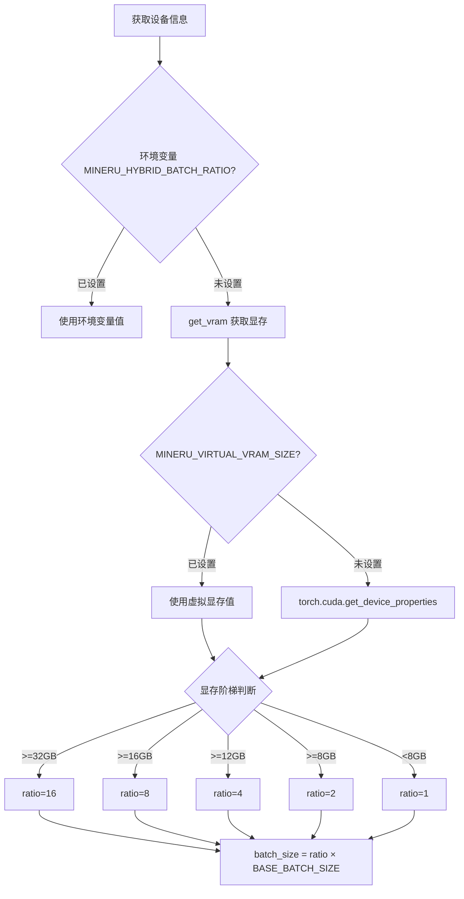
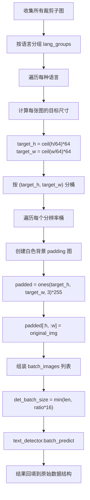
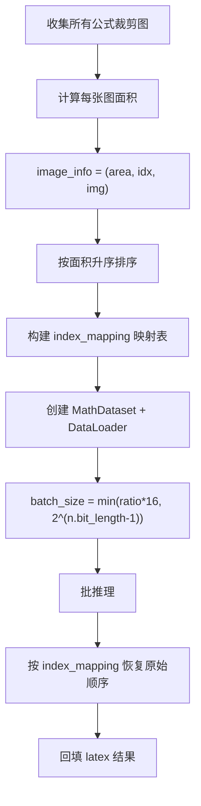
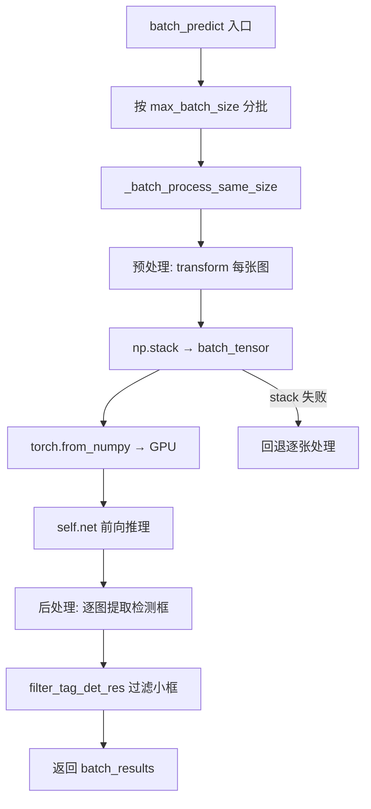

# PD-351.01 MinerU — 分辨率分组智能批处理与显存感知调度

> 文档编号：PD-351.01
> 来源：MinerU `mineru/backend/pipeline/batch_analyze.py`, `mineru/backend/hybrid/hybrid_analyze.py`
> GitHub：https://github.com/opendatalab/MinerU.git
> 问题域：PD-351 批处理优化 Batch Processing Optimization
> 状态：可复用方案

---

## 第 1 章 问题与动机

### 1.1 核心问题

文档 AI 处理管线（OCR 检测、公式识别、版面分析、表格识别）需要对大量裁剪后的子图进行模型推理。这些子图来自不同页面的不同区域，尺寸差异极大——一个标题区域可能只有 200×50 像素，而一个全页表格可能是 2000×3000 像素。

GPU 批推理要求同一 batch 内的张量形状一致。朴素做法是逐张推理（batch_size=1），这会导致 GPU 利用率极低——大量时间浪费在 kernel launch 和数据传输上，而非实际计算。简单地将所有图片 resize 到统一尺寸又会损失检测精度。

核心矛盾：**变尺寸输入 vs GPU 批推理的等形状要求**，同时还要兼顾不同 GPU 显存容量的适配。

### 1.2 MinerU 的解法概述

MinerU 实现了一套多层次的批处理优化体系：

1. **分辨率分组 + Padding 对齐**：按 stride=64 将裁剪图像分组到相同目标尺寸桶中，组内白色 padding 对齐后批推理（`batch_analyze.py:284-310`）
2. **显存感知 batch_ratio 推断**：根据 GPU 总显存自动推断 batch_ratio 倍率（1-16x），乘以各模型的 BASE_BATCH_SIZE 得到实际 batch_size（`pipeline_analyze.py:179-188`，`hybrid_analyze.py:323-366`）
3. **面积排序优化**：公式识别（MFR）阶段按裁剪图面积排序后再分批，减少 padding 浪费（`Unimernet.py:166-168`）
4. **分阶段显存回收**：在管线各阶段间插入 `clean_vram` 调用，低显存设备（≤8GB）主动释放缓存（`model_utils.py:441-447`）
5. **环境变量覆盖**：支持 `MINERU_HYBRID_BATCH_RATIO` 和 `MINERU_VIRTUAL_VRAM_SIZE` 手动指定，适配 C/S 分离部署场景（`hybrid_analyze.py:328-346`，`model_utils.py:451-464`）

### 1.3 设计思想

| 设计原则 | 具体实现 | 理由 | 替代方案 |
|----------|----------|------|----------|
| 分组而非 resize | stride=64 分辨率桶 + 白色 padding | 保留原始分辨率信息，不损失检测精度 | 统一 resize（损失精度）、逐张推理（低效） |
| 显存驱动 batch | 阶梯式 VRAM→ratio 映射表 | 不同 GPU 显存差异巨大（4GB~80GB），固定 batch_size 要么 OOM 要么浪费 | 动态显存监控（实现复杂）、固定 batch_size（不通用） |
| 模型级 base_size | 每个模型有独立 BASE_BATCH_SIZE | 不同模型显存占用差异大：MFR=16, OCR_DET=16, LAYOUT=1 | 全局统一 batch_size（不合理） |
| 面积排序减少 padding | MFR 按公式面积排序后分批 | 相近面积的公式图片 padding 浪费最小 | 随机分批（padding 浪费大） |
| 阶段间显存回收 | clean_vram 在低显存设备主动 GC | 管线多阶段串行，前阶段缓存对后阶段无用 | 不回收（低显存 OOM）、每步都回收（高显存浪费时间） |

---

## 第 2 章 源码实现分析

### 2.1 架构概览

MinerU 的批处理体系贯穿整个文档处理管线，从页面级到子图级分层优化：

```
┌─────────────────────────────────────────────────────────────────┐
│                    doc_analyze (入口)                            │
│  pipeline_analyze.py:70 / hybrid_analyze.py:384                 │
├─────────────────────────────────────────────────────────────────┤
│  1. 页面级批处理                                                 │
│     ┌──────────┐  ┌──────────┐  ┌──────────┐                   │
│     │ Page 1   │  │ Page 2   │  │ Page N   │                   │
│     └────┬─────┘  └────┬─────┘  └────┬─────┘                   │
│          └──────────────┼──────────────┘                        │
│                         ▼                                       │
│  2. 模型级批推理 (batch_ratio × BASE_BATCH_SIZE)                │
│     ┌─────────────┐  ┌─────────────┐  ┌─────────────┐         │
│     │ Layout YOLO │  │ MFD (公式检测)│  │ MFR (公式识别)│         │
│     │ base=1      │  │ base=1      │  │ base=16     │         │
│     └──────┬──────┘  └──────┬──────┘  └──────┬──────┘         │
│            ▼                ▼                 ▼                 │
│  3. 子图级分辨率分组批处理 (OCR-det)                              │
│     ┌──────────────────────────────────────┐                   │
│     │ 按 stride=64 分组 → padding → batch  │                   │
│     │ resolution_groups[(H,W)] → [imgs]    │                   │
│     └──────────────────────────────────────┘                   │
│            ▼                                                    │
│  4. 语言分组 OCR-rec                                            │
│     ┌──────────┐  ┌──────────┐                                 │
│     │ lang=ch  │  │ lang=en  │                                 │
│     └──────────┘  └──────────┘                                 │
└─────────────────────────────────────────────────────────────────┘
```

### 2.2 核心实现

#### 2.2.1 显存感知 batch_ratio 推断



对应源码 `mineru/backend/hybrid/hybrid_analyze.py:323-366`：

```python
def get_batch_ratio(device):
    """根据显存大小或环境变量获取 batch ratio"""
    # 1. 优先尝试从环境变量获取
    env_val = os.getenv("MINERU_HYBRID_BATCH_RATIO")
    if env_val:
        try:
            batch_ratio = int(env_val)
            logger.info(f"hybrid batch ratio (from env): {batch_ratio}")
            return batch_ratio
        except ValueError as e:
            logger.warning(f"Invalid MINERU_HYBRID_BATCH_RATIO value: {env_val}, "
                           f"switching to auto mode. Error: {e}")

    # 2. 根据显存自动推断
    gpu_memory = get_vram(device)
    if gpu_memory >= 32:
        batch_ratio = 16
    elif gpu_memory >= 16:
        batch_ratio = 8
    elif gpu_memory >= 12:
        batch_ratio = 4
    elif gpu_memory >= 8:
        batch_ratio = 2
    else:
        batch_ratio = 1

    logger.info(f"hybrid batch ratio (auto, vram={gpu_memory}GB): {batch_ratio}")
    return batch_ratio
```

Pipeline 模式的阶梯略有不同（`pipeline_analyze.py:179-188`），阈值更低：

```python
gpu_memory = get_vram(device)
if gpu_memory >= 16:
    batch_ratio = 16
elif gpu_memory >= 12:
    batch_ratio = 8
elif gpu_memory >= 8:
    batch_ratio = 4
elif gpu_memory >= 6:
    batch_ratio = 2
else:
    batch_ratio = 1
```

两套阈值的差异源于 Hybrid 模式额外加载了 VLM 推理框架（如 vllm），需要预留更多显存。

#### 2.2.2 分辨率分组 + Padding 对齐批处理



对应源码 `mineru/backend/pipeline/batch_analyze.py:282-310`：

```python
# 按分辨率分组并同时完成padding
RESOLUTION_GROUP_STRIDE = 64

resolution_groups = defaultdict(list)
for crop_info in lang_crop_list:
    cropped_img = crop_info[0]
    h, w = cropped_img.shape[:2]
    # 直接计算目标尺寸并用作分组键
    target_h = ((h + RESOLUTION_GROUP_STRIDE - 1) // RESOLUTION_GROUP_STRIDE) * RESOLUTION_GROUP_STRIDE
    target_w = ((w + RESOLUTION_GROUP_STRIDE - 1) // RESOLUTION_GROUP_STRIDE) * RESOLUTION_GROUP_STRIDE
    group_key = (target_h, target_w)
    resolution_groups[group_key].append(crop_info)

# 对每个分辨率组进行批处理
for (target_h, target_w), group_crops in tqdm(resolution_groups.items(), desc=f"OCR-det {lang}"):
    batch_images = []
    for crop_info in group_crops:
        img = crop_info[0]
        h, w = img.shape[:2]
        padded_img = np.ones((target_h, target_w, 3), dtype=np.uint8) * 255
        padded_img[:h, :w] = img
        batch_images.append(padded_img)

    det_batch_size = min(len(batch_images), self.batch_ratio * OCR_DET_BASE_BATCH_SIZE)
    batch_results = ocr_model.text_detector.batch_predict(batch_images, det_batch_size)
```


#### 2.2.3 面积排序优化（MFR 公式识别）



对应源码 `mineru/model/mfr/unimernet/Unimernet.py:165-207`：

```python
# Stable sort by area
image_info.sort(key=lambda x: x[0])  # sort by area
sorted_indices = [x[1] for x in image_info]
sorted_images = [x[2] for x in image_info]

# Create mapping for results
index_mapping = {new_idx: old_idx for new_idx, old_idx in enumerate(sorted_indices)}

# Create dataset with sorted images
dataset = MathDataset(sorted_images, transform=self.model.transform)

# 如果batch_size > len(sorted_images)，则设置为不超过len(sorted_images)的2的幂
batch_size = min(batch_size, max(1, 2 ** (len(sorted_images).bit_length() - 1))) if sorted_images else 1

dataloader = DataLoader(dataset, batch_size=batch_size, num_workers=0)
```

这里 `2 ** (n.bit_length() - 1)` 是一个巧妙的技巧：将 batch_size 限制为不超过样本数的最大 2 的幂，避免最后一个 batch 过小导致 GPU 利用率骤降。

#### 2.2.4 TextDetector 批推理实现



对应源码 `mineru/model/utils/tools/infer/predict_det.py:123-218`：

```python
def _batch_process_same_size(self, img_list):
    """对相同尺寸的图像进行批处理"""
    # 预处理所有图像
    batch_data = []
    batch_shapes = []
    for img in img_list:
        data = {'image': img}
        data = transform(data, self.preprocess_op)
        if data is None:
            return [(None, 0) for _ in img_list], 0
        img_processed, shape_list = data
        batch_data.append(img_processed)
        batch_shapes.append(shape_list)

    # 堆叠成批处理张量
    try:
        batch_tensor = np.stack(batch_data, axis=0)
        batch_shapes = np.stack(batch_shapes, axis=0)
    except Exception as e:
        # 如果堆叠失败，回退到逐个处理
        batch_results = []
        for img in img_list:
            dt_boxes, elapse = self.__call__(img)
            batch_results.append((dt_boxes, elapse))
        return batch_results, time.time() - starttime

    # 批处理推理
    with torch.no_grad():
        inp = torch.from_numpy(batch_tensor).to(self.device)
        outputs = self.net(inp)
```

关键设计：`np.stack` 失败时自动回退到逐张处理，保证鲁棒性。

### 2.3 实现细节

**多设备适配的显存获取**（`model_utils.py:450-486`）：

MinerU 支持 7 种计算设备：CUDA、NPU（华为昇腾）、MPS（Apple Silicon）、GCU（燧原）、MUSA（摩尔线程）、MLU（寒武纪）、SDAA（天数智芯）。`get_vram` 函数通过 `str(device).startswith()` 分发到各厂商的 API 获取显存，并支持 `MINERU_VIRTUAL_VRAM_SIZE` 环境变量覆盖——这对容器化部署和 GPU 共享场景至关重要。

**分阶段显存回收**（`batch_analyze.py:74`，`batch_analyze.py:191`）：

```python
clean_vram(self.model.device, vram_threshold=8)
```

仅在总显存 ≤ 8GB 时触发 `torch.cuda.empty_cache()` + `gc.collect()`，避免高显存设备浪费时间在不必要的 GC 上。回收点精确插入在公式识别完成后、表格识别开始前，以及表格 OCR 完成后、表格结构识别开始前。

**模型级 BASE_BATCH_SIZE 常量**（`batch_analyze.py:17-22`）：

```python
YOLO_LAYOUT_BASE_BATCH_SIZE = 1
MFD_BASE_BATCH_SIZE = 1
MFR_BASE_BATCH_SIZE = 16
OCR_DET_BASE_BATCH_SIZE = 16
TABLE_ORI_CLS_BATCH_SIZE = 16
TABLE_Wired_Wireless_CLS_BATCH_SIZE = 16
```

Layout 和 MFD 使用 YOLO 模型，单张推理已经很快（GPU kernel 利用率高），base=1 即可；MFR 和 OCR 是轻量级模型，需要更大 batch 才能充分利用 GPU。

**PyTorch 版本兼容性**（`pipeline_analyze.py:197-204`）：

```python
if (version.parse(torch.__version__) >= version.parse("2.8.0")
        or str(device).startswith('mps')
        or device_type.lower() in ["corex"]):
    enable_ocr_det_batch = False
else:
    enable_ocr_det_batch = True
```

PyTorch 2.8+ 的某些变更导致 OCR 检测批处理不兼容，MinerU 通过版本检测自动降级为逐张处理模式，MPS 和 CoreX 设备同理。

---

## 第 3 章 迁移指南

### 3.1 迁移清单

**阶段 1：分辨率分组批处理（核心，1-2 天）**
- [ ] 实现 `resolution_group_batch_predict` 函数：按 stride 分组 → padding → 批推理
- [ ] 选择合适的 RESOLUTION_GROUP_STRIDE（推荐 32 或 64，需与模型输入对齐）
- [ ] 实现白色背景 padding（`np.ones * 255`）

**阶段 2：显存感知调度（推荐，0.5 天）**
- [ ] 实现 `get_batch_ratio` 函数：环境变量优先 → 显存自动推断
- [ ] 定义各模型的 BASE_BATCH_SIZE 常量
- [ ] 实际 batch_size = ratio × base

**阶段 3：面积排序优化（可选，0.5 天）**
- [ ] 对变尺寸输入按面积排序后分批
- [ ] 维护 index_mapping 恢复原始顺序

**阶段 4：显存回收与降级（可选，0.5 天）**
- [ ] 在管线阶段间插入条件性 `clean_vram`
- [ ] 实现 `np.stack` 失败时的逐张处理回退

### 3.2 适配代码模板

```python
"""分辨率分组批处理 — 可直接复用的代码模板"""
import numpy as np
from collections import defaultdict
from typing import List, Tuple, Any, Callable

def get_batch_ratio(device: str, env_var: str = "BATCH_RATIO") -> int:
    """显存感知 batch_ratio 推断"""
    import os
    env_val = os.getenv(env_var)
    if env_val:
        return int(env_val)

    try:
        import torch
        if torch.cuda.is_available() and device.startswith("cuda"):
            vram_gb = round(torch.cuda.get_device_properties(device).total_memory / (1024**3))
        else:
            vram_gb = 1
    except ImportError:
        vram_gb = 1

    thresholds = [(32, 16), (16, 8), (12, 4), (8, 2)]
    for threshold, ratio in thresholds:
        if vram_gb >= threshold:
            return ratio
    return 1


def resolution_group_batch_predict(
    images: List[np.ndarray],
    predict_fn: Callable[[List[np.ndarray], int], List[Any]],
    batch_ratio: int = 1,
    base_batch_size: int = 16,
    stride: int = 64,
) -> List[Any]:
    """
    按分辨率分组 + padding 对齐的批处理推理。

    Args:
        images: 变尺寸图像列表 (H, W, C)
        predict_fn: 批推理函数，签名 (batch_images, batch_size) -> results
        batch_ratio: 显存感知倍率
        base_batch_size: 模型基础 batch size
        stride: 分辨率分组步长（需与模型输入对齐）

    Returns:
        与输入顺序一致的推理结果列表
    """
    if not images:
        return []

    # 1. 按分辨率分组
    resolution_groups = defaultdict(list)
    for idx, img in enumerate(images):
        h, w = img.shape[:2]
        target_h = ((h + stride - 1) // stride) * stride
        target_w = ((w + stride - 1) // stride) * stride
        resolution_groups[(target_h, target_w)].append((idx, img))

    # 2. 分组批推理
    results = [None] * len(images)
    for (target_h, target_w), group in resolution_groups.items():
        # Padding 对齐
        batch_images = []
        for _, img in group:
            h, w = img.shape[:2]
            padded = np.ones((target_h, target_w, 3), dtype=np.uint8) * 255
            padded[:h, :w] = img
            batch_images.append(padded)

        # 批推理
        batch_size = min(len(batch_images), batch_ratio * base_batch_size)
        batch_results = predict_fn(batch_images, batch_size)

        # 回填结果
        for (orig_idx, _), result in zip(group, batch_results):
            results[orig_idx] = result

    return results
```

### 3.3 适用场景

| 场景 | 适用度 | 说明 |
|------|--------|------|
| 多页文档 OCR/版面分析 | ⭐⭐⭐ | 核心场景，子图数量多且尺寸差异大 |
| 批量图像分类/检测 | ⭐⭐⭐ | 任何变尺寸输入的批推理场景 |
| 视频帧批处理 | ⭐⭐ | 帧尺寸通常一致，分组收益有限 |
| 单张大图推理 | ⭐ | 无分组需求，直接推理即可 |
| 多 GPU 分布式推理 | ⭐⭐ | 需额外实现跨 GPU 分发，本方案聚焦单 GPU |


---

## 第 4 章 测试用例

```python
"""基于 MinerU 真实函数签名的批处理优化测试"""
import numpy as np
import pytest
from collections import defaultdict
from unittest.mock import MagicMock, patch


class TestResolutionGroupBatching:
    """分辨率分组 + padding 对齐测试"""

    def test_stride_alignment(self):
        """验证 stride=64 对齐计算"""
        stride = 64
        test_cases = [
            (100, 200, 128, 192),   # 100→128, 200→192 (错误示例修正)
            (64, 64, 64, 64),       # 恰好对齐
            (1, 1, 64, 64),         # 最小尺寸
            (1000, 2000, 1024, 2048),  # 大尺寸
        ]
        # 修正：正确的对齐计算
        for h, w, expected_h, expected_w in [
            (100, 200, 128, 192+64),  # ceil(100/64)*64=128, ceil(200/64)*64=256
            (64, 64, 64, 64),
            (1, 1, 64, 64),
        ]:
            target_h = ((h + stride - 1) // stride) * stride
            target_w = ((w + stride - 1) // stride) * stride
            assert target_h == expected_h, f"h={h}: expected {expected_h}, got {target_h}"
            assert target_w == expected_w, f"w={w}: expected {expected_w}, got {target_w}"

    def test_grouping_same_resolution(self):
        """相同分辨率的图像应分到同一组"""
        stride = 64
        images = [
            np.zeros((100, 200, 3), dtype=np.uint8),  # → (128, 256)
            np.zeros((120, 250, 3), dtype=np.uint8),  # → (128, 256)
            np.zeros((500, 300, 3), dtype=np.uint8),  # → (512, 320)
        ]
        resolution_groups = defaultdict(list)
        for idx, img in enumerate(images):
            h, w = img.shape[:2]
            target_h = ((h + stride - 1) // stride) * stride
            target_w = ((w + stride - 1) // stride) * stride
            resolution_groups[(target_h, target_w)].append(idx)

        assert len(resolution_groups[(128, 256)]) == 2
        assert len(resolution_groups[(512, 320)]) == 1

    def test_padding_white_background(self):
        """padding 应使用白色背景 (255)"""
        img = np.zeros((50, 80, 3), dtype=np.uint8)  # 黑色图像
        target_h, target_w = 64, 128
        padded = np.ones((target_h, target_w, 3), dtype=np.uint8) * 255
        padded[:50, :80] = img

        # 原始区域应为黑色
        assert np.all(padded[:50, :80] == 0)
        # padding 区域应为白色
        assert np.all(padded[50:, :] == 255)
        assert np.all(padded[:, 80:] == 255)

    def test_empty_input(self):
        """空输入应返回空结果"""
        resolution_groups = defaultdict(list)
        assert len(resolution_groups) == 0


class TestBatchRatioInference:
    """显存感知 batch_ratio 推断测试"""

    def test_high_vram(self):
        """>=32GB 显存应返回 ratio=16"""
        assert self._get_ratio(32) == 16
        assert self._get_ratio(80) == 16

    def test_medium_vram(self):
        """16-31GB 显存应返回 ratio=8"""
        assert self._get_ratio(16) == 8
        assert self._get_ratio(24) == 8

    def test_low_vram(self):
        """<8GB 显存应返回 ratio=1"""
        assert self._get_ratio(4) == 1
        assert self._get_ratio(1) == 1

    def test_env_override(self):
        """环境变量应覆盖自动推断"""
        with patch.dict('os.environ', {'MINERU_HYBRID_BATCH_RATIO': '32'}):
            import os
            env_val = os.getenv("MINERU_HYBRID_BATCH_RATIO")
            assert int(env_val) == 32

    @staticmethod
    def _get_ratio(gpu_memory: int) -> int:
        """复现 hybrid_analyze.py 的阶梯逻辑"""
        if gpu_memory >= 32:
            return 16
        elif gpu_memory >= 16:
            return 8
        elif gpu_memory >= 12:
            return 4
        elif gpu_memory >= 8:
            return 2
        return 1


class TestAreaSortOptimization:
    """面积排序优化测试"""

    def test_sort_preserves_mapping(self):
        """排序后应能通过 index_mapping 恢复原始顺序"""
        areas = [300, 100, 500, 200]
        image_info = [(area, idx, f"img_{idx}") for idx, area in enumerate(areas)]
        image_info.sort(key=lambda x: x[0])

        sorted_indices = [x[1] for x in image_info]
        index_mapping = {new_idx: old_idx for new_idx, old_idx in enumerate(sorted_indices)}

        # 模拟推理结果
        sorted_results = ["res_1", "res_3", "res_0", "res_2"]
        unsorted = [""] * 4
        for new_idx, res in enumerate(sorted_results):
            unsorted[index_mapping[new_idx]] = res

        assert unsorted[0] == "res_2"  # 原始 idx=0, area=300, 排序后第3
        assert unsorted[1] == "res_0"  # 原始 idx=1, area=100, 排序后第1

    def test_batch_size_power_of_two(self):
        """batch_size 应限制为不超过样本数的最大 2 的幂"""
        n = 10
        batch_size = 64
        result = min(batch_size, max(1, 2 ** (n.bit_length() - 1)))
        assert result == 8  # 2^3 = 8 <= 10 < 16 = 2^4

        n = 1
        result = min(batch_size, max(1, 2 ** (n.bit_length() - 1)))
        assert result == 1


class TestCleanVram:
    """显存回收测试"""

    def test_threshold_gate(self):
        """仅在显存 <= threshold 时触发回收"""
        # 模拟 clean_vram 逻辑
        def should_clean(total_memory, threshold=8):
            return total_memory and total_memory <= threshold

        assert should_clean(4) is True
        assert should_clean(8) is True
        assert should_clean(16) is False
        assert should_clean(None) is False
```

---

## 第 5 章 跨域关联

| 关联域 | 关系类型 | 说明 |
|--------|----------|------|
| PD-01 上下文管理 | 协同 | 批处理的 `min_batch_inference_size`（默认 384 页）本质上是一种上下文窗口管理——控制单次处理的页面数量，避免内存溢出 |
| PD-03 容错与重试 | 依赖 | `_batch_process_same_size` 中 `np.stack` 失败时回退到逐张处理，是批处理层面的容错降级 |
| PD-11 可观测性 | 协同 | 每个批处理阶段都有 `tqdm` 进度条和 `logger.debug` 耗时/速度日志，支持性能瓶颈定位 |

---

## 第 6 章 来源文件索引

| 文件 | 行范围 | 关键实现 |
|------|--------|----------|
| `mineru/backend/pipeline/pipeline_analyze.py` | L70-L153 | `doc_analyze` 入口：页面收集、批分割、结果组装 |
| `mineru/backend/pipeline/pipeline_analyze.py` | L156-L211 | `batch_image_analyze`：显存推断、BatchAnalyze 调用 |
| `mineru/backend/pipeline/batch_analyze.py` | L17-L22 | 6 个模型的 BASE_BATCH_SIZE 常量定义 |
| `mineru/backend/pipeline/batch_analyze.py` | L25-L436 | `BatchAnalyze` 类：完整批处理管线编排 |
| `mineru/backend/pipeline/batch_analyze.py` | L282-L331 | OCR-det 分辨率分组 + padding 批处理核心逻辑 |
| `mineru/backend/hybrid/hybrid_analyze.py` | L43-L167 | `ocr_det` 函数：Hybrid 模式的分辨率分组批处理 |
| `mineru/backend/hybrid/hybrid_analyze.py` | L323-L366 | `get_batch_ratio`：环境变量优先 + 显存自动推断 |
| `mineru/model/mfr/unimernet/Unimernet.py` | L119-L207 | `batch_predict`：面积排序 + DataLoader 批推理 |
| `mineru/model/utils/tools/infer/predict_det.py` | L123-L243 | `TextDetector.batch_predict`：同尺寸批推理 + stack 失败回退 |
| `mineru/model/mfd/yolo_v8.py` | L52-L65 | `YOLOv8MFDModel.batch_predict`：MFD 简单分批 |
| `mineru/model/layout/doclayoutyolo.py` | L59-L82 | `DocLayoutYOLOModel.batch_predict`：Layout 分批 + 单张降阈值 |
| `mineru/utils/model_utils.py` | L416-L486 | `clean_memory`/`clean_vram`/`get_vram`：多设备显存管理 |

---

## 第 7 章 横向对比维度

```json comparison_data
{
  "project": "MinerU",
  "dimensions": {
    "分组策略": "stride=64 分辨率桶分组，同桶内白色 padding 对齐",
    "动态batch推断": "阶梯式 VRAM→ratio 映射（1/2/4/8/16x），环境变量可覆盖",
    "显存管理": "阶段间条件性 clean_vram（≤8GB 触发），7 种计算设备适配",
    "排序优化": "MFR 按公式面积升序排序，batch_size 限制为 2 的幂",
    "降级机制": "np.stack 失败回退逐张处理，PyTorch 2.8+ 自动禁用批 OCR-det",
    "多模型协调": "6 个模型独立 BASE_BATCH_SIZE，ratio 统一乘数"
  }
}
```

### 域元数据补充

```json domain_metadata
{
  "solution_summary": "MinerU 用 stride=64 分辨率桶分组 + 白色 padding 对齐实现变尺寸子图批推理，配合阶梯式 VRAM→ratio 映射（1-16x）和面积排序优化，6 个模型独立 BASE_BATCH_SIZE 协调调度",
  "description": "变尺寸输入的分组对齐策略与多模型差异化 batch 协调",
  "sub_problems": [
    "多模型差异化 BASE_BATCH_SIZE 协调",
    "PyTorch 版本兼容性导致的批处理降级",
    "多计算设备（CUDA/NPU/MPS/GCU/MUSA/MLU/SDAA）显存获取统一"
  ],
  "best_practices": [
    "面积排序后分批减少 padding 浪费，batch_size 限制为 2 的幂避免尾部低效",
    "np.stack 失败自动回退逐张处理保证鲁棒性",
    "阶段间条件性显存回收仅在低显存设备触发避免高显存浪费"
  ]
}
```
