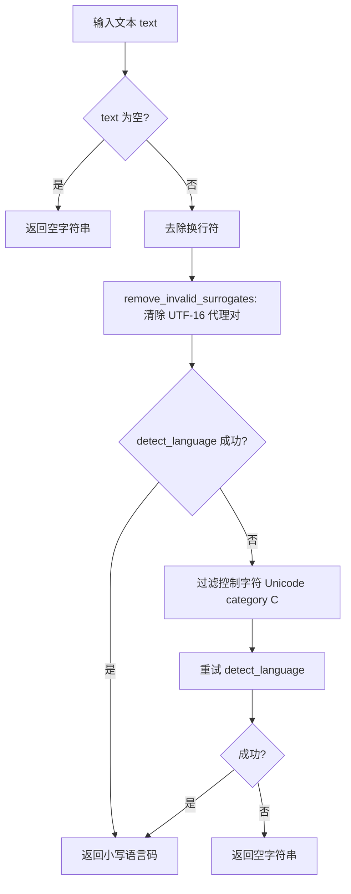
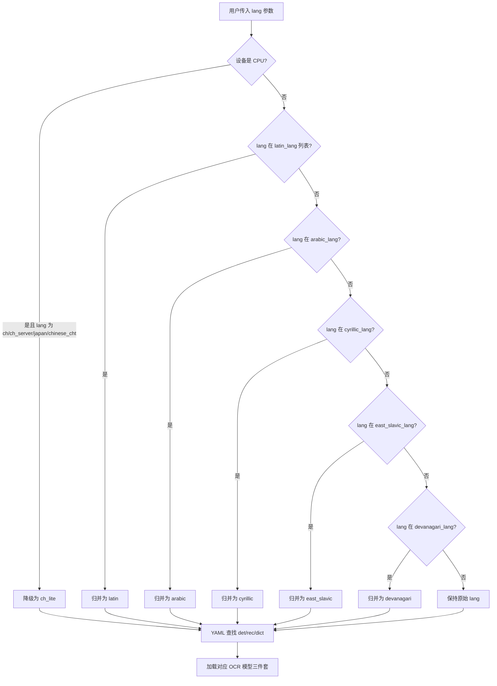

# PD-352.01 MinerU — fast_langdetect 多语言检测与 OCR 模型族路由

> 文档编号：PD-352.01
> 来源：MinerU `mineru/utils/language.py`, `mineru/model/ocr/pytorch_paddle.py`, `mineru/backend/pipeline/pipeline_analyze.py`
> GitHub：https://github.com/opendatalab/MinerU.git
> 问题域：PD-352 多语言检测 Multilingual Detection
> 状态：可复用方案

---

## 第 1 章 问题与动机

### 1.1 核心问题

文档解析系统面对的 PDF/图片来源遍布全球，语言种类繁多。OCR 模型对语言高度敏感——用中文模型识别阿拉伯文会产生大量乱码，用英文模型识别天城文则完全失效。核心挑战在于：

1. **语言自动识别**：用户上传文档时不一定知道文档语言，系统需要零配置自动检测
2. **OCR 模型路由**：检测到语言后，需要将请求路由到正确的 OCR 模型（det + rec + dict 三件套）
3. **语言族归并**：世界上有数百种语言，但 OCR 模型按"语言族"组织（如 50+ 拉丁语系语言共用一个 `latin` 模型），需要将细粒度语言码映射到粗粒度模型族
4. **编码异常处理**：真实文档中常包含 UTF-16 代理对、控制字符等异常编码，语言检测库会直接崩溃
5. **设备感知降级**：CPU 环境下大模型推理太慢，需要自动降级到轻量模型

### 1.2 MinerU 的解法概述

MinerU 构建了一套三层语言处理管线：

1. **fast_langdetect 自动检测**（`mineru/utils/language.py:20-39`）：基于 FastText 的语言检测，支持 100+ 语言，用于段落级语言判断（段落分割、Markdown 生成时的中英文空格处理）
2. **五大语言族映射表**（`mineru/model/ocr/pytorch_paddle.py:21-107`）：将 100+ ISO 语言码归并为 latin/arabic/cyrillic/east_slavic/devanagari 五大族，加上 ch/en/korean/japan 等直接支持的语言，共 16 个 OCR 模型槽位
3. **YAML 配置驱动的模型路由**（`models_config.yml:1-69`）：每个语言族对应一组 det/rec/dict 模型文件，通过 YAML 配置解耦模型选择与代码逻辑
4. **Singleton 模型缓存**（`mineru/backend/pipeline/model_init.py:18-40`）：按 `(lang, formula_enable, table_enable)` 三元组缓存模型实例，避免重复加载
5. **设备感知自动降级**（`mineru/model/ocr/pytorch_paddle.py:149-151`）：CPU 环境自动将 ch/ch_server/japan/chinese_cht 降级为 ch_lite

### 1.3 设计思想

| 设计原则 | 具体实现 | 理由 | 替代方案 |
|----------|----------|------|----------|
| 语言族归并 | 100+ 语言码 → 16 个模型槽位 | OCR 模型按书写系统训练，非按语言训练 | 每语言一个模型（资源浪费） |
| 配置驱动 | YAML 定义 lang→(det,rec,dict) 映射 | 新增语言只改配置不改代码 | 硬编码 if-else 链 |
| 双层检测 | fast_langdetect 段落级 + lang 参数文档级 | 段落级用于排版，文档级用于 OCR 路由 | 仅文档级（混合语言文档排版错误） |
| 防御性编码 | 代理对清除 + 控制字符过滤 + 双层 try-except | 真实文档编码混乱 | 直接传入（崩溃） |
| 设备感知降级 | CPU 自动切换 ch_lite | 大模型 CPU 推理极慢 | 统一用大模型（用户等不及） |

---

## 第 2 章 源码实现分析

### 2.1 架构概览

MinerU 的多语言处理分为三个层次，贯穿从 API 入口到 OCR 推理的完整链路：

```
┌─────────────────────────────────────────────────────────────────┐
│                    FastAPI / CLI 入口层                          │
│  lang_list 参数 ──→ 文档级语言指定（默认 "ch"）                   │
└──────────────────────────┬──────────────────────────────────────┘
                           │ p_lang_list
                           ▼
┌─────────────────────────────────────────────────────────────────┐
│                    Pipeline / Hybrid 分析层                      │
│  lang → ModelSingleton.get_model(lang=...) 缓存模型实例           │
│  lang → PytorchPaddleOCR(lang=...) 语言族归并 + 模型加载          │
└──────────────────────────┬──────────────────────────────────────┘
                           │ OCR 结果文本
                           ▼
┌─────────────────────────────────────────────────────────────────┐
│                    段落处理 / Markdown 生成层                     │
│  detect_lang(block_text) → 段落级语言检测                        │
│  block_lang in ['zh','ja','ko'] → 中日韩特殊排版规则              │
└─────────────────────────────────────────────────────────────────┘
```

### 2.2 核心实现

#### 2.2.1 语言自动检测与编码防御



对应源码 `mineru/utils/language.py:15-39`：

```python
def remove_invalid_surrogates(text):
    # 移除无效的 UTF-16 代理对
    return ''.join(c for c in text if not (0xD800 <= ord(c) <= 0xDFFF))


def detect_lang(text: str) -> str:
    if len(text) == 0:
        return ""

    text = text.replace("\n", "")
    text = remove_invalid_surrogates(text)

    try:
        lang_upper = detect_language(text)
    except:
        html_no_ctrl_chars = ''.join(
            [l for l in text if unicodedata.category(l)[0] not in ['C', ]]
        )
        lang_upper = detect_language(html_no_ctrl_chars)

    try:
        lang = lang_upper.lower()
    except:
        lang = ""
    return lang
```

关键设计点：
- `remove_invalid_surrogates`（`language.py:15-17`）：逐字符检查 Unicode 码点是否在 `0xD800-0xDFFF` 代理对范围内，这是 PDF 文本提取中常见的编码问题
- 双层 try-except（`language.py:29-38`）：第一次失败后用 `unicodedata.category` 过滤所有控制字符（C 类），再重试
- FastText 模型缓存路径（`language.py:4-9`）：通过 `FTLANG_CACHE` 环境变量指向项目内置的 fasttext-langdetect 资源目录，实现零网络依赖

#### 2.2.2 语言族归并与 OCR 模型路由



对应源码 `mineru/model/ocr/pytorch_paddle.py:140-178`：

```python
class PytorchPaddleOCR(TextSystem):
    def __init__(self, *args, **kwargs):
        parser = utility.init_args()
        args = parser.parse_args(args)

        self.lang = kwargs.get('lang', 'ch')
        self.enable_merge_det_boxes = kwargs.get("enable_merge_det_boxes", True)

        device = get_device()
        if device == 'cpu' and self.lang in ['ch', 'ch_server', 'japan', 'chinese_cht']:
            self.lang = 'ch_lite'

        if self.lang in latin_lang:
            self.lang = 'latin'
        elif self.lang in east_slavic_lang:
            self.lang = 'east_slavic'
        elif self.lang in arabic_lang:
            self.lang = 'arabic'
        elif self.lang in cyrillic_lang:
            self.lang = 'cyrillic'
        elif self.lang in devanagari_lang:
            self.lang = 'devanagari'
        else:
            pass

        models_config_path = os.path.join(
            root_dir, 'pytorchocr', 'utils', 'resources', 'models_config.yml'
        )
        with open(models_config_path) as file:
            config = yaml.safe_load(file)
            det, rec, dict_file = get_model_params(self.lang, config)
```

五大语言族映射表（`pytorch_paddle.py:21-107`）覆盖的语言数量：
- `latin_lang`：50 种语言（法/德/西/葡/越/土/波兰/捷克等）
- `arabic_lang`：8 种语言（阿拉伯/波斯/维吾尔/乌尔都等）
- `cyrillic_lang`：35 种语言（俄/乌克兰/保加利亚/蒙古/哈萨克等）
- `east_slavic_lang`：3 种语言（俄/白俄/乌克兰）
- `devanagari_lang`：13 种语言（印地/马拉地/尼泊尔/梵文等）

### 2.3 实现细节

#### YAML 配置驱动的模型三件套

`models_config.yml` 定义了 16 个语言槽位，每个槽位包含三个模型文件路径：

| 语言槽位 | det 模型 | rec 模型 | 字典文件 |
|----------|----------|----------|----------|
| ch | ch_PP-OCRv5_det | ch_PP-OCRv4_rec_server_doc | ppocrv4_doc_dict |
| ch_lite | ch_PP-OCRv5_det | ch_PP-OCRv5_rec | ppocrv5_dict |
| en | ch_PP-OCRv5_det | en_PP-OCRv5_rec | ppocrv5_en_dict |
| korean | ch_PP-OCRv5_det | korean_PP-OCRv5_rec | ppocrv5_korean_dict |
| latin | ch_PP-OCRv5_det | latin_PP-OCRv5_rec | ppocrv5_latin_dict |
| arabic | ch_PP-OCRv5_det | arabic_PP-OCRv5_rec | ppocrv5_arabic_dict |
| cyrillic | ch_PP-OCRv5_det | cyrillic_PP-OCRv5_rec | ppocrv5_cyrillic_dict |
| devanagari | ch_PP-OCRv5_det | devanagari_PP-OCRv5_rec | ppocrv5_devanagari_dict |

注意：所有语言共享同一个 `ch_PP-OCRv5_det` 检测模型（除 `ka` 用 Multilingual_PP-OCRv3），差异仅在识别模型和字典。

#### Singleton 模型缓存机制

模型实例通过两层 Singleton 缓存（`model_init.py:18-40` 和 `model_init.py:121-152`）：

- `ModelSingleton`：按 `(lang, formula_enable, table_enable)` 缓存完整 Pipeline 模型
- `AtomModelSingleton`：按 `(model_name, lang, det_db_box_thresh, ...)` 缓存原子模型（OCR/Table 等）

这意味着同一语言的 OCR 模型只加载一次，后续请求直接复用。

#### 段落级语言检测的应用

`detect_lang` 在段落处理阶段被调用（`para_split.py:107`、`pipeline_middle_json_mkcontent.py:113`、`vlm_middle_json_mkcontent.py:32`），用于：

1. **段落分割**：中日韩文本（`block_lang in ['zh', 'ja', 'ko']`）使用不同的行间距阈值判断段落边界（`para_split.py:132-133`）
2. **Markdown 生成**：根据语言决定行间是否插入空格（中文不需要，英文需要）

#### Hybrid 后端的 VLM OCR 决策

`hybrid_analyze.py:369-381` 中的 `_should_enable_vlm_ocr` 函数根据语言决定是否启用 VLM OCR：

```python
def _should_enable_vlm_ocr(ocr_enable, language, inline_formula_enable):
    force_enable = os.getenv("MINERU_FORCE_VLM_OCR_ENABLE", "0").lower() in ("1", "true", "yes")
    if force_enable:
        return True
    force_pipeline = os.getenv("MINERU_HYBRID_FORCE_PIPELINE_ENABLE", "0").lower() in ("1", "true", "yes")
    return (
        ocr_enable
        and language in ["ch", "en"]
        and inline_formula_enable
        and not force_pipeline
    )
```

只有中英文文档才启用 VLM OCR（精度更高），其他语言回退到传统 Pipeline OCR。


---

## 第 3 章 迁移指南

### 3.1 迁移清单

**阶段 1：语言检测基础设施**
- [ ] 安装 `fast_langdetect` 依赖（底层是 FastText）
- [ ] 实现 `detect_lang` 函数，包含代理对清除和控制字符过滤
- [ ] 配置 FastText 模型缓存路径（避免运行时下载）

**阶段 2：语言族映射与 OCR 路由**
- [ ] 定义语言族映射表（latin/arabic/cyrillic/devanagari/east_slavic）
- [ ] 创建 YAML 配置文件定义 lang → (det, rec, dict) 映射
- [ ] 实现 OCR 模型工厂，根据归并后的语言码加载对应模型

**阶段 3：设备感知与缓存**
- [ ] 实现 Singleton 模型缓存，避免重复加载
- [ ] 添加 CPU 环境自动降级逻辑
- [ ] 添加 API 层的 lang_list 参数支持

### 3.2 适配代码模板

```python
"""可直接复用的多语言检测与 OCR 路由模板"""
import os
import unicodedata
from functools import lru_cache
from typing import Dict, Tuple

import yaml

# ---- 阶段 1：语言检测 ----

# 设置 FastText 缓存路径（在 import 前设置）
if not os.getenv("FTLANG_CACHE"):
    os.environ["FTLANG_CACHE"] = os.path.join(
        os.path.dirname(__file__), "resources", "fasttext-langdetect"
    )

from fast_langdetect import detect_language


def remove_invalid_surrogates(text: str) -> str:
    """清除 UTF-16 代理对，防止 FastText 崩溃"""
    return "".join(c for c in text if not (0xD800 <= ord(c) <= 0xDFFF))


def detect_lang(text: str) -> str:
    """带防御的语言检测，返回小写 ISO 639-1 码"""
    if not text:
        return ""
    text = text.replace("\n", "")
    text = remove_invalid_surrogates(text)
    try:
        return detect_language(text).lower()
    except Exception:
        cleaned = "".join(
            c for c in text if unicodedata.category(c)[0] != "C"
        )
        try:
            return detect_language(cleaned).lower()
        except Exception:
            return ""


# ---- 阶段 2：语言族归并 ----

LANG_FAMILY_MAP: Dict[str, list] = {
    "latin": [
        "af", "az", "bs", "cs", "cy", "da", "de", "es", "et", "fr",
        "ga", "hr", "hu", "id", "is", "it", "ku", "la", "lt", "lv",
        "mi", "ms", "mt", "nl", "no", "oc", "pl", "pt", "ro", "sk",
        "sl", "sq", "sv", "sw", "tl", "tr", "uz", "vi", "fi", "eu",
        "gl", "ca",
    ],
    "arabic": ["ar", "fa", "ug", "ur", "ps", "sd"],
    "cyrillic": [
        "ru", "be", "bg", "uk", "mn", "kk", "ky", "tg", "mk", "tt",
    ],
    "devanagari": ["hi", "mr", "ne", "sa", "bho"],
}

# 反转映射：lang_code → family_name
_LANG_TO_FAMILY = {}
for family, langs in LANG_FAMILY_MAP.items():
    for lang in langs:
        _LANG_TO_FAMILY[lang] = family


def normalize_lang(lang: str, device: str = "cuda") -> str:
    """将细粒度语言码归并为 OCR 模型族"""
    # 设备感知降级
    if device == "cpu" and lang in ("ch", "ch_server", "japan", "chinese_cht"):
        return "ch_lite"
    # 语言族归并
    return _LANG_TO_FAMILY.get(lang, lang)


# ---- 阶段 3：YAML 配置驱动的模型路由 ----

def load_ocr_config(config_path: str) -> dict:
    with open(config_path) as f:
        return yaml.safe_load(f)


def get_ocr_model_paths(
    lang: str, config: dict
) -> Tuple[str, str, str]:
    """返回 (det_model, rec_model, dict_file) 三件套"""
    if lang not in config["lang"]:
        raise ValueError(f"Unsupported language: {lang}")
    params = config["lang"][lang]
    return params["det"], params["rec"], params["dict"]


# ---- 使用示例 ----

if __name__ == "__main__":
    # 自动检测
    print(detect_lang("这是中文测试"))  # → "zh"
    print(detect_lang("This is English"))  # → "en"
    print(detect_lang("هذا اختبار"))  # → "ar"

    # 语言族归并
    print(normalize_lang("fr"))  # → "latin"
    print(normalize_lang("ur"))  # → "arabic"
    print(normalize_lang("ch", device="cpu"))  # → "ch_lite"
```

### 3.3 适用场景

| 场景 | 适用度 | 说明 |
|------|--------|------|
| 多语言 PDF 解析系统 | ⭐⭐⭐ | 核心场景，直接复用 |
| 多语言 OCR 服务 | ⭐⭐⭐ | 语言族归并 + YAML 路由可直接迁移 |
| 文档翻译预处理 | ⭐⭐ | 语言检测部分可复用，OCR 路由需适配 |
| 纯文本语言检测 | ⭐⭐ | 仅需阶段 1，编码防御有价值 |
| 实时聊天语言检测 | ⭐ | fast_langdetect 对短文本准确率较低 |

---

## 第 4 章 测试用例

```python
import pytest
from unittest.mock import patch, MagicMock


class TestDetectLang:
    """测试 mineru/utils/language.py 的 detect_lang 函数"""

    def test_empty_string(self):
        """空字符串返回空"""
        from mineru.utils.language import detect_lang
        assert detect_lang("") == ""

    def test_chinese_text(self):
        from mineru.utils.language import detect_lang
        result = detect_lang("这是一段中文测试文本")
        assert result == "zh"

    def test_english_text(self):
        from mineru.utils.language import detect_lang
        result = detect_lang("This is an English test sentence")
        assert result == "en"

    def test_utf16_surrogate_handling(self):
        """包含 UTF-16 代理对的文本不应崩溃"""
        from mineru.utils.language import detect_lang
        text = "〖\ud835\udc46\ud835〗这是个包含utf-16的中文测试"
        result = detect_lang(text)
        assert isinstance(result, str)
        assert result != ""

    def test_control_characters_fallback(self):
        """包含控制字符时应触发 fallback 清理"""
        from mineru.utils.language import remove_invalid_surrogates
        text = "Hello\x00World\x01Test"
        cleaned = remove_invalid_surrogates(text)
        # 代理对清除不影响控制字符，控制字符由 detect_lang 的 fallback 处理
        assert "\x00" in cleaned  # 控制字符不是代理对

    def test_newline_removal(self):
        from mineru.utils.language import detect_lang
        result = detect_lang("This\nis\na\ntest")
        assert isinstance(result, str)


class TestRemoveInvalidSurrogates:
    """测试 UTF-16 代理对清除"""

    def test_normal_text_unchanged(self):
        from mineru.utils.language import remove_invalid_surrogates
        text = "Hello World 你好世界"
        assert remove_invalid_surrogates(text) == text

    def test_surrogate_pair_removed(self):
        from mineru.utils.language import remove_invalid_surrogates
        # \ud800 是高代理，应被移除
        text = "test\ud800text"
        result = remove_invalid_surrogates(text)
        assert "\ud800" not in result
        assert "test" in result and "text" in result


class TestLanguageFamilyMapping:
    """测试 PytorchPaddleOCR 的语言族归并逻辑"""

    def test_latin_languages_mapped(self):
        """法语、德语等应归并为 latin"""
        from mineru.model.ocr.pytorch_paddle import latin_lang
        assert "fr" in latin_lang or "french" in latin_lang
        assert "de" in latin_lang or "german" in latin_lang
        assert "vi" in latin_lang  # 越南语也是拉丁字母

    def test_arabic_languages_mapped(self):
        from mineru.model.ocr.pytorch_paddle import arabic_lang
        assert "ar" in arabic_lang
        assert "fa" in arabic_lang  # 波斯语
        assert "ug" in arabic_lang  # 维吾尔语

    def test_cyrillic_languages_mapped(self):
        from mineru.model.ocr.pytorch_paddle import cyrillic_lang
        assert "ru" in cyrillic_lang
        assert "bg" in cyrillic_lang  # 保加利亚语
        assert "kk" in cyrillic_lang  # 哈萨克语

    def test_devanagari_languages_mapped(self):
        from mineru.model.ocr.pytorch_paddle import devanagari_lang
        assert "hi" in devanagari_lang  # 印地语
        assert "ne" in devanagari_lang  # 尼泊尔语
        assert "sa" in devanagari_lang  # 梵文

    def test_cpu_auto_downgrade(self):
        """CPU 环境下 ch 应降级为 ch_lite"""
        # 验证降级逻辑存在于 PytorchPaddleOCR.__init__
        from mineru.model.ocr.pytorch_paddle import PytorchPaddleOCR
        # 实际测试需要 mock get_device 返回 'cpu'


class TestModelConfig:
    """测试 YAML 模型配置"""

    def test_all_16_slots_defined(self):
        """models_config.yml 应定义 16 个语言槽位"""
        import yaml
        config_path = "mineru/model/utils/pytorchocr/utils/resources/models_config.yml"
        with open(config_path) as f:
            config = yaml.safe_load(f)
        expected_langs = [
            "ch", "ch_lite", "ch_server", "en", "korean", "japan",
            "chinese_cht", "ta", "te", "ka", "latin", "arabic",
            "cyrillic", "devanagari", "east_slavic", "el", "th",
        ]
        for lang in expected_langs:
            assert lang in config["lang"], f"Missing lang: {lang}"
            assert "det" in config["lang"][lang]
            assert "rec" in config["lang"][lang]
            assert "dict" in config["lang"][lang]
```


---

## 第 5 章 跨域关联

| 关联域 | 关系类型 | 说明 |
|--------|----------|------|
| PD-01 上下文管理 | 协同 | 段落级语言检测影响段落分割策略（中日韩 vs 拉丁语系的行间距阈值不同），间接影响上下文窗口的文本块粒度 |
| PD-03 容错与重试 | 依赖 | `detect_lang` 的双层 try-except + 编码清洗是典型的容错模式；OCR 模型加载失败时 `get_model_params` 直接抛异常，需要上层容错 |
| PD-04 工具系统 | 协同 | 语言参数通过 FastAPI Form 参数传入，是工具系统参数设计的一部分；YAML 配置驱动的模型路由是工具注册模式的变体 |
| PD-11 可观测性 | 协同 | 模型加载耗时通过 `logger.info(f'model init cost: {model_init_cost}')` 记录；批处理进度通过 tqdm 展示 |

---

## 第 6 章 来源文件索引

| 文件 | 行范围 | 关键实现 |
|------|--------|----------|
| `mineru/utils/language.py` | L1-48 | 核心语言检测函数 `detect_lang`，UTF-16 代理对清除，FastText 缓存路径配置 |
| `mineru/model/ocr/pytorch_paddle.py` | L21-107 | 五大语言族映射表（latin/arabic/cyrillic/east_slavic/devanagari） |
| `mineru/model/ocr/pytorch_paddle.py` | L140-178 | `PytorchPaddleOCR.__init__`：语言族归并 + CPU 降级 + YAML 模型加载 |
| `mineru/model/utils/pytorchocr/utils/resources/models_config.yml` | L1-69 | 16 个语言槽位的 det/rec/dict 模型配置 |
| `mineru/backend/pipeline/model_init.py` | L18-40 | `ModelSingleton`：按 (lang, formula, table) 缓存模型实例 |
| `mineru/backend/pipeline/model_init.py` | L98-118 | `ocr_model_init`：OCR 模型工厂函数 |
| `mineru/backend/pipeline/model_init.py` | L121-152 | `AtomModelSingleton`：原子模型缓存，按 (model_name, lang, ...) 做 key |
| `mineru/backend/pipeline/pipeline_analyze.py` | L70-153 | `doc_analyze`：lang_list 传播到批处理分析 |
| `mineru/backend/hybrid/hybrid_analyze.py` | L369-381 | `_should_enable_vlm_ocr`：仅 ch/en 启用 VLM OCR |
| `mineru/backend/pipeline/para_split.py` | L4,107,132 | 段落级 `detect_lang` 调用，中日韩特殊排版规则 |
| `mineru/backend/pipeline/pipeline_middle_json_mkcontent.py` | L7,113 | Markdown 生成时的段落级语言检测 |
| `mineru/backend/vlm/vlm_middle_json_mkcontent.py` | L8,32,534 | VLM 后端的段落级语言检测 |
| `mineru/cli/fast_api.py` | L132-152 | FastAPI `lang_list` 参数定义，16 种语言族的 API 文档 |
| `mineru/utils/guess_suffix_or_lang.py` | L1-35 | Magika 文件类型检测（辅助：非语言检测，而是文件格式检测） |

---

## 第 7 章 横向对比维度

```json comparison_data
{
  "project": "MinerU",
  "dimensions": {
    "检测方法": "fast_langdetect (FastText) 段落级自动检测 + API lang 参数文档级指定",
    "语言覆盖": "16 个 OCR 模型槽位覆盖 100+ 语言，五大语言族归并",
    "模型路由": "YAML 配置驱动 lang→(det,rec,dict) 三件套路由",
    "编码防御": "UTF-16 代理对清除 + Unicode 控制字符过滤 + 双层 try-except",
    "设备适配": "CPU 自动降级 ch→ch_lite，GPU 显存分级 batch_ratio",
    "缓存策略": "双层 Singleton 按 (lang, formula, table) 缓存模型实例"
  }
}
```

### 域元数据补充

```json domain_metadata
{
  "solution_summary": "MinerU 用 fast_langdetect + 五大语言族归并表将 100+ 语言映射到 16 个 YAML 配置的 OCR 模型槽位，双层编码防御处理代理对和控制字符",
  "description": "文档解析场景下语言检测需要同时服务 OCR 模型选择和段落排版两个目标",
  "sub_problems": [
    "设备感知的模型自动降级",
    "VLM OCR 与传统 OCR 的语言条件切换",
    "段落级语言检测驱动排版规则"
  ],
  "best_practices": [
    "YAML 配置解耦语言到模型映射，新增语言只改配置不改代码",
    "双层 Singleton 按语言缓存 OCR 模型实例避免重复加载",
    "CPU 环境自动降级到轻量模型保证响应速度"
  ]
}
```

