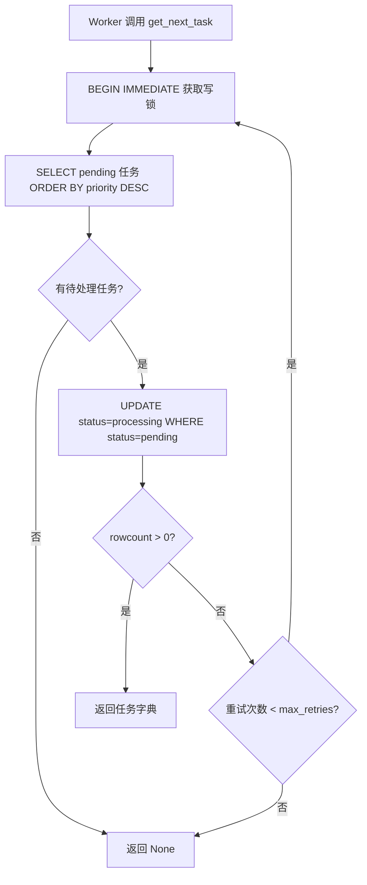
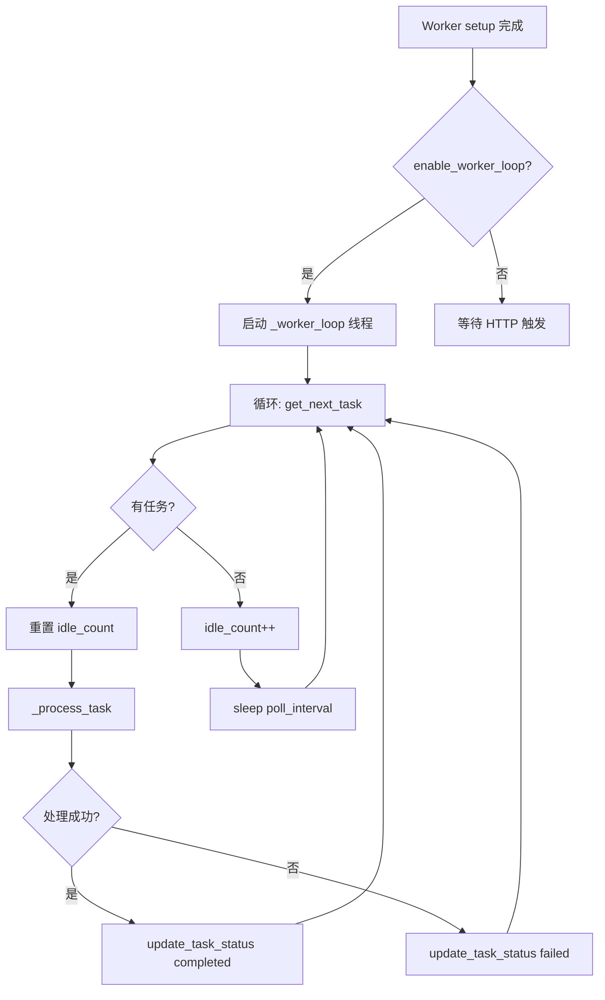
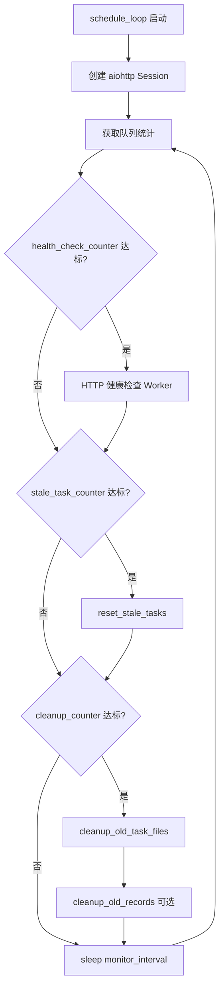

# PD-353.01 MinerU — SQLite 异步任务调度与双模 Worker 系统

> 文档编号：PD-353.01
> 来源：MinerU Tianshu `projects/mineru_tianshu/task_scheduler.py`, `task_db.py`, `litserve_worker.py`
> GitHub：https://github.com/opendatalab/MinerU.git
> 问题域：PD-353 任务调度 Task Scheduling
> 状态：可复用方案

---

## 第 1 章 问题与动机

### 1.1 核心问题

GPU 密集型文档解析服务（如 PDF OCR、公式识别、表格提取）需要一个任务调度系统来解耦"任务提交"与"任务执行"。核心挑战包括：

1. **并发安全**：多个 GPU Worker 同时从队列拉取任务时，如何避免重复处理同一任务？
2. **故障恢复**：Worker 崩溃或任务超时后，如何自动将卡住的任务重新入队？
3. **资源清理**：长期运行的服务如何自动清理过期的结果文件和数据库记录，避免磁盘耗尽？
4. **调度开销**：传统的调度器驱动模式（Scheduler-Driven）在 Worker 空闲时仍需轮询触发，如何减少不必要的 HTTP 调用？

MinerU Tianshu 子项目面对的是企业级多 GPU 文档解析场景：用户通过 FastAPI 提交 PDF/Office 文件，多个 LitServe Worker 各自绑定一张 GPU 卡并行处理，TaskScheduler 在后台监控系统健康状态。

### 1.2 MinerU 的解法概述

MinerU Tianshu 采用 **SQLite 单文件数据库 + 双模 Worker 架构**，核心设计要点：

1. **SQLite 作为任务队列**：用 `BEGIN IMMEDIATE` 写锁 + `rowcount` 校验实现原子性任务拉取，避免引入 Redis/RabbitMQ 等外部依赖（`task_db.py:123-159`）
2. **Worker 自动循环模式**：每个 Worker 在独立线程中持续轮询数据库拉取任务，无需调度器触发（`litserve_worker.py:151-200`）
3. **调度器降级为监控器**：在 Worker 自动循环模式下，TaskScheduler 仅负责队列状态监控（5 分钟）、健康检查（15 分钟）、超时重置和旧文件清理（`task_scheduler.py:94-182`）
4. **两层清理策略**：结果文件清理（保留数据库记录）与数据库记录清理（可选，默认禁用）分离，兼顾磁盘空间和历史可查（`task_db.py:314-389`）
5. **优雅关闭**：通过 `running` 标志位 + `signal` 处理 + `teardown` 回调实现 Worker 和 Scheduler 的优雅停机（`litserve_worker.py:131-149`）

### 1.3 设计思想

| 设计原则 | 具体实现 | 理由 | 替代方案 |
|----------|----------|------|----------|
| 零外部依赖 | SQLite 单文件作为任务队列 | 部署简单，无需 Redis/RabbitMQ | Redis Queue、Celery |
| Worker 自治 | Worker 主动轮询拉取任务 | 减少调度器 HTTP 开销，Worker 处理完立即拉下一个 | 调度器 HTTP 触发 Worker |
| 乐观并发控制 | `BEGIN IMMEDIATE` + `rowcount` 校验 | 轻量级锁，适合中等并发 | SELECT FOR UPDATE（需 PostgreSQL） |
| 分层清理 | 文件清理与记录清理分离 | 磁盘空间回收的同时保留审计历史 | 统一删除（丢失历史） |
| 计数器驱动定时 | 用循环计数器模拟多频率定时任务 | 单循环内实现多种间隔的任务 | 多个 asyncio.Task |

---

## 第 2 章 源码实现分析

### 2.1 架构概览

MinerU Tianshu 的任务调度系统由四个组件构成：

```
┌──────────────────┐     ┌──────────────────┐     ┌──────────────────────────┐
│   API Server     │     │  Task Scheduler  │     │  LitServe Worker Pool    │
│  (FastAPI)       │     │  (可选监控器)     │     │  (GPU Worker × N)        │
│                  │     │                  │     │                          │
│  POST /submit ───┼──┐  │  监控队列状态     │     │  ┌─ Worker-0 (cuda:0) ─┐ │
│  GET  /status    │  │  │  健康检查 Worker  │     │  │  _worker_loop()     │ │
│  GET  /stats     │  │  │  重置超时任务     │     │  │  ↓ get_next_task()  │ │
│  DELETE /cancel  │  │  │  清理旧文件       │     │  │  ↓ _process_task()  │ │
└──────────────────┘  │  └────────┬─────────┘     │  └─────────────────────┘ │
                      │           │               │  ┌─ Worker-1 (cuda:1) ─┐ │
                      │           │ HTTP health   │  │  _worker_loop()     │ │
                      │           └───────────────┼→ │  ...                │ │
                      │                           │  └─────────────────────┘ │
                      │    ┌──────────────────┐   └──────────────────────────┘
                      └──→ │   SQLite DB      │ ←── Worker 直接读写
                           │  (tasks 表)      │
                           │  status 索引     │
                           │  priority 索引   │
                           └──────────────────┘
```

关键数据流：
- **提交路径**：API Server → `TaskDB.create_task()` → SQLite INSERT
- **执行路径**：Worker `_worker_loop()` → `TaskDB.get_next_task()` → `_process_task()` → `TaskDB.update_task_status()`
- **监控路径**：Scheduler `schedule_loop()` → `TaskDB.get_queue_stats()` / `reset_stale_tasks()` / `cleanup_old_task_files()`

### 2.2 核心实现

#### 2.2.1 原子性任务拉取（并发安全核心）



对应源码 `task_db.py:106-159`：

```python
def get_next_task(self, worker_id: str, max_retries: int = 3) -> Optional[Dict]:
    """
    获取下一个待处理任务（原子操作，防止并发冲突）
    
    并发安全说明：
        1. 使用 BEGIN IMMEDIATE 立即获取写锁
        2. UPDATE 时检查 status = 'pending' 防止重复拉取
        3. 检查 rowcount 确保更新成功
        4. 如果任务被抢走，立即重试而不是返回 None
    """
    for attempt in range(max_retries):
        with self.get_cursor() as cursor:
            cursor.execute('BEGIN IMMEDIATE')
            
            cursor.execute('''
                SELECT * FROM tasks 
                WHERE status = 'pending' 
                ORDER BY priority DESC, created_at ASC 
                LIMIT 1
            ''')
            
            task = cursor.fetchone()
            if task:
                cursor.execute('''
                    UPDATE tasks 
                    SET status = 'processing', 
                        started_at = CURRENT_TIMESTAMP, 
                        worker_id = ?
                    WHERE task_id = ? AND status = 'pending'
                ''', (worker_id, task['task_id']))
                
                if cursor.rowcount == 0:
                    continue  # 被其他 worker 抢走，立即重试
                
                return dict(task)
            else:
                return None
    
    return None  # 重试次数用尽
```

这段代码的关键技巧：`BEGIN IMMEDIATE` 在事务开始时就获取写锁（而非默认的延迟锁），配合 `WHERE status = 'pending'` 的双重检查，确保即使多个 Worker 同时 SELECT 到同一任务，只有一个能成功 UPDATE。失败的 Worker 立即重试而非返回空，避免不必要的等待周期。

#### 2.2.2 Worker 自动循环模式



对应源码 `litserve_worker.py:151-200`：

```python
def _worker_loop(self):
    """Worker 主循环：持续拉取并处理任务"""
    logger.info(f"🔁 {self.worker_id} started task polling loop")
    
    idle_count = 0
    while self.running:
        try:
            task = self.db.get_next_task(self.worker_id)
            
            if task:
                idle_count = 0
                task_id = task['task_id']
                logger.info(f"🔄 {self.worker_id} picked up task {task_id}")
                
                try:
                    self._process_task(task)
                except Exception as e:
                    logger.error(f"❌ {self.worker_id} failed task {task_id}: {e}")
                    success = self.db.update_task_status(
                        task_id, 'failed', 
                        error_message=str(e), 
                        worker_id=self.worker_id
                    )
                    if not success:
                        logger.warning(f"⚠️  Task {task_id} modified by another process")
            else:
                idle_count += 1
                if idle_count == 1:
                    logger.debug(f"💤 {self.worker_id} is idle, waiting...")
                time.sleep(self.poll_interval)
                
        except Exception as e:
            logger.error(f"❌ {self.worker_id} loop error: {e}")
            time.sleep(self.poll_interval)
```

设计亮点：
- **idle_count 防刷屏**：只在首次空闲时打印日志（`idle_count == 1`），避免无任务时日志爆炸
- **双层异常捕获**：内层捕获单任务处理异常（标记 failed），外层捕获循环级异常（如数据库连接断开），确保循环不会因单次异常退出
- **并发状态校验**：`update_task_status` 返回 `False` 时说明任务被其他进程修改，仅打印警告不抛异常

#### 2.2.3 调度器多频率监控循环



对应源码 `task_scheduler.py:94-182`：

```python
async def schedule_loop(self):
    """主监控循环"""
    health_check_counter = 0
    stale_task_counter = 0
    cleanup_counter = 0
    
    async with aiohttp.ClientSession() as session:
        while self.running:
            try:
                # 1. 监控队列状态（每次循环）
                stats = self.db.get_queue_stats()
                pending_count = stats.get('pending', 0)
                
                # 2. 定期健康检查（每 health_check_interval）
                health_check_counter += 1
                if health_check_counter * self.monitor_interval >= self.health_check_interval:
                    health_check_counter = 0
                    health_result = await self.check_worker_health(session)
                
                # 3. 定期重置超时任务
                stale_task_counter += 1
                if stale_task_counter * self.monitor_interval >= self.stale_task_timeout * 60:
                    stale_task_counter = 0
                    reset_count = self.db.reset_stale_tasks(self.stale_task_timeout)
                
                # 4. 每24小时清理旧文件
                cleanup_counter += 1
                cleanup_interval_cycles = (24 * 3600) / self.monitor_interval
                if cleanup_counter >= cleanup_interval_cycles:
                    cleanup_counter = 0
                    if self.cleanup_old_files_days > 0:
                        self.db.cleanup_old_task_files(days=self.cleanup_old_files_days)
                
                await asyncio.sleep(self.monitor_interval)
            except Exception as e:
                logger.error(f"Scheduler loop error: {e}")
                await asyncio.sleep(self.monitor_interval)
```

这个设计用三个独立计数器在单个 `asyncio` 循环中模拟了四种不同频率的定时任务：队列监控（5 分钟）、健康检查（15 分钟）、超时重置（60 分钟）、文件清理（24 小时）。避免了启动多个 `asyncio.Task` 或引入 APScheduler 等调度框架。

### 2.3 实现细节

#### 连接管理：每次新建，用完即关

`task_db.py:22-38` 的 `_get_conn()` 每次创建新的 SQLite 连接而非使用连接池。这是有意为之：SQLite 的连接对象不能跨线程共享（`check_same_thread` 限制），而 Worker 运行在独立线程中。每次新建连接 + `get_cursor` 上下文管理器自动关闭，彻底避免了线程安全问题。

#### 优先级调度

任务表包含 `priority` 字段（`task_db.py:63`），`get_next_task` 按 `priority DESC, created_at ASC` 排序（`task_db.py:130-133`），实现高优先级任务插队 + 同优先级 FIFO 的调度策略。

#### 超时任务重置

`reset_stale_tasks`（`task_db.py:391-408`）将超时的 `processing` 任务重置为 `pending`，同时清空 `worker_id` 并递增 `retry_count`。这允许其他 Worker 重新拉取该任务，同时保留重试次数供监控使用。


---

## 第 3 章 迁移指南

### 3.1 迁移清单

**阶段 1：核心任务队列（1 个文件）**

- [ ] 创建 `task_db.py`，包含 `TaskDB` 类
- [ ] 实现 `_init_db()`：建表 + 索引（status, priority, created_at, worker_id）
- [ ] 实现 `create_task()`：UUID 生成 + INSERT
- [ ] 实现 `get_next_task()`：`BEGIN IMMEDIATE` + `rowcount` 校验
- [ ] 实现 `update_task_status()`：状态机转换 + 并发校验
- [ ] 实现 `get_cursor()` 上下文管理器：自动 commit/rollback/close

**阶段 2：Worker 自动循环（集成到现有 Worker）**

- [ ] 在 Worker 的 `setup()` 中启动 `_worker_loop` 守护线程
- [ ] 实现 `_worker_loop()`：轮询 + idle_count 防刷屏
- [ ] 实现 `teardown()`：`running = False` + `thread.join(timeout)`
- [ ] 注册 SIGINT/SIGTERM 信号处理器

**阶段 3：监控调度器（可选）**

- [ ] 创建 `task_scheduler.py`，包含 `TaskScheduler` 类
- [ ] 实现计数器驱动的多频率监控循环
- [ ] 实现 `check_worker_health()`：HTTP 健康检查
- [ ] 实现 `reset_stale_tasks()`：超时任务重置
- [ ] 实现 `cleanup_old_task_files()`：文件清理（保留记录）

**阶段 4：API 层（可选）**

- [ ] 添加 `/submit`、`/status`、`/stats`、`/cancel` 端点
- [ ] 添加 `/admin/reset-stale`、`/admin/cleanup` 管理端点

### 3.2 适配代码模板

以下是一个最小可运行的任务队列实现，可直接复制到任何 Python 项目中：

```python
"""最小任务队列 — 基于 MinerU Tianshu 的 SQLite 原子拉取模式"""
import sqlite3
import uuid
import threading
import time
from contextlib import contextmanager
from typing import Optional, Dict


class SimpleTaskQueue:
    """SQLite 任务队列，支持并发安全的原子拉取"""
    
    def __init__(self, db_path: str = "tasks.db"):
        self.db_path = db_path
        self._init_db()
    
    @contextmanager
    def _cursor(self):
        conn = sqlite3.connect(self.db_path, check_same_thread=False, timeout=30.0)
        conn.row_factory = sqlite3.Row
        cursor = conn.cursor()
        try:
            yield cursor
            conn.commit()
        except Exception:
            conn.rollback()
            raise
        finally:
            conn.close()
    
    def _init_db(self):
        with self._cursor() as c:
            c.execute('''CREATE TABLE IF NOT EXISTS tasks (
                task_id TEXT PRIMARY KEY,
                payload TEXT,
                status TEXT DEFAULT 'pending',
                priority INTEGER DEFAULT 0,
                worker_id TEXT,
                retry_count INTEGER DEFAULT 0,
                created_at TIMESTAMP DEFAULT CURRENT_TIMESTAMP,
                started_at TIMESTAMP,
                completed_at TIMESTAMP
            )''')
            c.execute('CREATE INDEX IF NOT EXISTS idx_status ON tasks(status)')
            c.execute('CREATE INDEX IF NOT EXISTS idx_priority ON tasks(priority DESC)')
    
    def submit(self, payload: str, priority: int = 0) -> str:
        task_id = str(uuid.uuid4())
        with self._cursor() as c:
            c.execute('INSERT INTO tasks (task_id, payload, priority) VALUES (?, ?, ?)',
                      (task_id, payload, priority))
        return task_id
    
    def fetch(self, worker_id: str, max_retries: int = 3) -> Optional[Dict]:
        """原子拉取：BEGIN IMMEDIATE + rowcount 双重校验"""
        for _ in range(max_retries):
            with self._cursor() as c:
                c.execute('BEGIN IMMEDIATE')
                c.execute('''SELECT * FROM tasks WHERE status = 'pending'
                            ORDER BY priority DESC, created_at ASC LIMIT 1''')
                task = c.fetchone()
                if not task:
                    return None
                c.execute('''UPDATE tasks SET status='processing', started_at=CURRENT_TIMESTAMP,
                            worker_id=? WHERE task_id=? AND status='pending' ''',
                          (worker_id, task['task_id']))
                if c.rowcount > 0:
                    return dict(task)
        return None
    
    def complete(self, task_id: str, worker_id: str) -> bool:
        with self._cursor() as c:
            c.execute('''UPDATE tasks SET status='completed', completed_at=CURRENT_TIMESTAMP
                        WHERE task_id=? AND status='processing' AND worker_id=?''',
                      (task_id, worker_id))
            return c.rowcount > 0
    
    def fail(self, task_id: str, worker_id: str, error: str = "") -> bool:
        with self._cursor() as c:
            c.execute('''UPDATE tasks SET status='failed', completed_at=CURRENT_TIMESTAMP
                        WHERE task_id=? AND status='processing' AND worker_id=?''',
                      (task_id, worker_id))
            return c.rowcount > 0
    
    def reset_stale(self, timeout_minutes: int = 60) -> int:
        with self._cursor() as c:
            c.execute('''UPDATE tasks SET status='pending', worker_id=NULL,
                        retry_count=retry_count+1
                        WHERE status='processing'
                        AND started_at < datetime('now', '-' || ? || ' minutes')''',
                      (timeout_minutes,))
            return c.rowcount


class WorkerLoop:
    """Worker 自动循环拉取线程"""
    
    def __init__(self, queue: SimpleTaskQueue, worker_id: str,
                 handler, poll_interval: float = 0.5):
        self.queue = queue
        self.worker_id = worker_id
        self.handler = handler  # callable(task_dict) -> None
        self.poll_interval = poll_interval
        self.running = False
        self._thread = None
    
    def start(self):
        self.running = True
        self._thread = threading.Thread(target=self._loop, daemon=True)
        self._thread.start()
    
    def stop(self, timeout: float = 5.0):
        self.running = False
        if self._thread:
            self._thread.join(timeout=timeout)
    
    def _loop(self):
        idle_count = 0
        while self.running:
            try:
                task = self.queue.fetch(self.worker_id)
                if task:
                    idle_count = 0
                    try:
                        self.handler(task)
                        self.queue.complete(task['task_id'], self.worker_id)
                    except Exception as e:
                        self.queue.fail(task['task_id'], self.worker_id, str(e))
                else:
                    idle_count += 1
                    time.sleep(self.poll_interval)
            except Exception:
                time.sleep(self.poll_interval)
```

### 3.3 适用场景

| 场景 | 适用度 | 说明 |
|------|--------|------|
| 单机多 GPU Worker 任务分发 | ⭐⭐⭐ | 最佳场景，SQLite 单文件无需外部依赖 |
| 中等并发（< 50 Worker） | ⭐⭐⭐ | SQLite WAL 模式可支持中等并发读写 |
| 需要优先级调度的批处理 | ⭐⭐⭐ | priority 字段 + ORDER BY 天然支持 |
| 需要任务审计和历史查询 | ⭐⭐⭐ | SQLite 保留全部记录，SQL 查询灵活 |
| 分布式多机部署 | ⭐ | SQLite 不支持网络访问，需换 PostgreSQL |
| 高并发（> 100 Worker） | ⭐ | SQLite 写锁竞争严重，需换 Redis Queue |
| 需要消息确认和死信队列 | ⭐⭐ | 可通过 retry_count 模拟，但不如 RabbitMQ 原生支持 |

---

## 第 4 章 测试用例

```python
"""基于 MinerU Tianshu TaskDB 真实接口的测试用例"""
import pytest
import threading
import time
from pathlib import Path
from unittest.mock import patch


class TestTaskDB:
    """测试 TaskDB 核心功能"""
    
    @pytest.fixture(autouse=True)
    def setup_db(self, tmp_path):
        """每个测试使用独立的临时数据库"""
        # 模拟 TaskDB 的最小实现
        from task_db import TaskDB
        self.db = TaskDB(db_path=str(tmp_path / "test.db"))
        yield
    
    def test_create_and_get_task(self):
        """正常路径：创建任务并查询"""
        task_id = self.db.create_task(
            file_name="test.pdf",
            file_path="/tmp/test.pdf",
            backend="pipeline",
            options={"lang": "ch"},
            priority=1
        )
        
        task = self.db.get_task(task_id)
        assert task is not None
        assert task['status'] == 'pending'
        assert task['file_name'] == 'test.pdf'
        assert task['priority'] == 1
    
    def test_atomic_fetch_prevents_double_processing(self):
        """并发安全：两个 Worker 不会拉取同一任务"""
        task_id = self.db.create_task("test.pdf", "/tmp/test.pdf")
        
        result_1 = self.db.get_next_task("worker-1")
        result_2 = self.db.get_next_task("worker-2")
        
        assert result_1 is not None
        assert result_1['task_id'] == task_id
        assert result_2 is None  # 第二个 Worker 拿不到任务
    
    def test_concurrent_fetch_with_threads(self):
        """并发安全：多线程竞争拉取"""
        # 创建 5 个任务
        task_ids = set()
        for i in range(5):
            tid = self.db.create_task(f"file_{i}.pdf", f"/tmp/file_{i}.pdf")
            task_ids.add(tid)
        
        # 10 个线程竞争拉取
        results = []
        lock = threading.Lock()
        
        def fetch_task(worker_id):
            task = self.db.get_next_task(worker_id)
            if task:
                with lock:
                    results.append(task['task_id'])
        
        threads = [threading.Thread(target=fetch_task, args=(f"w-{i}",)) 
                   for i in range(10)]
        for t in threads:
            t.start()
        for t in threads:
            t.join()
        
        # 每个任务只被拉取一次
        assert len(results) == 5
        assert set(results) == task_ids
    
    def test_priority_ordering(self):
        """优先级：高优先级任务先被拉取"""
        self.db.create_task("low.pdf", "/tmp/low.pdf", priority=0)
        high_id = self.db.create_task("high.pdf", "/tmp/high.pdf", priority=10)
        
        task = self.db.get_next_task("worker-1")
        assert task['task_id'] == high_id
    
    def test_reset_stale_tasks(self):
        """超时重置：processing 超时的任务回到 pending"""
        task_id = self.db.create_task("test.pdf", "/tmp/test.pdf")
        self.db.get_next_task("worker-1")  # 变为 processing
        
        # 模拟超时（将 started_at 设为很久以前）
        with self.db.get_cursor() as cursor:
            cursor.execute('''
                UPDATE tasks SET started_at = datetime('now', '-120 minutes')
                WHERE task_id = ?
            ''', (task_id,))
        
        reset_count = self.db.reset_stale_tasks(timeout_minutes=60)
        assert reset_count == 1
        
        task = self.db.get_task(task_id)
        assert task['status'] == 'pending'
        assert task['retry_count'] == 1
        assert task['worker_id'] is None
    
    def test_status_update_with_worker_check(self):
        """并发校验：只有持有任务的 Worker 能更新状态"""
        task_id = self.db.create_task("test.pdf", "/tmp/test.pdf")
        self.db.get_next_task("worker-1")
        
        # worker-2 尝试完成 worker-1 的任务
        success = self.db.update_task_status(
            task_id, 'completed', worker_id='worker-2'
        )
        assert success is False
        
        # worker-1 可以正常完成
        success = self.db.update_task_status(
            task_id, 'completed', worker_id='worker-1'
        )
        assert success is True
    
    def test_queue_stats(self):
        """统计：各状态任务计数"""
        self.db.create_task("a.pdf", "/tmp/a.pdf")
        self.db.create_task("b.pdf", "/tmp/b.pdf")
        task_id = self.db.create_task("c.pdf", "/tmp/c.pdf")
        self.db.get_next_task("worker-1")  # 1 个变为 processing
        
        stats = self.db.get_queue_stats()
        assert stats.get('pending', 0) == 2
        assert stats.get('processing', 0) == 1
    
    def test_cleanup_preserves_records(self):
        """清理策略：文件清理保留数据库记录"""
        task_id = self.db.create_task("test.pdf", "/tmp/test.pdf")
        self.db.get_next_task("worker-1")
        self.db.update_task_status(task_id, 'completed', 
                                    result_path='/tmp/output/test',
                                    worker_id='worker-1')
        
        # 模拟过期
        with self.db.get_cursor() as cursor:
            cursor.execute('''
                UPDATE tasks SET completed_at = datetime('now', '-30 days')
                WHERE task_id = ?
            ''', (task_id,))
        
        # 清理文件（目录不存在不会报错）
        self.db.cleanup_old_task_files(days=7)
        
        # 记录仍然存在
        task = self.db.get_task(task_id)
        assert task is not None
        assert task['status'] == 'completed'
```


---

## 第 5 章 跨域关联

| 关联域 | 关系类型 | 说明 |
|--------|----------|------|
| PD-03 容错与重试 | 协同 | `reset_stale_tasks` 实现超时任务自动重入队，`retry_count` 字段记录重试次数，与容错域的重试策略直接相关 |
| PD-11 可观测性 | 协同 | `get_queue_stats()` 提供队列状态统计，TaskScheduler 的监控循环定期输出 pending/processing/completed/failed 计数，是可观测性的数据源 |
| PD-06 记忆持久化 | 依赖 | SQLite 作为任务状态的持久化存储，`cleanup_old_task_files` 和 `cleanup_old_task_records` 的两层清理策略与记忆持久化域的存储生命周期管理相关 |
| PD-09 Human-in-the-Loop | 协同 | API Server 提供 `/cancel`、`/admin/reset-stale` 等管理端点，允许人工干预任务状态，是 HITL 的一种实现形式 |
| PD-02 多 Agent 编排 | 协同 | 多 Worker 通过 SQLite 队列实现隐式编排（竞争拉取），`start_all.py` 的 `TianshuLauncher` 统一编排 API Server + Worker Pool + Scheduler 三个进程的启动和关闭 |

---

## 第 6 章 来源文件索引

| 文件 | 行范围 | 关键实现 |
|------|--------|----------|
| `projects/mineru_tianshu/task_db.py` | L15-L52 | TaskDB 类定义、连接管理、上下文管理器 |
| `projects/mineru_tianshu/task_db.py` | L54-L80 | 数据库初始化：tasks 表结构 + 4 个索引 |
| `projects/mineru_tianshu/task_db.py` | L106-L159 | `get_next_task()`：BEGIN IMMEDIATE 原子拉取 |
| `projects/mineru_tianshu/task_db.py` | L213-L261 | `update_task_status()`：状态机转换 + 并发校验 |
| `projects/mineru_tianshu/task_db.py` | L314-L364 | `cleanup_old_task_files()`：文件清理保留记录 |
| `projects/mineru_tianshu/task_db.py` | L391-L408 | `reset_stale_tasks()`：超时任务重置 |
| `projects/mineru_tianshu/litserve_worker.py` | L36-L66 | MinerUWorkerAPI 类定义、双模配置 |
| `projects/mineru_tianshu/litserve_worker.py` | L67-L129 | `setup()`：GPU 绑定 + Worker 循环线程启动 |
| `projects/mineru_tianshu/litserve_worker.py` | L131-L149 | `teardown()`：优雅关闭 Worker 线程 |
| `projects/mineru_tianshu/litserve_worker.py` | L151-L200 | `_worker_loop()`：主循环 + idle_count 防刷屏 |
| `projects/mineru_tianshu/litserve_worker.py` | L202-L269 | `_process_task()`：任务处理 + 临时文件清理 |
| `projects/mineru_tianshu/task_scheduler.py` | L24-L68 | TaskScheduler 类定义、多频率参数配置 |
| `projects/mineru_tianshu/task_scheduler.py` | L70-L92 | `check_worker_health()`：HTTP 健康检查 |
| `projects/mineru_tianshu/task_scheduler.py` | L94-L182 | `schedule_loop()`：计数器驱动多频率监控 |
| `projects/mineru_tianshu/task_scheduler.py` | L184-L201 | `start()`：信号处理 + asyncio 启动 |
| `projects/mineru_tianshu/task_scheduler.py` | L219-L270 | CLI 入口：argparse + wait-for-workers 启动等待 |
| `projects/mineru_tianshu/api_server.py` | L242-L297 | `submit_task()`：流式文件上传 + 任务创建 |
| `projects/mineru_tianshu/api_server.py` | L608-L635 | `cancel_task()`：任务取消 + 临时文件清理 |
| `projects/mineru_tianshu/api_server.py` | L696-L709 | `reset_stale_tasks()`：管理端点 |
| `projects/mineru_tianshu/start_all.py` | L17-L165 | TianshuLauncher：三进程统一启动/关闭编排 |

---

## 第 7 章 横向对比维度

```json comparison_data
{
  "project": "MinerU",
  "dimensions": {
    "队列实现": "SQLite 单文件 + BEGIN IMMEDIATE 写锁原子拉取",
    "调度模式": "Worker 自动循环（主）+ 调度器监控（辅），双模可切换",
    "并发控制": "BEGIN IMMEDIATE + rowcount 校验 + max_retries 竞争重试",
    "健康检查": "调度器 HTTP 轮询 Worker + API /health 端点双通道",
    "清理策略": "两层分离：文件清理（保留记录）+ 记录清理（可选禁用）",
    "优先级支持": "priority 字段 + ORDER BY priority DESC, created_at ASC"
  }
}
```

### 域元数据补充

```json domain_metadata
{
  "solution_summary": "MinerU Tianshu 用 SQLite BEGIN IMMEDIATE 原子拉取 + Worker 自动循环线程实现零外部依赖的多 GPU 任务调度，调度器降级为可选监控器",
  "description": "单机多 Worker 场景下 SQLite 替代消息队列的轻量级调度方案",
  "sub_problems": [
    "多 Worker 竞争拉取的原子性保证",
    "调度器与 Worker 自治的职责划分",
    "结果文件与数据库记录的分层生命周期管理"
  ],
  "best_practices": [
    "BEGIN IMMEDIATE + rowcount 双重校验实现 SQLite 原子拉取",
    "idle_count 计数器防止空闲日志刷屏",
    "计数器驱动单循环模拟多频率定时任务"
  ]
}
```

