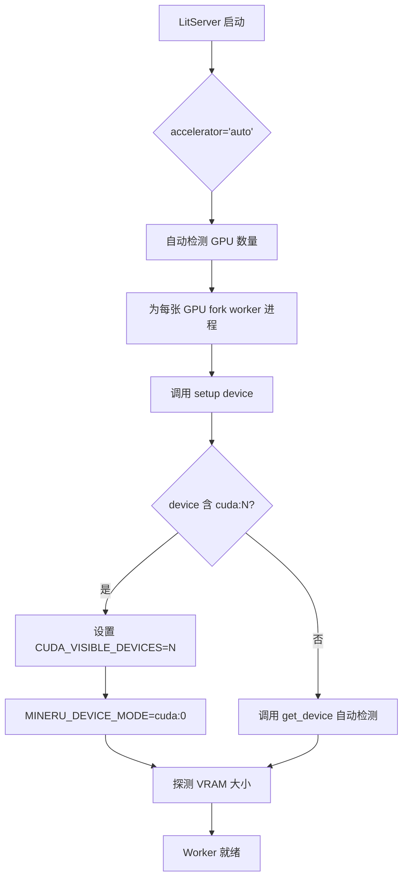
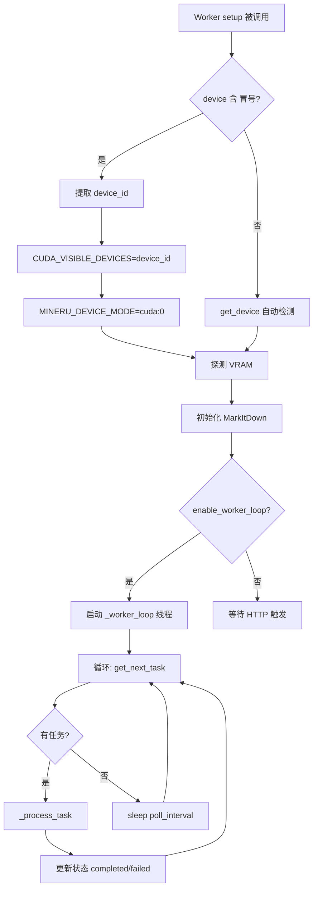
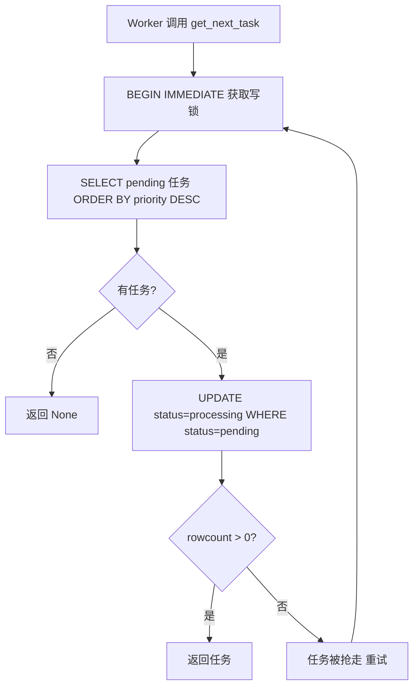

# PD-355.01 MinerU — LitServe 多 GPU 分布式推理与 Tianshu 任务队列

> 文档编号：PD-355.01
> 来源：MinerU `projects/multi_gpu_v2/server.py` `projects/mineru_tianshu/litserve_worker.py`
> GitHub：https://github.com/opendatalab/MinerU.git
> 问题域：PD-355 多GPU分布式推理 Distributed Inference
> 状态：可复用方案

---

## 第 1 章 问题与动机

### 1.1 核心问题

文档解析（PDF OCR、公式识别、表格检测）是 GPU 密集型任务。单卡推理吞吐量有限，当面对企业级批量文档处理需求时，需要将推理负载分散到多张 GPU 上。核心挑战包括：

1. **设备隔离**：多个 worker 进程共享同一台机器时，如何确保每个进程只使用分配的 GPU，避免显存争抢
2. **负载均衡**：如何将请求均匀分配到不同 GPU 上的 worker
3. **任务持久化**：HTTP 请求是同步的，但文档解析耗时长（数十秒到数分钟），需要异步任务队列
4. **故障恢复**：worker 崩溃或任务超时后，如何自动重置任务状态
5. **多加速器适配**：除 CUDA 外还需支持 NPU、MPS、GCU、MUSA、MLU、SDAA 等多种硬件

### 1.2 MinerU 的解法概述

MinerU 提供了两套互补的多 GPU 推理方案：

1. **multi_gpu_v2（轻量方案）**：基于 LitServe 框架的 `LitAPI` 抽象，将 MinerU 的 `do_parse` 封装为 HTTP 推理服务。LitServe 自动处理设备分配和请求路由，`accelerator='auto'` + `devices='auto'` 即可自动发现所有 GPU 并启动对应数量的 worker（`projects/multi_gpu_v2/server.py:100-108`）

2. **mineru_tianshu（生产方案）**：在 LitServe worker 基础上增加了 SQLite 任务队列（`task_db.py`）、FastAPI 管理 API（`api_server.py`）、任务调度器（`task_scheduler.py`）和统一启动器（`start_all.py`），形成完整的生产级多卡部署架构

3. **CUDA_VISIBLE_DEVICES 隔离**：worker 在 `setup(device)` 中通过设置 `CUDA_VISIBLE_DEVICES` 将物理 GPU ID 映射为逻辑 GPU 0，确保进程级设备隔离（`litserve_worker.py:86-93`）

4. **主动拉取模式**：worker 启动后在独立线程中持续轮询 SQLite 任务队列，使用 `BEGIN IMMEDIATE` 事务实现原子性任务抢占（`task_db.py:123-159`）

5. **多硬件适配**：`get_device()` 函数按优先级探测 cuda → mps → npu → gcu → musa → mlu → sdaa → cpu，`clean_memory()` 和 `get_vram()` 对每种加速器分别处理（`config_reader.py:75-107`，`model_utils.py:416-438`）

### 1.3 设计思想

| 设计原则 | 具体实现 | 理由 | 替代方案 |
|----------|----------|------|----------|
| 框架委托设备管理 | LitServe `accelerator='auto'` + `devices='auto'` 自动发现 GPU | 避免手动管理 CUDA 设备映射，减少出错 | 手动 `torch.cuda.set_device()` |
| 进程级 GPU 隔离 | `CUDA_VISIBLE_DEVICES=N` 让每个 worker 只看到一张卡 | 防止模型加载时占用其他卡的显存 | `torch.cuda.set_device()` 仅设置默认设备，不隔离 |
| 异步任务队列 | SQLite + 原子事务实现任务持久化和并发安全 | 轻量无依赖，适合单机多卡场景 | Redis/RabbitMQ（需额外部署） |
| Worker 主动拉取 | 独立线程 `_worker_loop` 持续轮询 | 去中心化，无需调度器触发 | 调度器推送模式（增加耦合） |
| 三进程架构 | API Server + Worker Pool + Scheduler 分离 | 各司其职，可独立扩缩容 | 单体服务（难以扩展） |

---

## 第 2 章 源码实现分析

### 2.1 架构概览

MinerU 的多 GPU 推理分为两层架构：

```
┌─────────────────────────────────────────────────────────────────┐
│                    Tianshu 生产级架构                             │
│                                                                 │
│  ┌──────────────┐    ┌──────────────┐    ┌──────────────────┐  │
│  │  API Server   │    │  LitServe    │    │  Task Scheduler  │  │
│  │  (FastAPI)    │    │  Worker Pool │    │  (监控/健康检查)  │  │
│  │  :8000        │    │  :9000       │    │                  │  │
│  └──────┬───────┘    └──────┬───────┘    └────────┬─────────┘  │
│         │                   │                     │             │
│         ▼                   ▼                     ▼             │
│  ┌──────────────────────────────────────────────────────────┐  │
│  │              SQLite Task Queue (task_db.py)               │  │
│  │  tasks: task_id | status | file_path | worker_id | ...    │  │
│  └──────────────────────────────────────────────────────────┘  │
│                                                                 │
│  LitServe Worker Pool 内部：                                     │
│  ┌─────────────┐  ┌─────────────┐  ┌─────────────┐            │
│  │  Worker 0    │  │  Worker 1    │  │  Worker N    │            │
│  │  GPU:0       │  │  GPU:1       │  │  GPU:N       │            │
│  │  Thread:poll │  │  Thread:poll │  │  Thread:poll │            │
│  └─────────────┘  └─────────────┘  └─────────────┘            │
└─────────────────────────────────────────────────────────────────┘

┌─────────────────────────────────────────────────────────────────┐
│                multi_gpu_v2 轻量方案                              │
│                                                                 │
│  Client (aiohttp) ──HTTP POST──→ LitServer(:8000)              │
│                                   ├─ Worker 0 (GPU:0)          │
│                                   ├─ Worker 1 (GPU:1)          │
│                                   └─ Worker N (GPU:N)          │
│                                   accelerator='auto'            │
│                                   devices='auto'                │
└─────────────────────────────────────────────────────────────────┘
```

### 2.2 核心实现

#### 2.2.1 LitAPI 封装与设备自动分配



对应源码 `projects/multi_gpu_v2/server.py:14-108`：

```python
class MinerUAPI(ls.LitAPI):
    def __init__(self, output_dir='/tmp'):
        super().__init__()
        self.output_dir = output_dir

    def setup(self, device):
        """Setup environment variables exactly like MinerU CLI does"""
        logger.info(f"Setting up on device: {device}")
        if os.getenv('MINERU_DEVICE_MODE', None) == None:
            os.environ['MINERU_DEVICE_MODE'] = device if device != 'auto' else get_device()

        device_mode = os.environ['MINERU_DEVICE_MODE']
        if os.getenv('MINERU_VIRTUAL_VRAM_SIZE', None) == None:
            if device_mode.startswith("cuda") or device_mode.startswith("npu"):
                vram = get_vram(device_mode)
                os.environ['MINERU_VIRTUAL_VRAM_SIZE'] = str(vram)
            else:
                os.environ['MINERU_VIRTUAL_VRAM_SIZE'] = '1'

# 启动入口
if __name__ == '__main__':
    server = ls.LitServer(
        MinerUAPI(output_dir='/tmp/mineru_output'),
        accelerator='auto',    # 自动检测加速器类型
        devices='auto',        # 自动使用所有可用 GPU
        workers_per_device=1,  # 每张卡 1 个 worker
        timeout=False          # 文档解析耗时长，不设超时
    )
    server.run(port=8000, generate_client_file=False)
```

关键点：LitServe 框架在 `LitServer.__init__` 中根据 `devices='auto'` 探测可用 GPU 数量，为每张卡 fork 独立进程并调用 `setup(device)`，其中 `device` 参数为 `"cuda:0"`, `"cuda:1"` 等。

#### 2.2.2 Tianshu Worker 的 CUDA 隔离与主动拉取



对应源码 `projects/mineru_tianshu/litserve_worker.py:67-129`：

```python
def setup(self, device):
    # 生成唯一的 worker_id
    import socket
    hostname = socket.gethostname()
    pid = os.getpid()
    self.worker_id = f"{self.worker_id_prefix}-{hostname}-{device}-{pid}"

    # 关键：设置 CUDA_VISIBLE_DEVICES 限制进程只能看到分配的 GPU
    if device != 'auto' and device != 'cpu' and ':' in str(device):
        device_id = str(device).split(':')[-1]
        os.environ['CUDA_VISIBLE_DEVICES'] = device_id
        os.environ['MINERU_DEVICE_MODE'] = 'cuda:0'
        logger.info(f"🔒 CUDA_VISIBLE_DEVICES={device_id} "
                     f"(Physical GPU {device_id} → Logical GPU 0)")

    # 启动 worker 循环拉取任务（在独立线程中）
    if self.enable_worker_loop:
        self.running = True
        self.worker_thread = threading.Thread(
            target=self._worker_loop, daemon=True,
            name=f"Worker-{self.worker_id}"
        )
        self.worker_thread.start()
```

#### 2.2.3 SQLite 原子性任务抢占



对应源码 `projects/mineru_tianshu/task_db.py:106-159`：

```python
def get_next_task(self, worker_id: str, max_retries: int = 3) -> Optional[Dict]:
    for attempt in range(max_retries):
        with self.get_cursor() as cursor:
            cursor.execute('BEGIN IMMEDIATE')  # 立即获取写锁
            cursor.execute('''
                SELECT * FROM tasks
                WHERE status = 'pending'
                ORDER BY priority DESC, created_at ASC
                LIMIT 1
            ''')
            task = cursor.fetchone()
            if task:
                cursor.execute('''
                    UPDATE tasks
                    SET status = 'processing',
                        started_at = CURRENT_TIMESTAMP,
                        worker_id = ?
                    WHERE task_id = ? AND status = 'pending'
                ''', (worker_id, task['task_id']))
                if cursor.rowcount == 0:
                    continue  # 被其他 worker 抢走，重试
                return dict(task)
            else:
                return None
    return None
```

### 2.3 实现细节

**三进程统一启动**（`start_all.py:37-133`）：`TianshuLauncher` 按顺序启动 API Server → LitServe Worker Pool → Task Scheduler，每个服务作为独立子进程运行。启动间隔 3-5 秒确保前一个服务就绪。`wait()` 方法持续监控子进程状态，任一进程异常退出则触发全部停止。

**优雅关闭**（`litserve_worker.py:131-149`）：`teardown()` 设置 `self.running = False`，等待 worker 线程完成当前任务后退出，避免任务处理不完整。

**多硬件 VRAM 探测**（`model_utils.py:450-486`）：`get_vram()` 优先读取 `MINERU_VIRTUAL_VRAM_SIZE` 环境变量，否则通过 `torch.cuda.get_device_properties(device).total_memory` 自动探测。支持 CUDA、NPU、GCU、MUSA、MLU、SDAA 六种加速器。

**模型源自动切换**（`_config_endpoint.py:10-57`）：启动时探测 HuggingFace 连通性（3 秒超时），不可达则自动降级到 ModelScope，确保国内外环境都能正常加载模型。

**任务超时重置**（`task_db.py:391-408`）：调度器定期调用 `reset_stale_tasks()`，将超过指定时间仍处于 `processing` 状态的任务重置为 `pending` 并递增 `retry_count`。

**异步客户端并发**（`client.py:37-78`）：客户端使用 `aiohttp.ClientSession` + `asyncio.gather` 并发提交多个文件，充分利用多 GPU worker 的并行处理能力。


---

## 第 3 章 迁移指南

### 3.1 迁移清单

**阶段 1：轻量多 GPU 推理（multi_gpu_v2 方案）**

- [ ] 安装 LitServe：`pip install litserve`
- [ ] 创建 `LitAPI` 子类，实现 `setup(device)` / `decode_request` / `predict` / `encode_response`
- [ ] 在 `setup(device)` 中配置 `CUDA_VISIBLE_DEVICES` 实现设备隔离
- [ ] 用 `LitServer(api, accelerator='auto', devices='auto')` 启动服务
- [ ] 编写异步客户端，用 `aiohttp` + `asyncio.gather` 并发提交请求

**阶段 2：生产级任务队列（Tianshu 方案）**

- [ ] 创建 SQLite 任务表（task_id, status, file_path, worker_id, priority, retry_count）
- [ ] 实现 `get_next_task` 的原子性抢占（`BEGIN IMMEDIATE` + `rowcount` 检查）
- [ ] 在 LitAPI 的 `setup` 中启动 worker 轮询线程
- [ ] 创建 FastAPI 管理 API（提交任务、查询状态、队列统计）
- [ ] 实现 TaskScheduler（健康检查、超时任务重置、旧文件清理）
- [ ] 编写统一启动脚本，按序启动三个服务

### 3.2 适配代码模板

#### 轻量方案：LitAPI 封装模板

```python
import os
import litserve as ls

class MyModelAPI(ls.LitAPI):
    def __init__(self, model_path: str):
        super().__init__()
        self.model_path = model_path

    def setup(self, device: str):
        """每个 worker 进程调用一次，加载模型到指定 GPU"""
        # 关键：进程级 GPU 隔离
        if ':' in str(device):
            device_id = str(device).split(':')[-1]
            os.environ['CUDA_VISIBLE_DEVICES'] = device_id
            device = 'cuda:0'  # 逻辑设备始终为 0

        import torch
        self.device = torch.device(device)
        self.model = load_model(self.model_path).to(self.device)

    def decode_request(self, request: dict) -> dict:
        return request  # 根据业务解码

    def predict(self, inputs: dict):
        with torch.no_grad():
            return self.model(inputs)

    def encode_response(self, output) -> dict:
        return {'result': output}

if __name__ == '__main__':
    server = ls.LitServer(
        MyModelAPI(model_path='/models/my_model'),
        accelerator='auto',
        devices='auto',
        workers_per_device=1,
        timeout=False,
    )
    server.run(port=8000)
```

#### 生产方案：SQLite 原子任务抢占模板

```python
import sqlite3
import uuid
from contextlib import contextmanager
from typing import Optional, Dict

class TaskQueue:
    def __init__(self, db_path: str = 'tasks.db'):
        self.db_path = db_path
        self._init_db()

    @contextmanager
    def _cursor(self):
        conn = sqlite3.connect(self.db_path, timeout=30.0)
        conn.row_factory = sqlite3.Row
        cursor = conn.cursor()
        try:
            yield cursor
            conn.commit()
        except:
            conn.rollback()
            raise
        finally:
            conn.close()

    def _init_db(self):
        with self._cursor() as c:
            c.execute('''CREATE TABLE IF NOT EXISTS tasks (
                task_id TEXT PRIMARY KEY,
                status TEXT DEFAULT 'pending',
                priority INTEGER DEFAULT 0,
                payload TEXT,
                worker_id TEXT,
                created_at TIMESTAMP DEFAULT CURRENT_TIMESTAMP,
                started_at TIMESTAMP,
                retry_count INTEGER DEFAULT 0
            )''')
            c.execute('CREATE INDEX IF NOT EXISTS idx_status ON tasks(status)')

    def submit(self, payload: str, priority: int = 0) -> str:
        task_id = str(uuid.uuid4())
        with self._cursor() as c:
            c.execute('INSERT INTO tasks (task_id, payload, priority) VALUES (?,?,?)',
                      (task_id, payload, priority))
        return task_id

    def claim(self, worker_id: str, max_retries: int = 3) -> Optional[Dict]:
        """原子性任务抢占"""
        for _ in range(max_retries):
            with self._cursor() as c:
                c.execute('BEGIN IMMEDIATE')
                c.execute('''SELECT * FROM tasks WHERE status='pending'
                             ORDER BY priority DESC, created_at ASC LIMIT 1''')
                task = c.fetchone()
                if not task:
                    return None
                c.execute('''UPDATE tasks SET status='processing',
                             started_at=CURRENT_TIMESTAMP, worker_id=?
                             WHERE task_id=? AND status='pending' ''',
                          (worker_id, task['task_id']))
                if c.rowcount > 0:
                    return dict(task)
        return None

    def complete(self, task_id: str, worker_id: str) -> bool:
        with self._cursor() as c:
            c.execute('''UPDATE tasks SET status='completed'
                         WHERE task_id=? AND status='processing' AND worker_id=?''',
                      (task_id, worker_id))
            return c.rowcount > 0

    def reset_stale(self, timeout_minutes: int = 60) -> int:
        with self._cursor() as c:
            c.execute('''UPDATE tasks SET status='pending', worker_id=NULL,
                         retry_count=retry_count+1
                         WHERE status='processing'
                         AND started_at < datetime('now', '-'||?||' minutes')''',
                      (timeout_minutes,))
            return c.rowcount
```

### 3.3 适用场景

| 场景 | 适用度 | 说明 |
|------|--------|------|
| 单机多卡 GPU 推理服务 | ⭐⭐⭐ | LitServe 自动设备分配 + CUDA_VISIBLE_DEVICES 隔离，开箱即用 |
| 企业级文档批处理 | ⭐⭐⭐ | Tianshu 方案提供完整的任务队列、优先级、超时重置 |
| 多机分布式推理 | ⭐⭐ | 需要将 SQLite 替换为 Redis/PostgreSQL，LitServe 本身不跨机 |
| 实时低延迟推理 | ⭐ | 任务队列引入额外延迟，适合批处理而非实时场景 |
| 异构加速器混合部署 | ⭐⭐⭐ | get_device() 支持 7 种加速器自动探测 |

---

## 第 4 章 测试用例

```python
import pytest
import sqlite3
import os
import tempfile
from unittest.mock import patch, MagicMock

# ---- TaskQueue 测试 ----

class TestTaskQueue:
    """基于 task_db.py 的 TaskDB 接口测试"""

    @pytest.fixture
    def db(self, tmp_path):
        """创建临时数据库"""
        from task_db import TaskDB
        db_path = str(tmp_path / 'test.db')
        return TaskDB(db_path=db_path)

    def test_create_and_get_task(self, db):
        """正常路径：创建任务并查询"""
        task_id = db.create_task(
            file_name='test.pdf',
            file_path='/tmp/test.pdf',
            backend='pipeline',
            options={'lang': 'ch'},
            priority=5
        )
        task = db.get_task(task_id)
        assert task is not None
        assert task['status'] == 'pending'
        assert task['priority'] == 5
        assert task['file_name'] == 'test.pdf'

    def test_atomic_task_claim(self, db):
        """并发安全：两个 worker 抢同一个任务"""
        task_id = db.create_task('a.pdf', '/tmp/a.pdf')
        t1 = db.get_next_task('worker-1')
        t2 = db.get_next_task('worker-2')
        assert t1 is not None
        assert t2 is None  # 第二个 worker 拿不到

    def test_priority_ordering(self, db):
        """优先级：高优先级任务先被拉取"""
        db.create_task('low.pdf', '/tmp/low.pdf', priority=0)
        db.create_task('high.pdf', '/tmp/high.pdf', priority=10)
        task = db.get_next_task('worker-1')
        assert task['file_name'] == 'high.pdf'

    def test_stale_task_reset(self, db):
        """故障恢复：超时任务重置为 pending"""
        task_id = db.create_task('stale.pdf', '/tmp/stale.pdf')
        db.get_next_task('worker-1')  # 标记为 processing
        # 手动将 started_at 设为 2 小时前
        with db.get_cursor() as c:
            c.execute("UPDATE tasks SET started_at = datetime('now', '-2 hours') WHERE task_id=?",
                      (task_id,))
        reset_count = db.reset_stale_tasks(timeout_minutes=60)
        assert reset_count == 1
        task = db.get_task(task_id)
        assert task['status'] == 'pending'
        assert task['retry_count'] == 1

    def test_queue_stats(self, db):
        """统计：各状态任务计数"""
        db.create_task('a.pdf', '/tmp/a.pdf')
        db.create_task('b.pdf', '/tmp/b.pdf')
        db.get_next_task('worker-1')
        stats = db.get_queue_stats()
        assert stats.get('pending', 0) == 1
        assert stats.get('processing', 0) == 1


# ---- 设备检测测试 ----

class TestDeviceDetection:
    """基于 config_reader.py 的 get_device() 测试"""

    @patch('torch.cuda.is_available', return_value=True)
    def test_cuda_detected(self, mock_cuda):
        from mineru.utils.config_reader import get_device
        with patch.dict(os.environ, {}, clear=False):
            os.environ.pop('MINERU_DEVICE_MODE', None)
            assert get_device() == 'cuda'

    @patch('torch.cuda.is_available', return_value=False)
    @patch('torch.backends.mps.is_available', return_value=False)
    def test_fallback_to_cpu(self, mock_mps, mock_cuda):
        from mineru.utils.config_reader import get_device
        with patch.dict(os.environ, {}, clear=False):
            os.environ.pop('MINERU_DEVICE_MODE', None)
            assert get_device() == 'cpu'

    def test_env_override(self):
        from mineru.utils.config_reader import get_device
        with patch.dict(os.environ, {'MINERU_DEVICE_MODE': 'npu:0'}):
            assert get_device() == 'npu:0'


# ---- Worker 设备隔离测试 ----

class TestWorkerDeviceIsolation:
    """基于 litserve_worker.py 的 setup() 逻辑测试"""

    def test_cuda_visible_devices_set(self):
        """验证 CUDA_VISIBLE_DEVICES 被正确设置"""
        with patch.dict(os.environ, {}, clear=False):
            os.environ.pop('CUDA_VISIBLE_DEVICES', None)
            os.environ.pop('MINERU_DEVICE_MODE', None)
            # 模拟 setup 中的隔离逻辑
            device = 'cuda:2'
            device_id = str(device).split(':')[-1]
            os.environ['CUDA_VISIBLE_DEVICES'] = device_id
            os.environ['MINERU_DEVICE_MODE'] = 'cuda:0'
            assert os.environ['CUDA_VISIBLE_DEVICES'] == '2'
            assert os.environ['MINERU_DEVICE_MODE'] == 'cuda:0'
```


---

## 第 5 章 跨域关联

| 关联域 | 关系类型 | 说明 |
|--------|----------|------|
| PD-03 容错与重试 | 协同 | TaskDB 的 `reset_stale_tasks` 实现超时任务自动重置，`retry_count` 追踪重试次数；`_config_endpoint.py` 的模型源降级（HuggingFace → ModelScope）是容错降级的典型实现 |
| PD-06 记忆持久化 | 协同 | SQLite 任务队列本身就是一种持久化机制，任务状态、结果路径、worker 归属等信息在进程重启后仍可恢复 |
| PD-11 可观测性 | 协同 | TaskScheduler 提供队列统计（pending/processing/completed/failed 计数）、健康检查、超时监控；API Server 暴露 `/api/v1/health` 和 `/api/v1/queue/stats` 端点 |
| PD-02 多 Agent 编排 | 类比 | Tianshu 的三进程架构（API + Worker Pool + Scheduler）类似多 Agent 编排中的 Coordinator + Worker + Monitor 模式 |
| PD-10 中间件管道 | 依赖 | Worker 的 `_process_task` 根据文件类型路由到 MinerU 或 MarkItDown 解析器，类似中间件管道的条件分发 |

---

## 第 6 章 来源文件索引

| 文件 | 行范围 | 关键实现 |
|------|--------|----------|
| `projects/multi_gpu_v2/server.py` | L14-L108 | MinerUAPI（LitAPI 子类）+ LitServer 启动配置 |
| `projects/multi_gpu_v2/client.py` | L7-L82 | aiohttp 异步客户端 + asyncio.gather 并发提交 |
| `projects/multi_gpu_v2/_config_endpoint.py` | L10-L57 | HuggingFace/ModelScope 连通性探测与自动降级 |
| `projects/mineru_tianshu/litserve_worker.py` | L36-L544 | MinerUWorkerAPI 完整实现：CUDA 隔离、worker 循环、任务处理、优雅关闭 |
| `projects/mineru_tianshu/task_db.py` | L15-L436 | SQLite 任务队列：原子抢占、状态管理、超时重置、旧任务清理 |
| `projects/mineru_tianshu/task_scheduler.py` | L24-L270 | TaskScheduler：队列监控、健康检查、超时重置、文件清理 |
| `projects/mineru_tianshu/api_server.py` | L7-L751 | FastAPI 管理 API：任务提交、状态查询、数据获取、MinIO 图片上传 |
| `projects/mineru_tianshu/start_all.py` | L17-L256 | TianshuLauncher：三进程统一启动、信号处理、进程监控 |
| `mineru/utils/config_reader.py` | L75-L107 | get_device()：7 种加速器优先级探测链 |
| `mineru/utils/model_utils.py` | L416-L486 | clean_memory() + get_vram()：多加速器显存管理 |

---

## 第 7 章 横向对比维度

```json comparison_data
{
  "project": "MinerU",
  "dimensions": {
    "推理框架": "LitServe（LitAPI 抽象 + 自动设备分配 + 内置负载均衡）",
    "设备隔离": "CUDA_VISIBLE_DEVICES 进程级隔离，物理 GPU N → 逻辑 GPU 0",
    "任务队列": "SQLite + BEGIN IMMEDIATE 原子抢占，支持优先级和超时重置",
    "并发模型": "Worker 主动拉取（独立线程轮询），去中心化无需调度器触发",
    "多硬件适配": "7 种加速器探测链：CUDA/MPS/NPU/GCU/MUSA/MLU/SDAA",
    "服务架构": "三进程分离：FastAPI API + LitServe Worker Pool + TaskScheduler"
  }
}
```

### 域元数据补充

```json domain_metadata
{
  "solution_summary": "MinerU 用 LitServe LitAPI 封装推理 + CUDA_VISIBLE_DEVICES 进程级隔离 + SQLite 原子任务抢占实现单机多卡分布式文档解析服务",
  "description": "单机多卡场景下的推理服务化与任务队列持久化",
  "sub_problems": [
    "Worker 进程级 GPU 显存隔离",
    "异步任务队列的原子性并发抢占",
    "超时任务自动重置与故障恢复",
    "多加速器硬件自动探测与适配"
  ],
  "best_practices": [
    "用 CUDA_VISIBLE_DEVICES 而非 torch.cuda.set_device 实现真正的进程级隔离",
    "SQLite BEGIN IMMEDIATE + rowcount 检查实现无锁服务器的原子任务抢占",
    "Worker 主动拉取模式替代调度器推送，降低系统耦合度"
  ]
}
```
