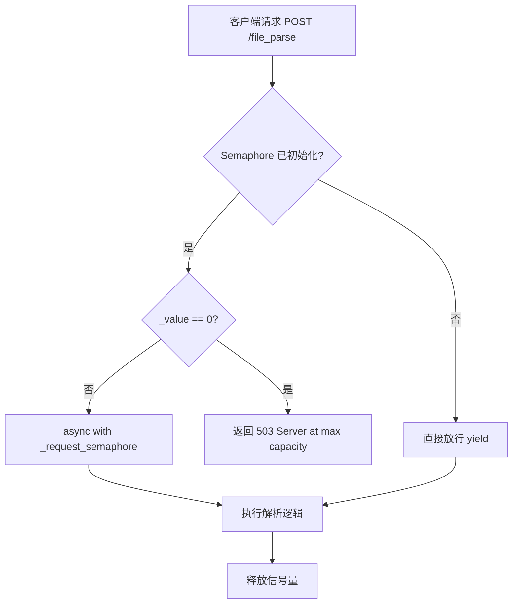
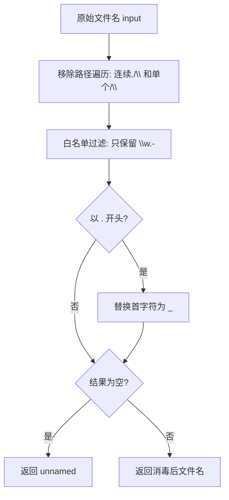
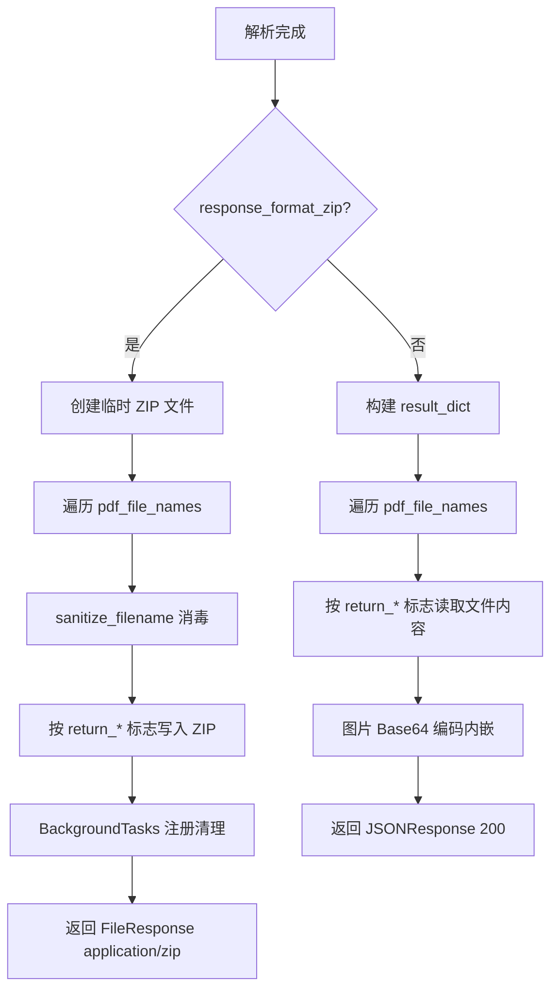

# PD-356.01 MinerU — FastAPI 双入口多格式响应与信号量并发控制

> 文档编号：PD-356.01
> 来源：MinerU `mineru/cli/fast_api.py`, `mineru/cli/gradio_app.py`, `mineru/cli/common.py`
> GitHub：https://github.com/opendatalab/MinerU.git
> 问题域：PD-356 API设计模式 API Design Patterns
> 状态：可复用方案

---

## 第 1 章 问题与动机

### 1.1 核心问题

文档解析类 AI 服务需要同时服务两类消费者：**程序化调用**（CI/CD 管线、后端服务间调用）和**人工交互**（研究员在浏览器中上传 PDF 查看结果）。单一入口无法同时满足两者的体验需求——REST API 需要结构化 JSON 响应和批量上传能力，而 Web UI 需要实时预览、LaTeX 渲染和文件下载。

此外，文档解析是 GPU 密集型任务，单次请求可能占用数十秒甚至数分钟的推理时间。如果不做并发控制，少量大文件请求就能耗尽服务器资源，导致后续请求全部超时。API 层需要一个轻量级的流量阀门，在不引入外部中间件（如 Nginx、Redis）的前提下实现请求级并发限制。

同时，文件上传场景天然面临安全风险：路径遍历攻击可通过构造恶意文件名（如 `../../etc/passwd`）突破目录隔离；临时文件如果不及时清理会导致磁盘泄漏。API 层必须在文件名处理和生命周期管理上做好防御。

### 1.2 MinerU 的解法概述

MinerU 采用 **FastAPI + Gradio 双入口架构**，共享同一套核心解析引擎（`mineru/cli/common.py:486` 的 `aio_do_parse`），通过以下 5 个关键设计解决上述问题：

1. **JSON/ZIP 双格式响应**：通过 `response_format_zip` 布尔参数在同一端点切换 `JSONResponse` 和 `FileResponse`（`fast_api.py:190-191`、`fast_api.py:273-415`）
2. **asyncio.Semaphore 并发控制**：环境变量驱动的信号量 + FastAPI Depends 注入，超限时直接返回 503（`fast_api.py:31-46`）
3. **BackgroundTasks 临时文件清理**：利用 FastAPI 内置的后台任务机制，在响应发送后自动清理临时目录和 ZIP 文件（`fast_api.py:207`、`fast_api.py:276`）
4. **正则双层文件名消毒**：先剥离路径遍历字符，再白名单过滤非法字符，最后禁止隐藏文件（`fast_api.py:83-93`）
5. **GZip 中间件压缩**：对超过 1000 字节的响应自动 GZip 压缩，减少 JSON 大文本传输体积（`fast_api.py:76`）

### 1.3 设计思想

| 设计原则 | 具体实现 | 理由 | 替代方案 |
|----------|----------|------|----------|
| 单端点多格式 | `response_format_zip` 参数切换 JSON/ZIP | 避免维护两个端点的逻辑分叉，客户端按需选择 | 独立 `/parse/json` 和 `/parse/zip` 端点 |
| 进程内并发控制 | `asyncio.Semaphore` + `Depends` 注入 | 零外部依赖，适合单机 GPU 服务器场景 | Redis 分布式限流、Nginx rate limit |
| 延迟清理 | `BackgroundTasks.add_task(cleanup_file, ...)` | 确保响应先发送再清理，避免 FileResponse 读取已删除文件 | cron 定时清理、tmpwatch |
| 防御性文件名 | 正则双层消毒 + 隐藏文件禁止 | 防止路径遍历和 dotfile 注入，保留 Unicode 文件名 | `werkzeug.secure_filename`（不支持 Unicode） |
| 共享解析核心 | `aio_do_parse` 同时服务 FastAPI 和 Gradio | 避免逻辑重复，确保两个入口行为一致 | 各入口独立实现解析逻辑 |

---

## 第 2 章 源码实现分析

### 2.1 架构概览

MinerU 的 API 层采用三层架构：入口层（FastAPI/Gradio）→ 共享解析层（common.py）→ 后端引擎层（pipeline/vlm/hybrid）。

```
┌─────────────────────────────────────────────────────────────┐
│                      客户端 / 浏览器                          │
└──────────┬──────────────────────────────┬───────────────────┘
           │ POST /file_parse             │ Gradio Web UI
           ▼                              ▼
┌─────────────────────┐    ┌─────────────────────────┐
│   FastAPI App        │    │   Gradio Blocks App      │
│  ┌───────────────┐  │    │  ┌───────────────────┐  │
│  │ GZipMiddleware│  │    │  │ i18n (中/英)       │  │
│  │ Semaphore     │  │    │  │ LaTeX 渲染         │  │
│  │ sanitize_fn   │  │    │  │ PDF 预览           │  │
│  │ BackgroundTask│  │    │  │ Base64 图片内嵌     │  │
│  └───────────────┘  │    │  └───────────────────┘  │
│  JSON ←→ ZIP 双响应  │    │  Markdown + ZIP 下载    │
└──────────┬──────────┘    └──────────┬──────────────┘
           │                          │
           ▼                          ▼
┌─────────────────────────────────────────────────────┐
│              common.py: aio_do_parse / do_parse      │
│  ┌──────────┐  ┌──────────┐  ┌──────────────────┐  │
│  │ pipeline │  │   vlm    │  │     hybrid        │  │
│  │ (同步)   │  │ (异步)   │  │   (异步)          │  │
│  └──────────┘  └──────────┘  └──────────────────┘  │
└─────────────────────────────────────────────────────┘
```

### 2.2 核心实现

#### 2.2.1 信号量并发控制



对应源码 `mineru/cli/fast_api.py:30-46`：

```python
# 并发控制器
_request_semaphore: Optional[asyncio.Semaphore] = None

# 并发控制依赖函数
async def limit_concurrency():
    if _request_semaphore is not None:
        # 检查信号量是否已用尽，如果是则拒绝请求
        if _request_semaphore._value == 0:
            raise HTTPException(
                status_code=503,
                detail=f"Server is at maximum capacity: {os.getenv('MINERU_API_MAX_CONCURRENT_REQUESTS', 'unset')}. Please try again later.",
            )
        async with _request_semaphore:
            yield
    else:
        yield
```

信号量在 `create_app()` 中通过环境变量初始化（`fast_api.py:63-74`）：

```python
def create_app():
    # ...
    global _request_semaphore
    try:
        max_concurrent_requests = int(
            os.getenv("MINERU_API_MAX_CONCURRENT_REQUESTS", "0")
        )
    except ValueError:
        max_concurrent_requests = 0

    if max_concurrent_requests > 0:
        _request_semaphore = asyncio.Semaphore(max_concurrent_requests)
        logger.info(f"Request concurrency limited to {max_concurrent_requests}")

    app.add_middleware(GZipMiddleware, minimum_size=1000)
    return app
```

关键设计：先检查 `_value == 0` 快速拒绝，而不是让请求排队等待。这避免了请求堆积导致的超时雪崩。

#### 2.2.2 文件名消毒与路径遍历防护



对应源码 `mineru/cli/fast_api.py:83-93`：

```python
def sanitize_filename(filename: str) -> str:
    """
    格式化压缩文件的文件名
    移除路径遍历字符, 保留 Unicode 字母、数字、._-
    禁止隐藏文件
    """
    sanitized = re.sub(r"[/\\.]{2,}|[/\\]", "", filename)
    sanitized = re.sub(r"[^\w.-]", "_", sanitized, flags=re.UNICODE)
    if sanitized.startswith("."):
        sanitized = "_" + sanitized[1:]
    return sanitized or "unnamed"
```

双层正则策略：第一层 `[/\\.]{2,}|[/\\]` 消除所有路径分隔符和 `..` 序列；第二层 `[^\w.-]` 用 `re.UNICODE` 标志保留多语言字符（中文、日文等文件名），同时过滤掉 shell 特殊字符。

#### 2.2.3 JSON/ZIP 双格式响应



对应源码 `mineru/cli/fast_api.py:272-415`，ZIP 分支的关键代码：

```python
if response_format_zip:
    zip_fd, zip_path = tempfile.mkstemp(suffix=".zip", prefix="mineru_results_")
    os.close(zip_fd)
    background_tasks.add_task(cleanup_file, zip_path)

    with zipfile.ZipFile(zip_path, "w", compression=zipfile.ZIP_DEFLATED) as zf:
        for pdf_name in pdf_file_names:
            safe_pdf_name = sanitize_filename(pdf_name)
            # ... 按 return_md/return_middle_json/return_images 等标志写入
            if return_md:
                path = os.path.join(parse_dir, f"{pdf_name}.md")
                if os.path.exists(path):
                    zf.write(path, arcname=os.path.join(safe_pdf_name, f"{safe_pdf_name}.md"))

    return FileResponse(path=zip_path, media_type="application/zip", filename="results.zip")
```

### 2.3 实现细节

**BackgroundTasks 双重清理**：每次请求注册两个清理任务——`unique_dir`（解析输出目录，`fast_api.py:207`）和 `zip_path`（临时 ZIP 文件，`fast_api.py:276`）。`cleanup_file` 函数（`fast_api.py:96-105`）同时处理文件和目录：

```python
def cleanup_file(file_path: str) -> None:
    try:
        if os.path.exists(file_path):
            if os.path.isfile(file_path):
                os.remove(file_path)
            elif os.path.isdir(file_path):
                shutil.rmtree(file_path)
    except Exception as e:
        logger.warning(f"fail clean file {file_path}: {e}")
```

**按需返回字段**：API 通过 6 个布尔 Form 参数（`return_md`、`return_middle_json`、`return_model_output`、`return_content_list`、`return_images`、`response_format_zip`）让客户端精确控制返回内容，避免传输不需要的大体积数据（如 model_output JSON 可达数十 MB）。

**OpenAPI 文档可控**：通过环境变量 `MINERU_API_ENABLE_FASTAPI_DOCS` 控制 `/docs`、`/redoc`、`/openapi.json` 端点的开关（`fast_api.py:50-61`），生产环境可关闭以减少攻击面。

**Gradio 入口的差异化**：Gradio 端（`gradio_app.py:112-132`）将图片 Base64 内嵌到 Markdown 中以支持浏览器直接渲染，而 FastAPI 端在 JSON 模式下也做 Base64 编码（`fast_api.py:401-405`），在 ZIP 模式下则保留原始图片文件。


---

## 第 3 章 迁移指南

### 3.1 迁移清单

**阶段 1：基础 API 骨架**
- [ ] 创建 FastAPI app，添加 GZipMiddleware
- [ ] 实现 `sanitize_filename` 文件名消毒函数
- [ ] 实现 `cleanup_file` 通用清理函数
- [ ] 定义文件上传端点，使用 `UploadFile` + `Form` 参数

**阶段 2：双格式响应**
- [ ] 添加 `response_format_zip` 参数
- [ ] 实现 JSON 分支：构建结构化响应字典
- [ ] 实现 ZIP 分支：`tempfile.mkstemp` + `zipfile.ZipFile`
- [ ] 注册 `BackgroundTasks` 清理临时文件

**阶段 3：并发控制**
- [ ] 添加 `asyncio.Semaphore` 全局变量
- [ ] 实现 `limit_concurrency` 依赖函数
- [ ] 通过环境变量配置最大并发数
- [ ] 端点添加 `dependencies=[Depends(limit_concurrency)]`

**阶段 4：Gradio 双入口（可选）**
- [ ] 创建 Gradio Blocks 界面，复用核心解析函数
- [ ] 添加 i18n 支持
- [ ] 配置 `api_name` 控制 Gradio API 暴露

### 3.2 适配代码模板

以下是一个可直接运行的最小化双格式响应 + 并发控制模板：

```python
import asyncio
import os
import re
import shutil
import tempfile
import uuid
import zipfile
from typing import List, Optional

from fastapi import BackgroundTasks, Depends, FastAPI, File, Form, HTTPException, UploadFile
from fastapi.middleware.gzip import GZipMiddleware
from fastapi.responses import FileResponse, JSONResponse

# ── 并发控制 ──────────────────────────────────────────
_semaphore: Optional[asyncio.Semaphore] = None


def create_app() -> FastAPI:
    global _semaphore
    app = FastAPI()
    app.add_middleware(GZipMiddleware, minimum_size=1000)

    max_concurrent = int(os.getenv("MAX_CONCURRENT_REQUESTS", "0"))
    if max_concurrent > 0:
        _semaphore = asyncio.Semaphore(max_concurrent)
    return app


app = create_app()


async def limit_concurrency():
    """FastAPI 依赖：信号量并发控制，超限返回 503"""
    if _semaphore is not None:
        if _semaphore._value == 0:
            raise HTTPException(status_code=503, detail="Server at max capacity")
        async with _semaphore:
            yield
    else:
        yield


# ── 安全工具 ──────────────────────────────────────────
def sanitize_filename(filename: str) -> str:
    """双层正则消毒：移除路径遍历 + 白名单过滤 + 禁止隐藏文件"""
    sanitized = re.sub(r"[/\\.]{2,}|[/\\]", "", filename)
    sanitized = re.sub(r"[^\w.-]", "_", sanitized, flags=re.UNICODE)
    if sanitized.startswith("."):
        sanitized = "_" + sanitized[1:]
    return sanitized or "unnamed"


def cleanup_path(path: str) -> None:
    """清理文件或目录，静默处理异常"""
    try:
        if os.path.isfile(path):
            os.remove(path)
        elif os.path.isdir(path):
            shutil.rmtree(path)
    except OSError:
        pass


# ── 核心端点 ──────────────────────────────────────────
@app.post("/parse", dependencies=[Depends(limit_concurrency)])
async def parse_files(
    background_tasks: BackgroundTasks,
    files: List[UploadFile] = File(...),
    response_format_zip: bool = Form(False),
):
    work_dir = os.path.join(tempfile.gettempdir(), str(uuid.uuid4()))
    os.makedirs(work_dir, exist_ok=True)
    background_tasks.add_task(cleanup_path, work_dir)

    results = {}
    for f in files:
        content = await f.read()
        safe_name = sanitize_filename(f.filename or "unnamed")
        out_path = os.path.join(work_dir, safe_name)
        with open(out_path, "wb") as fp:
            fp.write(content)
        # --- 在此调用你的核心处理逻辑 ---
        results[safe_name] = {"size": len(content), "status": "processed"}

    if response_format_zip:
        zip_fd, zip_path = tempfile.mkstemp(suffix=".zip")
        os.close(zip_fd)
        background_tasks.add_task(cleanup_path, zip_path)
        with zipfile.ZipFile(zip_path, "w", zipfile.ZIP_DEFLATED) as zf:
            for name in os.listdir(work_dir):
                zf.write(os.path.join(work_dir, name), arcname=name)
        return FileResponse(zip_path, media_type="application/zip", filename="results.zip")

    return JSONResponse(content={"results": results})
```

### 3.3 适用场景

| 场景 | 适用度 | 说明 |
|------|--------|------|
| GPU 推理服务（文档解析、图像生成） | ⭐⭐⭐ | 信号量控制 GPU 并发，双格式满足 API 和人工消费 |
| 文件转换微服务（PDF→Markdown、格式转换） | ⭐⭐⭐ | 临时文件清理和 ZIP 打包是核心需求 |
| 内部工具 API（同时需要 Web UI） | ⭐⭐⭐ | FastAPI + Gradio 双入口模式直接适用 |
| 高并发公网 API（>1000 QPS） | ⭐ | 进程内信号量不适合分布式场景，需要 Redis 限流 |
| 无文件上传的纯 JSON API | ⭐ | 文件名消毒和 ZIP 响应不适用 |

---

## 第 4 章 测试用例

```python
import os
import re
import zipfile
import tempfile
import pytest
from unittest.mock import AsyncMock, patch


# ── 测试 sanitize_filename ──────────────────────────
def sanitize_filename(filename: str) -> str:
    sanitized = re.sub(r"[/\\.]{2,}|[/\\]", "", filename)
    sanitized = re.sub(r"[^\w.-]", "_", sanitized, flags=re.UNICODE)
    if sanitized.startswith("."):
        sanitized = "_" + sanitized[1:]
    return sanitized or "unnamed"


class TestSanitizeFilename:
    def test_normal_filename(self):
        assert sanitize_filename("report.pdf") == "report.pdf"

    def test_path_traversal(self):
        result = sanitize_filename("../../etc/passwd")
        assert "/" not in result
        assert ".." not in result

    def test_unicode_preserved(self):
        result = sanitize_filename("报告_2024.pdf")
        assert "报告" in result
        assert result.endswith(".pdf")

    def test_hidden_file_blocked(self):
        result = sanitize_filename(".htaccess")
        assert not result.startswith(".")

    def test_empty_returns_unnamed(self):
        assert sanitize_filename("///") == "unnamed"

    def test_backslash_traversal(self):
        result = sanitize_filename("..\\..\\windows\\system32")
        assert "\\" not in result

    def test_shell_special_chars(self):
        result = sanitize_filename("file;rm -rf /.pdf")
        assert ";" not in result
        assert " " not in result


# ── 测试 cleanup_file ───────────────────────────────
class TestCleanupFile:
    def test_cleanup_file(self):
        fd, path = tempfile.mkstemp()
        os.close(fd)
        assert os.path.exists(path)
        # 模拟 cleanup
        os.remove(path)
        assert not os.path.exists(path)

    def test_cleanup_directory(self):
        import shutil
        d = tempfile.mkdtemp()
        assert os.path.exists(d)
        shutil.rmtree(d)
        assert not os.path.exists(d)

    def test_cleanup_nonexistent_silent(self):
        """清理不存在的路径不应抛异常"""
        # 不应抛出异常
        path = "/tmp/nonexistent_" + os.urandom(8).hex()
        assert not os.path.exists(path)


# ── 测试并发控制逻辑 ────────────────────────────────
class TestConcurrencyControl:
    def test_semaphore_zero_rejects(self):
        """信号量耗尽时应返回 503"""
        import asyncio
        sem = asyncio.Semaphore(1)
        # 模拟占用
        sem._value = 0
        assert sem._value == 0  # 应触发 503 逻辑

    def test_semaphore_none_passthrough(self):
        """未配置信号量时应直接放行"""
        sem = None
        assert sem is None  # limit_concurrency 中 yield 分支
```


---

## 第 5 章 跨域关联

| 关联域 | 关系类型 | 说明 |
|--------|----------|------|
| PD-03 容错与重试 | 协同 | 信号量 503 拒绝是容错的第一道防线，客户端需配合重试策略 |
| PD-04 工具系统 | 协同 | MinerU 的 MCP Server（`projects/mcp/src/mineru/server.py`）将 FastAPI 能力暴露为 MCP 工具，API 设计直接影响工具定义 |
| PD-05 沙箱隔离 | 依赖 | `sanitize_filename` 和 UUID 目录隔离是轻量级沙箱，防止文件间交叉污染 |
| PD-11 可观测性 | 协同 | API 响应中包含 `version` 和 `backend` 字段（`fast_api.py:412-413`），便于客户端追踪服务版本 |

---

## 第 6 章 来源文件索引

| 文件 | 行范围 | 关键实现 |
|------|--------|----------|
| `mineru/cli/fast_api.py` | L30-46 | asyncio.Semaphore 并发控制 + limit_concurrency 依赖 |
| `mineru/cli/fast_api.py` | L49-77 | create_app 工厂：环境变量驱动文档开关 + GZip 中间件 |
| `mineru/cli/fast_api.py` | L83-93 | sanitize_filename 双层正则消毒 |
| `mineru/cli/fast_api.py` | L96-105 | cleanup_file 文件/目录通用清理 |
| `mineru/cli/fast_api.py` | L125-420 | parse_pdf 核心端点：多文件上传 + JSON/ZIP 双响应 |
| `mineru/cli/fast_api.py` | L190-198 | 6 个布尔 Form 参数控制返回内容粒度 |
| `mineru/cli/gradio_app.py` | L26-61 | Gradio 入口 parse_pdf：共享 aio_do_parse |
| `mineru/cli/gradio_app.py` | L93-109 | replace_image_with_base64：Markdown 图片 Base64 内嵌 |
| `mineru/cli/gradio_app.py` | L173-176 | safe_stem：文件名安全处理（正则白名单） |
| `mineru/cli/common.py` | L486-555 | aio_do_parse：异步解析入口，backend 路由分发 |
| `mineru/cli/common.py` | L32-43 | read_fn：文件读取 + 图片自动转 PDF |
| `projects/mcp/src/mineru/server.py` | L23-33 | FastMCP 服务器：MCP 协议暴露解析能力 |
| `projects/mineru_tianshu/api_server.py` | L242-297 | Tianshu 企业版：异步任务队列 + 流式文件写入 |

---

## 第 7 章 横向对比维度

```json comparison_data
{
  "project": "MinerU",
  "dimensions": {
    "API框架": "FastAPI + Gradio 双入口，共享 aio_do_parse 核心",
    "响应格式": "JSON/ZIP 双格式，6 个布尔参数按需控制返回字段",
    "并发控制": "asyncio.Semaphore 进程内信号量，环境变量配置，超限 503 快速拒绝",
    "文件安全": "双层正则消毒 + 隐藏文件禁止 + UUID 目录隔离",
    "临时文件管理": "BackgroundTasks 延迟清理，响应发送后自动删除",
    "文档开关": "环境变量控制 OpenAPI/docs/redoc 端点暴露",
    "压缩策略": "GZipMiddleware 1000 字节阈值 + ZIP_DEFLATED 打包"
  }
}
```

### 域元数据补充

```json domain_metadata
{
  "solution_summary": "MinerU 用 FastAPI+Gradio 双入口共享 aio_do_parse 核心，通过 asyncio.Semaphore 信号量并发控制、JSON/ZIP 双格式响应和双层正则文件名消毒实现安全高效的文档解析 API",
  "description": "API 层需要同时解决并发控制、响应格式协商和文件上传安全三个正交问题",
  "sub_problems": [
    "进程内并发限流与 503 快速拒绝",
    "OpenAPI 文档端点的生产环境安全管控",
    "双入口（REST+WebUI）共享核心逻辑的架构设计"
  ],
  "best_practices": [
    "用 asyncio.Semaphore + Depends 注入实现零外部依赖的并发控制",
    "BackgroundTasks 延迟清理确保 FileResponse 先发送再删除临时文件",
    "环境变量控制 OpenAPI 文档暴露减少生产环境攻击面"
  ]
}
```

