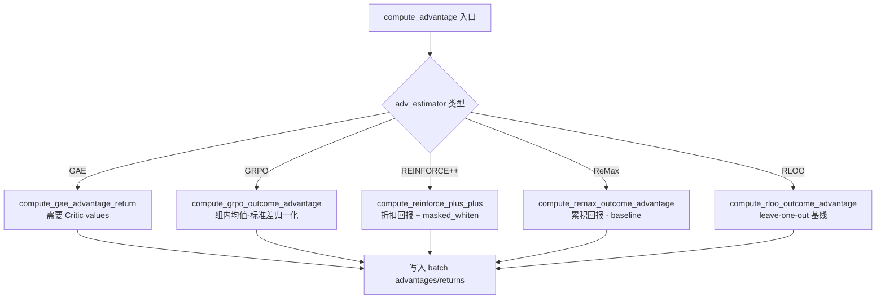
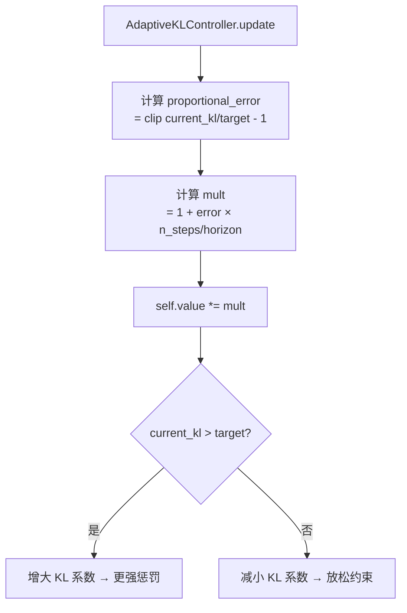
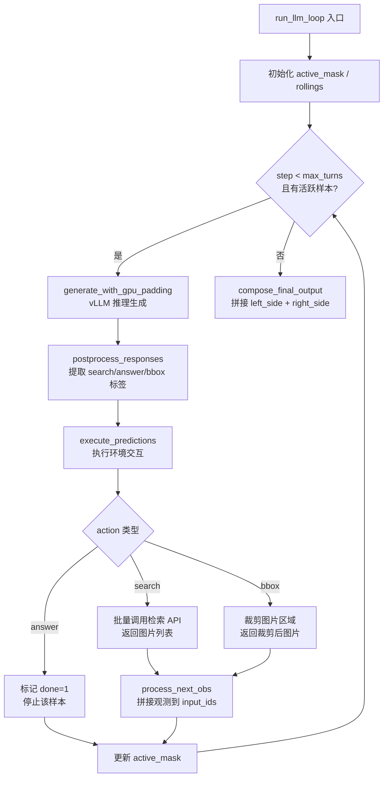

# PD-357.01 VRAG — verl 框架 GRPO 多策略优势估计与 Agent-Rollout 训练管道

> 文档编号：PD-357.01
> 来源：VRAG-RL `verl/trainer/ppo/core_algos.py`, `verl/trainer/ppo/ray_trainer.py`, `vrag_agent/generation.py`
> GitHub：https://github.com/Alibaba-NLP/VRAG.git
> 问题域：PD-357 强化学习训练框架 Reinforcement Learning Training Framework
> 状态：可复用方案

---

## 第 1 章 问题与动机（Problem & Motivation）

### 1.1 核心问题

在视觉 RAG（Retrieval-Augmented Generation）场景中，训练一个能够自主执行多轮搜索-推理-回答循环的 VLM Agent，面临三个核心挑战：

1. **优势估计算法选择**：不同的 RL 算法（PPO/GRPO/RLOO/REINFORCE++/ReMax）对 outcome-level reward 的处理方式截然不同。GRPO 通过同一 prompt 的多个采样做组内归一化，RLOO 用 leave-one-out 基线，GAE 需要额外的 Critic 网络。选错算法会导致训练不稳定或收敛缓慢。

2. **多轮 Agent Rollout 与 RL 训练的融合**：传统 RLHF 是单轮生成 → 打分 → 更新。但 VRAG 的 Agent 需要在每轮生成后执行搜索动作、获取检索图片、裁剪图片等环境交互，再继续生成。这种多轮 rollout 必须无缝嵌入 PPO 训练循环。

3. **分布式训练中的资源编排**：Actor、Rollout（vLLM 推理）、Critic、RefPolicy 四个角色需要在 Ray 集群上共享 GPU 资源池，同时支持 FSDP 和 Megatron 两种并行后端。

### 1.2 VRAG 的解法概述

VRAG-RL 基于字节跳动的 verl 框架，构建了一套完整的 GRPO/PPO 训练管道：

1. **五种优势估计器统一接口** — `core_algos.py` 实现 GAE/GRPO/REINFORCE++/ReMax/RLOO 五种算法，通过 `AdvantageEstimator` 枚举类在 `compute_advantage()` 中统一调度（`ray_trainer.py:169-238`）
2. **自适应 KL 控制器** — `AdaptiveKLController` 基于比例误差动态调整 KL 惩罚系数，支持 fixed/adaptive 两种模式（`core_algos.py:28-67`）
3. **多轮 Agent Rollout 循环** — `LLMGenerationManager.run_llm_loop()` 实现 search/answer/bbox 三种动作的环境交互循环，每轮生成后解析动作、执行检索、拼接观测（`generation.py:372-511`）
4. **Ray 资源池编排** — `ResourcePoolManager` 管理 GPU 资源分配，`create_colocated_worker_cls` 将 Actor+Rollout 共置于同一进程（`ray_trainer.py:74-131`）
5. **混合奖励函数** — `RMManager` 结合规则评分（ANLS）+ LLM-as-Judge + NDCG 检索质量三维奖励（`rm.py:123-348`）

### 1.3 设计思想

| 设计原则 | 具体实现 | 理由 | 替代方案 |
|----------|----------|------|----------|
| 策略模式选择优势估计 | `AdvantageEstimator` 枚举 + `compute_advantage()` 分发 | 不同场景需要不同算法，GRPO 无需 Critic 降低资源开销 | 硬编码单一算法 |
| KL 惩罚自适应 | 比例误差控制器，clip 在 [-0.2, 0.2] | 固定 KL 系数在训练后期可能过大或过小 | 固定系数 / 手动调参 |
| 环境交互嵌入训练循环 | `run_llm_loop` 在 rollout 阶段执行多轮 search/crop | Agent 需要与检索引擎交互才能获得完整轨迹 | 离线生成轨迹后再训练 |
| 资源共置 | Actor+Rollout 共享 GPU，通过 hybrid_engine 切换 | 减少 GPU 间数据传输，vLLM 可更好估算 KV cache | 独立进程分配 |
| 三维奖励组合 | 0.7×LLM-Judge + 0.1×ANLS + 0.2×NDCG | 单一指标无法全面评估 RAG Agent 质量 | 仅用准确率 |

---

## 第 2 章 源码实现分析（Source Code Analysis）

### 2.1 架构概览

VRAG-RL 的训练管道由四层组成：

```
┌─────────────────────────────────────────────────────────────────┐
│                    RayPPOTrainer.fit() 主循环                     │
│  ┌──────────┐  ┌──────────────────┐  ┌────────────┐  ┌────────┐ │
│  │DataLoader│→│LLMGenerationMgr  │→│ RewardMgr  │→│ Update │ │
│  │(Parquet) │  │(多轮Agent Rollout)│  │(三维奖励)   │  │(PPO)   │ │
│  └──────────┘  └──────────────────┘  └────────────┘  └────────┘ │
├─────────────────────────────────────────────────────────────────┤
│              core_algos.py — 优势估计 & KL 控制                    │
│  ┌─────┐ ┌──────┐ ┌──────────────┐ ┌───────┐ ┌──────┐          │
│  │ GAE │ │ GRPO │ │REINFORCE++   │ │ ReMax │ │ RLOO │          │
│  └─────┘ └──────┘ └──────────────┘ └───────┘ └──────┘          │
├─────────────────────────────────────────────────────────────────┤
│           Ray ResourcePoolManager — 分布式资源编排                  │
│  ┌──────────────┐  ┌────────┐  ┌───────────┐  ┌─────┐          │
│  │ActorRollout  │  │Critic  │  │ RefPolicy │  │ RM  │          │
│  │(FSDP/Megatron)│ │(可选)   │  │(可选)      │  │(可选)│          │
│  └──────────────┘  └────────┘  └───────────┘  └─────┘          │
└─────────────────────────────────────────────────────────────────┘
```

### 2.2 核心实现

#### 2.2.1 五种优势估计器



对应源码 `verl/trainer/ppo/core_algos.py:110-154`（GRPO 优势估计）：

```python
def compute_grpo_outcome_advantage(token_level_rewards: torch.Tensor,
                                   eos_mask: torch.Tensor,
                                   index: torch.Tensor,
                                   epsilon: float = 1e-6):
    response_length = token_level_rewards.shape[-1]
    scores = token_level_rewards.sum(dim=-1)

    id2score = defaultdict(list)
    id2mean = {}
    id2std = {}

    with torch.no_grad():
        bsz = scores.shape[0]
        for i in range(bsz):
            id2score[index[i]].append(scores[i])
        for idx in id2score:
            if len(id2score[idx]) == 1:
                id2mean[idx] = torch.tensor(0.0)
                id2std[idx] = torch.tensor(1.0)
            elif len(id2score[idx]) > 1:
                id2mean[idx] = torch.mean(torch.tensor(id2score[idx]))
                id2std[idx] = torch.std(torch.tensor([id2score[idx]]))
        for i in range(bsz):
            scores[i] = (scores[i] - id2mean[index[i]]) / (id2std[index[i]] + epsilon)
        scores = scores.unsqueeze(-1).tile([1, response_length]) * eos_mask

    return scores, scores
```

关键设计：GRPO 通过 `index`（uid）将同一 prompt 的多个采样分组，计算组内均值和标准差进行归一化。当组内只有 1 个样本时，均值设为 0、标准差设为 1，避免除零。

#### 2.2.2 自适应 KL 控制器



对应源码 `verl/trainer/ppo/core_algos.py:28-43`：

```python
class AdaptiveKLController:
    def __init__(self, init_kl_coef, target_kl, horizon):
        self.value = init_kl_coef
        self.target = target_kl
        self.horizon = horizon

    def update(self, current_kl, n_steps):
        target = self.target
        proportional_error = np.clip(current_kl / target - 1, -0.2, 0.2)
        mult = 1 + proportional_error * n_steps / self.horizon
        self.value *= mult
```

clip 在 [-0.2, 0.2] 防止单步更新过大，`horizon` 控制调整速度。

#### 2.2.3 多轮 Agent Rollout 循环



对应源码 `vrag_agent/generation.py:372-511`（核心循环）：

```python
def run_llm_loop(self, gen_batch, initial_input_ids: torch.Tensor):
    original_left_side = {'input_ids': initial_input_ids}
    original_right_side = {'responses': initial_input_ids[:, []]}
    active_mask = torch.ones(gen_batch.batch['input_ids'].shape[0], dtype=torch.bool)
    rollings = gen_batch
    self.retrievaled_images = [[] for _ in range(gen_batch.batch['input_ids'].shape[0])]

    for step in range(self.config.max_turns):
        if not active_mask.sum():
            break
        rollings.batch = self.tensor_fn.cut_to_effective_len(
            rollings.batch, keys=['input_ids', 'attention_mask', 'position_ids'])
        rollings = self._raw_prompt_ids(rollings)
        active_mask = self.deactivate_batch(active_mask, rollings)
        if not active_mask.sum():
            break

        rollings_active = DataProto.from_dict(
            tensors={k: v[active_mask] for k, v in rollings.batch.items()},
            non_tensors={k: v[active_mask] for k, v in rollings.non_tensor_batch.items()})
        gen_output = self._generate_with_gpu_padding(rollings_active)
        responses_ids, responses_str = self._postprocess_responses(gen_output.batch['responses'])
        # ... execute_predictions → update_rolling_state → update_right_side
```

### 2.3 实现细节

**PPO 策略损失（Clipped Surrogate）** — `core_algos.py:272-303`：

标准 PPO clip 实现，ratio = exp(log_prob - old_log_prob)，双边 clip 后取 max 作为损失。同时计算 clip fraction 用于监控。

**State Masking（损失掩码）** — `ray_trainer.py:887-962`：

VRAG 在多轮对话中，用户轮（`<|im_start|>user...`）的 token 不应参与策略梯度更新。`_create_loss_mask` 通过正则匹配 user 标记位置，将对应 token 的 loss_mask 设为 0，只对 assistant 生成的 token 计算损失。

**GPU Padding 对齐** — `generation.py:267-342`：

多 GPU 推理时 batch_size 必须能被 GPU 数整除。`_generate_with_gpu_padding` 在不整除时填充 dummy 序列，推理后裁剪掉填充部分。

**混合奖励计算** — `rm.py:210-348`：

训练时奖励 = 0.7 × LLM-Judge（qwen-max 评判正确性）+ 0.1 × ANLS（编辑距离）+ 0.2 × NDCG（检索质量）。验证时仅用 LLM-Judge。`ThreadPoolExecutor` 并行调用 LLM 评判 API。


---

## 第 3 章 迁移指南（Migration Guide）

### 3.1 迁移清单

**阶段 1：核心算法层（1-2 天）**
- [ ] 移植 `core_algos.py` 中的五种优势估计函数
- [ ] 移植 `AdaptiveKLController` 和 `FixedKLController`
- [ ] 移植 `compute_policy_loss`（PPO clipped surrogate）和 `compute_value_loss`
- [ ] 确保 `verl_F.masked_whiten` / `masked_mean` 工具函数可用

**阶段 2：训练循环层（2-3 天）**
- [ ] 实现 `compute_advantage()` 统一调度函数
- [ ] 实现 `apply_kl_penalty()` KL 惩罚注入
- [ ] 实现训练主循环：rollout → reward → advantage → update_critic → update_actor
- [ ] 实现 checkpoint 保存/恢复（含 dataloader 状态）

**阶段 3：Agent Rollout 层（2-3 天）**
- [ ] 实现 `LLMGenerationManager` 多轮生成循环
- [ ] 实现 `execute_predictions` 环境交互（search/answer/bbox 动作解析）
- [ ] 实现 GPU padding 对齐逻辑
- [ ] 实现 state masking（用户轮 token 不参与梯度更新）

**阶段 4：奖励函数层（1 天）**
- [ ] 实现 `RMManager` 混合奖励（LLM-Judge + 规则 + 检索质量）
- [ ] 配置 LLM 评判 API（支持 DashScope / OpenAI 兼容接口）

### 3.2 适配代码模板

以下是一个可独立运行的优势估计器模板，支持 GRPO 和 RLOO 两种算法：

```python
import torch
import numpy as np
from enum import Enum
from collections import defaultdict
from typing import Tuple


class AdvantageEstimator(str, Enum):
    GRPO = 'grpo'
    RLOO = 'rloo'
    GAE = 'gae'


def masked_whiten(values: torch.Tensor, mask: torch.Tensor, eps: float = 1e-8) -> torch.Tensor:
    """对 mask 内的值做白化（均值0，方差1）"""
    masked_values = values * mask
    mean = masked_values.sum() / mask.sum().clamp(min=1)
    var = ((masked_values - mean * mask) ** 2 * mask).sum() / mask.sum().clamp(min=1)
    return (values - mean) / (var.sqrt() + eps) * mask


def compute_grpo_advantage(
    token_level_rewards: torch.Tensor,
    eos_mask: torch.Tensor,
    group_ids: np.ndarray,
    epsilon: float = 1e-6
) -> Tuple[torch.Tensor, torch.Tensor]:
    """
    GRPO 优势估计：同一 prompt 的多个采样做组内归一化。
    
    Args:
        token_level_rewards: (bs, response_length) token 级别奖励
        eos_mask: (bs, response_length) EOS 掩码
        group_ids: (bs,) 每个样本所属的 prompt 组 ID
    """
    response_length = token_level_rewards.shape[-1]
    scores = token_level_rewards.sum(dim=-1)  # (bs,)

    id2scores = defaultdict(list)
    with torch.no_grad():
        for i in range(scores.shape[0]):
            id2scores[group_ids[i]].append(scores[i])

        id2mean, id2std = {}, {}
        for gid, group_scores in id2scores.items():
            if len(group_scores) <= 1:
                id2mean[gid] = torch.tensor(0.0)
                id2std[gid] = torch.tensor(1.0)
            else:
                t = torch.tensor(group_scores)
                id2mean[gid] = t.mean()
                id2std[gid] = t.std()

        for i in range(scores.shape[0]):
            scores[i] = (scores[i] - id2mean[group_ids[i]]) / (id2std[group_ids[i]] + epsilon)

        advantages = scores.unsqueeze(-1).expand(-1, response_length) * eos_mask
    return advantages, advantages


class AdaptiveKLController:
    """自适应 KL 惩罚系数控制器"""
    def __init__(self, init_kl_coef: float = 0.1, target_kl: float = 0.01, horizon: int = 10000):
        self.value = init_kl_coef
        self.target = target_kl
        self.horizon = horizon

    def update(self, current_kl: float, n_steps: int):
        proportional_error = np.clip(current_kl / self.target - 1, -0.2, 0.2)
        mult = 1 + proportional_error * n_steps / self.horizon
        self.value *= mult
```

### 3.3 适用场景

| 场景 | 适用度 | 说明 |
|------|--------|------|
| 多轮 Agent RL 训练（RAG/Tool-Use） | ⭐⭐⭐ | 核心场景，多轮 rollout + 环境交互 + GRPO 完美匹配 |
| 单轮 RLHF（对话/摘要） | ⭐⭐⭐ | 五种优势估计器可直接复用，去掉 Agent 循环即可 |
| 视觉多模态 RL | ⭐⭐⭐ | 原生支持图片处理、裁剪、多模态 token 拼接 |
| 代码生成 RL（sandbox 验证） | ⭐⭐ | 需替换 execute_predictions 为沙箱执行 |
| 离线 RL / DPO | ⭐ | 架构面向在线 RL，离线场景需大幅改造 |

---

## 第 4 章 测试用例（Test Cases）

```python
import pytest
import torch
import numpy as np
from collections import defaultdict


class TestGRPOAdvantage:
    """测试 GRPO 优势估计算法"""

    def test_group_normalization(self):
        """同组内的优势应该均值接近 0"""
        rewards = torch.tensor([[0.0, 0.0, 1.0], [0.0, 0.0, 0.5], [0.0, 0.0, 0.8]])
        eos_mask = torch.tensor([[1, 1, 1], [1, 1, 1], [1, 1, 1]], dtype=torch.float)
        index = np.array(['g1', 'g1', 'g1'])

        advantages, _ = compute_grpo_outcome_advantage(rewards, eos_mask, index)
        # 同组内优势之和应接近 0
        group_adv_sum = advantages.sum(dim=0)[2]  # 最后一个 token 位置
        assert abs(group_adv_sum.item()) < 1e-4

    def test_single_sample_group(self):
        """单样本组的优势应为 0（均值=0, 标准差=1）"""
        rewards = torch.tensor([[0.0, 0.0, 1.0]])
        eos_mask = torch.tensor([[1, 1, 1]], dtype=torch.float)
        index = np.array(['g1'])

        advantages, _ = compute_grpo_outcome_advantage(rewards, eos_mask, index)
        # 单样本组，score = (1.0 - 0.0) / (1.0 + eps) ≈ 1.0
        assert advantages[0, 2].item() == pytest.approx(1.0, abs=0.01)

    def test_eos_mask_applied(self):
        """EOS 后的 token 优势应为 0"""
        rewards = torch.tensor([[0.0, 1.0, 0.0], [0.0, 0.5, 0.0]])
        eos_mask = torch.tensor([[1, 1, 0], [1, 1, 0]], dtype=torch.float)
        index = np.array(['g1', 'g1'])

        advantages, _ = compute_grpo_outcome_advantage(rewards, eos_mask, index)
        assert advantages[0, 2].item() == 0.0
        assert advantages[1, 2].item() == 0.0


class TestAdaptiveKLController:
    """测试自适应 KL 控制器"""

    def test_kl_above_target_increases_coef(self):
        """当前 KL > 目标时，系数应增大"""
        ctrl = AdaptiveKLController(init_kl_coef=0.1, target_kl=0.01, horizon=10000)
        old_value = ctrl.value
        ctrl.update(current_kl=0.05, n_steps=32)  # 5x target
        assert ctrl.value > old_value

    def test_kl_below_target_decreases_coef(self):
        """当前 KL < 目标时，系数应减小"""
        ctrl = AdaptiveKLController(init_kl_coef=0.1, target_kl=0.1, horizon=10000)
        old_value = ctrl.value
        ctrl.update(current_kl=0.01, n_steps=32)  # 0.1x target
        assert ctrl.value < old_value

    def test_clip_prevents_large_update(self):
        """clip 应防止单步更新过大"""
        ctrl = AdaptiveKLController(init_kl_coef=0.1, target_kl=0.001, horizon=100)
        ctrl.update(current_kl=100.0, n_steps=32)  # 极端情况
        # proportional_error 被 clip 到 0.2，mult = 1 + 0.2 * 32/100 = 1.064
        assert ctrl.value == pytest.approx(0.1 * 1.064, rel=0.01)


class TestPolicyLoss:
    """测试 PPO 策略损失"""

    def test_no_clip_when_ratio_near_one(self):
        """ratio ≈ 1 时不应触发 clip"""
        old_log_prob = torch.tensor([[0.0, -1.0, -2.0]])
        log_prob = torch.tensor([[0.01, -0.99, -1.99]])  # 接近 old
        advantages = torch.tensor([[1.0, 1.0, 1.0]])
        eos_mask = torch.ones(1, 3)

        loss, clipfrac, _ = compute_policy_loss(old_log_prob, log_prob, advantages, eos_mask, cliprange=0.2)
        assert clipfrac.item() == pytest.approx(0.0, abs=0.01)

    def test_degradation_with_zero_advantages(self):
        """优势全为 0 时损失应为 0"""
        old_log_prob = torch.tensor([[0.0, -1.0]])
        log_prob = torch.tensor([[-0.5, -1.5]])
        advantages = torch.zeros(1, 2)
        eos_mask = torch.ones(1, 2)

        loss, _, _ = compute_policy_loss(old_log_prob, log_prob, advantages, eos_mask, cliprange=0.2)
        assert loss.item() == pytest.approx(0.0, abs=1e-6)


# 辅助函数（从 core_algos.py 移植）
def compute_grpo_outcome_advantage(token_level_rewards, eos_mask, index, epsilon=1e-6):
    response_length = token_level_rewards.shape[-1]
    scores = token_level_rewards.sum(dim=-1)
    id2score = defaultdict(list)
    id2mean, id2std = {}, {}
    with torch.no_grad():
        bsz = scores.shape[0]
        for i in range(bsz):
            id2score[index[i]].append(scores[i])
        for idx in id2score:
            if len(id2score[idx]) == 1:
                id2mean[idx] = torch.tensor(0.0)
                id2std[idx] = torch.tensor(1.0)
            else:
                id2mean[idx] = torch.mean(torch.tensor(id2score[idx]))
                id2std[idx] = torch.std(torch.tensor([id2score[idx]]))
        for i in range(bsz):
            scores[i] = (scores[i] - id2mean[index[i]]) / (id2std[index[i]] + epsilon)
        scores = scores.unsqueeze(-1).tile([1, response_length]) * eos_mask
    return scores, scores


class AdaptiveKLController:
    def __init__(self, init_kl_coef, target_kl, horizon):
        self.value = init_kl_coef
        self.target = target_kl
        self.horizon = horizon
    def update(self, current_kl, n_steps):
        proportional_error = np.clip(current_kl / self.target - 1, -0.2, 0.2)
        mult = 1 + proportional_error * n_steps / self.horizon
        self.value *= mult


def masked_mean(values, mask, axis=None):
    return (values * mask).sum(axis=axis) / mask.sum(axis=axis).clamp(min=1)


def compute_policy_loss(old_log_prob, log_prob, advantages, eos_mask, cliprange):
    negative_approx_kl = log_prob - old_log_prob
    ratio = torch.exp(negative_approx_kl)
    pg_losses = -advantages * ratio
    pg_losses2 = -advantages * torch.clamp(ratio, 1.0 - cliprange, 1.0 + cliprange)
    pg_loss = masked_mean(torch.max(pg_losses, pg_losses2), eos_mask)
    pg_clipfrac = masked_mean(torch.gt(pg_losses2, pg_losses).float(), eos_mask)
    ppo_kl = masked_mean(-negative_approx_kl, eos_mask)
    return pg_loss, pg_clipfrac, ppo_kl
```


---

## 第 5 章 跨域关联（Cross-Domain Relations）

| 关联域 | 关系类型 | 说明 |
|--------|----------|------|
| PD-01 上下文管理 | 协同 | 多轮 rollout 中 `run_llm_loop` 持续拼接 input_ids，需要 `cut_to_effective_len` 和 `max_model_len` 截断防止上下文溢出 |
| PD-02 多 Agent 编排 | 协同 | `ResourcePoolManager` + Ray WorkerGroup 实现 Actor/Critic/Ref/RM 四角色编排，`create_colocated_worker_cls` 支持共置 |
| PD-03 容错与重试 | 依赖 | `RMManager.rm_score` 内置 max_retry=20 的重试循环调用 LLM-Judge API；`execute_predictions` 对无效动作返回错误提示而非崩溃 |
| PD-04 工具系统 | 协同 | Agent 的 search/answer/bbox 三种动作本质是工具调用，`postprocess_predictions` 解析 XML 标签提取动作和参数 |
| PD-07 质量检查 | 协同 | 三维奖励函数（LLM-Judge + ANLS + NDCG）本身就是质量评估体系，训练时实时评估每个 rollout 的质量 |
| PD-08 搜索与检索 | 依赖 | `execute_predictions` 中 search 动作调用外部检索 API（`self.config.search_url`），检索结果作为下一轮观测注入 |
| PD-11 可观测性 | 协同 | `_timer` 上下文管理器追踪每个阶段耗时，`compute_timing_metrics` / `compute_throughout_metrics` 计算吞吐量，支持 wandb/console 日志 |

---

## 第 6 章 来源文件索引（Source File Index）

| 文件 | 行范围 | 关键实现 |
|------|--------|----------|
| `VRAG-RL/verl/trainer/ppo/core_algos.py` | L28-67 | AdaptiveKLController / FixedKLController / get_kl_controller |
| `VRAG-RL/verl/trainer/ppo/core_algos.py` | L70-107 | compute_gae_advantage_return（GAE 优势估计） |
| `VRAG-RL/verl/trainer/ppo/core_algos.py` | L110-154 | compute_grpo_outcome_advantage（GRPO 组内归一化） |
| `VRAG-RL/verl/trainer/ppo/core_algos.py` | L157-199 | compute_rloo_outcome_advantage（RLOO leave-one-out） |
| `VRAG-RL/verl/trainer/ppo/core_algos.py` | L202-233 | compute_reinforce_plus_plus_outcome_advantage |
| `VRAG-RL/verl/trainer/ppo/core_algos.py` | L236-264 | compute_remax_outcome_advantage |
| `VRAG-RL/verl/trainer/ppo/core_algos.py` | L267-303 | compute_rewards / compute_policy_loss（PPO clipped surrogate） |
| `VRAG-RL/verl/trainer/ppo/core_algos.py` | L351-383 | kl_penalty（四种 KL 散度计算方式） |
| `VRAG-RL/verl/trainer/ppo/ray_trainer.py` | L50-71 | Role 枚举 / AdvantageEstimator 枚举 |
| `VRAG-RL/verl/trainer/ppo/ray_trainer.py` | L74-131 | ResourcePoolManager（Ray GPU 资源池管理） |
| `VRAG-RL/verl/trainer/ppo/ray_trainer.py` | L137-166 | apply_kl_penalty（KL 惩罚注入训练数据） |
| `VRAG-RL/verl/trainer/ppo/ray_trainer.py` | L169-238 | compute_advantage（五种估计器统一调度） |
| `VRAG-RL/verl/trainer/ppo/ray_trainer.py` | L248-311 | RayPPOTrainer.__init__（KL 控制器初始化 + Critic 开关） |
| `VRAG-RL/verl/trainer/ppo/ray_trainer.py` | L675-885 | RayPPOTrainer.fit（训练主循环） |
| `VRAG-RL/verl/trainer/ppo/ray_trainer.py` | L887-962 | _create_loss_mask（State Masking 用户轮掩码） |
| `VRAG-RL/vrag_agent/generation.py` | L44-52 | GenerationConfig 数据类 |
| `VRAG-RL/vrag_agent/generation.py` | L55-68 | LLMGenerationManager.__init__ |
| `VRAG-RL/vrag_agent/generation.py` | L267-342 | _generate_with_gpu_padding（多 GPU 对齐） |
| `VRAG-RL/vrag_agent/generation.py` | L372-511 | run_llm_loop（多轮 Agent Rollout 主循环） |
| `VRAG-RL/vrag_agent/generation.py` | L574-668 | execute_predictions / postprocess_predictions（动作解析与环境交互） |
| `VRAG-RL/verl/trainer/main_ppo.py` | L52-204 | main / TaskRunner（Hydra 配置 + Ray 初始化 + 训练启动） |
| `VRAG-RL/verl/workers/reward_manager/rm.py` | L123-348 | RMManager（三维混合奖励：LLM-Judge + ANLS + NDCG） |
| `VRAG-RL/verl/utils/reward_score/vrag.py` | L16-73 | compute_score / calculate_anls / compute_format_reward_only |
| `VRAG-RL/train_grpo_qwen2_5_vl_7b.sh` | L1-83 | 训练启动脚本（GRPO 配置 + FSDP offload + vLLM 推理） |

---

## 第 7 章 横向对比维度（Comparison Dimensions）

```json comparison_data
{
  "project": "VRAG",
  "dimensions": {
    "优势估计": "五种算法统一接口(GAE/GRPO/REINFORCE++/ReMax/RLOO)，枚举类分发",
    "KL散度控制": "AdaptiveKLController 比例误差控制 + clip[-0.2,0.2] + 四种KL计算方式",
    "奖励函数设计": "三维混合奖励: 0.7×LLM-Judge + 0.1×ANLS + 0.2×NDCG",
    "多轮rollout生成": "LLMGenerationManager 多轮search/answer/bbox环境交互循环",
    "分布式训练后端": "Ray ResourcePoolManager + FSDP/Megatron双后端 + Actor-Rollout共置",
    "状态掩码": "正则匹配user轮token位置，loss_mask排除非assistant生成内容",
    "GPU对齐策略": "dummy序列填充至GPU数整除，推理后裁剪"
  }
}
```

### 域元数据补充

```json domain_metadata
{
  "solution_summary": "VRAG基于verl框架实现五种优势估计器(GAE/GRPO/REINFORCE++/ReMax/RLOO)统一接口、自适应KL控制器、多轮Agent-Rollout环境交互循环与三维混合奖励(LLM-Judge+ANLS+NDCG)的完整GRPO训练管道",
  "description": "RL训练中多轮Agent环境交互与策略更新的端到端融合",
  "sub_problems": [
    "多轮rollout中用户轮token的损失掩码(State Masking)",
    "多GPU推理时batch对齐与dummy填充",
    "混合奖励函数的多维度组合权重设计"
  ],
  "best_practices": [
    "用枚举类+统一调度函数管理多种优势估计算法，避免硬编码",
    "自适应KL控制器用clip限制单步更新幅度防止训练崩溃",
    "Agent rollout中对无效动作返回错误提示而非终止，保持训练稳定"
  ]
}
```
