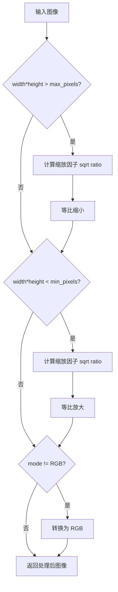
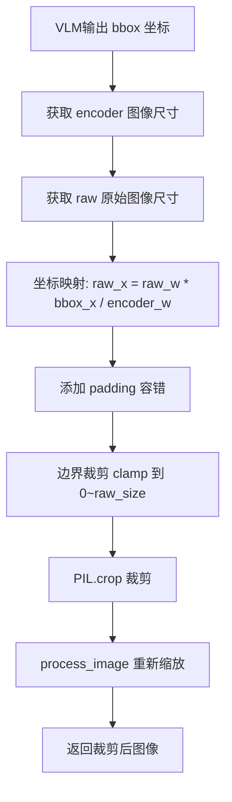

# PD-358.01 VRAG — 多模态图像处理管道与 Vision RAG 坐标映射

> 文档编号：PD-358.01
> 来源：VRAG `VRAG-RL/vrag_agent/generation.py`, `demo/vrag_agent.py`, `VRAG-RL/verl/utils/dataset/rl_dataset.py`
> GitHub：https://github.com/Alibaba-NLP/VRAG.git
> 问题域：PD-358 多模态处理 Multi-Modal Processing
> 状态：可复用方案

---

## 第 1 章 问题与动机

### 1.1 核心问题

Vision RAG（视觉检索增强生成）系统需要在多轮交互中动态处理图像：检索到的文档图像需要缩放到 VLM 可接受的像素范围、转换色彩空间、编码为 base64 传输、在 bbox 裁剪时完成 encoder 坐标到原始图像坐标的映射、将多张图像的 pixel_values 和 image_grid_thw 拼接到上下文中，以及为 Qwen2.5-VL 的 M-RoPE 正确计算 3D position_ids。

这些步骤中任何一个出错都会导致严重后果：像素过大引发 GPU OOM，坐标映射错误导致裁剪区域偏移，vision token 数量不匹配导致模型推理崩溃。

### 1.2 VRAG 的解法概述

1. **双范围像素约束**：`process_image()` 同时设置 max_pixels 和 min_pixels，通过 `sqrt(target/actual)` 等比缩放，确保图像始终落在安全像素区间（`generation.py:18-42`）
2. **三层图像处理架构**：RL 训练层（`rl_dataset.py:51-72`）、推理生成层（`generation.py:18-42`）、Demo 推理层（`vrag_agent.py:31-57`）各自实现 `process_image`，参数不同但逻辑一致
3. **Encoder→Raw 坐标映射**：bbox 裁剪时将 VLM encoder 输出的坐标按 `raw_size / encoder_size` 比例映射回原始图像，再加 padding 容错（`generation.py:133-142`, `vrag_agent.py:146-152`）
4. **增量式多图像上下文拼接**：`_concat_multi_modal_data()` 将新检索到的图像 pixel_values 和 image_grid_thw 通过 `torch.cat` 追加到 rolling state（`generation.py:191-213`）
5. **Vision Token 动态计算**：基于 `image_grid_thw.prod() // merge_size²` 公式计算每张图像的 token 数量，用 placeholder 替换后填充实际 image_token（`rl_dataset.py:174-186`, `generation.py:149,175`）

### 1.3 设计思想

| 设计原则 | 具体实现 | 理由 | 替代方案 |
|----------|----------|------|----------|
| 像素范围双向约束 | max_pixels + min_pixels 同时生效 | 太大 OOM，太小信息丢失 | 固定分辨率（丢失宽高比） |
| 等比缩放保持宽高比 | `sqrt(target/actual)` 计算缩放因子 | 避免图像变形 | 中心裁剪（丢失边缘信息） |
| 坐标系显式映射 | `raw_w * bbox_x / encoder_w` | encoder 和 raw 分辨率不同 | 归一化坐标 0-1（精度损失） |
| 增量拼接而非重建 | `torch.cat` 追加 pixel_values | 多轮交互中图像逐步增加 | 每轮重新处理所有图像（浪费算力） |
| 28×28 patch 对齐 | `512*28*28` 作为像素上限 | Qwen2.5-VL 的 patch_size=14, merge_size=2 | 任意像素值（token 数不整除） |

---

## 第 2 章 源码实现分析

### 2.1 架构概览

VRAG 的多模态处理分布在三个层次，形成从数据准备到推理生成的完整管道：

```
┌─────────────────────────────────────────────────────────────────┐
│                    VRAG 多模态处理架构                            │
├─────────────────────────────────────────────────────────────────┤
│                                                                 │
│  ┌──────────────┐    ┌──────────────────┐    ┌───────────────┐ │
│  │ RL Dataset   │    │ LLMGeneration    │    │ Demo VRAG     │ │
│  │ (训练数据)    │    │ Manager (RL推理) │    │ (API推理)     │ │
│  │              │    │                  │    │               │ │
│  │ process_image│    │ process_image    │    │ process_image │ │
│  │ max=2048²    │    │ max=512*28*28    │    │ max=512*28*28 │ │
│  │ min=512²     │    │ min=256*28*28    │    │ min=256*28*28 │ │
│  └──────┬───────┘    └────────┬─────────┘    └──────┬────────┘ │
│         │                     │                      │          │
│         ▼                     ▼                      ▼          │
│  ┌──────────────────────────────────────────────────────────┐  │
│  │              Qwen2.5-VL Image Processor                  │  │
│  │  image_grid_thw → merge_size² → vision token count       │  │
│  └──────────────────────────┬───────────────────────────────┘  │
│                             │                                   │
│                             ▼                                   │
│  ┌──────────────────────────────────────────────────────────┐  │
│  │              M-RoPE 3D Position IDs                      │  │
│  │  get_rope_index(processor, input_ids, image_grid_thw)    │  │
│  │  → (temporal, height, width) position encoding           │  │
│  └──────────────────────────────────────────────────────────┘  │
│                                                                 │
│  ┌──────────────────────────────────────────────────────────┐  │
│  │              Bbox 坐标映射 + 图像裁剪                     │  │
│  │  encoder coords → raw coords → crop → re-process         │  │
│  └──────────────────────────────────────────────────────────┘  │
└─────────────────────────────────────────────────────────────────┘
```

### 2.2 核心实现

#### 2.2.1 像素范围自适应缩放



对应源码 `VRAG-RL/vrag_agent/generation.py:18-42`：

```python
def process_image(image, max_pixels: int = 2048 * 2048, min_pixels: int = 512 * 512):
    import math
    from io import BytesIO
    from PIL import Image

    if isinstance(image, dict):
        image = Image.open(BytesIO(image['bytes']))
    elif isinstance(image, str):
        image = Image.open(image)

    if (image.width * image.height) > max_pixels:
        resize_factor = math.sqrt(max_pixels / (image.width * image.height))
        width, height = int(image.width * resize_factor), int(image.height * resize_factor)
        image = image.resize((width, height))

    if (image.width * image.height) < min_pixels:
        resize_factor = math.sqrt(min_pixels / (image.width * image.height))
        width, height = int(image.width * resize_factor), int(image.height * resize_factor)
        image = image.resize((width, height))

    if image.mode != 'RGB':
        image = image.convert('RGB')

    return image
```

关键设计：使用 `sqrt` 计算缩放因子确保面积约束而非单边约束，保持宽高比不变。RL 推理层使用 `512*28*28`（401408 像素）作为上限，与 Qwen2.5-VL 的 patch 大小对齐。

#### 2.2.2 Bbox 坐标系映射与图像裁剪



对应源码 `VRAG-RL/vrag_agent/generation.py:131-143`（RL 训练路径）：

```python
# crop 分支 — encoder 坐标到 raw 图像坐标的映射
latest_image = rollings.non_tensor_batch['multi_modal_data'][idx]['image'][-1]
width, height = latest_image.size  # encoder 处理后的尺寸
raw_images_crop = Image.open(self.retrievaled_images[idx][-1])
raw_width, raw_height = raw_images_crop.size  # 原始图像尺寸
if self.is_validation:
    obs_item = [obs_item[0]-28, obs_item[1]-28, obs_item[2]+28, obs_item[3]+28]
crop_area = [
    int(raw_width * obs_item[0] / width),    # x1 映射
    int(raw_height * obs_item[1] / height),   # y1 映射
    int(raw_width * obs_item[2] / width),     # x2 映射
    int(raw_height * obs_item[3] / height)    # y2 映射
]
crop_area = [max(0, crop_area[0]), max(0, crop_area[1]),
             min(raw_width, crop_area[2]), min(raw_height, crop_area[3])]
input_images_list = [raw_images_crop.crop(tuple(crop_area))]
raw_images_list = [process_image(image, 512*28*28, 256*28*28) for image in input_images_list]
```

Demo 推理路径 `demo/vrag_agent.py:146-154` 使用固定 padding=56 像素：

```python
crop_region_bbox = bbox[0] * raw_w / input_w, bbox[1] * raw_h / input_h, \
                   bbox[2] * raw_w / input_w, bbox[3] * raw_h / input_h
pad_size = 56
crop_region_bbox = [max(crop_region_bbox[0]-pad_size, 0),
                    max(crop_region_bbox[1]-pad_size, 0),
                    min(crop_region_bbox[2]+pad_size, raw_w),
                    min(crop_region_bbox[3]+pad_size, raw_h)]
```

### 2.3 实现细节

#### Vision Token 动态计算

Qwen2.5-VL 的 image_processor 将图像分割为 `(T, H, W)` 的 3D 网格（`image_grid_thw`），每个 patch 经过 `merge_size²` 合并后产生一个 vision token。计算公式：

```
vision_tokens = image_grid_thw[i].prod() // merge_size²
```

在 `rl_dataset.py:174-186` 中，这个计算用于将 `<image>` 占位符替换为精确数量的 `<|image_pad|>` token：

```python
merge_length = self.processor.image_processor.merge_size**2
index = 0
while '<image>' in prompt_with_chat_template:
    prompt_with_chat_template = prompt_with_chat_template.replace(
        '<image>',
        '<|vision_start|>' + '<|placeholder|>' * (image_grid_thw[index].prod() // merge_length) +
        '<|vision_end|>',
        1,
    )
    index += 1
prompt_with_chat_template = prompt_with_chat_template.replace(
    '<|placeholder|>', self.processor.image_token)
```

#### 增量式多图像上下文拼接

`_concat_multi_modal_data()` (`generation.py:191-213`) 在多轮交互中逐步追加图像数据：

```python
def _concat_multi_modal_data(self, rollings, next_obs_multi_modal_data, next_obs_multi_modal_inputs):
    if 'multi_modal_inputs' not in rollings.non_tensor_batch.keys():
        # 首次：初始化
        rollings.non_tensor_batch['multi_modal_inputs'] = np.empty(len(next_obs_multi_modal_data), dtype=object)
        for idx, item in enumerate(next_obs_multi_modal_inputs):
            rollings.non_tensor_batch['multi_modal_inputs'][idx] = item
        rollings.non_tensor_batch['multi_modal_data'] = np.array(next_obs_multi_modal_data, dtype=object)
    else:
        # 后续轮次：增量追加
        for idx, multi_modal_data_item in enumerate(next_obs_multi_modal_data):
            if len(multi_modal_data_item['image']) > 0:
                rollings.non_tensor_batch['multi_modal_data'][idx]['image'].extend(
                    multi_modal_data_item['image'])
                if 'pixel_values' in rollings.non_tensor_batch['multi_modal_inputs'][idx]:
                    rollings.non_tensor_batch['multi_modal_inputs'][idx]['pixel_values'] = torch.cat(
                        (rollings.non_tensor_batch['multi_modal_inputs'][idx]['pixel_values'],
                         next_obs_multi_modal_inputs[idx]['pixel_values']), dim=0)
                    rollings.non_tensor_batch['multi_modal_inputs'][idx]['image_grid_thw'] = torch.cat(
                        (rollings.non_tensor_batch['multi_modal_inputs'][idx]['image_grid_thw'],
                         next_obs_multi_modal_inputs[idx]['image_grid_thw']), dim=0)
    return rollings
```

#### M-RoPE 3D Position IDs

`get_rope_index()` (`verl/models/transformers/qwen2_vl.py:31-131`) 为 Qwen2.5-VL 的多模态旋转位置编码计算 3D position_ids `(temporal, height, width)`。对于图像 token，position_ids 按空间网格排列；对于文本 token，三个维度共享同一递增序列。

#### Noisy Image Padding

训练时，`_add_noisy_multi_modal_data()` (`generation.py:513-542`) 为没有检索到图像的样本注入一张 64×64 黑色占位图像，确保 batch 内所有样本都有 multi_modal_data，避免训练时的维度不一致问题。


---

## 第 3 章 迁移指南

### 3.1 迁移清单

**阶段 1：基础图像处理（1 个文件）**
- [ ] 实现 `process_image()` 函数，支持 dict/str/PIL.Image 三种输入
- [ ] 配置 max_pixels 和 min_pixels 参数，与目标 VLM 的 patch_size 对齐
- [ ] 添加 RGB 色彩空间转换

**阶段 2：Vision Token 计算（2 个文件）**
- [ ] 集成目标 VLM 的 image_processor，获取 `image_grid_thw`
- [ ] 实现 `vision_tokens = grid_thw.prod() // merge_size²` 计算
- [ ] 用 placeholder 替换机制将 `<image>` 展开为精确数量的 image_token

**阶段 3：坐标映射与裁剪（1 个文件）**
- [ ] 保存 encoder 处理后的图像尺寸和原始图像路径
- [ ] 实现 `raw_coord = raw_size * encoder_coord / encoder_size` 映射
- [ ] 添加 padding 容错和边界 clamp
- [ ] 裁剪后重新调用 `process_image()` 确保像素范围合规

**阶段 4：多图像上下文管理（1 个文件）**
- [ ] 实现增量式 pixel_values 和 image_grid_thw 拼接
- [ ] 处理首次初始化和后续追加两种情况
- [ ] 为无图像样本注入占位图像（训练场景）

### 3.2 适配代码模板

```python
"""可复用的多模态图像处理管道模板"""
import math
from io import BytesIO
from typing import Union, Tuple, List, Optional
from dataclasses import dataclass
from PIL import Image
import base64
import torch


@dataclass
class ImageProcessConfig:
    """图像处理配置，参数与目标 VLM 对齐"""
    max_pixels: int = 512 * 28 * 28   # Qwen2.5-VL: 401408
    min_pixels: int = 256 * 28 * 28   # Qwen2.5-VL: 200704
    crop_padding: int = 56             # bbox 裁剪时的边缘容错像素


class MultiModalImagePipeline:
    def __init__(self, config: ImageProcessConfig):
        self.config = config

    def process_image(
        self, image: Union[str, dict, Image.Image]
    ) -> Image.Image:
        """双范围像素约束 + RGB 转换"""
        if isinstance(image, dict):
            image = Image.open(BytesIO(image['bytes']))
        elif isinstance(image, str):
            image = Image.open(image)

        pixel_count = image.width * image.height
        if pixel_count > self.config.max_pixels:
            factor = math.sqrt(self.config.max_pixels / pixel_count)
            image = image.resize((int(image.width * factor), int(image.height * factor)))
        elif pixel_count < self.config.min_pixels:
            factor = math.sqrt(self.config.min_pixels / pixel_count)
            image = image.resize((int(image.width * factor), int(image.height * factor)))

        if image.mode != 'RGB':
            image = image.convert('RGB')
        return image

    def to_base64(self, image: Image.Image) -> str:
        """图像转 base64 编码（用于 API 传输）"""
        buf = BytesIO()
        image.save(buf, format="JPEG")
        b64 = base64.b64encode(buf.getvalue()).decode("utf-8")
        return f"data:image;base64,{b64}"

    def map_bbox_to_raw(
        self,
        bbox: List[int],
        encoder_size: Tuple[int, int],
        raw_size: Tuple[int, int],
    ) -> List[int]:
        """Encoder 坐标 → 原始图像坐标映射"""
        enc_w, enc_h = encoder_size
        raw_w, raw_h = raw_size
        pad = self.config.crop_padding
        mapped = [
            max(0, int(raw_w * bbox[0] / enc_w) - pad),
            max(0, int(raw_h * bbox[1] / enc_h) - pad),
            min(raw_w, int(raw_w * bbox[2] / enc_w) + pad),
            min(raw_h, int(raw_h * bbox[3] / enc_h) + pad),
        ]
        return mapped

    def crop_and_process(
        self,
        raw_image: Image.Image,
        bbox: List[int],
        encoder_size: Tuple[int, int],
    ) -> Image.Image:
        """坐标映射 + 裁剪 + 重新缩放"""
        raw_size = raw_image.size
        mapped_bbox = self.map_bbox_to_raw(bbox, encoder_size, raw_size)
        cropped = raw_image.crop(tuple(mapped_bbox))
        return self.process_image(cropped)

    @staticmethod
    def compute_vision_tokens(image_grid_thw: torch.Tensor, merge_size: int) -> int:
        """计算单张图像的 vision token 数量"""
        merge_length = merge_size ** 2
        return image_grid_thw.prod().item() // merge_length

    def concat_multi_modal_inputs(
        self,
        existing: Optional[dict],
        new_inputs: dict,
    ) -> dict:
        """增量拼接多图像的 pixel_values 和 image_grid_thw"""
        if existing is None or 'pixel_values' not in existing:
            return new_inputs
        return {
            'pixel_values': torch.cat(
                [existing['pixel_values'], new_inputs['pixel_values']], dim=0),
            'image_grid_thw': torch.cat(
                [existing['image_grid_thw'], new_inputs['image_grid_thw']], dim=0),
        }
```

### 3.3 适用场景

| 场景 | 适用度 | 说明 |
|------|--------|------|
| Vision RAG 多轮检索 | ⭐⭐⭐ | 核心场景：检索图像 → 裁剪放大 → 再推理 |
| 文档理解 / OCR 增强 | ⭐⭐⭐ | PDF 页面图像需要 bbox 裁剪表格/图表 |
| VLM RL 训练数据准备 | ⭐⭐⭐ | 训练时需要统一像素范围和 token 计算 |
| 单图 VQA | ⭐⭐ | 不需要多图拼接和坐标映射，管道过重 |
| 视频理解 | ⭐ | 需要额外的帧采样和 temporal 处理 |

---

## 第 4 章 测试用例

```python
import math
import pytest
from PIL import Image
from io import BytesIO
from unittest.mock import MagicMock
import torch


class TestProcessImage:
    """测试 process_image 像素范围约束"""

    def _make_image(self, w: int, h: int, mode: str = 'RGB') -> Image.Image:
        return Image.new(mode, (w, h), color=(128, 128, 128))

    def test_oversized_image_scaled_down(self):
        """超大图像应被等比缩小到 max_pixels 以内"""
        max_pixels = 512 * 512
        img = self._make_image(2000, 2000)  # 4M pixels
        from VRAG_RL_vrag_agent_generation import process_image  # 适配实际导入路径
        # 模拟 process_image 逻辑
        pixel_count = img.width * img.height
        factor = math.sqrt(max_pixels / pixel_count)
        result_w = int(img.width * factor)
        result_h = int(img.height * factor)
        assert result_w * result_h <= max_pixels * 1.01  # 允许 1% 浮点误差

    def test_undersized_image_scaled_up(self):
        """过小图像应被等比放大到 min_pixels 以上"""
        min_pixels = 256 * 256
        img = self._make_image(50, 50)  # 2500 pixels
        pixel_count = img.width * img.height
        factor = math.sqrt(min_pixels / pixel_count)
        result_w = int(img.width * factor)
        result_h = int(img.height * factor)
        assert result_w * result_h >= min_pixels * 0.95

    def test_rgba_converted_to_rgb(self):
        """RGBA 图像应转换为 RGB"""
        img = self._make_image(100, 100, mode='RGBA')
        assert img.mode == 'RGBA'
        if img.mode != 'RGB':
            img = img.convert('RGB')
        assert img.mode == 'RGB'

    def test_image_in_range_unchanged(self):
        """像素在范围内的图像不应被缩放"""
        max_pixels = 2048 * 2048
        min_pixels = 512 * 512
        img = self._make_image(1024, 1024)  # 1M pixels, 在范围内
        pixel_count = img.width * img.height
        assert min_pixels <= pixel_count <= max_pixels

    def test_dict_input_with_bytes(self):
        """dict 输入（含 bytes 字段）应正确解析"""
        img = self._make_image(100, 100)
        buf = BytesIO()
        img.save(buf, format='PNG')
        image_dict = {'bytes': buf.getvalue()}
        loaded = Image.open(BytesIO(image_dict['bytes']))
        assert loaded.size == (100, 100)


class TestBboxCoordinateMapping:
    """测试 encoder→raw 坐标映射"""

    def test_proportional_mapping(self):
        """坐标应按比例映射"""
        encoder_w, encoder_h = 400, 300
        raw_w, raw_h = 800, 600
        bbox = [100, 75, 200, 150]
        mapped = [
            int(raw_w * bbox[0] / encoder_w),
            int(raw_h * bbox[1] / encoder_h),
            int(raw_w * bbox[2] / encoder_w),
            int(raw_h * bbox[3] / encoder_h),
        ]
        assert mapped == [200, 150, 400, 300]

    def test_boundary_clamping(self):
        """映射后坐标应 clamp 到图像边界"""
        raw_w, raw_h = 800, 600
        mapped = [-10, -20, 900, 700]
        clamped = [max(0, mapped[0]), max(0, mapped[1]),
                   min(raw_w, mapped[2]), min(raw_h, mapped[3])]
        assert clamped == [0, 0, 800, 600]

    def test_padding_expansion(self):
        """padding 应扩展裁剪区域"""
        pad = 56
        bbox = [100, 100, 200, 200]
        padded = [bbox[0] - pad, bbox[1] - pad, bbox[2] + pad, bbox[3] + pad]
        assert padded == [44, 44, 256, 256]


class TestVisionTokenComputation:
    """测试 vision token 数量计算"""

    def test_standard_image_token_count(self):
        """标准图像的 token 数量应正确计算"""
        merge_size = 2
        merge_length = merge_size ** 2  # 4
        image_grid_thw = torch.tensor([1, 28, 28])  # T=1, H=28, W=28
        token_count = image_grid_thw.prod().item() // merge_length
        assert token_count == 196  # 1*28*28/4

    def test_multi_frame_token_count(self):
        """多帧图像（视频）的 token 数量"""
        merge_size = 2
        merge_length = merge_size ** 2
        image_grid_thw = torch.tensor([4, 14, 14])  # T=4, H=14, W=14
        token_count = image_grid_thw.prod().item() // merge_length
        assert token_count == 196  # 4*14*14/4


class TestMultiModalConcat:
    """测试增量式多图像拼接"""

    def test_first_image_initialization(self):
        """首次添加图像应初始化 multi_modal_inputs"""
        pixel_values = torch.randn(1, 3, 224, 224)
        grid_thw = torch.tensor([[1, 14, 14]])
        inputs = {'pixel_values': pixel_values, 'image_grid_thw': grid_thw}
        assert inputs['pixel_values'].shape[0] == 1

    def test_incremental_concat(self):
        """后续图像应通过 torch.cat 追加"""
        existing_pv = torch.randn(1, 3, 224, 224)
        new_pv = torch.randn(1, 3, 224, 224)
        concat_pv = torch.cat([existing_pv, new_pv], dim=0)
        assert concat_pv.shape[0] == 2

    def test_empty_image_skipped(self):
        """空图像列表不应修改现有数据"""
        existing = {'image': [Image.new('RGB', (64, 64))]}
        new_data = {'image': []}
        if len(new_data['image']) > 0:
            existing['image'].extend(new_data['image'])
        assert len(existing['image']) == 1
```


---

## 第 5 章 跨域关联

| 关联域 | 关系类型 | 说明 |
|--------|----------|------|
| PD-01 上下文管理 | 依赖 | 多图像 vision token 累积消耗上下文窗口，`_raw_prompt_ids` 中的 `replace_consecutive_elements` 压缩连续 image_pad token 以节省 raw_prompt 长度（`generation.py:344-363`）；`deactivate_batch` 在 token 超过 `max_model_len` 时主动停止生成（`generation.py:365-370`） |
| PD-03 容错与重试 | 协同 | bbox 裁剪失败时回退到文本错误提示而非崩溃（`generation.py:153-156`）；`execute_predictions` 中 bbox JSON 解析失败时返回重试指令（`generation.py:622-629`） |
| PD-04 工具系统 | 协同 | `<search>`, `<answer>`, `<bbox>` 三种 XML tag 构成 VRAG 的工具调用协议，`postprocess_predictions` 通过正则解析工具调用（`generation.py:639-668`） |
| PD-08 搜索与检索 | 依赖 | 图像处理管道的输入来自搜索引擎返回的图像文件路径，`execute_predictions` 批量调用 search_url 获取检索结果（`generation.py:593-606`）；ColQwen2 VL embedding 提供跨模态检索能力（`search_engine/vl_embedding.py:111-134`） |
| PD-12 推理增强 | 协同 | `<think>` tag 强制模型在每次获取新信息后先推理再行动，bbox 裁剪本身是一种视觉推理增强——通过放大局部区域获取更清晰的视觉信息 |

---

## 第 6 章 来源文件索引

| 文件 | 行范围 | 关键实现 |
|------|--------|----------|
| `VRAG-RL/vrag_agent/generation.py` | L18-L42 | `process_image()` 像素范围约束（推理层） |
| `VRAG-RL/vrag_agent/generation.py` | L44-L52 | `GenerationConfig` 配置（含 image_pad_id, max_model_len） |
| `VRAG-RL/vrag_agent/generation.py` | L113-L189 | `_process_next_obs()` 多模态观测处理（crop/search/invalid 三分支） |
| `VRAG-RL/vrag_agent/generation.py` | L191-L213 | `_concat_multi_modal_data()` 增量式多图像拼接 |
| `VRAG-RL/vrag_agent/generation.py` | L344-L363 | `_raw_prompt_ids()` 连续 image_pad 压缩 |
| `VRAG-RL/vrag_agent/generation.py` | L513-L542 | `_add_noisy_multi_modal_data()` 训练时占位图像注入 |
| `VRAG-RL/vrag_agent/generation.py` | L574-L637 | `execute_predictions()` 工具执行与 bbox 解析 |
| `VRAG-RL/verl/utils/dataset/rl_dataset.py` | L51-L72 | `process_image()` 像素范围约束（训练层） |
| `VRAG-RL/verl/utils/dataset/rl_dataset.py` | L166-L186 | Vision token 动态计算与 placeholder 替换 |
| `VRAG-RL/verl/utils/dataset/rl_dataset.py` | L197-L207 | M-RoPE 3D position_ids 计算调用 |
| `VRAG-RL/verl/models/transformers/qwen2_vl.py` | L31-L131 | `get_rope_index()` M-RoPE 3D 位置编码 |
| `demo/vrag_agent.py` | L14-L57 | `VRAG.process_image()` 含 base64 编码（Demo 层） |
| `demo/vrag_agent.py` | L146-L154 | Bbox 坐标映射与裁剪（Demo 路径） |
| `search_engine/vl_embedding.py` | L23-L134 | `VL_Embedding` 跨模态嵌入（ColQwen2/OpenBMB） |
| `VRAG-RL/vrag_agent/tensor_helper.py` | L9-L72 | `TensorHelper` 张量拼接与 padding 管理 |
| `VRAG-RL/scripts/data_construct_pipeline.py` | L82-L113 | `crop_and_dump()` 数据构建时的 bbox 裁剪 |

---

## 第 7 章 横向对比维度

```json comparison_data
{
  "project": "VRAG",
  "dimensions": {
    "图像预处理": "双范围像素约束 sqrt 等比缩放，三层独立 process_image",
    "坐标系映射": "encoder→raw 线性比例映射 + padding 容错 + boundary clamp",
    "多图拼接": "增量式 torch.cat 追加 pixel_values 和 image_grid_thw",
    "视觉token计算": "grid_thw.prod() // merge_size² 动态计算，placeholder 两阶段替换",
    "位置编码": "M-RoPE 3D position_ids (temporal, height, width) 专用 get_rope_index",
    "训练适配": "noisy image padding 注入黑色占位图保证 batch 维度一致"
  }
}
```

### 域元数据补充

```json domain_metadata
{
  "solution_summary": "VRAG 用双范围像素约束 + encoder→raw 坐标映射 + 增量式 pixel_values 拼接实现多轮 Vision RAG 图像处理管道",
  "description": "多模态处理需覆盖坐标系映射、增量图像拼接和训练时 batch 对齐",
  "sub_problems": [
    "训练时无图样本的占位图像注入",
    "连续 image_pad token 压缩以节省上下文",
    "多 GPU padding 对齐与裁剪"
  ],
  "best_practices": [
    "bbox 裁剪后重新调用 process_image 确保像素范围合规",
    "增量拼接 pixel_values 而非每轮重建避免重复计算"
  ]
}
```

