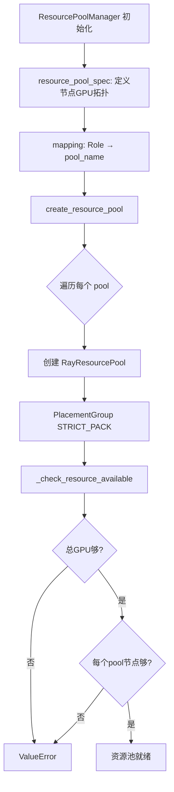
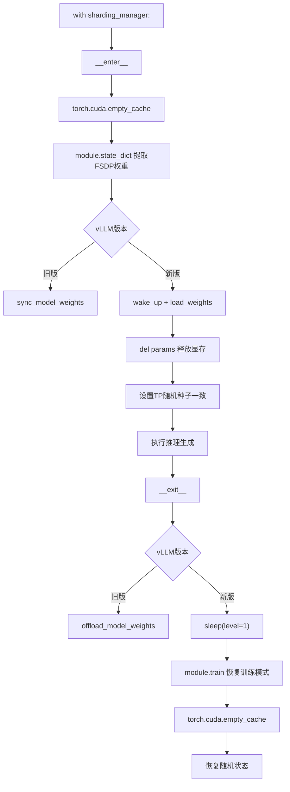
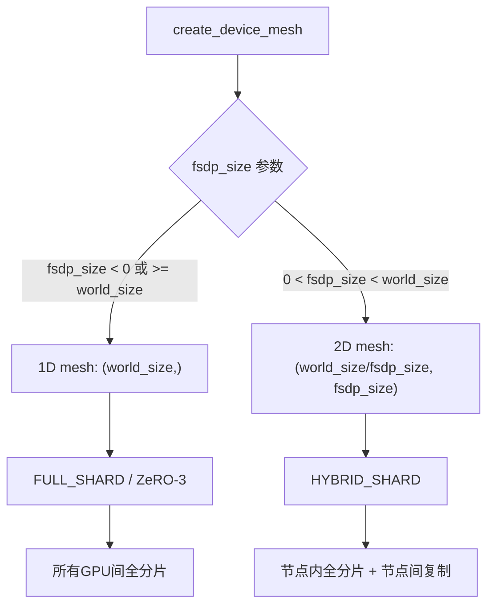
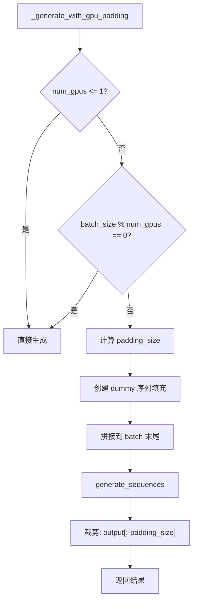

# PD-359.01 VRAG — Ray 单控制器 FSDP 分布式 RL 训练

> 文档编号：PD-359.01
> 来源：VRAG-RL `verl/trainer/ppo/ray_trainer.py`, `verl/workers/fsdp_workers.py`, `verl/workers/sharding_manager/fsdp_vllm.py`
> GitHub：https://github.com/Alibaba-NLP/VRAG.git
> 问题域：PD-359 分布式训练 Distributed Training
> 状态：可复用方案

---

## 第 1 章 问题与动机

### 1.1 核心问题

大规模 RL 训练（PPO/GRPO）需要在多 GPU 上同时运行 Actor、Critic、Reference Policy、Reward Model 和 Rollout 推理引擎。核心挑战包括：

1. **GPU 资源分配**：不同角色（Actor、Critic、RM）需要灵活映射到不同 GPU 资源池，支持共置（colocate）以节省显存
2. **训练-推理引擎切换**：同一组 GPU 上需要在 FSDP 训练模式和 vLLM/SGLang 推理模式之间无缝切换，涉及权重同步和显存管理
3. **多 GPU 批次对齐**：当 batch size 不能被 GPU 数整除时，需要 padding 机制保证分布式通信正确
4. **分片策略选择**：FULL_SHARD（ZeRO-3）vs HYBRID_SHARD 需要根据集群拓扑自动选择
5. **参数/优化器 offload**：大模型训练需要将参数和优化器状态 offload 到 CPU 以节省 GPU 显存

### 1.2 VRAG 的解法概述

VRAG-RL 基于 veRL 框架（字节跳动开源），采用 **Ray 单控制器 + FSDP Worker** 架构：

1. **ResourcePoolManager** (`ray_trainer.py:75-131`) — 声明式 GPU 资源池管理，通过 `resource_pool_spec` 定义节点拓扑，`mapping` 将角色映射到资源池，启动前校验集群资源是否满足
2. **create_colocated_worker_cls** (`ray/base.py`) — 将多个 Worker 类合并到同一资源池，实现 Actor+Rollout 共置在同一组 GPU 上
3. **FSDPVLLMShardingManager** (`fsdp_vllm.py:37-159`) — 上下文管理器模式实现训练↔推理切换，`__enter__` 同步权重到 vLLM 并唤醒推理引擎，`__exit__` 让推理引擎 sleep 并恢复训练模式
4. **DeviceMesh 自动分片** (`fsdp_workers.py:49-67`) — 根据 `fsdp_size` 参数自动选择 FULL_SHARD 或 HYBRID_SHARD 策略
5. **_generate_with_gpu_padding** (`generation.py:267-342`) — 当 batch 不能被 GPU 数整除时，用 dummy 序列填充，生成后裁剪

### 1.3 设计思想

| 设计原则 | 具体实现 | 理由 | 替代方案 |
|----------|----------|------|----------|
| 单控制器编排 | RayPPOTrainer 在 driver 进程编排所有 Worker | 简化分布式协调，driver 只做轻量计算（advantage） | 去中心化 P2P 通信 |
| 资源池声明式 | ResourcePoolManager dataclass 声明 spec + mapping | 解耦资源分配与业务逻辑，启动前校验 | 硬编码 GPU 分配 |
| 上下文管理器切换 | `with sharding_manager:` 自动同步权重 | Python 原生模式，保证 enter/exit 配对 | 手动调用 sync/offload |
| DeviceMesh 拓扑感知 | 1D mesh → FULL_SHARD, 2D mesh → HYBRID_SHARD | 自动适配单机/多机场景 | 手动指定 sharding strategy |
| Padding 对齐 | dummy 序列填充 + 生成后裁剪 | 避免分布式通信 shape 不匹配 | pad_dataproto_to_divisor |

---

## 第 2 章 源码实现分析

### 2.1 架构概览

VRAG-RL 的分布式训练架构分为三层：

```
┌─────────────────────────────────────────────────────────────────┐
│                    RayPPOTrainer (Driver)                        │
│  ┌──────────┐  ┌──────────┐  ┌──────────┐  ┌──────────────┐   │
│  │ fit()    │→ │ rollout  │→ │ log_prob │→ │ update_actor │   │
│  │ 训练循环  │  │ 生成序列  │  │ 计算概率  │  │ PPO 更新     │   │
│  └──────────┘  └──────────┘  └──────────┘  └──────────────┘   │
│       ↓ RPC          ↓ RPC         ↓ RPC         ↓ RPC         │
├─────────────────────────────────────────────────────────────────┤
│              ResourcePoolManager                                 │
│  ┌─────────────────────┐  ┌─────────────────────┐              │
│  │ Pool "actor_rollout" │  │ Pool "critic"       │              │
│  │ GPU 0,1,2,3         │  │ GPU 0,1,2,3 (共置)  │              │
│  └─────────────────────┘  └─────────────────────┘              │
├─────────────────────────────────────────────────────────────────┤
│              FSDP Workers (per GPU)                               │
│  ┌──────────────────────────────────────────────┐               │
│  │ ActorRolloutRefWorker                         │               │
│  │  ├─ actor_module_fsdp (FSDP wrapped)         │               │
│  │  ├─ rollout (vLLM/SGLang)                    │               │
│  │  ├─ rollout_sharding_manager                 │               │
│  │  │   └─ FSDPVLLMShardingManager              │               │
│  │  │       ├─ __enter__: sync weights → vLLM   │               │
│  │  │       └─ __exit__: vLLM sleep → train     │               │
│  │  └─ ulysses_sharding_manager (序列并行)       │               │
│  └──────────────────────────────────────────────┘               │
└─────────────────────────────────────────────────────────────────┘
```

### 2.2 核心实现

#### 2.2.1 ResourcePoolManager — GPU 资源池管理



对应源码 `VRAG-RL/verl/trainer/ppo/ray_trainer.py:74-131`：

```python
@dataclass
class ResourcePoolManager:
    resource_pool_spec: dict[str, list[int]]  # {"pool_name": [gpus_per_node, ...]}
    mapping: dict[Role, str]                   # {Role.ActorRollout: "pool_name"}
    resource_pool_dict: dict[str, RayResourcePool] = field(default_factory=dict)

    def create_resource_pool(self):
        for resource_pool_name, process_on_nodes in self.resource_pool_spec.items():
            resource_pool = RayResourcePool(
                process_on_nodes=process_on_nodes,
                use_gpu=True,
                max_colocate_count=1,  # FSDP 推荐合并所有 WorkerGroup
                name_prefix=resource_pool_name
            )
            self.resource_pool_dict[resource_pool_name] = resource_pool
        self._check_resource_available()

    def _check_resource_available(self):
        node_available_resources = ray.state.available_resources_per_node()
        total_available = sum(info.get('GPU', 0) for info in node_available_resources.values())
        total_required = sum(n for nodes in self.resource_pool_spec.values() for n in nodes)
        if total_available < total_required:
            raise ValueError(f"Available {total_available} < Required {total_required}")
```

#### 2.2.2 FSDPVLLMShardingManager — 训练↔推理切换



对应源码 `VRAG-RL/verl/workers/sharding_manager/fsdp_vllm.py:37-159`：

```python
class FSDPVLLMShardingManager(BaseShardingManager):
    def __init__(self, module: FSDP, inference_engine: LLM, model_config,
                 full_params: bool = False, device_mesh: DeviceMesh = None):
        self.module = module
        self.inference_engine = inference_engine
        # 根据 full_params 选择 FULL 或 SHARDED state_dict
        if full_params:
            FSDP.set_state_dict_type(self.module,
                state_dict_type=StateDictType.FULL_STATE_DICT,
                state_dict_config=FullStateDictConfig())
        else:
            FSDP.set_state_dict_type(self.module,
                state_dict_type=StateDictType.SHARDED_STATE_DICT,
                state_dict_config=ShardedStateDictConfig())
        # TP 并行状态
        self.tp_size = vllm_ps.get_tensor_model_parallel_world_size()
        self.tp_rank = vllm_ps.get_tensor_model_parallel_rank()

    def __enter__(self):
        torch.cuda.empty_cache()  # 为 vLLM CuMemAllocator 腾出空间
        params = self.module.state_dict()
        if vllm_version in ('0.4.2', '0.5.4', '0.6.3'):
            self.inference_engine.sync_model_weights(params, load_format='hf' if self.full_params else 'dtensor')
        else:
            self.inference_engine.wake_up()
            model = self.inference_engine.llm_engine.model_executor.driver_worker.worker.model_runner.model
            loaded_params = model.load_weights(
                ((name, param.full_tensor() if world_size != 1 else param) for name, param in params.items()))
        del params  # 立即释放

    def __exit__(self, exc_type, exc_value, traceback):
        if vllm_version in ('0.4.2', '0.5.4', '0.6.3'):
            self.inference_engine.offload_model_weights()
        else:
            self.inference_engine.sleep(level=1)  # 释放 KV cache 等推理资源
        self.module.train()
        torch.cuda.empty_cache()
```


#### 2.2.3 DeviceMesh 自动分片策略



对应源码 `VRAG-RL/verl/workers/fsdp_workers.py:49-67`：

```python
def create_device_mesh(world_size, fsdp_size):
    if fsdp_size < 0 or fsdp_size >= world_size:
        # 单维度 mesh → FULL_SHARD (ZeRO-3)
        device_mesh = init_device_mesh('cuda', mesh_shape=(world_size,), mesh_dim_names=['fsdp'])
    else:
        # 二维 mesh → HYBRID_SHARD (节点内全分片，节点间 DDP)
        device_mesh = init_device_mesh('cuda',
            mesh_shape=(world_size // fsdp_size, fsdp_size),
            mesh_dim_names=['ddp', 'fsdp'])
    return device_mesh

def get_sharding_strategy(device_mesh):
    if device_mesh.ndim == 1:
        return ShardingStrategy.FULL_SHARD
    elif device_mesh.ndim == 2:
        return ShardingStrategy.HYBRID_SHARD
```

#### 2.2.4 多 GPU 批次对齐 — _generate_with_gpu_padding



对应源码 `VRAG-RL/vrag_agent/generation.py:267-342`：

```python
def _generate_with_gpu_padding(self, active_batch: DataProto) -> DataProto:
    num_gpus = self.config.num_gpus
    if num_gpus <= 1:
        return self.actor_rollout_wg.generate_sequences(active_batch)
    batch_size = active_batch.batch['input_ids'].shape[0]
    remainder = batch_size % num_gpus
    if remainder == 0:
        return self.actor_rollout_wg.generate_sequences(active_batch)
    # 用 dummy 序列填充
    padding_size = num_gpus - remainder
    padded_ids = self.tokenizer(
        ['<|im_start|>user\nHi, who are u?<|im_end|>\n<|im_start|>assistant\n'],
        padding='longest', return_tensors='pt', add_special_tokens=False
    )['input_ids']
    # ... 拼接 padding 到 batch ...
    padded_output = self.actor_rollout_wg.generate_sequences(padded_active_batch)
    # 裁剪 padding
    trimmed_batch = {k: v[:-padding_size] for k, v in padded_output.batch.items()}
    return padded_output
```

### 2.3 实现细节

**Worker 初始化与共置机制**：`init_workers()` (`ray_trainer.py:505-570`) 通过 `create_colocated_worker_cls` 将 Actor+Rollout 合并到同一资源池。这意味着同一组 GPU 上同时存在 FSDP 训练模型和 vLLM 推理引擎，通过 ShardingManager 的 enter/exit 在两者之间切换。

**参数 Offload 机制**：`fsdp_workers.py:106-113` 中 `ActorRolloutRefWorker` 支持 `param_offload` 和 `optimizer_offload`，在不需要时将参数/优化器移到 CPU。每次 `update_actor` 前 `load_fsdp_model_to_gpu`，更新后 `offload_fsdp_model_to_cpu`。

**序列长度均衡**：`_balance_batch()` (`ray_trainer.py:658-673`) 使用 `get_seqlen_balanced_partitions` 将 batch 重排，使每个 DP rank 获得相近的总 token 数，避免 GPU 间负载不均。

**Ulysses 序列并行**：`fsdp_workers.py:88-97` 构建独立的 `ulysses_device_mesh`，在 `(dp, sp)` 两个维度上分别做数据并行和序列并行，通过 `FSDPUlyssesShardingManager` 在前后处理数据。

---

## 第 3 章 迁移指南

### 3.1 迁移清单

**阶段 1：基础 Ray + FSDP 框架**
- [ ] 安装依赖：`ray`, `torch` (with FSDP), `omegaconf`, `tensordict`
- [ ] 实现 `ResourcePoolManager` dataclass，定义 GPU 拓扑和角色映射
- [ ] 实现 `create_device_mesh` 和 `get_sharding_strategy` 工具函数
- [ ] 创建 `BaseShardingManager` 上下文管理器基类

**阶段 2：Worker 实现**
- [ ] 实现 FSDP Worker 基类，包含 `_build_model_optimizer` 方法
- [ ] 实现 `@register(dispatch_mode=Dispatch.DP_COMPUTE_PROTO)` 装饰器的 RPC 方法
- [ ] 实现参数/优化器 offload 逻辑

**阶段 3：推理引擎集成**
- [ ] 实现 `FSDPVLLMShardingManager`（或对应的推理引擎 ShardingManager）
- [ ] 实现 `_generate_with_gpu_padding` 批次对齐
- [ ] 集成 vLLM/SGLang 推理引擎

### 3.2 适配代码模板

**最小化 ResourcePoolManager 使用模板**：

```python
from dataclasses import dataclass, field
from enum import Enum
from typing import Dict, List
import ray

class Role(Enum):
    Actor = 0
    Rollout = 1
    ActorRollout = 2
    Critic = 3

@dataclass
class ResourcePoolManager:
    resource_pool_spec: Dict[str, List[int]]  # {"pool_name": [gpus_node0, gpus_node1]}
    mapping: Dict[Role, str]                   # {Role.ActorRollout: "pool_name"}

    def create_resource_pool(self):
        for name, nodes in self.resource_pool_spec.items():
            pool = RayResourcePool(process_on_nodes=nodes, use_gpu=True, max_colocate_count=1)
            self.pools[name] = pool
        self._validate()

    def _validate(self):
        available = ray.state.available_resources_per_node()
        total_gpu = sum(info.get('GPU', 0) for info in available.values())
        required = sum(n for nodes in self.resource_pool_spec.values() for n in nodes)
        assert total_gpu >= required, f"Need {required} GPUs, only {total_gpu} available"

# 使用
rpm = ResourcePoolManager(
    resource_pool_spec={"actor_pool": [4, 4]},  # 2 节点各 4 GPU
    mapping={Role.ActorRollout: "actor_pool", Role.Critic: "actor_pool"}
)
rpm.create_resource_pool()
```

**最小化 ShardingManager 模板**：

```python
import torch
from torch.distributed.fsdp import FullyShardedDataParallel as FSDP

class TrainInferShardingManager:
    def __init__(self, fsdp_module, inference_engine):
        self.module = fsdp_module
        self.engine = inference_engine

    def __enter__(self):
        torch.cuda.empty_cache()
        params = self.module.state_dict()
        self.engine.wake_up()
        self.engine.load_weights(params)
        del params

    def __exit__(self, *args):
        self.engine.sleep(level=1)
        self.module.train()
        torch.cuda.empty_cache()

# 使用
with TrainInferShardingManager(actor_fsdp, vllm_engine):
    output = vllm_engine.generate(prompts)
```

### 3.3 适用场景

| 场景 | 适用度 | 说明 |
|------|--------|------|
| 多 GPU PPO/GRPO 训练 | ⭐⭐⭐ | 核心场景，ResourcePoolManager + FSDP Worker 完美匹配 |
| 训练+推理混合引擎 | ⭐⭐⭐ | ShardingManager 上下文切换是该方案的核心优势 |
| 单机多卡 RL | ⭐⭐⭐ | FULL_SHARD 自动选择，无需额外配置 |
| 多机多卡大模型 | ⭐⭐ | HYBRID_SHARD 支持，但需要注意跨节点通信开销 |
| 非 RL 的分布式训练 | ⭐ | 架构偏重 RL 场景，纯 SFT 用标准 FSDP 即可 |


---

## 第 4 章 测试用例

```python
import pytest
import torch
from unittest.mock import MagicMock, patch
from dataclasses import dataclass, field
from enum import Enum


class Role(Enum):
    Actor = 0
    Rollout = 1
    ActorRollout = 2
    Critic = 3


class TestResourcePoolManager:
    """测试 GPU 资源池管理"""

    def test_create_resource_pool_single_node(self):
        """单节点 4 GPU 场景"""
        rpm = ResourcePoolManager(
            resource_pool_spec={"actor_pool": [4]},
            mapping={Role.ActorRollout: "actor_pool"}
        )
        with patch('ray.state.available_resources_per_node', return_value={
            'node1': {'GPU': 4, 'CPU': 32}
        }):
            rpm.create_resource_pool()
            assert "actor_pool" in rpm.resource_pool_dict
            assert rpm.get_n_gpus() == 4

    def test_resource_check_fails_insufficient_gpus(self):
        """GPU 不足时应抛出 ValueError"""
        rpm = ResourcePoolManager(
            resource_pool_spec={"pool": [8]},
            mapping={Role.ActorRollout: "pool"}
        )
        with patch('ray.state.available_resources_per_node', return_value={
            'node1': {'GPU': 4}
        }):
            with pytest.raises(ValueError, match="less than total desired"):
                rpm.create_resource_pool()

    def test_role_to_pool_mapping(self):
        """角色到资源池的映射"""
        rpm = ResourcePoolManager(
            resource_pool_spec={"pool_a": [4], "pool_b": [2]},
            mapping={Role.ActorRollout: "pool_a", Role.Critic: "pool_b"}
        )
        assert rpm.mapping[Role.ActorRollout] == "pool_a"
        assert rpm.mapping[Role.Critic] == "pool_b"


class TestDeviceMesh:
    """测试 DeviceMesh 自动分片策略选择"""

    def test_full_shard_when_fsdp_size_negative(self):
        """fsdp_size < 0 应选择 FULL_SHARD"""
        # create_device_mesh(world_size=4, fsdp_size=-1) → 1D mesh → FULL_SHARD
        from torch.distributed.fsdp import ShardingStrategy
        mesh = MagicMock()
        mesh.ndim = 1
        assert get_sharding_strategy(mesh) == ShardingStrategy.FULL_SHARD

    def test_hybrid_shard_when_fsdp_size_partial(self):
        """0 < fsdp_size < world_size 应选择 HYBRID_SHARD"""
        from torch.distributed.fsdp import ShardingStrategy
        mesh = MagicMock()
        mesh.ndim = 2
        assert get_sharding_strategy(mesh) == ShardingStrategy.HYBRID_SHARD


class TestGPUPadding:
    """测试多 GPU 批次对齐"""

    def test_no_padding_when_divisible(self):
        """batch_size 能被 GPU 数整除时不需要 padding"""
        batch_size = 8
        num_gpus = 4
        remainder = batch_size % num_gpus
        assert remainder == 0

    def test_padding_size_calculation(self):
        """padding 大小计算"""
        batch_size = 7
        num_gpus = 4
        remainder = batch_size % num_gpus
        padding_size = num_gpus - remainder
        assert padding_size == 1
        assert (batch_size + padding_size) % num_gpus == 0

    def test_output_trimming(self):
        """生成后裁剪 padding"""
        output = torch.randn(8, 10)  # 8 = 7 real + 1 padding
        padding_size = 1
        trimmed = output[:-padding_size]
        assert trimmed.shape[0] == 7


class TestShardingManagerLifecycle:
    """测试 ShardingManager 生命周期"""

    def test_enter_exit_paired(self):
        """确保 enter/exit 配对调用"""
        manager = MagicMock()
        manager.__enter__ = MagicMock(return_value=None)
        manager.__exit__ = MagicMock(return_value=False)
        with manager:
            pass
        manager.__enter__.assert_called_once()
        manager.__exit__.assert_called_once()

    def test_preprocess_allgather_for_tp(self):
        """TP > 1 时 preprocess 应做 all_gather"""
        # FSDPVLLMShardingManager.preprocess_data 在 tp_size > 1 时
        # 调用 all_gather_data_proto
        tp_size = 2
        assert tp_size > 1  # 需要 all_gather
```

---

## 第 5 章 跨域关联

| 关联域 | 关系类型 | 说明 |
|--------|----------|------|
| PD-01 上下文管理 | 协同 | `_generate_with_gpu_padding` 中的 `max_model_len` 限制与上下文窗口管理直接相关 |
| PD-02 多 Agent 编排 | 依赖 | ResourcePoolManager 是多角色编排的基础设施，Actor/Critic/RM 的资源分配依赖它 |
| PD-03 容错与重试 | 协同 | `_check_resource_available` 在启动前校验资源，checkpoint save/load 支持训练恢复 |
| PD-04 工具系统 | 协同 | vLLM/SGLang 推理引擎作为"工具"被 ShardingManager 管理生命周期 |
| PD-11 可观测性 | 协同 | `log_gpu_memory_usage` 在关键节点追踪显存，`FlopsCounter` 计算 MFU |

---

## 第 6 章 来源文件索引

| 文件 | 行范围 | 关键实现 |
|------|--------|----------|
| `VRAG-RL/verl/trainer/ppo/ray_trainer.py` | L50-61 | Role 枚举定义 |
| `VRAG-RL/verl/trainer/ppo/ray_trainer.py` | L74-131 | ResourcePoolManager 资源池管理 |
| `VRAG-RL/verl/trainer/ppo/ray_trainer.py` | L248-310 | RayPPOTrainer 初始化与配置校验 |
| `VRAG-RL/verl/trainer/ppo/ray_trainer.py` | L505-570 | init_workers 资源池创建与 Worker 初始化 |
| `VRAG-RL/verl/trainer/ppo/ray_trainer.py` | L658-673 | _balance_batch 序列长度均衡 |
| `VRAG-RL/verl/trainer/ppo/ray_trainer.py` | L675-885 | fit() 训练主循环 |
| `VRAG-RL/verl/workers/fsdp_workers.py` | L49-67 | create_device_mesh + get_sharding_strategy |
| `VRAG-RL/verl/workers/fsdp_workers.py` | L70-611 | ActorRolloutRefWorker 完整实现 |
| `VRAG-RL/verl/workers/fsdp_workers.py` | L298-365 | _build_rollout vLLM/SGLang 推理引擎构建 |
| `VRAG-RL/verl/workers/fsdp_workers.py` | L438-482 | update_actor FSDP 训练更新 |
| `VRAG-RL/verl/workers/fsdp_workers.py` | L616-895 | CriticWorker + RewardModelWorker |
| `VRAG-RL/verl/workers/sharding_manager/fsdp_vllm.py` | L37-159 | FSDPVLLMShardingManager 完整实现 |
| `VRAG-RL/verl/workers/sharding_manager/base.py` | L21-33 | BaseShardingManager 基类 |
| `VRAG-RL/vrag_agent/generation.py` | L267-342 | _generate_with_gpu_padding 批次对齐 |
| `VRAG-RL/vrag_agent/generation.py` | L372-498 | run_llm_loop 多轮生成主循环 |
| `VRAG-RL/verl/single_controller/ray/base.py` | L69-108 | RayResourcePool PlacementGroup 管理 |
| `VRAG-RL/verl/single_controller/ray/base.py` | L196-299 | RayWorkerGroup Worker 创建与分发 |
| `VRAG-RL/verl/utils/fsdp_utils.py` | L32-50 | init_fn + get_init_weight_context_manager |
| `VRAG-RL/verl/protocol.py` | L41-60 | pad_dataproto_to_divisor 数据对齐 |

---

## 第 7 章 横向对比维度

```json comparison_data
{
  "project": "VRAG",
  "dimensions": {
    "编排模式": "Ray 单控制器 + FSDP Worker RPC 调用",
    "分片策略": "DeviceMesh 自动选择 FULL_SHARD/HYBRID_SHARD",
    "训练推理切换": "FSDPVLLMShardingManager 上下文管理器 wake_up/sleep",
    "批次对齐": "_generate_with_gpu_padding dummy 序列填充裁剪",
    "资源管理": "ResourcePoolManager 声明式 spec + 启动前校验",
    "参数offload": "手动 load_to_gpu/offload_to_cpu 配对调用",
    "序列并行": "Ulysses DeviceMesh (dp, sp) 二维并行"
  }
}
```

### 域元数据补充

```json domain_metadata
{
  "solution_summary": "VRAG-RL 基于 Ray 单控制器 + ResourcePoolManager 声明式 GPU 资源池 + FSDPVLLMShardingManager 上下文管理器实现训练↔推理无缝切换",
  "description": "分布式 RL 训练中训练引擎与推理引擎的显存共享与生命周期管理",
  "sub_problems": [
    "序列长度均衡分区避免 DP rank 负载不均",
    "参数/优化器 CPU offload 配对调用时序",
    "vLLM 版本兼容性适配（wake_up/sleep vs sync/offload）"
  ],
  "best_practices": [
    "上下文管理器模式保证训练↔推理切换的 enter/exit 配对",
    "ResourcePoolManager 启动前校验集群资源避免运行时失败",
    "DeviceMesh 拓扑感知自动选择 FULL_SHARD/HYBRID_SHARD"
  ]
}
```
