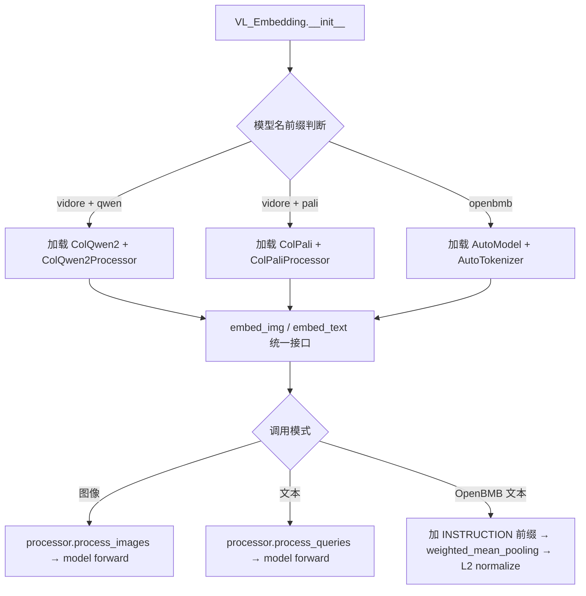
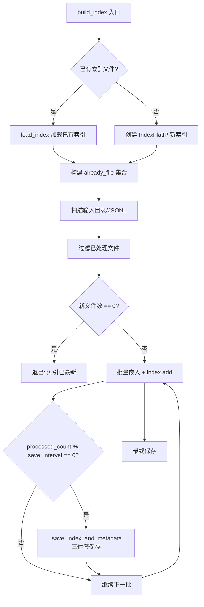
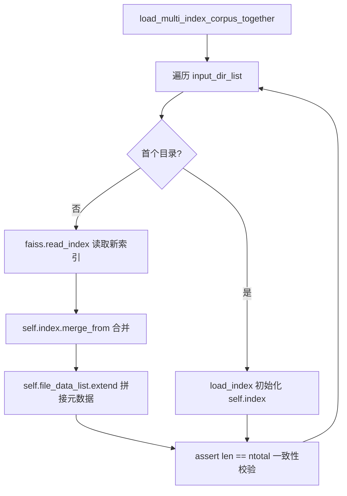

# PD-360.01 VRAG — 多模型视觉嵌入与 FAISS 增量索引

> 文档编号：PD-360.01
> 来源：VRAG `search_engine/vl_embedding.py` `search_engine/search_engine_faiss.py` `search_engine/ingestion.py`
> GitHub：https://github.com/Alibaba-NLP/VRAG.git
> 问题域：PD-360 向量索引与嵌入 Vector Indexing & Embedding
> 状态：可复用方案

---

## 第 1 章 问题与动机

### 1.1 核心问题

视觉 RAG 系统需要将文本、图像、视频三种模态统一映射到向量空间进行检索。核心挑战有三：

1. **多模型异构接口**：ColQwen2、ColPali、OpenBMB MiniCPM-V 三类视觉语言模型的输入格式、输出维度、推理方式完全不同（ColQwen2 输出多向量 token-level embedding，OpenBMB 输出单向量 sentence-level embedding），需要统一抽象层屏蔽差异。
2. **大规模索引构建的中断恢复**：百万级文档的嵌入计算耗时数小时甚至数天，进程中断后从头重算代价极高，需要断点续建能力。
3. **多语料库动态合并**：不同数据集（SlideVQA、WebQA、LVBench 等）独立构建索引后，检索时需要合并为统一索引，且要保证元数据与向量的一致性。

VRAG 提供了两套并行的搜索引擎架构来解决这些问题：基于 LlamaIndex 的 ColQwen2 内存检索引擎（`search_engine.py`）和基于 FAISS 的 GVE/BGE 持久化索引引擎（`search_engine_faiss.py`），两者共享 `VL_Embedding` 统一嵌入层。

### 1.2 VRAG 的解法概述

1. **VL_Embedding 统一抽象**：继承 LlamaIndex `MultiModalEmbedding` 基类，通过模型名前缀路由（`vidore` → ColQwen2/ColPali，`openbmb` → MiniCPM-V），统一 `embed_img()` / `embed_text()` / `score()` 三个接口（`search_engine/vl_embedding.py:23-228`）。
2. **FAISS IndexFlatIP 增量构建**：`build_index()` 方法先检测已有索引文件，存在则加载续建，不存在则新建；通过 `uid` / `file_path` 集合去重跳过已处理文件（`search_engine/search_engine_faiss.py:81-211`）。
3. **断点续建（Checkpoint Save）**：每处理 `save_interval`（默认 512）条记录自动保存索引 + 元数据 + 文件列表三件套，进程中断后重启自动从上次保存点继续（`search_engine/search_engine_faiss.py:187-190`）。
4. **多语料库合并**：`load_multi_index_corpus_together()` 使用 FAISS 原生 `merge_from()` API 逐目录合并索引，同步拼接 `file_data_list` 并校验 `ntotal` 一致性（`search_engine/search_engine_faiss.py:51-79`）。
5. **双引擎架构**：ColQwen2 多向量引擎（`search_engine.py`）用于精确的 token-level 匹配，GVE/BGE 单向量引擎（`search_engine_faiss.py`）用于大规模快速检索，通过 FastAPI 分别暴露服务。

### 1.3 设计思想

| 设计原则 | 具体实现 | 理由 | 替代方案 |
|----------|----------|------|----------|
| 模型名前缀路由 | `if 'vidore' in model` / `if 'openbmb' in model` 分支 | 零配置，模型名即路由键，无需额外注册表 | 策略模式 + 工厂注册表 |
| 三件套原子保存 | index.bin + file_data_list.jsonl + meta_data.json 同步写入 | 保证索引-元数据-文件列表三者一致性 | 事务性写入 / WAL |
| 集合去重跳过 | `already_file_uid` / `already_file_path` 集合判断 | O(1) 查重，避免重复嵌入计算 | 数据库记录已处理状态 |
| FAISS 原生合并 | `index.merge_from()` 而非手动拼接向量 | 利用 FAISS 内部优化，避免内存拷贝 | numpy concatenate + 重建索引 |
| 双引擎互补 | ColQwen2 多向量精排 + GVE 单向量召回 | 多向量精度高但内存大，单向量适合大规模 | 统一用一种引擎 |

---

## 第 2 章 源码实现分析

### 2.1 架构概览

VRAG 的向量索引与嵌入系统由三层组成：

```
┌─────────────────────────────────────────────────────────────────┐
│                      FastAPI 服务层                              │
│  search_engine_api.py (ColQwen2)  search_engine_faiss_api.py (GVE) │
├─────────────────────────────────────────────────────────────────┤
│                      搜索引擎层                                  │
│  SearchEngine (search_engine.py)   SearchEngine (search_engine_faiss.py) │
│  ├─ batch_search() 多向量匹配       ├─ build_index() 增量构建     │
│  ├─ load_nodes() 并行加载           ├─ load_index() 单库加载      │
│  └─ load_query_engine() 内存索引    ├─ load_multi_index() 多库合并 │
│                                     └─ search() 向量检索          │
├─────────────────────────────────────────────────────────────────┤
│                      嵌入模型层                                  │
│  VL_Embedding (vl_embedding.py)    GVE (models/GVE/)             │
│  ├─ ColQwen2 (vidore/colqwen2)     ├─ AutoModelForSentenceEmbedding │
│  ├─ ColPali (vidore/colpali)       ├─ VLProcessor                │
│  └─ OpenBMB (openbmb/MiniCPM-V)   └─ Qwen25VLForEmbedding       │
├─────────────────────────────────────────────────────────────────┤
│                      数据摄入层                                  │
│  Ingestion (ingestion.py)          pdf2images.py                 │
│  └─ LlamaIndex IngestionPipeline   └─ PDF → JPEG 页面转换        │
└─────────────────────────────────────────────────────────────────┘
```

### 2.2 核心实现

#### 2.2.1 VL_Embedding 统一嵌入抽象



对应源码 `search_engine/vl_embedding.py:63-103`：

```python
def __init__(
    self,
    model: str = "vidore/colqwen2-v1.0",
    dimensions: Optional[int] = 1024,
    timeout: Optional[int] = None,
    callback_manager: Optional[CallbackManager] = None,
    mode: str = 'text',
    **kwargs: Any,
) -> None:
    super().__init__(model=model, dimensions=dimensions, timeout=timeout,
                     callback_manager=callback_manager, **kwargs)
    self.mode = mode
    if 'openbmb' in model:
        self.tokenizer = AutoTokenizer.from_pretrained(model, trust_remote_code=True)
        self.embed_model = AutoModel.from_pretrained(model,
            torch_dtype=torch.bfloat16, trust_remote_code=True,
            device_map='cuda:1').cuda().eval()
    elif 'vidore' in model and 'qwen' in model:
        self.embed_model = ColQwen2.from_pretrained(
            model, torch_dtype=torch.bfloat16, device_map='cuda:1').eval()
        self.processor = ColQwen2Processor.from_pretrained(model)
    elif 'vidore' in model and 'pali' in model:
        self.embed_model = ColPali.from_pretrained(
            model, torch_dtype=torch.bfloat16, device_map='cuda').eval()
        self.processor = ColPaliProcessor.from_pretrained(model)
```

关键设计：`__call__` 方法（`vl_embedding.py:196-220`）使 VL_Embedding 可直接作为 LlamaIndex IngestionPipeline 的 transformation 节点，自动为每个 node 注入 embedding。ColQwen2/ColPali 输出多向量后通过 `view(size(0), -1)` 展平为单行存储。

#### 2.2.2 FAISS 增量索引构建与断点续建



对应源码 `search_engine/search_engine_faiss.py:81-211`：

```python
def build_index(self, input_dir, index_output_path, corpus_output_path, bs=2, save_interval=512):
    os.makedirs(index_output_path, exist_ok=True)
    os.makedirs(corpus_output_path, exist_ok=True)
    # Step 1: 加载现有索引（断点续建核心）
    index_path = os.path.join(index_output_path, f"{self.embed_model_name_file}_faiss_index.bin")
    meta_data_path = os.path.join(index_output_path, f"{self.embed_model_name_file}_meta_data.json")
    file_data_list_path = os.path.join(corpus_output_path, f"{self.embed_model_name_file}_file_data_list.jsonl")
    
    if os.path.exists(index_path) and os.path.exists(meta_data_path) and os.path.exists(file_data_list_path):
        self.load_index(index_output_path)
    else:
        self.index = faiss.IndexFlatIP(self.dimension)
        self.file_data_list = []
    # Step 2: 集合去重
    already_file_uid = {entry['uid'] for entry in self.file_data_list}
    # Step 3: 批量嵌入 + 周期性保存
    for i in tqdm(range(0, len(input_data_list), bs)):
        # ... 嵌入计算 + index.add ...
        processed_count += len(file_batch)
        self.file_data_list.extend(new_file_data_list[i:i+bs])
        if processed_count % save_interval == 0:
            self._save_index_and_metadata(self.index, self.file_data_list,
                index_path, file_data_list_path, meta_data_path)
```

#### 2.2.3 多语料库合并



对应源码 `search_engine/search_engine_faiss.py:51-79`：

```python
def load_multi_index_corpus_together(self, input_dir_list):
    for input_dir in input_dir_list:
        if not hasattr(self, "meta_data"):
            # 首个目录：初始化
            with open(os.path.join(input_dir, f"{self.embed_model_name_file}_meta_data.json"), "r") as f:
                self.meta_data = json.load(f)
            self.index = faiss.read_index(os.path.join(input_dir, f"{self.embed_model_name_file}_faiss_index.bin"))
            with open(os.path.join(input_dir, f"{self.embed_model_name_file}_file_data_list.jsonl"), "r") as f:
                self.file_data_list = [json.loads(line) for line in f]
        else:
            # 后续目录：合并
            self.meta_data['num_vectors'] += num_vectors
            self.index.merge_from(faiss.read_index(...))
            self.file_data_list.extend([json.loads(line) for line in f])
        assert len(self.file_data_list) == self.index.ntotal
```

### 2.3 实现细节

**GVE 模型架构**（`search_engine/models/GVE/models.py:34-155`）：`AutoModelForSentenceEmbedding` 封装 Qwen2.5-VL 为嵌入模型，支持 mean/last pooling、L2 归一化、LoRA 微调、MRL（Matryoshka Representation Learning）多维度损失。子类 `AutoModelForSentenceEmbeddingTriplet` 实现 triplet 训练，支持双向对比损失（t2v + v2t）加权。

**多模态文件类型路由**（`search_engine_faiss.py:119-135`）：`build_index` 根据文件后缀自动分类——`.txt/.md/.json` → text，`.mp4` → video（附带 fps/max_frames 参数），`.jpg/.png/.jpeg` → image，实现零配置的多模态摄入。

**VLProcessor 视频帧控制**（`search_engine/models/GVE/processor.py:18-33`）：处理器统一处理图像和视频输入，视频通过 `fps` 参数控制采样帧率，像素范围限制在 `4*28*28` 到 `256*28*28` 之间，平衡精度与显存。

**三件套元数据结构**（`search_engine_faiss.py:214-234`）：
- `*_faiss_index.bin`：FAISS 二进制索引
- `*_file_data_list.jsonl`：每行一条文件元数据（uid/file_path/type/content）
- `*_meta_data.json`：`{vector_dimension, num_vectors, model_name, date_created}`

加载时通过三重断言校验一致性：`meta_data.num_vectors == index.ntotal == len(file_data_list)`（`search_engine_faiss.py:47-49`）。

---

## 第 3 章 迁移指南

### 3.1 迁移清单

**阶段 1：嵌入抽象层（1-2 天）**
- [ ] 定义统一嵌入接口：`embed_text(texts) -> ndarray`、`embed_img(paths) -> ndarray`、`score(img_emb, text_emb) -> float`
- [ ] 实现模型路由：根据模型名前缀或配置文件选择具体实现
- [ ] 处理输出维度差异：ColQwen2 多向量需 flatten，OpenBMB 单向量直接用

**阶段 2：FAISS 索引引擎（1-2 天）**
- [ ] 实现三件套存储：index.bin + file_data_list.jsonl + meta_data.json
- [ ] 实现增量构建：加载已有索引 → 集合去重 → 批量嵌入 → 周期保存
- [ ] 实现多库合并：`faiss.merge_from()` + 元数据拼接 + 一致性校验

**阶段 3：服务化（0.5 天）**
- [ ] FastAPI 封装搜索接口
- [ ] 启动时预加载索引到内存

### 3.2 适配代码模板

以下是可直接复用的嵌入抽象层模板：

```python
"""统一嵌入接口 — 从 VRAG VL_Embedding 提炼"""
from abc import ABC, abstractmethod
from typing import List, Union
import numpy as np
import torch

class BaseEmbedding(ABC):
    """统一嵌入接口，屏蔽不同模型的输入输出差异"""
    
    @abstractmethod
    def embed_text(self, texts: Union[str, List[str]]) -> np.ndarray:
        """文本 → 向量，返回 (N, D) ndarray"""
        ...
    
    @abstractmethod
    def embed_image(self, paths: Union[str, List[str]]) -> np.ndarray:
        """图像路径 → 向量，返回 (N, D) ndarray"""
        ...
    
    @abstractmethod
    def score(self, query_emb: np.ndarray, doc_emb: np.ndarray) -> np.ndarray:
        """计算相似度分数"""
        ...


class EmbeddingRouter:
    """模型名前缀路由器 — 参考 VRAG 的 if/elif 路由模式"""
    
    _registry: dict = {}
    
    @classmethod
    def register(cls, prefix: str, embedding_cls: type):
        cls._registry[prefix] = embedding_cls
    
    @classmethod
    def create(cls, model_name: str, **kwargs) -> BaseEmbedding:
        for prefix, embedding_cls in cls._registry.items():
            if prefix in model_name.lower():
                return embedding_cls(model_name=model_name, **kwargs)
        raise ValueError(f"No embedding registered for model: {model_name}")
```

以下是可复用的 FAISS 增量索引模板：

```python
"""FAISS 增量索引 — 从 VRAG SearchEngine 提炼"""
import faiss
import json
import time
import os
import numpy as np
from typing import List, Dict, Optional

class IncrementalFAISSIndex:
    """支持断点续建和多库合并的 FAISS 索引管理器"""
    
    def __init__(self, dimension: int, model_name: str):
        self.dimension = dimension
        self.model_name = model_name
        self.model_name_file = model_name.replace('/', '_').replace('-', '_')
        self.index: Optional[faiss.Index] = None
        self.file_data_list: List[Dict] = []
    
    def _paths(self, output_dir: str):
        prefix = self.model_name_file
        return {
            'index': os.path.join(output_dir, f"{prefix}_faiss_index.bin"),
            'data': os.path.join(output_dir, f"{prefix}_file_data_list.jsonl"),
            'meta': os.path.join(output_dir, f"{prefix}_meta_data.json"),
        }
    
    def load_or_create(self, output_dir: str):
        """加载已有索引或创建新索引 — 断点续建核心"""
        paths = self._paths(output_dir)
        if all(os.path.exists(p) for p in paths.values()):
            self.index = faiss.read_index(paths['index'])
            with open(paths['data'], 'r') as f:
                self.file_data_list = [json.loads(line) for line in f]
            # 一致性校验
            assert self.index.ntotal == len(self.file_data_list)
        else:
            self.index = faiss.IndexFlatIP(self.dimension)
            self.file_data_list = []
    
    def build(self, items: List[Dict], embed_fn, output_dir: str,
              batch_size: int = 16, save_interval: int = 512):
        """增量构建索引，支持断点续建"""
        self.load_or_create(output_dir)
        existing_ids = {item.get('uid') or item.get('file_path') for item in self.file_data_list}
        new_items = [item for item in items
                     if (item.get('uid') or item.get('file_path')) not in existing_ids]
        if not new_items:
            return
        paths = self._paths(output_dir)
        processed = 0
        for i in range(0, len(new_items), batch_size):
            batch = new_items[i:i+batch_size]
            vectors = embed_fn(batch)  # (batch_size, dimension)
            self.index.add(vectors.astype('float32'))
            self.file_data_list.extend(batch)
            processed += len(batch)
            if processed % save_interval == 0:
                self._save(paths)
        self._save(paths)
    
    def merge_from_dirs(self, dir_list: List[str]):
        """多语料库合并 — 使用 FAISS 原生 merge_from"""
        for d in dir_list:
            paths = self._paths(d)
            new_index = faiss.read_index(paths['index'])
            with open(paths['data'], 'r') as f:
                new_data = [json.loads(line) for line in f]
            if self.index is None:
                self.index = new_index
                self.file_data_list = new_data
            else:
                self.index.merge_from(new_index)
                self.file_data_list.extend(new_data)
            assert self.index.ntotal == len(self.file_data_list)
    
    def search(self, query_vectors: np.ndarray, top_k: int = 10):
        top_k = min(top_k, self.index.ntotal)
        scores, indices = self.index.search(query_vectors.astype('float32'), top_k)
        return [{'score': s, 'data': [self.file_data_list[idx] for idx in idxs]}
                for s, idxs in zip(scores.tolist(), indices.tolist())]
    
    def _save(self, paths: Dict[str, str]):
        faiss.write_index(self.index, paths['index'])
        with open(paths['data'], 'w') as f:
            for item in self.file_data_list:
                f.write(json.dumps(item) + '\n')
        with open(paths['meta'], 'w') as f:
            json.dump({
                'vector_dimension': self.index.d,
                'num_vectors': len(self.file_data_list),
                'model_name': self.model_name,
                'date_created': time.strftime('%Y-%m-%d-%H-%M-%S')
            }, f, indent=4)
```

### 3.3 适用场景

| 场景 | 适用度 | 说明 |
|------|--------|------|
| 多模态 RAG 系统 | ⭐⭐⭐ | 核心场景，文本+图像+视频统一检索 |
| 大规模文档索引 | ⭐⭐⭐ | 断点续建 + 增量更新适合百万级文档 |
| 多数据集联合检索 | ⭐⭐⭐ | 多库合并能力天然支持 |
| 纯文本 RAG | ⭐⭐ | 可用但 FAISS FlatIP 无 ANN 加速，大规模需换 IVF |
| 实时在线索引 | ⭐ | 嵌入计算依赖 GPU，不适合实时写入 |

---

## 第 4 章 测试用例

```python
"""基于 VRAG 真实函数签名的测试用例"""
import pytest
import numpy as np
import json
import os
import tempfile
import faiss


class TestIncrementalFAISSIndex:
    """测试 FAISS 增量索引核心功能"""
    
    def setup_method(self):
        self.dimension = 128
        self.tmpdir = tempfile.mkdtemp()
    
    def _make_index(self):
        """模拟 SearchEngine.__init__ + build_index 的索引创建"""
        index = faiss.IndexFlatIP(self.dimension)
        return index
    
    def _mock_embed_fn(self, items):
        """模拟嵌入函数"""
        return np.random.randn(len(items), self.dimension).astype('float32')
    
    def _save_triple(self, index, file_data_list, model_name="test_model"):
        """模拟 _save_index_and_metadata 三件套保存"""
        prefix = model_name
        faiss.write_index(index, os.path.join(self.tmpdir, f"{prefix}_faiss_index.bin"))
        with open(os.path.join(self.tmpdir, f"{prefix}_file_data_list.jsonl"), "w") as f:
            for item in file_data_list:
                f.write(json.dumps(item) + "\n")
        with open(os.path.join(self.tmpdir, f"{prefix}_meta_data.json"), "w") as f:
            json.dump({"vector_dimension": index.d, "num_vectors": len(file_data_list),
                        "model_name": model_name}, f)
    
    def test_new_index_creation(self):
        """测试全新索引创建"""
        index = self._make_index()
        vectors = np.random.randn(10, self.dimension).astype('float32')
        index.add(vectors)
        assert index.ntotal == 10
    
    def test_incremental_build_skips_existing(self):
        """测试增量构建跳过已有文件 — 对应 build_index 的集合去重逻辑"""
        existing = [{"uid": f"file_{i}", "type": "text"} for i in range(5)]
        already_uids = {entry['uid'] for entry in existing}
        new_items = [{"uid": f"file_{i}", "type": "text"} for i in range(3, 8)]
        filtered = [item for item in new_items if item['uid'] not in already_uids]
        assert len(filtered) == 3  # file_5, file_6, file_7
        assert all(item['uid'] not in already_uids for item in filtered)
    
    def test_checkpoint_save_and_resume(self):
        """测试断点续建 — 模拟 save_interval 保存后重新加载"""
        index = self._make_index()
        file_data_list = []
        # 第一批
        v1 = np.random.randn(5, self.dimension).astype('float32')
        index.add(v1)
        file_data_list.extend([{"uid": f"batch1_{i}"} for i in range(5)])
        self._save_triple(index, file_data_list)
        # 模拟中断后重新加载
        loaded_index = faiss.read_index(os.path.join(self.tmpdir, "test_model_faiss_index.bin"))
        assert loaded_index.ntotal == 5
        # 续建第二批
        v2 = np.random.randn(3, self.dimension).astype('float32')
        loaded_index.add(v2)
        assert loaded_index.ntotal == 8
    
    def test_multi_corpus_merge(self):
        """测试多语料库合并 — 对应 load_multi_index_corpus_together"""
        dirs = []
        for corpus_id in range(3):
            d = os.path.join(self.tmpdir, f"corpus_{corpus_id}")
            os.makedirs(d)
            idx = faiss.IndexFlatIP(self.dimension)
            vecs = np.random.randn(10, self.dimension).astype('float32')
            idx.add(vecs)
            faiss.write_index(idx, os.path.join(d, "test_model_faiss_index.bin"))
            with open(os.path.join(d, "test_model_file_data_list.jsonl"), "w") as f:
                for i in range(10):
                    f.write(json.dumps({"uid": f"corpus{corpus_id}_{i}"}) + "\n")
            with open(os.path.join(d, "test_model_meta_data.json"), "w") as f:
                json.dump({"model_name": "test_model", "num_vectors": 10}, f)
            dirs.append(d)
        # 合并
        merged_index = None
        merged_data = []
        for d in dirs:
            idx = faiss.read_index(os.path.join(d, "test_model_faiss_index.bin"))
            with open(os.path.join(d, "test_model_file_data_list.jsonl")) as f:
                data = [json.loads(line) for line in f]
            if merged_index is None:
                merged_index = idx
                merged_data = data
            else:
                merged_index.merge_from(idx)
                merged_data.extend(data)
        assert merged_index.ntotal == 30
        assert len(merged_data) == 30
    
    def test_search_returns_correct_format(self):
        """测试搜索结果格式 — 对应 search() 返回结构"""
        index = self._make_index()
        vecs = np.random.randn(20, self.dimension).astype('float32')
        index.add(vecs)
        file_data_list = [{"uid": f"doc_{i}", "type": "text"} for i in range(20)]
        query = np.random.randn(1, self.dimension).astype('float32')
        scores, indices = index.search(query, 5)
        results = [{"score": s, "data": [file_data_list[idx] for idx in idxs]}
                   for s, idxs in zip(scores.tolist(), indices.tolist())]
        assert len(results) == 1
        assert len(results[0]["data"]) == 5
        assert "uid" in results[0]["data"][0]
    
    def test_triple_consistency_assertion(self):
        """测试三件套一致性校验 — 对应 load_index 的 assert"""
        index = self._make_index()
        vecs = np.random.randn(10, self.dimension).astype('float32')
        index.add(vecs)
        file_data_list = [{"uid": f"doc_{i}"} for i in range(10)]
        assert index.ntotal == len(file_data_list)  # 一致
        # 模拟不一致
        file_data_list_bad = file_data_list[:8]
        assert index.ntotal != len(file_data_list_bad)  # 不一致应触发断言
```

---

## 第 5 章 跨域关联

| 关联域 | 关系类型 | 说明 |
|--------|----------|------|
| PD-08 搜索与检索 | 依赖 | FAISS 索引是搜索引擎的底层存储，`search()` 方法直接服务于 RAG 检索管道 |
| PD-01 上下文管理 | 协同 | 检索结果的 top_k 数量直接影响 LLM 上下文窗口占用，需要协调 |
| PD-03 容错与重试 | 协同 | `build_index` 的断点续建本质是索引构建层面的容错机制，嵌入计算失败时 `continue` 跳过 |
| PD-11 可观测性 | 协同 | 元数据 `meta_data.json` 记录 `num_vectors` / `date_created`，可作为索引健康度监控数据源 |
| PD-04 工具系统 | 协同 | `search_engine_faiss_api.py` 通过 FastAPI 暴露搜索能力，可封装为 Agent 工具 |

---

## 第 6 章 来源文件索引

| 文件 | 行范围 | 关键实现 |
|------|--------|----------|
| `search_engine/vl_embedding.py` | L23-L228 | VL_Embedding 统一嵌入抽象，支持 ColQwen2/ColPali/OpenBMB 三类模型 |
| `search_engine/vl_embedding.py` | L63-L103 | `__init__` 模型名前缀路由，按 vidore/openbmb 分支加载不同模型 |
| `search_engine/vl_embedding.py` | L111-L163 | `embed_img()` / `embed_text()` 双模态嵌入，OpenBMB 使用 weighted_mean_pooling |
| `search_engine/vl_embedding.py` | L196-L220 | `__call__` LlamaIndex Pipeline 集成，自动为 node 注入 embedding |
| `search_engine/search_engine_faiss.py` | L10-L36 | SearchEngine 初始化，GVE/BGE 模型条件加载与维度配置 |
| `search_engine/search_engine_faiss.py` | L37-L49 | `load_index()` 单库加载 + 三重一致性断言 |
| `search_engine/search_engine_faiss.py` | L51-L79 | `load_multi_index_corpus_together()` 多库合并，FAISS merge_from |
| `search_engine/search_engine_faiss.py` | L81-L211 | `build_index()` 增量构建核心：断点检测 → 集合去重 → 批量嵌入 → 周期保存 |
| `search_engine/search_engine_faiss.py` | L214-L234 | `_save_index_and_metadata()` 三件套原子保存 |
| `search_engine/search_engine_faiss.py` | L239-L288 | `search()` 向量检索，支持指定 corpus 的分库检索 |
| `search_engine/search_engine.py` | L23-L78 | ColQwen2 内存搜索引擎，多向量 token-level 匹配 |
| `search_engine/ingestion.py` | L13-L59 | LlamaIndex IngestionPipeline 数据摄入，ThreadPoolExecutor 并行 |
| `search_engine/models/GVE/models.py` | L34-L155 | AutoModelForSentenceEmbedding，Qwen2.5-VL 嵌入封装 |
| `search_engine/models/GVE/models.py` | L209-L255 | AutoModelForSentenceEmbeddingTriplet，双向对比损失训练 |
| `search_engine/models/GVE/processor.py` | L5-L33 | VLProcessor 统一处理图像/视频输入，像素范围控制 |
| `search_engine/models/GVE/model_utils.py` | L9-L32 | UnifierMnrlLoss MRL 多维度损失 |
| `search_engine/search_engine_faiss_api.py` | L1-L32 | FastAPI 搜索服务，支持 top_k 和 search_corpus 参数 |
| `search_engine/corpus/pdf2images.py` | L1-L14 | PDF 页面转 JPEG 图像预处理 |

---

## 第 7 章 横向对比维度

```json comparison_data
{
  "project": "VRAG",
  "dimensions": {
    "嵌入模型抽象": "VL_Embedding 继承 LlamaIndex MultiModalEmbedding，模型名前缀路由 ColQwen2/ColPali/OpenBMB",
    "索引增量更新": "三件套断点续建：uid/path 集合去重 + save_interval 周期保存",
    "多语料库合并": "FAISS merge_from 原生合并 + ntotal 三重一致性断言",
    "多模态嵌入对齐": "双引擎：ColQwen2 多向量精排 + GVE 单向量召回，文件后缀自动路由模态",
    "索引类型": "IndexFlatIP 精确内积，无 ANN 近似",
    "服务化方式": "双 FastAPI 服务分别暴露 ColQwen2 和 GVE 搜索接口"
  }
}
```

### 域元数据补充

```json domain_metadata
{
  "solution_summary": "VRAG 用 VL_Embedding 统一抽象 ColQwen2/ColPali/OpenBMB 三类视觉模型，FAISS IndexFlatIP 三件套断点续建，双引擎（多向量精排+单向量召回）互补检索",
  "description": "视觉语言模型的嵌入统一与双引擎互补检索架构",
  "sub_problems": [
    "多向量与单向量嵌入的存储与检索差异处理",
    "视频帧采样率对嵌入质量的影响控制",
    "双引擎（精排+召回）的协调与选择策略"
  ],
  "best_practices": [
    "三件套原子保存（index+metadata+filelist）保证一致性",
    "文件后缀自动路由模态类型实现零配置多模态摄入",
    "FAISS merge_from 原生合并避免手动向量拼接的内存开销"
  ]
}
```
