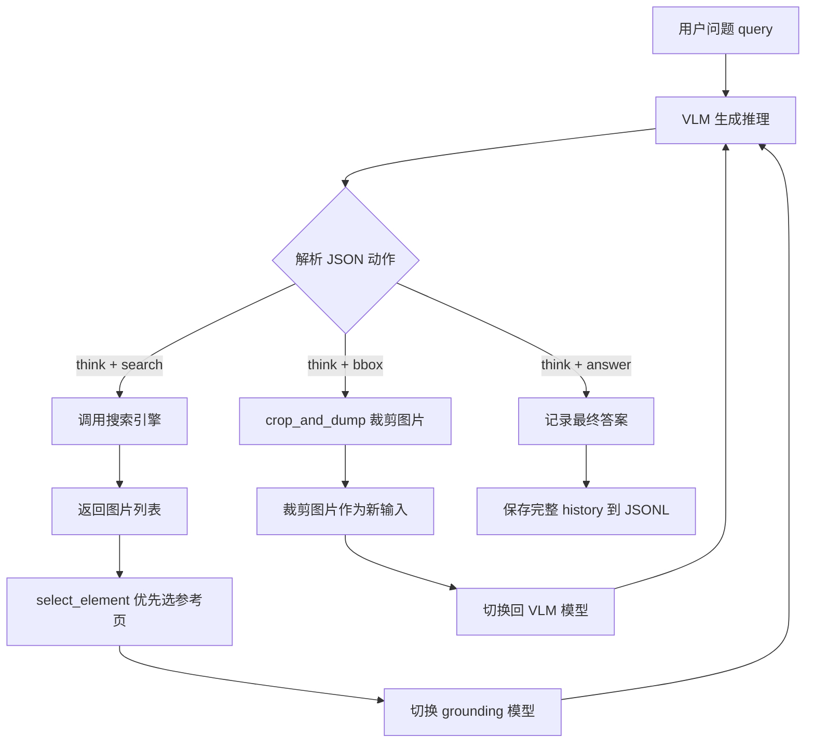
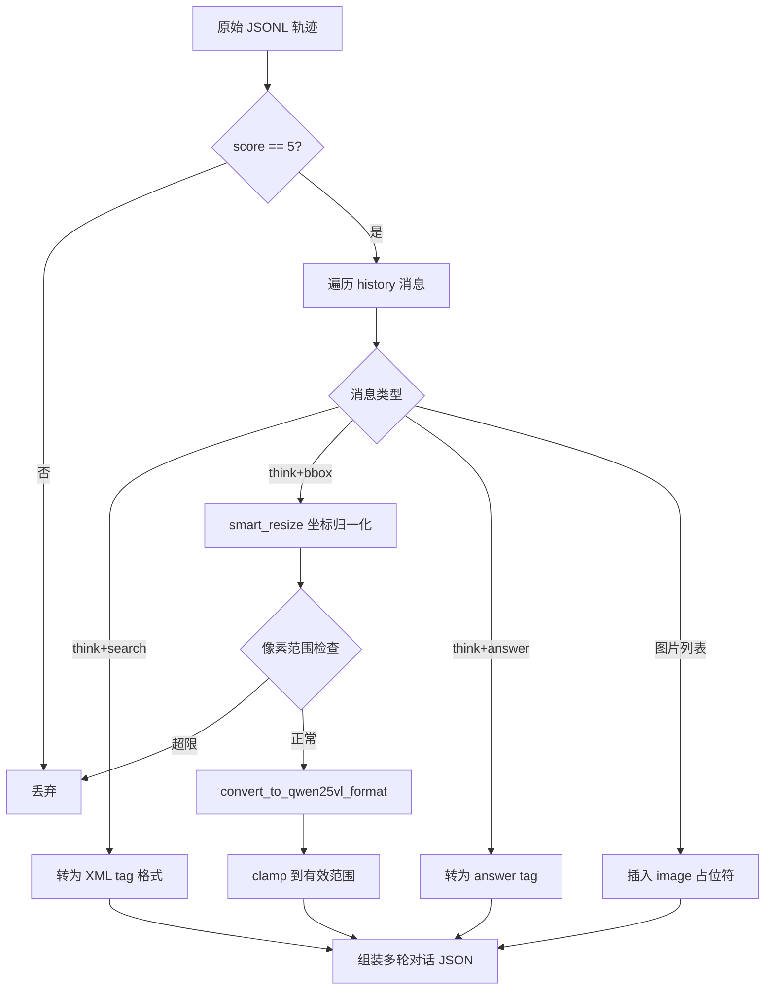

# PD-361.01 VRAG — DashScope 专家模型 CoT 训练数据构建流水线

> 文档编号：PD-361.01
> 来源：VRAG `VRAG-RL/scripts/data_construct_pipeline.py`
> GitHub：https://github.com/Alibaba-NLP/VRAG.git
> 问题域：PD-361 训练数据构建 Training Data Construction
> 状态：可复用方案

---

## 第 1 章 问题与动机

### 1.1 核心问题

视觉 RAG（Retrieval-Augmented Generation）系统需要训练数据来教会模型"何时搜索、搜索什么、如何裁剪图片、如何推理回答"这一完整的多轮交互链路。传统做法是人工标注多轮对话轨迹，成本极高且难以覆盖足够多的推理模式。

核心挑战：
1. **轨迹采样成本**：每条训练样本包含 search → 看图 → crop → 再推理 → answer 的多步交互，人工标注一条需要数十分钟
2. **坐标系不一致**：专家模型输出的 bbox 是原始像素坐标，但训练目标模型（Qwen2.5-VL）使用经过 smart_resize 后的坐标系，直接使用会导致裁剪区域偏移
3. **质量过滤**：专家模型生成的轨迹并非全部高质量，需要自动化的评分筛选机制
4. **格式碎片化**：上游数据来自 SlideVQA、ViDoSeek、MMLongBench-Doc 等多个 benchmark，格式各异，需统一为 Parquet 供 RL 训练消费

### 1.2 VRAG 的解法概述

VRAG 构建了一条三阶段数据流水线：

1. **专家模型轨迹采样**（`data_construct_pipeline.py:162-310`）：用 DashScope 的 `qwen-vl-max-latest` 作为 VLM 专家 + `qwen2.5-vl-72b-instruct` 作为 grounding 专家 + `qwen-max-latest` 作为 LLM 专家，自动执行 search-crop-answer 多轮交互，记录完整轨迹
2. **SFT 格式转换**（`cot_convert_sft.py:52-119`）：将专家轨迹转为 LLaMA-Factory 兼容的多轮对话格式，同时做 bbox 坐标系归一化和质量过滤（仅保留 score=5 的样本）
3. **Parquet 统一转换**（`hf_dataset_convert.py:14-99`）：将多源 benchmark 数据统一为 HuggingFace Dataset Parquet 格式，附加 `data_source`、`reason_type`、`content_type` 元数据

### 1.3 设计思想

| 设计原则 | 具体实现 | 理由 | 替代方案 |
|----------|----------|------|----------|
| 强模型教弱模型 | 用 qwen-vl-max + 72B grounding 生成轨迹，训练 7B 模型 | 强模型能产出高质量推理链，弱模型通过 SFT+RL 学习模式 | 人工标注（成本 10x+）、自我蒸馏（质量不稳定） |
| 三模型协作采样 | VLM 负责推理+搜索、grounding 模型负责 bbox 定位、LLM 负责纯文本推理 | 各模型发挥专长，bbox 定位需要专门的 grounding 能力 | 单模型全包（bbox 精度差） |
| 坐标系后归一化 | 采样时用原始坐标，转 SFT 时统一做 smart_resize 归一化 | 解耦采样与训练格式，采样阶段不受目标模型约束 | 采样时直接归一化（耦合度高） |
| 追加式断点续传 | JSONL 追加写入 + uid 去重跳过已处理样本 | 大规模采样耗时数天，中断后可无缝续传 | 全量重跑（浪费 API 调用费用） |
| 多源元数据保留 | 转 Parquet 时保留 `data_source`、`reason_type`、`content_type` | RL 训练时 reward 函数按 data_source 路由不同评分逻辑 | 丢弃元数据（无法差异化评分） |

---

## 第 2 章 源码实现分析

### 2.1 架构概览

VRAG 的训练数据构建是一条三阶段流水线，从原始 benchmark 到可训练 Parquet：

```
┌─────────────────────────────────────────────────────────────────────┐
│                    VRAG 训练数据构建流水线                            │
├─────────────────────────────────────────────────────────────────────┤
│                                                                     │
│  Stage 1: 专家轨迹采样 (data_construct_pipeline.py)                  │
│  ┌──────────┐    ┌──────────┐    ┌──────────────┐                   │
│  │ 用户问题  │───→│ VLM 推理  │───→│ search/crop  │──┐               │
│  │ + 图片库  │    │ (专家模型) │    │  /answer     │  │               │
│  └──────────┘    └──────────┘    └──────────────┘  │               │
│       ↑                                             │               │
│       └──── 搜索引擎返回图片 ←── crop 裁剪 ←────────┘               │
│                          ↓                                          │
│                   JSONL (含完整 history)                             │
│                          ↓                                          │
│  Stage 2: SFT 格式转换 (cot_convert_sft.py)                         │
│  ┌──────────────┐    ┌──────────────┐    ┌──────────────┐          │
│  │ score=5 过滤  │───→│ bbox 坐标归一 │───→│ XML tag 格式  │          │
│  │              │    │ (smart_resize)│    │ 多轮对话      │          │
│  └──────────────┘    └──────────────┘    └──────────────┘          │
│                          ↓                                          │
│                   JSON (LLaMA-Factory 格式)                         │
│                          ↓                                          │
│  Stage 3: Parquet 统一转换 (hf_dataset_convert.py)                   │
│  ┌──────────────┐    ┌──────────────┐    ┌──────────────┐          │
│  │ 多源 JSON 合并│───→│ 元数据标注    │───→│ HF Dataset   │          │
│  │ SlideVQA/    │    │ source/type  │    │ → Parquet    │          │
│  │ ViDoSeek/... │    │              │    │              │          │
│  └──────────────┘    └──────────────┘    └──────────────┘          │
│                          ↓                                          │
│              train.parquet + test.parquet                            │
│                          ↓                                          │
│              GRPO 训练 (train_grpo_qwen2_5_vl_7b.sh)                │
└─────────────────────────────────────────────────────────────────────┘
```

### 2.2 核心实现

#### 2.2.1 专家模型多轮轨迹采样



对应源码 `VRAG-RL/scripts/data_construct_pipeline.py:192-310`：

```python
def cot_collect(self, sample):
    query = sample['query']
    reference_images = [f'{raw_image_dir}/'+sample['meta_info']['file_name'].replace(
        '.pdf', f"_{i}.jpg") for i in sample['meta_info']['reference_page']]
    all_images = []
    history = [{"query": query}]
    messages = []
    messages.append({"role": "system", "content": [{"text": prompt_inst}]})
    messages.append({"role": "user", "content": [
        {"text": prompt_user_start.replace('{question}', query)}]})
    try_times = 10
    grounding = False
    while True:
        try_times -= 1
        if try_times < 0:
            return None
        # 根据当前阶段选择不同专家模型
        if grounding:
            response = self.vlm_grounding.generate(messages)  # 72B grounding
        else:
            response = self.vlm.generate(messages)  # qwen-vl-max
        response_json = extract_json(response)
        
        if 'think' in response_json and 'answer' in response_json:
            history.append(response_json)
            break  # 采样完成
        elif 'think' in response_json and 'search' in response_json:
            # 调用搜索引擎，优先选择参考页中的图片
            image_input = select_element(image_path_list, reference_images, all_images)
            grounding = True  # 下一轮切换到 grounding 模型
        elif 'think' in response_json and 'bbox' in response_json:
            croped_image_path = crop_and_dump(all_images[-1], bbox)
            grounding = False  # crop 后切回普通 VLM
    sample['history'] = history
    return sample
```

关键设计点：
- **三模型切换**（`data_construct_pipeline.py:221-224`）：搜索后切换到 `qwen2.5-vl-72b-instruct` 做 grounding，crop 后切回 `qwen-vl-max` 做推理
- **参考页优先选择**（`data_construct_pipeline.py:244-254`）：`select_element` 函数优先选搜索结果中属于参考页且未被使用过的图片，确保轨迹覆盖正确答案所在页面
- **最大轮次保护**（`data_construct_pipeline.py:213-217`）：`try_times=10` 防止无限循环

#### 2.2.2 bbox 坐标系归一化与质量过滤



对应源码 `VRAG-RL/scripts/cot_convert_sft.py:6-49`：

```python
def smart_resize(height: int, width: int, factor: int = 28,
                 min_pixels: int = 56 * 56, max_pixels: int = 14 * 14 * 4 * 1280):
    """Qwen2.5-VL 的图片缩放算法：保持宽高为 factor 的倍数，像素总量在范围内"""
    h_bar = round(height / factor) * factor
    w_bar = round(width / factor) * factor
    if h_bar * w_bar > max_pixels:
        beta = math.sqrt((height * width) / max_pixels)
        h_bar = math.floor(height / beta / factor) * factor
        w_bar = math.floor(width / beta / factor) * factor
    elif h_bar * w_bar < min_pixels:
        beta = math.sqrt(min_pixels / (height * width))
        h_bar = math.ceil(height * beta / factor) * factor
        w_bar = math.ceil(width * beta / factor) * factor
    return h_bar, w_bar

def convert_to_qwen25vl_format(bbox, orig_height, orig_width, factor=28,
                                min_pixels=56*56, max_pixels=14*14*4*1280):
    new_height, new_width = smart_resize(orig_height, orig_width, factor, min_pixels, max_pixels)
    scale_w = new_width / orig_width
    scale_h = new_height / orig_height
    x1, y1, x2, y2 = bbox
    x1_new = max(0, min(round(x1 * scale_w), new_width - 1))
    y1_new = max(0, min(round(y1 * scale_h), new_height - 1))
    x2_new = max(0, min(round(x2 * scale_w), new_width - 1))
    y2_new = max(0, min(round(y2 * scale_h), new_height - 1))
    return [x1_new, y1_new, x2_new, y2_new]
```

关键设计点：
- **factor=28 对齐**（`cot_convert_sft.py:7`）：Qwen2.5-VL 的 ViT patch size 为 14，merge_size=2，所以最小对齐单位是 28 像素
- **双重像素范围检查**（`cot_convert_sft.py:86-89`）：原始图片像素总量必须在 `[56*56, 14*14*4*1280]` 范围内，超出则丢弃该样本
- **bbox 越界检查**（`cot_convert_sft.py:88-89`）：bbox 坐标不能超过原始图片尺寸

### 2.3 实现细节

#### 并行采样与断点续传

`data_construct_pipeline.py:313-358` 实现了两种执行模式：

- **单线程模式**（`workers_num=1`）：逐条处理，每条立即追加写入 JSONL
- **多线程模式**（`workers_num>1`）：ThreadPoolExecutor 并行采样，每 3 条批量写入

断点续传通过 uid 去重实现（`data_construct_pipeline.py:322-327`）：
```python
if os.path.exists(self.output_file_path):
    results = []
    with open(self.output_file_path, "r") as f:
        for line in f:
            results.append(json.loads(line.strip()))
    uid_already = [item['uid'] for item in results]
    data = [item for item in data if item['uid'] not in uid_already]
```

#### 多源数据统一与元数据标注

`hf_dataset_convert.py:24-46` 根据 `data_source` 字段为不同 benchmark 标注推理类型和内容类型：

- **SlideVQA**：区分 Multi-Hop/Single-Hop 推理 + Span/Non-Span 内容
- **ViDoSeek**：直接使用 meta_info 中的 query_type 和 source_type
- **MMLongBench-Doc**：用 `####` 连接多个 source_type，doc_type 作为 reason_type

#### 奖励函数路由

`verl/utils/reward_score/__init__.py:17-49` 实现了按 `data_source` 路由的奖励评分：

```python
def _default_compute_score(data_source, solution_str, ground_truth, extra_info=None):
    if data_source in ['rag', 'slidevqa_test', 'mmlongdoc', 'vidoseek']:
        from . import vrag
        res = vrag.compute_format_reward_only(solution_str, ground_truth, extra_info)
```

VRAG 的奖励函数（`verl/utils/reward_score/vrag.py:48-59`）采用双重评分：
1. **格式奖励**：必须同时包含 `<search>` 和 `<answer>` 标签才得 1.0 分
2. **内容奖励**：通过 ANLS（Average Normalized Levenshtein Similarity）计算答案相似度，阈值 0.5


---

## 第 3 章 迁移指南

### 3.1 迁移清单

**阶段 1：专家轨迹采样器**
- [ ] 选择专家模型（需要 VLM + grounding + LLM 三种能力）
- [ ] 实现搜索引擎接口（HTTP GET，返回图片路径列表）
- [ ] 实现 crop_and_dump 图片裁剪与持久化
- [ ] 实现 JSON 格式的动作解析（think/search/bbox/answer）
- [ ] 实现 JSONL 追加写入 + uid 断点续传

**阶段 2：SFT 格式转换器**
- [ ] 实现目标模型的坐标系归一化（不同 VLM 的 resize 策略不同）
- [ ] 实现质量过滤（评分阈值、像素范围、bbox 越界检查）
- [ ] 实现多轮对话格式转换（XML tag 或 chat template）

**阶段 3：Parquet 统一转换器**
- [ ] 定义统一的 Parquet schema（prompt、answer、metadata）
- [ ] 实现多源数据合并与元数据标注
- [ ] 确保 reward 函数能按 data_source 路由

### 3.2 适配代码模板

以下是一个可复用的专家轨迹采样器模板，抽象了 VRAG 的核心模式：

```python
"""
可复用的专家模型轨迹采样器模板
基于 VRAG data_construct_pipeline.py 的设计模式
"""
import json
import os
from abc import ABC, abstractmethod
from concurrent.futures import ThreadPoolExecutor, as_completed
from dataclasses import dataclass, field
from typing import List, Dict, Optional, Any
from tqdm import tqdm


@dataclass
class TrajectoryConfig:
    max_turns: int = 10
    workers_num: int = 1
    output_dir: str = "./data"
    batch_flush_size: int = 3  # 多线程模式下每 N 条刷盘


class ExpertModel(ABC):
    """专家模型抽象基类"""
    @abstractmethod
    def generate(self, messages: List[Dict]) -> str:
        ...


class ActionParser:
    """动作解析器：从专家模型输出中提取结构化动作"""
    
    @staticmethod
    def parse(response: str) -> Dict[str, Any]:
        response = response.replace("```json", "").replace("```", "")
        return json.loads(response)
    
    @staticmethod
    def get_action_type(parsed: Dict) -> str:
        if 'answer' in parsed:
            return 'answer'
        elif 'search' in parsed:
            return 'search'
        elif 'bbox' in parsed:
            return 'bbox'
        return 'unknown'


class TrajectoryCollector:
    """
    专家轨迹采样器
    核心模式：多模型协作 + 动作循环 + 断点续传
    """
    
    def __init__(self, config: TrajectoryConfig,
                 reasoning_model: ExpertModel,
                 grounding_model: ExpertModel,
                 search_fn=None):
        self.config = config
        self.reasoning_model = reasoning_model
        self.grounding_model = grounding_model
        self.search_fn = search_fn
        self.parser = ActionParser()
    
    def collect_one(self, sample: Dict) -> Optional[Dict]:
        """采样单条轨迹（对应 VRAG 的 cot_collect）"""
        messages = self._build_initial_messages(sample)
        history = [{"query": sample['query']}]
        use_grounding = False
        
        for turn in range(self.config.max_turns):
            model = self.grounding_model if use_grounding else self.reasoning_model
            response = model.generate(messages)
            if response is None:
                return None
            
            parsed = self.parser.parse(response)
            action = self.parser.get_action_type(parsed)
            history.append(parsed)
            
            if action == 'answer':
                break
            elif action == 'search':
                obs = self.search_fn(parsed['search'])
                messages.append({"role": "assistant", "content": [{"text": response}]})
                messages.append({"role": "user", "content": obs})
                use_grounding = True  # 搜索后切换到 grounding
            elif action == 'bbox':
                cropped = self._crop_image(parsed['bbox'])
                messages.append({"role": "assistant", "content": [{"text": response}]})
                messages.append({"role": "user", "content": [{"image": cropped}]})
                use_grounding = False  # crop 后切回推理
        
        sample['history'] = history
        return sample
    
    def collect_dataset(self, data: List[Dict], output_file: str):
        """批量采样 + 断点续传（对应 VRAG 的 eval_dataset）"""
        output_path = os.path.join(self.config.output_dir, output_file)
        
        # 断点续传：跳过已处理的 uid
        processed_uids = set()
        if os.path.exists(output_path):
            with open(output_path, "r") as f:
                for line in f:
                    item = json.loads(line.strip())
                    processed_uids.add(item.get('uid'))
        data = [d for d in data if d.get('uid') not in processed_uids]
        
        if self.config.workers_num <= 1:
            for item in tqdm(data):
                result = self.collect_one(item)
                if result:
                    with open(output_path, "a") as f:
                        f.write(json.dumps(result, ensure_ascii=False) + "\n")
        else:
            with ThreadPoolExecutor(max_workers=self.config.workers_num) as executor:
                futures = [executor.submit(self.collect_one, item) for item in data]
                buffer = []
                for future in tqdm(as_completed(futures), total=len(futures)):
                    result = future.result()
                    if result:
                        buffer.append(result)
                    if len(buffer) >= self.config.batch_flush_size:
                        with open(output_path, "a") as f:
                            for res in buffer:
                                f.write(json.dumps(res, ensure_ascii=False) + "\n")
                        buffer = []
                if buffer:
                    with open(output_path, "a") as f:
                        for res in buffer:
                            f.write(json.dumps(res, ensure_ascii=False) + "\n")
    
    def _build_initial_messages(self, sample: Dict) -> List[Dict]:
        """构建初始消息（可覆盖）"""
        return [
            {"role": "system", "content": [{"text": "You are an intelligent assistant..."}]},
            {"role": "user", "content": [{"text": f"Question: {sample['query']}"}]}
        ]
    
    def _crop_image(self, bbox: List[int]) -> Optional[str]:
        """裁剪图片（可覆盖）"""
        raise NotImplementedError("Override _crop_image for your image storage")
```

### 3.3 适用场景

| 场景 | 适用度 | 说明 |
|------|--------|------|
| 视觉 RAG 训练数据构建 | ⭐⭐⭐ | 完全匹配，search+crop+answer 多轮交互 |
| 文本 RAG CoT 数据构建 | ⭐⭐⭐ | 去掉 crop/bbox 部分即可，search+answer 模式通用 |
| 多模态 Agent 轨迹采样 | ⭐⭐ | 需要扩展动作空间（不只 search/crop/answer） |
| 代码生成训练数据 | ⭐ | 动作模式不同（edit/run/test），需重新设计 |
| 单轮 QA 数据构建 | ⭐ | 过度设计，单轮不需要多步交互循环 |

---

## 第 4 章 测试用例

```python
"""
基于 VRAG 真实函数签名的测试用例
覆盖：坐标归一化、质量过滤、动作解析、奖励评分
"""
import pytest
import json
import math


# ===== 测试 smart_resize（来自 cot_convert_sft.py:6-30）=====

def smart_resize(height, width, factor=28, min_pixels=56*56, max_pixels=14*14*4*1280):
    h_bar = round(height / factor) * factor
    w_bar = round(width / factor) * factor
    if h_bar * w_bar > max_pixels:
        beta = math.sqrt((height * width) / max_pixels)
        h_bar = math.floor(height / beta / factor) * factor
        w_bar = math.floor(width / beta / factor) * factor
    elif h_bar * w_bar < min_pixels:
        beta = math.sqrt(min_pixels / (height * width))
        h_bar = math.ceil(height * beta / factor) * factor
        w_bar = math.ceil(width * beta / factor) * factor
    return h_bar, w_bar


class TestSmartResize:
    def test_normal_image(self):
        """正常尺寸图片应对齐到 factor=28 的倍数"""
        h, w = smart_resize(1080, 1920)
        assert h % 28 == 0
        assert w % 28 == 0
        assert h * w <= 14 * 14 * 4 * 1280
    
    def test_too_large_image(self):
        """超大图片应缩小到 max_pixels 以内"""
        h, w = smart_resize(4000, 6000)
        assert h * w <= 14 * 14 * 4 * 1280
        assert h % 28 == 0
    
    def test_too_small_image(self):
        """过小图片应放大到 min_pixels 以上"""
        h, w = smart_resize(60, 60)
        assert h * w >= 56 * 56
        assert h % 28 == 0
    
    def test_aspect_ratio_preserved(self):
        """宽高比应大致保持"""
        h, w = smart_resize(1000, 2000)
        assert abs(w / h - 2.0) < 0.2  # 允许小偏差


# ===== 测试 convert_to_qwen25vl_format（来自 cot_convert_sft.py:33-49）=====

def convert_to_qwen25vl_format(bbox, orig_height, orig_width, factor=28,
                                min_pixels=56*56, max_pixels=14*14*4*1280):
    new_height, new_width = smart_resize(orig_height, orig_width, factor, min_pixels, max_pixels)
    scale_w = new_width / orig_width
    scale_h = new_height / orig_height
    x1, y1, x2, y2 = bbox
    return [
        max(0, min(round(x1 * scale_w), new_width - 1)),
        max(0, min(round(y1 * scale_h), new_height - 1)),
        max(0, min(round(x2 * scale_w), new_width - 1)),
        max(0, min(round(y2 * scale_h), new_height - 1)),
    ]


class TestBboxConversion:
    def test_normal_bbox(self):
        """正常 bbox 应正确缩放"""
        result = convert_to_qwen25vl_format([100, 200, 300, 400], 1080, 1920)
        assert len(result) == 4
        assert all(isinstance(v, int) for v in result)
        assert result[0] < result[2]  # x1 < x2
        assert result[1] < result[3]  # y1 < y2
    
    def test_bbox_clamped_to_bounds(self):
        """超出边界的 bbox 应被 clamp"""
        result = convert_to_qwen25vl_format([0, 0, 9999, 9999], 100, 100)
        new_h, new_w = smart_resize(100, 100)
        assert result[2] <= new_w - 1
        assert result[3] <= new_h - 1
    
    def test_zero_origin_bbox(self):
        """原点 bbox 应保持为 0"""
        result = convert_to_qwen25vl_format([0, 0, 50, 50], 1000, 1000)
        assert result[0] == 0
        assert result[1] == 0


# ===== 测试动作解析（来自 generation.py:639-668）=====

class TestActionParsing:
    def _parse(self, prediction):
        import re
        pattern = r'<(search|answer|bbox)>(.*?)</\1>'
        match = re.search(pattern, prediction, re.DOTALL)
        if match:
            return match.group(1), match.group(2).strip()
        return None, ''
    
    def test_search_action(self):
        action, content = self._parse('<think>need info</think>\n<search>climate change</search>')
        assert action == 'search'
        assert content == 'climate change'
    
    def test_answer_action(self):
        action, content = self._parse('<think>I know</think>\n<answer>Beijing</answer>')
        assert action == 'answer'
        assert content == 'Beijing'
    
    def test_bbox_action(self):
        action, content = self._parse('<think>zoom in</think>\n<bbox>[10, 20, 300, 400]</bbox>')
        assert action == 'bbox'
        assert content == '[10, 20, 300, 400]'
    
    def test_invalid_format(self):
        action, _ = self._parse('just some random text without tags')
        assert action is None


# ===== 测试 ANLS 奖励评分（来自 vrag.py:31-47）=====

class TestANLSReward:
    def _calculate_anls(self, gold_labels, prediction, threshold=0.5):
        max_scores = []
        for gold_label in gold_labels:
            ld = sum(1 for a, b in zip(prediction, gold_label) if a != b) + abs(len(prediction) - len(gold_label))
            max_len = max(len(prediction), len(gold_label))
            nld = ld / max_len if max_len > 0 else 0.0
            score = 1 - nld if nld < threshold else 0.0
            max_scores.append(score)
        return max(max_scores) if max_scores else 0.0
    
    def test_exact_match(self):
        score = self._calculate_anls(["Beijing"], "Beijing")
        assert score == 1.0
    
    def test_close_match(self):
        score = self._calculate_anls(["Beijing"], "Bejing")  # 1 char diff
        assert score > 0.5
    
    def test_completely_wrong(self):
        score = self._calculate_anls(["Beijing"], "xxxxxxxxxx")
        assert score == 0.0
```


---

## 第 5 章 跨域关联

| 关联域 | 关系类型 | 说明 |
|--------|----------|------|
| PD-01 上下文管理 | 协同 | 多轮轨迹采样时 messages 列表持续增长，需要关注上下文窗口限制；rollout 引擎中 `max_prompt_length=8192` 做了截断保护 |
| PD-03 容错与重试 | 依赖 | `Model_Role.generate_vlm` 实现了 5 次重试循环（`data_construct_pipeline.py:147-160`），DashScope API 调用失败时自动重试 |
| PD-04 工具系统 | 协同 | 训练数据中的 search/crop/answer 三种动作直接对应 RL rollout 阶段的工具调用（`generation.py:574-637`），数据格式与工具系统一一映射 |
| PD-07 质量检查 | 依赖 | SFT 转换阶段的 score=5 过滤依赖上游评估器的评分结果；ANLS 奖励函数（`vrag.py:31-47`）在 RL 训练时持续做质量评估 |
| PD-08 搜索与检索 | 协同 | 轨迹采样依赖搜索引擎（`search_engine_url`）返回图片，搜索质量直接影响训练数据质量 |
| PD-11 可观测性 | 协同 | 训练脚本通过 `trainer.logger=['console']` 记录训练指标，reward 函数的格式奖励 + 内容奖励可用于监控数据质量趋势 |

---

## 第 6 章 来源文件索引

| 文件 | 行范围 | 关键实现 |
|------|--------|----------|
| `VRAG-RL/scripts/data_construct_pipeline.py` | L1-L380 | 专家模型轨迹采样主流水线：MMRAG 类、cot_collect 多轮交互、ThreadPoolExecutor 并行、JSONL 断点续传 |
| `VRAG-RL/scripts/data_construct_pipeline.py` | L115-L161 | Model_Role 类：DashScope LLM/VLM 双模式调用、5 次重试 |
| `VRAG-RL/scripts/data_construct_pipeline.py` | L82-L113 | crop_and_dump：图片裁剪与时间戳命名持久化 |
| `VRAG-RL/scripts/data_construct_pipeline.py` | L244-L254 | select_element：参考页优先选择算法 |
| `VRAG-RL/scripts/cot_convert_sft.py` | L6-L30 | smart_resize：Qwen2.5-VL 坐标系对齐算法 |
| `VRAG-RL/scripts/cot_convert_sft.py` | L33-L49 | convert_to_qwen25vl_format：bbox 坐标归一化 + clamp |
| `VRAG-RL/scripts/cot_convert_sft.py` | L52-L119 | convert 函数：score=5 过滤、history 遍历、XML tag 格式转换 |
| `VRAG-RL/scripts/hf_dataset_convert.py` | L14-L99 | convert_dataset：多源 JSON 合并、元数据标注、Parquet 输出 |
| `VRAG-RL/verl/utils/reward_score/vrag.py` | L31-L47 | calculate_anls：ANLS 评分算法（Levenshtein 距离） |
| `VRAG-RL/verl/utils/reward_score/vrag.py` | L67-L73 | compute_format_reward_only：格式奖励（search+answer 双标签检查） |
| `VRAG-RL/verl/utils/reward_score/__init__.py` | L17-L49 | _default_compute_score：按 data_source 路由奖励函数 |
| `VRAG-RL/vrag_agent/generation.py` | L372-L511 | run_llm_loop：RL rollout 多轮生成循环 |
| `VRAG-RL/vrag_agent/generation.py` | L574-L637 | execute_predictions：环境 step 函数，解析 search/bbox/answer 动作 |
| `VRAG-RL/train_grpo_qwen2_5_vl_7b.sh` | L1-L83 | GRPO 训练启动脚本：超参配置、DashScope reward、搜索引擎 URL |
| `VRAG-RL/scripts/model_merger.py` | L25-L165 | FSDP 分片模型合并：DTensor placement 处理、bfloat16 转换 |

---

## 第 7 章 横向对比维度

```json comparison_data
{
  "project": "VRAG",
  "dimensions": {
    "采样架构": "三模型协作（VLM推理 + 72B grounding + LLM文本），DashScope API 驱动",
    "坐标系处理": "smart_resize factor=28 对齐 + bbox 缩放 clamp，适配 Qwen2.5-VL ViT",
    "质量过滤": "score=5 硬过滤 + 像素范围检查 + bbox 越界检查，三重门控",
    "格式转换": "JSONL → LLaMA-Factory JSON → HuggingFace Parquet 三阶段流水线",
    "断点续传": "JSONL 追加写入 + uid 去重，支持多线程批量刷盘",
    "奖励设计": "格式奖励（search+answer 双标签）+ ANLS 内容奖励，按 data_source 路由"
  }
}
```

### 域元数据补充

```json domain_metadata
{
  "solution_summary": "VRAG 用 DashScope 三模型协作（VLM+72B grounding+LLM）自动采样 search-crop-answer 多轮 CoT 轨迹，经 smart_resize 坐标归一化和 score=5 过滤后转为 Parquet 供 GRPO 训练",
  "description": "涵盖从专家模型轨迹采样到 RL 可消费 Parquet 的端到端数据工程",
  "sub_problems": [
    "多模型协作采样中的模型切换策略",
    "搜索结果中参考页优先选择与去重",
    "JSONL 追加式断点续传与多线程刷盘",
    "RL 奖励函数按数据源路由的分发机制"
  ],
  "best_practices": [
    "采样时用原始坐标，转换时再做目标模型坐标系归一化，解耦采样与训练",
    "格式奖励+内容奖励双重评分，先检查结构再评估语义",
    "多源 benchmark 合并时保留 data_source 元数据，支持差异化奖励路由"
  ]
}
```

