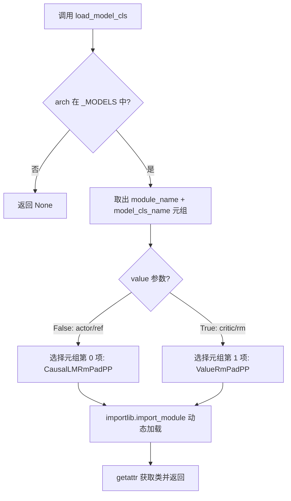
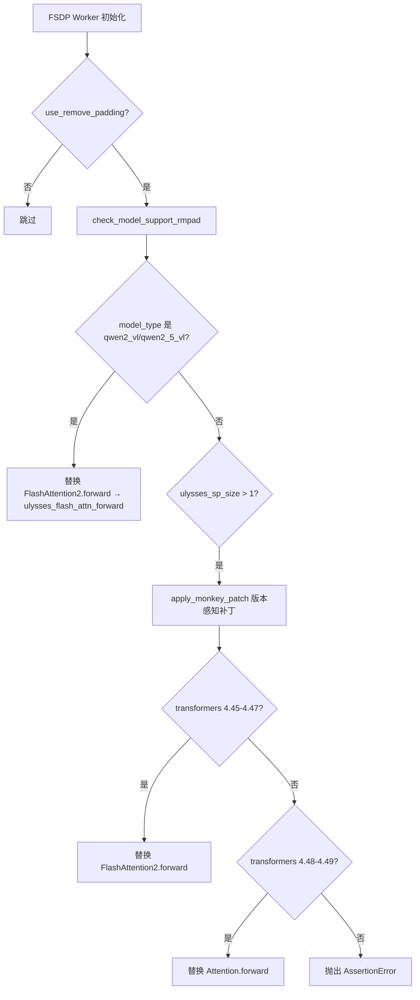

# PD-362.01 VRAG — ModelRegistry 三层注册与 MonkeyPatch 运行时适配

> 文档编号：PD-362.01
> 来源：VRAG-RL `verl/models/registry.py`, `verl/models/weight_loader_registry.py`, `verl/models/transformers/qwen2_vl.py`
> GitHub：https://github.com/Alibaba-NLP/VRAG.git
> 问题域：PD-362 模型注册与适配 Model Registry & Adaptation
> 状态：可复用方案

---

## 第 1 章 问题与动机

### 1.1 核心问题

大规模 RLHF 训练框架需要同时支持多种 LLM 架构（LLaMA、Qwen2、Mistral 等），且每种架构需要在不同后端（HuggingFace Transformers、Megatron-LM 并行）之间切换。核心挑战：

1. **多架构统一抽象**：不同模型架构的并行化实现差异巨大（attention 层数、MLP 结构、RoPE 变体），需要统一的加载接口
2. **运行时模型补丁**：视觉语言模型（Qwen2-VL）需要在运行时替换 attention forward 以支持 Ulysses 序列并行和 3D M-RoPE，不能修改上游 transformers 源码
3. **权重格式转换**：HuggingFace 权重格式与 Megatron 张量并行格式不兼容，每种架构需要独立的 loader/saver
4. **版本兼容**：transformers 库不同版本的 attention 类名和签名不同，monkey patch 必须版本感知

### 1.2 VRAG-RL 的解法概述

VRAG-RL（基于 verl 框架）采用三层注册表架构：

1. **ModelRegistry**（`verl/models/registry.py:55-75`）：架构名 → Megatron 并行模型类的映射，通过 `importlib` 延迟加载，区分 actor/critic 角色
2. **WeightLoaderRegistry**（`verl/models/weight_loader_registry.py:16-38`）：架构名 → 权重加载/保存函数的映射，管理 HF↔Megatron 权重转换
3. **MonkeyPatchRegistry**（`verl/models/transformers/monkey_patch.py:41-44`）：model_type → patch 函数的映射，版本感知地替换 attention forward

三层注册表各司其职，通过架构名字符串（如 `"LlamaForCausalLM"`）或 model_type（如 `"llama"`）作为统一 key 串联。

### 1.3 设计思想

| 设计原则 | 具体实现 | 理由 | 替代方案 |
|----------|----------|------|----------|
| 延迟导入 | `importlib.import_module` 动态加载模型类 (`registry.py:70`) | 避免启动时加载所有架构的 Megatron 实现，节省内存和启动时间 | 顶层 import 所有模型（内存浪费） |
| 角色区分 | 每个架构注册 3 个类：CausalLMRmPadPP / ValueRmPadPP / CausalLMRmPad (`registry.py:44-51`) | RLHF 中 actor 和 critic 是不同模型头，需要不同的并行包装 | 单一模型类 + 运行时切换头（耦合） |
| 运行时补丁 | 直接替换 `FlashAttention2.forward` 方法引用 (`registry.py:37-38`) | 不修改上游 transformers 代码，保持可升级性 | Fork transformers（维护成本高） |
| 版本感知补丁 | `is_transformers_version_in_range` + LRU 缓存 (`monkey_patch.py:72-81`) | transformers 4.45-4.47 和 4.48-4.49 的 attention 类名不同 | 硬编码版本检查（脆弱） |
| 函数级注册 | weight_loader 注册的是函数而非类 (`weight_loader_registry.py:19-22`) | 权重转换是无状态操作，函数比类更轻量 | 类继承体系（过度设计） |

---

## 第 2 章 源码实现分析

### 2.1 架构概览

```
┌─────────────────────────────────────────────────────────────────┐
│                    VRAG-RL Model System                         │
├─────────────────────────────────────────────────────────────────┤
│                                                                 │
│  ┌──────────────┐   ┌───────────────────┐   ┌───────────────┐  │
│  │ ModelRegistry │   │ WeightLoader      │   │ MonkeyPatch   │  │
│  │              │   │ Registry          │   │ Registry      │  │
│  │ arch → class │   │ arch → loader/    │   │ type → patch  │  │
│  │ (importlib)  │   │        saver fn   │   │ fn (versioned)│  │
│  └──────┬───────┘   └────────┬──────────┘   └──────┬────────┘  │
│         │                    │                      │           │
│  ┌──────▼───────────────────▼──────────────────────▼────────┐  │
│  │              Unified Key: architecture string             │  │
│  │     "LlamaForCausalLM" / "Qwen2ForCausalLM" / ...       │  │
│  └──────────────────────────────────────────────────────────┘  │
│         │                    │                      │           │
│  ┌──────▼───────┐   ┌──────▼──────────┐   ┌──────▼────────┐  │
│  │ verl/models/  │   │ checkpoint_utils/│   │ transformers/ │  │
│  │ llama/megatron│   │ llama_loader.py  │   │ qwen2_vl.py   │  │
│  │ qwen2/megatron│   │ qwen2_loader.py  │   │ monkey_patch.py│  │
│  │ mistral/...   │   │ qwen2_saver.py   │   │ llama.py      │  │
│  └──────────────┘   └─────────────────┘   └───────────────┘  │
│                                                                 │
│  Callers:                                                       │
│  ├── verl/utils/model.py          (load_megatron_model_weights) │
│  ├── verl/workers/fsdp_workers.py (check_model_support_rmpad)   │
│  └── verl/workers/megatron_workers.py (save_checkpoint)         │
└─────────────────────────────────────────────────────────────────┘
```

### 2.2 核心实现

#### 2.2.1 ModelRegistry — 架构名到并行模型类的动态加载



对应源码 `VRAG-RL/verl/models/registry.py:44-75`：

```python
# 架构注册表：架构名 → (模块名, (actor类, critic类, 基础类))
_MODELS = {
    "LlamaForCausalLM":
        ("llama", ("ParallelLlamaForCausalLMRmPadPP", "ParallelLlamaForValueRmPadPP",
                   "ParallelLlamaForCausalLMRmPad")),
    "Qwen2ForCausalLM":
        ("qwen2", ("ParallelQwen2ForCausalLMRmPadPP", "ParallelQwen2ForValueRmPadPP",
                   "ParallelQwen2ForCausalLMRmPad")),
    "MistralForCausalLM":
        ("mistral", ("ParallelMistralForCausalLMRmPadPP", "ParallelMistralForValueRmPadPP",
                     "ParallelMistralForCausalLMRmPad"))
}

class ModelRegistry:
    @staticmethod
    def load_model_cls(model_arch: str, value=False) -> Optional[Type[nn.Module]]:
        if model_arch not in _MODELS:
            return None
        module_name, model_cls_name = _MODELS[model_arch]
        if not value:
            model_cls_name = model_cls_name[0]  # actor/ref
        elif value:
            model_cls_name = model_cls_name[1]  # critic/rm
        module = importlib.import_module(
            f"verl.models.{module_name}.megatron.modeling_{module_name}_megatron")
        return getattr(module, model_cls_name, None)
```

调用方 `verl/utils/model.py:269-276` 遍历 HuggingFace config 中的 `architectures` 列表，逐个尝试加载：

```python
def _get_parallel_model_architecture_from_config(config: PretrainedConfig, value=False):
    architectures = getattr(config, "architectures", [])
    for arch in architectures:
        model_cls = ModelRegistry.load_model_cls(arch, value)
        if model_cls is not None:
            return model_cls
    raise ValueError(f"Model architectures {architectures} are not supported for now.")
```

#### 2.2.2 运行时 MonkeyPatch — 版本感知的 Attention 替换



对应源码 `VRAG-RL/verl/models/registry.py:25-39`（RMPad 检查 + VL 补丁）：

```python
_MODELS_SUPPORT_RMPAD = {'llama', 'mistral', 'gemma', 'qwen2', 'qwen2_vl', 'qwen2_5_vl'}

def check_model_support_rmpad(model_type: str):
    assert isinstance(model_type, str)
    if not model_type in _MODELS_SUPPORT_RMPAD:
        raise ValueError(f"Model architecture {model_type} is not supported for now.")
    if model_type in ("qwen2_vl", "qwen2_5_vl"):
        from verl.models.transformers.qwen2_vl import ulysses_flash_attn_forward
        from transformers.models.qwen2_vl.modeling_qwen2_vl import Qwen2VLFlashAttention2
        from transformers.models.qwen2_5_vl.modeling_qwen2_5_vl import Qwen2_5_VLFlashAttention2
        Qwen2VLFlashAttention2.forward = ulysses_flash_attn_forward
        Qwen2_5_VLFlashAttention2.forward = ulysses_flash_attn_forward
```

版本感知补丁 `VRAG-RL/verl/models/transformers/monkey_patch.py:30-44`：

```python
def apply_monkey_patch_to_qwen2():
    if is_transformers_version_in_range("4.45.0", "4.47.1"):
        from transformers.models.qwen2.modeling_qwen2 import Qwen2FlashAttention2
        from verl.models.transformers.qwen2 import qwen2_flash_attn_forward
        Qwen2FlashAttention2.forward = qwen2_flash_attn_forward
    elif is_transformers_version_in_range("4.48.0", "4.49.0"):
        from transformers.models.qwen2.modeling_qwen2 import Qwen2Attention
        from verl.models.transformers.qwen2 import qwen2_attn_forward
        Qwen2Attention.forward = qwen2_attn_forward

_PATCH_NAME_TO_FUNC = {
    'llama': apply_monkey_patch_to_llama,
    'qwen2': apply_monkey_patch_to_qwen2,
}
```

### 2.3 实现细节

#### 权重加载注册表

`VRAG-RL/verl/models/weight_loader_registry.py:16-27` 采用函数内延迟导入 + 字典查找：

```python
def get_weight_loader(arch: str):
    from verl.models.llama.megatron.checkpoint_utils.llama_loader import load_state_dict_to_megatron_llama
    from verl.models.qwen2.megatron.checkpoint_utils.qwen2_loader import load_state_dict_to_megatron_qwen2
    _MODEL_WEIGHT_MEGATRON_LOADER_REGISTRY = {
        'LlamaForCausalLM': load_state_dict_to_megatron_llama,
        'Qwen2ForCausalLM': load_state_dict_to_megatron_qwen2,
    }
    if arch in _MODEL_WEIGHT_MEGATRON_LOADER_REGISTRY:
        return _MODEL_WEIGHT_MEGATRON_LOADER_REGISTRY[arch]
    raise ValueError(f"Model architectures {arch} loader are not supported for now.")
```

注意：每次调用 `get_weight_loader` 都会重新构建字典并重新导入。这是有意为之——权重加载只在初始化时调用一次，不需要缓存优化。

#### Ulysses 序列并行集成

`ulysses_flash_attn_forward`（`qwen2_vl.py:217-287`）是 Qwen2-VL 的核心补丁，实现了：

1. **AllToAll 通信**：`gather_seq_scatter_heads` 将序列维度聚合、注意力头维度分散到不同 GPU（`qwen2_vl.py:241-243`）
2. **3D M-RoPE 处理**：通过 `position_ids` 传递 3D 位置编码（时间、高度、宽度），在 `flash_attention_forward` 中用 `prepare_fa2_from_position_ids` 转换为 `cu_seqlens` 格式（`qwen2_vl.py:134-146`）
3. **反向 AllToAll**：attention 输出后 `gather_heads_scatter_seq` 恢复原始分布（`qwen2_vl.py:283`）

#### 目录约定

每个架构遵循统一的目录结构：

```
verl/models/{arch_name}/
├── __init__.py                          # 导出并行模型类
└── megatron/
    ├── __init__.py                      # 导出 6 个模型变体
    ├── modeling_{arch_name}_megatron.py  # 核心并行实现
    ├── checkpoint_utils/
    │   ├── {arch_name}_loader.py        # HF → Megatron 权重转换
    │   └── {arch_name}_saver.py         # Megatron → HF 权重转换
    └── layers/
        ├── parallel_attention.py        # 并行 attention 层
        ├── parallel_decoder.py          # 并行 decoder 层
        ├── parallel_mlp.py              # 并行 MLP 层
        └── parallel_rmsnorm.py          # 并行 RMSNorm
```

这种约定使得 `ModelRegistry` 可以用 `f"verl.models.{module_name}.megatron.modeling_{module_name}_megatron"` 统一构造模块路径。

---

## 第 3 章 迁移指南

### 3.1 迁移清单

**阶段 1：基础注册表（1 个架构）**

- [ ] 创建 `models/registry.py`，定义 `_MODELS` 字典和 `ModelRegistry` 类
- [ ] 为第一个架构（如 LLaMA）实现并行模型类
- [ ] 建立 `models/{arch}/megatron/` 目录结构
- [ ] 实现 `load_model_cls` 的 `importlib` 延迟加载

**阶段 2：权重转换层**

- [ ] 创建 `models/weight_loader_registry.py`
- [ ] 实现第一个架构的 HF → 并行格式权重转换函数
- [ ] 实现反向转换（saver）用于 checkpoint 保存

**阶段 3：MonkeyPatch 系统**

- [ ] 创建 `models/transformers/monkey_patch.py`
- [ ] 实现版本检测函数 `is_transformers_version_in_range`
- [ ] 为需要序列并行的模型实现 attention forward 替换

**阶段 4：扩展新架构**

- [ ] 在 `_MODELS` 中添加新架构条目
- [ ] 按目录约定创建新架构的并行实现
- [ ] 在 `weight_loader_registry` 中注册新的 loader/saver
- [ ] 如需 monkey patch，在 `_PATCH_NAME_TO_FUNC` 中注册

### 3.2 适配代码模板

#### 模板 1：通用模型注册表

```python
"""model_registry.py — 可直接复用的模型注册表模板"""
import importlib
from typing import Dict, List, Optional, Tuple, Type
import torch.nn as nn

# 架构名 → (模块路径片段, (主模型类名, 辅助模型类名))
_MODEL_REGISTRY: Dict[str, Tuple[str, Tuple[str, ...]]] = {}


def register_model(arch_name: str, module_name: str, class_names: Tuple[str, ...]):
    """装饰器或直接调用注册新架构"""
    _MODEL_REGISTRY[arch_name] = (module_name, class_names)


def load_model_class(
    arch: str,
    variant_index: int = 0,
    base_package: str = "my_project.models"
) -> Optional[Type[nn.Module]]:
    """按架构名动态加载模型类
    
    Args:
        arch: HuggingFace 架构名，如 "LlamaForCausalLM"
        variant_index: 模型变体索引（0=主模型, 1=value模型, ...）
        base_package: 模型模块的基础包路径
    """
    if arch not in _MODEL_REGISTRY:
        return None
    module_name, class_names = _MODEL_REGISTRY[arch]
    if variant_index >= len(class_names):
        raise IndexError(f"Variant index {variant_index} out of range for {arch}")
    target_cls_name = class_names[variant_index]
    module = importlib.import_module(f"{base_package}.{module_name}")
    return getattr(module, target_cls_name, None)


def get_supported_architectures() -> List[str]:
    return list(_MODEL_REGISTRY.keys())


# 注册示例
register_model("LlamaForCausalLM", "llama.parallel_llama", ("ParallelLlama", "ParallelLlamaValue"))
register_model("Qwen2ForCausalLM", "qwen2.parallel_qwen2", ("ParallelQwen2", "ParallelQwen2Value"))
```

#### 模板 2：版本感知 MonkeyPatch 系统

```python
"""monkey_patch.py — 版本感知的运行时模型补丁模板"""
from functools import lru_cache
from typing import Callable, Dict
from packaging import version
import importlib.metadata


@lru_cache()
def get_lib_version(package: str) -> str:
    return importlib.metadata.version(package)


def version_in_range(package: str, min_ver: str, max_ver: str) -> bool:
    ver = version.parse(get_lib_version(package))
    return version.parse(min_ver) <= ver <= version.parse(max_ver)


# model_type → patch 函数
_PATCH_REGISTRY: Dict[str, Callable] = {}


def register_patch(model_type: str):
    """装饰器：注册 monkey patch 函数"""
    def decorator(fn: Callable):
        _PATCH_REGISTRY[model_type] = fn
        return fn
    return decorator


@register_patch("qwen2_vl")
def patch_qwen2_vl():
    """替换 Qwen2-VL 的 attention forward 以支持序列并行"""
    from transformers.models.qwen2_vl.modeling_qwen2_vl import Qwen2VLFlashAttention2
    from my_project.models.qwen2_vl_attn import custom_flash_attn_forward
    Qwen2VLFlashAttention2.forward = custom_flash_attn_forward


def apply_patches(model_type: str, verbose: bool = True) -> bool:
    if model_type not in _PATCH_REGISTRY:
        return False
    _PATCH_REGISTRY[model_type]()
    if verbose:
        print(f"Applied monkey patch for {model_type}")
    return True
```

### 3.3 适用场景

| 场景 | 适用度 | 说明 |
|------|--------|------|
| 多架构 RLHF/RL 训练框架 | ⭐⭐⭐ | 核心场景：需要在 actor/critic 间切换不同并行模型 |
| 多后端推理服务 | ⭐⭐⭐ | 统一接口加载不同架构到 vLLM/TensorRT 等后端 |
| 视觉语言模型训练 | ⭐⭐⭐ | MonkeyPatch 系统对 VLM 的序列并行支持是关键 |
| 单架构微调 | ⭐ | 只有一种架构时注册表是过度设计 |
| 纯推理部署 | ⭐⭐ | 权重转换层有用，但 MonkeyPatch 可能不需要 |

---

## 第 4 章 测试用例

```python
"""test_model_registry.py — 基于 VRAG-RL 真实接口的测试"""
import pytest
from unittest.mock import MagicMock, patch
from typing import Optional, Type
import torch.nn as nn


# ---- 测试 ModelRegistry ----

class TestModelRegistry:
    """测试模型注册表的核心功能"""

    def test_load_supported_arch_actor(self):
        """正常路径：加载已注册架构的 actor 模型类"""
        from verl.models.registry import ModelRegistry
        cls = ModelRegistry.load_model_cls("LlamaForCausalLM", value=False)
        assert cls is not None
        assert "CausalLM" in cls.__name__

    def test_load_supported_arch_critic(self):
        """正常路径：加载已注册架构的 critic 模型类"""
        from verl.models.registry import ModelRegistry
        cls = ModelRegistry.load_model_cls("LlamaForCausalLM", value=True)
        assert cls is not None
        assert "Value" in cls.__name__

    def test_load_unsupported_arch_returns_none(self):
        """边界情况：未注册架构返回 None"""
        from verl.models.registry import ModelRegistry
        cls = ModelRegistry.load_model_cls("GPT2ForCausalLM")
        assert cls is None

    def test_get_supported_archs(self):
        """验证支持的架构列表"""
        from verl.models.registry import ModelRegistry
        archs = ModelRegistry.get_supported_archs()
        assert "LlamaForCausalLM" in archs
        assert "Qwen2ForCausalLM" in archs
        assert len(archs) >= 3


# ---- 测试 check_model_support_rmpad ----

class TestRmpadSupport:
    """测试 RMPad 支持检查与 monkey patch 触发"""

    def test_supported_model_type(self):
        """正常路径：支持的 model_type 不抛异常"""
        from verl.models.registry import check_model_support_rmpad
        # 不应抛出异常
        check_model_support_rmpad("llama")

    def test_unsupported_model_type_raises(self):
        """边界情况：不支持的 model_type 抛出 ValueError"""
        from verl.models.registry import check_model_support_rmpad
        with pytest.raises(ValueError, match="not supported"):
            check_model_support_rmpad("gpt2")

    @patch("verl.models.registry.Qwen2VLFlashAttention2", create=True)
    def test_qwen2_vl_triggers_patch(self):
        """验证 qwen2_vl 触发 attention forward 替换"""
        from verl.models.registry import check_model_support_rmpad
        # 调用后 Qwen2VLFlashAttention2.forward 应被替换
        check_model_support_rmpad("qwen2_vl")


# ---- 测试 WeightLoaderRegistry ----

class TestWeightLoaderRegistry:
    """测试权重加载注册表"""

    def test_get_loader_for_supported_arch(self):
        """正常路径：获取已注册架构的 loader"""
        from verl.models.weight_loader_registry import get_weight_loader
        loader = get_weight_loader("LlamaForCausalLM")
        assert callable(loader)

    def test_get_loader_unsupported_raises(self):
        """边界情况：未注册架构抛出 ValueError"""
        from verl.models.weight_loader_registry import get_weight_loader
        with pytest.raises(ValueError, match="not supported"):
            get_weight_loader("GPT2ForCausalLM")

    def test_get_saver_for_supported_arch(self):
        """正常路径：获取已注册架构的 saver"""
        from verl.models.weight_loader_registry import get_weight_saver
        saver = get_weight_saver("Qwen2ForCausalLM")
        assert callable(saver)


# ---- 测试版本感知补丁 ----

class TestMonkeyPatch:
    """测试版本感知的 monkey patch 系统"""

    @patch("verl.models.transformers.monkey_patch.importlib.metadata.version", return_value="4.46.0")
    def test_version_in_range(self, mock_ver):
        """正常路径：版本在范围内"""
        from verl.models.transformers.monkey_patch import is_transformers_version_in_range
        is_transformers_version_in_range.cache_clear()
        assert is_transformers_version_in_range("4.45.0", "4.47.1") is True

    @patch("verl.models.transformers.monkey_patch.importlib.metadata.version", return_value="4.44.0")
    def test_version_out_of_range(self, mock_ver):
        """边界情况：版本不在范围内"""
        from verl.models.transformers.monkey_patch import is_transformers_version_in_range
        is_transformers_version_in_range.cache_clear()
        assert is_transformers_version_in_range("4.45.0", "4.47.1") is False
```

---

## 第 5 章 跨域关联

| 关联域 | 关系类型 | 说明 |
|--------|----------|------|
| PD-02 多 Agent 编排 | 协同 | ModelRegistry 的 actor/critic 角色区分直接服务于 RLHF 多 Agent 编排，actor 和 critic 通过注册表加载不同的并行模型类 |
| PD-03 容错与重试 | 协同 | `get_weight_loader` 在权重加载失败时抛出明确的 ValueError，上层 `load_megatron_model_weights` 可据此触发降级策略 |
| PD-04 工具系统 | 类比 | 三层注册表模式（模型注册、权重注册、补丁注册）与工具系统的注册表模式高度相似，都是 key→handler 的动态分发 |
| PD-10 中间件管道 | 协同 | MonkeyPatch 系统本质上是一个 attention 层的中间件替换，`check_model_support_rmpad` 在 FSDP Worker 初始化管道中作为前置检查节点 |

---

## 第 6 章 来源文件索引

| 文件 | 行范围 | 关键实现 |
|------|--------|----------|
| `VRAG-RL/verl/models/registry.py` | L22 | `_MODELS_SUPPORT_RMPAD` 集合：支持 RMPad 的 model_type 白名单 |
| `VRAG-RL/verl/models/registry.py` | L25-39 | `check_model_support_rmpad`：RMPad 支持检查 + Qwen2-VL monkey patch 触发 |
| `VRAG-RL/verl/models/registry.py` | L44-51 | `_MODELS` 字典：架构名 → Megatron 并行模型类映射 |
| `VRAG-RL/verl/models/registry.py` | L55-75 | `ModelRegistry` 类：`load_model_cls` + `get_supported_archs` |
| `VRAG-RL/verl/models/weight_loader_registry.py` | L16-27 | `get_weight_loader`：架构名 → HF→Megatron 权重加载函数 |
| `VRAG-RL/verl/models/weight_loader_registry.py` | L30-38 | `get_weight_saver`：架构名 → Megatron→HF 权重保存函数 |
| `VRAG-RL/verl/models/transformers/qwen2_vl.py` | L31-131 | `get_rope_index`：Qwen2-VL 3D M-RoPE 位置编码计算 |
| `VRAG-RL/verl/models/transformers/qwen2_vl.py` | L134-146 | `prepare_fa2_from_position_ids`：3D position_ids → cu_seqlens 转换 |
| `VRAG-RL/verl/models/transformers/qwen2_vl.py` | L149-214 | `flash_attention_forward`：支持 M-RoPE 的 flash attention 封装 |
| `VRAG-RL/verl/models/transformers/qwen2_vl.py` | L217-287 | `ulysses_flash_attn_forward`：Ulysses 序列并行 attention forward |
| `VRAG-RL/verl/models/transformers/monkey_patch.py` | L19-44 | 版本感知 patch 函数 + `_PATCH_NAME_TO_FUNC` 注册表 |
| `VRAG-RL/verl/models/transformers/monkey_patch.py` | L49-64 | `apply_monkey_patch`：统一入口，版本校验 + 分发 |
| `VRAG-RL/verl/models/transformers/monkey_patch.py` | L72-81 | `is_transformers_version_in_range`：LRU 缓存版本检测 |
| `VRAG-RL/verl/utils/model.py` | L269-276 | `_get_parallel_model_architecture_from_config`：遍历 architectures 查找模型类 |
| `VRAG-RL/verl/utils/model.py` | L279-326 | `load_megatron_model_weights`：完整的权重加载流程 |
| `VRAG-RL/verl/workers/fsdp_workers.py` | L178-184 | FSDP Worker 中 RMPad 检查 + monkey patch 调用链 |
| `VRAG-RL/verl/utils/ulysses.py` | L61-100 | `gather_seq_scatter_heads` / `gather_heads_scatter_seq`：AllToAll 通信原语 |

---

## 第 7 章 横向对比维度

```json comparison_data
{
  "project": "VRAG",
  "dimensions": {
    "注册机制": "三层字典注册表：模型类 + 权重加载器 + monkey patch，架构名字符串统一 key",
    "动态加载": "importlib.import_module 延迟加载，按约定路径 verl.models.{arch}.megatron 构造模块名",
    "运行时补丁": "直接替换 FlashAttention2.forward 方法引用，版本感知分支（4.45-4.47 vs 4.48-4.49）",
    "角色区分": "每架构注册 3 个类变体（CausalLMRmPadPP / ValueRmPadPP / CausalLMRmPad），value 参数切换",
    "权重转换": "函数级注册，每次调用重新构建字典 + 延迟导入，支持 loader/saver 双向转换",
    "序列并行": "Ulysses AllToAll 通信集成到 monkey patch 的 attention forward 中"
  }
}
```

### 域元数据补充

```json domain_metadata
{
  "solution_summary": "VRAG-RL 用三层字典注册表（ModelRegistry + WeightLoaderRegistry + MonkeyPatchRegistry）通过架构名统一 key 解耦模型类加载、权重格式转换和运行时 attention 补丁，支持 LLaMA/Qwen2/Mistral 架构在 Megatron 并行下的 RLHF 训练",
  "description": "训练框架中模型架构与并行后端的解耦，含权重格式双向转换和版本感知运行时补丁",
  "sub_problems": [
    "RLHF actor/critic 角色的并行模型变体管理",
    "transformers 库跨版本 API 兼容",
    "视觉语言模型的 3D 位置编码与序列并行集成"
  ],
  "best_practices": [
    "目录约定驱动的 importlib 动态加载消除硬编码导入",
    "LRU 缓存版本检测避免重复解析包版本",
    "函数级注册替代类继承降低权重转换层复杂度"
  ]
}
```
