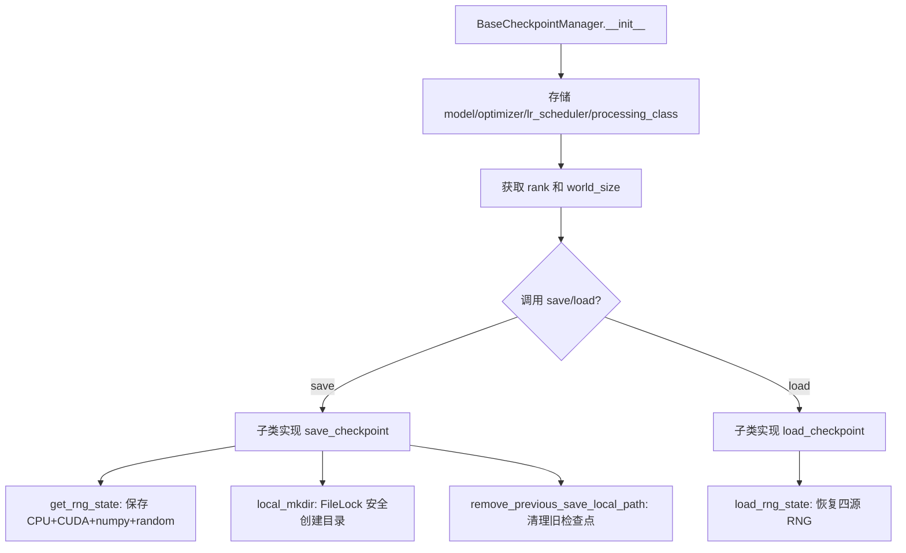
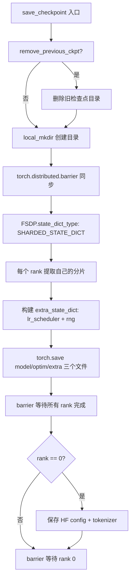

# PD-363.01 VRAG — FSDP 分布式检查点分片保存与断点续训

> 文档编号：PD-363.01
> 来源：VRAG-RL `verl/utils/checkpoint/checkpoint_manager.py`, `verl/utils/checkpoint/fsdp_checkpoint_manager.py`
> GitHub：https://github.com/Alibaba-NLP/VRAG.git
> 问题域：PD-363 检查点管理 Checkpoint Management
> 状态：可复用方案

---

## 第 1 章 问题与动机

### 1.1 核心问题

大规模分布式 RL 训练（如 VRAG 的 PPO + Vision RAG 场景）中，模型参数被 FSDP（Fully Sharded Data Parallel）分片到多个 GPU 上。检查点管理面临三个核心挑战：

1. **分片一致性**：每个 rank 只持有模型参数的一个分片，保存和恢复必须保证所有 rank 的分片在同一个逻辑时间点
2. **训练状态完整性**：除模型权重外，还需保存优化器状态、学习率调度器、RNG 状态和 DataLoader 位置，否则断点续训会导致训练不可复现
3. **存储效率与安全**：定期保存检查点消耗大量磁盘 I/O 和存储空间，需要在保存频率和存储成本之间取得平衡

### 1.2 VRAG 的解法概述

VRAG-RL 基于 verl 框架实现了一套两层检查点管理体系：

1. **BaseCheckpointManager 抽象基类** (`checkpoint_manager.py:27`)：定义 save/load 接口、RNG 状态管理、FileLock 安全目录创建、旧检查点清理
2. **FSDPCheckpointManager 具体实现** (`fsdp_checkpoint_manager.py:32`)：使用 `ShardedStateDictConfig` 实现 per-rank 分片保存，每个 rank 独立保存 model/optim/extra_state 三个 `.pt` 文件
3. **RayPPOTrainer 编排层** (`trainer/ppo/ray_trainer.py:572-656`)：在训练循环中按 `save_freq` 定期触发保存，通过 `latest_checkpointed_iteration.txt` 追踪器文件实现原子性最新检查点发现
4. **HDFS 远程存储支持** (`utils/fs.py:58-96`)：通过 `copy_to_local` 抽象本地/HDFS 路径，加载时自动从远程拉取到本地临时目录
5. **DataLoader 状态持久化** (`ray_trainer.py:595-597`)：使用 `StatefulDataLoader` 保存数据迭代位置，确保续训时数据不重复

### 1.3 设计思想

| 设计原则 | 具体实现 | 理由 | 替代方案 |
|----------|----------|------|----------|
| SPMD 分片保存 | 每个 rank 独立保存自己的分片，文件名含 `world_size` 和 `rank` | 避免全量聚合到 rank 0 的内存瓶颈 | `FullStateDictConfig` 全量保存（SFT trainer 中使用） |
| 原子性追踪 | `latest_checkpointed_iteration.txt` 记录最新步数 | 避免保存中途崩溃导致读到不完整检查点 | 目录时间戳排序（不可靠） |
| FileLock 并发安全 | `local_mkdir` 使用 `filelock` 库加锁创建目录 | 多进程同时创建同一目录时避免竞态 | `os.makedirs(exist_ok=True)` 单独使用（有竞态窗口） |
| RNG 四源保存 | 保存 CPU/CUDA/numpy/random 四种 RNG 状态 | 确保续训后随机性完全可复现 | 只保存 torch RNG（numpy 采样不可复现） |
| 存储路径抽象 | `copy_to_local` 统一本地/HDFS 路径 | 同一套代码支持本地和分布式文件系统 | 硬编码路径前缀判断 |

---

## 第 2 章 源码实现分析

### 2.1 架构概览

VRAG-RL 的检查点系统分为三层：抽象层、实现层、编排层。

```
┌─────────────────────────────────────────────────────────────┐
│                   RayPPOTrainer (编排层)                      │
│  _save_checkpoint() / _load_checkpoint() / fit()            │
│  ┌─────────────┐  ┌──────────────┐  ┌───────────────────┐  │
│  │ Actor WG    │  │ Critic WG    │  │ DataLoader State  │  │
│  │ save/load   │  │ save/load    │  │ data.pt           │  │
│  └──────┬──────┘  └──────┬───────┘  └───────────────────┘  │
│         │                │                                   │
├─────────┼────────────────┼───────────────────────────────────┤
│         ▼                ▼                                   │
│  ┌──────────────────────────────────┐                       │
│  │  FSDPCheckpointManager (实现层)   │                       │
│  │  save_checkpoint / load_checkpoint│                       │
│  │  ShardedStateDictConfig          │                       │
│  └──────────────┬───────────────────┘                       │
│                 │                                            │
├─────────────────┼────────────────────────────────────────────┤
│                 ▼                                            │
│  ┌──────────────────────────────────┐                       │
│  │  BaseCheckpointManager (抽象层)   │                       │
│  │  RNG 管理 / FileLock / 旧 ckpt 清理│                      │
│  └──────────────────────────────────┘                       │
│                                                              │
│  ┌──────────────────────────────────┐                       │
│  │  utils/fs.py (存储抽象)           │                       │
│  │  copy_to_local / HDFS 支持       │                       │
│  └──────────────────────────────────┘                       │
└─────────────────────────────────────────────────────────────┘
```

每个检查点目录结构：
```
global_step_100/
├── actor/
│   ├── model_world_size_8_rank_0.pt
│   ├── model_world_size_8_rank_1.pt
│   ├── ...
│   ├── optim_world_size_8_rank_0.pt
│   ├── ...
│   ├── extra_state_world_size_8_rank_0.pt
│   ├── ...
│   └── huggingface/          # rank 0 保存，用于 ckpt merge
│       ├── config.json
│       └── tokenizer.json
├── critic/
│   └── (同 actor 结构)
├── data.pt                   # DataLoader 状态
latest_checkpointed_iteration.txt  # "100"
```

### 2.2 核心实现

#### 2.2.1 BaseCheckpointManager — 抽象基类与 RNG 管理



对应源码 `VRAG-RL/verl/utils/checkpoint/checkpoint_manager.py:27-112`：

```python
class BaseCheckpointManager:
    def __init__(self, model: FSDP, optimizer: torch.optim.Optimizer,
                 lr_scheduler: torch.optim.lr_scheduler.LRScheduler,
                 processing_class: Union[PreTrainedTokenizer, ProcessorMixin]):
        self.previous_global_step = None
        self.previous_save_local_path = None
        self.model = model
        self.optimizer = optimizer
        self.lr_scheduler = lr_scheduler
        self.processing_class = processing_class
        assert isinstance(self.model, FSDP)
        self.rank = torch.distributed.get_rank()
        self.world_size = torch.distributed.get_world_size()

    @staticmethod
    def local_mkdir(path):
        if not os.path.isabs(path):
            working_dir = os.getcwd()
            path = os.path.join(working_dir, path)
        lock_filename = f"ckpt_{hash(path) & 0xFFFFFFFF:08x}.lock"
        lock_path = os.path.join(tempfile.gettempdir(), lock_filename)
        try:
            with FileLock(lock_path, timeout=60):
                os.makedirs(path, exist_ok=True)
        except Exception as e:
            print(f"Warning: Failed to acquire lock for {path}: {e}")
            os.makedirs(path, exist_ok=True)
        return path

    @staticmethod
    def get_rng_state():
        rng_state = {
            'cpu': torch.get_rng_state(),
            'cuda': torch.cuda.get_rng_state(),
            'numpy': np.random.get_state(),
            'random': random.getstate(),
        }
        return rng_state
```

关键设计点：
- `local_mkdir` 使用路径哈希作为锁文件名（`checkpoint_manager.py:82`），避免长路径导致锁文件名超限
- FileLock 设置 60 秒超时（`checkpoint_manager.py:86`），超时后仍尝试创建目录作为降级
- RNG 状态覆盖四个随机源（`checkpoint_manager.py:97-104`），确保 numpy 数据采样和 Python random 操作也可复现

#### 2.2.2 FSDPCheckpointManager — 分片保存与恢复



对应源码 `VRAG-RL/verl/utils/checkpoint/fsdp_checkpoint_manager.py:106-159`：

```python
def save_checkpoint(self, local_path: str, global_step: int,
                    remove_previous_ckpt=False, *args, **kwargs):
    self.previous_global_step = global_step
    if remove_previous_ckpt:
        self.remove_previous_save_local_path()
    local_path = self.local_mkdir(local_path)
    torch.distributed.barrier()

    state_dict_cfg = ShardedStateDictConfig(offload_to_cpu=True)
    optim_cfg = ShardedOptimStateDictConfig(offload_to_cpu=True)
    with warnings.catch_warnings():
        warnings.simplefilter("ignore")
        with FSDP.state_dict_type(self.model, StateDictType.SHARDED_STATE_DICT,
                                   state_dict_cfg, optim_cfg):
            model_state_dict = self.model.state_dict()
            optimizer_state_dict = self.optimizer.state_dict() if self.optimizer else None
            lr_scheduler_state_dict = self.lr_scheduler.state_dict() if self.lr_scheduler else None

            extra_state_dict = {
                'lr_scheduler': lr_scheduler_state_dict,
                'rng': self.get_rng_state(),
            }
            model_path = os.path.join(local_path,
                f'model_world_size_{self.world_size}_rank_{self.rank}.pt')
            optim_path = os.path.join(local_path,
                f'optim_world_size_{self.world_size}_rank_{self.rank}.pt')
            extra_path = os.path.join(local_path,
                f'extra_state_world_size_{self.world_size}_rank_{self.rank}.pt')
            torch.save(model_state_dict, model_path)
            torch.save(optimizer_state_dict, optim_path)
            torch.save(extra_state_dict, extra_path)

    torch.distributed.barrier()
    if self.rank == 0:
        hf_local_path = os.path.join(local_path, 'huggingface')
        os.makedirs(hf_local_path, exist_ok=True)
        self.model._fsdp_wrapped_module.config.save_pretrained(hf_local_path)
        self.processing_class.save_pretrained(hf_local_path)
    torch.distributed.barrier()
    self.previous_save_local_path = local_path
```

关键设计点：
- `ShardedStateDictConfig(offload_to_cpu=True)`（`fsdp_checkpoint_manager.py:118`）：将分片 offload 到 CPU 后再保存，避免 GPU 内存峰值
- 文件名编码 `world_size` 和 `rank`（`fsdp_checkpoint_manager.py:137-139`）：加载时可校验分片数量是否匹配
- 三次 `barrier` 同步（`fsdp_checkpoint_manager.py:115,149,157`）：确保目录创建→分片保存→HF 元数据保存的严格顺序
- rank 0 额外保存 HuggingFace config 和 tokenizer（`fsdp_checkpoint_manager.py:151-155`）：用于后续 checkpoint merge 为完整模型

### 2.3 实现细节

#### 2.3.1 训练循环中的检查点编排

`RayPPOTrainer` 在训练循环中协调 Actor 和 Critic 的检查点保存（`ray_trainer.py:572-603`）：

```python
def _save_checkpoint(self):
    local_global_step_folder = os.path.join(
        self.config.trainer.default_local_dir, f'global_step_{self.global_steps}')
    actor_local_path = os.path.join(local_global_step_folder, 'actor')
    self.actor_rollout_wg.save_checkpoint(
        actor_local_path, actor_remote_path, self.global_steps,
        remove_previous_ckpt=self.config.trainer.remove_previous_ckpt_in_save)

    if self.use_critic:
        critic_local_path = os.path.join(local_global_step_folder, 'critic')
        self.critic_wg.save_checkpoint(critic_local_path, critic_remote_path, ...)

    # 保存 DataLoader 状态
    dataloader_local_path = os.path.join(local_global_step_folder, 'data.pt')
    dataloader_state_dict = self.train_dataloader.state_dict()
    torch.save(dataloader_state_dict, dataloader_local_path)

    # 原子性更新追踪文件
    local_latest = os.path.join(self.config.trainer.default_local_dir,
                                'latest_checkpointed_iteration.txt')
    with open(local_latest, 'w') as f:
        f.write(str(self.global_steps))
```

#### 2.3.2 断点续训的三模式设计

`_load_checkpoint` 支持三种恢复模式（`ray_trainer.py:605-656`）：

- `disable`：从头训练，忽略所有检查点
- `auto`：自动查找 `latest_checkpointed_iteration.txt`，找到则恢复，找不到则从头开始
- 指定路径：直接从给定的 `global_step_X` 目录恢复

恢复时依次加载：actor 权重 → critic 权重 → DataLoader 状态，并从 `global_step_folder` 路径中解析出 `global_steps` 值。

#### 2.3.3 HDFS 远程存储与 FileLock 缓存

`copy_to_local`（`fs.py:58-96`）实现了透明的远程→本地缓存：

- 本地路径直接返回
- HDFS 路径：用 MD5 编码路径作为缓存目录名，FileLock 保证只下载一次
- 加载检查点时可选 `del_local_after_load=True` 清理本地缓存（`fsdp_checkpoint_manager.py:80-88`）

---

## 第 3 章 迁移指南

### 3.1 迁移清单

**阶段 1：基础检查点管理（1-2 天）**

- [ ] 创建 `BaseCheckpointManager` 抽象基类，包含 RNG 四源保存/恢复
- [ ] 实现 `local_mkdir` 的 FileLock 安全目录创建
- [ ] 实现 `remove_previous_save_local_path` 旧检查点清理
- [ ] 创建 `find_latest_ckpt_path` 和追踪文件机制

**阶段 2：FSDP 分片保存（1 天）**

- [ ] 实现 `FSDPCheckpointManager`，使用 `ShardedStateDictConfig` 分片保存
- [ ] 实现 per-rank 文件命名（含 world_size 和 rank）
- [ ] 添加 HuggingFace config/tokenizer 的 rank 0 保存
- [ ] 添加三次 barrier 同步保证

**阶段 3：训练循环集成（0.5 天）**

- [ ] 在训练循环中按 `save_freq` 触发保存
- [ ] 实现 `_load_checkpoint` 的三模式恢复（disable/auto/指定路径）
- [ ] 集成 `StatefulDataLoader` 状态持久化

**阶段 4：远程存储支持（可选）**

- [ ] 实现 `copy_to_local` 的 HDFS/S3 抽象
- [ ] 添加 FileLock 缓存防止重复下载

### 3.2 适配代码模板

以下是一个可直接复用的最小检查点管理器模板：

```python
import os
import tempfile
import shutil
from typing import Optional, Dict, Any
from filelock import FileLock
import torch
import torch.distributed as dist
from torch.distributed.fsdp import (
    FullyShardedDataParallel as FSDP,
    StateDictType,
    ShardedStateDictConfig,
    ShardedOptimStateDictConfig,
)
import numpy as np
import random


class CheckpointManager:
    """可移植的 FSDP 分片检查点管理器"""

    def __init__(self, model: FSDP, optimizer, lr_scheduler, tokenizer):
        self.model = model
        self.optimizer = optimizer
        self.lr_scheduler = lr_scheduler
        self.tokenizer = tokenizer
        self.rank = dist.get_rank()
        self.world_size = dist.get_world_size()
        self._previous_path: Optional[str] = None

    def save(self, path: str, global_step: int, remove_previous: bool = False):
        if remove_previous and self._previous_path:
            shutil.rmtree(self._previous_path, ignore_errors=True)

        self._safe_mkdir(path)
        dist.barrier()

        cfg = ShardedStateDictConfig(offload_to_cpu=True)
        optim_cfg = ShardedOptimStateDictConfig(offload_to_cpu=True)
        with FSDP.state_dict_type(self.model, StateDictType.SHARDED_STATE_DICT, cfg, optim_cfg):
            state = {
                'model': self.model.state_dict(),
                'optimizer': self.optimizer.state_dict() if self.optimizer else None,
                'lr_scheduler': self.lr_scheduler.state_dict() if self.lr_scheduler else None,
                'rng': self._get_rng_state(),
            }
            save_path = os.path.join(path, f'rank_{self.rank}_of_{self.world_size}.pt')
            torch.save(state, save_path)

        dist.barrier()
        if self.rank == 0:
            hf_path = os.path.join(path, 'huggingface')
            os.makedirs(hf_path, exist_ok=True)
            self.model._fsdp_wrapped_module.config.save_pretrained(hf_path)
            self.tokenizer.save_pretrained(hf_path)
        dist.barrier()
        self._previous_path = path

    def load(self, path: str):
        if path is None:
            return
        load_path = os.path.join(path, f'rank_{self.rank}_of_{self.world_size}.pt')
        state = torch.load(load_path, weights_only=False)

        cfg = ShardedStateDictConfig(offload_to_cpu=True)
        optim_cfg = ShardedOptimStateDictConfig(offload_to_cpu=True)
        with FSDP.state_dict_type(self.model, StateDictType.SHARDED_STATE_DICT, cfg, optim_cfg):
            self.model.load_state_dict(state['model'])
            if self.optimizer and state['optimizer']:
                self.optimizer.load_state_dict(state['optimizer'])
        if state.get('lr_scheduler') and self.lr_scheduler:
            self.lr_scheduler.load_state_dict(state['lr_scheduler'])
        if state.get('rng'):
            self._load_rng_state(state['rng'])

    @staticmethod
    def find_latest(root: str) -> Optional[str]:
        tracker = os.path.join(root, 'latest_checkpointed_iteration.txt')
        if not os.path.exists(tracker):
            return None
        with open(tracker, 'r') as f:
            step = int(f.read().strip())
        ckpt_path = os.path.join(root, f'global_step_{step}')
        return ckpt_path if os.path.exists(ckpt_path) else None

    @staticmethod
    def _get_rng_state() -> Dict[str, Any]:
        return {
            'cpu': torch.get_rng_state(),
            'cuda': torch.cuda.get_rng_state(),
            'numpy': np.random.get_state(),
            'random': random.getstate(),
        }

    @staticmethod
    def _load_rng_state(state: Dict[str, Any]):
        torch.set_rng_state(state['cpu'])
        torch.cuda.set_rng_state(state['cuda'])
        np.random.set_state(state['numpy'])
        random.setstate(state['random'])

    @staticmethod
    def _safe_mkdir(path: str):
        path = os.path.abspath(path)
        lock_name = f"ckpt_{hash(path) & 0xFFFFFFFF:08x}.lock"
        lock_path = os.path.join(tempfile.gettempdir(), lock_name)
        try:
            with FileLock(lock_path, timeout=60):
                os.makedirs(path, exist_ok=True)
        except Exception:
            os.makedirs(path, exist_ok=True)
```

### 3.3 适用场景

| 场景 | 适用度 | 说明 |
|------|--------|------|
| FSDP 分布式 RL 训练 | ⭐⭐⭐ | 完全匹配，直接复用 |
| FSDP 分布式 SFT 训练 | ⭐⭐⭐ | 核心逻辑相同，SFT trainer 中也有类似实现 |
| DeepSpeed ZeRO 训练 | ⭐⭐ | 需替换 FSDP API 为 DeepSpeed checkpoint API，但 RNG/追踪器/清理逻辑可复用 |
| 单 GPU 训练 | ⭐ | 过度设计，直接 `torch.save` 即可 |
| 跨 world_size 恢复 | ❌ | 文件名硬编码 world_size，不支持变更 GPU 数量后恢复 |

---

## 第 4 章 测试用例

```python
import os
import tempfile
import pytest
import torch
import numpy as np
import random
from unittest.mock import MagicMock, patch


class TestRNGStateManagement:
    """测试 RNG 四源状态保存与恢复"""

    def test_rng_state_roundtrip(self):
        """保存→修改→恢复后，随机数序列应完全一致"""
        # 设置已知种子
        torch.manual_seed(42)
        np.random.seed(42)
        random.seed(42)

        # 保存 RNG 状态
        rng_state = {
            'cpu': torch.get_rng_state(),
            'numpy': np.random.get_state(),
            'random': random.getstate(),
        }

        # 生成参考序列
        ref_torch = torch.randn(10)
        ref_numpy = np.random.randn(10)
        ref_random = [random.random() for _ in range(10)]

        # 恢复 RNG 状态
        torch.set_rng_state(rng_state['cpu'])
        np.random.set_state(rng_state['numpy'])
        random.setstate(rng_state['random'])

        # 验证序列一致
        assert torch.equal(torch.randn(10), ref_torch)
        assert np.array_equal(np.random.randn(10), ref_numpy)
        assert [random.random() for _ in range(10)] == ref_random


class TestCheckpointTrackerFile:
    """测试 latest_checkpointed_iteration.txt 追踪机制"""

    def test_find_latest_ckpt_path_exists(self):
        with tempfile.TemporaryDirectory() as tmpdir:
            # 创建追踪文件和检查点目录
            tracker = os.path.join(tmpdir, 'latest_checkpointed_iteration.txt')
            with open(tracker, 'w') as f:
                f.write('100')
            ckpt_dir = os.path.join(tmpdir, 'global_step_100')
            os.makedirs(ckpt_dir)

            # 验证能找到
            result_tracker = os.path.join(tmpdir, 'latest_checkpointed_iteration.txt')
            with open(result_tracker, 'rb') as f:
                iteration = int(f.read().decode())
            result = os.path.join(tmpdir, f'global_step_{iteration}')
            assert os.path.exists(result)
            assert result == ckpt_dir

    def test_find_latest_ckpt_path_missing_tracker(self):
        with tempfile.TemporaryDirectory() as tmpdir:
            tracker = os.path.join(tmpdir, 'latest_checkpointed_iteration.txt')
            assert not os.path.exists(tracker)

    def test_find_latest_ckpt_path_missing_dir(self):
        with tempfile.TemporaryDirectory() as tmpdir:
            tracker = os.path.join(tmpdir, 'latest_checkpointed_iteration.txt')
            with open(tracker, 'w') as f:
                f.write('999')
            ckpt_dir = os.path.join(tmpdir, 'global_step_999')
            assert not os.path.exists(ckpt_dir)


class TestFileLockMkdir:
    """测试 FileLock 安全目录创建"""

    def test_concurrent_mkdir(self):
        with tempfile.TemporaryDirectory() as tmpdir:
            target = os.path.join(tmpdir, 'ckpt', 'nested', 'dir')
            lock_name = f"ckpt_{hash(target) & 0xFFFFFFFF:08x}.lock"
            lock_path = os.path.join(tempfile.gettempdir(), lock_name)

            from filelock import FileLock
            with FileLock(lock_path, timeout=60):
                os.makedirs(target, exist_ok=True)
            assert os.path.isdir(target)

    def test_mkdir_fallback_on_lock_failure(self):
        """锁获取失败时应降级为直接创建"""
        with tempfile.TemporaryDirectory() as tmpdir:
            target = os.path.join(tmpdir, 'fallback_dir')
            # 直接创建（模拟降级路径）
            os.makedirs(target, exist_ok=True)
            assert os.path.isdir(target)


class TestShardedFileNaming:
    """测试分片文件命名规范"""

    def test_file_naming_convention(self):
        world_size = 8
        rank = 3
        model_path = f'model_world_size_{world_size}_rank_{rank}.pt'
        assert model_path == 'model_world_size_8_rank_3.pt'

        optim_path = f'optim_world_size_{world_size}_rank_{rank}.pt'
        assert optim_path == 'optim_world_size_8_rank_3.pt'

        extra_path = f'extra_state_world_size_{world_size}_rank_{rank}.pt'
        assert extra_path == 'extra_state_world_size_8_rank_3.pt'

    def test_world_size_mismatch_detection(self):
        """加载时 world_size 不匹配应能被检测"""
        save_world_size = 8
        load_world_size = 4
        rank = 3
        expected_file = f'model_world_size_{load_world_size}_rank_{rank}.pt'
        actual_file = f'model_world_size_{save_world_size}_rank_{rank}.pt'
        assert expected_file != actual_file  # 文件名不同，加载会失败
```

---

## 第 5 章 跨域关联

| 关联域 | 关系类型 | 说明 |
|--------|----------|------|
| PD-02 多 Agent 编排 | 协同 | RayPPOTrainer 编排 Actor/Critic 两个 WorkerGroup 的检查点保存顺序，需要与多 Agent 编排的生命周期对齐 |
| PD-03 容错与重试 | 依赖 | 检查点是容错的基础设施——训练崩溃后通过 `resume_mode=auto` 自动恢复到最近检查点 |
| PD-06 记忆持久化 | 协同 | DataLoader 状态（`data.pt`）的持久化本质上是训练数据迭代位置的"记忆"，与 Agent 记忆持久化共享设计模式 |
| PD-11 可观测性 | 协同 | `global_step` 是检查点和可观测性的共同锚点，保存检查点时的 step 值与 metrics 日志的 step 值一致 |

---

## 第 6 章 来源文件索引

| 文件 | 行范围 | 关键实现 |
|------|--------|----------|
| `VRAG-RL/verl/utils/checkpoint/checkpoint_manager.py` | L27-L44 | BaseCheckpointManager 基类定义，SPMD 模式声明 |
| `VRAG-RL/verl/utils/checkpoint/checkpoint_manager.py` | L75-L94 | `local_mkdir` FileLock 安全目录创建 |
| `VRAG-RL/verl/utils/checkpoint/checkpoint_manager.py` | L96-L111 | RNG 四源状态保存与恢复 |
| `VRAG-RL/verl/utils/checkpoint/checkpoint_manager.py` | L114-L138 | `find_latest_ckpt_path` 追踪文件发现机制 |
| `VRAG-RL/verl/utils/checkpoint/fsdp_checkpoint_manager.py` | L32-L59 | FSDPCheckpointManager 初始化与 tokenizer 兼容 |
| `VRAG-RL/verl/utils/checkpoint/fsdp_checkpoint_manager.py` | L61-L104 | `load_checkpoint` 分片加载与 RNG 恢复 |
| `VRAG-RL/verl/utils/checkpoint/fsdp_checkpoint_manager.py` | L106-L159 | `save_checkpoint` 分片保存与 HF 元数据 |
| `VRAG-RL/verl/workers/fsdp_workers.py` | L430-L436 | ActorRolloutRefWorker 中 FSDPCheckpointManager 实例化 |
| `VRAG-RL/verl/workers/fsdp_workers.py` | L585-L610 | Worker 级 save/load_checkpoint 与 offload 协调 |
| `VRAG-RL/verl/workers/fsdp_workers.py` | L800-L805 | CriticWorker 中 FSDPCheckpointManager 实例化 |
| `VRAG-RL/verl/trainer/ppo/ray_trainer.py` | L572-L603 | `_save_checkpoint` 编排 actor/critic/dataloader 保存 |
| `VRAG-RL/verl/trainer/ppo/ray_trainer.py` | L605-L656 | `_load_checkpoint` 三模式断点续训 |
| `VRAG-RL/verl/trainer/ppo/ray_trainer.py` | L856-L859 | 训练循环中按 save_freq 触发保存 |
| `VRAG-RL/verl/utils/fs.py` | L58-L96 | `copy_to_local` HDFS/本地路径抽象 |
| `VRAG-RL/verl/trainer/fsdp_sft_trainer.py` | L427-L443 | SFT trainer 的 FullStateDictConfig 全量保存（对比方案） |

---

## 第 7 章 横向对比维度

```json comparison_data
{
  "project": "VRAG",
  "dimensions": {
    "保存策略": "SPMD 分片保存，每 rank 独立写 model/optim/extra 三文件",
    "恢复模式": "三模式：disable/auto/指定路径，tracker 文件原子发现",
    "状态完整性": "模型+优化器+LR调度器+RNG四源+DataLoader位置",
    "并发安全": "FileLock 哈希锁名+60s超时+降级创建",
    "远程存储": "copy_to_local 抽象 HDFS/本地，MD5 缓存防重复下载",
    "清理策略": "可选 remove_previous_ckpt 删除上一个检查点"
  }
}
```

### 域元数据补充

```json domain_metadata
{
  "solution_summary": "VRAG 用 FSDP ShardedStateDictConfig 实现 per-rank 分片保存，三次 barrier 同步保证一致性，tracker 文件实现原子性最新检查点发现，支持 disable/auto/指定路径三模式断点续训",
  "description": "分布式训练中检查点的并发安全与原子性保证",
  "sub_problems": [
    "RNG 多源状态同步保存与恢复",
    "DataLoader 迭代位置持久化",
    "远程存储透明缓存与去重"
  ],
  "best_practices": [
    "tracker 文件原子写入避免读到不完整检查点",
    "FileLock 哈希锁名避免长路径导致锁文件名超限",
    "ShardedStateDictConfig offload_to_cpu 降低保存时 GPU 内存峰值"
  ]
}
```
