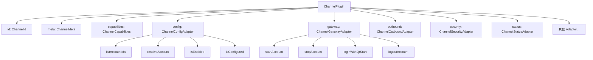
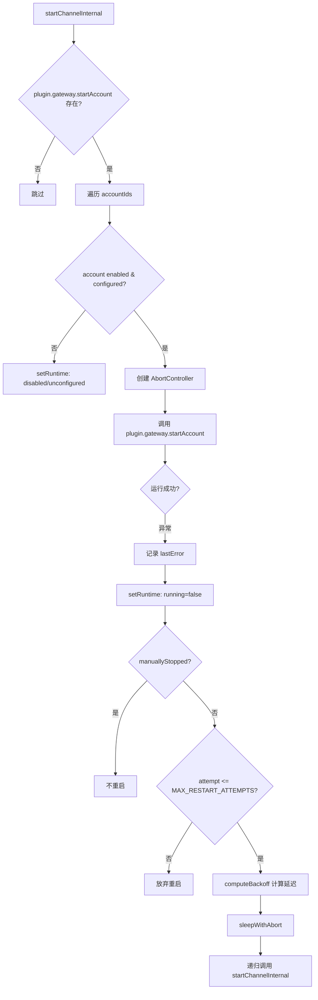

# PD-364.01 OpenClaw — 统一多渠道消息网关与插件化渠道生命周期管理

> 文档编号：PD-364.01
> 来源：OpenClaw `src/channels/registry.ts`, `src/gateway/server-channels.ts`, `src/channels/plugins/types.plugin.ts`
> GitHub：https://github.com/openclaw/openclaw.git
> 问题域：PD-364 多渠道消息网关 Multi-Channel Message Gateway
> 状态：可复用方案

---

## 第 1 章 问题与动机（≥ 30 行）

### 1.1 核心问题

Agent 系统需要同时接入多个即时通讯渠道（Telegram、WhatsApp、Discord、Slack、Signal、iMessage、IRC、Google Chat 等），每个渠道有不同的 API 协议、消息格式、认证方式、能力集（投票、反应、线程、媒体等）。核心挑战包括：

1. **渠道异构性**：每个平台的 Bot API 完全不同（Telegram Bot API vs Discord Gateway vs WhatsApp Web 协议），需要统一抽象
2. **生命周期管理**：渠道连接可能随时断开，需要自动重连、指数退避、健康监控
3. **多账户支持**：同一渠道可能有多个账户（如多个 Telegram Bot），需要独立管理
4. **热重载**：配置变更时需要精确重启受影响的渠道，而非全量重启
5. **安全隔离**：不同渠道的 DM 策略、allowFrom 白名单、命令权限各不相同

### 1.2 OpenClaw 的解法概述

OpenClaw 采用三层架构解决多渠道网关问题：

1. **Plugin Registry 层**（`src/plugins/registry.ts:332-358`）：统一的插件注册中心，渠道作为插件通过 `registerChannel()` 注册，与工具、Hook、HTTP 路由等共享同一注册机制
2. **Channel Manager 层**（`src/gateway/server-channels.ts:80-414`）：渠道生命周期管理器，负责启动/停止/重启渠道，内置指数退避重连和手动停止追踪
3. **Dock 抽象层**（`src/channels/dock.ts:47-64`）：轻量级渠道元数据接口，供共享代码路径使用，避免直接依赖重量级插件实现
4. **Health Monitor 层**（`src/gateway/channel-health-monitor.ts:53-177`）：独立的健康监控进程，定期检查渠道状态并触发自动恢复
5. **Config Reload 层**（`src/gateway/config-reload.ts:179-248`）：配置变更检测与精确热重载，按渠道粒度重启

### 1.3 设计思想

| 设计原则 | 具体实现 | 理由 | 替代方案 |
|----------|----------|------|----------|
| 插件化渠道注册 | ChannelPlugin 接口 + PluginRegistry 统一注册 | 新渠道只需实现接口并注册，零侵入核心代码 | 硬编码 switch-case 分发 |
| 双层抽象（Plugin vs Dock） | Plugin 为重量级完整实现，Dock 为轻量级元数据 | 共享代码路径不需要加载 Puppeteer/监控等重依赖 | 单一接口，全量加载 |
| 账户级生命周期 | 每个 channelId:accountId 独立 AbortController + Promise | 多账户互不干扰，单账户故障不影响其他 | 渠道级粗粒度管理 |
| 指数退避 + 最大重试 | BackoffPolicy{5s→5min, factor=2, jitter=0.1} + 10次上限 | 避免雪崩式重连，jitter 防止惊群 | 固定间隔重试 |
| 健康监控与渠道管理分离 | HealthMonitor 独立于 ChannelManager，通过接口交互 | 关注点分离，监控策略可独立调整 | 内嵌在 Manager 中 |

---

## 第 2 章 源码实现分析（≥ 60 行，核心章节）

### 2.1 架构概览

OpenClaw 的多渠道网关架构分为 5 个核心层：

```
┌─────────────────────────────────────────────────────────────────┐
│                     Gateway Server (server.ts)                   │
│  ┌──────────────┐  ┌──────────────┐  ┌────────────────────────┐ │
│  │ Config Reload │  │ Health       │  │ Channel Manager        │ │
│  │ (chokidar)   │──│ Monitor      │──│ (lifecycle controller) │ │
│  └──────────────┘  └──────────────┘  └────────────────────────┘ │
│         │                 │                     │                │
│         ▼                 ▼                     ▼                │
│  ┌─────────────────────────────────────────────────────────────┐ │
│  │              Plugin Registry (global singleton)              │ │
│  │  channels[] | tools[] | hooks[] | providers[] | services[]   │ │
│  └─────────────────────────────────────────────────────────────┘ │
│         │                                                        │
│         ▼                                                        │
│  ┌──────────┐ ┌──────────┐ ┌──────────┐ ┌──────────┐ ┌────────┐│
│  │ Telegram │ │ WhatsApp │ │ Discord  │ │  Slack   │ │ Signal ││
│  │ Plugin   │ │ Plugin   │ │ Plugin   │ │ Plugin   │ │ Plugin ││
│  └──────────┘ └──────────┘ └──────────┘ └──────────┘ └────────┘│
│  ┌──────────┐ ┌──────────┐ ┌──────────┐                        │
│  │ iMessage │ │   IRC    │ │ Google   │  + External Plugins     │
│  │ Plugin   │ │ Plugin   │ │ Chat     │                        │
│  └──────────┘ └──────────┘ └──────────┘                        │
└─────────────────────────────────────────────────────────────────┘
```

### 2.2 核心实现

#### 2.2.1 ChannelPlugin 接口：渠道能力声明



对应源码 `src/channels/plugins/types.plugin.ts:49-85`：

```typescript
export type ChannelPlugin<ResolvedAccount = any, Probe = unknown, Audit = unknown> = {
  id: ChannelId;
  meta: ChannelMeta;
  capabilities: ChannelCapabilities;
  defaults?: { queue?: { debounceMs?: number } };
  reload?: { configPrefixes: string[]; noopPrefixes?: string[] };
  onboarding?: ChannelOnboardingAdapter;
  config: ChannelConfigAdapter<ResolvedAccount>;
  configSchema?: ChannelConfigSchema;
  setup?: ChannelSetupAdapter;
  pairing?: ChannelPairingAdapter;
  security?: ChannelSecurityAdapter<ResolvedAccount>;
  groups?: ChannelGroupAdapter;
  mentions?: ChannelMentionAdapter;
  outbound?: ChannelOutboundAdapter;
  status?: ChannelStatusAdapter<ResolvedAccount, Probe, Audit>;
  gateway?: ChannelGatewayAdapter<ResolvedAccount>;
  auth?: ChannelAuthAdapter;
  elevated?: ChannelElevatedAdapter;
  commands?: ChannelCommandAdapter;
  streaming?: ChannelStreamingAdapter;
  threading?: ChannelThreadingAdapter;
  messaging?: ChannelMessagingAdapter;
  agentPrompt?: ChannelAgentPromptAdapter;
  directory?: ChannelDirectoryAdapter;
  resolver?: ChannelResolverAdapter;
  actions?: ChannelMessageActionAdapter;
  heartbeat?: ChannelHeartbeatAdapter;
  agentTools?: ChannelAgentToolFactory | ChannelAgentTool[];
};
```

关键设计：每个 Adapter 都是可选的（`?`），渠道只需实现自己支持的能力。`capabilities` 字段声明渠道支持的 chatTypes（direct/group/channel/thread）、polls、reactions、media 等能力，供上层路由决策。

#### 2.2.2 ChannelManager：账户级生命周期管理



对应源码 `src/gateway/server-channels.ts:118-264`：

```typescript
const startChannelInternal = async (
  channelId: ChannelId,
  accountId?: string,
  opts: StartChannelOptions = {},
) => {
  const plugin = getChannelPlugin(channelId);
  const startAccount = plugin?.gateway?.startAccount;
  if (!startAccount) { return; }
  const { preserveRestartAttempts = false, preserveManualStop = false } = opts;
  const cfg = loadConfig();
  const store = getStore(channelId);
  const accountIds = accountId ? [accountId] : plugin.config.listAccountIds(cfg);

  await Promise.all(
    accountIds.map(async (id) => {
      if (store.tasks.has(id)) { return; }
      // ... enabled/configured 检查 ...
      const abort = new AbortController();
      store.aborts.set(id, abort);
      const task = startAccount({
        cfg, accountId: id, account,
        runtime: channelRuntimeEnvs[channelId],
        abortSignal: abort.signal, log,
        getStatus: () => getRuntime(channelId, id),
        setStatus: (next) => setRuntime(channelId, id, next),
      });
      // 自动重启链：catch → finally → then(auto-restart)
      const trackedPromise = Promise.resolve(task)
        .catch((err) => { /* 记录错误 */ })
        .finally(() => { /* running=false */ })
        .then(async () => {
          if (manuallyStopped.has(rKey)) { return; }
          const attempt = (restartAttempts.get(rKey) ?? 0) + 1;
          if (attempt > MAX_RESTART_ATTEMPTS) { return; }
          const delayMs = computeBackoff(CHANNEL_RESTART_POLICY, attempt);
          await sleepWithAbort(delayMs, abort.signal);
          await startChannelInternal(channelId, id, {
            preserveRestartAttempts: true,
            preserveManualStop: true,
          });
        });
      store.tasks.set(id, trackedPromise);
    }),
  );
};
```

核心设计点：
- **ChannelRuntimeStore**（`server-channels.ts:27-31`）：每个渠道维护独立的 `aborts`（AbortController Map）、`tasks`（Promise Map）、`runtimes`（状态快照 Map）
- **退避策略**（`server-channels.ts:12-17`）：初始 5s，最大 5min，factor=2，jitter=0.1，最多 10 次重试
- **手动停止追踪**（`server-channels.ts:87`）：`manuallyStopped` Set 防止用户主动停止的渠道被自动重启

### 2.3 实现细节

#### 健康监控器（独立进程）

`src/gateway/channel-health-monitor.ts:53-177` 实现了独立于 ChannelManager 的健康监控：

- **启动宽限期**（`DEFAULT_STARTUP_GRACE_MS = 60s`）：启动后 60 秒内不检查，避免误判
- **冷却周期**（`DEFAULT_COOLDOWN_CYCLES = 2`）：同一渠道两次重启之间至少间隔 2 个检查周期
- **每小时重启上限**（`DEFAULT_MAX_RESTARTS_PER_HOUR = 3`）：防止无限重启循环
- **三种重启原因**：`stopped`（正常停止）、`gave-up`（重试耗尽）、`stuck`（运行中但未连接）

#### 配置热重载

`src/gateway/config-reload.ts:179-248` 的 `buildGatewayReloadPlan` 实现精确的渠道级热重载：

- 每个渠道插件通过 `reload.configPrefixes` 声明自己关心的配置路径前缀
- 配置变更时，只重启受影响的渠道（`plan.restartChannels: Set<ChannelId>`）
- 支持 4 种重载模式：`off`（禁用）、`restart`（全量重启）、`hot`（仅热重载）、`hybrid`（智能选择）

#### Dock 轻量抽象

`src/channels/dock.ts:219-230` 的 `DOCKS` 记录为每个内置渠道定义轻量级元数据：

```typescript
const DOCKS: Record<ChatChannelId, ChannelDock> = {
  telegram: {
    id: "telegram",
    capabilities: { chatTypes: ["direct", "group", "channel", "thread"], nativeCommands: true, blockStreaming: true },
    outbound: { textChunkLimit: 4000 },
    config: { resolveAllowFrom: ..., formatAllowFrom: ..., resolveDefaultTo: ... },
    groups: { resolveRequireMention: ..., resolveToolPolicy: ... },
    threading: { resolveReplyToMode: ..., buildToolContext: ... },
  },
  // ... 其他 7 个渠道
};
```

外部插件渠道通过 `buildDockFromPlugin()`（`dock.ts:566-590`）自动从 ChannelPlugin 生成 Dock。


---

## 第 3 章 迁移指南（≥ 40 行）

### 3.1 迁移清单

**阶段 1：定义渠道插件接口**

- [ ] 定义 `ChannelPlugin` 接口，包含 `id`、`meta`、`capabilities`、`config`、`gateway` 等可选 Adapter
- [ ] 定义 `ChannelCapabilities` 类型，声明渠道支持的能力（chatTypes、polls、reactions、media 等）
- [ ] 定义 `ChannelGatewayAdapter`，包含 `startAccount`/`stopAccount` 生命周期钩子
- [ ] 定义 `ChannelConfigAdapter`，包含 `listAccountIds`/`resolveAccount`/`isEnabled`/`isConfigured`

**阶段 2：实现插件注册中心**

- [ ] 创建 `PluginRegistry`，维护 `channels: PluginChannelRegistration[]` 数组
- [ ] 实现 `registerChannel()` 方法，校验 id 非空并去重
- [ ] 实现全局单例 `runtime.ts`，通过 `Symbol.for()` 确保跨模块共享

**阶段 3：实现渠道生命周期管理器**

- [ ] 创建 `ChannelManager`，维护每个渠道的 `ChannelRuntimeStore`（aborts + tasks + runtimes）
- [ ] 实现 `startChannelInternal` 带指数退避自动重连
- [ ] 实现 `stopChannel` 带 AbortController 信号传播和 `manuallyStopped` 追踪
- [ ] 实现 `BackoffPolicy` 和 `computeBackoff` 工具函数

**阶段 4：实现健康监控**

- [ ] 创建独立的 `ChannelHealthMonitor`，通过 `setInterval` 定期检查
- [ ] 实现启动宽限期、冷却周期、每小时重启上限三重保护
- [ ] 通过 `ChannelManager` 接口交互，不直接操作渠道

### 3.2 适配代码模板

```typescript
// === 1. 渠道插件接口定义 ===
type ChannelId = string;

type ChannelCapabilities = {
  chatTypes: Array<"direct" | "group" | "channel" | "thread">;
  polls?: boolean;
  reactions?: boolean;
  media?: boolean;
  threads?: boolean;
};

type ChannelGatewayContext = {
  accountId: string;
  abortSignal: AbortSignal;
  getStatus: () => ChannelAccountSnapshot;
  setStatus: (next: Partial<ChannelAccountSnapshot>) => void;
};

type ChannelPlugin = {
  id: ChannelId;
  label: string;
  capabilities: ChannelCapabilities;
  config: {
    listAccountIds: () => string[];
    isEnabled: (accountId: string) => boolean;
  };
  gateway?: {
    startAccount: (ctx: ChannelGatewayContext) => Promise<void>;
    stopAccount?: (ctx: ChannelGatewayContext) => Promise<void>;
  };
};

// === 2. 退避策略 ===
type BackoffPolicy = { initialMs: number; maxMs: number; factor: number; jitter: number };

function computeBackoff(policy: BackoffPolicy, attempt: number): number {
  const base = policy.initialMs * policy.factor ** Math.max(attempt - 1, 0);
  const jitter = base * policy.jitter * Math.random();
  return Math.min(policy.maxMs, Math.round(base + jitter));
}

// === 3. 渠道管理器核心 ===
function createChannelManager(plugins: ChannelPlugin[]) {
  const stores = new Map<string, {
    aborts: Map<string, AbortController>;
    tasks: Map<string, Promise<unknown>>;
  }>();
  const restartAttempts = new Map<string, number>();
  const manuallyStopped = new Set<string>();
  const MAX_RESTARTS = 10;
  const POLICY: BackoffPolicy = { initialMs: 5000, maxMs: 300_000, factor: 2, jitter: 0.1 };

  async function startChannel(plugin: ChannelPlugin, accountId: string) {
    const store = stores.get(plugin.id) ?? { aborts: new Map(), tasks: new Map() };
    stores.set(plugin.id, store);
    if (store.tasks.has(accountId)) return;

    const abort = new AbortController();
    store.aborts.set(accountId, abort);
    const key = `${plugin.id}:${accountId}`;

    const task = plugin.gateway?.startAccount({
      accountId, abortSignal: abort.signal,
      getStatus: () => ({ accountId, running: true }),
      setStatus: () => {},
    });

    const tracked = Promise.resolve(task)
      .catch(() => {})
      .then(async () => {
        if (manuallyStopped.has(key)) return;
        const attempt = (restartAttempts.get(key) ?? 0) + 1;
        restartAttempts.set(key, attempt);
        if (attempt > MAX_RESTARTS) return;
        const delay = computeBackoff(POLICY, attempt);
        await new Promise(r => setTimeout(r, delay));
        store.tasks.delete(accountId);
        await startChannel(plugin, accountId);
      })
      .finally(() => { store.tasks.delete(accountId); store.aborts.delete(accountId); });

    store.tasks.set(accountId, tracked);
  }

  async function stopChannel(plugin: ChannelPlugin, accountId: string) {
    const store = stores.get(plugin.id);
    if (!store) return;
    manuallyStopped.add(`${plugin.id}:${accountId}`);
    store.aborts.get(accountId)?.abort();
    await store.tasks.get(accountId);
  }

  return { startChannel, stopChannel };
}
```

### 3.3 适用场景

| 场景 | 适用度 | 说明 |
|------|--------|------|
| 多 IM 渠道 Agent 网关 | ⭐⭐⭐ | 核心场景，直接复用 |
| 单渠道 Bot 框架 | ⭐⭐ | 架构偏重，但生命周期管理仍有价值 |
| 微服务消息总线 | ⭐⭐ | 插件注册模式可复用，但消息路由需适配 |
| IoT 设备网关 | ⭐⭐⭐ | 多协议接入 + 健康监控 + 自动重连高度匹配 |
| 纯 HTTP API 网关 | ⭐ | 无长连接生命周期需求，过度设计 |

---

## 第 4 章 测试用例（≥ 20 行）

```typescript
import { describe, it, expect, vi, beforeEach } from "vitest";

// 基于 OpenClaw 真实函数签名的测试用例

describe("computeBackoff", () => {
  const policy = { initialMs: 5000, maxMs: 300_000, factor: 2, jitter: 0 };

  it("第 1 次重试返回 initialMs", () => {
    const result = computeBackoff(policy, 1);
    expect(result).toBe(5000);
  });

  it("第 3 次重试返回 factor^2 * initialMs", () => {
    const result = computeBackoff(policy, 3);
    expect(result).toBe(20000); // 5000 * 2^2
  });

  it("不超过 maxMs", () => {
    const result = computeBackoff(policy, 20);
    expect(result).toBeLessThanOrEqual(300_000);
  });

  it("jitter 增加随机性", () => {
    const jitterPolicy = { ...policy, jitter: 0.1 };
    const results = Array.from({ length: 100 }, () => computeBackoff(jitterPolicy, 3));
    const unique = new Set(results);
    expect(unique.size).toBeGreaterThan(1);
  });
});

describe("ChannelManager", () => {
  it("startChannel 调用 plugin.gateway.startAccount", async () => {
    const startAccount = vi.fn().mockResolvedValue(undefined);
    const plugin: ChannelPlugin = {
      id: "test", label: "Test", capabilities: { chatTypes: ["direct"] },
      config: { listAccountIds: () => ["default"], isEnabled: () => true },
      gateway: { startAccount },
    };
    const manager = createChannelManager([plugin]);
    await manager.startChannel(plugin, "default");
    expect(startAccount).toHaveBeenCalledWith(
      expect.objectContaining({ accountId: "default" })
    );
  });

  it("stopChannel 中止 AbortController 并标记 manuallyStopped", async () => {
    let abortSignal: AbortSignal | undefined;
    const startAccount = vi.fn().mockImplementation(async (ctx) => {
      abortSignal = ctx.abortSignal;
      await new Promise((_, reject) => ctx.abortSignal.addEventListener("abort", reject));
    });
    const plugin: ChannelPlugin = {
      id: "test", label: "Test", capabilities: { chatTypes: ["direct"] },
      config: { listAccountIds: () => ["default"], isEnabled: () => true },
      gateway: { startAccount },
    };
    const manager = createChannelManager([plugin]);
    manager.startChannel(plugin, "default"); // 不 await，让它运行
    await new Promise(r => setTimeout(r, 50));
    await manager.stopChannel(plugin, "default");
    expect(abortSignal?.aborted).toBe(true);
  });

  it("渠道崩溃后自动重启（不超过 MAX_RESTART_ATTEMPTS）", async () => {
    let callCount = 0;
    const startAccount = vi.fn().mockImplementation(async () => {
      callCount++;
      throw new Error("connection lost");
    });
    const plugin: ChannelPlugin = {
      id: "test", label: "Test", capabilities: { chatTypes: ["direct"] },
      config: { listAccountIds: () => ["default"], isEnabled: () => true },
      gateway: { startAccount },
    };
    const manager = createChannelManager([plugin]);
    await manager.startChannel(plugin, "default");
    // 等待足够时间让重试发生（测试中用短退避）
    await new Promise(r => setTimeout(r, 2000));
    expect(callCount).toBeGreaterThan(1);
    expect(callCount).toBeLessThanOrEqual(11); // 1 initial + 10 retries
  });
});

describe("ChannelHealthMonitor", () => {
  it("启动宽限期内不触发重启", async () => {
    const startChannel = vi.fn();
    const monitor = startChannelHealthMonitor({
      channelManager: {
        getRuntimeSnapshot: () => ({
          channels: {}, channelAccounts: { telegram: { default: { running: false, enabled: true, configured: true } } }
        }),
        startChannel, stopChannel: vi.fn(), isManuallyStopped: () => false,
        resetRestartAttempts: vi.fn(),
      } as any,
      startupGraceMs: 60_000,
      checkIntervalMs: 100,
    });
    await new Promise(r => setTimeout(r, 300));
    expect(startChannel).not.toHaveBeenCalled();
    monitor.stop();
  });

  it("每小时重启上限生效", async () => {
    // maxRestartsPerHour=1 时，第二次不应触发
    const startChannel = vi.fn();
    const monitor = startChannelHealthMonitor({
      channelManager: {
        getRuntimeSnapshot: () => ({
          channels: {}, channelAccounts: { telegram: { default: { running: false, enabled: true, configured: true, accountId: "default" } } }
        }),
        startChannel, stopChannel: vi.fn(), isManuallyStopped: () => false,
        resetRestartAttempts: vi.fn(),
      } as any,
      startupGraceMs: 0,
      checkIntervalMs: 50,
      cooldownCycles: 0,
      maxRestartsPerHour: 1,
    });
    await new Promise(r => setTimeout(r, 300));
    expect(startChannel).toHaveBeenCalledTimes(1);
    monitor.stop();
  });
});
```


---

## 第 5 章 跨域关联

| 关联域 | 关系类型 | 说明 |
|--------|----------|------|
| PD-03 容错与重试 | 依赖 | ChannelManager 的指数退避重连（`BackoffPolicy`）和 HealthMonitor 的三重保护（宽限期+冷却+频率限制）是 PD-03 在渠道层的具体实现 |
| PD-04 工具系统 | 协同 | 渠道插件通过 `agentTools` 字段注册渠道专属工具（如 WhatsApp 登录流程），与全局工具系统共享 `PluginRegistry` |
| PD-10 中间件管道 | 协同 | 渠道的 `outbound` Adapter 定义消息分块策略（`chunker`/`textChunkLimit`），与消息发送管道协作 |
| PD-11 可观测性 | 协同 | `ChannelAccountSnapshot` 记录 `lastStartAt`/`lastStopAt`/`lastError`/`reconnectAttempts` 等运行时指标，供状态面板展示 |
| PD-09 Human-in-the-Loop | 协同 | `manuallyStopped` 机制允许用户手动停止渠道并阻止自动重启，`pairing` Adapter 支持人工审批配对请求 |

---

## 第 6 章 来源文件索引

| 文件 | 行范围 | 关键实现 |
|------|--------|----------|
| `src/channels/plugins/types.plugin.ts` | L49-L85 | ChannelPlugin 完整接口定义，18 个可选 Adapter |
| `src/channels/plugins/types.core.ts` | L1-L372 | ChannelId、ChannelCapabilities、ChannelAccountSnapshot 等核心类型 |
| `src/channels/plugins/types.adapters.ts` | L1-L311 | ChannelGatewayAdapter、ChannelConfigAdapter、ChannelOutboundAdapter 等适配器类型 |
| `src/channels/registry.ts` | L7-L16 | CHAT_CHANNEL_ORDER 8 渠道有序列表 + 别名映射 |
| `src/channels/plugins/index.ts` | L12-L57 | listChannelPlugins（去重+排序）、getChannelPlugin 查找 |
| `src/channels/plugins/registry-loader.ts` | L9-L35 | createChannelRegistryLoader 带缓存的懒加载器 |
| `src/channels/plugins/helpers.ts` | L7-L14 | resolveChannelDefaultAccountId 默认账户解析 |
| `src/channels/dock.ts` | L47-L64 | ChannelDock 轻量接口定义 |
| `src/channels/dock.ts` | L229-L564 | 8 个内置渠道的 Dock 配置（capabilities/outbound/config/groups/threading） |
| `src/channels/dock.ts` | L566-L590 | buildDockFromPlugin 外部插件自动生成 Dock |
| `src/gateway/server-channels.ts` | L12-L17 | CHANNEL_RESTART_POLICY 退避策略常量 |
| `src/gateway/server-channels.ts` | L27-L39 | ChannelRuntimeStore 数据结构（aborts/tasks/runtimes） |
| `src/gateway/server-channels.ts` | L80-L414 | createChannelManager 完整实现（启动/停止/重启/快照） |
| `src/gateway/server-channels.ts` | L118-L264 | startChannelInternal 核心启动逻辑 + 自动重连链 |
| `src/gateway/channel-health-monitor.ts` | L7-L11 | 健康监控常量（5min 检查间隔、60s 宽限期、3 次/小时上限） |
| `src/gateway/channel-health-monitor.ts` | L53-L177 | startChannelHealthMonitor 完整实现 |
| `src/gateway/config-reload.ts` | L50-L123 | 渠道热重载规则构建（插件贡献 configPrefixes） |
| `src/gateway/config-reload.ts` | L179-L248 | buildGatewayReloadPlan 精确重载计划 |
| `src/infra/backoff.ts` | L10-L14 | computeBackoff 指数退避计算 |
| `src/plugins/registry.ts` | L124-L138 | PluginRegistry 类型定义（channels/tools/hooks/providers 等） |
| `src/plugins/registry.ts` | L332-L358 | registerChannel 渠道注册实现 |
| `src/plugins/runtime.ts` | L1-L42 | 全局单例 PluginRegistry（Symbol.for 跨模块共享） |
| `src/channels/session.ts` | L21-L58 | recordInboundSession 会话路由记录 |

---

## 第 7 章 横向对比维度

```json comparison_data
{
  "project": "OpenClaw",
  "dimensions": {
    "渠道注册方式": "PluginRegistry 统一注册，ChannelPlugin 18 个可选 Adapter 接口",
    "生命周期管理": "账户级 AbortController + Promise 追踪，指数退避自动重连（5s→5min, 10次上限）",
    "健康监控": "独立 HealthMonitor 进程，三重保护：60s 宽限期 + 冷却周期 + 3次/小时上限",
    "热重载粒度": "渠道级精确热重载，插件声明 configPrefixes，chokidar 监听配置文件变更",
    "渠道数量": "8 内置渠道（Telegram/WhatsApp/Discord/Slack/Signal/iMessage/IRC/Google Chat）+ 外部插件扩展",
    "双层抽象": "Plugin（重量级完整实现）+ Dock（轻量级元数据），共享代码路径不加载重依赖",
    "多账户支持": "同一渠道多账户独立管理，channelId:accountId 粒度的状态追踪"
  }
}
```

### 域元数据补充

```json domain_metadata
{
  "solution_summary": "OpenClaw 通过 PluginRegistry 统一注册 + ChannelManager 账户级生命周期管理 + 独立 HealthMonitor 三重保护，实现 8 渠道（Telegram/WhatsApp/Discord/Slack/Signal/iMessage/IRC/Google Chat）的插件化网关",
  "description": "渠道网关需要处理多账户独立生命周期和配置级精确热重载",
  "sub_problems": [
    "多账户独立生命周期管理（同渠道多 Bot 互不干扰）",
    "配置变更精确热重载（渠道级粒度，非全量重启）",
    "双层抽象避免重依赖加载（Plugin vs Dock 分离）"
  ],
  "best_practices": [
    "健康监控独立于生命周期管理器，通过接口交互实现关注点分离",
    "三重保护防止无限重启：启动宽限期 + 冷却周期 + 频率限制",
    "渠道插件声明 configPrefixes 实现精确热重载范围"
  ]
}
```

