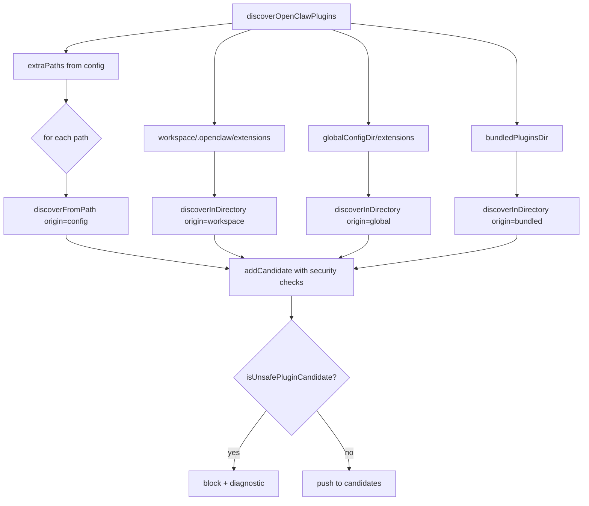
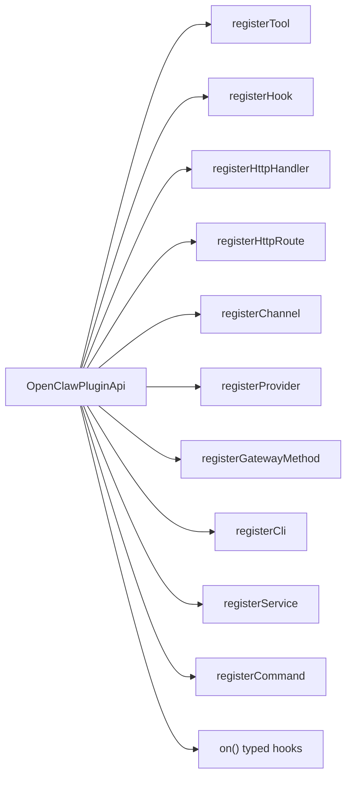
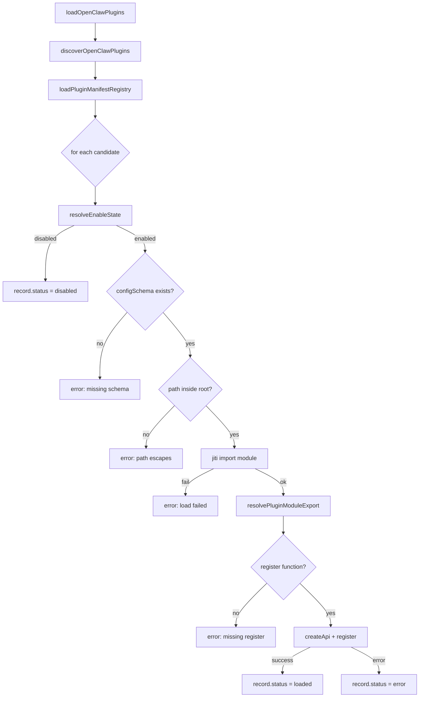

# PD-365.01 OpenClaw — 十扩展点 Manifest 驱动插件系统

> 文档编号：PD-365.01
> 来源：OpenClaw `src/plugins/registry.ts` `src/plugins/discovery.ts` `src/plugins/loader.ts`
> GitHub：https://github.com/openclaw/openclaw.git
> 问题域：PD-365 插件系统架构 Plugin Architecture
> 状态：可复用方案

---

## 第 1 章 问题与动机（≥ 30 行）

### 1.1 核心问题

Agent 系统需要在不修改宿主代码的前提下扩展能力——新增工具、接入新渠道、注册 LLM Provider、挂载 HTTP 路由、注入生命周期 Hook、添加 CLI 命令。传统做法是硬编码 `if/else` 分支或在配置文件中列出模块路径，但这会导致：

1. **扩展点碎片化**：每种扩展类型有独立的注册机制，插件作者需要学习多套 API
2. **安全边界模糊**：第三方插件可以访问宿主任意资源，没有路径沙箱和权限控制
3. **发现与加载耦合**：插件的"在哪里"和"怎么加载"混在一起，难以支持多来源（bundled/global/workspace/config）
4. **启用状态管理复杂**：allow/deny 列表、独占 slot（如 memory 只能有一个）、bundled 默认启用等规则交织

### 1.2 OpenClaw 的解法概述

OpenClaw 构建了一套完整的插件系统，核心特征：

1. **Manifest 驱动**：每个插件必须有 `openclaw.plugin.json` 声明 id、configSchema、kind 等元数据（`src/plugins/manifest.ts:7-21`）
2. **四层发现优先级**：config > workspace > global > bundled，同 id 高优先级覆盖低优先级（`src/plugins/manifest-registry.ts:16-21`）
3. **统一注册 API**：`OpenClawPluginApi` 提供 10 个 `register*` 方法，一个 `api` 对象搞定所有扩展点（`src/plugins/registry.ts:472-503`）
4. **23 种生命周期 Hook**：从 `before_model_resolve` 到 `gateway_stop`，覆盖 Agent 全生命周期（`src/plugins/types.ts:299-323`）
5. **路径安全检查**：symlink 逃逸检测、world-writable 检查、ownership 验证（`src/plugins/discovery.ts:65-161`）

### 1.3 设计思想

| 设计原则 | 具体实现 | 理由 | 替代方案 |
|----------|----------|------|----------|
| Manifest-first | `openclaw.plugin.json` 必须包含 configSchema | 无 schema 的插件直接拒绝加载，强制声明能力 | 约定式（index.ts 导出固定字段） |
| 四层优先级发现 | config > workspace > global > bundled | 用户配置优先于系统默认，workspace 隔离项目级插件 | 单一目录扫描 |
| 统一 API 表面 | 一个 `api` 对象包含所有 register 方法 | 插件作者只需学一套 API，降低认知负担 | 每种扩展点独立注册函数 |
| 同步 Hook 热路径 | `tool_result_persist` 和 `before_message_write` 强制同步 | 这些 Hook 在 JSONL 写入热路径上，async 会破坏事务性 | 全部 async |
| 独占 Slot 机制 | memory 类型插件只能激活一个 | 避免多个 memory 插件竞争写入 | 允许多个并自行协调 |

---

## 第 2 章 源码实现分析（≥ 60 行，核心章节）

### 2.1 架构概览

OpenClaw 的插件系统分为四个阶段：发现 → 清单注册 → 加载 → 运行时注册。

```
┌─────────────────────────────────────────────────────────────────┐
│                    Plugin Lifecycle                              │
│                                                                 │
│  ┌──────────┐   ┌──────────────┐   ┌────────┐   ┌───────────┐ │
│  │ Discovery │──→│ ManifestReg  │──→│ Loader │──→│ Registry  │ │
│  │           │   │              │   │        │   │           │ │
│  │ 4 origins │   │ JSON schema  │   │ Jiti   │   │ 10 types  │ │
│  │ security  │   │ dedup/rank   │   │ import │   │ of exts   │ │
│  └──────────┘   └──────────────┘   └────────┘   └───────────┘ │
│       ↓                ↓                ↓              ↓        │
│  candidates[]    manifestRecords[]   modules[]    PluginRegistry│
│                                                                 │
│  Security Layer:                                                │
│  - symlink escape detection                                     │
│  - world-writable path blocking                                 │
│  - ownership verification (uid check)                           │
│  - path-inside-root enforcement                                 │
└─────────────────────────────────────────────────────────────────┘
```

### 2.2 核心实现

#### 2.2.1 四层发现机制



对应源码 `src/plugins/discovery.ts:557-625`：
```typescript
export function discoverOpenClawPlugins(params: {
  workspaceDir?: string;
  extraPaths?: string[];
  ownershipUid?: number | null;
}): PluginDiscoveryResult {
  const candidates: PluginCandidate[] = [];
  const diagnostics: PluginDiagnostic[] = [];
  const seen = new Set<string>();

  // 1. Config paths (highest priority)
  for (const extraPath of params.extraPaths ?? []) {
    discoverFromPath({ rawPath: extraPath, origin: "config", ... });
  }
  // 2. Workspace extensions
  if (workspaceDir) {
    discoverInDirectory({ dir: ".openclaw/extensions", origin: "workspace", ... });
  }
  // 3. Global extensions
  discoverInDirectory({ dir: globalDir, origin: "global", ... });
  // 4. Bundled extensions
  if (bundledDir) {
    discoverInDirectory({ dir: bundledDir, origin: "bundled", ... });
  }
  return { candidates, diagnostics };
}
```

发现阶段的安全检查在 `src/plugins/discovery.ts:65-161` 实现，包含三层防御：

```typescript
// 1. Symlink 逃逸检测
function checkSourceEscapesRoot(params) {
  const sourceRealPath = safeRealpathSync(params.source);
  const rootRealPath = safeRealpathSync(params.rootDir);
  if (!isPathInside(rootRealPath, sourceRealPath)) {
    return { reason: "source_escapes_root", ... };
  }
}
// 2. World-writable 路径检查
if ((modeBits & 0o002) !== 0) {
  return { reason: "path_world_writable", ... };
}
// 3. 可疑 ownership 检查（非 bundled 插件）
if (params.origin !== "bundled" && stat.uid !== params.uid && stat.uid !== 0) {
  return { reason: "path_suspicious_ownership", ... };
}
```

#### 2.2.2 统一注册 API（十大扩展点）



对应源码 `src/plugins/registry.ts:472-503`：
```typescript
const createApi = (record: PluginRecord, params): OpenClawPluginApi => {
  return {
    id: record.id,
    name: record.name,
    config: params.config,
    pluginConfig: params.pluginConfig,
    runtime: registryParams.runtime,
    logger: normalizeLogger(registryParams.logger),
    registerTool: (tool, opts) => registerTool(record, tool, opts),
    registerHook: (events, handler, opts) => registerHook(record, events, handler, opts, params.config),
    registerHttpHandler: (handler) => registerHttpHandler(record, handler),
    registerHttpRoute: (params) => registerHttpRoute(record, params),
    registerChannel: (registration) => registerChannel(record, registration),
    registerProvider: (provider) => registerProvider(record, provider),
    registerGatewayMethod: (method, handler) => registerGatewayMethod(record, method, handler),
    registerCli: (registrar, opts) => registerCli(record, registrar, opts),
    registerService: (service) => registerService(record, service),
    registerCommand: (command) => registerCommand(record, command),
    on: (hookName, handler, opts) => registerTypedHook(record, hookName, handler, opts),
  };
};
```

每个 `register*` 方法内部都会：(1) 验证输入合法性 (2) 检查重复注册 (3) 更新 `PluginRecord` 的统计字段 (4) 推入 `PluginRegistry` 对应数组。

#### 2.2.3 加载流水线与启用状态决策



对应源码 `src/plugins/loader.ts:359-695`，启用状态决策在 `src/plugins/config-state.ts:164-195`：

```typescript
export function resolveEnableState(
  id: string, origin: PluginRecord["origin"], config: NormalizedPluginsConfig,
): { enabled: boolean; reason?: string } {
  if (!config.enabled) return { enabled: false, reason: "plugins disabled" };
  if (config.deny.includes(id)) return { enabled: false, reason: "blocked by denylist" };
  if (config.allow.length > 0 && !config.allow.includes(id))
    return { enabled: false, reason: "not in allowlist" };
  // Bundled plugins: only specific ones enabled by default
  if (origin === "bundled" && BUNDLED_ENABLED_BY_DEFAULT.has(id)) return { enabled: true };
  if (origin === "bundled") return { enabled: false, reason: "bundled (disabled by default)" };
  return { enabled: true };
}
```

### 2.3 实现细节

**Hook Runner 双模式执行**（`src/plugins/hooks.ts:125-255`）：

- **Void Hook**（fire-and-forget）：所有 handler 并行执行（`Promise.all`），用于观测类 Hook 如 `llm_input`、`message_sent`
- **Modifying Hook**（sequential merge）：按优先级顺序执行，结果逐步合并，用于可修改类 Hook 如 `before_tool_call`、`message_sending`
- **Sync Hook**（热路径）：`tool_result_persist` 和 `before_message_write` 强制同步执行，拒绝 async handler 返回 Promise

**独占 Slot 机制**（`src/plugins/slots.ts:37-108`）：memory 类型插件通过 `slots.memory` 配置指定唯一激活的插件 id，其他同类型插件自动禁用。

**Manifest Registry 缓存**（`src/plugins/manifest-registry.ts:47-49`）：200ms TTL 缓存，避免频繁文件系统扫描。缓存 key 只包含 workspace + loadPaths，不包含 allow/deny，提高命中率。

**命令注册安全**（`src/plugins/commands.ts:33-72`）：维护 RESERVED_COMMANDS 集合（help/stop/reset 等 30+ 内置命令），插件命令不能覆盖。执行时锁定注册表防止并发修改，参数经过控制字符清理和长度截断（4096 字符上限）。


---

## 第 3 章 迁移指南（≥ 40 行）

### 3.1 迁移清单

**阶段 1：基础插件框架**
- [ ] 定义 `PluginManifest` 类型（id + configSchema 必填）
- [ ] 实现 manifest 文件加载（JSON 解析 + 字段校验）
- [ ] 实现 `PluginRegistry` 数据结构（plugins/tools/hooks/channels 等数组）
- [ ] 实现 `createPluginRegistry` 工厂函数，返回 registry + createApi

**阶段 2：发现与安全**
- [ ] 实现多目录扫描（至少支持 workspace + global 两层）
- [ ] 实现路径安全检查（symlink 逃逸 + world-writable）
- [ ] 实现 `seen` 去重（同一物理路径不重复加载）
- [ ] 实现优先级覆盖（config > workspace > global > bundled）

**阶段 3：加载与注册**
- [ ] 集成 Jiti（或 tsx/ts-node）实现 TypeScript 插件热加载
- [ ] 实现 `resolveEnableState`（allow/deny/entries/bundled 规则）
- [ ] 实现统一 `OpenClawPluginApi`，至少包含 registerTool + registerHook
- [ ] 实现 configSchema 校验（JSON Schema 或 Zod）

**阶段 4：Hook 运行时**
- [ ] 实现 `createHookRunner`，区分 void hook（并行）和 modifying hook（串行合并）
- [ ] 实现优先级排序（`priority` 字段，高优先级先执行）
- [ ] 实现 catchErrors 模式（hook 错误不崩溃宿主）

### 3.2 适配代码模板

最小可运行的插件系统骨架（TypeScript）：

```typescript
// === plugin-manifest.ts ===
export type PluginManifest = {
  id: string;
  configSchema: Record<string, unknown>;
  name?: string;
  version?: string;
};

export function loadManifest(dir: string): PluginManifest | null {
  const manifestPath = path.join(dir, "plugin.json");
  if (!fs.existsSync(manifestPath)) return null;
  const raw = JSON.parse(fs.readFileSync(manifestPath, "utf-8"));
  if (!raw.id || !raw.configSchema) return null;
  return raw as PluginManifest;
}

// === plugin-registry.ts ===
export type PluginApi = {
  id: string;
  registerTool: (tool: ToolDefinition) => void;
  registerHook: (event: string, handler: HookHandler) => void;
};

export type PluginRegistry = {
  plugins: PluginRecord[];
  tools: ToolRegistration[];
  hooks: HookRegistration[];
};

export function createPluginRegistry(): {
  registry: PluginRegistry;
  createApi: (record: PluginRecord) => PluginApi;
} {
  const registry: PluginRegistry = { plugins: [], tools: [], hooks: [] };

  const createApi = (record: PluginRecord): PluginApi => ({
    id: record.id,
    registerTool: (tool) => {
      registry.tools.push({ pluginId: record.id, tool });
      record.toolNames.push(tool.name);
    },
    registerHook: (event, handler) => {
      registry.hooks.push({ pluginId: record.id, event, handler });
      record.hookNames.push(event);
    },
  });

  return { registry, createApi };
}

// === plugin-loader.ts ===
export function loadPlugins(dirs: string[]): PluginRegistry {
  const { registry, createApi } = createPluginRegistry();
  const seen = new Set<string>();

  for (const dir of dirs) {
    const manifest = loadManifest(dir);
    if (!manifest || seen.has(manifest.id)) continue;
    seen.add(manifest.id);

    const record: PluginRecord = {
      id: manifest.id, status: "loaded", toolNames: [], hookNames: [],
    };

    try {
      const mod = require(path.join(dir, "index.ts"));
      const register = mod.default?.register ?? mod.register ?? mod.default;
      if (typeof register === "function") {
        register(createApi(record));
      }
      registry.plugins.push(record);
    } catch (err) {
      record.status = "error";
      record.error = String(err);
      registry.plugins.push(record);
    }
  }
  return registry;
}
```

### 3.3 适用场景

| 场景 | 适用度 | 说明 |
|------|--------|------|
| 多渠道 Agent 平台 | ⭐⭐⭐ | 每个渠道（Telegram/Discord/Slack）作为独立插件，通过 registerChannel 接入 |
| CLI 工具扩展 | ⭐⭐⭐ | 通过 registerCli 让插件注册子命令，类似 git 子命令模式 |
| LLM Provider 适配 | ⭐⭐⭐ | 通过 registerProvider 注册新的模型供应商，含 OAuth 认证流程 |
| 单体应用内部模块化 | ⭐⭐ | 如果模块间耦合紧密，插件系统的隔离开销可能不值得 |
| 纯前端应用 | ⭐ | 路径安全检查、文件系统发现等依赖 Node.js 运行时 |

---

## 第 4 章 测试用例（≥ 20 行）

```typescript
import { describe, it, expect, vi } from "vitest";

// 基于 OpenClaw 真实函数签名的测试
describe("resolveEnableState", () => {
  const baseConfig = { enabled: true, allow: [], deny: [], loadPaths: [], slots: {}, entries: {} };

  it("should disable all plugins when enabled=false", () => {
    const result = resolveEnableState("my-plugin", "global", { ...baseConfig, enabled: false });
    expect(result.enabled).toBe(false);
    expect(result.reason).toBe("plugins disabled");
  });

  it("should block plugins in denylist", () => {
    const result = resolveEnableState("bad-plugin", "global", {
      ...baseConfig, deny: ["bad-plugin"],
    });
    expect(result.enabled).toBe(false);
    expect(result.reason).toBe("blocked by denylist");
  });

  it("should require allowlist when allow is non-empty", () => {
    const result = resolveEnableState("unlisted", "global", {
      ...baseConfig, allow: ["only-this"],
    });
    expect(result.enabled).toBe(false);
    expect(result.reason).toBe("not in allowlist");
  });

  it("should enable bundled plugins in BUNDLED_ENABLED_BY_DEFAULT", () => {
    const result = resolveEnableState("device-pair", "bundled", baseConfig);
    expect(result.enabled).toBe(true);
  });

  it("should disable bundled plugins not in default set", () => {
    const result = resolveEnableState("some-bundled", "bundled", baseConfig);
    expect(result.enabled).toBe(false);
    expect(result.reason).toBe("bundled (disabled by default)");
  });
});

describe("validateCommandName", () => {
  it("should reject empty names", () => {
    expect(validateCommandName("")).not.toBeNull();
  });

  it("should reject reserved commands", () => {
    expect(validateCommandName("help")).toContain("reserved");
    expect(validateCommandName("stop")).toContain("reserved");
  });

  it("should reject names starting with numbers", () => {
    expect(validateCommandName("123cmd")).not.toBeNull();
  });

  it("should accept valid names", () => {
    expect(validateCommandName("my-command")).toBeNull();
    expect(validateCommandName("tts")).toBeNull();
  });
});

describe("createPluginRegistry", () => {
  it("should track tool registrations on PluginRecord", () => {
    const { registry, createApi } = createPluginRegistry({ logger, runtime });
    const record = createPluginRecord({ id: "test", source: "/test", origin: "global", enabled: true, configSchema: true });
    const api = createApi(record, { config: {} });

    const mockTool = { name: "my-tool", execute: vi.fn() };
    api.registerTool(mockTool);

    expect(record.toolNames).toContain("my-tool");
    expect(registry.tools).toHaveLength(1);
    expect(registry.tools[0].pluginId).toBe("test");
  });

  it("should reject duplicate gateway methods", () => {
    const { registry, createApi, pushDiagnostic } = createPluginRegistry({ logger, runtime });
    const record = createPluginRecord({ id: "p1", source: "/p1", origin: "global", enabled: true, configSchema: true });
    const api = createApi(record, { config: {} });

    api.registerGatewayMethod("custom.method", handler1);
    api.registerGatewayMethod("custom.method", handler2); // duplicate

    expect(registry.diagnostics.some(d => d.message.includes("already registered"))).toBe(true);
  });
});

describe("Hook Runner", () => {
  it("should execute void hooks in parallel", async () => {
    const order: number[] = [];
    // Register two hooks with different delays
    registry.typedHooks.push(
      { pluginId: "a", hookName: "llm_input", handler: async () => { await delay(10); order.push(1); }, priority: 0, source: "" },
      { pluginId: "b", hookName: "llm_input", handler: async () => { order.push(2); }, priority: 0, source: "" },
    );
    const runner = createHookRunner(registry);
    await runner.runLlmInput(event, ctx);
    // Both should complete (order may vary due to parallel execution)
    expect(order).toHaveLength(2);
  });

  it("should execute modifying hooks sequentially by priority", async () => {
    registry.typedHooks.push(
      { pluginId: "low", hookName: "before_tool_call", handler: () => ({ block: false }), priority: 1, source: "" },
      { pluginId: "high", hookName: "before_tool_call", handler: () => ({ block: true, blockReason: "denied" }), priority: 10, source: "" },
    );
    const runner = createHookRunner(registry);
    const result = await runner.runBeforeToolCall({ toolName: "bash", params: {} }, { toolName: "bash" });
    expect(result?.block).toBe(true); // High priority wins
  });
});
```


---

## 第 5 章 跨域关联

| 关联域 | 关系类型 | 说明 |
|--------|----------|------|
| PD-04 工具系统 | 依赖 | `registerTool` 是插件系统的核心扩展点之一，工具通过插件注册进入 Agent 工具集 |
| PD-10 中间件管道 | 协同 | 23 种 Hook 构成了完整的中间件管道，`before_tool_call` / `after_tool_call` 等 Hook 本质上是中间件 |
| PD-06 记忆持久化 | 依赖 | memory 类型插件通过独占 Slot 机制管理，`before_compaction` / `after_compaction` Hook 让记忆插件参与压缩流程 |
| PD-05 沙箱隔离 | 协同 | 路径安全检查（symlink 逃逸、world-writable、ownership）提供了文件系统级别的插件隔离 |
| PD-11 可观测性 | 协同 | `llm_input` / `llm_output` / `agent_end` Hook 让可观测性插件无侵入地采集指标 |
| PD-03 容错与重试 | 协同 | Hook Runner 的 `catchErrors` 模式确保单个插件 Hook 失败不影响宿主和其他插件 |
| PD-09 Human-in-the-Loop | 协同 | `before_tool_call` Hook 可返回 `{ block: true }` 阻止工具调用，实现人工审批拦截 |

---

## 第 6 章 来源文件索引

| 文件 | 行范围 | 关键实现 |
|------|--------|----------|
| `src/plugins/types.ts` | L1-L764 | 全部类型定义：PluginApi、23 种 Hook 类型、10 种扩展点类型 |
| `src/plugins/discovery.ts` | L1-L626 | 四层发现机制 + 三层安全检查（symlink/writable/ownership） |
| `src/plugins/manifest.ts` | L1-L152 | Manifest JSON 加载与校验，package.json 元数据提取 |
| `src/plugins/manifest-registry.ts` | L1-L249 | Manifest 注册表：去重、优先级排序、TTL 缓存 |
| `src/plugins/loader.ts` | L1-L696 | 主加载流水线：发现→清单→Jiti 加载→注册→缓存 |
| `src/plugins/registry.ts` | L1-L520 | PluginRegistry 数据结构 + createApi 工厂（10 个 register 方法） |
| `src/plugins/hooks.ts` | L1-L754 | Hook Runner：void/modifying/sync 三种执行模式 |
| `src/plugins/config-state.ts` | L1-L226 | 启用状态决策：allow/deny/entries/slots/bundled 规则 |
| `src/plugins/commands.ts` | L1-L318 | 命令注册：保留字检查、参数清理、执行锁 |
| `src/plugins/tools.ts` | L1-L140 | 工具解析：optional 工具 allowlist 过滤、名称冲突检测 |
| `src/plugins/services.ts` | L1-L76 | 服务生命周期：start/stop 顺序管理 |
| `src/plugins/slots.ts` | L1-L109 | 独占 Slot：memory 类型只能激活一个插件 |
| `src/plugins/enable.ts` | L1-L57 | 配置级启用：allowlist 自动添加 + channel 联动 |
| `extensions/twitch/src/plugin.ts` | L1-L275 | 真实插件示例：Twitch 渠道插件（ChannelPlugin 接口实现） |

---

## 第 7 章 横向对比维度

```json comparison_data
{
  "project": "OpenClaw",
  "dimensions": {
    "插件发现": "四层优先级目录扫描（config > workspace > global > bundled）+ symlink/ownership 安全检查",
    "扩展点数量": "10 种 register 方法 + 23 种生命周期 Hook，覆盖 Tool/Channel/Provider/CLI/HTTP/Gateway/Service/Command/Hook",
    "Manifest 机制": "openclaw.plugin.json 强制声明 id + configSchema，无 schema 拒绝加载",
    "启用控制": "allow/deny 列表 + entries 逐插件配置 + 独占 Slot（memory 类型互斥）+ bundled 默认禁用",
    "Hook 执行模型": "三模式：void 并行、modifying 串行合并、sync 热路径同步；优先级排序",
    "安全边界": "路径逃逸检测 + world-writable 拦截 + uid ownership 验证 + 命令保留字 + 参数长度截断"
  }
}
```

### 域元数据补充

```json domain_metadata
{
  "solution_summary": "OpenClaw 通过 openclaw.plugin.json Manifest 强制声明 + 四层优先级发现 + 统一 PluginApi 十大 register 方法 + 23 种生命周期 Hook 三模式执行器，构建了完整的插件系统",
  "description": "插件系统需要平衡扩展灵活性与安全隔离，同时管理复杂的启用状态决策",
  "sub_problems": [
    "独占 Slot 互斥管理（同类型插件只能激活一个）",
    "Hook 执行模式选择（并行 vs 串行 vs 同步热路径）",
    "插件命令与宿主命令的命名空间隔离",
    "Manifest 缓存与文件系统变更检测"
  ],
  "best_practices": [
    "强制 configSchema 声明，无 schema 拒绝加载",
    "路径安全三层防御：symlink 逃逸 + world-writable + ownership",
    "Hook 热路径强制同步，拒绝 async 返回值",
    "命令注册保留字集合 + 执行期注册锁"
  ]
}
```
